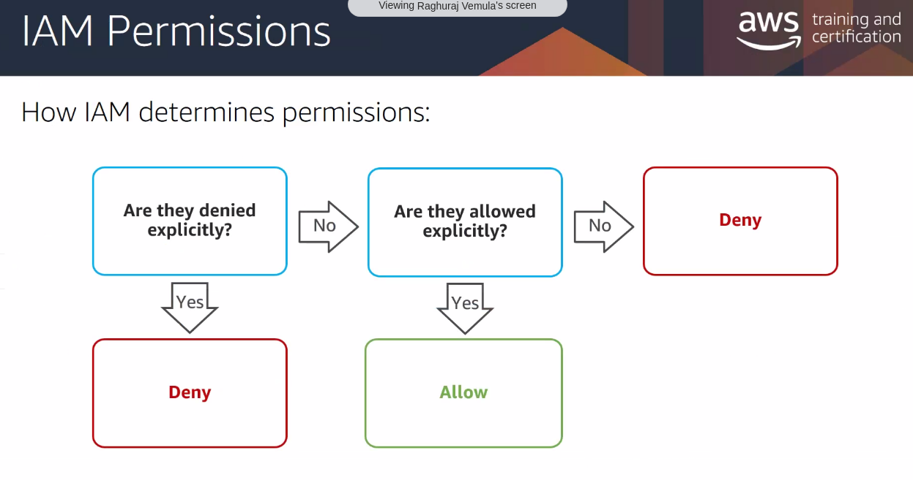
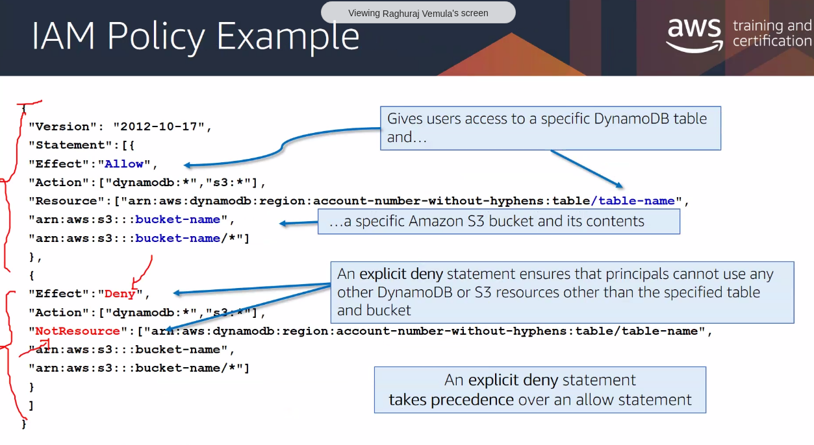
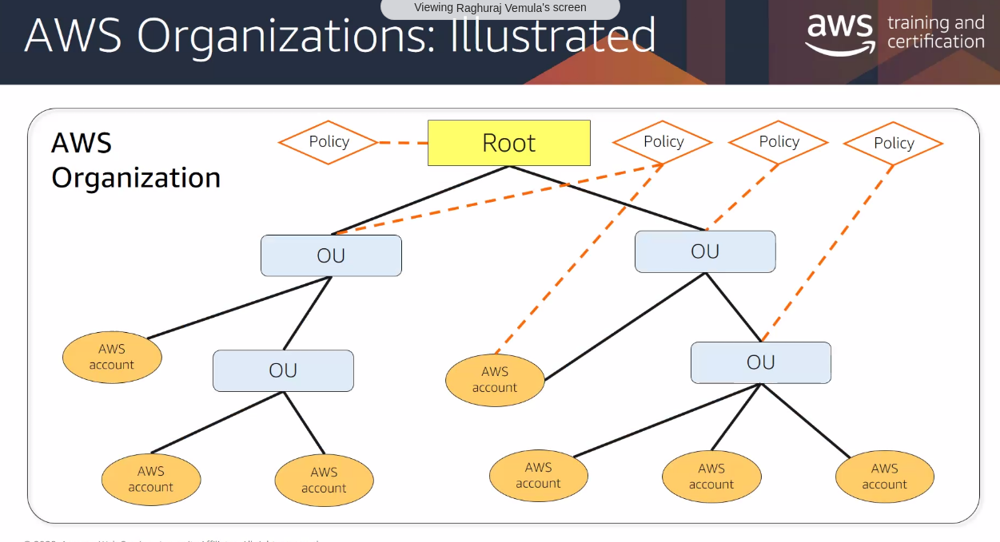

IAM policies
 - resource based policies
 - identity based policies

## IAM roles
- faceless identities
- Have permissions associated to it
- 
## Federating Users
external authentication

##  Amazon Cognito

## STS

## AWS Organizations
How to managage multiple AWS accounts in a single organization.

- One of the user cant access s3 bucket. How to diagnose this?
-- check bucket policy, then user's inline policy or group policy