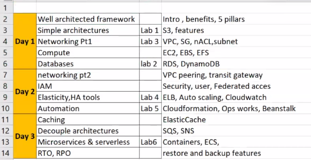
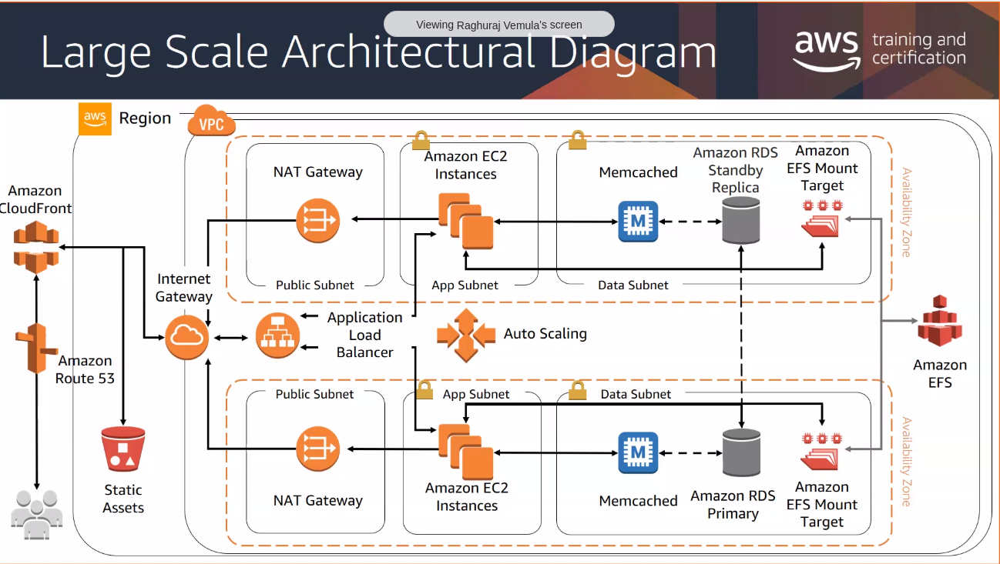

# Architecting on AWS

## The Internet Operating System
Late 90's 

- Amazon struggled to build applications quickly
- DB+Compute+Storage --- took 3 months
- Each team built their own resources, without thinking about scale and re-usability.

## Why the cloud adoption?
- stop guessing capacity - can run with varying capacity
- scalability and agility
- no need for maintaining and running a datacenter
- **focus on what matters** just focus on your business logic
- go global in minutes
- massive economies of scale (per unit cost is very low)

## AWS Well Architected Framework

**5 Pillars**
- Operational Excellence
    - Perform operations as code: Limit human error and enable consistent responses to events.
    - Make frequent, small, reversible changes: Make changes in small increments that can be reversed if they fail.
    - Refine operations procedures frequently: As workload evolves,  procedures should evolve along.
    - Anticipate failure: Test on failure scenarios and identify potential sources of failure.
    - Learn from all operational failures: Learn from all operation event that fails and share across to the entire team.

- Security
    - Implement a strong identity foundation: Providing the least required permission and enforce separation of duties through.
    - Enable traceability: Monitor, alert, and audit actions.
    - Apply security at all layers: Utilize multiple security controls.
    - Automate security best practices: Automated security mechanisms to improve security and scale more rapidly and cost-effectively.
    - Protect data in transit and at rest: Segregate data into sensitivity levels and use encryption, tokenization, and access control for data protection.
    - Keep people away from data: Eliminate the need for direct access or manual processing of data.
    - Prepare for security events: Create incident management and investigation policy.

- Reliability
    - Automatically failure recovery: Use key performance indicators (KPIs) to automation trigger a certain action when a threshold is breached.
    - Test recovery procedures: Use automation to simulate different failures and test recovery procedures.
    - Scale horizontally to increase aggregate workload availability: (Distribute requests across multiple, smaller resources to reduce failure this can be achieved using an Elastic Load balancer.
    - Stop guessing capacity: Auto Scaling to automate the addition or removal of resources.
    - Manage change in automation: Changes to the infrastructure should be made using automation.

- Performance Efficiency
    - Democratize advanced technologies: Delegating complex tasks to your cloud vendor.
    - Go global in minutes: Deploying your workload in multiple AWS Regions.
    - Use serverless architectures: remove the need for you to run and maintain physical servers for traditional compute activities.
    - Experiment more often: Carry out comparative testing using different types of instances, storage, or configurations.
    - Consider mechanical sympathy: Use the technology approach that aligns best with your workload.

- Cost Optimization
    - Implement cloud financial management: Utilize Cloud Financial Management /Cost Optimization to become a cost-efficient organization.
    - Adopt a consumption model: Pay only for the resources that you use,  increase or decrease resources depending on business requirements.
    - Measure overall efficiency: Monitor to know the gains you make from increasing output and reducing costs.
    Stop spending money on undifferentiated heavy lifting: AWS Manages data center operations like racking, stacking, and powering the server.
    - Analyze and attribute expenditure: Accurately identify the usage and cost of systems. This provides transparent attribution of IT costs to individual workload owners
    - Trusted Advisor service ( recommendation engine )
    - Autoscaling
    - Cost optimizer
    - AWS Pricing Calculator

# AWS global infrastructure
### Region (eg: Asia Pacific)
A geographical "region" which has AWS availability

- Each region has ~3 AZs ( separated by a few 100 km )
- Within the region, the AZs are connected via a dedicated low latency n/w

### AZ 
its a cluster of datacenters

# Simple Architectures

# AWS Well Architected Framework
- It is a service

# Definitions
### ARN
Amazon Resource Name

# Resources
- https://aws.amazon.com/blogs/apn/the-5-pillars-of-the-aws-well-architected-framework/
- https://aws.amazon.com/about-aws/global-infrastructure/
- https://aws.amazon.com/training/ramp-up-guides/

## Bhasad resources
- https://techcrunch.com/2016/07/02/andy-jassys-brief-history-of-the-genesis-of-aws/
- https://aws.amazon.com/blogs/aws/15-years-of-aws-blogging/

402754294257-3p8o59hbjmvo876bostb5uoq9uldvcmo.apps.googleusercontent.com