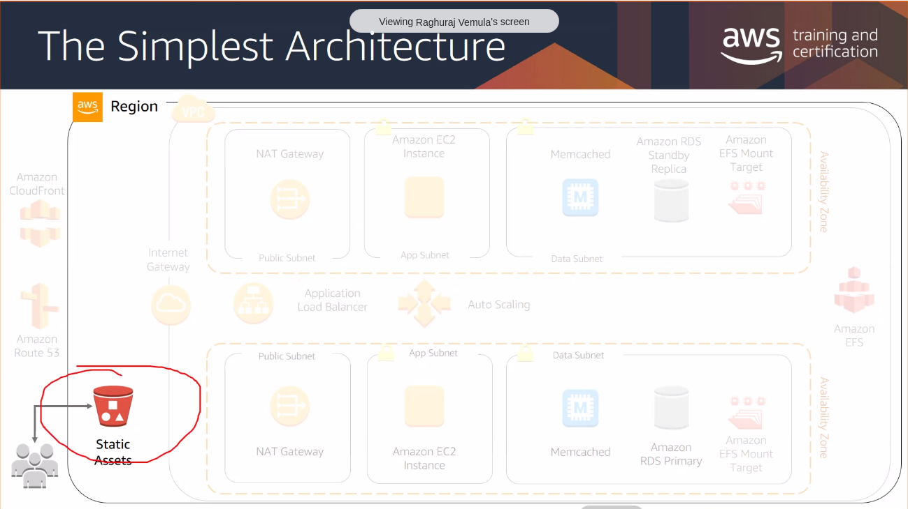
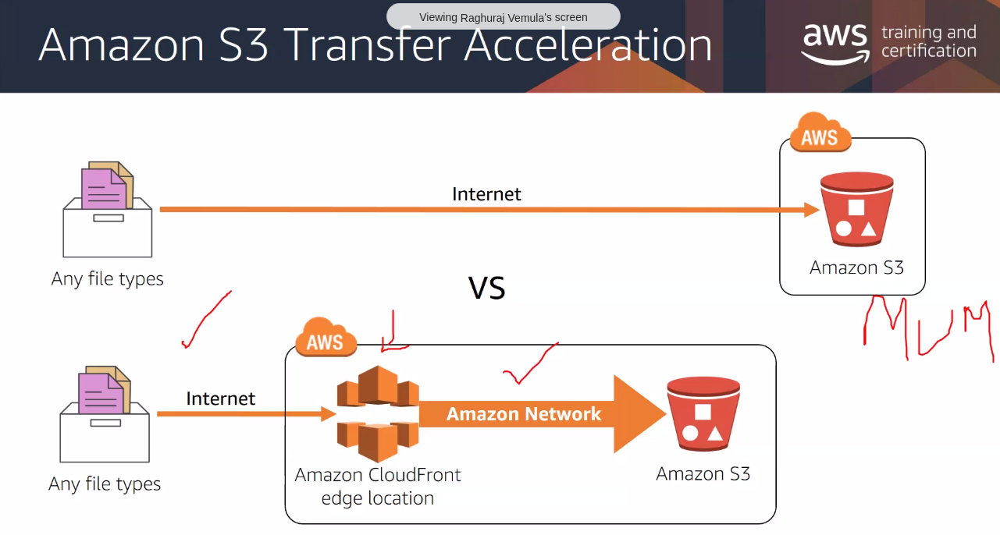
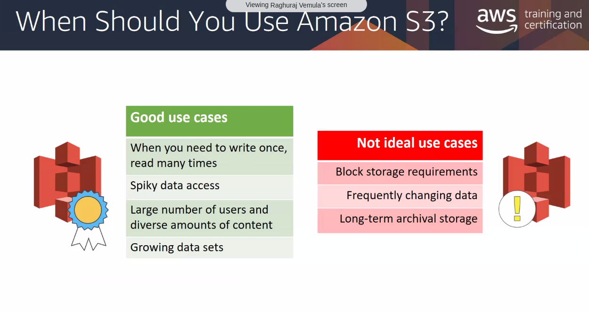
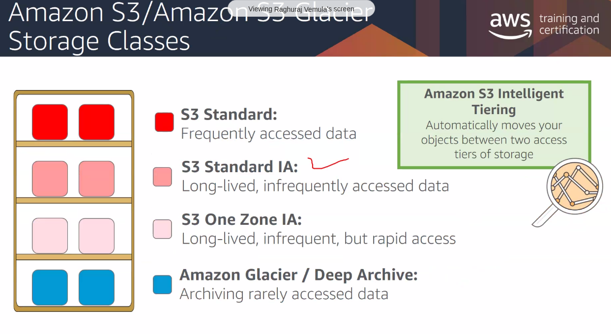

- used for clickstream analytics
- ..financial transaction analysis
- ..media transcoding

# Object Storage

#### 99.999999999% durability
_What is the possibility of you losing the data_

Every object is replicated across AZs. (atleast 6 copies).

s3 can scale for you (what if suddenly a million users access the same object)
## Bucket
_Logical Container for objects_
An Amazon S3 bucket name is globally unique, and the namespace is shared by all AWS accounts. This means that after a bucket is created, the name of that bucket cannot be used by another AWS account in any AWS Region until the bucket is deleted.
- needs a unique name across accounts.
- needs to be in a particular region.

## Access control
- By default, public access is blocked.
- you can provide granular access
    - bucket policy (JSON)
    - ACL
    - Access Points

## Transfer acceleration
 - multi part upload : to speed up upload for larger files
 - via cloudfront: people will upload to the CDN, CDN will send it to s3
 

 ## When to use s3
 

 ## S3 storage classes
 

 ## Glacier?
 It needs to be first retrieved from tape and all..and then

# Resources
- https://aws.amazon.com/what-is-cloud-object-storage/