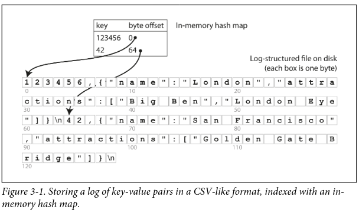
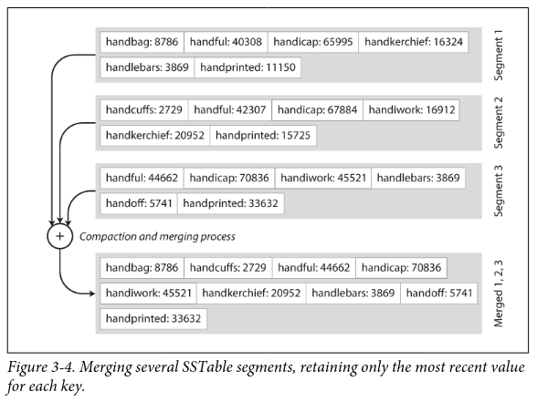

# Ch3&mdash; Storage and Retrieval

## Overview

Why? &mdash; to suit your needs, to choose a kind of DB, you need to have a rough idea of what the storage engine is doing under the hood

Big Difference &mdash; in storage engines optimized for

- Transactional workloads (OLTP)
  - Huge volume of requests
  - touch only small number of records in each query
  - queries depend on a key; index is made on that key
  - Disk seek time is the bottleneck here
- Analytical workloads (column oriented storage) (OLAP)
  - used by business analysts
  - low volume of queries
  - each query will need scan millions of records
  - indexes are less relevant
  - encoding data compactly is very important, to minimize the amount of data the query needs to read from disk
  - Disk Bandwidth is the bottleneck here
  - Column oriented DBs suit well here

OLTP have two schools of thought

- log structured school
  - only permit appending to files & deleting obsolete files (no overwrites)
  - good for disks and SSDs ( avoid fragmentation by appending nearby) (higher write throughput)
  - HBase, Cassandra , Lucene
  - SSTables, LSM Trees
- update-in-place school
  - page oriented
  - Treats disk as fixed size pages that can be overwritten
  - BTrees

#### World's simplest DB

_append only sequence of records_ (sounds like logs? yeah)

**record = Key value pairs** where value  can be JSON document

- APPEND key value pairs to the end of the _file_ (awesome performance)
- SEARCH the entire file for keys when queried (bad bad performance) O(n)
- an UPDATE, is just an APPEND at the end of the file with new value for the same key
  
CONS? &mdash; 

- reclaiming space so that the log doesn't grow forever
- handling errors and partially written records

## Index

Index is an **additional** data structure derived from primary data

Index &mdash; a trade off;  

- speeds up reads
- slows down writes

Log structured indexes &mdash; Hash Indexes, SSTables and LSM trees

Page strucured indexes &mdash; BTrees

### Hash Indexes

Scenario

- append only DB as discussed above
- _in-memory_ hashmap (key -> offset) [ the offset helps you "seek" to the location in O(1)]
- as you append key-value pairs, you also update the hashmap
- every "update" is nothing but an append
  
CONS

- all keys need to fit in memory.
- if we just keep on appending to the file, it just grows way too large (segmentation and compaction and merging wil solve this issue)

##### Segmentation and Compaction

Break the logs into _segments_ of certan size. close the file when a segment reaches its max limit, &rarr; write to new segment

Then, later on, do _compaction_ on these segments ( throw away duplicate keys, keeping only the recent update for each key)

Since compaction makes segment sizes smaller, Compacted segments can then be merged into  new segment, throwing away the old segments.(Why? &mdash; merging process keeps the number of segments small, so lookups dont need to check many hashmaps[each segment has one hashmap]) &mdash; this can be done in a background thread.

real implementation &mdash;

- File Format
  - csv is poor. binary format is faster and simpler
  - first store length of the string in bytes
  - ...followed by the raw string in bytes
- Deleting records
  - append a special deletion record called _tombstone_
  - during merge, discard all prev values for the deleted key
- Crash recovery & partially written records
  - in-memory hashmaps are lost
  - you can ofcourse regenerate the hashmap for a segment by going through all records
  - better to just store snapshot of the in memory hashmap in disk
  - use checksums for detecting and ignoring partially written records
- Concurrency control
  - only one writer thread to append in strict sequential order
  - multiple reader threads for reads.

#### Pros of Hash Indexes

- appending and segment merging are sequential write operations &mdash; much faster than random writes
- Concurrency and crash recovery are simpler if append-only and immutable
- merging segments avoids disk fragmentation over time.

#### Cons of Hash Indexes

- hash table must fit into memory. what if you have large number of keys
- range queries are inefficient. " scan all keys between X and Y " &mdash; you have to lookup all keys one by one in hash map

### SSTables and LSM-Trees

Sorted String Tables &mdash; 
Sort the "logs" of key values pairs...by the key

Merging segments is just merge sort algo. The merged segment is automatically sorted by the key. if same key appears in multiple segments, consider the key value in the newest segment.

No need to maintain a index(hashtable) of ALL keys in memory. split the segment into blocks and store only offsets of the first key in the block. then for every key that you are searching, you can start at an offset and then do linear search until you find the key.
You DO need an index of few keys though, not totally ignore the index. But the number ofkeys in the index is considerably smaller now because of sorted nature of the segment. saves disk space.

##### How to maintain sorted order ? (LSM - Log structured merge trees)

In disk &mdash; BTrees
In memory &mdash; self balancing trees - AVL tree, red-black tree

Writes

- add to the in-memory self balancing tree (memtable)
- when memtable gets bigger than threshold, write to an SSTable file. tree is already sorted---so its efficient.
- Continue the writes to the memtable as the memtable is being written out to disk
- from time to time..run merging and compaction in background.
- high write throughputs - because writes are sequential

Reads

- first find the key in the memtable
- if not found, search the most recent on-disk segment
- if not found, search the next recent on-disk segment.
- looking up keys that are NOT in the DB can be very expensive
  - Use **Bloom filters**
- Because keys are already sorted, you can do range queries

Crash recovery? 
memtable is lost if crash happens. (this memtable is not yet written to disk). So write every single write to a log file. This will not be sorted ofc. but its purpose is just to restore memtable after a crash.

**Lucene**&mdash; full text search
Uses LSM trees. Key="terms" value=List of all documents in which that key occurs. So Lucene stores its term dictionary in LSM trees.

<https://yetanotherdevblog.com/lsm/>

### B-Trees

Keeps key-values sorted by key

- efficient lookups
- range queries

Pages

- fixed size "Pages" (~4KB in size)
- read/write one page at a time
- "tree" of pages &mdash; with a root page; where all lookups start
- depth = O(logn) with 3 or 4 levels deep generally
  - a 4 lvl tree of 4kb page size with branching factor of 500 can store 256 TB
- The "leaf" page contains the value for each key
- **Branching factor** = number of references to child pages in one page (~several 100s)
- Updates = search for the leaf page containing the key, **change the value in that page, write back that page to the disk**
- Inserts = you grow a BTree by splitting a page
- The tree is ensured to be balanced

BTrees modify data _in-place_, overwriting Pages. Quite dangerous when inserts dont have a place in the page -> require page to be split and rewritten to two separate pages (what if a crash happens)

Crash recovery&mdash;

- **Write Ahead Logs** : append-only file to which every B tree modification is written before it can be applied to the pages of the tree itself.
- When DB comes back after crash, this log is used to restore the B-tree back to a consistent state

B-tree Optimisations

- copy-on-write scheme
- abbreviate the key and store it instead of storing the entire key. (Pack more keys into a page)
- try to lay out leaf pages in a sequential order on disk
  - tough to maintain this as tree grows
- B+trees : each leaf page has pointers to sibling pages to avoid jumping back to parent pages

# Notes

- Cassandra and HBase use storage engines similar to LSM trees. Inspired by Google Bigtable paper.
  - (All are Column oriented DBs)
