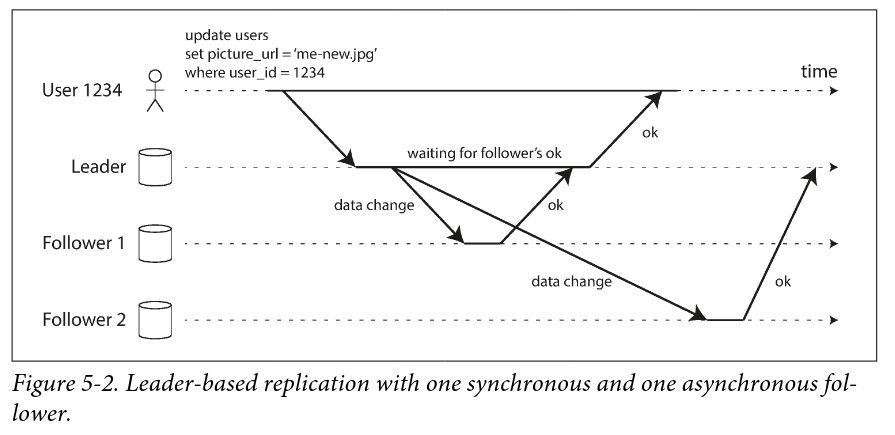
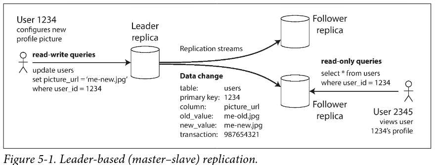
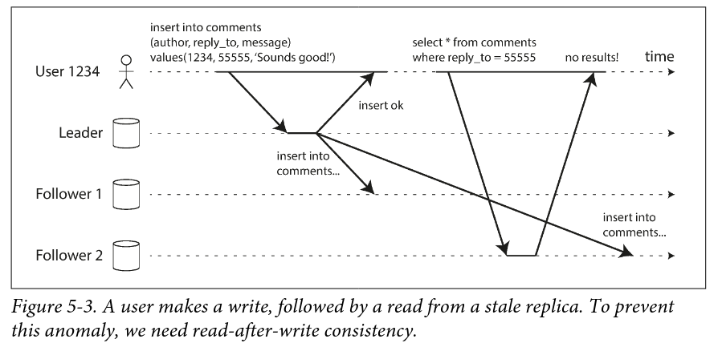
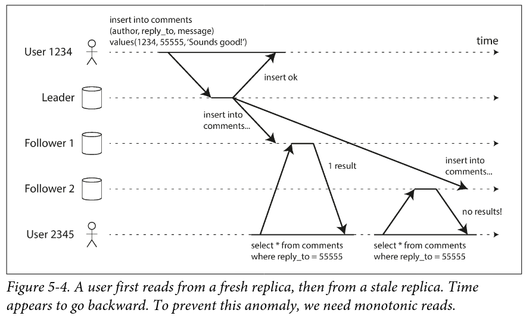
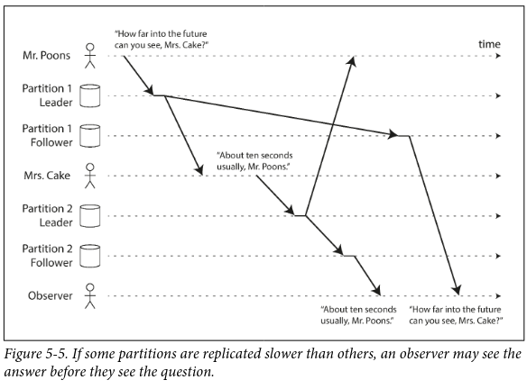
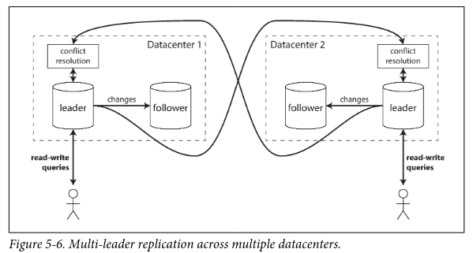
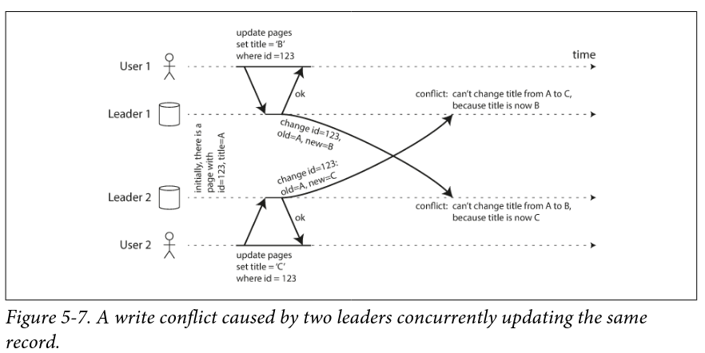
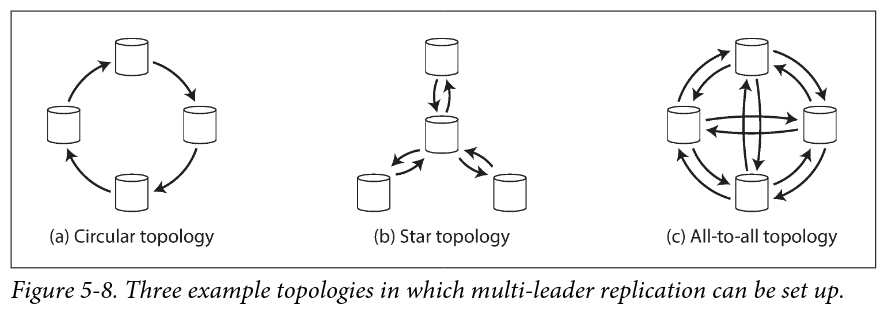
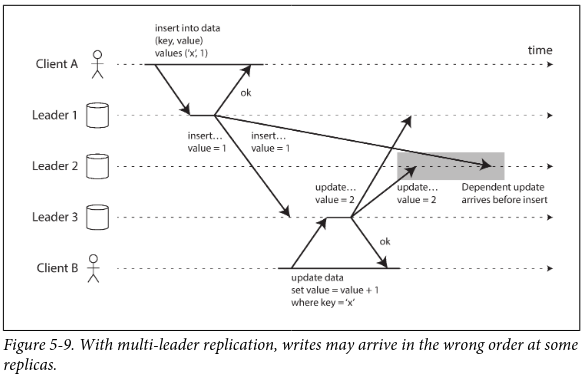

This chapter is all about **replication**

## Why Replicate?

- HA
- latency
- increase read throughput

## Why do you need **Leaders** for replication?

if the data being replicated doesnt change, no issues. All problems arise when we want to handle the CHANGE to the replicated data

> How do we ensure that all data ends up in all replicas? Every write needs to be processed by every replica -> else stale data

Almost all distributed databases use one of these three approaches to replication

- single leader replication
  - Client sends all the writes to a single node(LEADER)
  - LEADER sends stream od data change events to other replicas (FOLLOWERS)
  - reads can be done on any replica
  - reads from FOLLOWERs can be stale
- multi leader replication
  - Client sends a write to one of the many LEADERs
  - LEADERS send the data change events to other LEADERs and FOLLOWERs
- leaderless replication
  - Client sends each write to several nodes
  - Client reads from several nodes in parallel (to detect and correct nodes with stale data)

## Trade offs in replication

Asynchronous replication?? synchronous replication?? which one?

- in Sync, the leader waits until the folllower has confirmed that it recieved the write before reporting success to the user
- in Async, the leader doesnt wait for a response from the follower

Advantages of Sync

- followers are guaranteed to have up-to-date copy , consisted with the leader.

Disadvantage of Sync

- if the follower doesnt respond(crash, fault), the write cannot be processed
- the leader must block all writes and wait until the replica responds.
- one node outage will fail the entire system (Single point of failure)

> in practice, if you enable "Synchronous replication" on a DB, it means that ONE of the followers is sync, others are async. (**semi synchronous**)

Advantage of Async

- fast
- leader can continue processsing writes, even if all followers have fallen behind.
  
Disadvantage of Async

- if leaders fails, any writes that have not yet been replicated...are lost.
- write is not durable, even if it has been confirmed to client that the write is "done"
- async is fast when system is running smoothly
- but sucks when replication lag increases and servers fail
- if a leader fails and you promote an async updated follower to be the new leader, recently commited data may get lost.

How to handle failed replicas??

# Single Leader Replication

other names...

- leader based replication
- active/passive replication
- master/slave replication

### Setting up a new Follower

1. take a snapshot of the leaders DB at a point in time.
2. copy the snapshot to new follower node
3. the follower connects to the leader and asks for all the data changes that have happened SINCE the snapshot has been taken.
4. Follower has now "caught up"

### Implementing replication logs

_How leader-based replication work under the hood_

- Statement based replication
  - every INSERT, UPDATE, DELETE sql statement is forwarded to followers
  - each follower executes the SQL stmt as if it was received from client.
  - CONS
    - non deterministic functions (NOW(), RAND()) will generate different value in each replica
    - autoincrementing columns will suffer in the same way. Need to ensure theyre executed in same order in every replica
    - stmts which depend on existing data in DB (UPDATE..WHERE< condition >) will suffer in same way. Need to ensure theyre executed in the same order on every replica
    - stmts with side effects (triggers, stored procs) will produce different side effects on each replica
- WAL (Write-ahead log) shipping
- Logical (row-based log) log shipping
- Trigger-based replication

### Problems with Replication Lag

**Replication Lag**: the delay b/w write happening on the leader and being reflected on the follower

if an app reads from async follower, it may see outdated info if the follower has fallen behind (inconsistency)

- **read-your writes consistency**
  - 
  - AKA read-after-write consistency
  - its the ability to view changes (read data) right after writing those changes.(upon page reload etc)
  - How to achieve?
    - read from the leader if you wrote something (via the leader ofcourse), otherwise read from the follower
    - read from the leader for one minute after the last update.
    - Use logical timestamps. Client keeps track of the logical TS, and reads from the replica that has caught up with that TS
    - If replicas are across data centers, read requests to the leader must be sent to the datacenter containing that leader
  - Cross-device read-after-write consistency. How to achieve?
    - User writes with mobile, and reads on PC
    - if replicas are across datacenters, route ALL of users devices to same datacenter.
    - metadata for each device needs to be centralized(logical timestamps)
- **Monotonic reads**
  - 
  - Is a guarantee that "moving backward in time" doesnt happen. What is that? if a write request is sent to the leader and the follower lags behind to recieve the update, the user reading from the  fresh follower, followed by a stale follower will see new data and then old data , "moving backward in time".
  - Its a guarantee that users will not read older data AFTER having previously read newer data
  - Monotonic reads is a lesser guarantee than strong consistency but a stronger guarantee than eventual consistency.
  - How to achieve?
    - make sure ALL of users requests are routed to  a single replica. based on userID's hash or something.
- **Consistent prefix reads**
  - 
  - This guarantee says that if a sequence of writes happen in a certain order, then anyone reading those writes will see them appear in the same order.(Mr Poons and Mrs Cake)
  - this is a problem in partitioned databases

# Multi-Leader Replication

- aka master-master replication
- aka active-active replication
- natural extension of single leader replication
- prevents Single Point of failure for writes.
- _each LEADER acts as a FOLLOWER for other leaders_

### Single vs multi leader (PROS)

- **Performance**
  - high latency in single leader writes
  - in multi leader, every write can be processed in the local datacenter and is replicated ASYNC to other datacenters
  - percieved performance is better....datacenter network delay is HIDDEN from users
- **Datacenter outage tolerance**
  - in single leader, FAILOVER will promote a FOLLOWER in another datacenter to a LEADER.
  - in multi leader, each datacenter can continue to operate independently
  - replication CATCHES UP when failed datacenter comes back online
- **Network problem tolerance**
  - in single leader, writes are made synchronously over the unrealiable link (across datacenters)
  - in multi leader, its async replication...can tolerate n/w problems better.
  - a temporary network problem wont prevent write processing

### Single vs multi leader (CONS)

Multi leader replication is considered dangerous, and should be avoided if possible

- **Conflicts**
  - same data may be concurrently modified in two different datacenters, such write conflicts must be resolved.
- **autoincrementing keys, triggers, integrity constraints**

### Usecases

- multi datacenter operation
  - a LEADER in each datacenter
  - within a datacenter, regular leader-follower replication is used
  - across datacenters, each leader replicates its changes to leaders in other datacenters
- Clients with offline operation
  - disconnected from internet
  - calendar apps
  - if you make any changes offline, it needs to be synced with a server and your other devices when the device is next online
  - every device has a local DB which acts as a LEADER
  - each device is a "datacenter"
  - there is async multi leader replication process between the replicas of your calendar on all your devices.
  - _**couchDB** is designed for this mode of operation_
- Real time Collaborative editing
  - google docs
  - changes are instantly applied to local replica(browser)
  - async replicated to the server and other collaborative users
  - you would need to LOCK edits to avoid conflicts
  - but you can better handle this by making the unit of change very small (single keystroke) and avoid LOCKing

### Handling Write conflicts

Biggest problem in multi leader replication &mdash; write conflicts

Synchronous conflict detection

- used in single-leader
- second writer will block and wait for the first write to complete
- it can also abort the second write and force the user to retry the write
- you could do this in multi leader, but it will suck because main advantage of multi leader setup is gone &mdash; ability to accept writes in each leader simultaneously

Asynchronous conflict detection

- used in multi leader
- both writes are successful
- conflict is detected async at some later point in time.
- it may be too late to ask the user to resolve the conflict

#### Conflict avoidance

- _SIMPLEST STRATEGY_
- _RECOMMENDED APPROACH_
- ensure that all writes for a particular record go through the same leader - no conflicts
- eg: when user edits his own data, it can go into his "home datacenter" always (single leader from user's point of view)
- conflict avoidance breaks if the datacenter changes because of
  - failover
  - user moved to another geographic location

#### Conflict resolution

DB must resolve conflicts in a convergent way, i.e all replicas must arrive at the same final value after replication

How to achieve this?

- LWW &mdash; Last write wins
  - each write has a unique ID (say TS)
  - highest ID is the winner
  - prone to data loss, DANGEROUS
- replica with higher uniqueID wins
  - each replica has a unique ID
  - prone to data loss, DANGEROUS
- merge the values
  - concatenate them, for eg.
- record the conflict
  - in an explicit data structure
  - application code will resolve the conflict later
  - optionally by prompting the user
- on write
  - call custom application logic as soon as DB detects a conflict in the log of replicated changes
  - runs in background
- on read
  - store all conflicting writes
  - when read, present these writes to the application
  - application will automatically resolve conflict and write to DB
  - (optionally, prompt the user)
  - CouchDB works this way

## Multi leader Replication topologies

**circular and star** : one leader fails, it will break the data forwarding

**all-to-all**: seems good at first, but will suck when it breaks causality

we need to make sure all nodes process the insert first, and then the update.
To order these events correctly, use **version vectors**

_conflict detection techniques are poorly implemented in many multi -leader replication systems_
