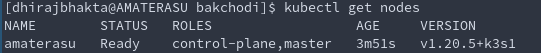

# Introduction

K8s exists to simplify the task of building, deploying and maintaining distributed systems.
Its important to understand the **core challenges of distributed systems** that led to the development of k8s.

You care only about your application. You just want it deployed... in one logical unit that abstracts everything underneath....**The Cluster**

You just want to _define_ the application in a YAML file (manifest), and let Kubernetes handle the rest.

**"The rest"?**

- Say a `node` in the cluster just died, and killed off some containers with it
  - Kubernetes will see this and starts replacement containers on the host
- Say a container became "unhealthy"
  - Kubernetes will restart it.
- Say a `component` is under high load/stress.
  - Kubernetes will start extra copies of the component in new containers.

**Your Job** :-> Define the Dockerfile and the kubernetes YAML file properly. You specify WHAT you want to happen

**K8s' Job** -> Make sure `CURRENT STATE == DESIRED STATE` ( a self healing app ). It figures out HOW to make it happen.

# Course Objectives
- Core Concepts
    - Kubernetes architecture
    - Create and configure Pods
- Configuration
    - ConfigMaps
    - Secrets
    - ServiceAccounts
    - SecurityContexts
    - Resource requirements
- Multi-Container Pods
    - Ambassador Pattern
    - Adapter Pattern
    - Sidecar Pattern
- Observability
    - Readiness and Liveness Probes
    - Container Logging
    - Monitor and Debug Applications
- Pod Design
    - Labels, Selectors and Annotations
    - Rolling updates & Rollbacks in deployment
    - Jobs and CronJobs
- Services and Networking
    - Network Policies
- State Persistence
    - Persistent Volumes
    - Persistent Volume Claims


# Terminologies [brief]
- Container Orchestrator
- Kubernetes "objects"
- Kubernetes "controller"
- Pods
- Labels and Annotations
- Services
- Ingress
- ReplicaSets
- Deployments
- DaemonSets
- Jobs
- ConfigMaps
- Secrets
- Kubernetes "operator"
- RBAC
- Service Mesh
- Persistent Volume 
- Persistent Volume Claim


## Container Orchestrator

- You have many nodes
- You want to run your "service(s)" on all those nodes, with replicas of each service
- container orchestration is the automation of much of the operational effort required to run containerized workloads and services.
  - provisioning
  - deployment
  - scaling (up and down)
  - networking
  - loadbalancing

### What problems does Kubernetes solve?

- rise of microservices -> rise of container tech
- increased use of containers
- managing 1000s of such containers using scripts and self made tools made it complex and irritating
- scaling , deployment and recovery
- what if one of the container goes down?
- HA(no downtime).
- checking if one container has crashed across multiple nodes is hard
- K8s automatically checks the health of every container
- ensures that theyre always running
- K8s can spin up multiple containers (horizontally scale) and have a load balancer in front of it
- easy rollback
- Not restricted to any cloud provider
  - AKS (Azure)
  - EKS (AWS)
  - GKE (GCP)
- Automatically configures your infra
- speeds up deployment
- allows you to build complex apps
- Kubernetes brings infra level concerns like the following into app configuration
  - Load balancing
  - networking
  - storage
  - compute

### What do we mean by "reliable, scalable distributed systems"?

- more and more services are delivered over the network via APIs
- these APIs are often delivered by a distributed system, the various pieces that implement the API running on different machines, connected via the network and coordinating their actions via n/w communication.
- These systems must be _highly reliable_, they cannot fail, even if a part of the system crashes or stops working
- They must  _available_ even during rollouts and other maintainence events
- They must be _scalable_, so that they can grow their capacity to keep up with increasing usage without radical redesign of the distributed system.

### ECS, Mesos, Cloudfoundry, Marathon, ...wtf??

These are cloud-specific  orchestrator offerings

But Kubernetes and Docker Swarm is infrastructure agnostic
Cloud will deploy/manage Kubernetes for you. Also, Infrastructure vendors are making their own distributions of Kubernetes.

Independence and standardization are the main reasons Kubernetes is so popular. Once you have your apps running nicely in Kubernetes you can deploy them anywhere, which is very attractive for organizations moving to the cloud, because it keeps them free to move between data centers and other clouds without a rewrite. It's also very attractive for practitioners - once you've mastered Kubernetes you can move between projects and organizations and be very productive very quickly.

#### Which Distribution of Kubernetes should I choose?

- You can choose a cloud distribution (AWS EKS, GKE)
- Self managed (Docker Enterprise, Rancher, Openshift, Canonical, VMWare PKS)
- ! Dont use the pure upstream Github Kubernetes!

#### whats all this minikube, microk8s, k3s

- This is for local development.
- Single node cluster

> The primary goal of minikube is to make it simple to run Kubernetes locally, for day-to-day development workflows and learning purposes.

- k3s
  - `curl -sfL https://get.k3s.io | sh -s - --docker --disable=traefik --write-kubeconfig-mode=644`

#### Kubernetes vs Swarm

- Swarm :- EASY
- Kubernetes :- FEATURES & FLEXIBILITY

#### Immutable Infrastructure

#### Declarative Configuration

- IaaC - Infrastructure as a Code : the idea of storing declarative configuration in source control.
- as opposed to imperative configuration, where the state of the world is defined by the execution of a series of instructions.

### Self Healing Systems

_continuously_ take actions to ensure that the current state matches the desired state.

- Operator Pattern:
  - more advanced logic needed to maintain, scale, and heal a specific piece of s/w(like MySQL, or Prometheus) is encoded into an **operator application** that runs as a container inside the cluster.
  - The code in the operator is responsible for more targeted and advanced health detection and healing that can be achieved via Kubernetes' generic self-healing.

<hr/>
<hr/>

# Kubernetes

### Basic Architecture


Node: A machine. ( host/machine/Ec2/VM etc ) with defined CPU and RAM<br>

- one(or more) Master Node(s)
  - runs kubernetes processes to run and manage the **worker Nodes**.
  - It has the following running
    - **the API server** (which is also a container)
      - Frontend for Kubernetes
      - Communicates with kubelet on worker nodes
      - kubectl talks to the API server.
    - **the Scheduler** (where to put the pod?)
      - checks for "tasks"-to create and assign pods from the Controller manager
    - **the Controller manager** (detect crashes of pods, and recover) (brain behind orchestration)
      - runs reconciliation loop.
      - keeps looking at current state - desired states configs and creates tasks(task to create pods) for the **scheduler** to assign to nodes.
    - **the etcd** (key value store of cluster state)
      - stores the current state config and desired state config
      - etcd is distributed, reliable key-value store
- multiple worker Nodes
  - worker node is where actual applications are running.
  - ...is where containers run.
  - each worker node has the following
    - **Kubelet**
      - Kubelet talks to the containers through the CRI interface (Container Runtime Inteface)
      - communicates with the master node
      - makes sure that the containers are running within pods
    - **Kube Proxy**
      - allows for n/w communication inside and outside the node.
      - responsible for routing n/w traffic to load balanced services in the cluster. Kubeproxy runs using DaemonSet.
      - Note that many of the kubernetes control plane components are run using kubernetes itself!
    - **Container runtime**
      - Kubernetes doesnt care what container runtime you use. containerd? docker? rkt? cri-o? no issues.
  - each node has one or more containers running on it


- API
  - define your applications
- Cluster
  - runs your applications
  - made of multiple **Nodes**
  - A cluster is a set of individual servers that have all been configured with a container runtime like Docker, and then joined into a single logical unit with Kubernetes

A cluster is a set of individual servers/nodes/hosts which have all been configured with a container runtime like Docker, and then joined together into a single logical unit with Kubernetes. The cluster, as one logical unit, runs your application. In normal usage you forget about the underlying nodes and you treat the cluster as a single entity. You can add Nodes to expand the capacity of your cluster.
A Kubernetes cluster consists of a set of worker machines, called nodes, that run containerized applications. Every cluster has at least one worker node
The worker node(s) host the Pods that are the components of the application workload. The control plane manages the worker nodes and the Pods in the cluster. In production environments, the control plane usually runs across multiple computers and a cluster usually runs multiple nodes, providing fault-tolerance and high availability.

### Basic flow

- You define your app in YAML files(manifest files)
- You send that YAML file to the Kubernetes API(via kubectl)
- Kubernetes compares the YAML and what’s already running in the cluster.
  - and tries to get to a desired state
  
## Kubernetes API?

Everything contained in Kubernetes is represented by a RESTful resource. Each Kubernetes object exists at a unique HTTP path, eg: `https://your-k8s.com/api/v1/namespaces/default/pods/mypod` leads to the representation of a Pod in the default namespace named `mypod`.

`kubectl` uses this API under the hood.<br>
To <u>Query and manipulate</u> the state of **objects** in Kubernetes <br>
Objects? := Pod || Deployment || Namespaces etc

Objects in the kubernetes API are represented as JSON or YAML files.These files are einter returned by the server in response to a QUERY or posted to the server as a part of an API  REQUEST.

`kubectl get <resourcename>`

`kubectl get <resourcename> <objectname>`

output as JSON or yaml? `-o json` or `-o yaml`

output a particular field? `-o jsonpath --template{.status.podIP}`

```
kubectl get pods my-pod -o jsonpath --template={.status.podIP}
```

# Kubernetes Resources (Objects)

- Pods
- ReplicaSets
- Deployments
- Services
- Ingress
- Secrets
- ConfigMap

Some objects are primitive objects (Pod, Service)

Some objects are controller objects (Deployment, ReplicaSet, DaemonSet). A controller is a Kubernetes Resource which manages other resources.

- `Pod` Run Containers.
- `Deployment` Runs Pods.
- `Kubernetes` Runs Deployments


## Principal Principles

### [Controller Model](https://kubernetes.io/docs/concepts/architecture/controller/)

A Controller is a Kubernetes Resource which manages other Kubernetes Resources. It works with the Kubernetes API to watch the current state of the system, compares that to the desired state of its resources, and makes any changes it needs

Observe the _"Controller controls resources"_ pattern at play


### <u>Label system for identification</u> | Selectors | Annotations 

- **Labels** are key/value pairs that can be attached to Kubernetes objects such as **Pods** and **ReplicaSets**.
- ...And **selectors** help filter by labels
- ...And **Annotations** to provide more details..
- Labels help grouping Kubernetes Objects.
- examples
  - acme.com/app-version
  - appVersion
  - app.version
- `kubectl get deployments --show-labels`
- add a label to existing deployment `kubectl label deployments alpaca-test "canary=true"`
- remove label of existing deployment `kubectl  label deployments alpaca-test "canary-"`
- 
- `kubectl get deployments --selector='!canary'`
- `kubectl get deployments --selector='canary=true'`

Any Kubernetes resource can have labels applied that are simple key-value pairs.
You can add labels to record your own data.
Kubernetes also uses labels to loosely couple resources, mapping the relationship between objects like a Deployment and its Pods. The Deployment adds labels to the pods it manages.
 Deployments add labels when they create Pods, and you can use those
labels as filters.

Using labels to identify the relationship between resources is such a core pattern in
Kubernetes . Resources can have labels applied at creation and then added, removed, or edited during their lifetime. Controllers use a label selector to identify the resources they manage. That can be a simple query matching resources with a particular label,

This process is flexible because it means controllers don’t need to maintain a list of all
the resources they manage; the label selector is part of the controller specification,
and controllers can find matching resources at any time by querying the Kubernetes
API. It’s also something you need to be careful with, because you can edit the labels
for a resource and end up breaking the relationship between it and its controller.


The Deployment doesn’t have a direct relationship with the Pod
it created; it only knows there needs to be one Pod with labels that match its
label selector. If you edit the labels on the Pod, the Deployment no longer
recognizes it.

### Kubernetes does NOT run conatiners


1. Kubernetes does not run containers -, it delegates it to node runtimes like docker, containerd, etc
2. It is the Node's responsibility (specifically, responsibility of the container runtime inside the node) to manage the pod and its containers.

    It does that by working with the container runtime using a known API called the Container Runtime Interface (CRI). The CRI lets the node manage containers in the same way for all the different container runtimes - it uses a standard API to create and delete containers, and to query their state. While the pod is running, the node works with the container runtime to ensure the pod has all the containers it needs.


### Kubernetes Manifests (YAML files)

- Kubectl `run` and `create` are _imperative_
- YAML Manifests are _declarative._
- YAML files are called application manifests, because they're a **list of all the components that go into shipping the app**. And those components are "Kubernetes resources"
    - `Pod` :
    - `Deployment`: A Controller for managing Pods
    - ReplicaSet
      - They manage Pods
    - Service

**Typical yaml template**
```yaml
apiVersion:
kind:
metadata:


spec:


```

**apiVersion|Kind cheatsheet**
- `Pod` : **v1**
- `Service` : **v1**
- `ConfigMap` : **v1**
- `Secret` : **v1**
- `ReplicaSet` : **apps/v1**
- `Deployment` : **apps/v1**

### ⛳️ `Pod`


- Every container belongs to a pod.
- A Pod can container one or more containers.
- You should run ONE container in a pod. [Sometimes more]()
    - "Helper container", "Sidecar container"
    - You might want these containers to live alongside the application containers..
    - created / killed along with the main containers.
    - can communicate as if running on "localhost"
    - can share storage space.
- A Pod runs on a single node in the cluster. (all containers in a pod always run on the same machine!)
- **A Pod is the  smallest unit of compute in Kubernetes.**
    - The Pod sees the container, but Kubernetes sees only the Pods.
- A Pod has its own Virtual IP address.
- Pods can communicate with each other , even on different nodes, via the virtual network.
- Containers inside the same pod share the same network interface (NIC) as that of the pod, and can communicate via `localhost`
- You use a Pod for each component. You may have a website Pod, and an API Pod.
- Scaling applications = running more Pods

```yaml
apiVersion: v1
kind: Pod
metadata:
  name: client-pod
  labels:
    app: client
spec:
  containers:
  - name: client
    image: laithharb/web-app:v1
```

- kind: is the kind of resource you want to create
- apiVersion: is sort of a folder which has certain resources
  - v1: Pod, Service, ConfigMap, Secret
  - apps/v1: ReplicaSet, Deployment
- metadata:
  - name
  - label: we give labels for a reason. see much below.
- spec
  - define multiple containers here

```yaml
apiVersion: v1
kind: Pod
metadata:
  name: ubuntu-sleeper
spec:
  containers:
  - name: ubuntu-sleeper
    image: ubuntu-sleeper
	command: ["/root/mysleep"]  # corresponds to docker ENTRYPOINT
	args: ["10"]				# corresponds to docker CMD
```


#### Pod Lifecycle | Pod statuses | Pod Conditions

**Pod Statuses**
- **PENDING**: The scheduler is trying to find a node for the pod
- **CONTAINERCREATING**: Image pull
- **RUNNING**
- **TERMINATED**

**Pod Conditions** (More info than just pod status)
- **PodScheduled**
- **Initialized**
- **ContainersReady**
- **Ready**

The **READY** Pod Condition means that the application in the container is ready to accept requests..But how does it know if the application is really ready?

This is done via Readiness Probes

#### Readiness Probes

If you dont provide readiness probes, K8s assumes by default that the pod is ready once the container starts successfully. But your app might take seconds-minutes to warm up and accept requests. Lets say you have a `service` for a deployment with 3 pods. Now you scale the pods from 3 to 4. If no readiness probes are supplied, then this would lead to service disruption for a portion of users.


```yaml
apiVersion: v1
kind: Pod
metadata:
  name: simple-webapp
spec:
  containers:
  - name: simple-webapp
    image: simple-webapp
	ports:
	- containerPort: 8080
	readinessProbe:
		httpGet:
			path: /api/ready
			port: 8080
		initialDelaySeconds: 10
		periodSeconds: 5
		failureThreshold: 8
	readinessProbe:
		tcpSocket:
			port: 3306
	readinessProbe:
		exec:
			command:
				- cat
				- /app/is_ready
```

#### Liveness Probes
To periodically test if an application is healthy.

If your app **crashes** then the process dies, so K8s can restart the pod. But if your app **freezes**, then... K8s cannot know that app has gone down.
Say your app runs into an infinite loop because of some bug. But the container is still running, so K8s does not kill it and restart the pod.

```yaml
apiVersion: v1
kind: Pod
metadata:
  name: simple-webapp
spec:
  containers:
  - name: simple-webapp
    image: simple-webapp
	ports:
	- containerPort: 8080
	readinessProbe:
		httpGet:
			path: /api/ready
			port: 8080
		initialDelaySeconds: 60
		periodSeconds: 10
	livenessProbe:
		httpGet:
			path: /health
			port: 8080
		initialDelaySeconds: 60
		periodSeconds: 10
```

#### View container logs
```
kubectl logs <podname>
```

But if the pod is a multi-container pod... then
```
kubectl logs <podname> <containername>
```

#### Monitoring resource usages..
Kubernetes does not come with a monitoring solution built-in.

You could use
- Metrics Server (in memory)
- Prometheus
- ElasticStack
- DataDog
- Dynatrace

> The `**kubelet**` on each node has something called `cAdvisor` which can collect metrics from each pod and then send them to the metrics server.

#### < SecurityContext.runAsUser > Run a Pod as different user. Run a container as different user.

By default, the container is run as `root` user.

You can specify the `SecurityContext` either at the **Pod level or at the container level**. The security context set at the container level will override the one at the pod level

```yaml
apiVersion: v1
kind: Pod
metadata: multi-pod
spec:
	securityContext:
		runAsUser: 1001
	containers:
	- name: web
	  image: ubuntu
	  command: ["sleep", "5000"]
	  securityContext:
		runAsUser: 1002
	- name: sidecar
	  image: ubuntu
	  command: ["sleep", "5000"]
```
#### < SecurityContext.capabilities.add > Provide linux capabilities to the container
You can specify the `SecurityContext.capabilities.add` **only at the container level**


```yaml
apiVersion: v1
kind: Pod
metadata: multi-pod
spec:
	containers:
	- name: web
	  image: ubuntu
	  command: ["sleep", "5000"]
	  securityContext:
		capabilities:
			add : ["NET_ADMIN", "SYS_TIME"]
	- name: sidecar
	  image: ubuntu
	  command: ["sleep", "5000"]
```

#### Resource Requirements
> **Note**
> `resource.requests and resource.limits` are meant to guide the Kubernetes Scheduler to decide where to place the pod (which node to place the pod into)

If pod attempts to consume more CPU, it will be throttled. But for memory, it will be terminated..(`OOMKilled`)

```yaml
apiVersion: v1
kind: Pod
metadata: my-pod
spec:
	containers:
	- name: web
	  image: ubuntu
	  command: ["sleep", "5000"]
	  resources:
		requests:
			memory: "1Gi"
			cpu: 1
		limits:
			memory: "2Gi"
			cpu: 2
```

#### But Why?? Why Wrap the container around a pod? Why not deploy container directly without a "Pod" abstraction?
- Mainly to allow architectural changes in future 
ca- You might want to have multi-contianer pods

#### * [What exactly is a Pod? Is a pod implemented as a container? A container running more containers inside?](https://iximiuz.com/en/posts/containers-vs-pods/)


### ⛳️ `Service`


- Pods need to communicate.
- IP addresses of Pods are used to route traffic
- but IP addresses of Pods change when Pods themselves are replaced (crash etc)
- So Kubernetes provides a network address discovery mechanism with **Services**
  - route traffic BETWEEN Pods
  - into Pods from the world OUTSIDE the cluster
  - from Pods to external systems

If you create a Pod, then you wont have access to it
The way to create access is via services: NodePorts, LoadBalancers

Browser -> KubeProxy -> Service -> Pod

Kubernetes gives a virtual network
Every Pod gets its own private IP address, but Pods are ephemeral, Pods die easily, new Pod will have new IP address.<br>
`Service` gives a permanent IP, `Service` can be attached to the Pod.
A service is also a `loadbalancer`


#### Types of Services
- **ClusterIP** : Services are reachable by pods/services in the cluster
- **NodePort** : Services are reachable via nodes on the same subnet as worker nodes.
- **LoadBalancer** : Services are reachable by anyone on the internet.

_Internally_ the ClusterIP is the most basic. NodePort actually uses ClusterIP under the hood...LoadBalancer actually uses NodePort under the hood.


##### NodePort (development) **`30000 - 32767`**
external communication (access from browser for ex)


**motivation**
- say a node has IP `192.168.1.10` 
- say my laptop has IP `192.168.1.2`
- The pod running in the node has a private address of `10.2.2.1`
- UNLESS I ssh into the node and then hit `curl http://10.2.2.1`, there is no way to access this pod's APIs
- A nodeport service does the brokering...it listens to a port on the node, say `30010` and forwards all traffic to `10.2.2.1`

> Note: the service itself has an IP address.

```yaml
apiVersion: v1
kind: Service
metadata:
	name: myapp-service
spec:
	type: NodePort
	selector:
		tier: frontend
	ports:
	- targetPort: 80 # target port on the pod you want to expose
	  port: 80 # port of the service
	  nodePort: 30008 # port on the node (30000-32767)
```

##### ClusterIP
internal communication between pods (DB to server, or server to redis, for example)


```yaml
apiVersion: v1
kind: Service
metadata:
	name: backend
spec:
	type: ClusterIP # default type anyway
	selector:
		tier: backend
	ports:
	- targetPort: 80 # target port on the pod you want to expose
	  port: 80 # port of the service
```
##### LoadBalancer (production)
  - external communication (access from browser for ex)
- Ingress

```yaml
apiVersion: v1
kind: Service
metadata:
  name: client-srv
spec:
  type: NodePort
  selector:
    app: client
  ports:
    - port: 3000
      targetPort: 3000
      nodePort: 30007
```

- selector: to interact with one of the pods

Service figures out which pod to route the traffic to


#### Service Discovery

> WITHIN a namespace just the `servicename` works

> OUTSIDE the namespace, use `<svcname>.<namespace>.svc.cluster.local`

**Service-discovery tools help solve the problem of finding which processes are listening at which address for which services**

- DNS is the traditional system of service discovery on the internet
- DNS falls short for Kubernetes :(

 Once your application can dynamically find services and react to the dynamic placement of those applications, you are free to stop worrying about where things are running and when they move.

Service discovery in Kubernetes starts with **Service** Object

- A Service Object is a way to create a named label selector
- we can use `kubectl expose` to create a service

Kubernetes Service DNS

- great example of Kubernetes building on Kubernetes
- this DNS service is managed by Kubernetes
- this DNS service provides DNS names for cluster IPs

**ClusterIP**

- for routing requests WITHIN the cluster.
- default type of Service in K8s
- creates an IP that any node can access
- works only inside the cluster, so useful for communication between Pods
- Useful where some components are internal and should'nt be accessible outside of the cluster.

**LoadBalancer**


Will configure the cloud to create a new load balancer and direct it at nodes in your cluster.

- Routing External Traffic to Pods
- how long will you sit and do `kubectl port-forward`??
- Deploying a LoadBalancer service creates an actual load balancer in your cloud.
- the cloud LB sends incoming traffic to one of the nodes and the K8s routes it to a Pod

**NodePort**


NodePort: allow traffin INTO the cluster.<br/>

- you dont use nodePort in production
- useful for development only

**ExternalName**


- this kind of service helps communicate outside the cluster
- say your DB is RDS and hence is outside your cluster where your app is running
- K8s implements ExternalName Services using a std feature of DNS - CNAMEs.

-

Basic concept behind service discovery in Kubernetes: _Deploy a Service resource and use the name of the Service as the domain name for components to communicate._


- ClusterIP is a virtual IP address that doesn't exist on the network.
- Pods access the n/w through the **kube-proxy** running on the node, and that uses packet filtering to send the virtualIP to the real endpoint.
- Services can exist intependently of any other parts of the app
- Services keep their IP addresses as long as they exist
- Services have a controller that keeps the endpoint list updated whenever there are changes to Pods, so clients always use the static Virtual IPs and the Kube-Proxy always has the up-to-date endpoint list


This set up can get pretty messy when you have a lot of pods that need nodePort/LoadBalancer. This is where **ingress** service type comes in.


#### How Kubernetes routes traffic

- Pods have their own IPs and communicate with each other using those IPs
- The virtual n/w in K8s spans the whole cluster. So Pods can communicate via IP address even if theyre running on different nodes.
- But IPs change as Pods are killed/replaced
- Enter **Services** (DNS)
  - Services allow Pods to communicate using a fixed domain name.
  - Services have their own IP address
  - Concept: deploy a Service resource and use the name of the Service as the domain name for components to communicate

The service is an abstraction over (Pod+its n/w address), just like a Deployment
is an abstraction over (Pod+its container)

<div style="color:white; background-color:black; padding:1em; border-radius:4px; box-shadow: 0 0 5px black; font-style:italic; margin:4px">
A Kubernetes Cluster has a DNS server built in &mdash; which maps Service names to IP addresses
</div>


### ⛳️ `Ingress`


Motivation:
- you afford to create pricey loadbalancers for each deployment
- Even if you use a proxy infront of the LBs, you need to configure them everytime for routes
- SSL

Without Ingress, you would use
- Nginx | Traefik | HAProxy
- configure the routes

Kubernetes implementes Ingress in the same way! The solution (Nginx | Traefik | HAProxy) are called **Ingress Controllers** and the configurations needed are called **Ingress Resources**
- it creates a separate namespace for ingress
- it creates an nginx deployment
- it creates a nodeport service
- it creates a serviceaccount


```yaml
apiVersion: networking.k8s.io/v1
kind: Ingress
metadata: 
	name: ingress-wear
spec:
	backend:
		service
			name: wear-service
			port:
				number: 80

```

```yaml
apiVersion: networking.k8s.io/v1
kind: Ingress
metadata: 
	name: ingress-wear-watch
spec:
	rules:
	- http:
		paths:
		- path: /wear
		  backend:
			service:
				name: wear-service
				port:
					number: 80
		- path: /watch
		  backend:
			service: 
				name: watch-service
				port:
					number: 80

```

```yaml
apiVersion: networking.k8s.io/v1
kind: Ingress
metadata: 
	name: ingress-wear-watch
spec:
	rules:
	- host: wear.my-online-store.com 
	  http:
		paths:
		- path: /wear
		  backend:
			service:
				name: wear-service
				port:
					number: 80
	- host: watch.my-online-store.com
	  http:
		paths:
		- path: /watch
		  backend:
			service:
				name: watch-service
				port:
					number: 80

```

#### What is `rewrite-target` option  in Ingress?


##### Why bother with pods? Why doesnt Kubernetes handle the containers directly (bypassing the pods)?

Kubernetes doesn't really run containers - it passes the responsibility for that onto the container runtime installed on the node, which could be Docker or containerd or something more exotic. **That's why the pod is an abstraction**, it’s the resource which Kubernetes manages whereas the container is managed by something outside of Kubernetes.

#### What should I put in a Pod?

You shouldnt place a Wordpress container and a MySQL container in a singe Pod. Why? because you wouldnt want to scale them together as a unit lol!!

The right question to be asked is "Will these containers work correctly if they land on different machines?". If the answer is "No", then place both containers in the same Pod.

#### Pod Manifests

The yaml declarative configs - definition of the Pod

The Kubernetes API server accepts and processes Pod manifests before storing them in persistent Storage(etcd). The Scheduler also uses the Kubernetes API to find Pods that haven't been scheduled to a node. The scheduler then places the Pods onto nodes depending on the resources and other constraints mentioned in the Pod manifest.

### ⛳️ `Deployment`

Its a "Controller" for managing `Pods`.A deployment’s primary purpose is to declare how many replicas of a pod should be running at a time. When a deployment is added to the cluster, it will automatically spin up the requested number of pods, and then monitor them. If a pod dies, the deployment will automatically re-create it.Using a deployment, you don’t have to deal with pods manually. You can just declare the desired state of the system, and it will be managed for you automatically.

> _The pod is a primitive resource and in normal use you’d never run a pod directly, you'd always Create a controller object to manage the pod for you._

Deployment provides
- rolling updates (update containers one by one)
- rollbacks
#### Rollout and Versioning

- The deployment first creates a **rollout**, lets call it "Revision 1".
- When you make changes, the deployment creates a new rollout , lets call it "Revision 2"..

`kubectl rollout status deployment/myapp-deployment`

`kubectl rollout history deployment/myapp-deployment`

`kubectl rollout undo deployment/myapp-deployment` Will destroy the current ReplicaSet and bring back the previous ReplicaSet.

#### Deployment strategies
- `Recreate` strategy
	- bring down all existing pods
	- bring up new pods
	- downtime, service disruption
- `RollingUpdate` strategy (default)
	- gradually bring down pods one by one
	- gradually bring those pods one by one
	- no downtime, no service disruption
	- A **Deployment** does this by creating a new **Replicaset** and gradually scaling it up, while at the same time scaling down the older replicaset

#### But whyy?? why not just use the Pods directly?

 Pods are isolated instances of an application, and each pod is allocated to one node. <u>If that node goes offline</u> then the pod is lost and Kubernetes does not replace it. You could try to get high availability by running several pods, but there's no guarantee Kubernetes won't run them all on the same node. Even if you do get pods spread across several nodes, you need to manage them yourself

 Enter `Deployment`, the Controller object for `Pods`

 

If a node goes offline and you lose the pod, the deployment will create a replacement pod on another node; if you want to scale your deployment you can specify how many pods you want and the deployment controller will run them across many nodes.

**How does it keep track**?? &mdash; Via labels<br/>
<div style="color:white; background-color:black; padding:1em; border-radius:4px; box-shadow: 0 0 5px black; font-style:italic; margin:4px">
Controllers use Labels to identify the resources they manage. <br/>
Using labels to identify relationship between resources is a core pattern in kubernetes.
</div>

<div style="color:white; background-color:firebrick; padding:1em; border-radius:4px; box-shadow: 0 0 5px black; font-style:italic; margin:4px">
Watch out!: you might break the relationship between a resource and its controller by editing the labels
</div>


```yaml
apiVersion: apps/v1
kind: Deployment
metadata:
	name: myapp-deployment
	labels:
		app: myapp
		type: frontend

spec:
	replicas: 3
	selector: 
		matchLabels:
			type: frontend
	template:
		metadata:
			name: myapp-pod
			labels:
				app: myapp
				type: frontend
		spec:
			containers:
			- name: nginx-container
			  image: nginx
```

### ⛳️ `ReplicaSet`


_ReplicaSet is actually a linux process that monitors the pods._

- Deployments dont actually manage the Pods directly. Its done by ReplicaSets.
- Deployment is a controller that manages ReplicaSets and ReplicaSet is a controller that manages the Pods.
- Deployments can manage multiple ReplicaSets
- When you sclae a Deployment, it updates the existing ReplicaSet to set the new number of replicas, but if you change the Pod spec in the Deployment, it replaces the ReplicaSet and scales the previous one down to zero.
Mostly same as Deployments (but actually its Deployment minus rollouts rollbacks).

> **Note**
> `ReplicaSet` was preceeded by `ReplicationController` which could only control the pods specified within its spec. Whereas ReplicaSet can manage pods outside of its spec using **selectors**. Selectors set apart ReplicaSets from ReplicationController(legacy)

```yaml
apiVersion: apps/v1
kind: ReplicaSet
metadata:
	name: frontend
	labels:
		app: guestbook
		tier: frontend

spec:
	replicas: 3
	selector:
		matchLabels:
			tier: frontend
	template:
		metadata: 
			labels:
				tier: frontend
		spec:
			containers:
			- name: php-redis
			  image: gcr.io/google_samples/gb-frontend:v3
```

- The ReplicaSet itself **need not** have labels. <u>But it does need selector(matchLabels) in its spec</u>
- The `matchLabel selector` needs to match the labels given to the pod spec


```yaml
apiVersion: apps/v1
kind: ReplicaSet
metadata:
	name: replicaset-1

spec:
	replicas: 2
	selector:
		matchLabels:
			tier: frontend
	template:
		metadata:
			labels:
				tier: frontend
		spec:
			containers:
			- name: nginx
			  image: nginx
```

#### How exactly is a `ReplicaSet` Different from a `Deployement` ? They seem the same...


### ⛳️ `StatefulSet`

Mostly same as Deployments (have concept of "replicas")

But each replica has a sticky identity., identity which doesnt go away when a pod is restarted.

### ⛳️ `DaemonSet`

A pod that runs on EVERY node in the cluster.

Say you want to grab all logs from every node and send it to ElasticSearch. &mdash; you use DaemonSets.

### ⛳️ `Job` and `CronJob`

Does some work and ,,,exits.

```yaml
apiVersion: batch/v1
kind: Job
metadata:
	name: pi-job
spec:
	completions: 3
	parallelism: 3
	template:
		spec:
			containers:
			- name: pi
			  image: perl
			  command: ["perl", "-Mbignum=bpi", "-wle", "print bpi(2000)"]
			restartPolicy: Never
	backoffLimit: 4
```


```yaml
apiVersion: batch/v1beta1
kind: CronJob
metadata:
	name: pi-job
spec:
	schedule: "*/1 * * * *"
	jobTemplate:
		spec:
			completions: 3
			parallelism: 3
			template:
				spec:
					containers:
					- name: pi
					  image: perl
					  command: ["perl", "-Mbignum=bpi", "-wle", "print bpi(2000)"]
					restartPolicy: Never
			backoffLimit: 4
```

### ⛳️ `Ingress Controller`

Fulfills the routing rules defined by `Ingress`

### ⛳️ `ConfigMap and Secrets`

- external configuration of your application.
	- environment variables (simplest way)
	- attach ConfigMap to Pod
	- attach Secret to Pod

- Secrets are NOT encrypted. Only encoded.
- Do NOT check-in secret objects to Git
- Secrets are not encrypted in ETCD
- Anyone with cluster access can access the secrets..


##### Supplying Configurations &mdash; ConfigMaps & Secrets


**Approach 1: env variables**

- can provide the classic env variables via the YAML file
- BUT, you cant change env variables of the Pods on the fly
  - env vars are static for the lifetime of the pod
  - you can only do so with a replacement Pod

```yaml
spec:
  containers:
    - name: mongo
      image: mongo
      env:
      - name: SOME_VAR
        value: "100"
```

**Approach 2: ConfigMaps**

<p>
	
	
</p>

Some good rules

- default app settings are baked into the container image
- Environment specific settings can be stored in ConfigMap
- any others that you need to tweak a little can be applied as env variables in Pod specification for the Deployment


```yaml
apiVersion: v1
kind: Service
metadata:
  name: adminer-web
spec:
  ports:
    - port: 8082
      targetPort: 8080
  selector:
    app: adminer-web
  type: LoadBalancer
---
apiVersion: apps/v1
kind: Deployment
metadata:
  name: adminer-web
spec:
  selector:
    matchLabels:
      app: adminer-web
  template:
    metadata:
      labels:
        app: adminer-web
    spec:
      containers:
        - name: web
          image: adminer:4.7-standalone
          args: ["php", "-S", "0.0.0.0:8080", "-t", "/var/www/html"]
          env:
          - name: ADMINER_DESIGN
            valueFrom:
              configMapKeyRef:
                name: adminer-config
                key: ADMINER_DESIGN
          - name: ADMINER_DEFAULT_SERVER
            valueFrom:
              secretKeyRef:
                name: adminer-secret
                key: ADMINER_DEFAULT_SERVER
          envFrom: # this loads the entire configmap/secret. Use either of envFrom or env
          - configMapRef:
             name: adminer-config
          - secretRef:
             name: adminer-secret
---

apiVersion: v1
kind: Secret
metadata:
  name: adminer-secret
type: Opaque
stringData:
  ADMINER_DEFAULT_SERVER: "ch04-lab-db"

---

apiVersion: v1
kind: ConfigMap
metadata:
  name: adminer-config
data:
  ADMINER_DESIGN: "price"
```

Example where configMap is loaded as a volume mount

```yaml
spec:
  containers:
    - name: web
      image: kiamol/ch04-todo-list 
      volumeMounts:                  # Mounts a volume into the container
        - name: config               # Names the volume
          mountPath: "/app/config"   # Directory path to mount the volume
          readOnly: true             # Flags the volume as read-only
 
  volumes:                          # Volumes are defined at the Pod level.
    - name: config                  # Name matches the volume mount.
      configMap:                    # Volume source is a ConfigMap.
        name: todo-web-config-dev   # ConfigMap name
---
apiVersion: v1
kind: ConfigMap                  # ConfigMap is the resource type.
metadata:
  name: todo-web-config-dev      # Names the ConfigMap.
data:
  config.json: |-                # The data key is the filename.
    {                            # The file contents can be any format.
      "ConfigController": {
        "Enabled" : true
      }
    }
```


### ⛳️ `StatefulSet`

Just like Deployment

### ⛳️ `Volumes`

attaches a physical storage to Pod.
Can be from the node, or from a remote node.


`hostPath` type is suitable when you want to use the volume from the host, i.e the node. If the Pod is restarted on another node, you will lose this data. For this , use `nfs` or `iSCSI`

### ⛳️ `Namespaces`

Why?

- to Structure your components, organize objects in the cluster
- avoid conflicts b/w teams
- share services b/w different environments
- Access and Resource limits on Namespace level
- `dev` and `prod` could be 2 different namespaces
  
```
example namespaces
- default
- kube-system
- kube-public
- kube-node-lease
```

> **Note** 
> To connect to a service, we use the format `<servicename>.<namespacename>.svc.cluster.local` But within a namespace, you could just refer to it with `<servicename>`

```kubectl create namespace dev```

```yaml
apiVersion: v1
kind: Namespace
metadata:
	name: dev
```

```kubectl config set-context $(kubectl config current-context) --namespace=dev```

```sh
kubectl get pods --namespace=dev``` 
#or 
kubectl get pods -n dev

kubectl get pods --all-namespaces```
#or 
kubectl get pods -A
```

```yaml
apiVersion: v1
kind: ResourceQuota
metadata:
	name: compute-quota
	namespace: dev
spec:
	hard:
		pods: "10"
		requests.cpu: "4"
		requests.memory: 5Gi
		limits.cpu: "10"
		limits.memory: 10Gi
```

#### What is the role of existing namespaces like `kube-system` `kube-public`?
TODO

### ⛳️ `ServiceAccount`
K8s has two types of accounts
- User accounts
- Serviceaccounts

Service accounts are for bots. bots which want to hit the K8s API to say get the number of pods running, to create new pods, or a deployment, etc.
eg: 
- Prometheus, 
- Jenkins : to auto-deploy apps on the cluster

To create a serviceaccount called bot123
```
kubectl create serviceaccount bot123
```

When a serviceaccount is created, it creates a `token` automatically.
```
kubectl describe serviceaccount/bot123
```
This `token` is used by the application(Bearer token) to authenticate to the k8s API(REST call). BTW this `token` is stored as a K8s Secret.

**NOTE THHAT THIS IS NO LONGER VALID** (see next subheading)


> **Note**
> _Each namespace has its own default serviceaccount._ This secret is mounted as a volume into EVERY pod in the namespace. (mounted to /var/run/secrets/kubernetes.io/serviceaccount) This serviceaccount allows the pod to do basic querying on K8s API.


#### Changes and updates (enhancements and proposals KEP 1205, KEP 2799) -> TokenRequestAPI
The `token` we discussed earlier is a JWT with no expiry or audience

Hereon,
- Creating a serviceaccount NO lONGER creates a token (and a secret)
- you must create the token yourself

```
kubectl create serviceaccount bot123
```
```
kubectl create token token-for-bot123
```
> **Note**
> `kubectl create token` obtains the token from the **TokenRequestAPI**

> **Warning**
> You should only create a service account token Secret object if you cannot use the TokenRequestAPI to obtain a token, and the security exposure of persisting a non-expiring token credential in a readable API object is acceptable to you.


## Networking
All of these have IP address
- Node
- Pod
- Service

### Packets..Basics..**
<p>
    
    
    
    
</p>

### Docker...networking...
<p>
    
    
    
    
    
</p>

- Every docker container runs in its own **network namespace** (see below on namespaces)
- Docker creates a `bridge` network by default. (unless you create more docker networks, this is the only visible network interface on `ip addr`) 
- Docker allocates a block of IPs 172.17.0.0/16 to it
- Docker creates new network namespace for every container created.
- Docker then creates a VETH pair(virtual ethernet device). its like `pipe`.
    - It attaches one of the devices to the docker0 bridge and the other into the container's network namespace and names it "eth0" within container namespace.
    - run `ip addr` inside the container for details
    - the "eth0" interface inside the container is assigned an IP from the range 172.17.0.0/16
    - this allows containers to talk to each other via the private IP range...essentially a private subnet.

<p>
    
    
    
</p>


### IP-per-pod model | Pod addresses
**Every pod has an IP address**
- Pod IPs are accessible from other pods, regardless of node they're on
- Pod contains one or more containers sharing same network namespace
- Pod IPs are allocated via **IPAM functionality** of the **CNI**(Container Network Interface) plugins
    - Most basic involves assigning a **subnet** to each node and give out IPs to pods on that node...
- `kube-apiserver` process is started with a flag `--cluster-cidr=172.16.0.0/16` which determines the rangle all pod IPs should be in
    - this is the range of IP addresses "within the cluster"

### Service addresses
- `kube-apiserver` process is started with a flag `--service-cluster-ip-range=172.15.100.0/23` which determines the rangle all services should be in
- `kube-apiserver` process handles this and tells the `kubelets` processes about what IPs are assigned to what services
    - as well as the `endpoints` which are IPs of pods behind that service


### Network Namespaces | Veth pair
<p>
    
    
    
    
    
    
</p>

- Every node/device has a network namespace.
- But you want the pod to have its own network namespace? You don't want a pod to feel like its on a node..
- To communicate between two network namespaces, you would create a linux pipe....we call it veth pair (virtual ethernet interface)
- Now all the pod's namespace can talk to root namespace of the host node.
- But how do pods talk to each other? we need a bridge... (bridge uses L2 routing, ARP..)

### Services
Pods die often, and their IPs keep changing... how do we deal with this?

**Services provide a stable virtual IP**
- set of pods behind the service can change
- services use `iptables` of each node
    - services route to `endpoints` ..the pods...via `iptables`
- a "service" is NOT a daemon..its just an abstraction on top of `iptables`
- **DNS**: Everytime you create a service, you get a new DNS entry. You dont have to hardcode service IP address.
- This **DNS** itself runs as pods and a service

#### Problem with the `LoadBalancer` Service
`LoadBalancer` Service is a real L4 Network layer load balancer provided by the cloud provider. ..which lives OUTSIDE of the cluster..
This LB is not pod-aware, its only **node-aware**, it can _balance_ the load between nodes, but it cannot really balance the load between pods (say one node has 2 pods, another node has just 1 pod, ..here even if the LB _balances_ the load between the two nodes, the load on the pods would be 50%,25%,25% ..which is not balanced)

This problem is again solved via `iptables`. The packet reaches one of the nodes' `iptables`,  which then decides which pod to send the packet to. This pod may or may not be in the same node which first recvd the packet.... _interesting_. The node was just a hop. 
> Note that you can override this behavior with _OnlyLocal_ annotation to route the packet to the pod WITHIN the node 


## Other things....

### Taints and Tolerations
**_Prevent pod(s) from being scheduled on a given node_**

> **Warning**
> Taints and Toleration DO NOT tell a pod where to go. It only tells a pod where NOT TO GO.


> Think of _Taints_ as _Mosquito repellants_
> Think of _Tolerations_ as _Houseflies have toleration to mosquito repellants_

- You first taint a node to avoid random pods from being scheduled on it
- You then add toleration to a pod to bypass the taint.

#### How to add taint to a Node?
```
kubectl taint node <nodename> <key>=<value>:<taint-effect>
# eg:
kubectl taint node node01 spray=mortein:NoSchedule
# to remove the taint (hyphen at the end)
kubectl taint node node01 spray=mortein:NoSchedule-
```

`key=value:taint-effect` Where taint-effect = NoSchedule | PreferNoSchedule | NoExecute

NoSchedule: pods will NOT be scheduled on the node.
PreferNoScheduled: at best, pods will NOT be scheduled on the node, but not guaranteed.
NoExecute: Will kick out the existing pods

#### How to add toleration to a Pod?
```yaml
apiVersion: v1
kind: Pod
metadata: 
	name: bee
spec:
	containers:
	- name: bee
	  image: nginx
	tolerations:
	- key: spray 
	  value: mortein
	  operator: Equal
	  effect: NoSchedule
```

### [Pod Placement] NodeSelectors
```
kubectl label node node01 size=Large
kubectl label node node02 size=Small
kubectl label node node03 size=Small
```
```yaml
apiVersion: v1
kind: Pod
metadata: 
	name: bee
spec:
	containers:
	- name: bee
	  image: nginx
	nodeSelector:
		size: Large
```
You cannot specify complex rules like AND OR NOT. Use NodeAffinity for that

### [Pod Placement] NodeAffinity
```yaml
apiVersion: v1
kind: Pod
metadata: 
	name: bee
spec:
	containers:
	- name: bee
	  image: nginx
	affinity:
		nodeAffinity:
			requiredDuringSchedulingIgnoredDuringExecution:
				nodeSelectorTerms:
				- matchExpressions:
					- key: size
					  operator: Exists
```

### [Multi-Container Pods] 
`[ [ Web server ] + [ Log Agent ] ]` paired together.
- created together
- destroyed together
- share same n/w space (can refer to each other with `localhost`)
- share volumes

#### Patterns: SidecarPattern
deploy parts of the application as separate containers. _Peripheral tasks_
- monitoring
- logging 
#### Patterns: AdapterPattern
Transform the output of the application without changing the application
#### Patterns: AmbassadorPattern
Offload everyday tasks for connectivity
- monitoring
- logging 
- routing
- security

### [Multi-Container Pods]  InitContainers
These are supposed to be "setup" containers. They do some job BEFORE the actual containers in the Pod can run.
> First the initContainer(s) runs, then exist...after that the regular containers will start.

**If there are multiple initContainers...then they will be run one at a time in a sequential order**.
If any of the initContainers fail to complete, the Pod will be restarted again and again until success.

**Usecases:**
- pull code/binary from a repository ...which will be used by the main container(webapp)
- some task that needs to be run only one time when pod is first created.
- process that waits for an external service/database to be up before the actual application starts

```yaml
apiVersion: v1
kind: Pod
metadata:
  name: myapp-pod
  labels:
    app: myapp
spec:
  initContainers:
  - name: init-myservice
    image: busybox
    command: ['sh', '-c', 'git clone <some-repository-that-will-be-used-by-application> ;']
  containers:
  - name: myapp-container
    image: busybox:1.28
    command: ['sh', '-c', 'echo The app is running! && sleep 3600']
```


### How data is stored in `ETCD` ? Encryption at rest?
`apt install etcd-client` to install `etcdctl`


## Storage

- volumes
- mounts
- claims

**The Problem:** if an app in one Pod was storing data on that node, then say the Pod went down, the replacement Pod (which might get deployed on another node) won't have access to that data.

You need cluster-wide storage, so Pods can access the same data from any node.

**Where can a container write data**

- its own writeable layer ( a container is nothing but layers of read only layers and one writable layer on top)
  - this data gets lost on container restart.
- **EmptyDir** type volume
  - is pod level volume, mounted as a volume into the container.
  - has the same life cycle as the Pod
  - useful for temporary storage
  - useful as a local cache (API responses for eg:)
  - if the Pod is restarted, the data survives
  - if the Pod is replaced, the data is lost!
- **HostPath** volume
  - is node level volume
  - if the Pod is replaced, it will have access to the files, but only if it runs on the same node.
  - if the node goes offline, you will lose the data.
  - also, Danger! Mounting a HostPath can give you complete access to the filesystem on the node (if / is mounted)
  - limit what the container can see by declaring subpaths in this case.
- **Persistent Volumes and Claims**
  - distributed storage systems
  - AzureDisk, ElasticBlockStore, NFS, GlusterFS

## Object Ownership in Kubernetes

Controllers use a label selector to find objects that they manage, and the objects themselves keep a record of their owner in a metadata field.

When you delete a controller, its managed objects soon will get deleted. Kubernetes runs a garbage collector process that looks for objects whose owner has been deleted, and it deletes them too.

If you fiddle with the labels, you can break relationships.

## Health Checks

Liveness health checks run application-specific logic(eg:loading a web page) to verify that the application is not just still running, but is functioning properly.


- Liveness Probe
  - Since "liveness" is application specific, you have to specify them in your pod manifest.
- Readiness Probe
  - Readiness describes when a container is ready to serve user requests. Containers that fail readiness checks are removed from service load balancers.

## Kubernetes YAML file &mdash; Defining Deployments in Application Manifests

Advantages over manually running commands

1. YAML files are declarative
2. You can write comments, to explain your decisions.

### Structure &mdash; 3 parts

1. metadata
2. specification
3. status ( added by kubernetes automatically )

A `template` section has its own metadata and specification

#### Examples

1. [YAML for defining a pod](cfg/kube-01.yaml)
2. [YAML for definign a deployment](cfg/kube-02.yaml)

A Simple web app

- needs three Kubernetes resources
  - 2 Deployments
  - 1 service

### Routing external traffic to Pods

Type of service called "LoadBalancer"

### Routing traffic outside Kubernetes

Type of service called "ExternalName"


## Storing data

- volumes
- mounts
- claims

_What happens if a container died and killed all the data it contained along with it_??

=>>
"EmptyDir" volumes share the lifecycle of the Pod. These volumes are the Pod lvl, so death of container != death of the contents of EmptyDir... it lives on.

_What happens if a Pod died and killed all the data it contained along with it_??

==>
"HostPath" volumes share the lifecycle of the Node. Data is physically stored on the node, and data is maintained between Pod replacements

_What happens if a Node died and killed all the data it contained along with it_??

==>
Persistent Volume


## Scaling applications = more Pods

- a "Pod" is the unit of Compute in Kubernetes
- Deployments manage Pods ( they actually manage replicasets which inturn manage Pods)


 the Deployment is a controller that manages ReplicaSets, and the ReplicaSet is a controller that manages Pods.

core of scaling: you run as many Pods as you need, and they all sit behind one Service. When consumers access the Service, Kubernetes distributes the load between Pods.


## Contexts

`~/.kube/config`
Contexts are used to manage different clusters

`kubectl config use-context my-context` or use `kubectx` instead

## CRD (Custom Resource Definition)

Kubernetes Operators

# Helm

Package Manager for Kubernetes

### Helm Chart

bundle of YAML files.
`Helm install chartname` makes it simple to install complex stuff

# Playing with Kubernetes locally (Single Node Cluster) via K3s

##### Step 0 : Install k3s

`curl -sfL https://get.k3s.io | sh -s - --docker --disable=traefik --write-kubeconfig-mode=644`

Note that this also installs `kubectl` for you!

##### Step 0.1: Check that your cluster is up and running

`kubectl get nodes`



##### Step 1.1 : run a pod with a single container

`kubectl run test-db --image=postgres`

 `kubectl port-forward test-db 5432:5432`

##### Step 1.2 : list all the pods in the cluster

`kubectl get pods`

##### Step 1.3 : show detailed information about the pod

`kubectl describe pod test-db`

`kubectl get pods -o wide` --> detailed

`kubectl  get pod hlo -o json` --> much more detailed


##### Step 1.4 : Lets try deleting a container


##### Step 2.1 : Lets create a deployment

`kubectl create deployment es --image=elasticsearch:2`

then list the pods `kubectl get pods`

You can observe that creating a deployment --> creates  pod(s). Its a _deployment-managed-pod_ :)

##### Step 3.1 Let's deploy using a YAML file

`kubectl apply -f pod.yaml`

### A Note about debugging . ( "How do I `docker exec....` ")`

[How do i get a shell into my application container?](https://kubernetes.io/docs/tasks/debug-application-cluster/get-shell-running-container/)

- Your container runtime may not give you access to work
with containers directly
- a managed Kubernetes cluster won’t give you control of
Docker or containerd

`kubectl` to the rescue!

You can run commands inside containers with kubectl and connect a terminal session, so you can connect into a Pod’s container as though
you were connecting to a remote machine.

##### Check the internal IP address of the first Pod we ran

`kubectl get pod hello-kiamol -o customcolumns=NAME:metadata.name,POD_IP:status.podIP`

##### run an interactive shell command in the Pod

`kubectl exec -it hello-kiamol -- sh`

##### inside the Pod, check the IP address

`hostname -i`

##### and test the web app

`wget -O - http://localhost | head -n 4`

##### leave the shell

`exit`


# Misc Notes

## Bash autocompletion

```bash
echo "source <(kubectl completion bash)" >> ${HOME}/.bashrc
```

## Helm

### Verdaccio local docker image with k3s and helm

Basically the deployment.yaml takes images which it can pull only from docker.hub or some registered **registries**. local images is not possible with k3s

##### Why local images is not possible with k3s?

its the containerd runtime causing this limitation. If you use docker as the runtime, then you can use local images with `imagePullPolicy:Never`

##### Why not use docker as runtime with k3s then?

```
curl -sfL https://get.k3s.io | sh -s - --docker
```

is the command to run k3s in docker... However, in arch linux, I got an error saying `kubelet uses cgroupfs but docker is using systemd` .Couldnt debug further, and resolved to find out how to import local images into containerd somehow

##### `import` local images into k3s containerd

```
docker save --output verdaccio.tar verdaccio/verdaccio:local 
sudo k3s ctr images import verdaccio.tar
```

Post this, `helm install npm --set image.tag=local .` inside `charts` directory works like a charm!

# Debugging

### logs

`kubectl logs <podname>`

### exec into a container

`kubectl exec -it <podname> sh`

### Copy files from the container into the local machine

`kubectl cp <podname>:/usr/share/nginx/html/index.html  /tmp/index.html`


# Questions
-- check the huge list of questions already maintained in notebook--
1. What is the need to scale up or scale down the pods when the resources are fixed (CPU, MEM)?
2. kubectl expose vs kubectl create service vs kubectl run (a pod) with --port or --expose option ? and why are options different for different types of services? what exactly are services?


# Resources
- [Article Series](https://medium.com/google-cloud/kubernetes-101-pods-nodes-containers-and-clusters-c1509e409e16)
- [Great author](https://tonylixu.medium.com/)
