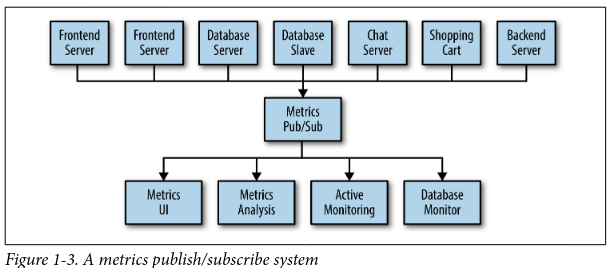

# Motivation

Kafka is a _streaming platform_. A system that lets you publish and subscribe to streams of data, store them, process them

Kafka is like a messaging system

- it lets you publish and subscribe to streams of messages
- Similar to
  - RabbitMQ
  - AcitveMQ
- Differences
  - runs as a distributed system that it runs a cluster
  - no message brokers, its centralized.
  - storage system as well
  - "derived streams" ETL
- Can be thought of as "real time version of Hadoop".
  - Hadoop lets you store and periodically process file data at a very large scale.
  - Kafka lets you store and continuously process streams of data at a very large scale.

## Publish subscribe

With **Direct Connections** it doesn't take long for the connections become unmanageable and hard to trace.

A pub sub model solves this in a clean way

But this too becomes unmanageable when there are multiple pub sub systems, when every team (say logging, user behavior tracking) are doing their own pub sub to solve the same problem

Why not have a single centralized system that allows publishing generic types of data

## Kafka

- multple producers and multiple consumers
- disk based retention (durability)
- scalability (cluster of brokers)
- high performance

### Kafka Message

unit of data within Kafka is called "message" (row or a record)

## Kafka Topic

Messages are categorized into topics.

## Kafka Partition

A topic can have multiple partitions.
Each topic can be hosted on a different server, --> a single topic can be scaled horizontally across multiple servers.

## Kafka Stream

TODO

### Kafka Batch

Messages are written in "batches", for efficiency.

A batch is a collection of messages which are being produced to the same topic and partition.

### Kafka Schemas

Better enforce schemas(Apache Avro) to decouple the producers and consumers. Messages should be understood without coupling and coordination.

### Kafka Producer (publisher)

Producers create new messages. A Message is produced to a specific topic, and producer doesn't care which partition it goes to (generally)

### Kafka Consumer (subscriber)

Consumers read messages.  Consumer subscribes to one or more topics and reads the messages in the order in which they were produced.

**Consumer group** is a collection of consumers that work together to consume a topic

### Kafka Broker

A single Kafka server is called a broker. It recieves messages from producers, assigns offsets to them and commits the messages to storage on disk. It also services consumers

### Kafka Cluster

Cluster of brokers.
