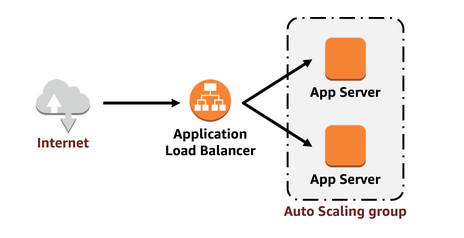
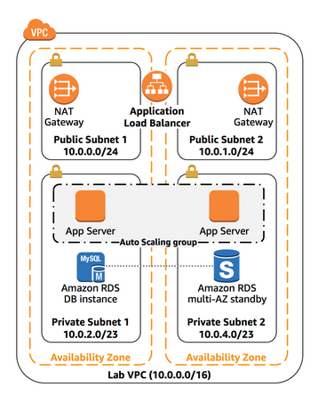
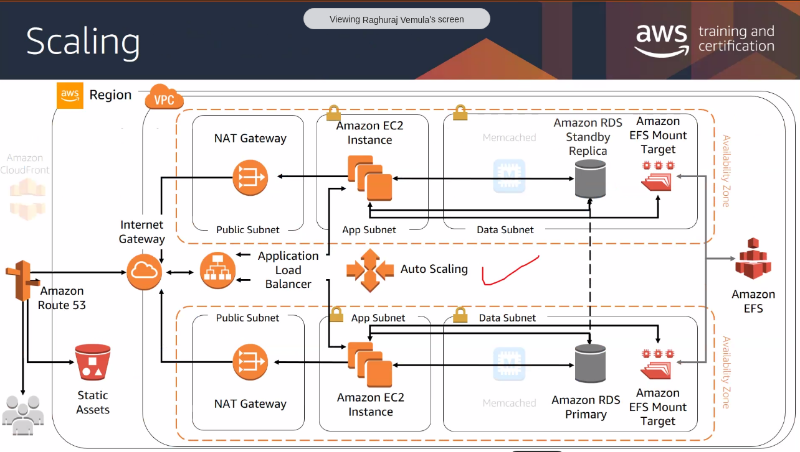
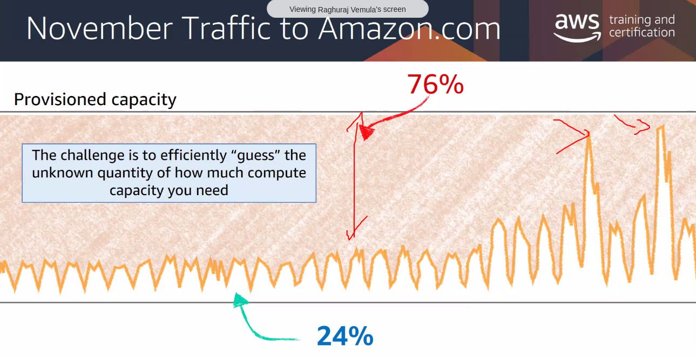
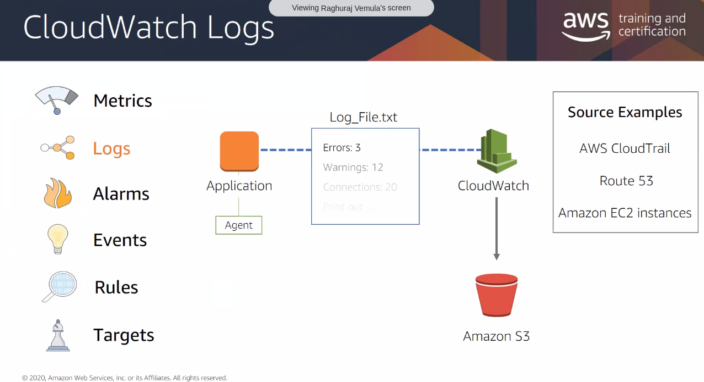
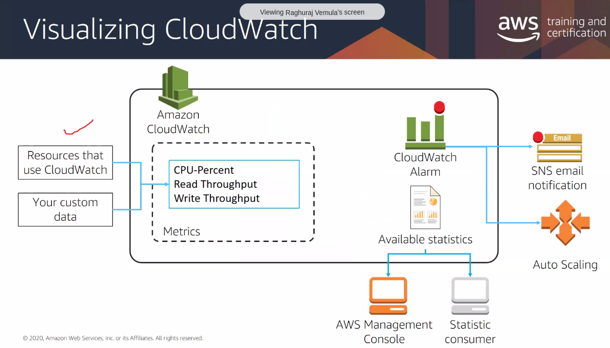
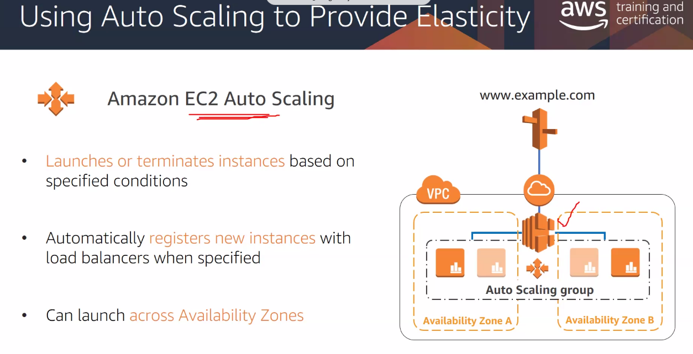

**HA = deployed in multiple AZs**

To achieve HA in AWS, you must run your services across multiple AZs

Many services are inherently highly available - eg: Load balancers
. You can configure other services for HA - like ec2, to run them in multiple AZs
- ec2 can be configured to be highly available
- database can be configured to be highly available
- NAT gateway can be configured to be highly available

When your application is running on multiple application servers, you need a way to distribute traffic among those servers. You can accomplish this by using a <em>load balancer</em>. A load balancer distributes incoming application traffic across multiple instances. A load balancer also performs health checks on instances and only sends requests to healthy instances.

<em>Target groups</em> define where to <em>send</em> traffic that comes into the load balancer. The Application Load Balancer can send traffic to multiple target groups based on the URL of the incoming request. For example, requests from mobile apps could be sent to a different set of servers. For this lab, your web application will use only one target group.

# High availability factors

1. Fault tolerance
    - built-in redundancy of application components
2. Recoverability
    - restoring a service after a catastrophic event
    - **general rule**: expect everything can fail  
3. Scalability
    - accomodate growth without changing design
    

### Provision for peak capacity?
how will you handle the growing demands on resources on peak seasons..like big billion day?

Will you provision a lot ? then it will be **wasted** on rest of the days. How well can you guess your need? Can you??

### Three types of Elasticity
- Time based
    - Turn off resources when not in use (DEV, TEST)
- Volume based
    - As and when your demand grows, you add more resources
- Predictive based
    - based on algorithms. Predict future demand by observing daily and weekly trends.

## Monitoring - AWS Cloudwatch
- Operational Health
- Application Performance
- Resource Utilization
- Security Auditing

You can set up cloudwatch alarms to notify about threshold breach in CPU utilization etc...you can trigger autoscaling too..you can create a ticket, send email, sms

### Monitoring API calls - AWS Cloudtrail

# Autoscaling

Amazon EC2 Auto Scaling is a service designed to <em>launch</em> or <em>terminate</em> Amazon EC2 instances automatically based on user-defined policies, schedules, and health checks. The service also automatically distributes instances across multiple Availability Zones to make applications highly available.

"Autoscaling group" 
Auto Scaling group deploys Amazon EC2 instances across your <em>private subnets</em>. This is a security best practice when deploying applications because instances in a private subnet cannot be accessed from the internet. Instead, users will send requests to the Application Load Balancer, which will forward the requests to Amazon EC2 instances in the private subnets, as shown in the following diagram:
### Ways to autoscale
1. Scheduled
    - for dev and test
2. Dynamic
3. Predictive

# Lab
- create ALB
- create launch template (ec2)
- create autoscaling group
 