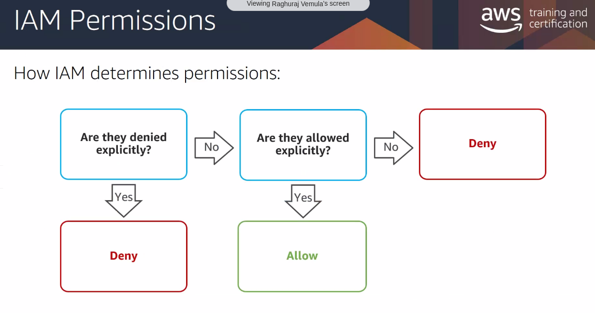
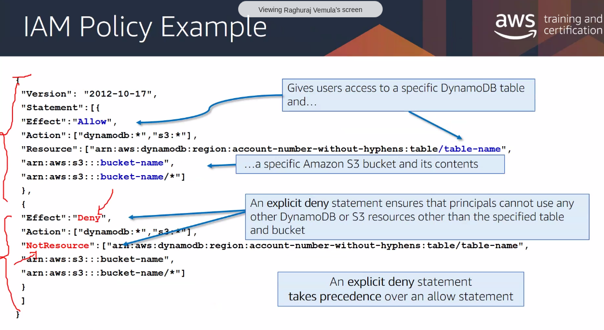
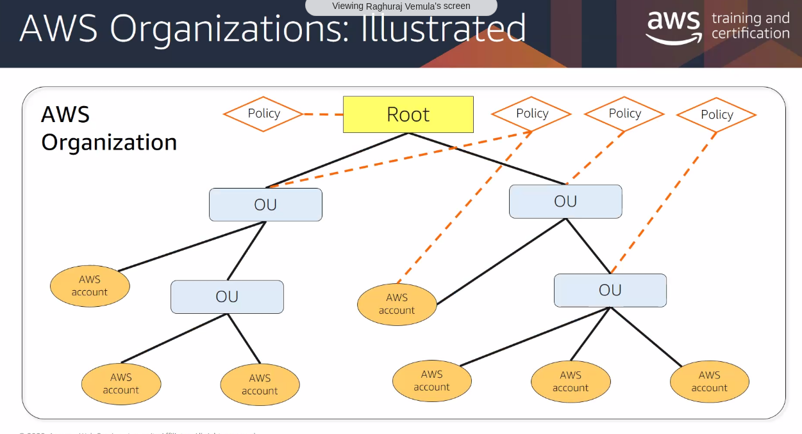

- IAM is a global service, not region specific
- you should not use root user, create and use IAM user
- Users can be grouped into groups. Groups cannot contain other groups
- A User can belong to multiple groups.
- Least privilige principle : dont give more permissions than the user needs
  
**IAM Credentials Report** lists all your IAM users and the status of their various credentials

MFA = Password _you know_ + Security device _you own_

## Users, groups, policies, roles

- any **user** added to a **group** will inherit all the permissions attached to that **group**
- permissions are given via attaching **policies** to the group

### Policy

Policy is a JSON document that outlines permissions for users or groups

Policy Statement contains

- Effect (Allow | Deny)
- Action (PuObj | ListObj etc , *)
- Resource (arn)

```json
{
    "Version": "2012-10-17",
    "Statement": [
        {
            "Sid": "ConsoleAccess",
            "Effect": "Allow",
            "Action": [
                "s3:GetAccountPublicAccessBlock",
                "s3:GetBucketAcl",
                "s3:GetBucketLocation",
                "s3:GetBucketPolicyStatus",
                "s3:GetBucketPublicAccessBlock",
                "s3:ListAllMyBuckets"
            ],
            "Resource": "*"
        },
        {
            "Sid": "ListObjectsInBucket",
            "Effect": "Allow",
            "Action": "s3:ListBucket",
            "Resource": ["arn:aws:s3:::bucket-name"]
        },
        {
            "Sid": "AllObjectActions",
            "Effect": "Allow",
            "Action": "s3:*Object",
            "Resource": ["arn:aws:s3:::bucket-name/*"]
        }
    ]
}
```

Policy Types

- SCPs (Service Control Policies)
  - Used at AWS Organization level
  - OU "Organization Units" will have SCPs attached to it.
  - eg :"Engineering" can be an OU which contains 2 AWS Accounts. SCPs can be attached to the OUs

- Identity Based Policies
- Resource Based Policies

### Roles

- Some AWS service will need to perform actions on your behalf
  - for an AWS service to access another AWS service
  - for eg: EC2 to access IAM or RDS or DynamoDB
- to do so, we assign permissions to AWS services with IAM Roles
- IAM Roles can be temporarily assumed by IAM users, AWS Services
- Cross Account Access (via **AWS Organizations**)
- IAM Role depends on AWS STS to provide temporary creds
  - Session Token
  - Access Key ID
  - Secret Access Key
  - Expiration

## Accessing AWS

- console
- CLI
  - AWS CLI is actually built on AWS SDK for Python
- SDK
  - protected by access keys



IAM policies

- resource based policies
- identity based policies



## IAM roles

- faceless identities
- Have permissions associated to it

-

## Federating Users

external authentication

## Amazon Cognito

## STS

## AWS Organizations

How to managage multiple AWS accounts in a single organization.


- One of the user cant access s3 bucket. How to diagnose this?
-- check bucket policy, then user's inline policy or group policy

## Single to Multiple accounts

- Multi account strategies  
  - Assume Role
  - add SCPs to OUs. then all acccounts within that OU will have that policy applied.

- AWS SSO
  -

- AWS Control tower
