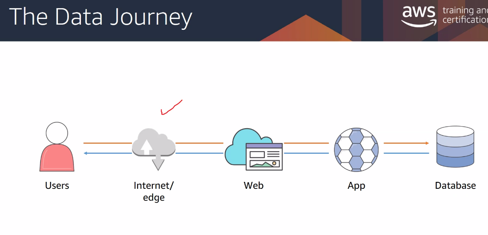
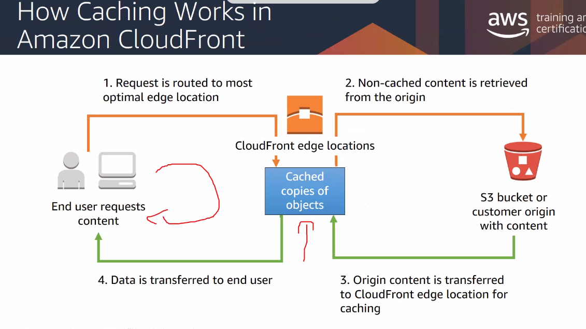

- Client Side Caching
- Server Side Caching

If a resource is very frequently accessed, we should push those resources to the "Edge location", "Content delivery network". Rather than all data going through the servers, and data layers.

# AWS Cloudfront
- caching at the _edge location_

# Sticky Session
- caching at the _web tier_

