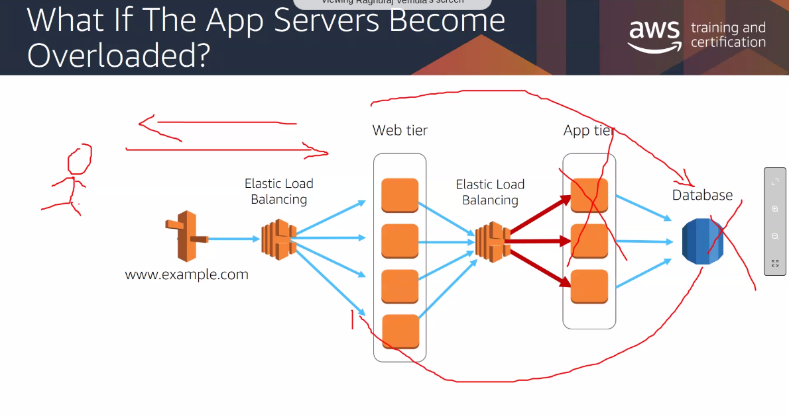
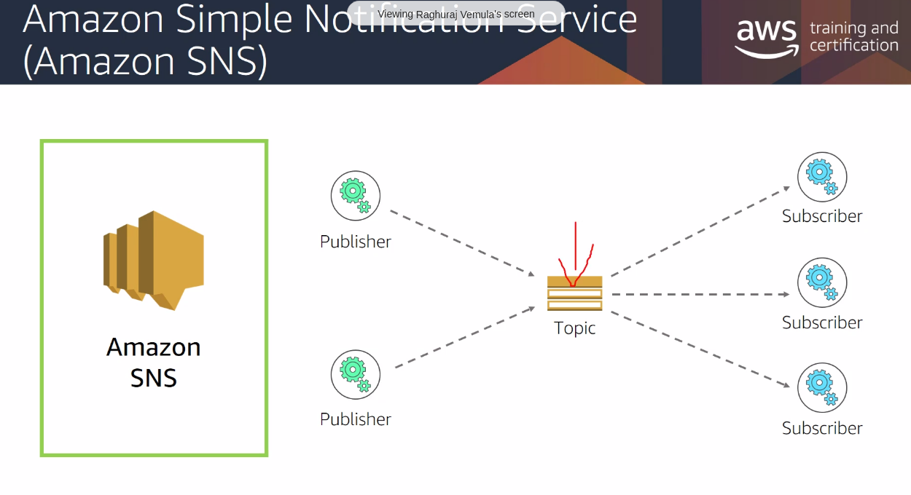
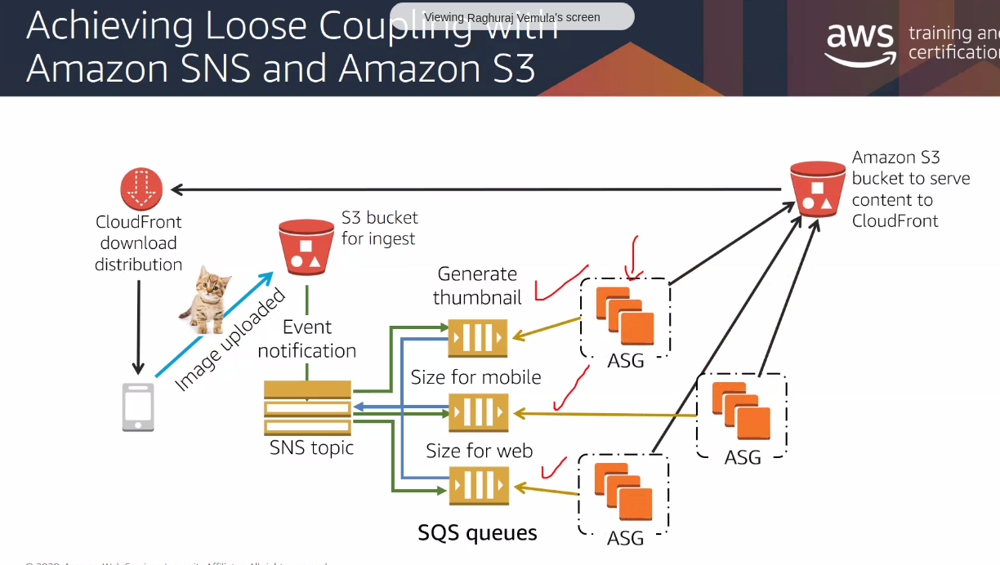
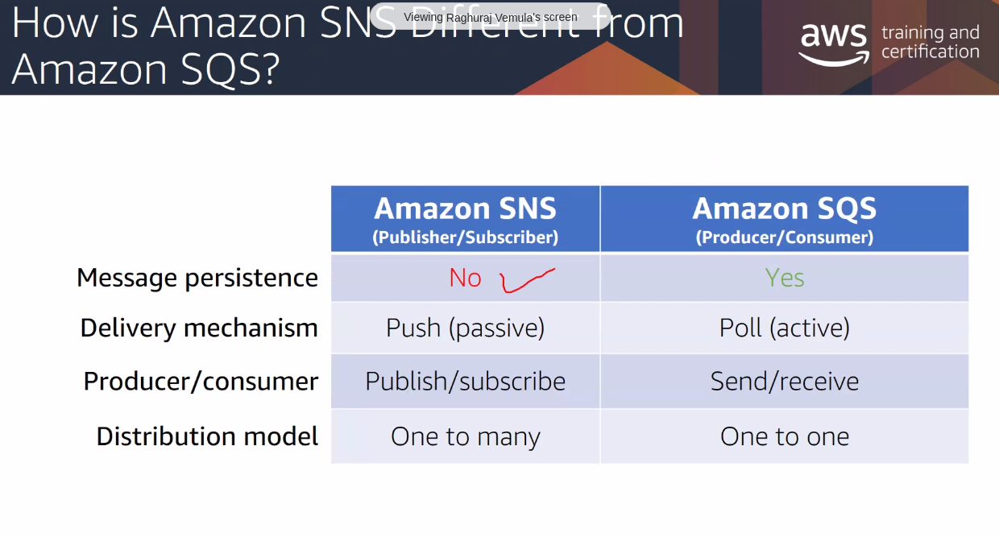

# SQS
- to solve the above problem.
- Messages are stored until they are processed and deleted.
- Act as buffer b/w senders and recievers

# SNS
- publish subscribe model
- (subscribers:) -> email, SNS, http endpoint, SQS queue...

