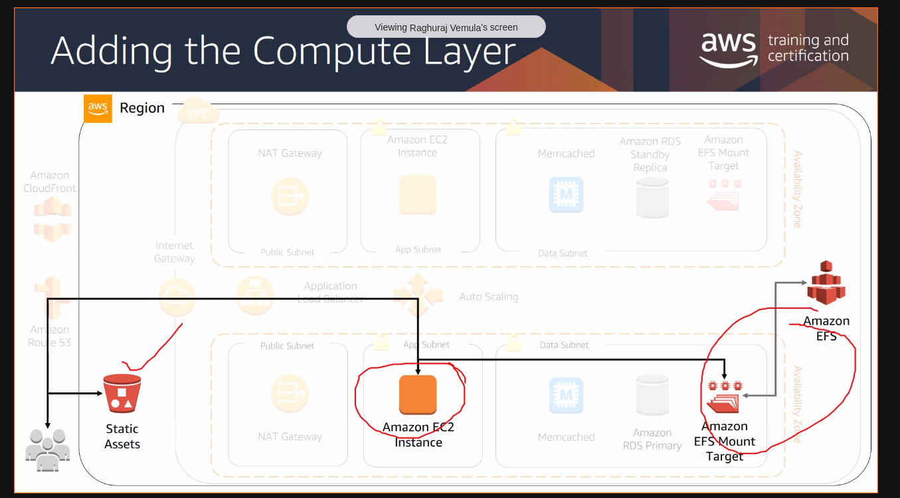
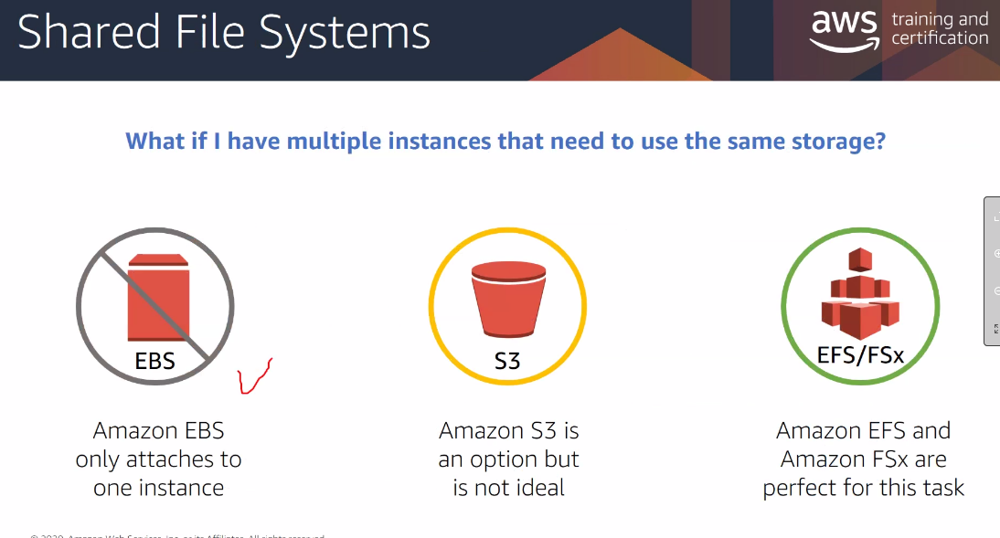
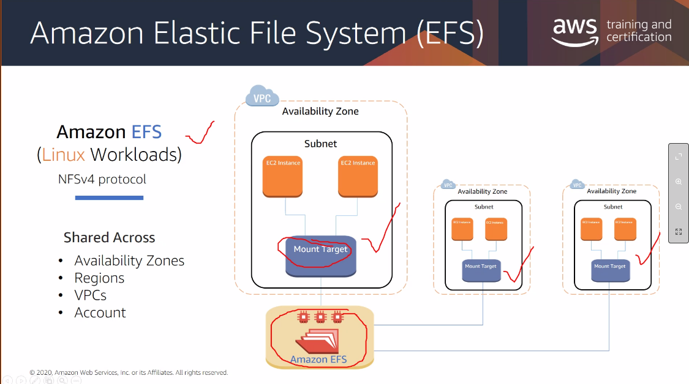

On ONE physical server, which has a virtualized layer, so many EC2 instances run...each one may belong to a different VPCs! Theyre logically separated, and have no idea about the other's presence.

## (Software) what is the OS you want to launch?
- AMI - Amazon Machine Image

## (Hardware) vCPU, RAM
- Instance type
    - t3micro?
    - t2micro?
    - compute optimized?

- how many instances 

## (Networking) Where will my Ec2 reside?
- select the VPC.
- select the public or private subnet where you want it.
- IAM roles

## (Storage) Hard disks
- EBS instances that you can "attach"
- all EC2 instances will come with a root volume by default ( this will have OS and all )

## Shared file systems?

# EC2 pricing
### default - on demand
### reserved instances  - 1-3 year contracts
you get 70% discounts

