# Goal
How to provide isolation?

# VPC
software defined network topology.
Traditional networking is difficult—it involves equipment, cabling, complex configurations, and specialist skills. Fortunately, Amazon Virtual Private Cloud (Amazon VPC) hides the complexity while making it easy to deploy secure private networks.

 VPC is a virtual network dedicated to your AWS account. A VPC is logically isolated from other virtual networks in the AWS Cloud. You can launch AWS resources, such as Amazon Elastic Compute Cloud (Amazon EC2) instances, into the VPC. You can modify the VPC's IP address range; create subnets; and configure route tables, network gateways, and security settings.
 The VPC will have a CIDR range of <strong>10.0.0.0/16</strong>, which includes all IP addresses that start with <strong>10.0.x.x</strong>. This range contains over 65,000 addresses. You will later divide the addresses into separate subnets.

 Within the VPC (actions) there is an option to attach friendly DNS names to EC2 instances inside the VPC ..like ec2-52-42-133-255.us-west-2.compute.amazonaws.com.
 Any EC2 instance launched in this VPC will now automatically receive a DNS hostname

The logical isolation for YOU in the cloud.

- VPC is across the availability zones
- VPC should be WITHIN a region.
- you can create 5 VPCs in a region
- you use IPv4 CIDR range to **define the VPC**
    - CIDR = set of IP addresses
- any resource you "deploy" will have to be associated to a VPC

You create 
- one VPC for dev
- one VPC for test
- one VPC for qa
- one VPC for prod

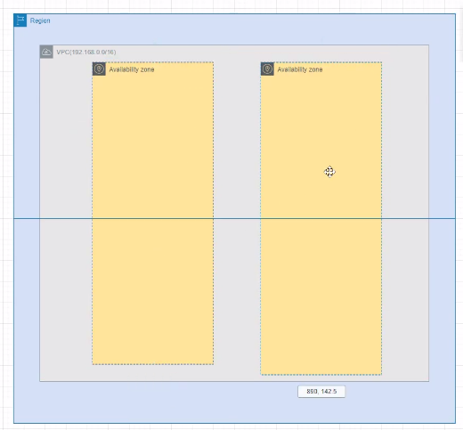
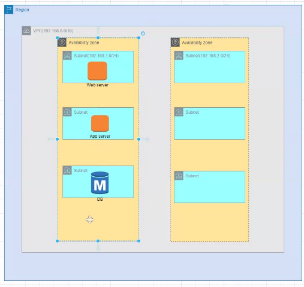
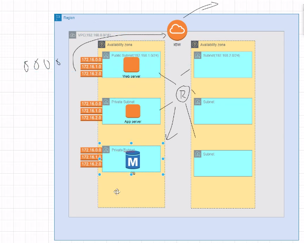

## Route tables of VPC
route the traffic between resources in the VPCs
All subnets are private subnets by default. But if a subnet has a route to the internet gateway, then it is a public subnet.(route table entry)

## Subnets
Subnets within a VPC are just subsets of IP addresses assigned to the VPC. They all are private because VPC IP block is private.

**a subnet HAS to be inside a particular AZ**

A <em>subnet</em> is a sub-range of IP addresses within the VPC. You can launch AWS resources into a specified subnet. Use a <em>public subnet</em> for resources that must be connected to the internet, and use a <em>private subnet</em> for resources that are to remain isolated from the internet.

"public" subnet also infact has private IP blocks but just a route to the internet gateway
all subnets are networks with a private ip cidr.
a subnet with an internet-gw in its route table for destinations 0.0.0.0/0 is a public subnet, IGW gives ingress and egress access to resources in public subnet to the internet.
a subnet with a nat-gw in its route table for destination 0.0.0.0/0 is a private subnet.
how is nat-gw able to communicate with internet. because it is a resource in the  public subnet.
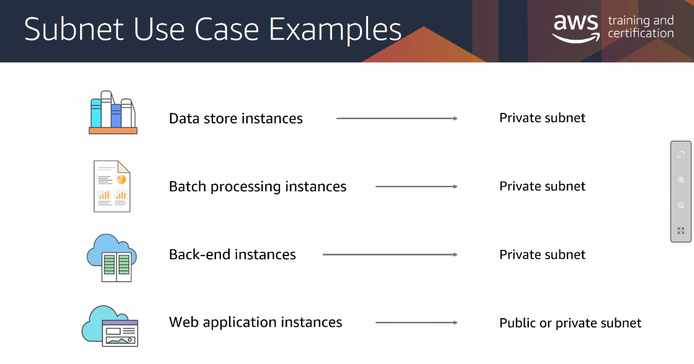

A "public subnet" is for internet facing resources.
A "private subnet" will be for resources that are to remain isolated from the internet.

## Internet Gateway
TODO
**allows outbound and inbound**
Provides two way communication. ingress and egress

## NAT gateway
**allows only outbound**
Say you want to download updates to your RDS instance, but still dont want to keep it in a public subnet for obvious reasons.

solution -- NAT gw
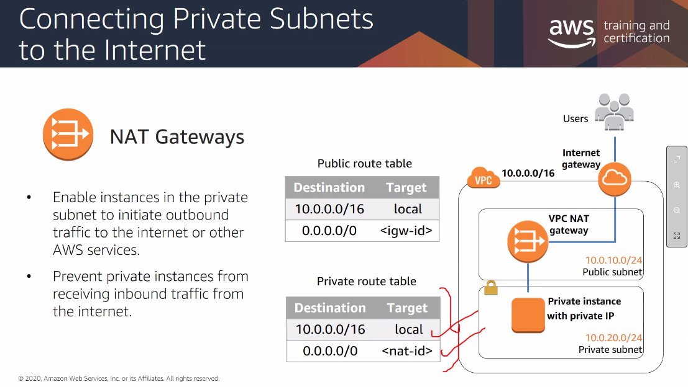
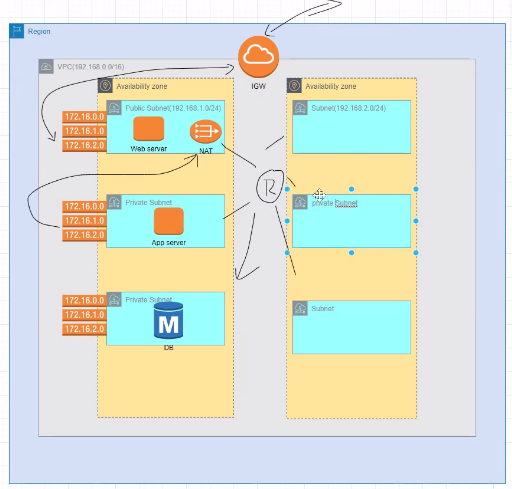
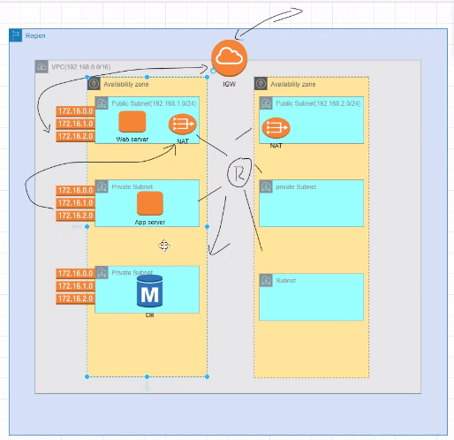
NATGW is not highly available. you can create multiple NATs in different subnets. Whereas InternetGW is highly available. one IGW per VPC, any subnet can use it.

## Firewall : inbound and outbound rules
- **NACL** - subnet level firewall
- **Security groups** - instance level firewall

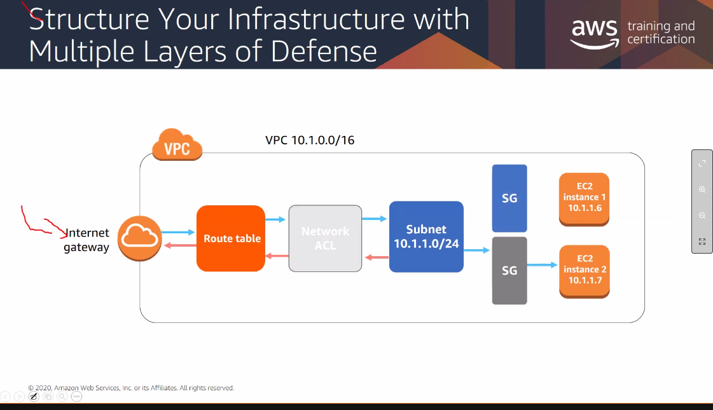

## lab
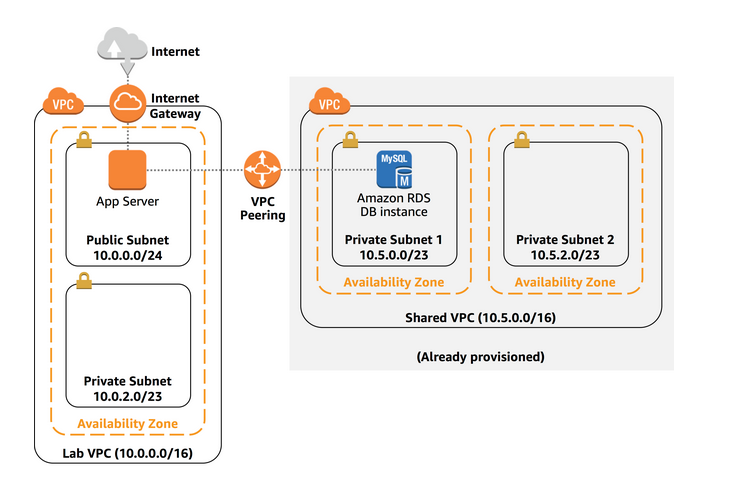
- create a VPC
- create a public and private subnets
- create an internet gateway
- create a route table and associate it with a subnet
- create a security group for the app server 
- launch an app server(ec2) in public subnet

This lab shows you how to build your own VPC, create subnets, and direct traffic between VPC components. The following image shows the final architecture:

**VPC Peering**: You create a VPC peering connection to a shared services VPC. Then, you use an application and database to test connectivity between the VPCs.

1. Create a VPC with CIDR range : 10.0.0.0/16 .
which means that it contains all addresses in the range of 10.0.x.x
..which is over 65000 addresses. You will later divide the addresses into separate subnets.

 Within the VPC (actions) there is an option to attach friendly DNS names to EC2 instances inside the VPC ..like ec2-52-42-133-255.us-west-2.compute.amazonaws.com.
 Any EC2 instance launched in this VPC will now automatically receive a DNS hostname. You can add much more meaningful DNS later by using Route53

 2. Create a Subnet. -- Subnet is a sub-range of IPs assigned to the VPC. You can launch AWS resources in a specified subnet. Use public subnet for resources that must be connected to the internet, use private subnet for resources that are to remain isolated from the internet

 ## Connecting Networks
 - VPC to VPC
    - **VPC Peering**
    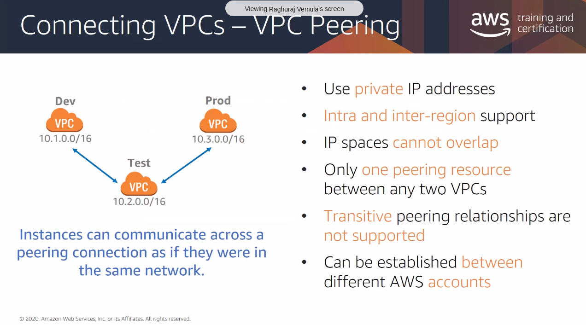
    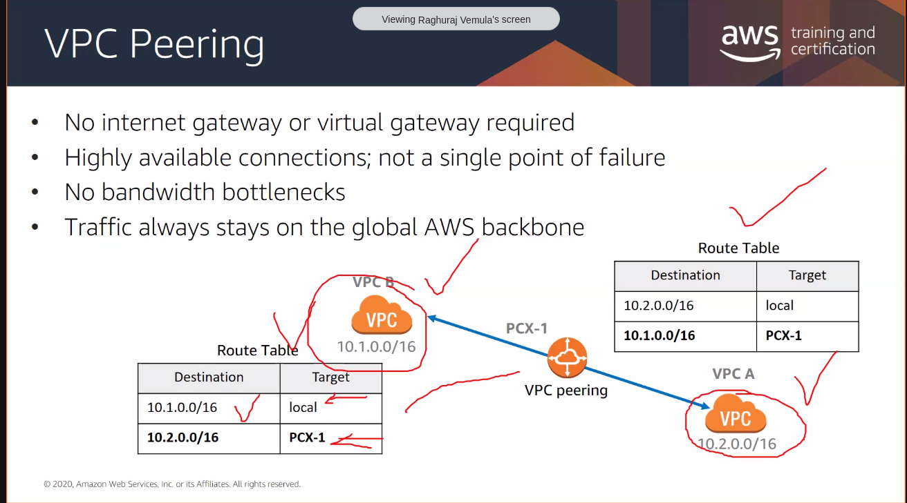
    the VPCs can be in different account, different regions..
    - its a two step process
        - establish the "requester" and "acceptor"...establish the peering connection
        - make route table entries in both VPCs
    - but as number of VPCs increase, the number of connections increase drastically n(n-1)/2
    - **AWS Transit Gateway** helps connect a lot of VPCs easily

 - On Prem envt to VPC
    - use Public internet 
    - VPN connection (VGW) Virtual gateway ( private tunnel). Create (CGW) Customer Gateway at the customer end.
    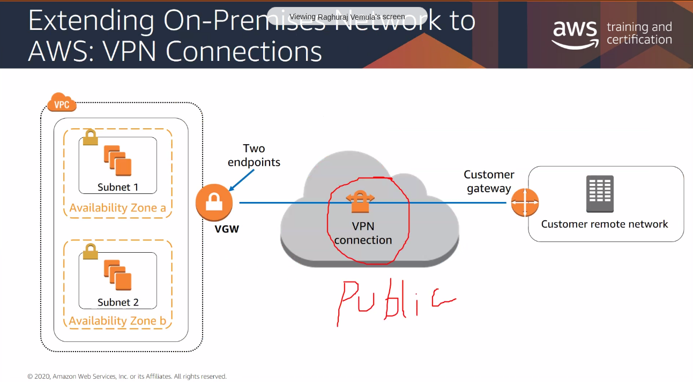
    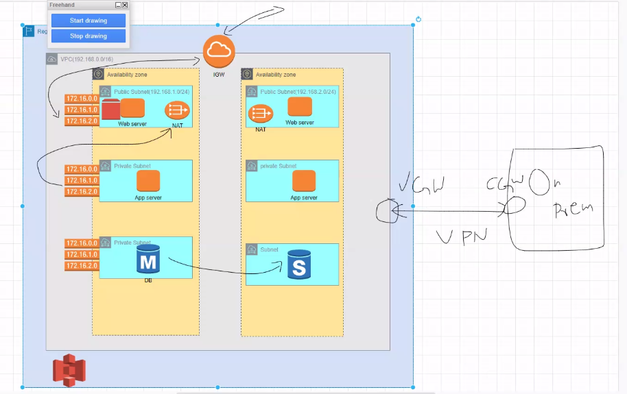
    - AWS Direct Connect
    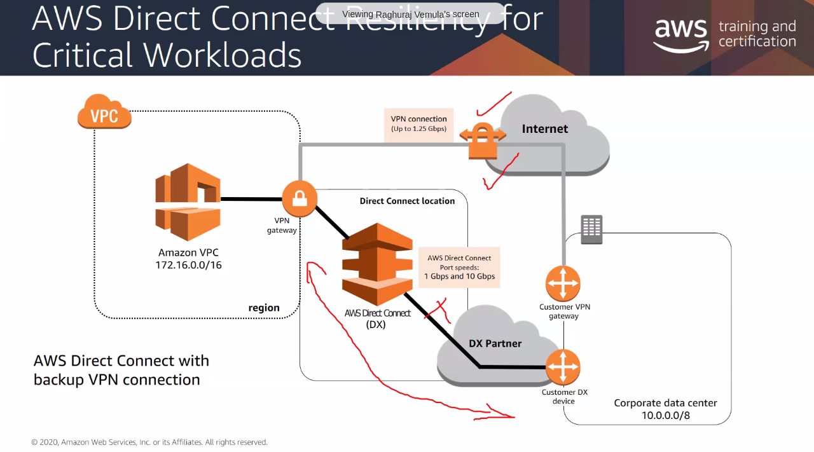

## VPC Endpoints
    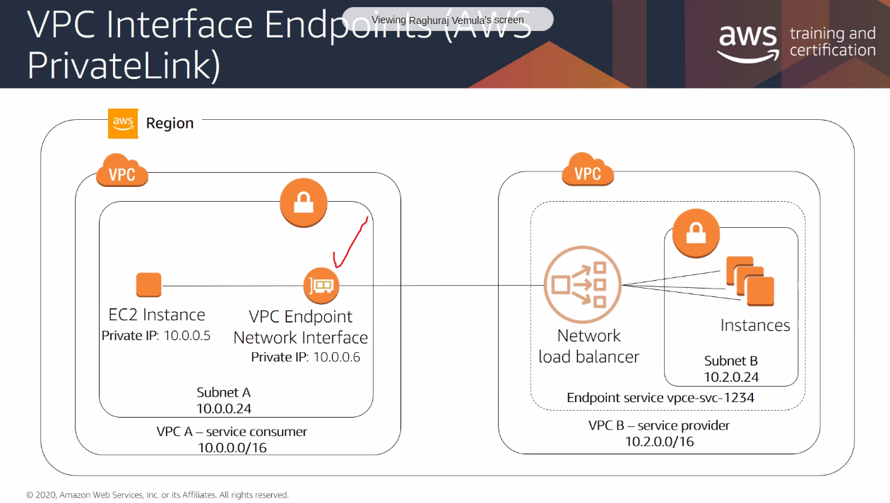

## Load Balancers
Distribute my incoming traffic
    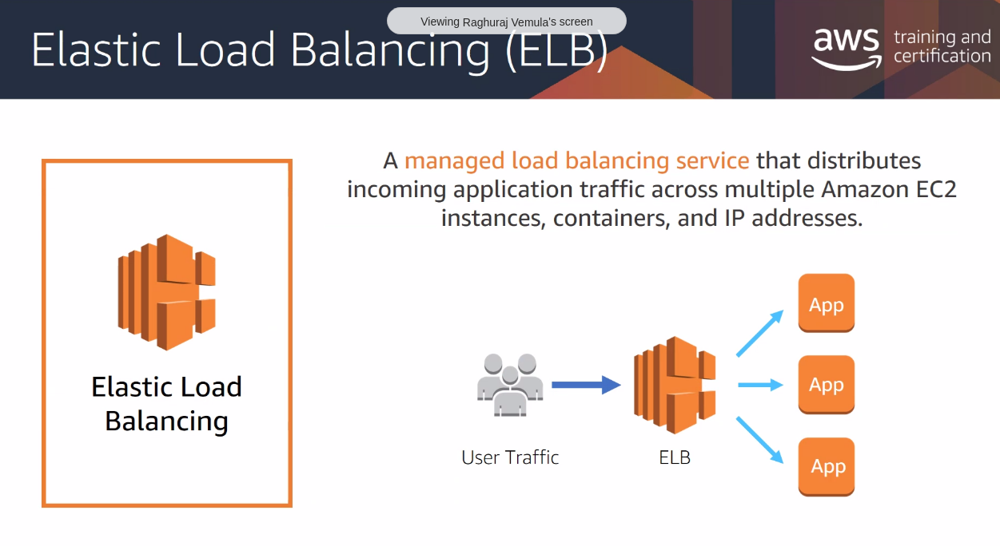

- ALB- Application Load Balancer (7th layer)
- NLB- Network Load Balancer (Network layer..tcp udp)
- GLB- Gateway Load Balancer (IP level)
- CLB
    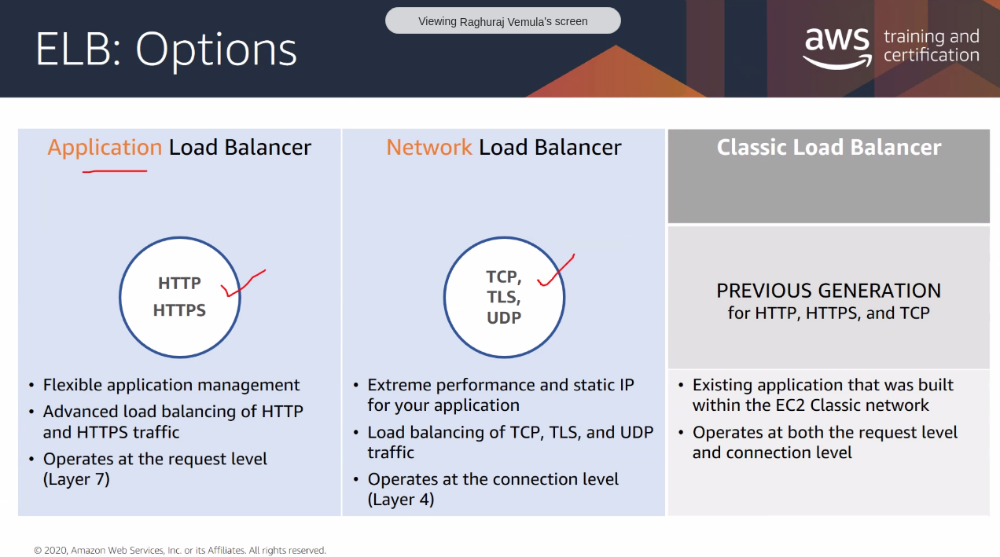

### Target Group

# Resources

# Questions