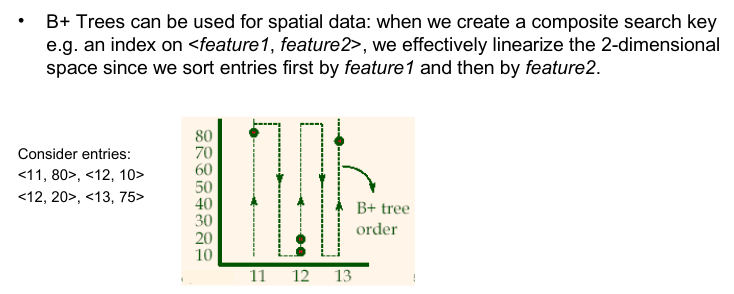
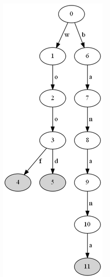

_How systems which **process and store data** work_

Book Overview
- Ch1 - Ch 4 (PART 1) :: data stored on single machine
- Ch5 - Ch 9 (PART 2) :: data stored on multiple machines
- Understand the inner workings/core principles, key DSA, distributed systems concepts  of most used tools that deal with data (store data or process data) : DBs, caches, queues, stream/batch processors. Pros and Cons of each, when to use what. 
- No matter how many of these new systems come and go, enduring principles remain true.
- Learn to develop the intuition to know which set of tools you can mix and match/combine to obtain desirable application behaviour.
- Learn key principles in the above tools, which you can use to make any system scalable and highly available.
- Learn how each tool in a given area(say caching) is similar to other tools in the same area, and what sets it apart.
- Storage & Retrieval — How storage engines lay out the data on disk for faster writes OR(AND) faster reads. Indexing approaches

#### Tools which store and process data
- DATABASES
	- RDBMS
	- NOSQL
		- DocumentDB
		- GraphDB
- MESSAGE QUEUES
- CACHES
- SEARCH INDEXES
- BATCH PROCESSING
	- Spark
- STREAM PROCESSING
	- Flink

The categorisation shouldn't end at such a broad level. There are different approaches to caching, different ways to build search indexes.. 

Some tools don't fit neatly into any ONE category. Redis is used as a cache as well as a message queue. Kafka is a message queue but has database-like durability guarantees.

Complex application, _multiple different data access patterns_..  **One database to rule them all?** — Such a system does not exist. You have to mix and match different available data stores for your needs
- multiple specialised data stores (databases, indexes, caches, analytic systems etc.) – and  maybe _stitch_ them together by implementing mechanisms to move data from one store to another
- each data store may have different  [[#Data Models]].
- These data systems can be broadly categorised into 2 (**primary source** of data, **derived source** of data)...derived via an "ETL" process (eg: cache, indexes, denormalised values)..._redundant data_, derived data stores can be **recreated** if lost. Derived data stores are key for performance (are created just for performance...)
	- Knowing this flow(dataflow) helps you understand inputs and output of each data system in your complex application, and which data system depends upon which..
	- Nobody says, "_postgres is supposed to be used as a primary source of data_", its totally up to you how to use a given a data store.


#### Data Processing styles — Request-Response(Online), Batch, Stream
- **Request/Response Model(Online):** 
	- "requests"
	- HTTP/REST... RPC...GraphQL...
	- Common in web servers/APIs (also databases/caches/search indexes..)
	- Request/Response....Query/results
	- generally triggered by human
	- quick response time
	- **Primary metric** of performance = response time, .. availability
- **Batch Processing(Offline):** 
	- "job"...periodic cron jobs...
	- NOT meant to respond to requests(from user)
	- Operates on large chunks of data(input data)
	- A user isn't waiting for (immediate) results
	- **Primary metric** of performance = throughput (time to complete the job)
- **Stream Processing(near-realtime)(between online and offline):** 
	- "events"
	- processes "events" soon after they occur
		- lower latency than batch.
	- NOT meant to respond to requests(from user)

#### Scalability — How to describe/measure load
> **Note**
> The below are NOT necessarily performance metrics, they just describe how much load you are putting on the system. 

Load Parameters
- RPS , Requests Per Second
- Writes per second on DB
- Reads per second on DB
- Ratio of reads to writes on DB
- Cache hit rate
- Number of Concurrent users
- Number of Concurrent requests
- ... or whatever , as per your application metaphors, like...
- {Twitter} Home timeline tweets per page load., everytime a user opens the app.
- {Twitter} NumFollowersPerUser . Its a key load parameter since it determines the fan-out load. (fanout=how many internal requests a single request/query can trigger )

When you increase a load parameter, and keep the resourced unchanged (CPU,RAM,bandwidth), does your performance drop? Or how much should you increase the resources to keep the original performance?... _How do you measure performance in the first place?_

#### Scalability — How to measure performance 
- Throughput
	- RPS
- Response time
	- p50(median) response time
	- p95 response time
	- p99 response time
	- .. average means nothing here...

Why are "Tail Latencies" (p95, p90) important? they tell you how bad your outliers are. Outliers are just random one off/rare things that dont matter, right? - Wrong.  The outliers probably belong to requests causing max processing on the backend, and such requests probably arise from most important customers who have max data on the system.  Tail Latency Amplification — Even if a very small percentage of backend calls are slow, if the client makes N calls for say a single button click(fanout), the probability of him hitting a slow call will get higher and higher 

![[ddia-00.png]]
> **Info** : _Average means nothing. Choose medians_
> A single request causing 10min response time can raise the average of a hundred other requests which had just 1s response time...to an average of say 2 min. Gives a false sense of the distribution.
> OTOH, why would such an outlier exist?
> - maybe it processed far more records than others..
> - random additional latency due to say
> 	- context switch to another process
> 	- loss of packet, TCP retransmission
> 	- GC pause
> 	- page fault , read from disk
> 	- ...

> **Warning** : Latency != Response Time
> Response time is round trip time, what the client sees. 
> Latency is the time spent **waiting** to be processed/handled. 
> time spent being "Latent"(lying dormant) ..awaiting service. 

As load increases, (with resources fixed)
- Throughput increases slowly and then hits a saturation.
- Response time gradually keeps on increasing
![[ddia.png]]
So during load testing, when adding load, bombarding the system with requests, **you should NOT wait for prev req to complete before firing the next req** because it will NOT show the queue getting longer and longer, and the latency getting larger and larger... a symptom you NEED to witness to know that performance drops with load. Or else, you will never know whats the true breaking point of the system with resources kept unchanged. 
#### Scalability — Little's Law
Why does latency increase with load ?
A server can process only a fixed number of things in parallel (limited by number of cores). It takes only a small number of slow requests to block the processing of subsequent requests ., this is called "head-of-line blocking". All subsequent requests take much longer to complete since they spent majority of the time waiting. 

Queueing Theory Basics...
An application requires resources to fulfil a request, and the resources are finite. If a resource is not available, the request must wait for it.
![[ddia-17.png]]
(_pool with servlet threads for DB, memory, CPU_)

`CONCURRENCY = ARRIVAL_RATE(RPS) x LATENCY`

Average number of requests is equal to average arrival rate x average time spent in the system.

Concurrency, arrival rate (RPS), and Latency are things that can be directly measured ...which helps in capacity planning (which is difficult to reason about by observing directly.)
- Concurrency : gives a measure of resources like threads, memory , connections, file handles, anything that is numerically limited. It also gives a indirect way to measure contention. If concurrency is high, then contention is also high.

Put it other way, Little's law kind of hints that throughput levels out after a point: `RPS = CONCURRENCY/LATENCY` . i.e as number of concurrent requests increases, latency also increases, to keep the RPS constant.
But in the real world, throughput DROPS. Throughput drops when contention rises, because contention itself has a cost.

#### Scalability — Amdahl's Law
_How much can parallelization reduce the response time?_

If you can parallelize 200ms of a request taking 500ms, dividing the work on 4 parallel processes, then the response time = 300 + 200/4 = 350ms

This is used for effectiveness. At a particular point, parallelization no longer makes sense since overall gain is so low...

#### Scalability — How to cope with load ?
You can't just add more machines and expect to scale. You MIGHT have to change the architecture of your backend. 
Its easy to run _stateless services_ across multiple machines, but taking _stateful systems_ and splitting them across multiple nodes is difficult. (This is why common knowledge is to scale up a MySQL instance until you cant no more)


#### Data Models
Historically, data started out being represented as one big tree (Hierarchical model) (sounds a little like mongodb(documentDB) too), but that wasn't good at representing many-to-many relationships, so relational model was invented. 
These days, some applications don't fit in relational model either, so some NoSQL datamodels have emerged. 

There are many data models
- Hierarchical (first model)
- Network
- Relational
- NoSQL - Document
	- MongoDB, RethinkDB, CouchDB, Espresso
	- target usecases where data comes in self-contained documents and relationships between documents are rare.
	- Don't enforce schema
- NoSQL - Graph
	- Neo4j
	- target usecases where anything is (potentially) related to everything.
	- Don't enforce schema
Each data model makes some assumptions on how it is going to be used. It defines the **access patterns** that are fast and easy. (It also makes _other_ access patterns slow and difficult) — It gets very important to understand the access patterns in your own application and choose the data model accordingly. 

Although one model can be emulated in another model (graph can be represented on relational model too), but queries get clumsy and you get worse performance on queries(read/write). 
#### Data Models — Relational 
_declarative >>> imperative_
Prior models (Hierarchical, Network) forced the developers to know and think about the internal representation of the data on the DB. How bytes are laid out, how to access a specific data piece. Stuff like "access paths" to reach a DB should be clearly specified in the "query" you write.
Relational model abstracted all of it away(hides implementation detail of a query) with SQL which was a **declarative interface**. The presence of a "query optimizer" changed the way we write queries. Our queries now no longer worry about underlying things like "access paths", or best way to reach a specific data. Our queries don't have to change due to a presence of an index.  The Query optimiser takes care of these things, you just specify WHAT you want in a declarative way (SQL), and query optimised takes care of HOW to obtain it efficiently(and fast). Your queries remain the same with our without the index, even though the underlying approach of obtaining the data with or without the index is significantly different. The fact that the language is declarative, makes it possible for the database system to introduce performance improvements without requiring any changes to queries (like parallel execution across machines, which would be hard if the language was imperative).
> **Note**: Distributed Execution of SQL
> There's nothing stopping SQL from running across multiple machines. Underlying  implementation of SQL(a standard, spec) is totally left to the vendor... and can use MapReduce or whatever to achieve the goal specified by the SQL queries. 

IMS(hierarchical model) and CODASYL(network model) queried the database using _imperative code_. But relational model introduced a new way of querying data — declarative query language (SQL).

The fact that SQL is more limited in functionality , gives the database more room for automatic optimisations. (eg: its nearly impossible to apply parallelism on a imperative code.)


#### Data Models — NoSQL
Arose because people wanted 
- Higher Scalability than relational model. Very large datasets...very high write throughputs...very high read throughputs...
- Some access patterns which relational model did not serve well. (eg: simple things from applications perspective, require far too many joins.. , require ORM to translate every object to relational schema.)

#### Data Models — NoSQL Document DB
Read: [Why You Should Never Use MongoDB « Sarah Mei](http://www.sarahmei.com/blog/2013/11/11/why-you-should-never-use-mongodb/)
Suitable for 
- self-contained "Documents",  locality -> Performance. "obtain everything in one call". 
- youll have better performance due to locality. All that you need is fetched in one go without any kinds of JOINS, because all that you need is present in the same document.
- schema flexibility. no schema at all! Closer to data structures used by the application. No need of ORMs.
- Tree like structure : Has one-to-many relationships
- You don't plan to have joins at all..You're OK with denormalisation and redundancy.
- You hate joins, don't want the performance overhead of joins, and your data inherently has "locality", i.e all related data close by, within the same document.

Not suitable for
- Has many-to-many relationships.
- highly interconnected data, which scream the need for many-to-many relationships, or JOINS.

> *Whether you’re duplicating critical data (ugh), or using references and doing joins in your application code (double ugh), when you have links between documents, you’ve outgrown MongoDB. When the MongoDB folks say “documents,” in many ways, they mean things you can print out on a piece of paper and hold. A document may have internal structure — headings and subheadings and paragraphs and footers — **but it doesn’t link to other documents.** It’s a self-contained piece of semi-structured data.* 
>  
>  *If your data looks like that, you’ve got documents. Congratulations! It’s a good use case for Mongo. But if there’s value in the links between documents, then you don’t actually have documents. MongoDB is not the right solution for you. It’s certainly not the right solution for social data, where links between documents are actually the most critical data in the system.
>  - Why you should never user MongoDB , Sarah Mei. 

But you need to be wary. Even if initial version of your application fits in a "join-free" document model, data has tendency to be more and more interconnected as features get added. If you start out with document DB, and "interconnectedness" of your data keeps on increasing,... your application code has to do all the work to keep all the denormalised data consistent. JOINS can be emulated by doing multiple n/w calls to the DB, clearly slow. **A hybrid DB which can handle both relational and document types, would probably be an ideal** 

It is recommended to keep document size small.

#### Data Models — NoSQL Graph DB
For highly interconnected data, document DB is terrible, relational model is OK, and graph model is the best. 
Graph DB has "vertices" and "edges". 
Google uses GraphDB for storing its web graph, Facebook uses GraphDB(TAO) for its social graph. 

A vertex can be any object, the graphDB need not be limited to storing just vertices of one type (say person), homogeneity isn't mandated. This flexibility is very powerful.
eg: Facebook maintains a single graph where vertices can be people, locations, events, checkins, comments.  Edges represent which people are friends with each other, which checkins happened at which location, who commented on which post, who attended which event,..

There are 2 main data models for graphs,
- **Property Store Model** with Cypher Query language
	- Neo4j, Titan, InfiniteGraph
	- Each Vertex has an ID, set of incoming and outgoing edges, and a set of k-v pairs (properties)
	- Each Edge has an ID, the tail vertex, the head vertex, relationship(b/w connected vertices) label,  and a set of k-v pairs (properties)
- **Triple Store Model**(RDF) with SPARQL Query language
	- Datomic, AllegroGraph
	- (Subject, Predicate, Object).... eg: (lucy, marriedTo, Alain), (lucy, age, 33)
	- Note that there are no k-v pairs(properties). Such things are just handled via predicates. 
- "Much Older" data model with Datalog Query language
	- Cascalog is a Datalog implementation to query large datasets in Hadoop.
	- predicate(subject, object)
	- The Datalog Query language is a subset of Prolog. 
	- The data model is very similar to Triple Store Model (RDF). 

GraphDB features _can_ be implemented on RDBMS via Recursive CTE (Common Table Expressions).But it is very clumsy. You might need 30lines of SQL for what Cypher can do in 4 lines. 

https://stackoverflow.com/q/13046442/5319180 #TODO (Are Graph DBs a superset of RDBMS? are they just better RDBMS since all data eventually get more and more interconnected? Seems like RDBMS is much faster when dealing with querying a lot of row, while Graph DBs excel in digging deep into the path just for one item..)


#### Storage & Retrieval — OLTP vs OLAP
Storage engines are either optimised for "transactional workloads" or "analytical workloads", but not both (mostly).

>**Note** _Transaction  <> ACID
>_The term originated from money transfer use-cases "commercial transaction"..making a sale, paying salary, placing order. But databases expanded into other areas and the term "transaction" stuck._
>_The term "transaction" refers to a group of reads and writes that form a logical unit, need not necessarily have ACID properties. 
>Transaction Processing just means allowing clients to make **low latency reads and writes** — in contrast to Batch Processing which run periodically._


Transactional workloads (OLTP)
- OLTP = _an "interactive"(online) application looks up a small number of records by some key, using an index. Records are updated/inserted based on user's input. _ 
- Size =_GBs to TBs_
- Read Pattern = _small number of records , fetched by key_
- Write Pattern = _random-access, low-latency writes from user input._
- Used by end users, so ..Huge volume of requests
- touch only small number of records in each query
- queries depend on a key; index is made on that key
- Disk seek time is the bottleneck here
- All values in a row are laid out next to each other.
  
Analytical workloads (column oriented storage) (OLAP)
- OLAP= _data analytics. query needs to scan over HUGE number of records, only reading FEW columns per record, & calculates aggregate stats(sum,count,avg). Helps business intelligence...business to make better decisions._
- Size = TBs to PBs
- Read Pattern = _Aggregate over LARGE numberof records_
- Write Pattern = _Bulk import via ETL or event stream_
- used by business analysts, .. so low volume of requests
- each query will need to scan millions of records
- indexes are less relevant
- encoding data compactly is very important, to minimize the amount of data the query needs to read from disk
- Disk Bandwidth is the bottleneck here
- Column oriented DBs suit well here
- all values in a Column laid out next to each other, say in a single file meant for a particular column
	- To reconstruct a row, you visit the Nth value in each column file.
	- You can **compress** a given column file. , but say **bitmap encoding** or **run-length encoding**. 
- Data Model = **_Star Schema or Snowflake Schema_**
	- Central "fact table".  Will have too many columns, >100 >1000. Number of rows is HUUGE, petabytes
	- Multiple "dimension tables". Will have too many columns, >100
- You almost never run queries like `SELECT * from table` here. You'd just need a few columns, that too aggregates.

At first, the same DB was used for OLTP and OLAP. But then OLAP queries started affecting concurrently running critical OLTP queries. So they had to be made separate.
![[ddia-20.png]]
"Data warehouse" is a separate database for OLAP queries. It contains a read-only copy of the data in all the other OLTP DBs  obtained via **ETL (Extract - Transform - Load )**  = _extracted via Bulk import, periodic import or a continuous stream of updates., transformed into analysis-friendly schema, cleaned up, and then loaded into the data warehouse_

Indexing algorithms like HashIndex, BTrees, LSMTrees work for OLTP databases, but not for OLAP. **_in OLTP, rows are laid out next to each other. In OLAP, columns are laid out next to each other_**, because their access patterns are different. 
- data warehouse can be optimised for analytic access patterns
- data warehouse frees up OLTP DB from overhead of running analytic loads.
- Both OLTP and OLAP use a relational (SQL) interface.
- small companies can continue to use OLTP DB as OLAP too.

Star Schema for OLAP (Wiiiiiide)
![[ddia-21.png]]
- Core idea is to avoid joins. 
- At the centre, there's "Fact table"
	- has too many columns
	- has way too many rows . Petabytes..
	- each row represents an event that happened at a time. A page visit, a click, a sale. This gives max flexibility (although it sounds like youre blowing up the number of rows since the number of events is too much)
- Connected to the fact table, there are "Dimension tables"
	- has too many columns
	- has very few rows
	- eg: Employee, Product, Customer etc. Pretty much like normalization. 
	- Dimension tables represent _who, what,where, why, how_ of the event in fact table.
	- > In "Snowflake Schema" , dimension tables are further broken down into subdivisions. More normalized.

#### OLAP — Column Oriented Storage
_enables compression -> smaller size --> can fit in L1 cache --> reduces CPU cycles for a query -> SIMD -> vectorized processing(Bitwise&|) --> extremely fast!_

All values in a given column are laid out next to each other, say in a single file meant for the column. If you want to reconstruct the row, you visit the Nth value in each column file.

Read performance would suck for OLAP queries if you had row-oriented storage. For a query that requires just 3 out of 100 columns, you would have to load ALL the rows (containing ALL the 100 fields) from disk into memory, parse them, and filter out the rows that you dont need.(and also wasteful column loading.)
![[ddia-22.png]]
![[ddia-23.png]]


#### OLAP — Column Oriented Storage — Compression 
If a given column file contains a lot of repeated values, then its a **good candidate for compression**.
- compression helps increase CPU L1 cache hit rate, best for reducing branch misprediction and heavily reducing CPU cycles to execute the query. using SIMD to its fullest.
- compression helps perform bitwise AND , bitwise OR to get desired result..all loaded from L1 cache (optimistically). Avoiding function calls and just doing bitwise operations ...this is called **vectorised processing** in CPU jargon.
How to compress?
- Bitmap encoding
	- Say you have the column file of "age" column: 32, 10, 4,10,10,10, 32, 30
	- then 32 will be encoded as "10000010"
	- then 10 will be encoded as "01011100"
	- then 4 will be encoded as "00100000"
	- then 30 will be encoded as "00000001"
	- Compressed column file will now have : 1000010, 01011100, 00100000, 01011100, 01011100, 01011100, 10000010, 00000001 
	- _give me the total number of people with age=10 or age=32_
		- load the bitmap for 32 and 10 and do bitwise OR.
		- you get 11011110.
		- count the number of "1"s , = 6
		- Imagine the efficiency of doing all this by just loading 2 integers (one for each bitmap value) and doing a bitwise OR in a single CPU cycle, values loaded from the L1 cache! 
			- now imagine doing multiple such bitwise operation in a single CPU cycle thanks to vectorized processing with SIMD !
- Run-length encoding

Downsides
- Writes are really slow.
- Can use LSMTrees to solve this problem.

#### Storage & Retrieval — Logs & Index
#append-only-logs #index #logs
The main job of the storage engine of a DB is to lay out data on disk in a way that does either or both of these
- speed up writing
- speed up reading
- keep the disk usage low (optional)

A "log" file  is a stupidly simple way to store data in a append only fashion, and **writes are obviously the fastest**, O(1), seek to the end and write. (But reads suck here, O(N), full scan)
An "index" is a special additional structure derived from primary data,  which **helps speed up reads, at the cost of writes**. General idea is to keep some additional metadata on the side which acts as a signpost to directly jump or "seek" to the required position to read your data. Presence of an index slows down the writes because you also have to update the index. 

2 families of storage engines (based on how they define and implement an "index")
- **Log-structured storage engines** (Hashtable index, SSTables, LSM Trees)
	- append, never overwrite.
- **Page-oriented storage engines** (B-Trees)
	- overwrite in-place. 
	- the "page" here corresponds to  fixed size "blocks" on hard disk. The algorithm is specifically made for the underlying storage
- Other types of Indexes/Storage engines
	- Clustered Index (store value within the index)
	- multi-column index (multi-dimensional index)...used for GIS
	- Fuzzy index, full text search
	- in-memory storage engines (avoid disk)

>**Note**: 
>_The techniques described, indexes, etc are just to **get around the awkwardness of writing to disk**. Its very hard to lay out data in a way that you can access them back faster on disk.
>Had you done all this in-memory, it would have been far more easier. So many data structures can be implemented in-memory without worrying about storage details. But memory is NOT durable, all data get wiped out on power loss...hence...the following techniques/indexes.

#### Storage & Retrieval — Indexes |  Hash Indexes
![[ddia-01.png]]
A hash Index is an in-memory hash-table which can give you the location of a key on disk in O(1). 
>**Info**
>_This hashIndex is the basis of "memtable" discussed in LSMTree later_ _The file stored on disk(csv) is the basis of "SSTable" discussed in LSMTree later._

Imagine the "database" is just a 
- continuously growing file(on disk) with k-v pairs separated by commas
- additional in-memory hash-table to speed up disk seek
Now you've got 
- faster reads, thanks to hash-table.
- faster writes, since its just an append-only log.

>**Note**: 
>_Bitcask (storage engine of k-v store called Riak), does exactly this.
>Gives "High Performance reads and writes"...

Downsides ?
- Entire hash-table should be stored in memory, large RAM needed.
	- Make sure all your keys can fit in memory.
	- why not store the hash-table on disk? random IO on disk is very slow compared to RAM. 
- Range queries are inefficient. 
	- eg: cannot scan over all keys **between kitty000 and kitty999** , each key has to be looked up individually on the hashmap
- (solved) Crash Recovery — you lose all data in memory (hash-table)
	- You _could_ loop through the "database" file and re-populate the hash-table upon startup... though this is slow.
	- Bitcask speeds this "recovery" by storing snapshots of the hash-table on disk regularly. 
- (solved) you might run out of disk space since the same "database" file has lots of duplicates, (since you dont want to overwrite old values)
	- Segmentation, Compaction & Merging will help reduce the growing file size on disk. "Compaction" means throwing away duplicate keys in the log, keeping only the most recent update for each key. 
	- Done on a background thread. 

##### Segmentation and Compaction
Break the logs into _segments_ of certan size. close the file when a segment reaches its max limit, =>  write to new segment. The old(closed) segment is frozen, immutable. 

Why immutable? Since its just way too easier/faster to keep on appending at the end than seeking the exact position to overwrite. Random writes on disk is slow. Also its good for concurrency and crash recovery. 

During reads, the latest segment is checked for the presence of a key, if not, second-most recent segment is checked (every segment has an associated hash-table in memory).

Then, later on, do _compaction_ on these segments ( throw away duplicate keys, keeping only the recent update for each key)


Since compaction makes segment sizes smaller, Compacted segments can then be merged into  new segment, throwing away the old segments.(Why?— merging process keeps the number of segments small, so lookups dont need to check many hashmaps(each segment has one hashmap)) . this can be done in a background thread.


Also, regular compaction and merging of segments significantly reduces fragmentation of disk.

#### Storage & Retrieval — Indexes | LSMTree with SSTables
_sort by keys_
> **Note**
> _whole approach is called LSMTree, which uses memtable(redblack tree) in memory and SSTables on disk_

Within each of the segment files, entries are sorted by key. ( But how do you sort them in the first place? This sounds like you need to perform sorting ON disk? like B-Trees?..But doing it in-memory is far faster. We use AVL Trees or RedBlack Trees to do this in memory . This is a "memtable". When the tree gets big enough, its flushed to a segment on disk, which will be sorted , since you can read values one by one from RedBlack tree in sorted order )

Benefits of Sorting...
- merging segment files get far simpler/faster (compaction)
- no duplication of keys in segment files (smaller size segments)
- "hash index" kept in memory gets much much smaller, since you dont store offset for every single key now. You only store offset of the first key in the segment.
	- For reading a value, you jump to the nearest offset and run a sequential scan(or run binary search!)

![[ddia-04.png]]
Merging segments is just merge sort algo. The merged segment is automatically sorted by the key. if same key appears in multiple segments, consider the key value in the newest segment.


No need to maintain a index(hashtable) of ALL keys in memory. split the segment into blocks and store only offsets of the first key in the block. then for every key that you are searching, you can start at an offset and then do linear search until you find the key(Or binary search).
You DO need an index of few keys though, not totally ignore the index. But the number ofkeys in the index is considerably smaller now because of sorted nature of the segment. saves disk space.
![[ddia-13.jpeg]]
How Writes are handled
1. When a write comes in, add it to in-memory balanced tree DS (redblack tree, avl tree). This tree is called "memtable". (whenever you write to memtable, also write to a log for crash recovery. Every memtable has its own set of logs. When the memtable is flushed later to SSTable on disk, the corresponding logs are discarded)
2. When memtable(tree) size exceeds a limit (few MB), flush it to disk as an SSTable. (This can be done very efficiently since the tree already maintains the k-v pairs in sorted order, by key). The new SSTable becomes the most recent "segment" of the DB. While memtable is being flushed to a SSTable on disk, the incoming writes can continue on a new memtable. 
3. From time to time, compaction and merging of segment files (SSTables) on disk. 
How reads are handled
1. first try to find the key in the memtable, then in most recent SSTable(segment on disk), then in the next older segment, so on
2. Performance will suck if youre looking up a key that doesnt exist in the DB. So you use a BloomFilter to check if the key exists or not;

>**Note**
>_This is used in LevelDB, RocksDB, Cassandra, Google BigTable, Cassandra, HBase, ScyllaDB.
>LevelDB is can be used in Riak as an alternative to Bitcask

>**Note**
>_Also used in Lucene. , inverted index
>memtable contains key=term, value=(list of ids of documents containing the term)
>flushed to SSTable-like sorted files, which are merged in the background._
#### Storage & Retrieval — Indexes | B-Trees
> _overwrites values... in contrast to log structured where values are just appended, and merged asynchronously._

k-v pairs are sorted by Key on disk. (similar to SSTables)
- Lay out data in "pages" on disk. Each page can store references to multiple other pages. *The number of references to other pages = "branching factor"*. page size = 4KB. same as "blocks" on the disk. 
- keys on every "page" are in sorted order. 
- Each "page" is a node in the BTree. 
- Read/write one "page" at a time.
- Only the leaf node "pages" contain the values. 
- To read, you begin at root page, and traverse all the way upto the leaf page to obtain the value.
- Height of most BTrees is upto 4. (Can store upto 256TB)
- Algo ensures that tree remains balanced. Height = O(LogN) always.
- For Crash Recovery -> Write Ahead Logs (WAL)
- For Concurrency -> Lightweight locks or Latches before write.
	- You do all this locking because you are OVERWRITING. Had you followed log structured approach, you'd just keep appending and never overwrite old values, you wouldn't have to worry about concurrency and thread safety. 
	- This is one of the main reasons why WRITES ARE SLOW on BTrees., because of LOCKS! 
		- Incoming writes are blocked. In contrast to log structured where incoming writes keep appending without any lock/block. And compaction happens asynchronously in the background. 
- Optimisations
	- Since sequential scans happen often, its good to try and lay out all leaf nodes side by side on disk
	- Or atleast keep pointers left and right on all leaf nodes.

![[ddia-18.png]]

For Updates, you reach the leaf page, overwrite the value and write out the entire page back to disk.
For Inserts, you reach the leaf page and insert the key and value (ensuring the page is still sorted by keys), and write out the entire page back to disk. If the page doesn't have enough space.. You break the page into 2. The parent page is updated to account for new subdivision of the leaf page.

![[ddia-19.png]]

For Crash Recovery
- WAL (Write Ahead Logs)

#### B-Tree vs LSM Tree
_BTree -> Faster reads....     LSMTrees-> Faster writes_

> **Note** : Write Amplification
> One write resulting in multiple writes on disk.
> flashbased/ssds can only be written a finite amount of times, so its life decreases due to write amplification. 
> Write Amplification has direct performance cost. The more the storage engine writes to disk, fewer writes per second it can handle within the available disk bandwidth.

BTrees have Faster reads. But why are writes slow?
- The need to load and write an entire disk "page" even if only a few bytes have changed.
- Higher write amplification
	- In contrast, LSMTrees have low write amplification, and can sustain high write throughput. Because they _sequentially_ write compacted SSTables...instead of randomly writing different pages requiring _disk seeks_ .
- Leave empty spaces in a lot of pages --> causes disk fragmentation. 
	- in contrast, LSMTrees can be compressed better, produce smaller files on disk. Periodic compaction removes fragmentation. 
- Locks are the biggest reason why writes are slow. Consistency at the cost of slow writes.

LSMTrees have faster writes. But why are reads slow?
- need for checking several layers to read a data (memtable--> Primary SSTable --> next older SSTable...so on)

But LSMTrees are not THAT good at writes either
- compaction happening in background can eat up disk bandwidth and affect ongoing reads and writes...... they even might have to WAIT for ongoing expensive compaction operation to finish to release the disk. Bigger the DB gets, more of disk bandwidth will be used up for compaction
- In a write heavy workload , if the compaction is not configured correctly, writes may keep on increasing the disk usage, and compaction isnt able to keep up...disk size might get really big...and even slow down reads since they have to check far more multiple layers of memtable+SSTable+SSTable+SSTable...


#### Where is the _row_ stored in BTree Index?

The value(entire row) can be stored within an index (ClusteredIndex) | OR | outside the index, in a _heap file_. 

Clustered Index
- The extra hop to reach the heap file is expensive, so store data in index, and speed up the reads
- Updating the row value with a bigger value can be complicated as it needs to be moved out to another place, and indexes rebuilt . 

Non Clustered Index
- The value (reference to the row) is stored in the index but the actual row can be stored sequentially in a _heap file_ . 
- Updating a value is efficient

Covering Index
- Compromise b/w clustered and non clustered. Only some selected columns(fields) are stored in the index. 

#### Other Indexing structures - Concatenated Index
_Multi Column Index_ (has applications on GIS)

(lastname,firstname) -> row.
Due to the sort order, the index can be used to find
- all people with a given lastname
- all people with a given lastname+firstname combination
But uselesss for finding all people with given firstname (just because of the order of concatenation).

A Multi-dimensional index is useful for lat-lng range queries(GIS). A standard BTree or LSMTree index can give you all restaurants in a range or latitudes...or all restaurants in a range of longitudes.. But **not both simultaneously**. 
You _can_ hack your way into making this possible with just a BTree with Translating 2D location to a space filling curve.
  - 
Other Applications
- (red,blue,green) -> row
- (date,temperature) -> row

#### Other Indexing structures - Full Text Search,  Fuzzy Index
>**Note** 
>Lucene uses LSMTrees
  Lucene uses a SSTable for its term dictionary(inverted index). It requires a small in-memory index which  gives you the offset to _seek_ the key in the SStable. This index is a state machine over characters (trie)

 
 - misspelled words, _similar_ keys
 - Lucene - Statemachine over a _trie_
 - Lucene - search words  within a certain edit distance
 - levenshtein automaton
  - 
  - > This trie contains the words “woof”, “wood” and “banana”. When we search this trie for words within Levenshtein distance 1 of “bannana” the whole left branch is irrelevant. The search algorithm could find that out like this. We start at the root node, and go left via “w”. We continue searching because it’s possible that we will find “wannana” when we go further. We continue down to “o”, so now we are at node 2 with a prefix of “wo”. We can stop searching because no word starting with “wo” can be within Levenshtein distance of 1 of “bannana”. So we backtrack and continue down the right branch starting with “b”. This time we go all the way down to node 11 and find “banana”, which is a match. What have we gained? Instead of searching the entire trie we could prune some subtries from the search. In this example that’s not a big win, but in a real index we can have millions of words. The subtree under “wo” could be huge, and we don’t need to search any of it.

#### InMemory DBs
>  data in disk need to be laid out carefully if you want good performance for read/write.

Keeping everything In Memory
  - "In memory DBs" - RAM is getting cheaper, datasets aren't that huge
  - faster because no disk writing
  - faster because no overhead of encoding in-memory data structures in a form that can be written to disk.
  - easy to implement wide range of data structures in memory, than on disk.
  - durability by
    - writing to disks (snapshots, logs)
    - distributed/replicated/partitioned across several machines
    - copying from a replica when rebooted
    - battery powered RAM
    - NVME storage
- Exceeding the RAM size
	- evicting the least recently used data from memory to disk 
	- Similar to OS virtual memory/swap files.
	- But DB can manage memory more efficiently than OS, as it can work at the granularity of individual records rather than entire memory pages. 

#### OLAP - Column Oriented Storage 

#### OLAP - Parquet format

#### Encoding & Evolution — Backward & Forward Compatibility
_Old and new code, and old and new data formats may potentially coexist._

> **Note** _Compatibility_
> _Compatibility is the relationship between one process that encodes the data, and another process that decodes it._

Schema-on-Read databases (**schemaless**) databases don't enforce a schema, the DB can contain a mixture of older and new data formats written at different times. When data format or schema changes (enforced on RDBMS) happen, corresponding code change in application is needed. But they don't happen quickly enough. Old and new code ... old and new data might coexist. 


**Backward Compatibility** : New code can read data written by old code. 
- Not hard to achieve. As the author of new code, you know the format of data written by old code, so you know how to handle old data format.

**Forward Compatibility**: Old code can read data written by new code.
- hard. Requires old code to ignore additions made by new code.
#### Encoding formats — Why is it needed?
_Why serialization? Why encoding? Why marshalling?_

When you want to
- write data to disk
	- file
	- DB
- send data over a network
You have to **encode** it as some self-contained sequence of bytes (eg: JSON). This sequence of bytes representation will look different from the data structures used in memory.

#### Encoding formats
- Language specific formats
	- Language's built in support for converting in-memory objects to byte sequences
	- Java `java.io.Serializable`
	- Ruby `Marshal`
	- Python `Pickle`
	- Has a lot of problems. Stay away from them.
		- **tied to the language**. cant send that piece of byte sequence to another microservice written in another language. 
		- Have **bad performance** in encoding/decoding.
- Textual formats
	- JSON , XML , CSV
	- Human readable.
	- No schemas
	- Big size. Consume a lot of space compared to binary formats like Protocol Buffers.
- Binary Variants of Textual Formats
	- MessagePack, BSON, BJSON, BISON
	- No Schema
	- Cons compared to other binary formats
		- need to include the object field names `username`, `age` etc within the encoded data. This is what makes them longer. Thrift etc just use an integer as a tag for the field.
		- space reduction compared to JSON is not that much. Is it worth it to lose human-readability?
- Binary Encoding Formats
	- MessagePack, Apache Thrift, Protocol Buffers, Apache Avro
	- use much less space. (eg: JSON: 81 bytes , Protocol Buffers: 33 bytes)
		- Because they can skip the field names in the final encoded representation.
	- Require Schema (IDL "Interface Definition Language")
	- Come with a _code generation tool_ that takes a schema definition and produces classes that implement the schema in various programming languages. Your application code can call this generated code to encode and decode records of the schema.
	- Field names `username`, `age` are NOT encoded , only associated **field tags**(integers, often with minimal bits say 4) are encoded. This saves space. These **field tags** are numbers which appear in the schema definition. **Also enables you to change the name of the fields anytime, since only tags are encoded**
	- Each field is encoded like `<tagnumber>..<datatype>..<value>`
	- Encoding the entire record is just **concatenation** of encoded fields.
	- Thrift Compact protocol, how it compresses even more..
		- numbers between -64 and 64 are encoded in just one byte. 
		- numbers between -8192 and 8191 are encoded in two bytes. 
		- Bigger numbers use more bytes. 
		- So bytes allocated are variable, depends on  how big the number is.
	- Apache Avro
		- No tag numbers in the schema
		- The encoding does not have tags, field's data types..nothing. The encoding is simply the **values concatenated together.** A string is just a length prefix...followed by UTF-8 bytes, but there's nothing in the encoded data that tells you it is a string.. it could have been an integer etc. 
		- To parse the binary data, you go through the fields in the order they appear in the schema, and use that to tell you the datatype of each field. Implies => **Decoding correctly can happen only if the code reading the data is using the exact same schema as the code that wrote the data** . Writer's schema == Reader's schema. But there's a catch. they need not be EXACTLY the same, they just have to be compatible! 
			- Schema Resolution during decoding: During decoding, the Avro library **Resolves** the differences by looking at writer's schema and reader's schema side by side..translating data from writer's schema into reader's Schema.
			- Avro library resolver can take care of fields being in different order. They get matched up by field name. 
			- If field in writer's schema but absent in reader's schema...it is ignored. 
			- If field in reader's schema but absent in writer's schema..default value is used. 
		- Compatibility
			- You may add/remove only the fields which have default values
			- Forward compatibility
				- new writer's schema..old reader's schema.
			- Backward compatibility
				- old writer's schema ..new reader's schema.
			- In a file with lots of records, you may just enter an extra line encoding the writer's schema itself. 
			- In DB, for each row that contains an encoded record, you may have a "version number" of the writer's schema used to encode that row.
		- Integers are encoded with variable length encoding (just like in Thrift CompactProtocol)
- Proprietary binary encoding
	- eg: relational databases have a **network protocol** over which you can send queries to the DB and get back responses. These protocols are specific to the particular DB, the DB vendor provides a driver (ODBC, JDBC APIs) that decodes responses from the database's network protocol into in-memory data structures.

![[ddia-24.png]]
![[ddia-25.png]] ![[ddia-26.png]]
![[ddia-27.png]]
![[ddia-28.png]]

#### Modes of Dataflow — Backward & Forward Compatibility
_...ways in which data can flow from one process to another._
- Via DB
- Via Service Calls (REST, RPC)
- Via Message Passing (Async)

> **Warning** 
> Entire DB appears as if all rows were encoded with a single schema (latest one), even though it might contain rows encoded with various historical versions of the schema

For Dataflow via DB, backward and forward compatibility is needed. The same DB might be accessed by multiples microservices.. Or multiple processes of the same microservice, which might coexist during a **rolling deployment**. Older version of code might write data which can be read by the newer version of code (Backward compatibility). Newer version of code might write data which can be read by older version of code (Forward Compatibility)...and then updates it and writes it back, then some fields might be lost (see image below).
- If old schema has 5 fields, and new schema ADDS a field (6 fields). The row written by new code will have 6 columns. If its read by old code, it will fail to parse the new field **and might drop the new column during ORM conversion**, updates it and writes it back **you would NOT get ANY error in this entire fiasco**. You have essentially lost a field value.

![[ddia-29.png]]


For Dataflow via service calls(REST, SOAL, RPC), we should expect old and new versions of servers and clients to be running at the same time. It is reasonable to assume that servers will be upgraded first, and clients second. **You only need backward compatibility on requests, and forward compatibility on responses**. 


#### REST vs SOAP vs RPC
> **Note** 
> _REST is predominant style for public APIs. Meanwhile, RPC frameworks should be adopted for inter-service communication within the same organisation._

REST is NOT a protocol, just a design **philosophy** that 
- builds upon the principles of HTTP (verbs).
- Emphasises simple data formats
- using URLs for identifying resources.
- Using HTTP features for cache control, authentication, content type negotiation. 

SOAL aims to be **independent from HTTP** and avoids using most HTTP features. 
- specifies all the standards in stupidly complex WSDL "Web service description language", which allows for code generation on the client side

RESTful APIs tend to favour simpler approaches, involve less code generation , less automated tooling. 

RPC came up during 1970s. Its flavours include
- EJB (Enterprise Java Beans)
- RMI (Java Remote Method Invocation)
- DCOM (Distributed Component Object Model)
- CORBA (Common Object Request Broker Architecture)
- gRPC
RPC model tries to make request to another service look the same as calling a function in your programming language, within the same process. (location transparency). Custom RPC protocols (like gRPC) with a binary encoding format(Protocol Buffers) can achieve better performance than JSON over REST.

#### Asynchronous Message Passing 
_Somewhere between DB and RPC/REST_
> One process sends a message to a named queue or topic. The broker ensures that the message is delivered to one or more consumers or subscribers of that queue or topic. There can be multiple producers and multiple consumers on the same topic.

They are similar to RPC/REST in that a client's request (a message) is delivered to **another process** with low latency. They are similar to DB in that the "message" is not sent via direct network connection, but goes via an intermediary called **message broker** (message queue) , which stores the message temporarily.

But the sender does NOT expect a reply to the messages it sends. Doesn't wait for the message to be delivered. Simply sends and forgets about it. 

Advantages
- Acts as a buffer if recipient process is overloaded/unavailable. Improves reliability.
- Can redeliver messages to a process if it crashed. Messages can be saved from getting lost.
- Avoids the sender needing to know the IP address+Port number of the recipient (VMs come and go..)
- One message can be sent to several recipients.
- Decouples the sender from the recipient. 

Actor frameworks like Akka work well when used with message queues in a distributed environment (different actors in different processes, wanting to send messages to each other).

---
PART II - Distributed Data... 
_multiple machines involved in storage and retrieval of data... think distributed databases like Cassandra, (although RDBMS also can be distributed via replications with single leader(writer) and multiple readers)_
### Why distribute data across multiple machines?
- Scalability
- HA
- Latency (geographically close)

#### Scalability — Isn't Vertical Scaling enough?
"_shared memory architecture_"
- cost grows faster than linearly
- Due to bottlenecks, a machine 2x the size cannot necessarily handle 2x the load
- No HA => no fault tolerance.. Single point of failure
- Limited to single geographic location. High latency for others.

"_shared disk architecture_"
- multiple machines, accessing same mounted disk.
- Contention and overhead of locking limit, limited disk bandwidth...limit the scalability. 

"_shared nothing architecture_"
- Horizontal Scaling
- Main focus of this book.
- Because of a lot of algorithms used (software level/application level) to make sure everything works correctly in a distributed environment. 
- **Replication**
	- Copy of same data on several nodes. ..different locations.
	- Provides redundancy, HA.. a node can go down, nothing happens.
	- Improves performance (reads mostly)
- **Partitioning** (_sharding_)
	- Splitting a big DB into smaller subsets called "partitions".. placed in different nodes... _sharding_
	- For very large datasets, when one node just cant store them all..
	- Improves performance, highly scalable, high throughput
	- "partition" , "shard", "vnode", "vBucket", "tablet", "region" .. different names for "partition" in different DBs like ElasticSearch, Cassandra, MongoDB...
	- Each piece of data(row,document) belongs to exactly ONE partition.
- Partitioning and Replication can be combined for fault tolerance.
	- One node may store more than 1 partition.

> **Note** : NoSQL
> NoSQL DB's try to be attractive by including replication and partitioning by default!, and also by downgrading the importance of "Transactions"

_Combining Replication and Partitioning (For fault tolerance)_. Each node acts as a leader for some partitions, and a follower for other partitions. 
![[ddia-35.jpeg]]


#### Replication — Why do you need it?
- HA - tolerate node failures.
- reduced latency (geographically close)
- scalability
#### Replication — New terms learnt
- Failover
- Log Sequence Number
- Guarantees
	- Read-After-Write Consistency
	- Monotonic Reads
	- Consistent Prefix Reads
- Last-Write-Wins (LWW) ... for conflict resolution
- Read-Repair & Anti-Entropy
- Quorum ,.. , Sloppy Quorum & Hinted Handoff
- Version Vectors
#### Replication Algorithms
If the data you're replicating , doesn't change overtime, then replication is easy.. you copy the data to every node once.

All difficulty in replication lies in **handling changes to replicated data**. Which is why you need the following algorithms...
- ##### Single Leader  (active/passive) (master/slave)
	- All writes are accepted ONLY on the leader
		- leader sends "data change" as part of _replication log_ or _change stream_.
		- ... writes applied on the replicas in the same order as they were processed on the leader.
	- replicas(and leader) can accept reads.
	- cons
		- If leader fails, you cant write to the DB (until failover completes successfully)
- ##### Multi Leader (active/active) (master/master)
	- each leader is a follower to other leaders. ... asynchronously replicated to other leaders.
	- DANGEROUS!, avoid if possible. Rarely makes sense if you just use a single datacenter. Benefits outweigh the complexity.
	- "perceived performance" of writes is higher. local writes are faster than writing to a leader on another DC. 
	- Biggest problem here is _conflict resolution_ between leaders.
		- eg: userA updates title from A->B, userB updates title from A->C **at the same time**. Writes are accepted at their corresponding local leaders. But when changes are replicated to other leaders, "which happened first? A->B or A->C? which one should be accepted?". Conflicts are detected later, not right away as in single-leader setups(which will block the second writer). This makes user intervention difficult.
	- use-cases
		- Multi DC
		- clients with offline operation (calendar app)
		- collaborative editing (google docs)
	- Topologies (how replication path looks like when changes need to flow across leaders)
		- all-to-all
		- circular
		- star
- ##### Leaderless
	- Replica _directly accepts writes from the client_.
		- Client sends Writes to all nodes.
		- Client sends Reads to all nodes. (to avoid reading from a stale replica)
		- ..or perhaps to a "coordinator" node which will then send to all nodes. 
	- Can continue accepting writes even if some nodes are down (cuz Quorum).
	- High Availability, Low Latency... tolerates occasional stale reads.
	- "Dynamo-Style" databases
		- DynamoDB
		- Cassandra, ScyllaDB
		- Riak
		- Voldemort
	- Has no concept of "failover", since reads and writes are **_Quorum based_** 
		- "_Sufficient for 2/3 replicas to ack the write." 
		- `w + r > n`  to ensure overlap. Atleast ONE node you read from will have the latest write. "w" and "r" are minimum number of votes required for read/write to be valid.
		- In multi DC setup, "quorum" number of nodes WITHIN the same DC is enough.
	- To ensure eventual consistency (to repair stale replicas)
		-  **Read Repair:** When a client reads from multiple nodes, it detects and updates stale values(on stale replicas) on the fly. If you use this method, and you rarely read...then stale values might take too long to repair.
		- **Anti-Entropy:** A background process actively copies missing data between replicas.


#### Replication — Synchronous and Asynchronous
Synchronous: The **leader waits until the follower has confirmed** that it received the write before reporting "success" to the user. 
- advantages: 
	- up-to-date data on all replicas
	- normally, replication is fast.
- disadvantages
	- SINGLE replica outage can cause the whole system to go down. 
>**Note** 
>_In practise, "sync replication" = "one of the followers is sync, rest are async".

Asynchronous: The leader sends the message, but **doesn't wait for a response from follower**. 
- This is better, and often the default.
- Leader can continue processing writes, even if all followers have fallen behind.

Replication is quite fast, but there is no guarantee of how long it might take. 

#### Replication — Adding new replica
_Setting up new followers ... without downtime_

You could lock the DB, stop accepting writes, and copy over the data to replica... but this requires downtime.
1. Take a DB snapshot
2. Copy the snapshot to the new node
3. The new follower connects to the leader
	1. requests all "data changes" that happened since the snapshot was taken
	2. follower processes the backlog of all data changes since snapshot
4. Follower is "caught up"

There's a "log sequence number" for every log in the _replication log_. The time at which the snapshot is taken is associated to a particular "log sequence number". all logs AFTER this ..correspond to "data changes" that happened after the snapshot was taken.

#### Node Outages — Failover
Replica(Follower) crash is easy to handle. Each follower maintains the _replication log_ of "data changes".
- connect to the leader
- request all data changes that happened during the time when it was disconnected.
- apply the changes
- follower is "caught up".

Leader crash is harder. **Handling leader crash is called "failover"** . One of the followers needs to be _promoted_. A lot of things can go wrong with automatic failure, so its almost always **done manually**

Automatic failover steps.
- Detection of leader failure
	- _using a timeout._ Leader didn't respond in 30s? its dead. 
	- Finding the right timeout is challenging. 30s? 10s? large timeout = long time to detect failure. Short timeout = too many unnecessary failovers.
- New leader election
	- ... consensus problem. Every other node must "agree".
	- Will the new leader have all the writes that was processed by old leader? If asynchronous replication was used... you may not get all writes. You'll lose writes, and you essentially "discard" such writes. Bad durability. 
	- can cause "split brain problem"
- Reconfiguring the system to use the new leader
	- old leader must recognise the new leader upon rejoining.
		- can cause "split brain problem". Both leaders believe theyre the leader. old and new.

#### Replication Logs — Implementation
_Logical(Row based) replication is mostly preferred, .. and can also be applied for CDC_

- **Statement-based replication**
	- every statement like INSERT, UPDATE, DELETE are sent to every replica
	- every replica executes such statements. _as if it received them directly from the client._
	- cons
		- non-deterministic functions like `RAND()` , `NOW()` will generate different value on different replicas
		- auto-incrementing columns will get messed up.
- **WAL shipping**
	- WAL = _append only sequence of **bytes** containing all writes to the DB._
	- WAL = log of SSTables, LSMTrees...log based index DBs "log structured storage engines". compacted, garbage collected, merged..
	- WAL = log written by BTrees prior to writing to index, for crash recovery.
	- This sequence of bytes (logs) can be sent to the replica to build up a copy.
	- cons
		- too low level logs... bytes! on disk blocks! ..._coupled to the storage engine_. 
		- what if leader has a different version of the storage engine compared to a replica?
- **Row based log replication (Logical)**
	- "logical" = decoupled from storage engine internals.
	- "logical log" != storage engine's log
	- logical log contains the following for inserts, updates, deletes
		- Inserts: new values for all columns.
		- Deletes: unique row identification.
		- Updates: new values of changed columns.
	- **useful for CDC (change data capture)** ...
		- build data warehouse
		- build custom indexes
		- build custom caches
- **Trigger based replication**
	- More flexibility via "code"/triggers+storedProcedures
	- implement conflict resolution logic
	- trigger = custom code automatically executed when data changes
		- you could write to another table via a trigger. Some other app logic might pick up values from this new table and do the replication maybe.
	- cons
		- more overheads, more bugs
#### Replication — Replication Lag and the problems it causes, guarantees to mitigate
Replication Lag : The delay between write happening on the leader ... ... ...  and being reflected on a follower. 
- its usually a fraction of a second
- but if operating at near capacity, lag can go upto many seconds/minutes.
	- Always ask this question: _"is it okay for my system if replication lag increases by minutes??"_
- You can **monitor** ReplicationLag as a metric in seconds... by subtracting the follower's current position from leader's current position. 

Read-scaling-architecture: simply adding more read replicas for a system which has far more reads than writes. It removes the load from the leader.

Replication lag (eventual consistency) has problems when asynchronous replication is used. So the system must give the following guarantees. System will be unreliable(bad user experience, stale data, out of order data, time moving backwards, causal relationships not honoured) due to replication lag, such a system is useless without the following guarantees. 
1. _Read-After-Write Consistency_ / (Read your writes consistency)
	- Scenario:  _user makes a write...then makes a read from a stale replica._
	- This guarantee says that if the user reloads the page, they will see all their writes. (no guarantees about other users' writes though)
	- Assures users that their writes have been saved correctly.
	- How to implement?
		- **Selective reading from the leader**
			- read your writes directly from the leader
			- you need to decide what needs to be read from the leader, else read replicas don't have any point to exist.
		- **Timestamp tracking** 
			- for 1min after last update, read from the leader
			- The client notes the timestamp(logical) of last update, and reads from a given replica ONLY if it contains that logical timestamp
	- _Cross-device Read-After-Write Consistency_ 
		- requests from web browser and mobile app.. 
		- write from one device, read from another. 
		- pitfalls
			- timestamp based approaches will not work. Clients on diff devices don't know what's the  timestamp of latest update. "Who did the latest update? mobile or web app?"
2. _Monotonic Reads_
	- To avoid "moving back in time"
	- Scenario : _user first reads from a fresh replica, then reads from a stale replica_ 
	- On first load you see 10 comments, you reload and see just 9 comments.
	- This guarantee ensures that user will not read older data after just having read newer data.
	- Strong consistency >> monotonic reads consistency >> eventual consistency
	- How to implement?
		- A given user always reads from the same replica (userID hash)
		- A user is "assigned" to a given replica
1.  _Consistent Prefix Reads_
	- This guarantee ensures that if a sequence of writes happen in a certain order, anyone reading those writes will see them appear in the same order. **Preserving causal relationships** . 
	- Reading "out of order". violating causality, causing confusion.
	- Its a problem in sharded(partitioned) DBs (which lack global ordering)
		- Every partition may not process the writes in the order they come. Partitions operate independently.
	- how to implement?
		- related writes should be written to same partition; 
		- related writes are "assigned" to a partition(replica). 
		- eg: temporal writes data related to same workflow to same partition (workflowID hash)

> **Note** The above reasons are why "Transactions" exist to give strong consistency. 
> Devs dont worry about subtle issues in replication., trust the DB to just work.


#### Multi-Leader — Use-cases
**Multi DC**
- leader in each DC
- each DC's leader replicates to other DCs' leaders
- pros
	- Better "perceived performance",..since writes are accepted quickly by local leader
	- DC outage is handled without waiting for failover.
- cons
	- conflict resolution between writes accepted at 2 leaders...complex.

**Clients with offline operation** (Calendar app)
- works without internet, accepts new "calendar events".... synced with server when device is back online.
- Every device has a local database.. Each device is a DC.
- Replication lag(back to server) maybe hours or days(depends on when the device is next online)
- Tricky to get right
- CouchDB.. PouchDB

**Collaborative Editing** (Google Docs)
- Multiple users editing same doc at same time.
- Changes instantly applied to local replica(browser DB/storage) and asynchronously replicated to the user and any other user's client(browser DB/storage).
- Faster collaboration by **avoiding locks**, make unit of change extremely small..single keystroke is a unit of change.
- Conflict resolution problem still exists.

#### Multi-Leader & Leaderless — Conflict Resolution
Biggest problem in Multi-Leader setup is _conflict resolution_ between leaders.
eg: userA updates title from A->B, userB updates title from A->C **at the same time**. Writes are accepted at their corresponding local leaders. But when changes are replicated to other leaders, "which happened first? A->B or A->C? which one should be accepted?". Conflicts are detected later, not right away as in single-leader setups(which will block the second writer). This makes user intervention difficult.

 (Conflict avoidance is most preferred since most multi-leader implementations handle conflicts poorly)
In Dynamo-Style DBs(Leaderless), where clients write to all nodes,.. conflicts can arise during read-repair and hinted handoff. If each node simply overwrote the value for a key whenever it received a write request from a client, the nodes would become permanently inconsistent. There needs to be away for all nodes to **converge to a common value**.

 Conflict Resolution Techniques...
 
 ###### Conflict Avoidance(most preferred)
- all writes to a particular record/user/document go through **the same leader** .. this is called "home datacenter"
- From any one user's point of view, this is just a single-leader setup.
- Conflict avoidance needs to deal with failover of the home datacenter's leader.

 ###### Converging to a consistent state
- **"_Last-Write-Wins(LWW)_"** : each write has a uniqueID (timestamp, UUID, hash of value, whatever).. the bigger value wins. Prone to data loss! LWW achieves the goal of eventual convergence but at the cost of durability. Even if writes are reported as successful, they would be **silently discarded**. if losing data is not acceptable , LWW is a poor choice.
- Each replica has a unique ID. replica with higher ID has precedence. Prone to data loss!
- Sort the conflicts and concatenate them. eg. A->C and A->B happened together. Then final value is "B/C" . User can manually resolve the conflict.
- Record the conflict in a explicit data structure. Let the user resolve it later.

 ###### Custom conflict resolution( on write, on read )
- Write your own conflict resolution logic, since you know your application well.
	- executed on write
		- when DB detects a conflict in replication log, conflict handler is called.
		- Runs in background, must execute quickly
		- Without user intervention, no prompting the user.
	- executed on read (CouchDB)
		- if conflict is detected, corresponding conflicting writes are stored.
		- During next read, the user is prompted to resolve it himself.
		- resolved value written back to DB

When you have 2 operations, you have 3 possibilities
- A happened before B
- B happened before A
- A and B happened at the **same time** (concurrent writes)
How to detect concurrent writes? Writes that happen at the same time? how to converge to the same value? without dropping any values?... we can use "version numbers"
1. server maintains a "version number" for every key
2. "version number" for the key is incremented with every write
3. when client reads, latest "version number" is returned, + all values that have not been overwritten
4. when client writes back, it is expected to send the same "version number" it received, + it must merge the values and send a new value. **Client is burdened with the responsibility of merging and resolving conflicts(maybe do a UNION?..this wont work for deletes.. use "tombstones"), and sending a new value**
5. when server receives a write, it can overwrite the value if the version number is latest or below.. But if its higher than the latest "version number", it must keep all the values.. _so that some other client will read and resolve the conflict in the future and write back the resolved value._
6. when a server receives a write without any version number, it is concurrent with all other writes, so the server will not overwrite anything... it will just be returned as one of the values on future subsequent reads.

![[ddia-34.png]]
A single version number is enough for single server. If there are N replicas, you need N version numbers for the same key, one for each replica. Thus you need **version vectors**.
#### Multi-Leader — Topologies
Communication path along which writes are propagated from one leader to another.
If there are two Leaders, its obvious., the path is leader1-->leader2 or leader2-->leader1. 

But when there are more than 2 leaders... 
![[ddia-30.jpeg]]
- All-to-all is the most common.
- MySQL supports circular only by default.
- Circular and star tag identifiers for each write to **avoid infinite loops**.(the identifies all the nodes it has passed through)
	- When a node receives a data change that is tagged with its own identifier, that data change is ignored.. because the node knows that it has already been processed by self.
- Circular and star are susceptible to node failure along the replication path.

All-to-all topology suffers from the "overtake" problem. Two writes done at T1, T2 (T1<T2)... might get applied at such that second write overtakes the first one. And the subsequent leader might process the writes in different order. This is a **causality problem** 
![[ddia-31.png]]"Version Vectors" can solve this problem.


#### Leaderless — Quorum Consistency
Reads and Writes are sent to ALL N nodes in parallel. `w` and `r` determine how many nodes we wait for.

`w + r > n`
w : minimum number of votes for a write to be considered successful.
r  : minimum number of votes for a read to be considered successful. 
w+r>n will ensure theres _some_ overlap. Atleast ONE node will have the up-to-date write. 

>**Info** N = Odd number (3,5..)
>Its a common choice to make N an odd number... to have odd number of replicas.
>..and to have w = r = (n+1)/2 
![[ddia-33.png]]

Limitations of Quorum: 
- If a _Sloppy Quorum_ is used, then `w` nodes and `r` nodes may not have an overlap.
	- Sloppy Quorum = _when quorum cannot be achieved, but you still want to write...you write on "backup nodes" just to store the write...and rely on **Hinted Handoff** for the writes to flow to the required w nodes when they come back online._
	- Sloppy Quorums increase write availability
	- Sloppy Quorum isn't really quorum at all.
	- Its just an assurance that data is stored on w nodes _somewhere_. There's no guarantee when _hinted handoff_ will happen.
- If two writes happen at the same time, one(winner) has to be picked.. leads to data loss.
- If writes succeed on < w nodes, and not rolled back on such nodes.. might lead to inconsistencies. 
- You don't always get the following guarantees:
	- read-after-write consistency
	- monotonic reads
	- consistent prefix reads
- Monitoring "staleness" or the "replication lag" is difficult, not straight-forward. (meanwhile, on leader-based system, replication-lag = subtract follower's current position from leader's current position in the replicationLog in corresponding nodes.)

_Stronger guarantees require **Transactions or Consensus**_


#### Partitioning—Why do you need it?
- Main reason = scalability
	- add more nodes  => more throughput
- More throughput
	- same query executed on ... many disks, many processors.
	- queries can be parallelised. 
- When one node cannot fit the entire dataset, dataset is too huge.
Each piece of data(row,document) belongs to exactly ONE partition. Although partitions can be replicated across replicas (with leader partition and follower partitions)

#### Partitioning—How to do it?
How to decide which record goes to which node?

Goals:
- even distribution (data and query load)
	- can 10 nodes handle 10x the load? If only you can avoid hotspots.
- avoid **"hotspots"** : partitions which get (unfair)disproportionately high keys/load... 
	- adding nodes wont help you at all here! negates the benefit of horizontal scaling
- Try to make range queries happen. 


**Partitioning by Primary Key** Approaches...
(Simple Key-value stores, or just primary key based partitions)
- ###### Partitioning by Key-Range
	- each partition gets a continues range of keys (A-C,  D-E, F-Z) .._like volumes of encyclopaedia_ 
	- key ranges are not necessarily evenly spaced...since data may not be evenly distributed. Goal is to distribute data evenly.
	- Within each partition, keys are stored in sorted order.
		- enables range based queries
	- cons
		- Can lead to hotspots.
		- you could add some prefix like "sensor_name" and then partition first by prefix and then by date. But this is adds overhead during reads.
- ###### Partitioning by Hash of the Key
	- _Consistent Hashing_
	- Reduces hotspots. 
	- A good hash function can take a skewed data and make it uniformly distributed. Hash function need not be cryptographically strong.
	- Cons
		- You lose the ability to make range based queries.
		- keys that were once adjacent, are now scattered.
		- _can lead to hotspots in worst case when large volume of reads accesses **a single key**_ (extreme case)
			- celebrity posted a comment. celebrity UserID or the commentID is ....fucked. 
			- application _can_ reduce the skew here **by adding a prefix to the userID**. 
- Combination of above two
	- Cassandra's "compound primary key" across several columns = first column hashed... rest of the columns concatenated for range based partitioning.
	- You first identify the partition based on the hash of the first column...then you can do range based query once you identify the partition.

>**Note** Common technique to reduce hotspots = Prefixes
>If a single(or few) key is "hot", add a random number as prefix/suffix. 
>But downside affects the reads. You have to loop through all such random numbers and fetch values from every partition and combine it.  _additional bookkeeping_. 
>Please do this only for "hot" keys (small in number), not for all keys.


**Partitioning by Secondary Key** Approaches
(Secondary indexes don't map neatly to partitions)
_"filter cars by colour and make"_ - _you need a secondary index on colour and make. But will you choose a local index or a global index?_
- **Local Indexes** ... One Index per partition (scatter/gather)
	- "Document Partitions"
	- Each partition maintains its own secondary index. 
	- _local index_
	- Writes are simple and fast . You could write to the required partition and its corresponding index in "one transaction" action.
	- _writes are fast, reads are slow_
	- Cons
		- You need to query all partitions and combine the results
		- scatter/gather... make queries in parallel to all partitions. 
- **Global Index** 
	- "Term Partitions"
	- Covers data in all partitions. 
	- Can you store this global index on just one node? Yes.. But better partition that index across nodes.(separate from primary key index)
	- _one monstrous index tries to track it all, itself split into multiple partitions_
	- More efficient reads (can use key-range or hash)
	- _writes are slower, reads are faster._
	- Cons
		- Writes are slower
		- Updates to global indexes are asynchronous..take time. Not instantaneous always.

>**Note** Secondary Indexes
>Doesn't identify a record uniquely. Is just a way for **searching occurrences** of a particular value.
>_"find all articles starting with letter "a" and with colour red"_.
> Secondary Indexes are difficult to implement, so many DB's(k-v stores specially) have avoided them.


#### Partitioning — Rebalancing
When you add new nodes /replace... you need to rebalance , i.e  move data around to maintain fair distribution 

Goals of Rebalancing
- **Balanced/even distribution** after rebalancing
- **Minimal Disruption** during rebalancing. Should continue accepting reads/writes.
- **Efficiency** ... make rebalancing fast and minimise network or disk I/O load. Don't move around data more than necessary.

How to rebalance? But first.. How NOT to rebalance?
- DONT use `hash(key) % N`  . Modulo N is not good because N=number of nodes, number of nodes keep growing and shrinking and this will force records to keep moving everytime number of nodes change.
- Such frequent rebalancing is excessively expensive.

How to rebalance?
- **Fixed number of partitions**
	- _Number of partitions is FIXED when DB is first setup,  and never changed afterwards._ (eg:Temporal)
		- Although it IS possible to split and merge partitions(see **dynamic partitioning** next), a fixed number of partitions is **operationally simpler**.
	- create FAR MORE partitions, say 1000 partitions for 10 initial nodes.
	- When new node is added it can "steal" few partitions from existing nodes.
	- ... until partitions are fairly distributed again.
	- number of partitions does not change
	- assignment of keys to partitions does not change
	- assignment of partitions to nodes changes!
	- Cons
		- Choosing the right number of partitions is difficult.
		- If you choose to have too many partitions, rebalancing will be very expensive.
- **Dynamic number of partitions**
	- When a partition grows to exceed a threshold size(10GB)
		- one partition can **split** into two partitions.. or two can **merge** into one... to keep number of partitions dynamic/flexible.
		- Similar to BTree. 
	- Why is it needed?
		- in key-range partitioning, you can end up with all data in one partition if you have the boundaries wrong while partitioning .
	- _adapts to data volume._ Overheads of having too many partitions isn't there.
- **Partitions proportional to number of nodes**
	- fixed number of partitions per node.
		- just add nodes if you want to increase partitions. Existing partitions are randomly split to distribute load

> **Note** : fully automated rebalancing is risky, might lead to excessively expensive rebalancing operations. Can overload the network and even cause DB's denial of service.
> Say one node is overloaded, slow to respond. Other nodes conclude its dead, **and trigger automatic rebalancing** to move load away from it. This puts additional load on the overloaded node, other nodes, and the n/w .. make the situation worse.. **cascading failure**. 


#### Partitioning — Request Routing
How does the client know which node to connect to? (IP+Port) ... _**Service Discovery**_ . As partitions get rebalanced, this info changes.

Approaches...
![[ddia-36.png]]
- **Node Hopping** : Clients contact any node, that node will forward to appropriate node if needed.
	- May use "Gossip Protocol"
	- Spread news of partition changes to each other.
- **Dedicated Routing Tier** : Partition-aware Load Balancer.
	- May use separate "coordination service" like ZooKeeper.
	- Each node registers itself to ZooKeeper.
	- ZooKeeper maintains mapping: Partitions<->Nodes.
	- routing tier subscribes to ZooKeeper.
	- Whenever node added/removed, or partition changes/rebalanced.. ZooKeeper **notifies** the routing tier.
- **Thick Client** : Clients are aware of assignment of partitions to nodes. Clients can connect directly to a node _without a middleman_.
![[ddia-37.png]]


#### Transactions
_A way to group N writes and reads into ONE logical unit._

Either the entire transaction succeeds(commit) or the entire transaction fails(rollback, abort), and application can safely **retry**.

Transactions were invented in first SQL DB = "IBM System R". General idea is still the same as System R..as in MySQL, Postgres etc.

Safety Guarantees provided by Transactions are called **ACID Properties**. 
> **Note** :
> "ACID" is ambiguous, especially "isolation". "ACID Compliant" is mostly a marketing term, you don't really know what your'e getting. Implementations are different.

**Philosophy of Transactions:** "_If the DB in in danger of violating its guarantee of atomicity, isolation or durability, it would rather ABANDON the transaction entirely than allow it to remain half-finished_"
NoSQL(specially leaderless replicated ones) don't adhere to this, and use "**Best Effort philosophy**": "_The DB will do as much as it can, and if it runs into an error, it won't undo anything. Its the application's responsibility to recover from errors._"
#### Transactions — New Concepts learnt
- **Dirty Reads** : One TXN reads another TXN's _uncommitted changes_. 
	- What if the other TXN aborts? or even succeeds by updating the value to something new ? The value you read is stale now. no longer valid.
- **Dirty Writes** : one TXN overwrites another TXN's _uncommitted_ changes.
- **Non-Repeatable Reads** (Read Skew) : You make a read query twice, and you get different results. (maybe because there was a TXN running concurrently during the read). eg: If you query your bank balance nearly at the same time as the bank transfer is going on, you may get a different value compared to when you query AFTER the transfer is done.
- **Snapshot Isolation** : Create multiple versions of committed values of objects(row/doc/...) => multiple consistent snapshots of the DB. Offers consistent view of database during any ongoing TXN, without the need of blocking the reads.
- MVCC **MultiVersion ConcurrencyControl**: Another name for "multiple versions of committed values of objects(row/doc/...)"
- **Read-Modify-Write Cycle**:  An application reads some value from DB, modifies it in application code(say it takes 2 seconds with an additional API call to fetch some other value from 3rd party), and writes back the modified value. If 2 TXNs do this concurrently, one of the modifications can be lost. **The problem of lost updates**. 
- **Phantom Writes, Write Skews** :
- **Anti-Caching** :
- **2PL 2PhaseLocking**: 
- **Shared Locks, Exclusive Locks, Predicate Locks(Table of Locks), Index-Range Locks**: 
- **Serializable Snaphot Isolation SSI** :
#### Transactions — Why do we need it?  
**Transactions** simplify the following _things that can go wrong_ .
- **Crashes** in the middle of a write operation
	- DB s/w or h/w failures
	- Application crashes
- **Network Failures**
	- DB Node <-> DB Node
	- Application <-> DB
- **Concurrency & Race Conditions**
	- two writes at the same time, overwriting each other.
	- Reading stale data or partially updated data.
	- Problems with concurrent writes
		- Dirty Writes
		- Lost Updates
		- Write Skew (Phantom Writes)
	- Problems with concurrent reads
		- Dirty Reads
		- Non-Repeatable Reads

Applications don't need to worry about partial failures, they simply retry (because failed TXNs are totally rolled back).
By using a Transaction, the application can pretend that there are no crashes(atomicity), that nobody else is concurrently accessing the database(isolation), and that storage devices are perfectly reliable(durability). Even though crashes, race conditions and disk failures do occur, the transaction abstraction hides those problems so that the application doesn't need to worry about them.

#### Transactions — Do you really need it?
Transactions come at a price of performance. Some applications don't need transactions, but may need _some_ safety properties which can be gotten **without transactions.**

But there are some "beliefs" that are not entirely true
- "_Serious applications with valuable data/financial applications NEED Transactions as a requirement._"
- "_Transactions hamper scalability significantly_"
- "_Any large scale system needs to ABANDON Transactions to have high availability and performance._"

#### Transactions — ACID Properties
_The **Safety Guarantees** provided by Transactions._

A: Abort-ability , rollback-ability
I : Serializability 
_A&I together describe what the DB should do if a client makes several writes within same TXN. No partial failures. No interference. If one TXN makes several writes, then other TXN sees either ALL those writes, or NONE at all.. not some subset_. 

> **Warning** : "C" does NOT belong in ACID.
>  It was just used to make the acronym work. Marketing gimmick. Its a application level property rather than a DB guarantee.
>  Also the term is confusing and overloaded
>  - "Eventual Consistency" in replication
>  - "Consistency" in CAP theorem
>  - "Consistent" Hashing for partitioning and rebalancing.

>**Warning**: Multi-put is not necessarily a Transaction
>NoSQL DBs provide a multi-object (multi row/document) PUT operation to write several things at once. These don't necessarily provide "all-or-nothing" guarantee!
>Multi object transactions are difficult to implement across partitions, so its abandoned in most NoSQL DBs. 

- ##### Atomicity
	- _Abortability_ is a better word.
	- "all-or-nothing" principle.
	- If TXN hits a snag while doing (one or more) writes,..(crash,n/w failure..) its like it never happened.
	- all partial changes get rolled back.
	- Application **just needs to retry** . (no need to worry about cleanup/partial writes)
	- Single-Object Atomicity
		- Writes to individual records/rows/documents are "Atomic" and "isolated". This is easy to implement.
		- enforced by using "single object operations" like in-built Increment++ operation (which avoids read-modify-write cycles) and Compare-And-Set(CAS) Operations are "atomic" operations 
	- Multi-Object Atomicity
		- updating references, foreign keys, related rows
		- updating multiple denormalized documents at once in NoSQL DBs.
		- Secondary indexes. These are "separate" from actual rows(main data) under the hood. Need to be kept in sync.
	- Confusions
		- "Atomicity" is NOT about concurrency (thats talked about in "Isolation"), although "atomic operations" in multi threaded parlance IS about concurrent access to same data.
		- Doesn't talk about what happens if N processes try to access same data at the same time.
	- Atomicity prevents failed TXNs from littering the DB with half finished results and half updated state. Especially important in multi-object TXNs (secondary indexes) — if you update data, you also need to make a corresponding change on the secondary index. Atomicity ensures the secondary index stays consistent with primary data.
- ##### Consistency
	- Application-specific notion of DB being in a "good state". 
	- Application defined **Invariants** must always be true. ("_Credits and debits must always be balanced_"). 
	- **Its the Application's responsibility** to define the invariants correctly and define the transactions as per the invariants. DB cannot guarantee this for you.
	- They can help with things like foreign keys, but it's the application's job to write transactions that preserve its own, more complex ideas of "valid" data.
- ##### Isolation (aka Serializability)
	- TXNs shouldn't mess with each other's work. They live in bubbles. Ideal Goal: **Serializability**. The illusion that each transaction was the only one, even if they ran in parallel.
	- Concurrent processes/TXNs accessing/writing same data at the same time.
	- "Isolation" — Concurrently executing TXNs are isolated from each other., pretend that its the ONLY TXN running on the entire DB (Serializability).
	- As if multiple TXNs are run _serially_. (reality = _concurrently_)
	- "Serializable" isolation is too costly(slow), time consuming, too much locking.. its rarely used..rarely implemented too... "Snapshot Isolation" is used instead (Weaker Guarantee)
	- Increment++ operation and Compare-And-Set(CAS) Operations are "atomic" operations which will prevent another TXN from reading dirty values.
	- **Isolation levels**
		- Read Uncommitted
		- Read Committed
		- Repeatable Reads , Snapshot Isolation
		- Serializable
		- _Confusion on these terms_
			- There is no standard naming in SQL standard
			- Snapshot Isolation is called "Serializable" in Oracle , "Repeatable Read" in MySQL and Postgres
			- IBM DB2 uses the term "repeatable read" to refer to serializability. 
	- "_Use ACID Database if you're handling financial data!_"
		- Not so simple as that.
		- Even RDBMS (considered ACID) use Weak Isolation. "Serializable" Isolation is just "Snapshot Isolation". 
	- **Repeatable Read** Isolation Level
- ##### Durability
	-  **Committed data won't just vanish**, even in crashes, h/w faults.
	- Techniques involved:
	    - Write-ahead logs (for recovering from corrupted files)
	    - Replication (your data in multiple places)
	    - backups (tape archive)
	- Complete, guaranteed durability is a myth. (think apocalypse. Will you have DC in space?)

#### Transactions — WAL
- Atomicity implemented by the storage engine
- When "commit"ing, it is made durable by writing to WAL on disk, 
	- then the "commit record" is appended to the WAL on disk
- If DB crashes, 
	- When the node restarts..
		- TXN is recovered from this WAL
		- If "commit record" is found in the WAL on disk before the crash...the TXN is considered committed.
		- If "commit record" is NOT found in the WAL, any writes from that TXN are rolled back

#### Transactions — Client side awareness
_Transactions might've succeeded(committed), but n/w failure caused ACK not to be sent back_ . The client **may retry**. Application needs to take care of dedupe. 

_Mindless retrying might lead to overload (or worsen the overload if it was already overloaded)._ 
- set a `Max_retries` value
- use `Exponential Backoff` value

When you retry TXN, make sure the "side effects" are NOT retried. Eg: sending an Email. 

#### Isolation Level — Read Uncommitted
_dirty reads are allowed, no dirty writes._

dirty reads are allowed, is that okay?
- you'll read values written midway in a TXN
- you'll read values which might be rolled back by the TXN.
- its bad!
#### Isolation Level — Read Committed
_no dirty reads, no dirty writes_

- this is the _default_ in most DBs (Postgres, SQL Server)
- Writes are visible only when the TXN commits. Not before that.
- Writes by second TXN are done only after first TXN commits. Not before that. (Wait for first TXN to finish writing)
- **Implementation** (For Writes):
	- By using "Row level Locks".
	- TXN acquires a lock on the object (row/document/...), hold the lock until commit/abort.
	- If another TXN wants to write, it waits for the lock.
- **Implementation** (For Reads):
	- To prevent Dirty reads, locks will just slow down everything.
	- One long write TXN can block multiple read TXNs to just wait for a really long time.
	- Response time go brrrr.
	- So...instead.....
	- DB "remembers" both old committed value and new value set by the current TXN(holding the write lock). Read only TXNs are given the old value when requested. (Sort of like MVCC, see next section on Snapshot Isolation )
#### Isolation Level — Repeatable Read
_You make a read query twice, you get the same results._
_Implemented by **Snapshot Isolation**_
_Readers never block Writers, Writers never block Readers._ (In Contrast to 2phaseLocking for Serializable Isolation "Writers Block Readers, Readers Block Writers)

- You make the read query twice, you get same results. Reads don't get skewed because another TXN was overwriting data concurrently. 
- "non repeatable read" or "read skew" is just a transient issue, not a lasting problem. you reload and the issue/inconsistency is gone.
- But is indeed a big problem when it comes to
	- taking backups
	- analytic queries
- **Implementation**
	- _Readers never block writers, Writers never block readers._
	- Write locks to prevent dirty writes.
	- But for reads ... (Use **Snapshot Isolation**)
		- Each TXN reads from a "consistent snapshot" of the DB. data that was committed at the start of the TXN (frozen in time), and NOT transient values being updated by other concurrent TXNs.
		- maintain several "snapshots" (committed versions) of the object/row/document. **MultiVersion ConcurrencyControl (MVCC)** MVCC is also used for Read-Committed Isolation level as well in some DBs.
		- By never updating values in-place, but instead creating a new version everytime a value is changed, the DB can provide a consistent snapshot.
		- Every "new version" of the object is tagged with the TXN ID of the TXN which wrote/updated it. 
![[ddia-38.png]]
Let's say Alice's account starts with a $500 balance.

- Transaction 10 begins and sees this initial $500 balance.
- Transaction 12 begins and also sees the $500 balance (Transaction 10 is ignored because it hasn't committed).
- Transaction 10 now transfers $100, creating a new version of the row with $400, tagged with Transaction 10's ID.
- Transaction 14 begins. It can't see the $400 row because it came from a later transaction. It still sees the original $500 row.

#### Concurrent Writes — Preventing Lost Updates
Some write conflicts can be avoided by **preventing dirty writes (Read Committed Isolation Level)** .
Other write conflicts occur with
- read-modify-write cycle.
- JSON updates (part of the document needs to be updated).
- Concurrent edits (Wiki pages).

**Solutions : LOCK based solutions**
- **Atomic Write Operations**
	-  **Mechanism:**  built-in DB operations for UPDATE. Indivisible Atomic step. No intermediate, inconsistent states visible. `(v) => v+1` Internally uses a LOCK.
	- Removes the need for read-modify-update cycle;
	- Not suitable in every case..(e.g., complex text editing scenarios).
	- **Examples:**
	    - `UPDATE counters SET value = value + 1 …`
	    - MongoDB atomic updates on JSON substructures
- **Explicit Locks**
	- Application enforced LOCKs on objects(rows/docs/...)
	- The application can perform the read-modify-write cycle and then release the LOCK. 
	- Works well when atomic operations are not suitable, or if DB doesn't support atomic operations at all.
	- Examples:
		- `SELECT ... FOR UPDATE` command applies a LOCK.  YOU tell the DB what to lock.
		- Two players want to move a game character. Atomic operation is useless here. You need to enforce rules via code, not possible via database query. So you use a LOCK to prevent two players from concurrently moving the same piece.
		- ```BEGIN TRANSACTION;
			SELECT * FROM figures  
			WHERE name = 'robot' AND game_id = 222 FOR UPDATE;
			
			-- Check whether move is valid, then update the position of the piece that was returned by the previous SELECT. 
			
			UPDATE figures SET position = 'c4' WHERE id = 1234;
		 COMMIT;```

Locks for Writes take a toll on performance. Can we do better?

**Solutions: "Detection" based non-locking solutions** 
- **Compare and Set (CAS)**
	- No Locks
	- Allow update to happen ONLY if value hasn't changed from the last time you read it.
	- If value doesn't match the value you last read, TXN aborted, you gotta retry. 
	- ```UPDATE wiki_pages SET content = 'new content' WHERE id = 1234 AND content = 'old content';```
- **Automatically detect lost updates** 
	- No Locks. 
	- Allow both writes to execute in parallel, abort the offending TXN, allow it to retry.
	- Depends on how well the "TXN manager" can "detect" lost updates.

On Leaderless/Multi Leader replicated DBs, this is far more harder,..LOCKs don't work here! CAS doesn't work here!..  you use techniques like **LWW Last Write Wins** for write conflict resolution, but you will LOSE updates!! Better option is to keep both versions of the values, and let the application do conflict resolution(merge via special data structures  CRDT Conflict resolution data types.) or let it be resolved manually with human intervention.

#### Concurrent Writes — Write Skews , Phantoms
**Write Skew**:
- Is a race condition involving _different_ objects(row/doc/...). N TXNs access/write different data. There is some overarching "invariant" connecting these two data that gets violated when the TXNs run concurrently. Why is this a race condition? if the TXNs ran serially, the invariant would not have been violated. Spoiler Alert: only way to solve Write Skews is by eliminating concurrency and making TXNs run serially.
- This is neither a dirty write nor a lost update, because the two TXNs are updating two different objects(rows/docs/...). 
- **Examples:**
	- The on-call doctor scenario(atleast 1 doc should be on-call):  both doctors see enough coverage and proceed to drop their shifts(click on "OOO today" at the same time), inadvertently leaving no doctors on call.
	- Booking Systems:  Double-booking meeting rooms(at same time slot) despite checks.
	- Game Logic: Two moves could violate game rules(say two pieces moving to the same position), even if individual piece movement is locked.
	- Usernames:  Race conditions during signup grabbing a unique username.
	- Financial Systems(Debits):  Concurrent deductions could overdraw accounts.
- The Pattern of  Write skew usually looks like :
	1. A SELECT query checks if a requirement is satisfied (atleast 2 doctors on call)
		1. Based on its result, the TXN is either allowed to continue or abort.
	2. if allowed to go a ahead, TXN makes a write and commits.
		1. This changes the precondition checked in step#1 (one doctor less on call)

Solutions
- Atomic Operations won't help here. Multiple objects are involved. 
- **Detection is Tricky**: Automatic Detection isn't straightforward. DB cannot detect these things.
- **Constraints Can Help (Sometimes):** If you can express your invariant ("must have at least one doctor") as something the database can enforce(via foreign keys, unique constraints,...), it's a win. However, multi-object constraints are often not directly supported. You may need Triggers, Materialized Views.
- **Explicit Locking to the Rescue:** `SELECT ... FOR UPDATE` remains a tool, but may not always be sufficient.
	```
	BEGIN TRANSACTION
	SELECT * FROM doctors WHERE on_call=true AND shift_id=1234 FOR UPDATE;
	UPDATE doctors SET on_call=false WHERE name='Alice' AND shift_id=1234;
	COMMIT
	```
- **A Table Of LOCKs**
	- The core problem here is you don't have a single object to have a LOCK on. What if you make a table solely for the purpose of storing LOCKs ? _artificially introducing locks!_
	- Each row in the table corresponds to a particular meeting room for a particular time slot. You create rows for all possible combos of meeting rooms and time slots _ahead of time_., say for next six months. 
	- Now the TXNs can LOCK the row `SELECT ... FOR UPDATE` to insert a booking.
	- Use this as a last resort as this approach is error prone.
- **_Serializable Isolation_ is the simplest fix.** True Serialization. make them run serially, eliminate concurrency.

#### Isolation Level — Serializable
_The STRONGEST Isolation Level..._
_**Serializable Isolation** is the answer to all problems and race conditions_

a TXN does not span multiple HTTP requests. A New HTTP request starts a new TXN.


How to implement ?
- **Actual Serial Execution**
	- remove concurrency altogether. Single thread, make TXNs execute one after another.
	- make sure TXNs are very short and fast.
	- make sure all data required by TXN can fit in RAM.
	- Single thread performance can beat multi threaded system which supports concurrency, because it can avoid the coordination overhead of locking.
	- Use stored procedures, reduces n/w overhead. 
	- But throughput is limited to single CPU (Partitioning can overcome this)
	- **Partitioning**: Partition your dataset such that 
		- each TXN only needs to read/write within single partition
		- each partition can have its own TXN processing thread
		- one CPU is responsible for only specific partitions.
		- You can now scale linearly with number of CPUs.
			- But this will be worse if a TXN has to touch multiple partitions.
	- Tips(anti-caching):
		- If a TXN needs to access data which is not in memory, then abort the TXN, load the data into memory asynchronously (while continuing executing other TXNs), then restart the TXN. 
- **2 Phase Locking**
	- Was widely used for ~30years. 2PL is used for the 'Serializable' isolation level in MySQL (InnoDB) and SQL Server.
	- Based on Locks. Much stronger than just WriteLocks.
	- Multiple Readers can concurrently read a value as long as no one is Writing.
	- _Writers Block Readers, Readers Block Writers._
	- But if a Write is involved:
		- TXN B cannot write until TXN A (which has previously just read a value) commits.
		- TXN B cannot read until TXN A writes and commits.
	- "Two Phases" =  Acquiring Locks +  Releasing Locks. _It has a growing phase and a shrinking phase_. Keeps acquiring locks...and then keeps releasing locks. A TXN cannot acquire new locks once it starts releasing locks.
	- **Implementation** (Shared Locks, Exclusive Locks):
		- **Shared Lock:** Multiple transactions can hold a shared lock on an object _for reading_.
		- **Exclusive Lock:** _Required for writing_ (modifying/deleting). No other transaction can hold any lock on the object while an exclusive lock is held.
		- Other types of Special Locks to _avoid Phantoms_, enforce serializability:
			- **Predicate Locks** (Very Precise but slow): Locks on to multiple objects(rows/docs/...) which match a search condition. Same as "_Table of Locks_" discussed in "_Concurrent Writes — Write Skews and Phantoms_". Checking active locks(every row which match the condition) is time consuming.
			- **Index-Range Locks** (Approximate but fast): Performant optimised version of Predicate Locks. But not as precise as Predicate locks. It is much faster to lookup the index than individual objects that match the condition. If you apply the lock on the index itself(bigger range than precise rows), then the second TXN MUST attempt to update the index too if it tries to update the row, and hence it would encounter the lock on the index. ~ applying lock on the whole day instead of just the 12-2pm time slot. ~ Or applying lock on all rooms instead of just one room. At worst, apply the shared lock on the entire table.
	- 2PL _increases the likelihood of deadlocks_ (transactions waiting on each other). The database automatically detects and resolves deadlocks - by aborting one of the transactions.(Needs to be retried)
	- **Drawbacks:**
		- Significantly worse performance, response times. Overhead of Locking and releasing locks. Reduced Concurrency due to blocking
	    - Potentially super high tail  latencies as transactions may have to wait for others to complete.
	    - Deadlock resolution can cause wasted work for a TXN. (abort and retry)
- **Serializable Snapshot Isolation (SSI)** :


--- 

#### Trouble with Distributed Systems
- Unreliable Networks
	- packets lost, reordered,  duplicated, ...arbitrarily delayed in the n/w.
- Unreliable Clocks
	- not accurate. Approximate at best.
- Process pauses
	- GC Pause

Distributed systems are different from programs running on a single computer: There is NO shared memory, only message passing via an unreliable network with variable delays, and the systems suffer from partial failures, unreliable clocks and processing pauses.

_Build reliable systems from Unreliable components_ : "**Shared-Nothing Systems**" ... network is the only way the machines can communicate (No shared memory/storage)
- cheap
- require no special h/w
- high reliability due to high redundancy, HA

**Partial Failure** : part(s) of the system are broken in unpredictable ways, but other parts are working fine. _Non Deterministic partial failures is what makes distributed systems hard._ Over time broken things get fixed, and new things break.._something is always broken_. But can it still keep "working" as a whole? — Accept the possibility of partial failures and **build fault tolerance mechanisms into the software**, ... Building reliable systems from unreliable components.

#### Unreliable Networks
![[ddia-39.png]]
- Your request might get lost in the n/w
- Your request is waiting in the Queue
	- Queue of the sender due to back-pressure
	- Queue of the network switch, since the n/w is overloaded
	- Queue of the destination's OS, since the node is overloaded.
- Destination node isn't responding
	- might've crashed.
	- temporarily stopped (GC pause), it will start responding later.
- Response ACK might be lost
- Response ACK might be queued/delayed. 

The usual way of handling these issues is via **Timeouts**
But you still don't know if 
- request is processed by node or not? request is still in queue? node processed the request and  response from node is still in queue?
#### Unreliable Networks — Circuit Switched vs Packet Switched Networks
**Circuit Switched Network** _(Telephone network)_
- Dedicated Lines. Predetermined route.
- Guaranteed fixed bandwidth. 
- Extremely reliable. No data loss. Predictable. No Queueing, No Delay. Guaranteed low latency.
- Even though data passes through several routers, there's no queueing.. because the 16bits of space is already reserved in the next hop. Maximum end-to-end latency is fixed. Predictable as hell. You can establish **Maximum round trip time** and set timeouts accordingly and know FOR SURE the packets got dropped and retry is required.
- No competition for bandwidth. If you don't use it, its **left idle!**
- Inefficient Resource usage.. Preventing others from using the bandwidth just cuz you dedicated a fixed bandwidth for yourself, and you don't use it.

**Packet Switched Network** _(The Internet)_
- Dynamic Journey. No Predetermined Route. Data is chopped into packets, and each packet _might_ have its own path via routers. They all arrive at the same destination though.
- Efficient Resource sharing, since you are not dedicating (pre-booking) bandwidth for yourself. Bandwidth utilized ONLY when packets are in transit. Opportunistically use whatever bandwidth is available. TCP an dynamically adapt the rate of packet flow based on available network bandwidth.
- If TCP connection is idle, it doesn't use any bandwidth.
- No Bandwidth Guarantees. A Noise Neighbour can eat up all bandwidth(network congestion), leading to your packets to be queued up in switches ...and delayed. 

Circuit switching excels in scenarios demanding guaranteed low-latency and bandwidth, historically used for telephone networks. 
_**Why not use Circuit Switched networks for the Internet, given that its so reliable...no Queueing, no delay**_ ?it has VERY BAD efficiency. unsuitable for the internet's bursty traffic patterns, which also wants a low cost networking solution (low cost = high efficiency of available bandwidth), cost effective. Circuit switched networks for bursty traffic will **waste network capacity**. 

Packet switching, with its dynamic resource sharing, is the foundation for the internet and the majority of modern data networks. Despite its lack of guarantees(fixed b/w allocation, packet loss), it proves to be a highly scalable and cost-effective method for most applications. We just have to live with **network congestion, queueing, and unbounded delays due to queueing** , cuz we poor. poor AF.  Hard to determine the "correct" value for timeouts. Just make a good guess emperically.
#### Unreliable Networks — Network Partitions

#### Unreliable Networks — Detecting Faults with Timeouts
To check if a node is indeed down(automatically) , you have the following feedbacks:
- _You cannot reach the machine_ (Host)
	- ICMP destination Unreachable : IP address unreachable. Sent to you by a router on the path. 
- _You can reach the machine_ (Host)
	- TCP's RST or FIN packets indicate a **Closed port** , no process is LISTENING on that port on a reachable machine (Process might've crashed).
- Timeouts

**How long should the timeout be?** : figure out the near-optimal timeout _emperically_ by getting the median of most response times.
- Long timeouts: Slow to respond to actual failures
- Short timeouts: Risk declaring healthy nodes dead due to temporary load spikes, GC pauses. Node might not actually be dead but slow to respond due to high load.
	- Consequences of premature death declaration of a Node:
		- Actions might be done TWICE
		- cascading failures under heavy load, as responsibilities are shifted to other nodes that might also be struggling.

#### Unreliable Networks — Queueing & Network Congestion
(packet) delays are mostly due to Queueing. 
- The Sender can queue up the packets due to backpressure (Done by the OS, "TCP Congestion Avoidance")
- The Network Switch can queue up the packets("TCP Congestion Control")
- The Receiver node can queue up the packets (Done by the OS, since no CPU free at the moment)
- The VM Hypervisor (if process is running in a VM)
![[ddia-40.png]]

_If the Queue fills up, the packet is **dropped**._ (Resend, Retry. TCP does this by default). 
Queueing delays have a wide range when the system(node) is operating at near capacity(overloaded).... maybe cuz of noisy neighbour too.

>**Note**: TCP packet loss and retransmission is also another reason for delays. TCP internally sets the timeout for retransmission by observing round trip time for packets.

#### Unreliable Clocks
Each machine has its own (quartz) clock, actual h/w device. Not accurate. It _drifts_ based on machine temperature(6ms drift every 30s, 17s per day). Needs to be synced via NTP (adjusting self time via time reported by a group of NTP servers). PTP(Precision Time Protocol) is a costlier NTP.

> **Note**: Clocks in VMs
> CPU is essentially "paused" for tens of milliseconds for a given VM. time may suddenly seem to _jump_ from the applications' point of view.

> **Note**: NTP sync is not accurate too
> NTP synchronization accuracy is itself limited by network round trip time.

You have 2 types of Clocks:
- **Time of the day Clocks**: To give you exact timestamp since epoch.
	- number of milliseconds since epoch.
	- NOT guaranteed to always move forward.
	- can move forward or backward. "jumping forward in time".
	- Hence need to be synced via NTP
	- unsuitable to measure "elapsed time(duration)".
- **Monotonic Clocks**: To measure durations.
	- guaranteed to always move forward.
	- absolute value of this clock is meaningless. (might be numberof nanoseconds since computer started).
	- There may be one monotonic clock per CPU.
	- NO need for syncing with NTP.
- **Logical Clocks**(Lamport Clock)
	- neither absolute time nor duration(elapsed time)
	- _it measures relative order of events_
	- whether one event happened before or after another.


#### Unreliable Clocks — Ordering Events
_Ordering of events across multiple nodes, each with their own clock_

You cannot depend on TimeOfTheDay clocks for this, **You need logical clocks**(Lamport Clock).
![[ddia-41.png]]
Here, when a write is replicated to other nodes, the write is "tagged" with a timestamp according to the time-of-the-day clock on the node where write originated. But the ordering of writes(events) isn't correct, see image above. LWW (Last Write Wins) is applied and you actually lose the "last write" as per absolute time, just because a node had its clock jumped slightly ahead. **Actual Latest data is being silently dropped without any error being reported!**. Definition of "recent" depends on the local time-of-the-day clock 

Solution? Logical Clocks (Lamport Clock) which depends on monotonically increasing counters, instead of absolute timestamps.

**Lamport Clock**
TODO


**Confidence Intervals**
_Used by google's TrueTime API_

Since clocks can never be _really_ accurate, its better to include the error , or the "range" of times..with a confidence interval _(earliest,latest)_. The exact time is somewhere within the interval.
Say you have 95% confidence that the time now is between (10.3,10.5).
The width of the interval depends on how long it has been since the local quartz clock was last synced with a more accurate clock ( since it drifts ).

#### Unreliable Clocks - Process Pauses
**Impact of Process Pauses**
- **Leader, Split Brain Problem:** Imagine a leader got a lease of 2mins, and it paused for some random reason for 3 mins, and then came back alive. Its lease was expired, another node became the leader, and this node might come back alive and believe its still the leader.
- **Incorrectly declaring a node dead:** ..it was just temporarily slow, or paused. Unnecessary failover, service disruption, unnecessary load on other nodes to transfer the load... can lead to **cascading failures** magnifying the problem.
- **Unpredictable Request Latency:** Process pauses contribute significantly to tail latency (the worst-case response times). This means clients might sometimes see very slow responses, even if the average performance is acceptable.

Why do process pauses happen? Mostly because of arbitrary context switches and preemption of running threads. The thread won't even notice that it was paused. Following are the **reasons for process pauses** —
- OS Context switches 
- Hypervisor VM switches , _"steal time"_
	- Now image the next running VM has heavy load and refuses to release CPU time.
- Synchronous I/O can block the running thread
	- sync file access
	- sync n/w calls
- OS Thrashing.
	- A simple memory access might cause Thrashing.
	- Constantly wasting time writing pages to disk and back, cuz your'e too poor to afford bigger RAM
	- rather kill the process to free up memory, than do thrashing.
- GC Pause - Stop the world. , _can last for several minutes!_
-  VM suspended and resumed. _used for live migration of running VM from one host to another_

The above can be easily handled on a single node system with thread safety : mutexes, semaphores, atomic counters, lock-free data structures, blocking queues, ... 
But these wont work in distributed systems, cuz **no shared memory**... only messages sent over unreliable n/w. Processes WILL get paused and you cant do anything about it. Pause long enough, and other nodes may declare you dead.. and you may even come back alive and continue executing ... _which is BAD at times._ imagine a leader coming back to life.

**Hard deadlines**
stuff like car safety sensors cannot wait for GC pause to fire your Air bag systems when you crash. They have _hard deadlines_! You need

Safety critical embedded devices, with hard deadlines
- _"guaranteed allocation of CPU time in specified intervals"_
- disabling dynamic memory allocation , to prevent GC and GC pause. disallow GC entirely perhaps?
- document the worst case execution time
Such real time systems with hard deadlines will have lower performance and lower throughput because they have to prioritise timely responses above all else

#### Limiting the Impact of GC
(_Used by latency sensitive financial trading systems_)
- treat GC pauses like brief planned outages of a node, other nodes should handle the requests when one node is collecting garbage. Warnings when a node requires a GC pause soon. 
- use GC only for short lived objects, fast to collect. 
- Restart processes periodically.

#### Unreliable Networks — Quorum
The "truth" is reliant on _messages_ you can pass around on the network. There is no other way. Quorum declares you dead? then you're dead. Everyone has to agree, even the node being buried alive.

- A node gets all incoming packets but outgoing packets are dropped/delayed. After some timeout, The node is declared dead even if its working totally fine
- The node is able to send out packets, but they're not getting ACK'ed by other nodes. After some timeout, The node is declared dead even if its working totally fine.
- The node goes out of a long slumber (GC Pause) and was declared dead long ago, but now comes out alive.

#### Fencing Tokens (monotonically increasing)
Locks and Leases are not fool proof. What if a dead node comes back alive and assumes it still has the lock and continues writing to the DB/file? _("dead" because of process pause/GC pause or something)._
![[ddia-42.png]]

Solution:
- every-time the lock server grants a lock/lease, **it also returns a fencing token** — auto-incrementing value. Everytime a lease is granted, the token value goes up.
- the client MUST send the fencing token for every write to the storage service
- If the storage service detects a lower number than the latest, it rejects such writes.
![[ddia-43.png]]

#### Byzantine Faults
We get that nodes can be unreliable, but they're _honest_. But what if they're not ?...

"Traitors" nodes in the n/w, Untrustworthy environment = Byzantine Faults.
The system is "Byzantine Fault Tolerant" if it continues to operate correctly even if some of the nodes are malfunctioning and not obeying the protocol , or if malicious attackers are interfering with the n/w. 
(applicable in critical systems like aircraft/aerospace envts, where data in memory/registers get corrupted by radiation...leading to one node responding to other nodes in random ways.)
(applicable in de-centralized systems(bitcoin) where multiple orgs participate, and you cant trust anyone)

**These are much harder problems to solve**, cost of deploying such solutions are also impractical.

>**Note**: Byzantine Generals Problem
>The problem in reaching consensus in an untrusting environment, where you don't know who the traitor node is.
>There are N generals who need to agree on a battle plan, and have their camps on different sites, and can communicate only via messengers, who can get lost/killed.
>The traitors may try to deceive and confuse the others by sending fake or untrue messages.

![[ddia-44.webp]]


#### Consensus
_Getting all nodes to agree on something_
- several people concurrently 
	- trying to book the last seat (airplane/theater)
	- trying to register an account with same username

Consensus Algorithm: [[#Consensus Algorithms — Paxos, Raft]]
- one or more nodes _propose_ values
- consensus algorithm _decides_ on ONE of those values

Consensus is a hard problem due to
- network faults
- process failures.
Which is why stuff like ZooKeeper, etcd exist.

But where is Consensus useful?
- **Locking & Leader Election** (Everyone must agree on who owns the lock currently) (Avoid Split Brain; if 2 leaders, then both accept writes and ..inconsistency,data loss)
	- Every node tries to acquire the lock, the one that succeeds becomes the leader.
	- All nodes must agree on who owns the lock. (Linearizable)
	- ZooKeeper, etcd
- **Atomic Commit** (Distributed Commit)
	- transactions spanning several nodes or several partitions
	- TXN may fail on some nodes, succeed on some nodes
	- Need to get all nodes to agree on the outcome of the TXN (commit/abort)
	- An "Atomic" Transaction can commit only if ALL participants vote to commit, and must abort if any participant needs to abort.
	- Solved by the following consensus algorithms
		- 2PC (not a good consensus algorithm. Its "blocking")
		- PAXOS
		- RAFT
- **Unique Constraints**...other constraints..
	- unique username, unique filename(path), bankAccount never goes negative,
	- similar to a "lock" on the username
- **Cross Channel Coordination** (think message queue + s3)
	- More than 1 channels through which two systems communicate.
	- sending a message via MQ to "start an image processing task", input image being written to S3. What if S3 write isn't complete before MQ task arrives?


#### Eventual Consistency 
_A better name for eventual consistency is "Convergence", as we expect all replicas to eventually converge to the same value_

NOT Linearizable

Eventual Consistency is a **Weak Guarantee**. Although it "eventually" becomes consistent, you don't know **when**. In the mean time, if you make reads, you might get stale values. Read1 might be a fresh value, Read2 might be a stale value(since it hit another replica) — NOT Linearizable. If you Write, and then immediately read it again, there is NO guarantee that you will see the value you just wrote (Unless you "read your own writes" via the same leader)

#### Strongest Consistency — Linearizability 
**The Illusion of Single Data Copy**

_make the system **appear** as if there's only ONE copy of the data, all operations are ATOMIC. value of the read is up-to-date value — **recency guarantee**. Once you read a up-to-date value, you(even others) will never read a stale value again._

In a linearizable system, there is a point in time (between start and end of a write operation) at which the value of X atomically flips from old_value to new_value. If one client's read returns new_value,  then ALL subsequent reads must also return new_value, even if the write operation has not yet completed.
![[ddia-44.png]]

![[ddia-45.png]]

![[ddia-46.png]]
![[ddia-47.png]]

- Lower performance
- Lower availability (Less fault tolerant)
- Very strong consistency (Linearizability)
_This is basically just CAP Theorem_ (Next Section)

But **How to implement a system that has linearizability semantics**? 
_"Just use a single copy of data"_ ? then HA is gone out of the window.
- Single leader replication, you cant hope to have all replicas updated synchronously ; so some staleness might be observed if you don't "read your own writes" by reading through the leader himself. 
- Multileader replication; by definition, both leaders may not have each others' writes synchronously available.
- Leaderless replication; **quorum reads are NOT guaranteed to be linearizable.** Read1 might read from r nodes such that w+r>n . Read2 might read from _other set of_ r nodes such that w+r>n. Both reads _might_ yield different values. **Quorum reads and writes are NOT guaranteed to be linearizable**. Thus dynamo-style replication(leaderless) does NOT provide linearizability. 
	- You CAN try to make leaderless linearizable (at the cost of performance) by performing **read repairs** synchronously before returning results to the application.
So what option have we got then?. **You MUST use *consensus algorithms* made available by ZooKeeper or etcd.** Such algorithms have measures to prevent split brain(for leader election) and stale replicas.

#### CAP Theorem
[[CAP theorem]]


#### Consistency models vs Isolation models
**Linearizability vs Serializability**

_"I" in ACID .... vs ..... "C" in CAP_
>**Note**: "C" in ACID is totally irrelevant. that "consistency" means application level consistency, about not violating application level invariants. Infact "C" shouldnt even belong to ACID., its just there for making the acronym look good.

Transaction Isolation is about avoiding race conditions due to concurrently executing transactions; Serialization is an isolation property of _Transactions_

Consistency is about bringing the state of replicas to same value in the face of delays and faults. Linearization is a recency guarantee. Linearizability is not about Transactions, its about a _single object(row/document/..)_

- **Serializability:** Prevents anomalies that arise when transactions run concurrently. Think "lost update", write skew, etc. (see details in the chapter on Transactions). It's about correctness in the face of multiple interleaved actions.
    
- **Linearizability:** Simulates a world with only one copy of the data. _The emphasis is on always seeing the freshest value once it's been written_ , and having that freshness propagate to other reads in a causal way.

>**Warning**
>SSI (Serializable Snapshot Isolation) is not linearizable. By design, it makes reads from a consistent snapshot, to avoid lock contention b/w reads and writers. The whole point of a consistent snapshot is that it doesn't include writes that are more recent than the snapshot.


#### Whats the point of Linearizability?
_**Consensus** is the point of Linearizability. Getting everyone to agree on the same thing._
[[#Consensus]]


#### Ordering & Causality — Why do you need it?
_Ordering preserves Causality_

Why is causality important?
- **Single Leader** exists solely to ensure it orders the WRITE LOGs correctly and sends them in the same order to all the followers.
- **Consistent Prefix Reads** ensure the causal order of events during reads.
- "writes overtaking" each other because of network delays, when logs flow to replicas. Causality here might get broken. If you get an UPDATE for a row which didn't even exist (CREATE is yet to arrive), then ..er...
- **Concurrent Writes** detection. If writes A and B happened, any of the below can happen. 
	- A happened before B
	- B happened before A
	- A and B were concurrent
	- _If A happened before B, there might be a chance that B might depend on A. There IS a causal dependency between them._
- in **Consistent Snaphots** in **Snapshot Isolation**, "Consistent" means _consistent with causality_.
- **SSI Serializable Snapshot Isolation** avoid write skews. Write skews break causal dependencies. 
	- Alice an Bob decide to go off call at the same time, but before that, each one of them checks if atleast _somebody_ else is on call. Going off call is causally dependant on observation of who is currently on call.

#### Total Ordering vs Causal Ordering

**Total Ordering**: EVERY EVENT belongs to a strict timeline, even if the events dont depend on each other (causally). you have a _single timeline_. **Linearizability Guarantees total ordering**. But do you really need total ordering? hence do you really need Linearizability? you just saw how CAP theorem brings down your availability if you want strong consistency...

**Causal Ordering**: Why bother ordering EVERY single event into the single timeline? Why not let only events depending on each other, have a order? (events that are independent, don't have a guaranteed order).
> _Best example of causal ordering is Git. Multiple devs branch off from the main branch and work on their own branches concurrently. Commits on the SAME branch definitely need ordering, they're causally related. Commits across different branches, who cares about which happened first? 
> Imagine if you enforced linearlizability to guarantee total order here. One person wouldn't be allowed to commit until commit from another random dev finishes(might even have to wait in line)!!_


Where do we find Total Ordering ?
- Single Leader Replication — **replication log**; defines the total order of write operations . Obviously, it will be causally ordered too. Implemented by monotonically increasing sequence number to each operation in the replication log. The follower must apply the writes in the same order.
- What about multi leader or leaderless replication?
	- can they create monotonically increasing _unique_ sequence numbers as a group? No. So is pushing ALL writes through the single leader the ONLY option? NO.
	- See [[#Lamport Clock — Implementing Total Order]] and [[#Total Order Broadcast]]


#### Causal Consistency – Poor man's Linearizability
- Linearizablity guarantees total ordering.
- total ordering implies, its definitely causally ordered (but not the other way round)
- Thus **Linearizability guarantees Causal Ordering**
- But do you really need Linearizability (at the cost of performance) to guarantee Causal Ordering? _do we have cheaper options?_

_**Causal Consistency** is the strongest possible consistency model that DOES NOT hurt performance due to n/w delays, and remains available in the face of n/w failures!_

In many cases, systems that _seem_ to require Linearizability, in fact , only really require Causal Consistency. 

- **Linearizability = Strong but Costly:** If you absolutely must have a single timeline of events, this is the guarantee you need.
- **Causal Consistency = The Middle Ground:** Preserves correctness in many cases, with better performance than linearizability.

Causal Consistency can be implemented via
- version vectors
- SSI Serializable snapshot isolation.

#### Lamport Clock — Implementing Total Order
TODO
_How to generate monotically increasing unique sequence numbers across nodes, as a group.?_

- Each node has a unique ID
- Each node keeps a **counter** of number of operations it has processed (_maxOperationID_)
- **Lamport timestamp = (nodeID, counter)**
	- nodeID makes the timestamp unique (counter might clash).
- Which is the greater timestamp?
	- the one with bigger counter.
	- If counters are same, then the one with bigger nodeID.
- Every node AND Every client keeps track of maxOperationID, the max counter it has seen so far, and **includes that max counter in every request**. The node updates its own counter if incoming counter > what it was maintaining.


![[ddia-48.webp]]

Lamport Clocks may order events in total order, but it is still not that useful.**It CANNOT decide on the order of concurrent writes**.  Its **unable to tell a node if a username is already being taken by another node concurrently(to enforce uniqueness guarantee)**
- Lamport Clocks work when you have _collected ALL the username creation operations in the entire system(all nodes)_ , then you can "compare" their timestamps.**Total Order of operations emerges ONLY after you have collected all the operations**. 
- But what if you need to decide "here and now" whether or not to honor or deny the user request to create a username?
- You'll have to check with every other node what its doing. Check if its not concurrently serving a  request with same username.
You need _Total Order Broadcast_. 


#### Total Order Broadcast
TODO
_Getting all nodes to agree on the same total ordering of operations._

(Implemented by ZooKeeper and etcd)

**Goal:** stop overwhelming the single leader to process all the writes and arrange the write logs in order to prepare the replication log to be sent to all followers so that they can process the writes in order. You depended on the single leader for ordering because the ordering was done in a single process. How do i move away from single leader? Can I shift this load of ordering events ..from the single leader....to all the nodes in the system? Lamport Clocks can give me total order (causal order) of non-concurrent events. But **I need ordering on concurrent write events**. 

https://youtu.be/A8oamrHf_cQ?si=csKzUiux1_i8tX0G
- Reliable Delivery: Once a node gets a message, everyone gets it eventually.
- Total Order: Messages arrive at every node in the same sequence.

**Benefits:**
- Perfect for replication – all replicas process writes in the same order, staying consistent.
- A foundation for serializable transactions – no conflicting updates slip through!

#### Distributed Transactions — Atomic Commit
"A" in ACID, Atomicity: ALL nodes/partitions commit, or ALL nodes/partitions abort.

Use-cases
- multi-object transactions in a partitioned db
- [[#Partitioning—How to do it? | Term Partitioned Secondary Index]] (index is spread across different nodes , and required index entry may on a different node from primary data)

> **Note**
> Hard Problem. Most NoSQL DBs stay away from distributed transactions. RDBMS (in cluster mode) do implement it tho (2PC mostly)

Once committed, you cannot retract the commit on any given node. Thus its important for consensus: either all commit or all abort. (Once committed, the data becomes visible to other TXNs , other clients will start relying on that data. So its important not to mess this up. [[#Isolation Level — Read Committed]])
>**Note**
>You _can_ create a **Compensating Transaction** though...


**Why Simple Commits Fail:** If you just send "commit" to each node/partition independently: Crashes || network issues || constraint violations can leave nodes in different states (some committed, others not).
[[#Transactions — WAL | Single Node Transactions Revisited...]]

Distributed Transactions are implemented via
- [[#Distributed Transactions — 2 Phase Commit | 2PC]] - 2 Phase Commit
- RAFT
- PAXOS

#### Distributed Transactions — 2 Phase Commit
- classic algorithm
- Also made available **beyond databases** to other applications via XA Transactions (Java Transactions API (JTA))
- 2 PC is implemented
	- in same process (Java EE Container)
	- or separate process (Narayana)

2PC needs a **Transaction Manager** (Coordinator). 
![[ddia-48.png]]

>**Note** : How it works; wedding analogy
>Priest is the coordinator, checking with the bride and groom separately ("prepare" phase). If either says "no", the ceremony's cancelled ("abort"). But if they both say "I do", they've made a promise! Coordinator records that promise. What if the bride faints right after?.... everyone waits for bride to recover and then _commit_. What if the coordinator faints before sending the "commit" message?.... everyone waits for him to recover, read his decision from his record..and send the "commit" message..... just as a 2PC system guarantees consistent outcomes despite temporary node failures.

how it works
- 2PC Transaction Begin
	- application requests a globally unique TXN ID from the _coordinator_
- Reads and Writes on multiple nodes, as usual , (within a TXN)
	- any of the read and writes can fail, timeout.. which results in the node to _abort_.
- Application is now ready to commit
- Coordinator starts **Phase 1**. (prepare phase)
	- Sends "prepare" request to every node(with TXN ID)...asking _are you ready?_
	- Nodes reply with "yes"
		- node first makes sure that it can actually commit (nothing went wrong until now), and replying "yes" is like a **promise** (_i shall definitely commit when you signal me to, cuz everything is ready from my side_)
		- ..surrendering the right to abort TXN.
	- Nodes reply with "no"
		- if any node aborts the TXN (cuz of random failures), it can abort 
		- ..and reply "no"
	- **_Point of No return**_ .......(1)
- Coordinator starts **Phase 2**. (commit point)
	- Coordinator makes a decision whether to commit or abort based on "yes" or "no" from participants. If any ONE replies with "no", then abort.
	- Coordinator writes the decision to its own WAL on disk (in case coordinator itself crashes)
	- Sends "commit" request to every node...asking all the nodes to actually commit.
		- if this request fails or times out, the coordinator **retries forever**.
		- If the participant crashed, it must honor the "commit" request from the coordinator, and do the actual commit when it recovers. Cannot refuse.
	- **_Point of No Return_** .........(2)
- Edge cases
	- one of the nodes sends "no" in phase 1.
		- Then coordinator sends abort message to all nodes
	- one of the nodes fails to reply(timeout) in phase1. (node failure)
		- Then coordinator sends abort message to all nodes.
	- one of the nodes fails to reply(timeout) in phase2 "commit" message (node failure)
		- The coordinator retries infinitely... sending the "commit" message or "abort" message (whatever decision was taken at the end of phase1)
	- Coordinator fails during phase 2
		- All nodes can do nothing but wait forever for coordinator to recover
		- Their TXN is  "in doubt"/"uncertain" state.
		- This is a big problem, since the in-doubt TXN will continue to hold locks on the rows, and READ COMMITTED isolation level will not allow to update.
		- If coordinator crashed and took 20 mins to recover, those rows will be LOCKed for 20 mins
		- (_in principle, the participants can gossip among themselves and come to some agreement, **but this is not in 2PC protocol**_)
		- This is why Coordinator writes the decision to its on commit log (WAL)
		- When the coordinator recovers
			- It reads its own commit log (WAL)
			- determines the status of all "in-doubt" TXNs
			- if any TXN doesnt have a "commit" record in the WAL, it sends out "abort" message for that TXN to all nodes
		- Sometimes TXNs might be _stuck_ in-doubt forever, even after coordinator recovers and reads the WAL logs.
			- administrator must manually decide whether to commit or rollback the TXNs one by one.

Cons
- 2PC is called a **blocking protocol** . It gets "stuck" waiting for coordinator to recover.
- kills performance — 10x slower than single node TXNs (due to additional disk forcing `fsync` required for crash recovery + additional n/w round trips)

>**Note** :3PC - 3 phase commit
>3PC is non blocking protocol. but it assumes _bounded delay_ (bounded response times)in network(to detect node failures, which isn't the reality. 
>non blocking atomic commit requires a "perfect failure detector", a perfect mechanism to tell if a node crashed or not.... which isn't the reality. Nodes can timeout without even crashing.
>Hence 2PC is still dominating.

#### Distributed Transactions — Database-internal Distributed Transactions
DBs that use replication and/or partitioning will need to support multi node/partition distributed transactions.
All nodes are running the **same** database s/w. 

No need to put extra work to make TXN compatible with random s/w. You are free to apply whatever optimizations you want, can use any protocol.

#### Distributed Transactions — Heterogenous Distributed Transactions (XA)
_Difficult to implement_ 
Aim to provide atomicity across systems that may be entirely different in their underlying implementation(Not running same s/w)...Spanning multiple databases, message queues, or other non-database systems..._complexity explodes_. But you get **atomic commits** — either all of the systems accept the write, or none of them do (they can abort and roll back).

(DB write + message write into Queue) = Single TXN, atomic commit
- if either fails, both are aborted.
- Ensures " _exactly once_ " processing.

**XA (Open XA) eXtended Architecutre**
- API standard for implementing 2PC across heterogenous technologies. 
- Defines how systems communicate in 2PC with a cordinator.
- not a n/w protocol
- its a C API for interfacing with the Transaction Coordinator.
- **Transaction Coordinator** : the Heart (Single point of failure)
	- not a separate service.
	- a library loaded into the same process as the running application
	- keeps track of the participants in a TXN, collects responses after phase1(asking them to "prepare")
	- uses a log on the local disk to keep track of the commit/abort decision for each TXN.
	- transactions hold locks on data while waiting for the coordinator. Others wanting that data are blocked, if the coordinator fails and takes a long time to recover.
- eg: XA Transactions are implemented using JTA(Java Transactions API), which in turn is supported by many db drivers(incl JDBC) & drivers for message brokers (JMS, Java Message Service) APIs.

What if you have a system which doesnt support XA, 2PC?
- eg: email send. Then you may send the email more than once. Not desirable.

#### Distributed Transactions — Limitations
- Coordinator is itself a DB - since it stores the decision(commit/abort) for every TXN in its WAL log. 
- If Coordinator runs on a single machine (not replicated), then **Single Point of Failure**
- Most applications are stateless, scale up and down on demand...but if Coordinator runs in the same process as application..then how do you make sense of the WAL logs of every coordinator. - No longer stateless.
- "All Participants must respond" - but will they?. Distributed TXNs **amplify** failures, when our goal was to build fault tolerant systems
- Sometimes TXNs might be _stuck_ in-doubt forever(orphaned), even after coordinator recovers and reads the WAL logs.
	- administrator must manually decide whether to commit or rollback the TXNs one by one.

#### Consensus Algorithms — Paxos, Raft, Zab
_Everyone decides on the same outcome, once decided, no going back.._

Consensus Algorithms must satisfy following properties
- **Uniform Agreement** _Everyone decides on the same outcome_
- **Integrity** _No node decides twice_
- **Validity**
- **Termination** _Must make progress(Must reach a decision) even though nodes fail. No crying about "oh i have single point of failure(coordinator)"_
	- 2PC suffers because it doesn't honour this property. Coordinator dead - then stuck. 2PC BLOCKS if the coordinator dies.
	- If all nodes crash, then no algorithm can honour this property.
	- Requires ATLEAST a majority of nodes running to honour this property (to form quorum)

> **Note** :
> _Total Order Broadcast is equivalent to multiple rounds of consensus.(each consensus decision corresponding to one message delivery_

_**Choosing a Leader requires Consensus.....&...Consensus requires a leader (Deadlock?)**_
_Within each epoch, there is only one unique leader_

**2 rounds of voting** (_Voting for the leader.....Voting for the Proposal_)
Every-time a leader is assumed to be dead, a vote is started to elect a new leader. (Next epoch starts). If there's a conflict between two leaders(old leader comes back alive), the leader with bigger epoch number wins.
A leader cannot just assume everyone else believes he's the leader. So it must first check if any other leader exists...via a vote (quorum).
For every decision it makes(Proposal), it ...starts a vote (quorum)

**How 2PC is different from other Consensus algorithms** ?
In 2 PC, coordinator is not elected (dictator).
In 2 PC, vote must be collected from EVERY node (not just a quorum of nodes)
In 2PC, it BLOCKS if the coordinator dies, until..it recovers..
#### Consensus — Limitations
- **Performance impact** Consensus usually means synchronous replication, impacting performance.
- frequent leader elections - terrible performance. _Can_ spend more time doing election than actual work.
- cant add or remove nodes. **Memberships are static**
#### Consensus — ZooKeeper , etcd
_"Membership & Coordination & Configuration Services"_
_Resemble traditional databases, but SHOULD NOT be used like one... _

>**Note**: Outsourcing Coordination
> ZooKeeper free applications from implementing consensus directly, which is notoriously difficult.

**The 'K-V store' Facade**: superficially resemble DBs, but fundamentally different
- focus is on consensus
- API looks like a DB : get/set k-v
- NOT well suited to be used as a general database.
- excel at holding small amount of data _entirely in memory_. Think leader status, locks,...but NOT your entire application's data which should reside in a traditional DB.
- Meant to hold "slow changing" data:(changes ~minutes/~hours) 
	- _"the node running on 10.1.1.23 is the leader of partition 7_
	- NOT intended for storing runtime state of the application(use traditional DB for that, Apache BookKeeper for replication)
- tiny amount of data that you want reliably replicated and coordinated across nodes (Leader status (who is the leader right now), locks ) using [[#Total Order Broadcast]] algorithm (which is needed for reliable replication)
	- If each message represents a write, applying the same writes in same order on all replicas.
- As an application developer, you DON'T use ZooKeeper directly, you use it indirectly via some other project: HBase, Kafka, Hadoop YARN

**All features offered by ZooKeeper**: (incl Consensus) that help BUILD distributed systems.
- **Consensus** via total order broadcast (vital for replication)
- **Linearizable Atomic Operations:** (Implementing Distributed Locks (with "lease" on lock)). All other client's see who exactly holds the lock.
	- Why "lease"?: in case the client dies(with the lock), the lease ensures its not locked forever.
- **Total Ordering of Operations**:  [[#Fencing Tokens (monotonically increasing)]] to prevent conflicts(caused by process pause). ZooKeeper totally orders all operations and gives each operation a monotonically increasing transaction ID `zxid`
- **Change Notifications** Clients can track (watch)updates to _avoid polling_. Clients can find out when another new client joins/leaves the cluster. Or if another client fails/dies. Clients "subscribe" to notifications.
- **Failure Detection:** Sessions(heartbeats) and timeouts reveal node failures. Clients maintain long-lived session on ZooKeeper servers. ZooKeeper becomes the authority to declare a node as "dead".

**Use Cases:**(via _judicious_ use of atomic operations, ephemeral nodes, notifications in ZooKeeper)
- **Leader Election:** Choosing the new leader in single-leader replication. Also for job-schedulers, stateful systems. All clients reliably "know" who the leader is.
- **Resource Allocation:** Assigning partitions(DB/message streams/file storage/distributed actor system) to nodes, [[#Partitioning — Rebalancing | Rebalancing]] upon failures of nodes.
- **Service Discovery(Service Registry)**: what is the IP of the service i want to connect? (VMs keep going down and up(replaced)). When services startup, they register themselves(their n/w endpoints) with ZooKeeper.
- **Membership Services**: Which nodes are currently live(&dead)? Even if a node is not really dead, but failure detection(which can never be perfect) consensus declares it dead, then ALL nodes agree(reach consensus) that the node is dead. This Agreement is important, even if the truth may be otherwise.

>**Note**: ZooKeeper does NOT run on all of your 1000 nodes running your application.
>too inefficient. Instead, it runs on select few(3,5) nodes and collects votes just from those nodes.


---

#### Batch Processing
very old form of computing(1940s)..punch cards, "jobs" for computing aggregate stats from large inputs... resembles MapReduce

#### Batch Processing — Single Node-Unix Tools
eg: Log Analysis
```bash
cat /var/log/nginx/access.log | 
	awk '{print $7}' | sort | uniq -c | sort -r -n | head -n5
```
Simple commands (awk, sed, grep, sort, uniq, xargs..) can quickly yield insights from large log files(~GBs). These tools are designed to chain together(Unix Pipes `|`), forming complex analysis workflows.

Why not just write a custom program(perl,python,ruby..) ?
- not as concise as Unix pipes
- Big difference in **execution flow**. 
- scalable without running out of memory.
- **"Spilling to disk" ...Efficient use of Disks(for very large datasets)**, parallelization: Sorting in these programming languages are dependant on **available memory**, but unix `sort` command can sort on disk...
	- _enabling it to sort very very large datasets_. 
	- MergeSort has sequential access pattern that performs well on disks.
	- parallelises sorting across multiple CPU cores.
**In-Memory vs. Sort-Based:** Memory-bound jobs use hash tables, large datasets favor disk-friendly tools like 'sort'.

**The Unix Philosophy** (_Composability taken to next level, standing the tests of time_)
Ideas and Lessons from Unix carry over to large-scale heterogenous distributed data systems...
- **Do One Thing Well:** Simple,Focused tools are easier to reason about and combine creatively.
- **Uniform Interface=files, everything is a file:** Expect output of every program to become input to another. , Chainable. Same data format. Compatible interface.
- **Separation of Concerns:** Accept input from stdin and Write output to stdout. stdin accepts data from keyboard by default, stdout prints to screen by default. You can use pipes to attach stdout of one process to stdin of another process. You can also redirect stdout to a output file. **Program does not care where the input is coming from , or where the output is going to**. 
- **Input file is immutable**: You can run the analysis pipeline any number of times. **Idempotent**. , input file is not damaged.

Biggest limitation of Unix tools for doing Batch Processing...is that they only run on a single machine.


#### Batch Processing — Distributed (Multi Node)
- **MapReduce**
- **Wrappers** on MapReduce(Because MapReduce API/laborious is difficult to use)(You have to implement all JOIN algorithm from scratch)(too much flexibility??)
	- Pig
	- Hive
	- Cascading
	- Crunch
	- (_These are called "Higher level programming models")
- **Dataflow Engines** (**Faster** Alternatives to MapReduce; 10x faster; No intermediate state; No abusing disk)
	- **Tez**
	- **Spark**
	- **Flink**
#### Batch Processing — HDFS
_Distributed Filesystem: one BIG filesystem using the space on disks of all machines running the HDFS Daemon. (~100s of PetaBytes)_
_-Basis for MapReduce(Hadoop)-_

>**Note**: Hadoop is an _implementation_ of MapReduce
>HDFS is the open source _re-implementation_ of GFS(Google File System)

- **Cheap Commodity Hardware:** HDFS relies on commodity machines connected by a regular network. **Shared nothing principle**, no shared disk.
- Daemon Process (of HDFS) running on every node, exposing a service _which allows other nodes to access files stored on that machine_ (Every node has a disk which is usable in the global distributed filesystem)
- Central server (NameNode) keeps track of which **file blocks** are stored on which machine.
- **Replication:** HA by storing multiple copies of **file blocks** on disks of different nodes.

MapReduce Jobs _read_ files from HDFS directory and _write_ output to HDFS directory.

#### Batch Processing — MapReduce
 MapReduce borrows the Unix pipeline philosophy but _scales to massive datasets over tens of thousands of nodes_. A single MapReduce Job is comparable to a single Unix process: it takes one or more inputs and produces one or more outputs.
- **Immutability:** Input files are typically left unchanged by MapReduce jobs. You can run the job as many times as you like, in case of failures. You can also run just the failed mapper/reducer (low granularity) instead of running the entire job(heavy, too heavy). if a map or reduce task fails, MapReduce actually takes care of retrying.
	- Deployed a buggy code? got wrong outputs? No problem. Roll back to working version of the code, re-run. _**human fault tolerance** - the ability to recover from buggy code._
	- Can you do the same with traditional DBs? if buggy code writes something to your OLTP DB,.. _game over_. The data in DB is already corrupted.
- **No Side Effects**


![[ddia-49.png]] 

**Job Execution**: (Read --> break into records --> Mappers --> implicit sort --> Reducers --> output files)
- **Input Partitioning**: Read (large datasets)input files from HDFS, break it up into manageable chunks (records), feed each chunk(record) to a mapper, often by aiming for _data locallity_. 
	- Data Locality: Compute(Mapper) near the storage(disk) which contains all the inputs it needs...reduces n/w overhead. _putting the computation near the data_
	- by partitioning a large input dataset(HDFS directory), you can put the resultant chunks(partitions) into new smaller files, and each mapper is assigned a file in that same input HDFS directory.
- **Mapper Function:** extract k-v pairs from input records. For each record, it might generate any number of k-v pairs(or none). Each record is handled independently (no relation/state between records)
	- The MapReduce Framework first copies the code(JAR containing mapper function code) to the machine
- **Implicit Sort:** MapReduce automatically sorts data before giving it to reducers.(group by key and give each group to one reducer(shuffling)..so that reducer can process all the values for the same key). Hash of the key is used to decide how to route the results to reducers.
- **Reducer Function:** Processes all values associated with a given key. Iterate over the values for same key, and execute the reducer function.
	- Whenever the Mapper is done, the MapReduce Framework _notifies_ each of the reducers to connect to all the "done" mappers and fetch the sorted results from the mappers.
	- Getting all values for a given key is too powerful. You can do the following on the "group". Its basically a GROUP BY
		- COUNT(\*) on all values of the same key
		- Find aggregates (max,min,avg) on all values of the same key
		- Find top5 (topK) values on all values of the same key
		- check and do some analysis on all events for the same session for a given user..."likely to make a purchase?"(A/B testing)
	- Getting all values for a given key,...might also cause **hotspots**. What if a single key has way too many values? (celebrity problem)
		- One reducer will be overwhelmed compared to other reducers.
		- MapReduce Job is completed only when ALL reducers are complete... so this one reducer might slow down the entire job (weakest link/slowest link in the chain)
		- **Solution to hotspots**: Divide and conquer. Spread the load across multiple reducers..., better parallelism
- **Merge**: Combine the results for the same key from multiple reducers.

Parallelisation, data movement, and fault tolerance are handled for you by MapReduce. You just need to write logic for Mapper and Reducer Functions.

**MapReduce in Real Workflows**(_Chaining MapReduce Jobs...into WORKFLOWS_)
Jobs chain together, using output directories of previous jobs as input. Next Job CANNOT start unless prev Job has finished.
Hadoop MapReduce doesn't handle support Chaining(Workflows). Another layer on top will do that (Airflow, Oozie, Azkaban, Pinball)(Pig, Hive, Cascading, Crunch, FlumeJava)... handling workflows with 50-100 MapReduce Jobs!!

#### MapReduce — Design Decisions
Google original use of MapReduce = Building index for its search engine. Workflow of 5-10 MapReduce jobs. See [[#Batch Processing — Outputs | Usecases of BatchProcessing]]

MapReduce makes heavy use of writing to disks, instead of optimizing RAM usage,..even though it heavily impacts performance.. Why??
- **fault tolerance**: Granularity at the level of map or reduce task, to retry. No need to retry the entire job from scratch.
-  ..on _assumption_ that dataset will be too big to fit in memory anyway.

Google had mixed-use datacenters; used _scrap resources_ to run MapReduce tasks. MapReduce jobs were run with a lower priority (linux `nice`) on the same cluster of machines which ran higher priority tasks. Online services and Offline Batch Processing tasks ran on the same cluster.j Chances of the tasks getting preempted(or even OOM Killed, disabled CPU throttle and directly kill if overused CPU) was far higher(since low priority). The length of jobs, the datasets involved were also too large. It was very likely to experience atleast one task failure. Rerunning the entire job is too wasteful. Hence, if you frequently write to files, you can pick up the exact failed map or reduce task that failed and retry exactly that particular task. 

>**Note**: This kind of overcommitting of resources leads to better utilization of machines, better efficiency, lower costs. Same as Kubernetes. 
>Freedom to arbitrarily terminate processes enables better resource utilization in a computing cluster.

_Giving up performance(not using RAM, but disks) is a reasonable tradeoff if the rate of task failures is high enough_
#### BatchProcessing — Increase Throughput by Avoiding Lookups
Say your input for the "Job" is a large dataset of user events(incl clickstream), .. each event just contains the UserID and their action, but nothing more than that. Now, _What if your batch processing requires you to do some calculation dependant on DOB or Place of Residence of that User? Will you do a JOIN on the real database??..... How will you do correlation?_ — Correlating User activity with User Profile info(in DB)
![[ddia-50.png]]
Query the database for every user ID?
- poor performance
- round trip time to DB...limits the throughput
- overwhelms the DB
**For good throughput in a batch process, the computation must be LOCAL to one machine**. Making random-access requests over n/w for every record is too SLOW!

Solution? _**Data Colocation:** Copying related data (e.g., user database) aids batch processing efficiency._ Take a COPY of the DB(DB backup) into HDFS via ETL. You can now use MapReduce to bring together all relevant records(events+DBrecord) in the same place and process them efficiently.
![[ddia-51.png]]
When the output finally reaches the reducer, it will be _sorted_. Events for same user ID first, followed by records from the user DB for the same user ID... _Secondary sort_.
The Reducer then performs the actual JOIN, combining the info in "User DB" with the "user event"...(eg: store the DOB of user in memory, then iterate over all values for events of the same UserID...and output => `{viewed-URL, viewer-age-in-years}`)
.....
No need to make any request over the n/w.
Having lined up all required data in advance, the reducer becomes a single threaded piece of code that can churn through records with **high throughput** and **low memory overhead**. 

#### Batch Processing — Skipping the Reducer
_sorting, copying to reducers, merging reducer inputs.... quite expensive_
_data may be written several times to disk.... quite expensive_
_...can we get rid of Reducers?_

No Reducers, No Sorting... Works? Let the mappers do the Joins/Lookups (instead of Reducers)
- **Load the entire DB (lookup tables) into memory** of each of the mappers. (DB-->ETL-->HDFS --> each mapper's RAM)
	- Optimisation: instead of storing the entire thing on memory, store it on disk and use a read-only index, abuse the OS page cache.... _entire dataset doesn't have to fit in the memory_
- Make sure all the data that you need for a join are **contained in the same partition** that serves as the input to a single given mapper.
- If such input is also **sorted in advance**, even better. Don't have to load the entire thing in memory. Can use the disk (and an index), disk friendly.

**Not Always a Fit**. Don't force it! If datasets are massive or partitioning awkward, reduce-side joins are still the workhorse.

#### Batch Processing — Gotchas
For every single record within every partition inside the mapper/reducer, **DO NOT write to the database**..
- too much round trip time latency introduced...throughput gets worse, **bad performance**
- DB gets overwhelmed by sheer concurrency. Db performance will suffer,  per query latency increases.

Solution? use a local database, each reducer writes to the local DB, ..and **Bulk load the actual DB** when the entire job is done. (Voldemort DB)

#### Batch Processing — Outputs
_What do you outputs of Batch Processing for? What are the usecases of Batch Processing?_

>**Note** : Google original use of MapReduce = Building index for its search engine
>Workflow of 5-10 MapReduce jobs

- **Building Search Indexes** (Documents in , -> Indexes out)
	- Mappers partition the set of input documents
	- Reducers build the index for each partition..
	- Outputs(index files) are written to HDFS
	- _very good parallelization_
- **Building up Key-Value Stores** || **Sending output back to DBs**  || **Building up a OLAP DB** 
	- ..to be queried later "_get a list of suggested friends_" by webapp


#### Batch Processing vs Distributed Databases (incl MPP)
Batch Processing ideas look similar to MPP(Massively Parallel Processing), but..

MPP focuses on parallel execution of **analytical SQL queries** across nodes, ...while MapReduce+HDFS provides something far more general-purpose...can run arbitrary programs
- MPP and distributed DBs enforce structure on storage(propreitory storage format), how the data is represented on disk,tables/documents... _schemas_ etc..Careful upfront modeling of data. 
	- But, in MapReduce, the input file can be anything on HDFS: images? videos? sensor readings? plain text..? anything(raw bytes).. It uses **Schema-on-Read**. _(**Dump Now , Structure later**)_: Shifts the burden of interpreting data. Producer need not worry about transforming data to be "ready to use", its now the consumer's problem.(Good if multiple teams are involved and read the same inputs for different jobs). This idea is very similar to building data warehouse, where you blindly dump data from different DBs. And worry about fanning it out  into right (performant)format later.
	- Dump now, structure later.
Although enforced storage format gives more room to implement query optimizations, better quality of data to work with... it places huge restriction on kinds of things you can do. Dumping Raw data, may not be good for performance.. but gives you enormous flexibility (programming), more valuable than deciding on ideal data model up front.

[[#MapReduce and HDFS — Decoupled | Not enforcing a storage format also enabled to create new processing models ]] which were not satisfied by either MPP or MapReduce.

**Sushi Principle:** In big organizations, flexibility allows different teams to work on raw data, creating their own transformations. This matches how ETL often feeds data warehouses.

The new [[#Batch Processing — Dataflow engines|dataflow engines]] (Tez, Spark, Flink) that have emerged tend to maintain the flexibility of arbitrary programming(functions) AND have **Declarative APIs** so that the **Query Optimizer** can work on it, _Blurring the lines between MPP/Distributed Databases and BatchProcessing dataflow engines... as MPP add programming capabilities and dataflow engines add query optimizer capabilities(on top of declarative API)_... In the end, they are all just systems for **storing and processing data**
- Declarative join specification means the system chooses the best join algorithm.
- Move away from arbitrary code in every mapper/reducer like early MapReduce.
- Batch systems still allow arbitrary code for complex tasks.
- New APIs add declarative elements for things like filtering and selection.
- This lets the system optimize those common parts like columnar access and vectorized execution.

#### MapReduce and HDFS — Decoupled
Not enforcing a storage format has been very beneficial. Lately, it was found that for new usecases, neither MPP style(too limiting) nor MapReduce style(bad performance) was appropriate..._but it was possible to build solutions **on top of HDFS**_. There are specialized DBs that just use HDFS as storage later (distributed filesystem). OLTP DBs like HBase, MPP style analytic DBs like Impala. They have very different approaches to accessing and processing data (far different from MapReduce).

You can also run diverse workloads (eg: run MPP, MapReduce, anything else that uses HDFS)  on the same HDFS cluster. Multiple use-cases get catered **without needing to move data around**. You can enjoy benefits of multiple processing models, on a single shared cluster of machines(and disks). Impala and HBase and MapReduce are totally different from each other from processing approach viewpoint, but all 3 can coexist on same HDFS cluster.


#### Batch Processing — Issues with MapReduce
MapReduce is actually very **robust**, and you can use it to process arbitrarily large datasets on [[#MapReduce — Design Decisions |unreliable multi-tenant system with frequent task terminations, and it will still get the job done]].. But Performance is BAD and , there are other new dataflow engines which perform 10x better.

Why is Performance bad?
- Frequent writing of **Intermediate State** to disk (HDFS), and inbuilt replication just makes it worse. (_Materialization of Intermediate State_)
	- This would've been useful had multiple teams in the organisation depended on the intermediate state files to do their own workflows.
	- But absolutely hampers performance, if the next job in the workflow is the ONLY job depending on it.
	- 50-100 MapReduce Jobs exist in a workflow. imagine the slowdown caused due to each intermediate state files.
- Less use of RAM for faster access. No Buffering being used. 
- **Redundant Mappers**. Some Reducer layers could've be merged with Mappers of the previous job. But you still end up writing intermediate state after each job to disk.
- Need to **wait for the entire job to finish to start the next job**. One single Mapper/Reducer task can slow down the entire job. You _could've_ started the next job (partially) by using the results of the reducer that has just finished(starting operators as soon as they're ready).
- Sorting is Expensive between Mapper and Reducer. It is implicitly done. It may not even be needed!
- Starting a new JVM for every single task. Too much startup overhead.

[[#Batch Processing — Dataflow engines|Dataflow engines]] (Tez, Spark, Flink) fix these problems and give you 10x performance improvement.

#### Batch Processing — Dataflow engines
_Model entire workflow as ONE job, rather than breaking it up into multiple sub-jobs and chaining them_

**Operators**(functions) pass data to each other(Chaining), streamlining execution. Output of one operator function becomes input of next,

**Key Optimizations** ([[#Batch Processing — Issues with MapReduce|build on issues with MapReduce]]):
- No unnecessary (expensive) sorting between Mapper and Reducer. Sorting ONLY when required.
- No unnecessary Mapper tasks (Merged into next step's reducer)
	- Note that Mapper and Reducers don't exist. Just "Operators". But IYKYK...
- Choose join strategies more intelligently
- Use RAM more. Not store intermediate data on HDFS, but buffer(shared memory) the results to next operator using a small in-memory buffer. What about fault tolerance? Intermediate data needs to be re-computed in case of failures (derived) or  picked up from the "last checkpoint". Determinism is key here. (Spark uses RDD, Resilient Distributed Dataset abstraction for tracking ancestry of data, Fink uses checkpoints)
	- Sometimes, You Still Materialize to disk : cheaper if recomputation is expensive or data is much smaller than its source.
- Start operators as soon as data is ready, not waiting for entire stages.
- Because all stages,joins,data dependencies in the entire workflow are explicitly declared, the scheduler has an overview of what data is required where, and it can make **locality optimizations**
- Existing JVM process can be reused. Avoid startup overheads.

>**Note**: backward compatible
>Workflows implemented in Pig, Hive, Cascading (MapReduce Wrappers)... can be switched from MapReduce to Tez/Spark with a simple configuration change, **without modifying code**
