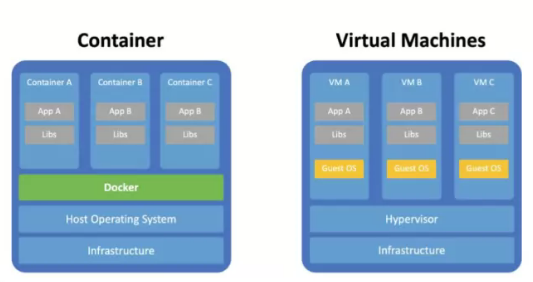
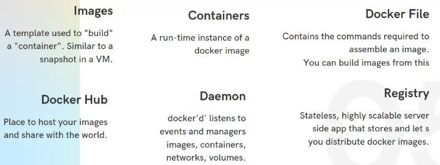
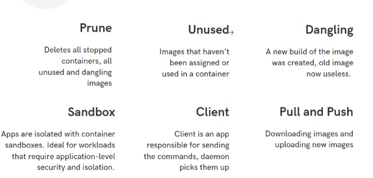
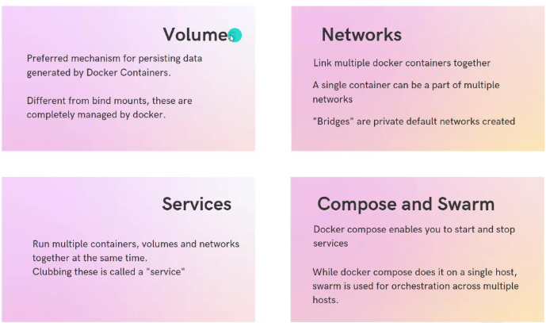

Containers &mdash; Once-in-a-decade huge shift!

- mainframe to PC;  90s
- baremetal to Virtual; 00s
- Datacenter to Cloud; 10's
- Host to Container (Serverless)
  - Serverless functions run on stateless containers in cloud.




//TODO :Good stuff out [Here](https://training.play-with-docker.com/)

even better [here](https://medium.com/@saschagrunert/demystifying-containers-part-i-kernel-space-2c53d6979504)

Application programs are comprised of

- language runtimes
- libraries
- your source code.
You application also relies on external shared libs such as libc and libssl. These external libs are generally shipped as shared componenets in the OS (/lib /lib64 /usr/lib/). This dependency on shared libraries causes problems when the application developed on laptop has a dependency on a shared library that is missing in the production OS.

# What is a container?

- Containers share the host kernel
- Containers use the kernel ability to group processes for resource control through **cgroups**
- Containers ensure isolation through **namespaces**
- Containers feel like lightweight VMs (lower footprint, faster), but are not Virtual Machines!

# Why Docker?


Docker helps you build,test, deploy without caring about the platform

**Idea**: packaging an application together with all its dependencies, so you can run that app in the same way anywhere. That concept makes your applications portable between laptops, datacenters, and clouds, and it breaks down barriers between development and operations teams.

- ## Handovers

    Handover to test, QA, next new developer etc boils down to just one readme file! ( with a Dockerfile/docker-compose.yml ofcourse).
  - Normally Handovers take 2 weeks! New devs have to install specific versions of half a dozen tools.
    Docker centralizes the toolchain and makes everything so much easier for everybody.

- ## Migrating Apps to the Cloud

    Normally you have 2 options, IaaS and PaaS.
    Use IaaS and run lots of inefficient VMs with high monthly costs, or use PaaS and get lower running costs but spend more time on the migration.
    
    Docker Provides the third option without the compromises... You migrate each part of your application to a container and then you can run the whole application in containers using Azure Kubernetes service or AWS ECS, or on your own Docker cluster in the datacenter. You now get the cost benefits of Paas and portability benefits of Iaas .
    
    Investment :=> to migrate to containers youll need to build your existing installation steps into scripts called Dockerfiles and your deployment documents  into descriptive application manifests using Docker-Compose/Docker-Swarm/Kubernetes/ECS format.
    No application code change required.

- ## Modernizing Legacy Apps

    No Need to stop for a 18-month rewrite.(for containerization)

    Monoliths run just fine in containers. Start by moving the monolith to a single container. But you'll slowly need to start splitting up to take full advantage of microservices in containers.

    **Containers run in their own virtual network**. So they can communicate with each other without being exposed to the outside world

## Terminologies




## Baby steps

Docker Playground
https://labs.play-with-docker.com/

```
Commands

Docker --help
Docker --version
Docker version --format ‘{{json .}}’
Docker info
Docker pull --help
Docker pull ubuntu:20.04 (uses a specific ‘tag’)
Docker pull redis (doesn’t use a ‘tag’, so the latest version is pulled by default)
Docker image ls
Docker images
Docker run redis
Docker ps
Docker ps -a
Docker run -it redis
Docker run -d redis
Docker run -it -d redis
Docker run -it  --name=akhilredis -d redis
Docker stats
Docker search redis
Docker search --filter=stars=3 --no-trunc redis
Docker search --filter=stars=3 --no-trunc --limit 10 redis
Docker start a8217c4c56 (also try name instead of ID here)
Docker stop a8217c4c56 (also try name instead of ID here)
Docker restart a8217c4c56 (also try name instead of ID here)
Docker pause a8217c4c56 (also try name instead of ID here)
Docker unpause a8217c4c56 (also try name instead of ID here)
Docker logs a8217c4c56 (also try name instead of ID here)
Docker exec -it a8217c4c56 bash (start bash inside the container, type exit to exit the bash)
Docker run -i -t --name=akhilredis -d redis /bin/bash
Docker exec 023828e786e0 apt-get update
Docker rename vibrant_yellow test (renames the container to “test”, container can be running or stopped)
Docker rm test (you have to stop the container before removing it, also try this with container ID)
Docker stop $(docker ps -a -q) (Stops all running containers)
Docker rm -f $(sudo docker ps -a -q) (removes all stopped containers)
Docker inspect happy_faraday (also works with ID)
Docker kill happy_faraday (same as stop)
Docker kill $(docker ps -q) (stops all running containers)
Docker system prune 
 To see dangling images in action
Cat > Dockerfile
FROM ubuntu:latest
CMD ["echo", "Hello World"]

Ctrl + D (close the file)

docker build -t my-image . //builds image from Dockerfile
docker images

//open up the editor in docker playground n make changes

FROM ubuntu:latest
CMD ["echo", "Hello World!"] (the exclamation is extra)

docker build -t my-image . //same command with same image name
docker images //now you will see dangling images

	docker image prune -a // specifically works for dangling images
Docker attach <container_name> (opposite of -d, we will see this in action in the next step)
To work with cp command - 
	Docker run -i -t --name=akhilredis -d redis /bin/bash
	
	Touch test_file (creates a test file in the current directory)

	Docker cp . akhilredis:/data (copies everything from current directory to akhilredis container)

Docker attach akhilredis (attaches to akhilredis container)
Ls (you will see the file here)

List of processes running in a container - Docker top <container_name>
 Docker events (run this command in a terminal and in a different terminal, run operations like starting a container etc. u will get all events in the first terminal)
Docker container prune (works specifically for containers)
Docker volume create new-vol
Docker volume ls
Docker volume inspect new-vol
 Docker volume rm new-vol (volumes can only be removed if the container they’re attached to is stopped)
Docker volume prune 
Let’s see an example of attaching vol to a container
Create a new vol -> docker volume create new-vol
Docker run -d --name redisvol --mount source=new-vol,target=/app redis

Now if we try to delete the volume - docker volume rm new-vol
It won’t work as it’s assigned to a container, we can stop it and then delete
attaching a volume in read-only capacity
Docker run -d --name redisvol2 --mount source=new-vol3,target=/app redis,readonly
```


`sudo usermod -aG docker $your_user"`
docker needs "root" permissions, because it uses cgroups and namespaces. So instead of using sudo, you can add yourself to the docker group.

`docker <command> <subcommand> args`

`docker version`

- verify that cli can talk to the server

`docker info`

- most config values of docker


- An Image is the binaries and libraries that make up your application
- A Container is the running instance of an Image
- You can have a lot of containers spun off the same image
- Docker's default image "registry" is Docker Hub

# Container Basics

`docker run --publish 80:80 nginx`

1. Docker downloaded image 'nginx' from Docker Hub
2. Started a new container from that image.
4. Routes the traffic from host port 80 to the container IP, port 80

- `docker ps` To Show Running containers
- `docker top` list running processes in given container

### Containers are NOT Mini-VMs

- Containers are just processes
  - A restricted process in host
- Limited to what resources they can access
- Exit when the process stops

### What happens when we run `docker container run`

1. Look for that image locally in image cache.
2. Then looks in remote image repository(default to Docker Hub)
3. Downloads the latest version (:latest by default) and stores it in local image cache
4. Creates a new container based on that image and prepares to start
5. Gives it a virtual IP on a private n/w inside docker engine
6. Opens up port 80 on host and forwards to port 80 in container
7. Starts container by using the CMD in the image Dockerfile

### What is going on inside the container?

- `docker top`
  - List of all processes in one container
- `docker inspect`
  - Entire configuration of a container
- `docker stats`
  - Performance monitoring

### Getting a shell inside Container

_No need to SSH into it_

- `docker run -it`
  - start a container interactively
- `docker exec -it`
  - Run additional command in <u>existing contianer</u>

# Image Basics

## What Exactly is an image?

An Image is just a tar of tars

It is the Application binaries + dependencies + Metadata about the image + how to run the image

- It doesnt have the complete OS! There is no kernel, kernel modules/drivers nothing!
- The Host provides the kernel :)
- It just has the binaries that the application needs
  - can be as small as one python file / executable
  - can be as huge as Ubuntu distro with apt, Apache, PHP, everything installed

## Image and its Layers

[Union File System](https://www.terriblecode.com/blog/how-docker-images-work-union-file-systems-for-dummies/)
--[more here](https://blog.knoldus.com/unionfs-a-file-system-of-a-container/)
Docker Image format is made up os a series of filesystem layers. Each layer adds, removes, or modifies files from the preceding layer in the filesystem. (Overlay filesystem). The overlay system is used both when packaging up the image and when the image is actually being used

- aufs, overlay, overlay2 are concrete implementations of union filesystem

- Images are made using the `Union File System` Concept

- `docker history <image name>`
  - Shows the layers of changes made in the image
  - History of image layers
  - Base layer + Dockerfile = Image

- `docker inspect <image name>`
  - Tells you all the metadata of the image
  - about what default env variables it takes
  - **about exposed ports**
  - about how it is run (CMD)

" A container is just a single read/write layer on top of image ". This is called **copy-on-write** mechanism (CoW)
> _Copy-on-write (sometimes referred to as "COW") is an optimization strategy used in computer programming. The fundamental idea is that if multiple callers ask for resources which are initially indistinguishable, you can give them pointers to the same resource. This function can be maintained until a caller tries to modify its "copy" of the resource, at which point a true private copy is created to prevent the changes becoming visible to everyone else. All of this happens transparently to the callers. The primary advantage is that if a caller never makes any modifications, no private copy need ever be created._
> - _Wikipedia_


### Dockerfile

- Recipe for making image.
- its not a shell script.

```
Package managers like apt, yum are one of the reasons to build containers FROM Debian, Ubuntu, Fedora or CentOS
```

`FROM` : base layer

- All images must have a FROM
- usually from a minimal Linux distribution like debian or (even better)Linux
- If you truly want to start from scratch, use FROM scratch

`ENV` : Environemnt Variables

- main way to set key:value to build and run containers
- order matters (because layers, top down)

`RUN` : Shell command

- Commands to run inside the container at build time
- Install something
- shell scripts
- the `&&` in a single RUN command is to keep them all in same layer. saves time. saves space

```
 RUN apk update 
    && apk add socat 
    && rm -r /var/cache/
```

`WORKDIR` : same as `RUN cd /some/path`

- Change current working directory

`COPY` : copy your source code from local machine into container

`EXPOSE` :
Informs Docker that the container listens on the specified network ports at runtime.

- EXPOSE doesnt  `publish` the port. It functions as a type of documentations between the person who builds the image and the person who runs the container, about which ports are intended to be published.
- Its just a damn hint! it doesnt do anything!, it just adds a metadata in `docker inspect` output regarding "ExposedPorts"
- You can just use -p to publish at runtime and be happy.
- _All published ports are exposed, but not all exposed ports are published_

`VOLUME`: this is how you "outlive" the container

- creates a mount point with the specified name and marks it as "holding externally mounted
volumes from native host or other containers"
- eg: `VOLUME /myvol`
- In Dockerfile you can specify only the destination of a volume INSIDE the container , i.e /myvol is inside the container, not host.
  - Kinda makes sense!, the Image Author should not specify host mount points.
  - while running the container, you can specify the name of the mount point in host
    `docker run --volume myvolume:/myvol`. This will resolve to `var/lib/docker/volumes/myvolume` in the host
  - If you do not specify the volume argument, the mount point in the host will be chosen automatically, usually under `var/lib/docker/volumes/<some SHA value >`
- All database container images have a VOLUME command
- eg:postgres official image Dockerfile 

`CMD`: command for the container to run

- will be run everytime you spawn a contianer from an image
- will be run everytime you `restart` a stopped container.
- If you dont specify the `CMD`, it will inherit the `CMD` of the base image used in `FROM`

Each command in Dockerfile creates a new layer. Each layer contains the filesystem changes of the image between the state before the execution of the command and the state after the execution of the command.
Since Docker CACHES every single layer during build, and uses them in subsequent builds,
_you should keep the instructions that change the most at the bottom of the dockerfile_

#### ENTRYPOINT v/s CMD ?
> _CMD allows you to provide defaults for an executing container_
> _ENTRYPOINT allows you to specify the executable_

```Dockerfile
FROM ubuntu
ENTRYPOINT ["executable", "param1", "param2"]
CMD ["param3", "param3]
```
Would result in the following command 
`executable param1 param2 param3 param4`


- **ENTRYPOINT** is the executable name... **CMD** is just (default) arguments to the entrypoint...
- You can allow users to supply different command line args for ENTRYPOINT 
- You can allow users to override the executable (ENTRYPOINT) by providing `--entrypoint` flag during docker run.
- Dockerfile should specify atleast one of CMD or ENTRYPOINT
- ENTRYPOINT should be defined when using container as an executable
- CMD should be used as a way of defining default args for an ENTRYPOINT command 
	- OR for executing an ad-hoc command in a container
- CMD will be overridden when running the container with arguments

##### Shell and Exec forms
> _always prefer the exec form_

```bash
# shell form
ENTRYPOINT command param1 param2

# avoid the shell form...
# the shell form causes ENTRYPOINT to be started as a subcommand of --->"/bin/sh -c"<---
# Your ENTRYPOINT thus will not be PID1 of the container.
# ... will not receive Unix Signals like SIGTERM

# shell form
CMD arg1 arg2
CMD command arg1 arg2

# the shell form causes CMD to be executed in -->"/bin/sh -c"<--
# If you want to run CMD outside of a shell, you need to use the exec form..
# ...and give the full path to the command as the first string in the array with args as remaining strings in the array
CMD ["/path/to/command", "arg1", "arg2"]
```

```bash
# exec form
ENTRYPOINT ["command",  "param1",  "param2"]

# In exec form, variable substitution WILL NOT happen. Access to shell isnt there...
ENTRYPOINT ["echo",  "$PATH"]
# will NOT work!
ENTRYPOINT ["/bin/sh", "-c", "echo $PATH"]
# will work though

```

##### Example0: No ENTRYPOINT No CMD
Not allowed. Error

##### Example1: No ENTRYPOINT
```Dockerfile
FROM alpine
RUN apk add sl
CMD ["sl"]
```
`docker build -t sl .` ---> `docker run -it sl`

##### Example2: No CMD
```Dockerfile
FROM alpine
RUN apk add sl
ENTRYPOINT ["sl"]
```
`docker build -t sl .` ---> `docker run -it sl`

##### Example3: ENTRYPOINT and CMD
```Dockerfile
FROM alpine
RUN apk add sl
ENTRYPOINT ["sl"]
CMD ["-a"]
```
`docker build -t sl .` ---> `docker run -it sl`


##### Example4: ENTRYPOINT (shell form) only
```
ENTRYPOINT exec_entry p1_entry
```
will result in `/bin/sh -c exec_entry p1_entry`


##### Example5: ENTRYPOINT (exec form) only
```
ENTRYPOINT ["exec_entry", "p1_entry"]
```
will result in `exec_entry p1_entry`


##### Example6: CMD (shell form) only
```
CMD exec_cmd p1_cmd
```
will result in `/bin/sh -c exec_cmd p1_cmd`

##### Example7: CMD (exec form) only
```
CMD ["exec_cmd", "p1_cmd"]
```
will result in `exec_cmd p1_cmd`


##### Example8: ENTRYPOINT (shell form) and CMD (shell form)
```
ENTRYPOINT exec_entry p1_entry
CMD exec_cmd p1_cmd
```
will result in `/bin/sh -c exec_entry p1_entry`. 
CMD is totally ignored.

##### Example8: ENTRYPOINT (shell form) and CMD (exec form)
```
ENTRYPOINT exec_entry p1_entry
CMD ["exec_cmd", "p1_cmd"]
```
will result in `/bin/sh -c exec_entry p1_entry`. 
CMD is totally ignored.


##### Example8: ENTRYPOINT (exec form) and CMD (shell form)
```
ENTRYPOINT ["exec_entry", "p1_entry"]
CMD exec_cmd p1_cmd
```
will result in `exec_entry p1_entry /bin/sh -c exec_cmd p1_cmd`. 

So complex. Whyd you even do this!?

##### Example8: ENTRYPOINT (exec form) and CMD (exec form)
```
ENTRYPOINT ["exec_entry", "p1_entry"]
CMD ["exec_cmd", "p1_cmd"]
```
will result in `exec_entry p1_entry exec_cmd p1_cmd`. 

Most peaceful...

But what if you provide just a CMD: ["bash"] ? bash looks for any attached terminals , and if found, it waits for user inputs. If there are no terminals attached, it just exits. So `docker run` without `-it` is necessary if the CMD was just "bash"


#### Dockerfile Maturity Model

Dockerfile is the most basic and most important foundational layer that you need to get right. Dont obsess over orchestration, CICD in first go, but let your Dockerfile evolve to its best

1. Make it start
2. Make it log all things to stdout/stderr
    - Putting it in a logfile is an ANTIPATTERN!!!
3. Make it documented in file
4. Make it work for others
5. Make it lean
6. Make it scale
7. Version your images!
8. Version your dependencies too! dont pull the latest apt-get deps
9. Environments(dev, qa, uat, prod, etc etc) will always be infinite. You should NOT have to build images for each environments, but config should be provided at runtime `docker run`. So there should be just ONE image
    - Single Dockerfile with default ENVs, and overwrite per-environment with ENTRYPOINT scripts

## Building images from Dockerfile

- `docker build -t <image name> .`


## Tags


_every line is essentially the same image (multiple alias tags for same image)_

# Docker Networking

## Network Namespaces (Linux)
When a container is run, it lives inside its own **network namespace**, and has no idea about the network configs(interfaces) of the host. It will have its own routing table and ARP Table,... it has **its own network interface** 

### Creating ns and connecting them...

```sh
# we create  two network namespaces... 
ip netns add red
ip netns add blue

#list the ns
ip netns

# list the network interfaces on the host (default ns)
ip link
# list the network interfaces inside the network namespace
ip netns exec red ip link # OR...
ip -n red link

# show the arp table and routing table on the host
arp
route
# show the arp table and routing table inside the network namespace
ip netns exec red arp
ip netns exec red route
```

We now create a `veth` pair (virtual network interface pair) to connect the two namespaces
```sh
# create veth pair
ip link add veth-red type veth peer name veth-blue
# attach one end to red ns
ip link set veth-red netns red
# attach other end to blue ns
ip link set veth-blue netns blue
```
We then set IP addresses to the network interfaces we created on two namespaces
```sh
ip -n red addr add 192.168.15.1 dev veth-red
ip -n blue addr add 192.168.15.2 dev veth-blue

# set the interfaces "UP"
ip -n red link set veth-red up
ip -n blue link set veth-blue up

# now they can talk to each other
ip netns red exec ping 192.168.15.2
```


### Creating ns and connecting them via **Bridge Network** 
What if you have several namespaces like this ? You need a **network switch** (bridge) 

We create an **internal bridge network**.. It behaves like a **switch**.
![[docker-17.png]]
```sh
ip link add v-net-0 type bridge
# this shows up in the list of network interfaces
ip link
# set the interface "UP"
ip link set dev v-net-0 up
```
We will add all new namespaces to the bridge network, and not connect them to each other as we  did above (cumbersome).
```sh
# we delete the old direct connection.
ip -n red link del veth-red
# since they are a pair, deleting one end (one n/w interface) automatically deletes the other one (veth-blue)

# create a veth pair
ip link add veth-red type veth peer name veth-red-br
# attach one end to red ns
ip link set veth-red netns red
# attach another end to bridge network
ip link set veth-red-br master v-net-0

# create a veth pair
ip link add veth-blue type veth peer name veth-blue-br
# attach one end to blue ns
ip link set veth-blue netns blue
# attach another end to bridge network
ip link set veth-blue-br master v-net-0
```
We set IP addresses to the network interfaces on both the namespaces..
```sh
ip -n red addr add 192.168.15.1 dev veth-red
ip -n blue addr add 192.168.15.2 dev veth-blue

# set the network interfaces "UP"
ip -n red link set veth-red up
ip -n blue link set veth-blue up

# now they can talk to each other
ip netns red exec ping 192.168.15.2
```
 Note that the host cannot ping `192.168.15.1` , the host network interface needs to be "connected" to the bridge network too..
 We add an IP address to the network interface `v-net-0` (even though its a bridge, its still a network interface.)
 ```sh
 ip addr add 192.168.15.5/24 dev v-net-0
```

As  of now, the network namespaces are completely sandboxed and the only way to the outside world is via the `eth0` network interface on the host.

### Access to the world outside the host
![[docker-18.png]]
We need a **Gateway** to the outside world. The host can act as the gateway.. 
```sh
# the host has an ip address "192.168.15.5" on the bridge network, so use
# it as the gateway.
ip netns exec blue ip route add 192.168.1.0/24 via 192.168.15.5
```
![[docker-19.png]]
You can now ping `192.168.1.3` from the blue namespace, but you dont get any response back **because there is no NAT configured yet**. 
```sh
iptables -t nat -A POSTROUTING -s 192.168.5.0/24 -j MASQUERADE
```

There's no internet connectivity inside these namespaces yet. The host can act as the gateway
```sh
ip netns exec blue ip route add default via 192.168.15.5
```

### Access FROM the outside world
The outside world cannot yet reach the namespaces...
There are two options
- add a routing table rule explaining that the internal namespaces can be reached VIA the host `192.168.1.2`
- use forwarding via `iptables` 

Adding a port forwarding rule , "any traffic coming to port X on the localhost must be forwarded to port Y on the namespace..."
```sh
iptables -t nat -A PREROUTING --dport 80 --to-destination 192.168.15.2:80 -j DNAT
```
## Docker Networking
### `--network=none`
Absolutely shielded from outside world, and other containers. The container itself cannot reach the outside world. Noone from outside can reach it. The lone container.
```sh
docker run --network none nginx
```

### `--network=host`
Share the host's network namespace. No new ns is created. 

### Bridge network (default)
All containers connect to the default bridge network . They get their own internal **private adress** on this **private network**(subnet). 
The default network is also named "bridge". `docker network ls` will show it. But on the host , `ip link` will show that its name is `docker0` **network interface** . The IP linked to the bridge network is  shown in `ip addr` command (look for `docker0`).  To 

> Internally, it was created with `ip link add docker0 type bridge` command on the host

![[docker-20.png]]

### Network Namespace
Whenever a container is created, docker creates a **network namespace** for it.  `ip netns` to list the namespaces. When you run `docker inspect <containerid>`, under the "NetworkSettings", you can see "SandboxID" and "SandboxKey" which will refernce this namespace ID shown in `ip netns` output. 

But where are the `veth pairs` which connect the container(namespace) to the bridge network?

`ip link` shows the one end of the veth pair (on the bridge ) as say, `vethbb1c343@if7` . The other end of  the veth pair ( on the ns ) can be seen with `ip -n <nsID> link` as `eth0@if8` for example.

The IP address of the interface on the ns (or the iP of the container) can be viewed by `ip -n <nsID> addr` . The address under `eth0@if8` would be the IP address of the container.
![[docker-21.png]]
But how does traffic intended for a container reach it via the host? There should be an `iptable` forwarding rule...
```sh
iptables -t nat -A PREROUTING -j DNAT --dport 8080 --to-destination 80
```
But docker uses a special "DOCKER" type instead of PREROUTING
```sh
iptables -t nat -A DOCKER -j DNAT --dport 8080 --to-destination 172.17.0.3:80
```

See the entire list of routing
```sh
iptables -nvL -t nat
```

### Simple Docker Networking usecases 

- `docker port <CONTAINER>` List all the exposed port
- Each container is connected to a private virtual n/w "bridge".
- Each virtual n/w routes through NAT firewall on host IP
- All containers on a virtual network can talk to each other without -p !!!
- Best Practice is to create a new virtual n/w for each app
  - network "my_web_app" for mysql and php/apache containers
  - network "my_api" for mongo and nodejs containers

- Docker does NOT use the same IP as the host
  - `docker inspect --format '{{ .NetworkSettings.IPAddress}} <CONTAINERNAME>`

- `docker network inspect`
- `docker network create --driver`

-`docker network ls`
    - All n/ws that were created
    - bridge, host, none - these 3 would be there
    - bridge is default virttual n/w
    - host helps you skip virtual n/w and attach to the host's n/w

- `docker network connect` Add a NIC to a running container
- `docker network disconnect` Remove a NIC from a running container

## DNS &mdash; Inter-container communication

-> DNS | Naming is crucial for service discovery<br>
-> Docker uses container names  to locate them
--> Container Name becomes the hostname of the container
-- -- -->CONTAINERS CAN TALK TO EACH OTHER VIA COMMON BRIDGE NETWORK WITHOUT '-p' OPTION!

```
NOTE!
The default bridge network(Docker0) does not have this DNS. Hence you need to use 
--link option to manually link all the containers that need to communicate.

docker-compose actually CREATES a new network, so it doesnt have this problem 
```

Try this out; give the same network alias to two elasticsearch containers and connect them to the same bridge network(manually created; because default bridge docker0 is a retard)

```
docker network create my-network
docker run -d --network my-network --network-alias search elasticsearch 
docker run -d --network my-network --network-alias search elasticsearch 
docker run -rm -it centos curl search:9200
docker run -rm -it centos curl search:9200
docker run -rm -it centos curl search:9200
docker run -rm -it centos curl search:9200
docker run -rm -it centos curl search:9200
docker run -rm -it centos curl search:9200
docker run -rm -it centos curl search:9200
```

### Bridge, None and Host networks


### Overlay Network

This will be explained in detail in swarm section

- Pertains to multi host (multi-node) network
- Its a "bridge" network across nodes


# Docker Storage & Volumes

- **Storage Drivers** [..read more]([About storage drivers | Docker Documentation](https://docs.docker.com/storage/storagedriver/))
	- They take care of how to store images,containers in their select formats.
	- How to write data to the top-most "container layer" which is writable in the container.
		- Ideallly the container should write to volumes (see volume drivers ), but there are a lot of /tmp files and other files being written on the top-most "container layer".
	- **Volumes are NOT handled by Storage Drivers**
	- eg: AUFS, ZFS, BTRFS, Overlay, Overlay2, Device-Mapper
	- `Overlay2` is the current default.
	- Docker will choose the best available storage driver depending on the OS.
- **Volume Drivers** (Plugins)
	- Volumes are handled by Volume Driver Plugins
	- eg: Local, AzureFileStorage, Convoy, DigitalOceanBlockStorage, Flocker, NetApp, Portworx, Flocker, RexRay(for AWS EBS)
	- `Local` : is the default volume driver. Manages creating and storing data in `/var/lib/docker/volumes`. Most used.
	

## Container Lifetime & Persistent Data
Containers are immutable and ephemeral, disposable
> Why ? 
> Separation of concerns. The application in container should not be concerned about persistence.

### How does Docker store data ? (on the host machine)
On the host machine, `/var/lib/docker` is where docker stores all data
- `/var/lib/docker`
	- `/aufs`
	- `/containers`
	- `/image`
	- `/volumes`

In docker, when the container is "started"(run), it adds a new _writable layer_ on top of the read only layers of the image. Every file created or modified by the container is written to this top most layer only.
> **Info**
> If container tries to modify a file in the read-only layers (say /usr/bin/xyz) then a copy of this file would be made and placed in the read-write topmost layer...and then modified.
> This is called **copy-on-write** 
![[docker-15.png]]

If the container is deleted, this topmost layer(read-write) is totally lost.
What if you wanted the data to live beyond the lifetime of the container?

### How to "outlive" the container? Volumes

1. **Volumes**  (_You dont care where the data lives in the host machine_)(_clean slate_)
2. **Bind Mounts**  (_You know exactly where the data lives in the host machine_)(_You already have some data on the host machine that you want to **mount** on to the container._)

#### Volumes
You can first create a **Volume** , and then mount it. The volume would live on the host machine at `/var/lib/docker/volumes` . If you created a **Volume** called `my-volume` , it would be at `/var/lib/docker/volumes/my-volume`. 
```bash
docker volume create my-volume
docker run -v my-volume:/var/lib/mysql mysql
```

You don't have to explicitly create the volume, using the `-v` flag with the volume name will create it automatically
```bash
docker run -v my-volume-2:/var/lib/mysql mysql
```

- Special location outside of container UFS(Union File System)
- `docker volume inspect`
- volumes can be shared and re-used among containers
- volumes persist even after container is stopped.
- volumes persist even after container is deleted.
- volumes need manual deletion.
- You can name a volume using --volume or -v during `docker run`.
  - `docker run -v /var/lib/mysql` does the same job as `VOLUME /var/lib/mysql` in Dockerfile. I.e It creates a volume
  - `docker run -v mysql-db:/var/lib/mysql` creates a named volume

- Lets say you have to upgrade your postgres, but keep your data.

    ```shell
    $ docker run -d --name psql1 -v psql-volume:/var/lib/postgresql/data postgres:9.6.1

    //Now check the logs of psql1 container. pretty huge ?

    $ docker ps -q | xargs docker rm -f

    $ docker run -d --name psql2 -v psql-volume:/var/lib/postgresql/data postgres:9.6.2

    // now check the logs of psql2 container. Logs are smaller. This is because it is using the old data volume
    ```

#### Bind Mounts
When you already have some data on your host machine, and want to mount it to the container, you use bind mounts. You specify directly the path on the host, instead of the volume name.
```bash
docker run -v /home/dhirajbhakta/Development/somedir:/var/lib/mysql mysql
```


 _**very useful for local development**_

- Maps a host file or dir to a container file or dif
- Basically just two locations pointing to the same file(s)
- Skips UFS, and host files overwrite any in container
- Cant use in Dockerfile, must be at runtime during `docker container run`
- ...` run -v /home/dhirajbhakta/mount:/var/lib ` a forward slash in the v argument makes it a bind mount
- a Bind mount doesnt need volume to work

 _**Trust me! this will change the way you work**_

 ```
 docker run -d -p 80:80 -v $(pwd):/usr/share/nginx/html nginx
 ```

Next one does bind mounts, but tells to leave node modules alone (use node modules inside of the container, and not of the bind mount)

```
  docker run -v $(pwd):/usr/app -v /usr/app/node_modules --name react-container-with-volumes -it -p 3000:3000 react-app
```

# Docker Compose

 1. Configures relationships b/w containers
 2. Saves our `docker container run..` settings in an easy-to-read file.
 3. Creates one liner developer environment startups!

 **docker-compose is not meant to be run in PROD**
 -> Ideal for local development and test

 **core**: All docker-compose does is talk to the docker daemon <u>via its APIs</u> instead of us using the docker client (CLI)

 `docker-compose.yml`

- This YAML file describes our dev environment as a config
  - conatiners ..and their env
  - networks
  - volumes

- `services` section
    -

  -
    -
    -
    -
    -
    -
    -
    -
    -
    -
    -
    -
    -
    -
    - ```
        servicename:
            image:
            command:
            environment:
            volumes:

        servicename2:
            ...

    ```
    servicename is a friendly name of the container, it will also become the DNS name which will be used in a docker network (similar to --name previously)

    Basically all you do in `docker run` command you can do here. (replacing a shell script which automates the docker run command)

    `environment` is the -e analogue of docker run

    Also docker-compose understands that '.' is pwd. No need to $(pwd) while mapping bind mounts!
- `volumes` section:
- `networks` section:

### docker-compose and the bridge network

 docker-compose automatically creates a new bridge network and attaches the given containers to that network so that theyre able to communicate with each other

### `docker-compose up`

 Set up volumes/networks and start all containers

### `docker-compose down`

 Stop all containers and cleanup

### docker-compose can build your (custom)images, and cache it

  Compose can build your images at runtime

- Builds the image with `docker-compose up` if not found in cache
- Great for complex builds that have lots and logs of vars or build-args

  ```
  When your `docker run ` command is toooo big with env vars and shit, use docker-compose
  ```

  instead of just providing the `image` attr, we specify the `build` attribute with the `dockerfile` and then provide an `image` attr to build the custom image

- when both `build` and `image` attrs are present the semantics/purpose changes. It becomes " i want to build a custom image using this dockerfile "

 **If all your projects had a Dockerfile and docker-compose.yml then new dev onboarding would be**

- `git clone XYZ`
- `docker-compose up`

# Orchestration

New problems with growing number of containers (microservices).

- how to we deploy/maintain hundreds or thousands of containers across one or dozens of instances?
- How do we automate container lifecycle?
- how can we easily scale out/in/up/down?
- How can we ensure our containers are re-created if they fail?
- How can we replace containers without downtime (blue/green deployment)?
- How can we control/track where containers get started?
- How can we create cross-node virtual networks?
- How can we ensure only trusted servers run our containers?
- How can we store secrets, keys, passwords and get them to the right container (and only that container)?

_The goal of the orchestrator is to match desired=actual_
. More on this later...

## Understand RAFT protocol

RAFT = how to ensure consistency in a distributed environment

"Distributed Consensus"
[The Paper](https://raft.github.io/raft.pdf)<br>
[Basics](https://raft.github.io/)<br>
[WOW](http://thesecretlivesofdata.com/raft/)

# Orchestraction -- Docker Swarm

## What is a swarm?

Swarm = Multiple docker HOSTS which run in *swarm mode* and act as `managers` and `workers`.

A given docker HOST can act as manager, worker or both

### node?

-- node is an instance of the Docker Engine participating  in the swarm.

One Host = One IP = One node... One Docker Engine

You can run multiple nodes distributed across multiple physical/cloud servers.

A Node can be a `manager node` or `worker node`

### manager?

-- manages membership and delegation

### worker?

-- runs swarm `services`

### service?

-- When you create a service, you define its "optimal state" (number of replicas etc). Docker works to maintain that desired state. If a worker node becomes unavailable, Docker schedules that node's `tasks` on other nodes.

### task?

-- A task is a running container which is part of a swarm service and managed by a swarm manager

 docker swarm commands are not enabled by default in docker CLI

- `docker swarm`
- `docker node`
- `docker service`
- `docker stack`
- `docker secret`

 Run `docker swarm init` to enable swarm mode ---> Creates a single node swarm!

 ```
 Note that docker swarm does not use the traditional docker APIs to orchestrate. Instead it has its own Swarm APIs for all this distributed mumbo jumbo
 ```

## Manager and Worker nodes

 

- Manager nodes have an internal distributed state store `Raft store`
- "_Manager is a Worker with permissions to control the swarm_"
- Workers are constantly reporting to the Managers and asking for new work. lol
- Managers also evaluate if what a worker is told to do and what its actually doing matches or not


## What is a service?

- `Service` is an _image_ of a microservice.
- When you create a  service, you specify which container image to use and which commands to execute inside the containers;
  - you also specify the number of `replicas`

 

 When you deploy the service to the swarm, the `swarm manager` accepts your service definition as the <u>Desired State</u> for the service. Then it schedules the service on nodes in the swarm as one or more replica `tasks`. The tasks run independently of each other on nodes in the swarm

### What is a task?

 Task is the atomic unit of scheduling in the swarm. Each taks is a "slot" the scheduler fills by spawning a container.

 ```
 You declare a desired service state by
  - creating a service
  - updating a service

The orchestrator realizes the desired state by scheduling tasks.

If any container crashes/fails health check, the orchestator creates a new replica task that spawns a new container.
 ```

- one task = one container
- `task` is a "slot" where the scheduler places a container.
- If the container fails health checks/terminates, then the task terminates

### Create a service <DEMO> (single node swarm)

- `docker service create alpine ping 8.8.8.8`
- `docker service ls`
- `docker service ps <service name>`
- `docker service update <service name> --replicas 3`
- `docker service ps <service name>`
- Now you can find the docker containers using `docker ps` and forcibly kill some containers
- `docker service ps <service name>`

### Create a multi node swarm

Not possible to automate this

## `docker swarm init`

- Lots of PKI and security automation
  - Root Signing Cert created for our Swarm
  - Cert issued for first Manager node
  - Join tokens created

- RAFT database created to store root CA, configs and secrets
  - Encrypted by default on disk
  - No need for another key/value system/db to host orchestration/secrets
  - Replicates logs among Managers via mutual TLS in "control plane"

### `docker node ls`

## Multi host Overlay Network

 Overlay Network = Bridge Network over multiple nodes ( swarm-wide bridge network)
 Overlay Network: Connects multiple Docker daemons together to create a flat virtual network across hosts where you can establish communication between a swarm service and a standalone container, or between two standalone containers on different Docker daemons. This strategy removes the need to do OS-level routing between these containers.

- For container-to-container communication within a single swarm
- NOT related to incoming requests from outside the swarm
- A Service can be connected to more than one network ( zero, one, or more)
  - for isolation
 `docker network create --driver overlay myoverlaynw`
 Overlay networks are best when you need containers running on different Docker hosts to communicate, or when multiple applications work together using swarm services.

 Some Common Sense stuff

- replicas dont need to talk to each other within a service :facepalm:
  - Dont waste time inspecting for overlay network when you create a service over multiple nodes.

## Routing Mesh (The Ingress Network)

Try this,

- create 2 nodes (EC2 or whatever)
- `docker swarm init` on one node, --> Make it the manager. Make the other node the worker.
- `docker service create -p 80:9200 elasticsearch:2` on the manager
- Now you KNOW that there is just ONE container running on ONE of the nodes
- `curl <IP of node1>` . Do you get some elasticsearch result?
- `curl <IP of node2>` . Do you get some elasticsearch result? YES!! , HOWW??

This is because of the **Global Traffic Router** or the **Swarm Routing Mesh**  (Also called the _Ingress_ Network)

- This is actually a Overlay Network (Find it in `docker network ls`, named as "ingress")
- It routes incoming (ingress) packets for a service to the proper task
- Spans all nodes in the swarm
- Uses 'IPVS' of Linux Kernal to do this
- Load Balances swarm services across their tasks
- This is a Layer3 Load Balancer(IP+Port layer[TCP]) Not Layer 4[DNS]
  - l4 load balancer usecase: multiple websites on the same server on the same port!
  - [good resource on HA and load balancer!](https://www.nginx.com/resources/glossary/)
- 2 ways
  - just blindly expose the IPs of the nodes (or their DNS names)
  - Creates a VIP(virtual IP) in the same subnet as the nodes, and gives it a DNS = service name! VIP acts as the load balancer and distributes the load across all the tasks


## Multi Service App <DEMO>

- [Docker's Distributed Voting App](https://github.com/dockersamples/example-voting-app)

- Create the Overlay Networks first
  - `$ docker network create -d overlay backend`
  - `$ docker network create -d overlay frontend`
- Create the Microservices
  - `docker service create --name vote --network frontend -p 80:80 --replicas 2 bretfisher/examplevotingapp_vote`
  - `docker service create --name redis --network frontend redis:3.2`
  - `docker service create --name worker --network frontedn --network backedn bretfisher/examplevotingapp_worker:java`
  - `docker service create --name db --network backedn  -e POSTGRES_HOST_AUTH_METHOD=trust postgres:9.4`
  - `docker service create --name result --network backedn -p 5000:80 bretfisher/examplevotingapp_result`

## Docker Stacks &mdash; docker-compose for swarm

- `docker stack` is to `docker service` what `docker-compose` is to `docker-run`
- `docker stack deploy` better than `docker service create`
- Stacks accept compose files as their "declarative" definition for services, networks and volumes
- One stack = One swarm only
- **version 3 or higher** in the yml file
- `docker stack deploy -c <yml file> <name of the stack>`
  - Creates the objects in the scheduler --> which will create the tasks --> which will create the containers.
- If you make changes to the yml file, just re-run the `docker stack deploy` command.When we do a "docker stack deploy" on an existing stack, it will deploy the changes as service updates.

### `docker stack ls`

### `docker stack ps <stack name>`

### `docker stack services <stack name>`


# Orchestration -- Kubernetes

...Go to the dedicated md page for this -___-

# Swarm v/s K8s

# Dockerfile reviews

# The Perfect Full App Lifecycle with #docker-compose#

You can do everything with just one compose file

Needed Files:

1. docker-compose.yml  ( defaults for all other environments)
2. docker-compose.override.yml  ( defaults for all other files)
3. docker-compose.test.yml  
4. docker-compose.prod.yml  

### Development Environment

Local `docker-compose up`

_Picks up the override file and patches it on top of default file automatically and picks it up_

_Use Bind mounts to your src dir like a maniac during development_

### CI Environment

Remote `docker-compose -f docker-compose.yml -f docker-compose.test.yml -d up`

Note: You can use `extends` attr in compose file

### Production Environment

Remote `docker-compose -f docker-compose.yml -f docker-compose.prod.yml -d config`

_This creates a new docker-compose file_

## Docker Healthchecks

- Supported in Dockerfile, docker-compose, docker run , swarm
- Docker will exec the command in the container . ex: `curl localhost/health`
- Expects 0(OK) or 1 (BAD)
- HEALTH states
  - starting
  - healthy
  - unhealthy
- Note that Docker will not take any action on unhealthy containers, but Services will

eg: `docker run -d --health-cmd="pg_isready -U postgres || exit 1"  postgres`

## Docker Registry

#### When you want to push image to a specific registry

- First rename the image tag to have host:port/ as prefix
eg : `docker tag minas-morgul localhost:5000/minas-morgul`

    then do `docker push` :-> it will push to the locally hosted docker registry :)

    Note that you can run your own registry in localhost. Just `docker pull registry` and checkout its instructions.

### `docker system df` -- occupancy stats

### `docker system prune`

    - docker image prune
    - docker container prune

## HACKS

```bash
# If you ran out of disk space for data-root for docker
do you want to have the containers in /home/youruser, then you can create /home/youruser, cp /var/lib/docker to /home/youruser/ (with --preserve=ownership), remove /var/lib/docker and symlink /home/youruser/docker to /var/lib/
```

# Container Ecosystem - CRI, CNI, CSI, ...OCI
Especially due to Kubernetes, "interface specifications" or "standards" were developed for Container Runtimes, Networking Solutions, Storage Solutions... so that multiple players can contribute, not just Docker & co.


![[docker-16.png]]
### CNI ? - Container Network Interface

- creates a network namespace
- deletes network namespaces

### CSI ? - Container Storage Interface
Multiple vendors already provide cloud native storage solutions. AWS EBS, EFS, AzureDisk, Google's block storage and so on. To allow K8s (or any container runtime) to use these solutions to create and mount volumes, you would need appropriate **CSI Plugin** , eg: [AWS EBS CSI Driver]([Amazon EBS CSI driver - Amazon EKS](https://docs.aws.amazon.com/eks/latest/userguide/ebs-csi.html))

### CRI ? - Container Runtime Interface

Defines the API between Kubernetes and the container runtime.

### OCI ? - Open Container Initiative

- Define what a container is, so everyone can implement it
  - image-spec: whats in a container
  - runtime-spec: how to run a container
- how to package, annotate, distribute, run...
- OCI ended the container wars

CRI and OCI are two sides of the same "adapter" - one side standardizes the APIs exposed by the container runtime for use by the orchestrator... the other side standardizes the image format.

## Docker Multistage builds ( Distillation Pattern )

&mdash; to reduce the final image size

# Docker Internals

<http://redhatgov.io/workshops/containers_the_hard_way>

Linux kernel features: namespaces and cgroups and all that...

A container is a sandboxed runtime environment that exists on a Linux system. The sandbox is constructed using utilities that exist in the Linux Kernel. Applications running in this sandbox share a Kernel with their host, but certain parts of the Kernel that store machine state are abstracted through namespaces. Namespaces allow the isolated environment to have a different state than the host even though they are sharing a Kernel.

## Control Groups &mdash; limit what your processes use

- **limits**, and isolates resources (CPU, memory, n/w , disk I/O) for groups of processes.

## Namespances  &mdash; limit what your processes see

### PID and IPC Namespaces

The PID namespace allows a process and its children to run in a new process tree that maps back to the host process tree. The new PID namespace starts with PID 1 which will map to a much higher PID in the host’s native PID namespace. The Inter-Process Communication (IPC) Namespace limits the processes ability to share memory.

### Network and UTS Namespaces

The Network Namespace allows a new network stack to exist in the sandbox. This means our sandboxed environment can have its own network interfaces, routing tables, DNS lookup servers, IP addresses, subnets…​ you name it! The Unix Time Sharing (UTS) Namespace exists solely for storing the system’s hostname. Seriously. A whole namespace to store one string. This namespace has a long history and has changed quite a bit along the way. It exists the way it is for historical reasons.

### Mount Namespace

The Mount Namespace is the part of the Kernel that stores the mount table. When our sandboxed environment runs in a new Mount Namespace, it can mount filesystems not present on the host. This is very important, as you’ll see.

### User Namespace

The User Namespaces allow our sandboxed environment to have its own set of user and group IDs that will map to very high, unique, user and group IDs back on the host system. They also allow the root user in the sandbox to be mapped to another user on the host.

## Copy-on-write

an application and its dependencies come from an image file. The contents of this image file are duplicated into our sandbox as the root filesystem using OverlayFS and chroot. Technically speaking, there are many strategies for mounting the root filesystem in the container, but OverlayFS is quite common and is what we will explore in this workshop.

Containers get their root filesystem from a container image file. This is typically pulled from a registry. This file is, essentially, a TAR archive with the root filesystem contents and some metadata. Those contents are then made available to the running container through use of an Overlay Filesystem. The Overlay Filesystem mechanism allows the container to use the files provided by the image and make ephemeral changes to those files.

This is how Overlay Filesystems work. There are four directories: LOWER, UPPER, WORK, and MOUNT. The LOWER directory contains the filesystem’s initial state. This is the contents of the container image and can be read only. The UPPER directory is where runtime changes will be stored and must be read/write. The WORK directory is where runtime changes are staged and must be read/write. Finally, the MOUNT directory is simply a directory where the OverlayFS is mounted and presented as a single filesystem. This is the directory we will chroot our container into.

images usually get stashed into `/var/lib/containers` or `/var/lib/docker`

# --MyQuestions--

1. What exactly is a container(understand unionfs)
2. What exactly is a image(understand unionfd)
3. How networking works in docker
4. How much memory/CPU/hdd does a container take by default? can this be tuned?
5. containerd & runc?
6. namespaces & cgroups & unionfs?
7. ARG values vs ENV values ? confused about envs everywhere!
7. Deeper understanding of what is meant by a `port`?
    - Open port/Closed port
    - TCP Port/UDP Port
    - Firewall?
    - NAT?
    - DNS records?
    - DNS round robin (Poor man's load balancer)
    - subnets and masks
    - iptables
8. xargs command, master it
9. who should do the `docker build`
    - should not do it on production, because it will consume resources.
10. Why Cant i just upload Dockerfile, instead of `docker push` into registries?
11. Why Cant i just share Dockerfile to QA, TEST, devops guys instead of the image?
    - same as before
12. netcat, nc, telnet, lsof, nmap..all ways to find local/remote open ports
