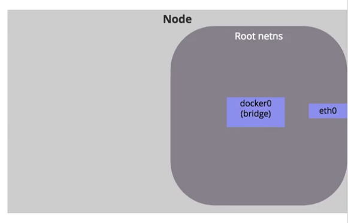

# Introduction

K8s exists to simplify the task of building, deploying and maintaining distributed systems.
Its important to understand the **core challenges of distributed systems** that led to the development of k8s.

You care only about your application. You just want it deployed... in one logical unit that abstracts everything underneath....**The Cluster**

You just want to _define_ the application in a YAML file (manifest), and let Kubernetes handle the rest.

**"The rest"?**

- Say a `node` in the cluster just died, and killed off some containers with it
  - Kubernetes will see this and starts replacement containers on the host
- Say a container became "unhealthy"
  - Kubernetes will restart it.
- Say a `component` is under high load/stress.
  - Kubernetes will start extra copies of the component in new containers.

**Your Job** :-> Define the Dockerfile and the kubernetes YAML file properly. You specify WHAT you want to happen

**K8s' Job** -> Make sure `CURRENT STATE == DESIRED STATE` ( a self healing app ). It figures out HOW to make it happen.

### List of (core)Topics
- Core Concepts
    - Kubernetes architecture
    - Create and configure Pods
- Configuration
    - ConfigMaps
    - Secrets
    - ServiceAccounts
    - SecurityContexts
    - Resource requirements
- Multi-Container Pods
    - Ambassador Pattern
    - Adapter Pattern
    - Sidecar Pattern
- Observability
    - Readiness and Liveness Probes
    - Container Logging
    - Monitor and Debug Applications
- Pod Design
    - Labels, Selectors and Annotations
    - Rolling updates & Rollbacks in deployment
    - Jobs and CronJobs
- Services and Networking
    - Network Policies
- State Persistence
    - Persistent Volumes
    - Persistent Volume Claims


### Container Orchestrator
- You have many nodes
- You want to run your "service(s)" on all those nodes, with replicas of each service
- container orchestration is the automation of much of the operational effort required to run containerized workloads and services.
  - provisioning
  - deployment
  - scaling (up and down)
  - networking
  - loadbalancing

### What problems does Kubernetes solve?

- rise of microservices -> rise of container tech
- increased use of containers
- managing 1000s of such containers using scripts and self made tools made it complex and irritating
- scaling , deployment and recovery
- what if one of the container goes down?
- HA(no downtime).
- checking if one container has crashed across multiple nodes is hard
- K8s automatically checks the health of every container
- ensures that theyre always running
- K8s can spin up multiple containers (horizontally scale) and have a load balancer in front of it
- easy rollback
- Not restricted to any cloud provider
  - AKS (Azure)
  - EKS (AWS)
  - GKE (GCP)
- Automatically configures your infra
- speeds up deployment
- allows you to build complex apps
- Kubernetes brings infra level concerns like the following into app configuration
  - Load balancing
  - networking
  - storage
  - compute

### What do we mean by "reliable, scalable distributed systems"?

- more and more services are delivered over the network via APIs
- these APIs are often delivered by a distributed system, the various pieces that implement the API running on different machines, connected via the network and coordinating their actions via n/w communication.
- These systems must be _highly reliable_, they cannot fail, even if a part of the system crashes or stops working
- They must  _available_ even during rollouts and other maintainence events
- They must be _scalable_, so that they can grow their capacity to keep up with increasing usage without radical redesign of the distributed system.

### ECS, Mesos, Cloudfoundry, Marathon, ...wtf??

These are cloud-specific  orchestrator offerings

But Kubernetes and Docker Swarm is infrastructure agnostic
Cloud will deploy/manage Kubernetes for you. Also, Infrastructure vendors are making their own distributions of Kubernetes.

Independence and standardization are the main reasons Kubernetes is so popular. Once you have your apps running nicely in Kubernetes you can deploy them anywhere, which is very attractive for organizations moving to the cloud, because it keeps them free to move between data centers and other clouds without a rewrite. It's also very attractive for practitioners - once you've mastered Kubernetes you can move between projects and organizations and be very productive very quickly.

#### Which Distribution of Kubernetes should I choose?

- You can choose a cloud distribution (AWS EKS, GKE)
- Self managed (Docker Enterprise, Rancher, Openshift, Canonical, VMWare PKS)
- ! Dont use the pure upstream Github Kubernetes!

#### whats all this minikube, microk8s, k3s

- This is for local development.
- Single node cluster

> The primary goal of minikube is to make it simple to run Kubernetes locally, for day-to-day development workflows and learning purposes.

- k3s
  - `curl -sfL https://get.k3s.io | sh -s - --docker --disable=traefik --write-kubeconfig-mode=644`

#### Kubernetes vs Swarm

- Swarm :- EASY
- Kubernetes :- FEATURES & FLEXIBILITY

#### Immutable Infrastructure

#### Declarative Configuration

- IaaC - Infrastructure as a Code : the idea of storing declarative configuration in source control.
- as opposed to imperative configuration, where the state of the world is defined by the execution of a series of instructions.

### Self Healing Systems

_continuously_ take actions to ensure that the current state matches the desired state.

- Operator Pattern:
  - more advanced logic needed to maintain, scale, and heal a specific piece of s/w(like MySQL, or Prometheus) is encoded into an **operator application** that runs as a container inside the cluster.
  - The code in the operator is responsible for more targeted and advanced health detection and healing that can be achieved via Kubernetes' generic self-healing.

<hr/>
<hr/>

# Kubernetes

### Basic Architecture


![[kube-51.png]]
Node: A machine. ( host/machine/Ec2/VM etc ) with defined CPU and RAM<br>

- one(or more) Master Node(s)
  - runs kubernetes processes to run and manage the **worker Nodes**.
  - It has the following running
    - **the API server** (which is also a container)
      - **Frontend** for Kubernetes
      - Communicates with kubelet on worker nodes
      - kubectl talks to the API server.
      - Other systems like **Scheduler** and **ControllerManager** and **etcd** talk to each other via the API Server.
      - Other systems like **Scheduler** and **ControllerManager** and **kubelet** obtain statuses and update statuses into **etcd** <u>via the **API server** only</u>  In essence, every thing that has to happen, happens via API server.
      - API Server is the ONLY one who is able to talk directly to **etcd**.
    - **the Scheduler** (where to put the pod?)
      - checks for "tasks"-to create and assign pods from the Controller manager
      - identifies the **right node** to place a container on, after considering..
	      - containers resource requirements.
	      - nodes' capacity.
	      - taints and tolerations.
	- Scheduler does NOT put the pod on the node. **kubelet** does that. Scheduler only _decides_ where to put the pod on which node..
	- How does Scheduler choose a node for the pod? (bin pack)
		- step1: **filter** out the nodes that dont meet the criteria (not enough resources, taints, nodeselectors etc..)
		- step2: **rank** the remaining nodes. The node having more resources left _after_ the pod is assumed to run on that node, gets a higher score.
    - **the Controller manager** (detect crashes of pods, and recover. Watch status, remediate situation) (brain behind orchestration)
      - runs reconciliation loop.
      - keeps looking at current state - desired states configs and creates tasks(task to create pods) for the **scheduler** to assign to nodes.
      - **the Node Controller** _watches_ the nodes. 
	      - checks node status every 5s via the **API server**  (Node monitor period=5s)
	      - waits for heartbeats
	      - if no heartbeat for 40s, marks the node as _UNREACHABLE_ (Node monitor grace period=40s)
	      - It gives that node 5mins to come back up, after which it will evict all the pods on that node so that they can be run on other healthy nodes (POD eviction timeout=5min)
      - **the Replication Controller** _watches_ the containers/pods..
	      - ensures current=desired pods.
	- All the above "built-in" controllers are packaged as a single process called "kube-controller-manager"
	- the `ReplicaSet` uses the replication Controller.
	- **...XYZ Controller** _watches_ custom resources. You can write your own controllers for your CRDs..
     - **the etcd** (key value store of cluster state)
      - stores the current state config and desired state config
      - etcd is distributed, reliable key-value store
- multiple worker Nodes
  - worker node is where actual applications are running.
  - ...is where containers run.
  - each worker node has the following
    - **Kubelet**
      - Kubelet talks to the containers through the CRI interface (Container Runtime Inteface)
      - communicates with the master node
	      - master node continuously fetches status updates  on pods via the kubelet.
      - makes sure that the containers are running within pods. monitors the node and the pods and reports to the APIServer on a timely basis.
      - Kubelet is responsible for initially "registering" the node into the k8s cluster.
      - **NOTE:** `kubeadm` does NOT install kubelets on each workers. You should manually install the kubelets on every worker.
    - **Kube Proxy**
      - allows for n/w communication inside and outside the node.
      - allows for n/w communications between pods (even though they are on different nodes).
      - responsible for routing n/w traffic to load balanced services in the cluster. Kubeproxy runs using DaemonSet.
      - Note that many of the kubernetes control plane components are run using kubernetes itself!
      - A K8s "Service" is actually implemented via Kubeproxy. A Service really does not exist. Kubeproxy listens to new Services being created on etcd via APIServer, and then updates the routetable (iptables) of the node it runs on. Since every node runs a KubeProxy process, every node will have its routetables updated to reach the service endpoints...
    - **Container runtime**
      - Kubernetes doesnt care what container runtime you use. containerd? docker? rkt? cri-o? no issues.
      - Note that nearly everything on K8s is a container. ControllerManager, Scheduler, APIServer, DNSserver...all of these are containers.. Hence the container runtime has a massive role to play in K8s.
  - each node has one or more containers running on it


- API
  - define your applications
- Cluster
  - runs your applications
  - made of multiple **Nodes**
  - A cluster is a set of individual servers that have all been configured with a container runtime like Docker, and then joined into a single logical unit with Kubernetes

A cluster is a set of individual servers/nodes/hosts which have all been configured with a container runtime like Docker, and then joined together into a single logical unit with Kubernetes. The cluster, as one logical unit, runs your application. In normal usage you forget about the underlying nodes and you treat the cluster as a single entity. You can add Nodes to expand the capacity of your cluster.
A Kubernetes cluster consists of a set of worker machines, called nodes, that run containerized applications. Every cluster has at least one worker node
The worker node(s) host the Pods that are the components of the application workload. The control plane manages the worker nodes and the Pods in the cluster. In production environments, the control plane usually runs across multiple computers and a cluster usually runs multiple nodes, providing fault-tolerance and high availability.

### Basic flow

- You define your app in YAML files(manifest files)
- You send that YAML file to the Kubernetes API(via kubectl)
- Kubernetes compares the YAML and what’s already running in the cluster.
  - and tries to get to a desired state

What happens behind the scenes?
- When you run `kubectl get pods` for eg, kubectl sends a GET request to the **API server** on the master plane. The request is authenticated, validated ..and then data is fetched from **etcd** and returned to kubectl
- When you run `kubectl run nginx --image nginx` , kubectl sends a POST request to the **API server** to create the POD resource , API server instructs **etcd** to create k-v entries for the new pod, and a success message is returned to kubectl
	- _The **scheduler** continuously monitors the API server_
	- The **scheduler** now realises there is a new pod with  no node assigned. So it makes some calculations and decides that that new pod should run on node X.
	- The **scheduler** informs the API server about this decision.
	- The **API server** updates **etcd** with this decision on where to place the pod 
	- The **API server** also contacts the **kubelet** of node X and asks it to create a pod 
	- The **kubelet** creates the container using the **container runtime engine** installed on the node, and then updates the **API server**  that container(pod) is created.
	- The **API server** updates the data back in **etcd** 
  
### Kubernetes API?

Everything contained in Kubernetes is represented by a RESTful resource. Each Kubernetes object exists at a unique HTTP path, eg: `https://your-k8s.com/api/v1/namespaces/default/pods/mypod` leads to the representation of a Pod in the default namespace named `mypod`.

`kubectl` uses this API under the hood.<br>
To <u>Query and manipulate</u> the state of **objects** in Kubernetes <br>
Objects? := Pod || Deployment || Namespaces etc

Objects in the kubernetes API are represented as JSON or YAML files.These files are einter returned by the server in response to a QUERY or posted to the server as a part of an API  REQUEST.

`kubectl get <resourcename>`

`kubectl get <resourcename> <objectname>`

output as JSON or yaml? `-o json` or `-o yaml`

output a particular field? `-o jsonpath --template{.status.podIP}`

```
kubectl get pods my-pod -o jsonpath --template={.status.podIP}
```

### Docker vs Containerd ... in brief
Docker was the de-facto king earlier in Kubernetes. Other container runtimes became popular, and wanted to be integrated into k8s. 
So K8s created an "interface" called CRI - Container Runtime Interface, which adheres to OCI's standards (ImageSpec and RuntimeSpec).
But docker did not support CRI interface, and K8s had to support docker (legacy) via **dockershim**. 
> _For some reason, containerd is CRI compliant, and was also part of docker along with runc. I dont undestand why they had to create dockershim to get around CRI on K8s..._

Maintaining dockershim was an unnecessary headache so starting v1.24, K8s deprecated docker. But docker images will continue to work since it followed OCI imagespec.

#### Containerd , the new default.
`ctr` is the command line tool for containerd. Not user friendly. Use `nerdctl` instead. Its interface is exactly same as docker.

`crictl` is the command line tool for ANY CRI compatible container runtime. It works for containerd, rkt. Was created from Kuberentes perspective..(Kubernetes created CRI and hence critctl too.) **`crictl` is to be used for deubugging purpose in K8s, and NOT for creating containers, though you can do it** . 
> If you do create containers with `crictl`, the kubelet will later delete it because it is unaware of its presence (not recorded in etcd as a "desired state")

_**tldr; you need to get familiar with `crictl` since docker is gone**_

# ETCD 
_port: 2379_

What is etcd? What is a Key-value Store? how is it different from a DB? How does it work?
- Every info you see from `kubectl get ..` is coming from etcd.
- etcd stores info of all resources, incl nodes, pods, svcs, secrets, configmaps, accounts, roles, bindings.
- etcd is distributed. You can write/read on any etcd node.

`etcdctl` is the command line tool for etcd.

```shell
# important!
export ETCDCTL_API=3

etcdctl put key1 value1

etcdctl get key1

# to get all keys
etcdctl et / --prefix --keys-only 
```

> **Note**
> It is a good practice to host etcd in a separate pool of nodes, away from other kubernetes control plane components.

## Consistency Guarantees
You can read from any etcd node and you are guaranteed to get the same value.
You can write to any etcd node, and it will go **through the leader** node..The leader ensures copies are distributed to other nodes too. The write is considered "complete" if the leader gets ACKs from (majority of) all other nodes in the etcd cluster.

### Leader Election - RAFT Protocol
All nodes start a random timer, the first one whose timer times out will ask for votes from the other nodes to be the leader.
The leader sends notifications to other nodes at regular intervals saying "im alive!". if any node fails to get this notification, it will kickoff the leader election process again... 

### How many etcd nodes? = 3,5,7...
//TODO: [ ] Explain "Quorum" [What is quorum in distributed systems? (educative.io)](https://www.educative.io/answers/what-is-quorum-in-distributed-systems) 
- **Atleast 3**. For Quorum.
- **Odd number of nodes** to guarantee quorum in the network paritions if it happens..


# Kubernetes Resources (Objects)

- Pods
- ReplicaSets
- Deployments
- Services
- Ingress
- Secrets
- ConfigMap

Some objects are primitive objects (Pod, Service)

Some objects are controller objects (Deployment, ReplicaSet, DaemonSet). A controller is a Kubernetes Resource which manages other resources.

- `Pod` Run Containers.
- `Deployment` Runs Pods.
- `Kubernetes` Runs Deployments


## Principal Principles

### [Controller Model](https://kubernetes.io/docs/concepts/architecture/controller/)

A Controller is a Kubernetes Resource which manages other Kubernetes Resources. It works with the Kubernetes API to watch the current state of the system, compares that to the desired state of its resources, and makes any changes it needs

Observe the _"Controller controls resources"_ pattern at play


### <u>Label system for identification</u> | Selectors | Annotations 

- **Labels** are key/value pairs that can be attached to Kubernetes objects such as **Pods** and **ReplicaSets**.
- ...And **selectors** help filter by labels
- ...And **Annotations** to provide more details..
- Labels help grouping Kubernetes Objects.
- examples
  - acme.com/app-version
  - appVersion
  - app.version
- `kubectl get deployments --show-labels`
- add a label to existing deployment `kubectl label deployments alpaca-test "canary=true"`
- remove label of existing deployment `kubectl  label deployments alpaca-test "canary-"`
- 
- `kubectl get deployments --selector='!canary'`
- `kubectl get deployments --selector='canary=true'`

Any Kubernetes resource can have labels applied that are simple key-value pairs.
You can add labels to record your own data.
Kubernetes also uses labels to loosely couple resources, mapping the relationship between objects like a Deployment and its Pods. The Deployment adds labels to the pods it manages.
 Deployments add labels when they create Pods, and you can use those
labels as filters.

Using labels to identify the relationship between resources is such a core pattern in
Kubernetes . Resources can have labels applied at creation and then added, removed, or edited during their lifetime. Controllers use a label selector to identify the resources they manage. That can be a simple query matching resources with a particular label,

This process is flexible because it means controllers don’t need to maintain a list of all
the resources they manage; the label selector is part of the controller specification,
and controllers can find matching resources at any time by querying the Kubernetes
API. It’s also something you need to be careful with, because you can edit the labels
for a resource and end up breaking the relationship between it and its controller.


The Deployment doesn’t have a direct relationship with the Pod
it created; it only knows there needs to be one Pod with labels that match its
label selector. If you edit the labels on the Pod, the Deployment no longer
recognizes it.

### Kubernetes does NOT run conatiners


1. Kubernetes does not run containers -, it delegates it to node runtimes like docker, containerd, etc
2. It is the Node's responsibility (specifically, responsibility of the container runtime inside the node) to manage the pod and its containers.

    It does that by working with the container runtime using a known API called the Container Runtime Interface (CRI). The CRI lets the node manage containers in the same way for all the different container runtimes - it uses a standard API to create and delete containers, and to query their state. While the pod is running, the node works with the container runtime to ensure the pod has all the containers it needs.


### Kubernetes Manifests (YAML files)

- Kubectl `run` and `create` are _imperative_
- YAML Manifests are _declarative._
- YAML files are called application manifests, because they're a **list of all the components that go into shipping the app**. And those components are "Kubernetes resources"
    - `Pod` :
    - `Deployment`: A Controller for managing Pods
    - ReplicaSet
      - They manage Pods
    - Service

**Typical yaml template**
```yaml
apiVersion:
kind:
metadata:


spec:


```

**apiVersion|Kind cheatsheet**
- `Pod` : **v1**
- `Service` : **v1**
- `ConfigMap` : **v1**
- `Secret` : **v1**
- `ReplicaSet` : **apps/v1**
- `Deployment` : **apps/v1**


### Namespaced resources and global resources
Most resources are namespaced. However, some resources like `nodes`, `PV` ,`csr` are global.

To view the whole list of namespaced and non namespaced resources...
```
kubectl api-resources --namespaced=true
kubectl api-resources --namespaced=false
```
![[kube-54.png]]
### ⛳️ `Pod`


- Every container belongs to a pod.
- A Pod can container one or more containers.
- You should run ONE container in a pod. [Sometimes more]()
    - "Helper container", "Sidecar container"
    - You might want these containers to live alongside the application containers..
    - created / killed along with the main containers.
    - can communicate as if running on "localhost"
    - can share storage space.
- A Pod runs on a single node in the cluster. (all containers in a pod always run on the same machine!)
- **A Pod is the  smallest unit of compute in Kubernetes.**
    - The Pod sees the container, but Kubernetes sees only the Pods.
- A Pod has its own Virtual IP address.
- Pods can communicate with each other , even on different nodes, via the virtual network.
- Containers inside the same pod share the same network interface (NIC) as that of the pod, and can communicate via `localhost`
- You use a Pod for each component. You may have a website Pod, and an API Pod.
- Scaling applications = running more Pods

```yaml
apiVersion: v1
kind: Pod
metadata:
  name: client-pod
  labels:
    app: client
spec:
  containers:
  - name: client
    image: laithharb/web-app:v1
```

- kind: is the kind of resource you want to create
- apiVersion: is sort of a folder which has certain resources
  - v1: Pod, Service, ConfigMap, Secret
  - apps/v1: ReplicaSet, Deployment
- metadata:
  - name
  - label: we give labels for a reason. see much below.
- spec
  - define multiple containers here

```yaml
apiVersion: v1
kind: Pod
metadata:
  name: ubuntu-sleeper
spec:
  containers:
  - name: ubuntu-sleeper
    image: ubuntu-sleeper
	command: ["/root/mysleep"]  # corresponds to docker ENTRYPOINT
	args: ["10"]				# corresponds to docker CMD
```

#### Imperative way to start a pod
`kubectl run <podname> --image <imagename>`

eg: `kubectl run nginx --image=nginx`

You can pass custom `args`  ...
`kubectl run nginx --image=nginx -- arg1 arg2`  just like `docker run nginx arg1 arg2`

You can also override the `command` in addition to providing args ...
`kubectl run nginx --image=nginx --command -- cmd arg1 arg2` just like `docker run nginx --entrypoint=cmd -- arg1 arg2

#### Pod Lifecycle | Pod statuses | Pod Conditions

**Pod Statuses**
- **PENDING**: The scheduler is trying to find a node for the pod
- **CONTAINERCREATING**: Image pull
- **RUNNING**
- **TERMINATED**

**Pod Conditions** (More info than just pod status)
- **PodScheduled**
- **Initialized**
- **ContainersReady**
- **Ready**

The **READY** Pod Condition means that the application in the container is ready to accept requests..But how does it know if the application is really ready?

This is done via Readiness Probes

#### Readiness Probes

If you dont provide readiness probes, K8s assumes by default that the pod is ready once the container starts successfully. But your app might take seconds-minutes to warm up and accept requests. Lets say you have a `service` for a deployment with 3 pods. Now you scale the pods from 3 to 4. If no readiness probes are supplied, then this would lead to service disruption for a portion of users.


```yaml
apiVersion: v1
kind: Pod
metadata:
  name: simple-webapp
spec:
  containers:
  - name: simple-webapp
    image: simple-webapp
	ports:
	- containerPort: 8080
	readinessProbe:
		httpGet:
			path: /api/ready
			port: 8080
		initialDelaySeconds: 10
		periodSeconds: 5
		failureThreshold: 8
	readinessProbe:
		tcpSocket:
			port: 3306
	readinessProbe:
		exec:
			command:
				- cat
				- /app/is_ready
```

#### Liveness Probes
To periodically test if an application is healthy.

If your app **crashes** then the process dies, so K8s can restart the pod. But if your app **freezes**, then... K8s cannot know that app has gone down.
Say your app runs into an infinite loop because of some bug. But the container is still running, so K8s does not kill it and restart the pod.

```yaml
apiVersion: v1
kind: Pod
metadata:
  name: simple-webapp
spec:
  containers:
  - name: simple-webapp
    image: simple-webapp
	ports:
	- containerPort: 8080
	readinessProbe:
		httpGet:
			path: /api/ready
			port: 8080
		initialDelaySeconds: 60
		periodSeconds: 10
	livenessProbe:
		httpGet:
			path: /health
			port: 8080
		initialDelaySeconds: 60
		periodSeconds: 10
```

#### View container logs
```
kubectl logs <podname>
```

But if the pod is a multi-container pod... then
```
kubectl logs <podname> <containername>
```

#### Monitoring resource usages..
Kubernetes does not come with a monitoring solution built-in.

You could use
- Metrics Server (in memory)
- Prometheus
- ElasticStack
- DataDog
- Dynatrace

> The `kubelet` on each node has something called `cAdvisor` which can collect metrics from each pod and then send them to the metrics server.

```shell
git clone https://github.com/kubernetes-incubator/metrics-server.git
kubectl create -f metrics-server/deploy/1.8+/ 
```

After this you can run the following to get metrics.
- `kubectl top node` 
- `kubectl top pod`


#### Where are images pulled from ? | Private Registries
When you say image name = `nginx` , its actually `library/nginx` . The format is `<username>/<repository>` . Since this `nginx` repo is not under anyone's user account, it belongs to `library` account.
> The format, to be specific, is `<registry>/<username>/<repository>`. In this case, it would be `docker.io/library/nginx`.  If you use a private registry, it would be `private-registy.io/apps/internal-app` or something like that

But where are they pulled from? Since we didnt specify the **Image registry**, `docker.io` is taken as default registry. To use a **Private Registry**, you need to allow the container runtime to login to your private registry inorder to pull the image from there.

```shell
kubectl create secret docker-registry regcred \
   --docker-server=private-registry.io \
   --docker-username=dhiraj \
   --docker-password=mypass \
   --docker-email=dhiraj@gmail.com 
```
And then reference this **Secret** in `imagePullSecrets` section in  Pod Spec.
```yaml
apiVersion: v1
kind: Pod
metadata:
	name: some-pod
spec:
	imagePullSecrets:
	- name: regcred
	containers:
	- name: nginx
	  image: private-registry.io/apps/internal-apps
```

#### < SecurityContext.runAsUser > Run a Pod as different user. Run a container as different user.

By default, the container is run as `root` user ( default applies in the context of just Docker too.)
```shell
$ kubectl exec <podname> -- whoami
root
```

You can specify the `SecurityContext` either at the **Pod level or at the container level**. The security context set at the container level will override the one at the pod level

```yaml
apiVersion: v1
kind: Pod
metadata: multi-pod
spec:
	securityContext:   # set at Pod level
		runAsUser: 1001
	containers:
	- name: web
	  image: ubuntu
	  command: ["sleep", "5000"]
	  securityContext: # set at Container level - overrides Pod level.
		runAsUser: 1002
	- name: sidecar
	  image: ubuntu
	  command: ["sleep", "5000"]
```
#### < SecurityContext.capabilities.add > Provide linux capabilities to the container
You can specify the `SecurityContext.capabilities.add` **only at the container level**

`/usr/include/linux/capability.h` shows the full list of linux capabilities. 
![[kube-55.png]]

> Get the full list at `/usr/include/linux/capability.h` 
```sh
# For Docker, 
# You can add capability
docker run --cap-add NET_BIND
# You can remove capability
docker run --cap-drop NET_BIND
# Or you can grant total access by 
docker run --privileged 
```

```yaml
apiVersion: v1
kind: Pod
metadata: multi-pod
spec:
	containers:
	- name: web
	  image: ubuntu
	  command: ["sleep", "5000"]
	  securityContext:
		capabilities:
			add : ["NET_ADMIN", "SYS_TIME"]
	- name: sidecar
	  image: ubuntu
	  command: ["sleep", "5000"]
```

#### Resource Requirements
> **Note**
> `resource.requests and resource.limits` are meant to guide the Kubernetes Scheduler to decide where to place the pod (which node to place the pod into)

If pod attempts to consume more CPU, it will be throttled. But for memory, it will be terminated..(`OOMKilled`)

```yaml
apiVersion: v1
kind: Pod
metadata: my-pod
spec:
	containers:
	- name: web
	  image: ubuntu
	  command: ["sleep", "5000"]
	  resources:
		requests:
			memory: "1Gi"
			cpu: 1
		limits:
			memory: "2Gi"
			cpu: 2
```

You can specify namespace level defaults for resources (requests and limits) using `LimitRange ` objects.. However to set limits for all pods in total for the entire namespace, use `ResourceQuota` Object.
```yaml
apiVersion: v1
kind: LimitRange
metadata:
	name: cpu-limit-range
spec:
	limits:
	- default:
		cpu: 1
	  defaultRequest:
		cpu: 0.5
	  type: Container
```
and
```yaml
apiVersion: v1
kind: LimitRange
metadata:
	name: mem-limit-range
spec:
	limits:
	- default:
		memory: 512M
	  defaultRequest:
		memory: 256M
	  type: Container
```
#### But Why?? Why Wrap the container around a pod? Why not deploy container directly without a "Pod" abstraction?
- Mainly to allow architectural changes in future 
ca- You might want to have multi-contianer pods

#### What should I put in a Pod?

You shouldnt place a Wordpress container and a MySQL container in a singe Pod. Why? because you wouldnt want to scale them together as a unit lol!!

The right question to be asked is "Will these containers work correctly if they land on different machines?". If the answer is "No", then place both containers in the same Pod.

#### Pod Manifests

The yaml declarative configs - definition of the Pod

The Kubernetes API server accepts and processes Pod manifests before storing them in persistent Storage(etcd). The Scheduler also uses the Kubernetes API to find Pods that haven't been scheduled to a node. The scheduler then places the Pods onto nodes depending on the resources and other constraints mentioned in the Pod manifest.

####  [What exactly is a Pod? Is a pod implemented as a container? A container running more containers inside?](https://iximiuz.com/en/posts/containers-vs-pods/)


### ⛳️ `Service`
Pods die often, and their IPs keep changing... how do we deal with this?

**Services provide a stable virtual IP**
- set of pods behind the service can change
- services use `iptables` of each node
    - services route to `endpoints` ..the pods...via `iptables`
- a "service" is NOT a daemon..its just an abstraction on top of `iptables`
- **DNS**: Everytime you create a service, you get a new DNS entry. You dont have to hardcode service IP address.
- This **DNS** itself runs as pods and a service


- Pods need to communicate.
- IP addresses of Pods are used to route traffic
- but IP addresses of Pods change when Pods themselves are replaced (crash etc)
- So Kubernetes provides a network address discovery mechanism with **Services**
  - route traffic BETWEEN Pods
  - into Pods from the world OUTSIDE the cluster
  - from Pods to external systems

If you create a Pod, then you wont have access to it
The way to create access is via services: NodePorts, LoadBalancers

Browser -> KubeProxy -> Service -> Pod

Kubernetes gives a virtual network
Every Pod gets its own private IP address, but Pods are ephemeral, Pods die easily, new Pod will have new IP address.<br>
`Service` gives a permanent IP, `Service` can be attached to the Pod.
A service is also a `loadbalancer`

> Note: A Service is NOT a pod. Even though it has an IP address, it really does not exist per se. It only lives in memory. A Service is "implemented" via route tables and **Kube proxy** . The kube proxy(which runs on every node) continuously listens to creation of new Service resources on **etcd** via APIServer and then updates the node's route table(iptables).

#### Types of Services
- **ClusterIP** : Services are reachable by pods/services in the cluster
- **NodePort** : Services are reachable via nodes on the same subnet as worker nodes.
- **LoadBalancer** : Services are reachable by anyone on the internet.

![[kube-52.png]]

_Internally_ the ClusterIP is the most basic. NodePort actually uses ClusterIP under the hood...LoadBalancer actually uses NodePort under the hood.


##### NodePort (development) **`30000 - 32767`**
external communication (access from browser for ex)


**motivation**
- say a node has IP `192.168.1.10` 
- say my laptop has IP `192.168.1.2`
- The pod running in the node has a private address of `10.2.2.1`
- UNLESS I ssh into the node and then hit `curl http://10.2.2.1`, there is no way to access this pod's APIs
- A nodeport service does the brokering...it listens to a port on the node, say `30010` and forwards all traffic to `10.2.2.1`

> Note: the service itself has an IP address.

```yaml
apiVersion: v1
kind: Service
metadata:
	name: myapp-service
spec:
	type: NodePort
	selector:
		tier: frontend
	ports:
	- targetPort: 80 # target port on the pod you want to expose
	  port: 80 # port of the service
	  nodePort: 30008 # port on the node (30000-32767)
```

##### ClusterIP
internal communication between pods (DB to server, or server to redis, for example)


```yaml
apiVersion: v1
kind: Service
metadata:
	name: backend
spec:
	type: ClusterIP # default type anyway
	selector:
		tier: backend
	ports:
	- targetPort: 80 # target port on the pod you want to expose
	  port: 80 # port of the service
```
##### LoadBalancer (production)
  - external communication (access from browser for ex)
- Ingress

```yaml
apiVersion: v1
kind: Service
metadata:
  name: client-srv
spec:
  type: NodePort
  selector:
    app: client
  ports:
    - port: 3000
      targetPort: 3000
      nodePort: 30007
```

- selector: to interact with one of the pods

Service figures out which pod to route the traffic to


#### Service Discovery

> WITHIN a namespace just the `servicename` works

> OUTSIDE the namespace, use `<svcname>.<namespace>.svc.cluster.local`

**Service-discovery tools help solve the problem of finding which processes are listening at which address for which services**

- DNS is the traditional system of service discovery on the internet
- DNS falls short for Kubernetes :(

 Once your application can dynamically find services and react to the dynamic placement of those applications, you are free to stop worrying about where things are running and when they move.

Service discovery in Kubernetes starts with **Service** Object

- A Service Object is a way to create a named label selector
- we can use `kubectl expose` to create a service

Kubernetes Service DNS

- great example of Kubernetes building on Kubernetes
- this DNS service is managed by Kubernetes
- this DNS service provides DNS names for cluster IPs

**ClusterIP**

- for routing requests WITHIN the cluster.
- default type of Service in K8s
- creates an IP that any node can access
- works only inside the cluster, so useful for communication between Pods
- Useful where some components are internal and should'nt be accessible outside of the cluster.

**LoadBalancer**


Will configure the cloud to create a new load balancer and direct it at nodes in your cluster.

- Routing External Traffic to Pods
- how long will you sit and do `kubectl port-forward`??
- Deploying a LoadBalancer service creates an actual load balancer in your cloud.
- the cloud LB sends incoming traffic to one of the nodes and the K8s routes it to a Pod

**NodePort**


NodePort: allow traffin INTO the cluster.<br/>

- you dont use nodePort in production
- useful for development only

**ExternalName**


- this kind of service helps communicate outside the cluster
- say your DB is RDS and hence is outside your cluster where your app is running
- K8s implements ExternalName Services using a std feature of DNS - CNAMEs.


Basic concept behind service discovery in Kubernetes: _Deploy a Service resource and use the name of the Service as the domain name for components to communicate._


- ClusterIP is a virtual IP address that doesn't exist on the network.
- Pods access the n/w through the **kube-proxy** running on the node, and that uses packet filtering to send the virtualIP to the real endpoint.
- Services can exist intependently of any other parts of the app
- Services keep their IP addresses as long as they exist
- Services have a controller that keeps the endpoint list updated whenever there are changes to Pods, so clients always use the static Virtual IPs and the Kube-Proxy always has the up-to-date endpoint list


This set up can get pretty messy when you have a lot of pods that need nodePort/LoadBalancer. This is where **ingress** service type comes in.


#### How Kubernetes routes traffic

- Pods have their own IPs and communicate with each other using those IPs
- The virtual n/w in K8s spans the whole cluster. So Pods can communicate via IP address even if theyre running on different nodes.
- But IPs change as Pods are killed/replaced
- Enter **Services** (DNS)
  - Services allow Pods to communicate using a fixed domain name.
  - Services have their own IP address
  - Concept: deploy a Service resource and use the name of the Service as the domain name for components to communicate

The service is an abstraction over (Pod+its n/w address), just like a Deployment
is an abstraction over (Pod+its container)

<div style="color:white; background-color:black; padding:1em; border-radius:4px; box-shadow: 0 0 5px black; font-style:italic; margin:4px">
A Kubernetes Cluster has a DNS server built in &mdash; which maps Service names to IP addresses.
A Service is NOT a pod. Even though it has an IP address, it really does not exist per se. It only lives in memory.
</div>

#### Problem with the `LoadBalancer` Service
`LoadBalancer` Service is a real L4 Network layer load balancer provided by the cloud provider. ..which lives OUTSIDE of the cluster..
This LB is not pod-aware, its only **node-aware**, it can _balance_ the load between nodes, but it cannot really balance the load between pods (say one node has 2 pods, another node has just 1 pod, ..here even if the LB _balances_ the load between the two nodes, the load on the pods would be 50%,25%,25% ..which is not balanced)

This problem is again solved via `iptables`. The packet reaches one of the nodes' `iptables`,  which then decides which pod to send the packet to. This pod may or may not be in the same node which first recvd the packet.... _interesting_. The node was just a hop. 
> Note that you can override this behavior with _OnlyLocal_ annotation to route the packet to the pod WITHIN the node 


### ⛳️ `Ingress` & `IngressController`


Motivation:
- you afford to create pricey loadbalancers for each deployment
- Even if you use a proxy infront of the LBs, you need to configure them everytime for routes
- SSL

Without Ingress, you would use Reverse Proxies like...
- GCE LB | Nginx | Traefik | HAProxy | AWS ALB
- configure the routes
- configure SSL certificates

Kubernetes implementes Ingress in the same way! The solution (Nginx | Traefik | HAProxy) are called **Ingress Controllers** and the configurations needed are called **Ingress Resources**
- it creates a separate namespace for ingress
- it creates an nginx deployment
- it creates a nodeport service
- it creates a ConfigMap to feed in configurations to say Nginx Load Balancer.
- it creates a serviceaccount with corrent Roles and RoleBindings. (needs this to gain permissions to rewrite rules on another service "Nginx" here.)
Ingress Controllers are NOT Load Balancers. They _associate_ to a LoadBalancer. They have additional intelligence to listen to new **Ingress** resources being created and re-write the routing rules on the load balancer.

>**Warning**
>A K8s cluster does NOT come with an IngressController by default.
>Set it up manually.


#### Deploying an Ingress Controller (nginx)
```bash
# create a ns
kubectl create ns ingress-nginx
# create an empty configmap
kubectl create cm ingress-nginx-controller -n ingress-nginx
# create 2 serviceaccounts
kubectl create sa ingress-nginx -n ingress-nginx
kubectl create sa ingress-nginx-admission -n ingress-nginx
# Create Roles, RoleBindings, ClusterRoles, ClusterRoleBindings
...
# Create a Deployment with name="ingress-controller" with image=nginx
...
# Create a Service to expose the Deployment
kubectl expose deploy ingress-controller -n ingress-nginx --name ingress-svc --port=80 --targetPort=80 --type NodePort
```
#### Splitting routes by domain name, Splitting routes by path...
As Demonstrated below, the routing can be
- Same domain.. different paths
	- https://my-domain.co/wear
	- https://my-domain.co/watch
	- http://my-domain.co/shop
- Different domains
	- https://wear.my-domain.co
	- https://watch.my-domain.co
	- https://shop.my-domain.co
- Combination of above two.
	- ...

```yaml
apiVersion: networking.k8s.io/v1
kind: Ingress
metadata: 
	name: ingress-wear
spec:
	backend:
		service
			name: wear-service
			port:
				number: 80

```

Splitting routes by path (in the same domain name)
```yaml
apiVersion: networking.k8s.io/v1
kind: Ingress
metadata: 
	name: ingress-wear-watch
spec:
	rules:
	- http:
		paths:
		- path: /wear
		  backend:
			service:
				name: wear-service
				port:
					number: 80
		- path: /watch
		  backend:
			service: 
				name: watch-service
				port:
					number: 80

```

Splitting routes by domain name.. (Each of these _could_ have had multiple routes too )
```yaml
apiVersion: networking.k8s.io/v1
kind: Ingress
metadata: 
	name: ingress-wear-watch
spec:
	rules:
	- host: wear.my-online-store.com 
	  http:
		paths:
		- path: /wear
		  backend:
			service:
				name: wear-service
				port:
					number: 80
	- host: watch.my-online-store.com
	  http:
		paths:
		- path: /watch
		  backend:
			service:
				name: watch-service
				port:
					number: 80

```

```
kubectl create ingress <ingressname> --rule="host/path=service:port"

# eg:
kubectl create ingress ingress-test --rule="wear.myonlinestore.com/wear*=wear-service:80"

```

>**Note**
>**Ingress** is associated with a **Layer 7 Load Balancer**.

>**Warning**
>Remember to set `default-backend` for Ingress. By deploying a separate service which hosts the content for 404 page for example.


#### What is `rewrite-target` option  in Ingress?
Say you want to route https://mydomain.co/wear to _wear-service_ and https://mydomain.co/watch to _watch-service_. But the applications behind those services dont handle such routes "/wear" or "/watch". Is such cases you must "rewrite-target" on the Load Balancer.

`http://<ingress-service>:<ingress-port>/watch` --> `http://<watch-service>:<port>/`

`http://<ingress-service>:<ingress-port>/wear` --> `http://<wear-service>:<port>/`

`replace(path,rewrite-target)`
examples: `replace(/pay, /)`
```yaml
apiVersion: networking.k8s.io/v1
kind: Ingress
metadata:
	name: test-ingress
	namespace: critical-space
	annotations: 
		nginx.ingress.kubernetes.io/rewrite-target: /
spec:
 rules:
  - http:
		paths:
		  - path: /pay
		    backend:
				service
					name: pay-service
					port
					  number: 8282
```

examples: `replace("/something(/|$)(.*)", "/$2")`
- https://mydomain-co/something rewrites to https://mydomain-co
- https://mydomain-co/something/ rewrites to https://mydomain-co
- https://mydomain-co/something/new rewrites to https://mydomain-co/new
```yaml
apiVersion: networking.k8s.io/v1
kind: Ingress
metadata:
	name: test-ingress
	namespace: critical-space
	annotations: 
		nginx.ingress.kubernetes.io/rewrite-target: /$2
spec:
 rules:
  - http:
		paths:
		  - path: /something(/|$).(.*)
		    backend:
				service
					name: pay-service
					port
					  number: 8282

```

##### Why bother with pods? Why doesnt Kubernetes handle the containers directly (bypassing the pods)?

Kubernetes doesn't really run containers - it passes the responsibility for that onto the container runtime installed on the node, which could be Docker or containerd or something more exotic. **That's why the pod is an abstraction**, it’s the resource which Kubernetes manages whereas the container is managed by something outside of Kubernetes.


### ⛳️ `Ingress Controller`

Fulfills the routing rules defined by `Ingress`
### ⛳️ `Deployment`

Its a "Controller" for managing `Pods`.A deployment’s primary purpose is to declare how many replicas of a pod should be running at a time. When a deployment is added to the cluster, it will automatically spin up the requested number of pods, and then monitor them. If a pod dies, the deployment will automatically re-create it.Using a deployment, you don’t have to deal with pods manually. You can just declare the desired state of the system, and it will be managed for you automatically.

> _The pod is a primitive resource and in normal use you’d never run a pod directly, you'd always Create a controller object to manage the pod for you._

Deployment provides
- rolling updates (update containers one by one)
- rollbacks
#### Rollout and Versioning | Rollback

- The deployment first creates a **rollout**, lets call it "Revision 1".
- When you make changes, the deployment creates a new rollout , lets call it "Revision 2"..

`kubectl rollout status deployment/myapp-deployment`

`kubectl rollout history deployment/myapp-deployment`

`kubectl rollout undo deployment/myapp-deployment` Will destroy the current ReplicaSet and bring back the previous ReplicaSet.
<div style="color:white; background-color:firebrick; padding:1em; border-radius:4px; box-shadow: 0 0 5px black; font-style:italic; margin:4px">
Everytime you `kubectl apply -f deployment.yaml` it creates a new rollout ( and hence a new revision ).
`kubectl set image ..` also has the same effect.
</div>

#### Deployment strategies
`strategyType` : RollingUpdate # set this attr in deployment yaml.

- `Recreate` strategy
	- bring down all existing pods
	- bring up new pods
	-  >>downtime, service disruption<<
	- The old **ReplicaSet** is scaled in to ZERO. and New **ReplicaSet** is scaled out directly to N
- `RollingUpdate` strategy (default)
	- gradually bring down pods one by one
	- gradually bring those pods one by one
	- no downtime, no service disruption
	- A **Deployment** does this by creating a new **Replicaset** and <u>gradually</u> scaling it up, while at the same time scaling down the older replicaset ONE AT A TIME.

#### But whyy?? why not just use the Pods directly?

 Pods are isolated instances of an application, and each pod is allocated to one node. <u>If that node goes offline</u> then the pod is lost and Kubernetes does not replace it. You could try to get high availability by running several pods, but there's no guarantee Kubernetes won't run them all on the same node. Even if you do get pods spread across several nodes, you need to manage them yourself

 Enter `Deployment`, the Controller object for `Pods`

 

If a node goes offline and you lose the pod, the deployment will create a replacement pod on another node; if you want to scale your deployment you can specify how many pods you want and the deployment controller will run them across many nodes.

**How does it keep track**?? &mdash; Via labels<br/>
<div style="color:white; background-color:black; padding:1em; border-radius:4px; box-shadow: 0 0 5px black; font-style:italic; margin:4px">
Controllers use Labels to identify the resources they manage. <br/>
Using labels to identify relationship between resources is a core pattern in kubernetes.
</div>

<div style="color:white; background-color:firebrick; padding:1em; border-radius:4px; box-shadow: 0 0 5px black; font-style:italic; margin:4px">
Watch out!: you might break the relationship between a resource and its controller by editing the labels
</div>


```yaml
apiVersion: apps/v1
kind: Deployment
metadata:
	name: myapp-deployment
	labels:
		app: myapp
		type: frontend

spec:
	replicas: 3
	selector: 
		matchLabels:
			type: frontend
	template:
		metadata:
			name: myapp-pod
			labels:
				app: myapp
				type: frontend
		spec:
			containers:
			- name: nginx-container
			  image: nginx
```

### ⛳️ `ReplicaSet`


_ReplicaSet is actually a linux process that monitors the pods._

- Deployments dont actually manage the Pods directly. Its done by ReplicaSets.
- Deployment is a controller that manages ReplicaSets and ReplicaSet is a controller that manages the Pods.
- Deployments can manage multiple ReplicaSets
- When you sclae a Deployment, it updates the existing ReplicaSet to set the new number of replicas, but if you change the Pod spec in the Deployment, it replaces the ReplicaSet and scales the previous one down to zero.
Mostly same as Deployments (but actually its Deployment minus rollouts rollbacks).

> **Note**
> `ReplicaSet` was preceeded by `ReplicationController` which could only control the pods specified within its spec. Whereas ReplicaSet can manage pods outside of its spec using **selectors**. Selectors set apart ReplicaSets from ReplicationController(legacy)

```yaml
apiVersion: apps/v1
kind: ReplicaSet
metadata:
	name: frontend
	labels:
		app: guestbook
		tier: frontend

spec:
	replicas: 3
	selector:
		matchLabels:
			tier: frontend
	template:
		metadata: 
			labels:
				tier: frontend
		spec:
			containers:
			- name: php-redis
			  image: gcr.io/google_samples/gb-frontend:v3
```

- The ReplicaSet itself **need not** have labels. <u>But it does need selector(matchLabels) in its spec</u>
- The `matchLabel selector` needs to match the labels given to the pod spec


```yaml
apiVersion: apps/v1
kind: ReplicaSet
metadata:
	name: replicaset-1

spec:
	replicas: 2
	selector:
		matchLabels:
			tier: frontend
	template:
		metadata:
			labels:
				tier: frontend
		spec:
			containers:
			- name: nginx
			  image: nginx
```
> Is the ReplicaSet pointless if you just have 1 replica??
> Not at all... ReplicationController ensures that 1 replica is always running. So if your Pod goes down, the ReplicationContoller brings it up automatically.


#### How exactly is a `ReplicaSet` Different from a `Deployement` ? They seem the same...


### ⛳️ `StatefulSet`

Mostly same as Deployments (have concept of "replicas")

But each replica has a sticky identity., identity which doesnt go away when a pod is restarted.

### ⛳️ `DaemonSet`

A pod that runs on EVERY node in the cluster.

Say you want to grab all logs from every node and send it to ElasticSearch. &mdash; you use DaemonSets.

### ⛳️ `Job` and `CronJob`

Does some work and ,,,exits.

```yaml
apiVersion: batch/v1
kind: Job
metadata:
	name: pi-job
spec:
	completions: 3
	parallelism: 3
	template:
		spec:
			containers:
			- name: pi
			  image: perl
			  command: ["perl", "-Mbignum=bpi", "-wle", "print bpi(2000)"]
			restartPolicy: Never
	backoffLimit: 4
```


```yaml
apiVersion: batch/v1beta1
kind: CronJob
metadata:
	name: pi-job
spec:
	schedule: "*/1 * * * *"
	jobTemplate:
		spec:
			completions: 3
			parallelism: 3
			template:
				spec:
					containers:
					- name: pi
					  image: perl
					  command: ["perl", "-Mbignum=bpi", "-wle", "print bpi(2000)"]
					restartPolicy: Never
			backoffLimit: 4
```


### ⛳️ `ConfigMap and Secrets`

- external configuration of your application.
	- environment variables (simplest way)
	- attach ConfigMap to Pod
	- attach Secret to Pod

- Secrets are NOT encrypted. Only encoded.
- Do NOT check-in secret objects to Git
- Secrets are not encrypted in ETCD
- Anyone with cluster access can access the secrets..

```yaml
apiVersion: v1
kind: ConfigMap
metadata:
	name: app-config
data:
	APP_COLOR: red
	APP_ENV: prod
```

```shell
kubectl create configmap my-configmap \
   --from-literal=key1=value1 \
   --from-literal=key2=value2

kubectl create configmap my-configmap \
   --from-file=my_cfg.properties
```


##### Supplying Configurations -- ConfigMaps & Secrets


**Approach 1: env variables**

- can provide the classic env variables via the YAML file
- BUT, you cant change env variables of the Pods on the fly
  - env vars are static for the lifetime of the pod
  - you can only do so with a replacement Pod

```yaml
spec:
  containers:
    - name: mongo
      image: mongo
      env:
      - name: SOME_VAR
        value: "100"
```

**Approach 2: ConfigMaps**
With ConfigMaps and Secrets, you have 3 options
- load ALL the env vars from a configmap  | `envFrom`
- load ONE/FEW env vars from a configmap by PICKING |  `valueFrom`
- load the contents of the configmap as a volume
	- here, each attr in the secret is created as a file in the specified volume.


Some good rules

- default app settings are baked into the container image
- Environment specific settings can be stored in ConfigMap
- any others that you need to tweak a little can be applied as env variables in Pod specification for the Deployment


```yaml
apiVersion: v1
kind: Service
metadata:
  name: adminer-web
spec:
  ports:
    - port: 8082
      targetPort: 8080
  selector:
    app: adminer-web
  type: LoadBalancer
---
apiVersion: apps/v1
kind: Deployment
metadata:
  name: adminer-web
spec:
  selector:
    matchLabels:
      app: adminer-web
  template:
    metadata:
      labels:
        app: adminer-web
    spec:
      containers:
        - name: web
          image: adminer:4.7-standalone
          args: ["php", "-S", "0.0.0.0:8080", "-t", "/var/www/html"]
          env:
          - name: ADMINER_DESIGN
            valueFrom:
              configMapKeyRef:
                name: adminer-config
                key: ADMINER_DESIGN
          - name: ADMINER_DEFAULT_SERVER
            valueFrom:
              secretKeyRef:
                name: adminer-secret
                key: ADMINER_DEFAULT_SERVER
          envFrom: # this loads the entire configmap/secret. Use either of envFrom or env
          - configMapRef:
             name: adminer-config
          - secretRef:
             name: adminer-secret
---

apiVersion: v1
kind: Secret
metadata:
  name: adminer-secret
type: Opaque
stringData:
  ADMINER_DEFAULT_SERVER: "ch04-lab-db"

---

apiVersion: v1
kind: ConfigMap
metadata:
  name: adminer-config
data:
  ADMINER_DESIGN: "price"
```

Example where configMap is loaded as a volume mount

```yaml
spec:
  containers:
    - name: web
      image: kiamol/ch04-todo-list 
      volumeMounts:                  # Mounts a volume into the container
        - name: config               # Names the volume
          mountPath: "/app/config"   # Directory path to mount the volume
          readOnly: true             # Flags the volume as read-only
 
  volumes:                          # Volumes are defined at the Pod level.
    - name: config                  # Name matches the volume mount.
      configMap:                    # Volume source is a ConfigMap.
        name: todo-web-config-dev   # ConfigMap name
---
apiVersion: v1
kind: ConfigMap                  # ConfigMap is the resource type.
metadata:
  name: todo-web-config-dev      # Names the ConfigMap.
data:
  config.json: |-                # The data key is the filename.
    {                            # The file contents can be any format.
      "ConfigController": {
        "Enabled" : true
      }
    }
```


#### How is `Secret` any safer than `ConfigMap` ?
Just encoding an env variable doesnt make it any safer than configmap. 

However,
- A secret is only sent to a node if a pod in the node requires it
- Kubelet stores the secret into tmpfs so it is not written to disk
- When the pod dies, the kubelet removes the secret from tmpfs.

Its always better to offload secrets to tools like Hashcorp Vault, Helm-Secrets... 

### ⛳️ `StatefulSet` 
In DB deployments, you want the master to come up first, and then the slaves, one by one, so that slave N-1 can help create the clone in slave N, instead of overwhelming the master for the cloning procedure. We also need the master to have a fixed address.. a static hostname.

This cannot be done  with a `Deployment` since all pods come up together. the Pods of a deployment have random hostnames, so static hostname is not possible.

In Statefulset,
- Pods are created **sequentialy**
- Each pod gets a unique incremental indexed name
	- scylla-0
	- scylla-1
	- scylla-2
- pods maintain a sticky identity. If they die, they will come up with the same name.
- Every **StatefulSet needs a headless service** with the `serviceName` yaml key

```yaml
apiVersion: apps/v1
kind: StatefuSet
metadata:
	name: mysql-deployment
	labels:
		app: mysql
spec:
	serviceName: mysql-h # important, for a StatefulSet
	replicas: 3
	matchLabels:
		app: mysql
	template:
		metadata:
			name: mysql-pod
			labels:
				app: mysql
			spec:
				containers:
					- name: mysql
					  image: mysql
```

#### `Headless Service`  ?
Usual service with `ClusterIP: None` in the service definition file.

A Service has a DNS name and IP.. to reach the underlying pods.
Say your requirement is to point all writes to master mysql pod and all reads to all mysql pods. How would you do this with `Service` ? A `ClusterIP` would spread the load across all the pods.

You create a `Headless Service` to each of the pods just to get a DNS name
- it does not load balance
- it does not have an IP address

```yaml
apiVersion: v1
kind: Service
metadata:
	name: mysql-h
spec
	ports:
		- port: 3306
	selector: 
		app: mysql
	clusterIP: None # this makes the service "headless"
```

For the associated Pod to get a DNS record(A-record), we must specify these on the pod definition
- hostname
- subdomain 
```yaml
apiVersion: v1
kind: Pod
metadata:
	name: my-pod
	labels:
		app: mysql
spec:
	containers:
		- name: mysql
		  image: mysql
	subdomain: mysql-h
	hostname: mysql-pod
	volumeClaimTemplate: # see next sections for explanation.
		metadata:
			name: data-volume-pvc
		spec:
			accessModes:
				- ReadWriteOnce
			storageClassName: google-storage # you need to create this storageClass
			resources:
				requests:
					storage: 500Mi
```

`mysql-pod.mysql-h.default.svc.cluster.local` 

^ StatefulSet automatically does it based on the headlessService name..`serviceName`

#### What is `VolumeClaimTemplate` ?
Every pod in the StatefulSet needs a PVC. They all could have referenced the same PVC but then this would imply shared data (same volume mounted on 3 places), and EBS maybe wouldnt even allow multiple mountspoints for same device...
So you need N PVCs for N pods in the StatefulSet.

**_If a pod dies, the associated PVC nor PV is not deleted. The new pod will be re-atttached to the same PVC_**

So you create a "template" for the PVC in the StatefulSetDefinition.

### ⛳️ `Volumes`
**Volumes** help the data **outlive** the lifetime of a **Pod**.

Read the section on [[docker]] **Volumes** section
Read the section on [[docker]] **CSI** section.


- attaches a physical storage to Pod.
- Can be from the node(hostpath), or from a remote node.
- Volume storage options
	- node (hostpath)
	- glusterfs, nfs, EBS, Google's EBS etc...


`hostPath` type is suitable when you want to use the volume from the host, i.e the node. If the Pod is restarted on another node, you will lose this data. For this , use `nfs` or `iSCSI` 


You create PVs (PV pool), create a PVC to bind to any one of the PV, and then bind a Pod to the PVC...
![[kube-56.png]]

#### What is `Persistent Volumes` ?
The cluster admin creates a lot of PVs (PV pool) to be used later by deployments. 
> **accessModes**: This property defines how a PV should be mounted on the host. The value can be **ReadWriteOnce**(RW by single node), **ReadOnlyMany**(R by multiple nodes), or **ReadWriteMany**(RW by multiple nodes). 
```yaml
apiVersion: v1
kind: PersistentVolume
metadata:
	name: pv-vol1
spec:
	accessModes:
		- ReadWriteOnce
	capacity:
		storage: 10Gi
	# by default, it is retain. See next sections for details.
	persistentVolumeReclaimPolicy: Retain
	hostPath: # you can replace this block with awsElasticBlockStore
		path: /tmp/data
	# OR ...
	awsElasticBlockStore: # you can replace this block with hostPath
		volumeID: <volumeID>
		fsType: ext4 
```

```
kubectl create -f pv-definition.yaml
```

```
kubectl get pv
```

##### `Volumes` vs **`PersistentVolumes`** ?
Configuration of **Volumes** goes into the Pod definition file.  Regular **Volumes** are tied to the lifecycle of the pod. When pod is deleted, the volumes are gone.

With PVs, the administrator creates a large pool of storage (large pool of PVs), and users will request pieces from it (via PVCs) as required.


#### What is `Persistent Volume Claim` ?
> The cluster admin creates PVs, the users create PVCs to use the PVs.
> **Every PVC is bound to a single PV** (binding logic as per requirements requested by PVC, which includes storage requested, accessModes specified..etc)

 > **Warning**
 > A PVC might get much more than it originally requested. Just because there were no other PV to match ...
- Assume that there was just ONE PV with 100Gi. and one PVC requesting 1Gi. They would be matched, and all 100Gi of that PV would be given to that PVC!! 
- note that this does not mean that entire underlying storage device is dedicated to that PVC which requested merely 1Gi. The storage device could have been 1TB!! You could have just created a lot of PVs on it.

 NOTE:
- You create a PV
- You create a PVC
- They get bound. 
- Note that binding happened even without the presence of a pod!!
- The pod can then reference the PVC..
- You could also use labels and selector to force a binding between selected PV and PVC
- If there is no match, PVC will remain in `pending` state until new PV is available 

```yaml
apiVersion: v1
kind: PersistentVolumeClaim
metadata:
	name: myclaim
spec:
	accessModes:
		- ReadWriteOnce
	resources:
		requests:
			storage: 5Gi
```

```
kubectl create -f pvc.yaml
```

#### How would I reference the PVC in the pod definitions?
> **Note**
> You **DONT** reference PV in pod definition. You reference only PVC.

```yaml
apiVersion: v1
kind: Pod
metadata:
	name: mypod
spec:
	containers:
	- name: frontend
	  image: nginx
	  volumeMounts:
	  - mountPath: "/var/www/html"
		name: mypd
	volumes:
	- name: mypd
	  persistentVolumeClaim:
	    claimName: myclaim # you would have to create this PVC explicitly
```

#### What happens when `pvc` is deleted?
Retained(default), deleted or recycled.

>**Warning**
>If you delete a `pvc` when the pod is still running , the PVC will be stuck in terminating state until the pod is also deleted off.
>Once pod (and hence pvc) is deleted, the PV would NOT be deleted if its reclaimPolicy was `Retain`. 

By default the underlying volume would be retained. **The PV  would not be deleted(goes into state=`released`) , but would not be available to others.** Would not be bound to any new PVCs. 
```yaml
persistentVolumeReclaimPolicy: Retain 
```
Or it can be deleted automatically so that pv is deleted when pvc is deleted so that space is freed up on the underlying storage device...
```yaml
persistentVolumeReclaimPolicy: Delete
```
Or it can be recycled, as in..the data in the data volume will be scrapped before making the PV available to another PVC
```yaml
persistentVolumeReclaimPolicy: Recycle
```

#### What is `StorageClass` ?

_removes the need for manually creating PVs..._

##### Static Provisioning and Dynamic Provisioning of Volumes. 
Say you wanted to use EBS disks as underlying storage for your PVs. You would first have to **create the EBS disk** with `aws ebs create...` command and then use it.  This is _static provisioning_. Dynamic Provisioining just automates this process for you.

![[kube-57.png]]

Lets create a StorageClass
```yaml
apiVersion: storage.k8s.io/v1
kind: StorageClass
metadata:
	name: google-storage
provisioner: kubernetes.io/gce-pd
```
You shall then reference this storageClass in your PVCs
```yaml
apiVersion: v1
kind: PersistentVolumeClaim
metadata:
	name: myclaim
spec:
	accessMode: 
		- ReadWriteOnce
	resources:
		requests:
			storage: 10Gi
	storageClassName: google-storage # storageClass referenced here.
```
The StorageClass will take care of creating the PVs when needed.

A StorageClass has "volumeBindingMode", which describes when the PVCs get bound to the PVs
- Immediate
- WaitForFirstConsumer : binding happens when a pod references the PVC.

> **Note**
> You created a PV, and a matching PVC.
> The PVC would not bind to the PV yet, even if everything match...if `WaitForFirstConsumer` is set as the `volumeBindingMode`. 

> **Note**
> StorageClasses which do not support any provisioner, will have the `provisioner` attribute set to `kubernetes.io/no-provisioner` in the spec of the StorageClass.

### ⛳️ `Namespaces`

Why?

- to Structure your components, organize objects in the cluster
- avoid conflicts b/w teams
- share services b/w different environments
- Access and Resource limits on Namespace level
- `dev` and `prod` could be 2 different namespaces
  
```
example namespaces
- default
- kube-system
- kube-public
- kube-node-lease
```

> **Note** 
> To connect to a service, we use the format `<servicename>.<namespacename>.svc.cluster.local` But within a namespace, you could just refer to it with `<servicename>`

```kubectl create namespace dev```

```yaml
apiVersion: v1
kind: Namespace
metadata:
	name: dev
```

```kubectl config set-context $(kubectl config current-context) --namespace=dev```

```sh
kubectl get pods --namespace=dev
``` 
#or 
kubectl get pods -n dev

kubectl get pods --all-namespaces```
#or 
kubectl get pods -A
```

```yaml
apiVersion: v1
kind: ResourceQuota
metadata:
	name: compute-quota
	namespace: dev
spec:
	hard:
		pods: "10"
		requests.cpu: "4"
		requests.memory: 5Gi
		limits.cpu: "10"
		limits.memory: 10Gi
```

#### What is the role of existing namespaces like `kube-system` `kube-public`?
TODO

### ⛳️ `ServiceAccount`
K8s has two types of accounts
- User accounts
- Serviceaccounts

Service accounts are for bots. bots which want to hit the K8s API to say get the number of pods running, to create new pods, or a deployment, etc. Creating **ServiceAccounts** allows you to create **tokens** (bearer tokens) which can be used to authorize the calls to `kube-apiserver` on the application's behalf. This token is present as a **Secret** in K8s, which can be mounted on to the application's pod.
eg: 
- Prometheus : to monitor pods and nodes.
- Jenkins : to auto-deploy apps on the cluster.

To create a serviceaccount called bot123
```
kubectl create serviceaccount bot123
```

When a serviceaccount is created, it creates a `token` automatically.
```
kubectl describe serviceaccount/bot123
```
This `token` is used by the application(Bearer token) to authenticate to the k8s API(REST call). BTW this `token` is stored as a K8s Secret.

**NOTE THHAT THIS IS NO LONGER VALID** (see next subheading)


> **Note**
> _Each namespace has its own default serviceaccount._ This secret is mounted as a volume into EVERY pod in the namespace. (mounted to /var/run/secrets/kubernetes.io/serviceaccount) This serviceaccount allows the pod to do basic querying on K8s API.


#### Changes and updates (enhancements and proposals KEP 1205, KEP 2799) -> TokenRequestAPI
The `token` we discussed earlier is a JWT with no expiry or audience

Hereon,
- Creating a serviceaccount NO lONGER creates a token (and a secret)
- you must create the token yourself

```
kubectl create serviceaccount bot123
```
```
kubectl create token token-for-bot123
```
> **Note**
> `kubectl create token` obtains the token from the **TokenRequestAPI**


To create a non-expiring long lived token, create a **Secret** explicitly for that token.
```yaml
apiVersion: v1
kind: Secret
type: kubernetes.io/service-account-token
metadata:
  name: build-robot-secret
  annotations:
    kubernetes.io/service-account.name: build-robot
```

> **Warning**
> You should only create a service account token Secret object if you cannot use the TokenRequestAPI to obtain a token, and the security exposure of persisting a non-expiring token credential in a readable API object is acceptable to you. Otherwise, just specify the serviceAccountName, and mounting of token will be automatically done for you


## Scheduling
**At creation time** , you can specify where you want your pod to go by specifying `nodeName` .
_Assume_ you dont have a **scheduler** in your cluster. The Pod will always remain in `Pending` state. Only option is to use `nodeName` to manually place the pod.
```yaml
apiVersion: v1
kind: Pod
metdata:
	name: nginx
	labels:
		name: nginx
spec:
	nodeName: node-01 # name of the node where you want this pod to go
	containers:
	- name: nginx
	  image: nginx:alpine
	  ports:
	  - containerPort: 8080
```
> **Warning**
> This works **only during creation time**. You cant do this if pod is already running somewhere..

 But, if the Pod is already running somewhere, you need to create a `Binding` Object and send a POST request to the binding api of the Pod.
 ```yaml
 apiVersion: v1
 kind: Binding
 metadata:
	 name: nginx
 target:
	 apiVersion: v1
	 kind: Node
	 name: node02
```
and then send a POST request with the Binding object in json form to `https://$SERVER/api/v1/namespaces/default/pods/$PODNAME/binding/`

The above things, can be viewed in another way. The Scheduler does its job by first filtering out pods which already have nodeName property set. For rest of the pods, it will choose the nodes where they must be run.

### Taints and Tolerations
**_Prevent pod(s) from being scheduled on a given node_**

> **Warning**
> Taints and Toleration DO NOT tell a pod where to go. It only tells a pod where NOT TO GO.


> Think of _Taints_ as _Mosquito repellants_
> Think of _Tolerations_ as _Houseflies have toleration to mosquito repellants_

- You first taint a node to avoid random pods from being scheduled on it
- You then add toleration to a pod to bypass the taint.

#### How to add taint to a Node?
```
kubectl taint node <nodename> <key>=<value>:<taint-effect>
# eg:
kubectl taint node node01 spray=mortein:NoSchedule
# to remove the taint (hyphen at the end)
kubectl taint node node01 spray=mortein:NoSchedule-
```

`key=value:taint-effect` Where taint-effect = NoSchedule | PreferNoSchedule | NoExecute

NoSchedule: pods will NOT be scheduled on the node.
PreferNoScheduled: at best, pods will NOT be scheduled on the node, but not guaranteed.
NoExecute: Will kick out the existing pods

#### How to add toleration to a Pod?
```yaml
apiVersion: v1
kind: Pod
metadata: 
	name: bee
spec:
	containers:
	- name: bee
	  image: nginx
	tolerations:
	- key: spray 
	  value: mortein
	  operator: Equal
	  effect: NoSchedule
```

### [Pod Placement] NodeSelectors
```
kubectl label node node01 size=Large
kubectl label node node02 size=Small
kubectl label node node03 size=Small
```
```yaml
apiVersion: v1
kind: Pod
metadata: 
	name: bee
spec:
	containers:
	- name: bee
	  image: nginx
	nodeSelector:
		size: Large
```
You cannot specify complex rules like AND OR NOT. Use NodeAffinity for that

### [Pod Placement] NodeAffinity
```yaml
apiVersion: v1
kind: Pod
metadata: 
	name: bee
spec:
	containers:
	- name: bee
	  image: nginx
	affinity:
		nodeAffinity:
			requiredDuringSchedulingIgnoredDuringExecution:
				nodeSelectorTerms:
				- matchExpressions:
					- key: size
					  operator: Exists
```


### Custom Scheduler(s)
For each new scheduler you want to run, you need to run the same `kube-scheduler` binary(or pod) with a different config file. 
```sh
kube-scheduler \
   --config=/etc/kubernetes/my-scheduler-config.yaml
   ...
```
Prior to this, you do need to create ServiceAccount, ClusterRole, ClusterRoleBinding .

To use this scheduler, specify the `schedulerName` in the Pod's spec. 
```yaml
apiVersion: v1
kind: Pod
metadata: 
   name: nginxpod
spec:
   schedulerName: my-custom-scheduler # name of the scheduler pod
   containers:
       - image: nginx
         name: nginx
  
```

To verify that your pod was scheduled by your new scheduler, check the events. `kubectl get events -o wide`. You can also view the logs of the scheduler pod.

>**Warning**
>Running multiple schedulers (multiple instances of the same binary), would cause race conditions in scheduling the same pod. So with +1.18 K8s, you can **specify multiple scheduler profiles in the same scheduler**. 

## Networking
- **Prerequisite**: Read [[linux]] section on **Linux Networking** and **DNS** .
- **Prerequesite**: Read [[docker]] section on **Networking** .

All of these have IP address
- Node
- Pod
- Service

### Packets..Basics..**


### Docker...networking...




- Every docker container runs in its own **network namespace** (see below on namespaces)
- Docker creates a `bridge` network by default. (unless you create more docker networks, this is the only visible network interface on `ip addr`) 
- Docker allocates a block of IPs 172.17.0.0/16 to it
- Docker creates new network namespace for every container created.
- Docker then creates a VETH pair(virtual ethernet device). its like `pipe`.
    - It attaches one of the devices to the docker0 bridge and the other into the container's network namespace and names it "eth0" within container namespace.
    - run `ip addr` inside the container for details
    - the "eth0" interface inside the container is assigned an IP from the range 172.17.0.0/16
    - this allows containers to talk to each other via the private IP range...essentially a private subnet.


### IP-per-pod model | Pod addresses
**Every pod has an IP address**
- Pod IPs are accessible from other pods, regardless of node they're on
- Pod contains one or more containers sharing same network namespace
- Pod IPs are allocated via **IPAM functionality** of the **CNI**(Container Network Interface) plugins
    - Most basic involves assigning a **subnet** to each node and give out IPs to pods on that node...
- `kube-apiserver` process is started with a flag `--cluster-cidr=172.16.0.0/16` which determines the rangle all pod IPs should be in
    - this is the range of IP addresses "within the cluster"

### Service addresses
- `kube-apiserver` process is started with a flag `--service-cluster-ip-range=172.15.100.0/23` which determines the rangle all services should be in
- `kube-apiserver` process handles this and tells the `kubelets` processes about what IPs are assigned to what services
    - as well as the `endpoints` which are IPs of pods behind that service


### Network Namespaces | Veth pair


- Every node/device has a network namespace.
- But you want the pod to have its own network namespace? You don't want a pod to feel like its on a node..
- To communicate between two network namespaces, you would create a linux pipe....we call it veth pair (virtual ethernet interface)
- Now all the pod's namespace can talk to root namespace of the host node.
- But how do pods talk to each other? we need a bridge... (bridge uses L2 routing, ARP..)

### CNI 

_Any container runtime should be able to work with any CNI plugin_

All container runtimes use networking solutions that essentially do the same thing with minor differences. For example, to **configure a bridge network** these are the same steps everywhere...
- Create Network Namespace
- Create Bridge Network/interface
- Create veth Pairs (pipe, virtual cable)
- Attach veth to Namespace
- Attach other veth to Bridge
- Assign IP adddresses to veth
- Bring up the interfaces(veth and bridge)
- Enable NAT (via IP Masquerading in `iptables`)
![[kube-60.png]]
Assume you built a program which does all of the above for **your container runtime solution**. You call it `bridge`. It can be executed as follows, to add a container to a namespace.
```sh
bridge add <containerId> /var/run/netns/<nsID>
```

**CNI** is a set of standards which specifiy the interface for custom networking programs(plugins) like `bridge` for example. **CNI** specifies how the the container runtime should invoke these plugins. 

For container runtime side, it specifies ..
- Container Runtime must CREATE NETWORK NAMESPACE
- Container Runtime must IDENTIFY THE NETWORK the container must attach to
- Container Runtime must INVOKE the `bridge` plugin when container is ADDed
- Container Runtime must INVOKE the `bridge` plugin when container is DELeted.

For plugin side, it specifies...
- Plugin must SUPPORT CMD LINE ARGS for ADD/DEL/CHECK/LIST
- Plugin must SUPPORT PARAMS < containerID > , < nsID > etc...
- Plugin must MANAGE IP ADDRESS ASSIGNMENT to pods
- Plugin must RETURN RESULTS in specific FORMAT.

> **Note**
> All this makes sure that **any container runtime can work with any CNI plugin** !


### Networking Requirements of Master and Worker Nodes ( & Ports)
Master
- `kube-apiserver`: 6443
- `kubelet`: 10250
- `kube-scheduler`: 10259
- `kube-controller-manager`: 10257
- `etcd`: 2379
- `etcd-client`: 2380 (etcd clients communicate with each other for synchronization, eventual consistency)
Worker
- `kubelet`: 10250
- Services...: 30000 - 32767
![[kube-58.png]]

### Networking at Pod level

**PreRequisite**: [[docker]] section on **Docker Networking** and **Linux Namespaces**. 
How do Pods reach each other internally? How does external world reach the Pods ? These are the problems that Kubernetes **expects you to solve**. Kubernetes does NOT come with a built in solution for this but specifies the interface..so that you can implement a **Networking Solution** (eg: Flannel, Calico, Weave-net)
![[kube-59.png]]

Requirements for Pod Networking as laid out by Kubernetes as a "Spec"
- Every Pod **should have an IP Address**
- Every Pod should be able to talk to every other Pod on the **same Node**
- Every Pod should be able to talk to every other Pod on **other Nodes ,without NAT**. 

This **Networking Solution** say Calico, does the very same things discussed in [[docker#Docker Networking]] . We also stressed this fact in [[#CNI]] Section above, that all **Networking Solutions** pretty much do the same things that you do in vanilla linux to wire up networks.
![[kube-61.png]]

Here is a sample setup.
![[kube-62.png]]
- Your nodes are on 192.168.1.0/24 network, each of them has an IP address.
- Each Pod in every Node has a network namespace created for it.
- Each Node creates a **bridge network** and brings it "UP". Each **bridge network** will be its own **subnet**. say 3 bridge n/ws with 10.244.1.0/24 , 10,244.2.0/24, 10.244.3.0/24.
- We set the IP address to the bridge interface.
- Remaining steps are to be created for every new container created , so we write a script for it (**this is essentially the CNI plugin**).
	- All the network namespaces within a given node are connected to this bridge network by creating `veth` pairs (one side lies in the namespace, other side lies on the bridge)
	- We set IP address to the network interfaces (one side of the veth pair lying on the namespace)
	- We add a route to the default gateway.
	- Bring "UP" the interface.
	- ![[kube-68.png]]

We managed to get the pods to talk to each other **within a node**. What about pods in other nodes ?
- For every pod, we could use its host node as a gateway. i.e, you add a route to the other pod on other node via the other node the other pod sits on.  Run this on the host node1: `ip route add 10.244.2.2 via 192.168.1.12 `
- ^ This gets cumbersome when number of pods increase . Instead you could use a router. (_collect all this routing information and put them on a single machine which acts as a dedicated router_). All nodes then will have their default routes set to the router.
- Note that this is just one simple way to achieve pod networking. But in reality, it is offloaded to a pod networking solution like weave, flannel , calico. Weave, for eg, creates its own bridge network and keeps the containers on this bridge.

Whats the takeaway?
The CNI plugin would called everytime a Pod is created to handle most of the above tasks. And even for cleanup when the Pod is kiled.

Its the **Kubelet** that creates the Pods. So **Kubelet** must call the CNI Plugin. kubelet is started with an option `--network-plugin=cni` and  `--cni-conf-dir=/etc/cni/net.d`  and `--cni-bin-dir=/etc/cni/bin` which specify the "program directory" and its configuration directory. The kubelet then simply calls `bridge add <containerId> <nsId>`.  Here `bridge` is just one of the CNI plugins in the /etc/cni/bin directory.

> You rarely get the Pods to talk to each other. You allow them to communicate via services. See **Service Networking** section below...


### IPAM (IP Address Management)
Who assigns IP addresses to Pods and when ..?
its the job of the CNI. it does it via host-local or dhcp plugins. The is configured in `/etc/cni/net.d/net-script.conf` under the IPAM section. 
![[kube-69.png]]

### Service Networking
How services(ClusterIP, NodePort..) get IP addresses, and how they are visible throughout the cluster, and how NodePort is accessible via a port on the node ? . ...**kube-proxy** makes this happen.
![[kube-63.png]]
Every Node has a **kube-proxy** running on it(daemonset) and it listens to **kube-apiserver** to know if a new service is created . **kube-proxy** adds a new forwarding rule  on every node's `iptables` to forward requests to the Pod if the service-ip was hit.
```
iptables -L -t nat | grep "<service-name>"
```
You could also check the logs of **kube-proxy** to see what forwarding rules it creates for new services...
```
cat /var/log/kube-proxy.log
```
![[kube-64.png]]

>**Note**
>**"Services" are a Cluster-wide concept.** They dont belong to any specific node. cas they dont really "exist" as a Pod or something. There is no "server" or "application" listening on the service-port.

> **Note**
> `iptables` is just one way of doing things for **kube-proxy**. It could have used either of `iptables`, `userspace` or `ipvs` . The `--proxy-mode` option on **kube-proxy**'s startup command is used to specify this. default is `iptables`

>**Nore**
> The IP address assigned to the services comes from a range specified in the **kube-apiserver** startup command .. `--service-cluster-ip-range` . default is 10.0.0.0/24


### DNS &  CoreDNS
CoreDNS is a DNS Server. 

How are these entries made?
- Service DNS records.
- Pod DNS records

For Services...
`web-service.apps.svc.cluster.local`.. 
`<servicename>.<namespacename>.svc.cluster.local`

For Pods...
`10-244-2-5.apps.pod.cluster.local`
`<pod-ip-with-dashes>.<namespacename>.svc.cluster.local`

![[kube-70.jpeg]]

> **Note**
> `cluster.local` is the root domain.

>**Warning**
>DNS records are not enabled for Pods by default.

These DNS records are stored in the DB by the coredns Pods, exposed via a service called `kube-dns` . This service has an IP and that IP should be present in the /etc/resolv.conf of all the pods. Who populates it though? Its the kubelet. check the config file of kubelet in `/var/lib/kubelet/config.yaml` under the section called "clusterDNS"... the IP would be the IP of the `kube-dns` service.

## Other things....

### [Multi-Container Pods] 
`[ [ Web server ] + [ Log Agent ] ]` paired together.
- created together
- destroyed together
- share same n/w space (can refer to each other with `localhost`)
- share volumes

#### Patterns: SidecarPattern
deploy parts of the application as separate containers. _Peripheral tasks_
- monitoring
- logging 
#### Patterns: AdapterPattern
Transform the output of the application without changing the application
#### Patterns: AmbassadorPattern
Offload everyday tasks for connectivity
- monitoring
- logging 
- routing
- security

### [Multi-Container Pods]  InitContainers
These are supposed to be "setup" containers. They do some job BEFORE the actual containers in the Pod can run.
> First the initContainer(s) runs, then exist...after that the regular containers will start.

**If there are multiple initContainers...then they will be run one at a time in a sequential order**.
If any of the initContainers fail to complete, the Pod will be restarted again and again until success.

**Usecases:**
- pull code/binary from a repository ...which will be used by the main container(webapp)
- some task that needs to be run only one time when pod is first created.
- process that waits for an external service/database to be up before the actual application starts

```yaml
apiVersion: v1
kind: Pod
metadata:
  name: myapp-pod
  labels:
    app: myapp
spec:
  initContainers:
  - name: init-myservice
    image: busybox
    command: ['sh', '-c', 'git clone <some-repository-that-will-be-used-by-application> ;']
  containers:
  - name: myapp-container
    image: busybox:1.28
    command: ['sh', '-c', 'echo The app is running! && sleep 3600']
```


### How data is stored in `ETCD` ? Encryption at rest?
`apt install etcd-client` to install `etcdctl`


## Storage

- volumes
- mounts
- claims

**The Problem:** if an app in one Pod was storing data on that node, then say the Pod went down, the replacement Pod (which might get deployed on another node) won't have access to that data.

You need cluster-wide storage, so Pods can access the same data from any node.

**Where can a container write data**

- its own writeable layer ( a container is nothing but layers of read only layers and one writable layer on top)
  - this data gets lost on container restart.
- **EmptyDir** type volume
  - is pod level volume, mounted as a volume into the container.
  - has the same life cycle as the Pod
  - useful for temporary storage
  - useful as a local cache (API responses for eg:)
  - if the Pod is restarted, the data survives
  - if the Pod is replaced, the data is lost!
- **HostPath** volume
  - is node level volume
  - if the Pod is replaced, it will have access to the files, but only if it runs on the same node.
  - if the node goes offline, you will lose the data.
  - also, Danger! Mounting a HostPath can give you complete access to the filesystem on the node (if / is mounted)
  - limit what the container can see by declaring subpaths in this case.
- **Persistent Volumes and Claims**
  - distributed storage systems
  - AzureDisk, ElasticBlockStore, NFS, GlusterFS

## Object Ownership in Kubernetes

Controllers use a label selector to find objects that they manage, and the objects themselves keep a record of their owner in a metadata field.

When you delete a controller, its managed objects soon will get deleted. Kubernetes runs a garbage collector process that looks for objects whose owner has been deleted, and it deletes them too.

If you fiddle with the labels, you can break relationships.

## Health Checks

Liveness health checks run application-specific logic(eg:loading a web page) to verify that the application is not just still running, but is functioning properly.


- Liveness Probe
  - Since "liveness" is application specific, you have to specify them in your pod manifest.
- Readiness Probe
  - Readiness describes when a container is ready to serve user requests. Containers that fail readiness checks are removed from service load balancers.

## Kubernetes YAML file &mdash; Defining Deployments in Application Manifests

Advantages over manually running commands

1. YAML files are declarative
2. You can write comments, to explain your decisions.

### Structure &mdash; 3 parts

1. metadata
2. specification
3. status ( added by kubernetes automatically )

A `template` section has its own metadata and specification

#### Examples

1. [YAML for defining a pod](cfg/kube-01.yaml)
2. [YAML for definign a deployment](cfg/kube-02.yaml)

A Simple web app

- needs three Kubernetes resources
  - 2 Deployments
  - 1 service

### Routing external traffic to Pods

Type of service called "LoadBalancer"

### Routing traffic outside Kubernetes

Type of service called "ExternalName"


## Storing data

- volumes
- mounts
- claims

_What happens if a container died and killed all the data it contained along with it_??

=>>
"EmptyDir" volumes share the lifecycle of the Pod. These volumes are the Pod lvl, so death of container != death of the contents of EmptyDir... it lives on.

_What happens if a Pod died and killed all the data it contained along with it_??

==>
"HostPath" volumes share the lifecycle of the Node. Data is physically stored on the node, and data is maintained between Pod replacements

_What happens if a Node died and killed all the data it contained along with it_??

==>
Persistent Volume


## Scaling applications = more Pods

- a "Pod" is the unit of Compute in Kubernetes
- Deployments manage Pods ( they actually manage replicasets which inturn manage Pods)


 the Deployment is a controller that manages ReplicaSets, and the ReplicaSet is a controller that manages Pods.

core of scaling: you run as many Pods as you need, and they all sit behind one Service. When consumers access the Service, Kubernetes distributes the load between Pods.


## Contexts

`~/.kube/config`
Contexts are used to manage different clusters

`kubectl config use-context my-context` or use `kubectx` instead

## CRD (Custom Resource Definition)

Kubernetes Operators


# K8s without control plane
- no api server
- no scheduler
- no controller manager
- no etcd
- ... Just few worker nodes with kubelet on them. 

### Static Pods (WIP)
You can still run pods (**static pods**)...
- Place the pod manifests in `/etc/kubernetes/manifests` . 
- The kubelet will continuously check for these files and deploy pods in the node.
- If they crash it will try to bring them back up.
- Such pods are called **Static Pods**. 
> **Info**
> Static Pods always have the suffix of the nodename. 
> If the node name was "node01" then the pod would be called say "nginx-node01" .
> This helps distinguish between static pods and pods scheduled via master nodes(api server).

> **Warning**
> You can only create Pods this way. NOT Deployments, ReplicaSets or anything else.

>**Warning**
>If you try using static pods even in the presence of the control plane (master nodes), the control plane will still be aware of the presence of the static pods (kubelet informs the api server), but you cannot modify them via `kubectl`. Editing the manifests in `/etc/kubernetes/manifests` is the only way to edit or delete the static pods.


The location `/etc/kubernetes/manifests` is configurable. When starting the **kubelet**, pass in the parameter `--pod-manifests-path=/etc/kubernetes/manifests`
OR `--config=kubeconfig.yaml` which contains the configuration `staticPodPath: /etc/kubernetes/manifests`

**<u> /var/lib/kubelet/</u>  will contain the config used to start the kubelet

> **INFO** 
> Look for the service file for the kubelet. `kubelet.service` 

>**Warning**
>`kubectl` is useless here since there is no apiserver. Just use the container runtime directly to inspect the pods. 

You could also install control plane components like apiserver, etcd, controllermanager, scheduler as pod manifests into `/etc/kubernetes/manifests` and allow a worker to behave like a full fledged standalone cluster.

#### How do I know if a pod is a static pod ?
1. if they have the nodename as suffix
2. if they have `ownerReferences` set to the node in the pod manifest. `kubectl get pod/<name> -o yaml` 

# K8s REST APIs
All resources in K8s are grouped under **API groups** . 
### API Groups
- `/api` | **Core** Group.
	- `/v1`
		- nodes, pods, services, namespaces, pv, pvc, configmaps, secrets, events , bindings, endpoints
- `/apis` | **Named** Group. _More Organised_ . _All new additions are made here..._
	- `/apps` , `/extensions` , `/networking.k8s.io` , `/storage.k8s.io`, `/authentication.k8s.io`, `/certificates.k8s.io`
- `/metrics` | Monitor the health of the cluster
- `/logs` | Integrating with 3rd party logging applications
- `/version` | Get the version of the K8s cluster
- `/healthz` | cluster uptime
You could hit the `kube-apiserver` with `curl https://kube-master:6443/version` and get the cluster K8s version. 
You could hit `curl https://kube-master:6443/api/v1/pods` to get a list of pods.

![[kube-53.png]]
`curl https://kube-master:6443 -k` will give you the list of all API groups. You do need to authenticate via the certificates and keys though.
```shell
curl https://kube-master:6443 -k \
     --key admin.key \
     --cert admin.crt \
     --cacert adminca.crt
```
Alternatively, `kubectl proxy` will start a "server" on localhost and uses the credentials from your kubeconfig, so you dont have to pass certs and keys everytime like above.

# `kubectl`
`kubectl` talks to `kube-apiserver` in JSON for GET and POST requests...

To inspect the output in json format `-o json`
```sh
kubectl get pods -o json
kubectl get nodes -o json
```


## JSONPath 
### Vanilla JsonPath (without k8s)
]]...**The root element is "$"**... hence the right path for `vehicles.car.color` is actually ` $.vehicles.car.color` and if the entire JSON is a list then `[0].color` is actually ` $[0].color`

]]... The output of all JSONPath queries is always an ARRAY. so expect the output in `[ ... ]`

]]... You can also put conditions..or Criteria...
- if conditions are represended by `?(...)`
- Every item iterated is represented by `@`
eg:  `$[?(@>40)]` will filter a json array of numbers to get only the numbers greater than 40. 
Other conditions are  `@ == 40`, or `@ != 40` , or `@ in [40,41,42]` or `@ nin [40,41,42]` 

Concrete example `$.car.wheels[?(@.location == "rear-right")].model` ..or `$.prizes[*].laureates[?(@.firstname == "Malala")]`

]]... "\*" **wildcard is for ANY or ALL**  ... `$.bus.wheels[*].model` or `$.*.wheels[*].model`

]].. List. Multiple indices... `$[0,3]` ..for range you have... `$[0:4]` for range and SKIP(HOP) you have...`$[0:10:2` shows every alternate value


Filter and Format the output of kubectl as you like..

```sh
kubectl get pods -o jsonpath='{.items[0].spec.containers[0].image}'
```


Use "[\*]" for ALL...
```sh
# get names of ALL nodes
kubectl get nodes -o jsonpath='{.items[*].metadata.name}'
# get h/w arch of ALL nodes
kubectl get nodes -o jsonpath='{.items[*].status.nodeInfo.architecture}'
# get CPU of ALL nodes
kubectl get nodes -o jsonpath='{.items[*].status.capacity.cpu}'
```

Combine results "{...}{\n}{...}"
```sh
kubectl get nodes -o jsonpath='{.items[*].metadata.name}{.items[*].status.capacity.cpu}'

# or add \n or \t between them
kubectl get nodes -o jsonpath='{.items[*].metadata.name}{"\n"}{.items[*].status.capacity.cpu}'
kubectl get nodes -o jsonpath='{.items[*].metadata.name}{"\t"}{.items[*].status.capacity.cpu}'
```

For Loops..
Lets say you want to..
```sh
FOR each NODE,
   PRINT nodename, cpucount
END

# in json path it would be
{range .items[*]}
   {.metadata.name}{"\t"}{.status.capacity.cpu}{"\n"}
{end}
```

```sh
kubectl get nodes -o jsonpath='{range .items[*]}{.metadata.name}{"\t"}{.status.capacity.cpu}{"\n"}{end}'
```
> **Note**
> The above could be easily done by `-o custom-columns` output option

## custom-columns 
`kubectl get nodes -o custom-columns=<COLUMN_NAME>:<JSONPATH> `

```sh
kubectl get nodes -o custom-columns=NODE:.metadata.name, CPU:.status.capacity.cpu
```
>**Warning**
>You must exclude the "items" key because `custom-columns` assums the query is for each "item" in the list 

## sorting the output 
`kubectl get nodes --sort-by=<JSONPATH>`
```shell
kubectl get nodes --sort-by='{.status.capacity.cpu}'
```
# Cluster Setup
You have 3 options
- use a cloud provider based solution - EKS, AKS, GKE
- use `kubeadm`.. or alternatives `kops` , `kubespray`
- Install the hardway manually.

Before installing you should ask yourself
- Purpose?
	- Education? Development & Testing? Production?
	- Education : minikube, k3s, single node cluster
	- Dev&Test : multi node cluster (1master, Nworker) with kubeadm , or quick setup via cloud providers EKS GKE ..
	- Production: multi node cluster(Nmasters, Nworkers) with HA.
- Cloud or OnPrem ?
	- OnPrem: kubeadm
	- Cloud: GKE EKS AKS
- Workloads
	- How many?
	- What kind?
		- Web?
		- Big Data/Analytics?
	- Application Resource Requirements?
		- CPU Intensive?
		- Memory Intensive?
		- Storage Intensive?
	- Traffic?
		- Heavy Traffic?
		- Burst Traffic?

### HA for Control Plane Components
Control Plane components (kube-apiserver, kube-controller-manager, kube-scheduler, etcd) should not go down. If they did, then it would be impossible to guarantee HA for deployments and replicasets.. if worker goes down, its game over.

#### Active-Active mode (for load balancing)
**Kube-apiserver** must be deployed in active-active mode, behind a load balancer like nginx on the master nodes.
![[kube-65.png]]

#### Active-Standby mode (for failover)
**kube-scheduler** and **kube-controller-manager** must be in active-standby HA setup for failover. Happens via a leader election process.
![[kube-66.png]]
**kube-controller-manager** has the following startup options
- `--leader-elect=True`
- `--leader-elect-lease-duration=15s`
- `--leader-elect-renew-deadline=10s`
- `--leader-elect-retry-period=2s`
	- acts as a heath check to make sure current leader is not dead, if dead someone else immediately becomes the leader.

#### HA for etcd (Separate Nodes)
Recommended to host etcd on separate node pool away from other control plane components. So that **data is safe** even if Kubernetes goes down...


### Setup via `kubeadm` 
`kubeadm` helps setup a K8s cluster with best practises. Installing all the control plane components across nodes , making sure the components properly point to each other, modifying certificates etc is a tedious task that `kubeadm` automates. 
![[kube-67.png]]
![[Pasted image 20230511004409.png]]
Steps:
1. Provision VMs(nodes). < Mark one as master, other as workers >
2. Install Container Runtime on them. eg: containerd(+runc) or docker 
3. Install `kubeadm` , `kubelet`, `kubectl` on all the nodes.
4. Initialise the master node(s) using `kubeadm`
5. Setup Pod networking..
6. Allow the worker nodes to join the master node (join the cluster).

> **Note**
> Why is `kubelet` required on master nodes?
> For `kubeadm` setup , control plane components like etcd are installed as pods (static pods). And Pods can be created only via `kubelet`s. 

##### Braindump (ignore)
Master
- 10.128.0.0/20


## Cluster Troubleshooting
#cka 
- Application Failure
- Control Plan Failure
- Worker Node Failure
- Networking Failure

#### Application Failures
Check each of the following components... `webservice-->webpod--->dbservice---->dbpod` . Check every **object and link** until you find the root cause.
- Webservice
	- Check if the service is available on the nodeport with `curl http://webservice-ip:nodeport`
	- Check if the service has discovered the **endpoints** of the pods.. `kubectl describe service webservice`. Compare the selectors of services and the labels on the Pods.
- Web Pod
	- Check the status of the Pod, and number of **restarts**.
	- Check events with `kubectl describe pod webpod`
	- Watch the logs `kubectl logs webpod` . You will not get logs of previous container, so use `-f` to watch while it fails or use `kubectl logs webpod --previous` to see logs of prev container.
	- Check if pod has correct creds (username and password) to connect to database.
- dbservice
	- Do checks like a regular service. as described above.
	- Check if ports, targetPorts are correct and as expected by consumer deployments like web deployment. Check the yaml of the consumer deployments too first.
- dbpod
	- Do checks like a regular pod. as described above.
	- Check if username and password is right.

#### Control Plane Failures
Check Statuses --> Check Logs ---> 
##### Where to look for config files for control plane components?
If setup by `kubeadm`, all components would exist as **static pods** . So you will look for configs in `/etc/kubernetes/manifests/*`  . However, do confirm the path by checking the **kubelet**'s config in `/var/lib/kubelet/config.yaml` . You might have to confirm this one's path too by inspecting the final source of truth - the service file for the **kubelet** in `/etc/systemd/system/kubelet.service.d/10-kubeadm.conf` . You can get that location by inspecting the output of `systemctl status kubectl`. 

If setup the "hard way", all components exist as **normal processes** on master nodes. You just inspect the service file for the control plane component eg :`/etc/systemd/system/kube-apiserver.service` 

##### How to debug failure of control plane components?
If setup by `kubeadm`, all components would exist as **static pods**. So you will look for pod logs `kubectl logs etcd-controlplane`. 
> **Warning**
> If `kubectl` itself fails because `kube-apiserver` failed or so, you will have to inspect container logs directly using `crictl` or `ctr` . 
> `crictl ps`  ... `crictl ps -a`  ... `crictl logs <containerid>` ...

If setup the "hard way", all components exist as **normal processes(systemd)** on master nodes. So you will look for service logs `journalctl -u etcd.service -l`

##### Check Status
If control plane components are deployed as pods (kubeadm), ==> Check `kube-system` in particular. `kubectl get pods -n kube-system`

If control plane components are deployed as systemd services ==> Check the `systemctl status service.
- `systemctl status kube-apiserver`
- `systemctl status kube-controller-manager`
- `systemctl status kube-scheduler`
- `systemctl status kubelet` (on worker too)
- `systemctl status kube-proxy` (on worker too)

##### Check Logs
If control plane components are deployed as pods(kubeadm) ==> Check `kube-system` in particular. `kubectl logs kube-apiserver-master -n kube-system`

If control plane components are deployed as systemd services ==> Check the logs of the host's logging solution. `journalctl -u kube-apiserver`


#### Worker Node Failures
`kubectl get nodes` ... check the status and make sure that they are READY.

If any one is NotReady, `kubectl describe <nodename>` and check for statuses of the following
- `OutOfDisk`
- `MemoryPressure`
- `DiskPressure`
- `PIDPressure`
- `Ready` 
They all need to be `False` (Except for Ready, which should be `True`)

Sometimes if the worker nodes (kubelets) are unable to talk to the master nodes, the statuses are set to `Unknown`. Check the last time of HeartBeat to get the logs at that time.

Check for disk space problems with `df -h`. Check for PID problems with `top` . Check memory problems with `free`.

Check kubelet logs with `systemctl status kubelet` and `journalctl -u kubelet`

Check if certs are alright for kubelet (issued by correct entity? not expired? ...) with `openssl x509 -in /var/lib/kubelet/worker-1.crt -text`


#### Networking failures
TODO: summarise https://www.udemy.com/course/certified-kubernetes-administrator-with-practice-tests/learn/lecture/24452872#overview  

- Pods Stuck in `ContainerCreating` ?
- 

# Cluster Maintenance
- OS upgrades
- implications of losing a worker node.. replacing a node
- K8s Upgrades
- Backup and recovery | disaster recovery.

### Backup all objects
```sh
kubectl get all --all-namespaces -o yaml > all-deployed-services.yaml
```

Or you could **backup the etcd dump**

`--data-dir=/var/lib/etcd` is supplied while starting etcd. So you could backup this directory.

OR
```bash
ETCDCTL_API=3 etctdctl \
	snapshot save snapshot.db
```

#### Restore backup
```sh
service kube-apiserver stop

ETCDCTL_API=3 etcdctl \
	snapshot restore snapshot.db \
	--data-dir /var/lib/etcd-from-backup
```
Then update the service file for etcd to use `--data-dir=/var/lib/etcd-from-backup` and then restart etcd `systemctl etcd restart`  and then `service kube-apiserver start` 

### Kubernetes Versions
You can find the current version being used by running `kubectl get nodes` command.
- `v1.0` - July 2015 - First stable version
- `v1.27` - April 2023 - Latest

> **Note**
> Kubernetes supports only latest 3 minor versions at any given time.

### Kubernetes Version upgrade 
#cka
Recommended upgrade process is **one version hop at a time** , NOT jumping directly to the latest version. Upgrade the Master nodes first, and then the worker nodes. During master downtime, you cannot access kubectl etc but application will still be running. Best strategy to upgrade worker nodes is to first provision new nodes and gradually decommission old nodes.

`kubadm upgrade plan` can tell you what is the latest version available.

Upgrade Steps in brief:
- Master Nodes (Control Plane)
	- Check current version `kubeadm upgrade plan`.  Check  `kubectl get nodes` and check version of api-server pods manually.
	- Drain the node, cordon.
	- upgrade `kubeadm` to **immediate next version** , not the ultimate final target version!
	- Run `sudo kubeadm upgrade apply <version>`

```shell
# WARNING: while upgrading kubeadm, make sure to just upgrade 
		#  kubeadm and nothing else. Package managers tend to 
		#  upgrade all dependencies while upgrading a given pkg.
		#   use `apt-mark unhold` and then `apt-mark hold` ..
		#.  CHECK DOCS for upgrade proces.
		#.  below is just "pseudocode-ish"
# drain the master node
kubectl drain controlplanejmt
# upgrade kubeadm version to the required K8s version...
apt-get upgrade -y kubeadm=1.27.0-00
# see what changes can be done after upgrade
kubeadm upgrade plan
# perform the upgrade
kubeadm upgrade apply v1.27.0
# check the version
kubectl get nodes
# >> note that you will still see old versio because kubectl get nodes show the kubelet version, not the kube-apiserver version.

#-----------------------------------
# (Optional) upgrade the kubelet on master node
#-------------------------------------
#Note: you may or may not have kubelet running on master nodes
apt-get upgrade -y kubelet=1.27.0-00
systemctl restart kubelet
kubectl get nodes


#-----------------------------------
# upgrade the kubelet on worker nodes (one by one)
#-------------------------------------
# (RUN ON MASTER NODE!!)move the pods to other nodes and cordon the node. 
kubectl drain node01
# upgrade kubeadm and kubelet versions
apt-get upgrade -y kubeadm=1.27.0-00
apt-get upgrade -y kubelet=1.27.0-00
# 
kubeadm upgrade node
systemctl restart kubelet
kubectl uncordon node01

```
> **Note**
> `kubeadm` does NOT upgrade kubelets. Has to be done manually.

The releases are found in `https://github.com/kubernetes/kubernetes/releases` in **tar.gz** format which contains executables for all k8s components. It contains all control plane components with same versions (except etcd cluster and coreDNS , as they are separate projects)
- kube-apiserver
- controller-manager
- kube-scheduler
- kubelet
- kube-proxy
- kubectl
- ETCD Cluster
- CoreDNS

#### Should all components be of same version?
- None of the components should be ABOVE the **kube-apiserver**'s version.
- **controller-manager** and **kube-scheduler** can be ONE version below the **kube-apiserver**
- **kubelet** and **kube-proxy** can be TWO versions below the **kube-apiserver**
> NOTE: 
> However, **kubectl** can be one version ABOVE or BELOW the**kube-apiserver**
 
### Nodes Going Down 
If a Node goes down for more than 5 mins, K8s considers it dead.

If the pods on it belonged to a ReplicaSet, then they would be scheduled on another node. `pod-eviction-timeout` by default is set to 5mins.
```
kube-controller-manager --pod-eviction-timeout=5m0s ...
```

### Manually taking down a Node for maintenance. 
 **DRAIN** the node and then CORDON it so that no pods get scheduled on it. Once those drained pods are successfully scheduled and run on other nodes, you can bring down the node for maintenance. 
 When the node comes back online, you need to UNCORDON it.

```bash
# remove all the existing pods, gracefully terminate them.
kubectl drain node01
kubectl drain node01 --ignore-daemonsets

# Does NOT remove existing pods; but new pods are no longer scheduled 
kubectl cordon node01

kubectl uncordon node01
```
You will get an error while DRAINing a node if there are standalone pods with NO ReplicaSet.  If you use `--force` to forcefully drain, such pods are lost forever.

# Security
`kube-apiserver` is at the center. All commands and communication goes through kube-apiserver. So first line of defence is to control access to kube-apiserver.

All communication to `kube-apiserver` is secured with TLS. 

## TLS
 Who talks to who ?
 - **kube-apiserver** (exposes https service)
	 - `apiserver.crt` and `apiserver.key`
	 - clients:
		 - **kubectl**, used by admin : `admin.crt` and `admin.key`
		 - **kube-scheduler** : `scheduler.crt` and `scheduler.key` 
		 - **kube-controller-manager**: `controller-manager.crt` and `controller-manager.key`
		 - **kube-proxy** : `kube-proxy.crt` and `kube-proxy.key`
-  **etcd-server** 
	- `etcdserver.crt` and `etcdserver.key`
	- clients:
		- **kube-apiserver** : `apiserver.crt` and `apiserver.key` OR separate crt+key pair could be used.
- **kubelet** (exposes https service thats used by kube-apiserver to retrieve pod details..., status updates..)
	- `kubelet.crt` and `kubelet.key`
	- clients:
		- **kube-apiserver**: `apiserver.crt` and `apiserver.key` OR separate crt+key pair could be used.

### Case Study | keys and certs for `kube-apiserver`
Since `kube-apiserver` is a "server" and also a "client" to `etcd-server` and the `kubelet`, it has the following options 
- "server" | `--tls-cert-file` and `--tls-private-key-file` and `--client-ca-file`
- "etcd client" | `--etcd-cafile` and `--etcd-certfile` and `--etcd-keyfile`
- "kubelet client" | `--kubelet-client-certificate` and `--kubelet-client-key`

### Creating keys manually
#### CA key and CA root certificate
Create a private key (ca.key)
```shell
openssl genrsa -out ca.key 2048
```
Create Certificate Signing Request (ca.csr)
```shell
openssl req -new -key ca.key -subj "/CN=KUBERNETES-CA" -out ca.csr
```
Sign the certificate (ca.crt)
```
openssl x509 -req -in ca.csr -signkey ca.key -out ca.crt
```

#### Client Key and certificate
Use the following steps to generate key+cert for any client (kube-scheduler, kube-controller-manager, kube-proxy). We use an admin user as an example here...

Create a private key (admin.key)
```shell
openssl genrsa -out admin.key 2048
```
Create Certificate Signing Request (admin.csr)
```shell
openssl req -new -key admin.key \
    -subj "/CN=kube-admin/O=ystem:masters" \
    -out admin.csr
```
Sign the certificate (admin.crt)
```shell
openssl x509 -req -in admin.csr -CA ca.crt -CAkey ca.key -out admin.crt
```

Since `kubectl` is also a client which issues requests to `kube-apiserver` on the user's behalf(say admin user), we need to pass these client certs to `kubectl`. We do that by updating the `kube/config.yaml`

#### Server Key and certificate

For each:
- kube-apiserver
- etcd-server
- kubelet-server
Follow the same steps as above (client key + cert)
> **Note**
>**alt_names** for kube-apiserver must be `kubernetes` , `kubernetes.default` , `kubernetes.default.svc`,  `kubernetes.default.svc.cluster.local` 

### Inspecting certificate details
To view things like 
- CN 
- alt_names (DNS)
```shell
openssl x509 -in /path/to/cert.crt -text -noout
```

### K8s Certificates API
If you were an admin, you would have access to all the certs created above. Mainly `ca.crt` and `ca.key` , which can be used to issue(or sign) new certificates to access the `kube-apiserver`. 

As number of "admins" increase it becomes your job to Issue certs for them (csr --> cert). 

Since we dont really have a "certificate authority" per se, all we have is `ca.crt` and `ca.key`, anyone or anything that holds these securely and then uses these to issue(or sign) new certificates becomes the "certificate authority". As an admin, you literally were the "certificate authority" who did these tasks manually. Thanks to **Kubernetes Certificates API**, this can be automated. 

Step1: User first creates a key
```shell
openssl genrsa -out jane.key 2048
```
Step2: User creates Certificate Signing Request
```sh
openssl req -new -key jane.key -subj="/CN=jane" -out jane.csr
```
Step3: User sends this `jane.csr` to an admin,
Step4: The Admin creates `CertificateSigningRequest` object
```shell
cat jane.csr | base64 | tr -d "\n"
```

```yaml
apiVersion: certificates.k8s.io/v1
kind: CertificateSigningRequest
metadata:
	name: jane
spec:
	groups:
	- system:authenticated
	usages:
	- digital signature
	- key encipherment
	- server auth
	request:
		<base64 encoded csr> 
```

Once this is done, all admins can see the new csr's 
```shell
kubectl get csr
```
and then approve/deny the request
```sh
kubectl certificate approve jane
OR
kubectl certificate deny jane
```

> **Note**:
> **Kube-controller-manager** is responsible for CSR creating, signing, approving etc. Not **kube-apiserver** !
> So `ca.crt` and `ca.key` of the `kube-apiserver` are actually passed on to `kube-controller-manager` during startup, so that it can issue(sign) new keys. In a way, **kube-controller-manager** IS the Certificate Authority!

```shell
kube-controller-manager \
	--address=127.0.0.1 \
	--cluster-signing-cert-file=/etc/kubernetes/pki/ca.crt \
	--cluster-signing-key-file=/etc/kubernetes/pki/ca.key \
	...
	...
```
se
### KubeConfig ~/.kube/config
You are supposed to pass client crt and ca and key for each of the `kubectl` commands you issue
```shell
kubectl get pods \
	--server my-playground:6443 \
	--client-key admin.key \
	--client-certificate admin.crt \
	--certificate-authority ca.crt 
```
But this is too tedious and hence we place this in kubeconfig  = `~/.kube/config`

A kubeconfig has ..
- clusters
	- All the "clusters" you have access to
- contexts
	- mapping of cluster-user
- users
	- All the "user" accounts you pose as
```yaml
apiVersion: v1
kind: Config
current-context: dhiraj@devcluster

clusters:
- name: dev-cluster
  cluster:
	  certificate-authority: 
	  server: https://localhost:6443
	  
contexts:
- name: dhiraj@devcluster
  context:
     cluster: dev-cluster
     user: dhiraj
     
users:
- name: dhiraj
  user:
	  client-certificate:
	  client-key
```
### Authentication
- Files | Username & password (Basic Auth)
- Files | Username & tokens (Bearer Auth)
- Certificates
- External Authentication Providers - eg: LDAP
- ServiceAccounts (Machine to Machine communication)

What kind of Users we have?
- < User >  | Admins: Perform administrative tasks on the cluster
- < User >  |  Developers: Deploy applications
- < ServiceAccount > | 3rdPartyApps: `Bots` which want to access cluster for integration purposes. Eg: Prometheus. FluxCD

#### BasicAuth (Static username:password)
You start the `kube-apiserver` with an option `--basic-auth-file=user-details.csv` 

This csv file contains password|user|userID
```csv
tonyisgreat, dhiraj, u001
mypassword, someuser, u002
```

All GET,POST requests to `kube-apiserver` must now have the username:password . 

#### BearerAuth (Static username:token)
You start the `kube-apiserver` with an option `--token-auth-file=user-details.csv`

This csv file contains token|user|userID
```
bGludXhoaW50LmNvbQo=, dhiraj, u001
```

All GET, POST requests to `kube-apiserver` must now have the bearer token in Authorization header. `Bearer bGludXhoaW50LmNvbQo=`


### Authorization
You might want to restrict access to people, limit access to just their namespaces, prevent ServiceAccounts or Users from deleting nodes, important daemonsets etc, give read-only access to some resources, prevent people from reading configmaps etc...
- RBAC Authorization
- ABAC Authorization
- Node Authorization
- Webhook mode
- AlwaysAllow mode
- AlwaysDeny mode

> **Info**
> Authorization mode(s) set on the cluster can be viewed by checking the startup command of `kube-apiserver`. If its a static pod, check `/etc/kubernetes/manifests` . If its a systemd process, check `/etc/systemd/system/kube-apiserver.service/*` 

`--authorization-mode=...` need to provided as an argument to `kube-apiserver` during startup to tell it to use the specified authorizers. By default, `--authorization-mode=AlwaysAllow` If you dont provide anything. But say if you provided `--authorization-mode=Node,RBAC,Webhook` , they will be **chained** (Chain of Responsibility pattern) . If NodeAuthorizer rejects, it will be passed on to RBACAuthorizer and so on..until allowed..or denied by the last authorizer.

#### Node Authorizer
**Kubelets** should be part of `systems:node` group and have a name prefixed with `system:node` 

Kubelets hit the API server for 
- Read
	- Nodes
	- Pods
	- Services
	- Endpoints
- Write
	- Node status
	- Pod status 
	- events

Now if any **User** is added to `systems:node` group and has a name prefixed with `system:node` then he will get previliges equivalent to that of the kubelet.

#### ABAC Authorizer (difficult to manage, cumbersome)
Say you want a user named `dhiraj` to only be able to view, create and delete Pods.  You need to create a "policy"
```json
{
	"kind": "Policy",
	"spec":{
		"user":"dhiraj",
		"namespace": "*",
		"resource": "pods",
		"apiGroup": "*"
	}
}
```

Say you want a user named `security-guy` to only be able to view and approve csrs.  You need to create a "policy"
```json
{
	"kind": "Policy",
	"spec":{
		"user":"security-guy",
		"namespace": "*",
		"resource": "csr",
		"apiGroup": "*"
	}
}
```
With every change in policies, you need to restart the `kube-apiserver` . Difficult to manage.

#### RBAC 
You create a **Role** and associate it with a set of **permissions** and then associate user(s) to that **Role** by creating a **RoleBinding** .
>**Warning**
>These are limited to the namespace they are created in.
>To create "Cluster-wide" roles and roleBindings, see **ClusterRole** and **ClusterRoleBinding
```yaml
apiVersion: rbac.authorization.k8s.io/v1
kind: Role
metadata:
	name: developer #role name
rules:
	- apiGroups: [""]
	  resources: ["pods"]
	  verbs: ["list", "get", "create", "update", "delete"]
	  resourceNames: ["blue", "orange" ] # restrict to ONLY pods with these names
	- apiGroups: [""]
	  resources: ["configMap"]
	  verbs: ["create"]
```

```yaml
apiVersion: rbac.authorization.k8s.io/v1
kind: RoleBinding
metadata:
	name: dhiraj-developer-binding
subjects:
- kind: User
  name: dhiraj
  apiGroup: rbac.authorization.k8s.io
roleRef:
	kind: Role
	name: developer
	apiGroup: rbac.authorization.k8s.io
```

`kubectl get roles` and `kubectl get rolebindings` to get info.

To create authorization rules (roles) on non-namespaced resources, (clusterwide resources), use **ClusterRoles** and **ClusterRoleBindings** 

##### Checking access  ` kubectl auth can-i` 
```sh
kubectl auth can-i create deployments

kubectl auth can-i delete nodes

## Impersonation
kubectl auth can-i delete nodes --as dhiraj

kubectl auth can-i delete deployments --as dhiraj --namespace temporal
```


#### Webhook
If you want to outsource Authorization to a 3rd party tool, like OPA(Open Policy Agent)

#### AlwaysAllow
By default, this is set (if you dont provide any other authorizer)

#### AlwaysDeny
...Obvious.

### NetworkPolicy
By default all pods can access all other pods. We can control that with **NetworkPolicy**

You can control **Ingress** and **Egress** traffic with **NetworkPolicy** .
```yaml
apiVersion: networking.k8s.io/v1
kind: NetworkPolicy
metadata:
	name: db-policy
spec:
	podSelector: 
		matchLabels:
			role: db
	policyTypes:
	- Ingress
	ingress:
	- from:
	  - podSelector:
		  matchLabels:
		      name: api-pod
		namespaceSelector:
		  matchLabels:
			  name: prod
	  - ipBlock:
		  cidr: 192.168.5.10/32
	  ports:
		- port: 3306
		  protocol: TCP
```

> **Warning** 
> Note all Networking solutions provide support foor **NetworkPolicy** .
> **Flannel does NOT support NetworkPolicy** , whereas kube-router, Calico, Weave-net, Romana do support. 

# Helm

Package Manager for Kubernetes

### Helm Chart

bundle of YAML files.
`Helm install chartname` makes it simple to install complex stuff

# Playing with Kubernetes locally (Single Node Cluster) via K3s

##### Step 0 : Install k3s

`curl -sfL https://get.k3s.io | sh -s - --docker --disable=traefik --write-kubeconfig-mode=644`

Note that this also installs `kubectl` for you!

##### Step 0.1: Check that your cluster is up and running

`kubectl get nodes`


##### Step 1.1 : run a pod with a single container

`kubectl run test-db --image=postgres`

 `kubectl port-forward test-db 5432:5432`

##### Step 1.2 : list all the pods in the cluster

`kubectl get pods`

##### Step 1.3 : show detailed information about the pod

`kubectl describe pod test-db`

`kubectl get pods -o wide` --> detailed

`kubectl  get pod hlo -o json` --> much more detailed


##### Step 1.4 : Lets try deleting a container


##### Step 2.1 : Lets create a deployment

`kubectl create deployment es --image=elasticsearch:2`

then list the pods `kubectl get pods`

You can observe that creating a deployment --> creates  pod(s). Its a _deployment-managed-pod_ :)

##### Step 3.1 Let's deploy using a YAML file

`kubectl apply -f pod.yaml`

### A Note about debugging . ( "How do I `docker exec....` ")`

[How do i get a shell into my application container?](https://kubernetes.io/docs/tasks/debug-application-cluster/get-shell-running-container/)

- Your container runtime may not give you access to work
with containers directly
- a managed Kubernetes cluster won’t give you control of
Docker or containerd

`kubectl` to the rescue!

You can run commands inside containers with kubectl and connect a terminal session, so you can connect into a Pod’s container as though
you were connecting to a remote machine.

##### Check the internal IP address of the first Pod we ran

`kubectl get pod hello-kiamol -o customcolumns=NAME:metadata.name,POD_IP:status.podIP`

##### run an interactive shell command in the Pod

`kubectl exec -it hello-kiamol -- sh`

##### inside the Pod, check the IP address

`hostname -i`

##### and test the web app

`wget -O - http://localhost | head -n 4`

##### leave the shell

`exit`


# Misc Notes

## Bash autocompletion

```bash
echo "source <(kubectl completion bash)" >> ${HOME}/.bashrc
```

## Helm

### Verdaccio local docker image with k3s and helm

Basically the deployment.yaml takes images which it can pull only from docker.hub or some registered **registries**. local images is not possible with k3s

##### Why local images is not possible with k3s?

its the containerd runtime causing this limitation. If you use docker as the runtime, then you can use local images with `imagePullPolicy:Never`

##### Why not use docker as runtime with k3s then?

```
curl -sfL https://get.k3s.io | sh -s - --docker
```

is the command to run k3s in docker... However, in arch linux, I got an error saying `kubelet uses cgroupfs but docker is using systemd` .Couldnt debug further, and resolved to find out how to import local images into containerd somehow

##### `import` local images into k3s containerd

```
docker save --output verdaccio.tar verdaccio/verdaccio:local 
sudo k3s ctr images import verdaccio.tar
```

Post this, `helm install npm --set image.tag=local .` inside `charts` directory works like a charm!

# Debugging

### logs

`kubectl logs <podname>`

### exec into a container

`kubectl exec -it <podname> sh`

### Copy files from the container into the local machine

`kubectl cp <podname>:/usr/share/nginx/html/index.html  /tmp/index.html`


# Questions
-- check the huge list of questions already maintained in notebook--
1. What is the need to scale up or scale down the pods when the resources are fixed (CPU, MEM)?
2. kubectl expose vs kubectl create service vs kubectl run (a pod) with --port or --expose option ? and why are options different for different types of services? what exactly are services?


# Resources
- [Article Series](https://medium.com/google-cloud/kubernetes-101-pods-nodes-containers-and-clusters-c1509e409e16)
- [Great author](https://tonylixu.medium.com/)
