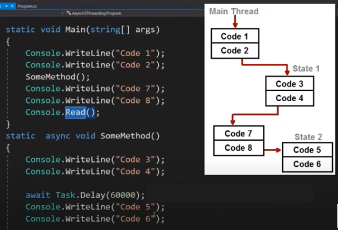
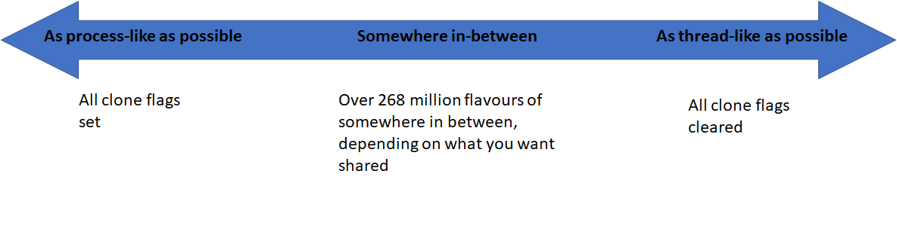
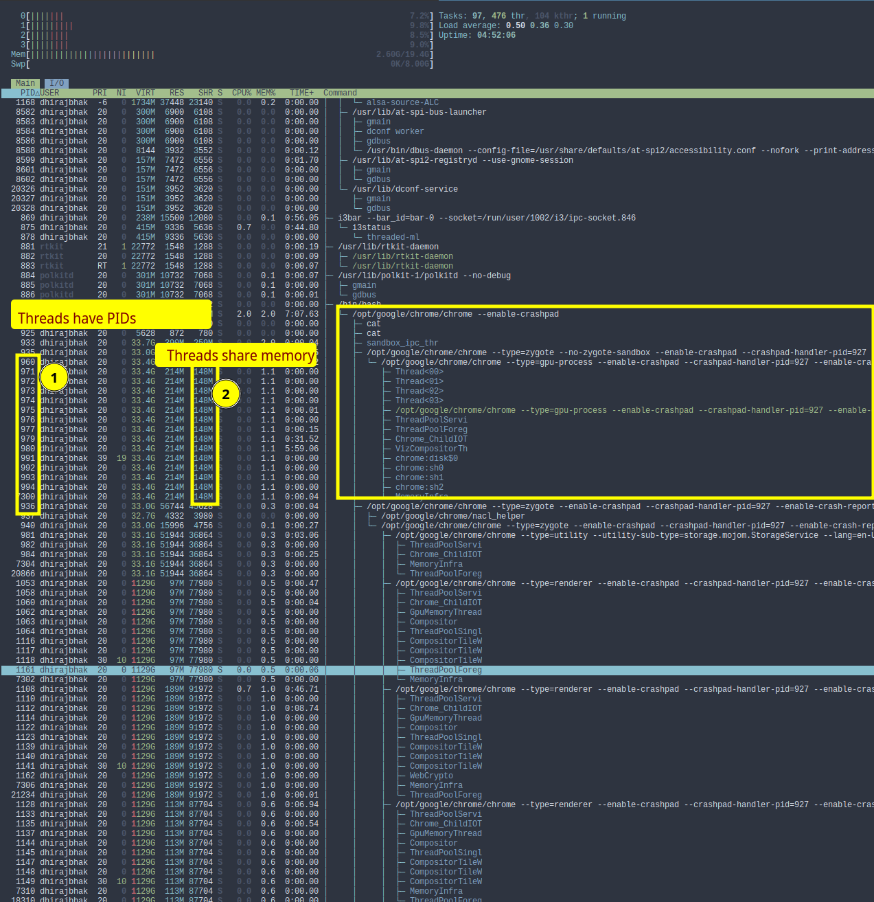
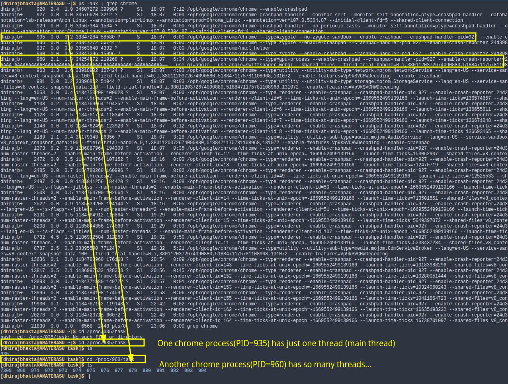
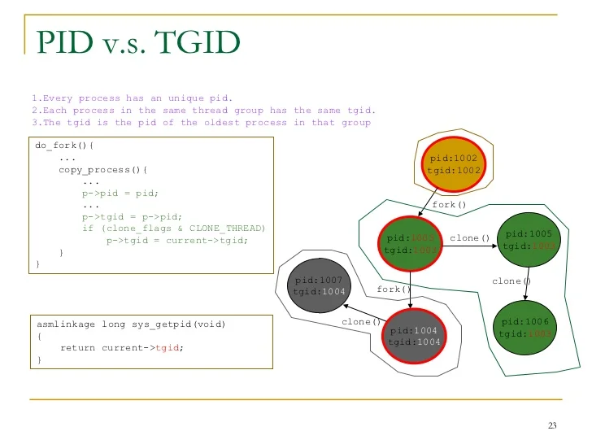
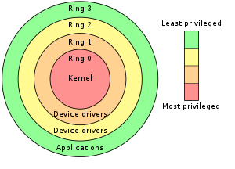
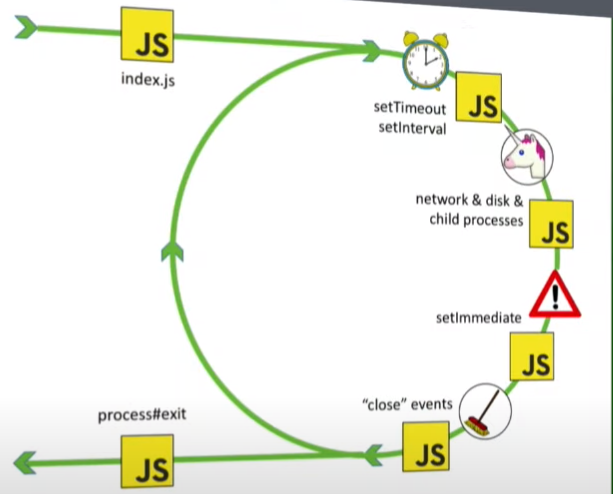
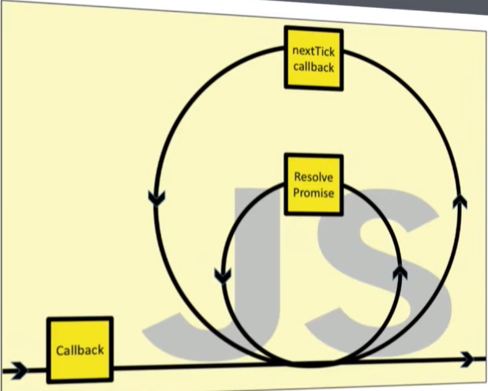

TODO:
1. pls move this page to OperatingSystems/general
2. Make book notes of BOOKS/OperatingSystems_xv6.pdf 
3. Summarize tannenbaum


- Asynchronocity
- Concurrency
- Threads
- Processes

### Asynchronous code does NOT use threads under the hood.
Before we knew async, we thought that _if one (main) thread is blocking, why not just create another thread and run the blocking code there?_ 

Now that we know async, we might still believe this is how async await works under the hood using threads.

In actuality, async await using the event loop (or statemachine) to achieve this. In brief, its just that every code has CPU bound pieces and IO bound pieces. When IO bound piece is run, the CPU is essentially idle, and this is where we can make some other CPU bound piece to be run ... Just to keep the CPU busy all the time.
Can't I do this with threads or processes? Ofcourse you can...but switching between threads is more resource intensive than not using threads at all, and processes are much more intensive...not to mention increase in unnecessary memory consumption

_In actuality the entire code is synchronous...but looks asynchronous due to event loop._



## Threads vs Processes
- Process
    - System calls involved
    - Different processes have different copies of Data | files | Cache
    - **Context switching is slow**
    - **Blocking a process will not block another process**
    - Independent
	- Each thread has atleast one thread (primary thread)
- Threads
    - No system calls involved
        - (User level threads dont need system calls)
        - (Kernel threads need system call)
    - Threads share code, data and files | but they have their own stacks and registers...
    - **Context switching is faster**
    - **Blocking a thread will block entire process**
    - Interdependant

Threads are _independent sequences of execution_. Processes are _containers for threads_. Threads are made up of _units which are the smallest schedulable tasks on CPU_...

Processes are used to **group resources(fd, virtual address space etc) together**; threads are the **entities scheduled for execution on the CPU**.

But Threads run in **shared memory space**, Processes dont share memory.

**_Threads is a OS concept, CPU has nothing to do with it. Some OSes might not even have threads_**
Each process has atleast one thread (primary thread)

But "Hardware Threads" as advertised by CPUs, simply means that a single core actually has multiple virtual cores which can run at the same time. Virtual Cores = Hardware threads. See "Hyperthreading...SMT"

```
Per process items             | Per thread items
------------------------------|-----------------
Atleast one thread(mainthread)|
Address space                 | Program counter
Global variables              | Registers
Open files                    | Stack
Child processes               | State
Pending alarms                |
Signals and signal handlers   |
Accounting information        |
```

Note that the accepted fact that "processes are harder to context switch" and "Threads are lightweight and faster to switch", **stems from Windows**. In Linux, processes are way too efficient to notice a difference between threads and process context switching...

### Why use Threads? Why use Processes?
- threads are faster to create
- threads are faster to context switch
- threads can communicate faster due to memory sharing

OTOH, use processes when you want much more isolation. (You wouldnt want to spawn chrome thread from inside a notepad process right?)..specially when the two tasks have absolutely nothing in common, and do not even communicate.

This is far pronounced in Windows, where threads give great performance boost..and are indeed "lightweight". On Linux, context switching between processes is almost as cheap as threads!


### Hyperthreading
Historically, the CPU(single core) executes just one thread at a time. But this "act of executing" a thread involves 
1. Step1: fetching the state from RAM
2. Step2: actually executing the thread

Since the CPU is kinda idle during step1, why not actually execute step2 of a another thread? This is essentially hyperthreading. A core just loads two threads at a time, just to increase CPU efficiency. This just means one extra set of ProgramCounter + Registers

### SMT (Simultaneous Multithreading)
...

### pThreads? (POSIX Threads)
This is a standardization attempt. POSIX is a spec.

CPU manufacturers made a mess by creating their own versions of threads. Made life hell for programmers to create portable threading applications.

Pthreads = `pthread.h` .C language programming types and procedure calls, implemented with a pthread.h header/include file and a thread library


### Linux world....

**Linux uses the term TASK to refer to process and thread**. In the kernel, there are no internal structures corresponding to "process" or "thread". Instead there is a `struct task_struct` that describe an abstract scheduling unit called TASK

In Linux, there is no 'real' distinction between Threads and Processes. Everything is treated as a Process with a PID. Each process had a PID and TGID(threadGroupID), and all its child threads had their own PIDs but same TGID as the parent process. The process where PID==TGID would be the parent process of these threads(or processes). `clone` system call would be equivalent of creating a thread...and you could pass parameters regarding what the new thread(process) needs to share from its parent process. All this circus was because the CPU would only switch between processes...there was indeed no concept of threads, they were just modelled on top of processes. From kernel point of view just processes exist, each with its own PID. The so called "thread" is just a different kind of process (sharing a lot of things with parent process).



**clone()** system call is highly configurable, enabling us to use to create a process or create a thread!

`fork() or clone()` :If you want to **create pure a process** as possible, you would use `clone()` and set all the clone flags. ( `fork()` is far simpler to do this)

`pthread_create() or clone()`: If you want to **create a pure a thread** as possible, you would use `clone()` and clear all the flags. (`pthread_create()` is far simpler to do this)

There are 28 flags that dictate the level of resource sharing ... implies there are over 268million flavors of tasks that you can create, depending on what you want to share.


 This "everything is a process" (LinuxThreads)implementation made things difficult for standardization(pre 2003), namely POSIX. In the end this is a frikkin  terminology problem. Linux doesnt care about "process" or "thread", all it knows about is "TASK". Both processes and threads are represented as "TASKS" in the kernel, but now the kernel has support for **grouping** those tasks into thread groups (of a process) and APIs for working with groups (tgkill, exit_group, wait_group etc). POSIX compliance of linux with NPTL, made things easier.

 
 
 

 Infact, you can see all threads with `ps` or `htop` command.

 To summarize
 - In the kernel, something that can be run & scheduled is called a **process** ( task, to be specific )
 - Each process has a PID and TGID(threadGroupID)
	- a normal process has PID=TGID, and not other process will share that TGID.
	- a threaded process is a process which ALSO has PID=TGID, but many more processes will have their TGID equal to this TGID
	- If a process has PID=TGID, it is the "main thread"
 - Several processes sharing the same TGID, also share, atleast the **same memory space and signal handlers**
 - `getpid()` from any process will return its TGID
 - `gettid()` from any process will return its PID (lol!)
 - Both threads or processes (or any kind of processes) can be created with `clone()` system call
 - What is shared b/w processes/threads is decided by passing flags to `clone()` system call
 - `/proc/<ID>` : here ID is TGIDs
 - `/proc/TGID/task/<ID>` : here ID is PIDs


#### Kernel Threads? User Threads?

**Some background (Kernel Mode | User Mode)**

This is related to the CPU architecture itself..not just an OS concept. CPU has protection rings..0,1,2,3



In Kernel mode...the executing code has complete and unrestricted access to underlying h/w. Can execute any CPU instruction, access any memory address. Kernel mode is reserved for the lowest-level, most trusted functions of OS. Crashes in kernel mode will crash the entire PC.

In User mode, the executing mode cannot directly access h/w and reference memory. It **MUST** use system calls which will take this process into kernel mode... Due to this protection, crashes in user mode processes are recoverable., and theyre isolated. _Most code execute in user mode_

**Switching between usermode <--> Kernel mode is expensive and slow**. When user mode code calls a system call, the OS switches into supervisor mode(kernel mode), and this transition is slow. Making a system call from user mode is slow because of this. Whereas, making a systemcall from kernel mode is a lot faster because there is no switch in modes.


_now coming to kernel threads and user threads_ ....


Kernel threads are special threads maintained by the kernel for its own "background" tasks internal to kernel (handling interrupts, flushing data to disk). Bulk of the system calls are processed by the kernel within the context of the process that called them. Kernel threads are scheduled just like user processes (they may have higher priorities)


- User Threads
	- **Cheaper** to create
	- **Super fast switching** because Does NOT trap into the kernel.
	- cannot do blocking I/O ( to block the entire process and all its user threads ). This is why we use user threads for non blocking IO
- Kernel Threads
	- **Expensive** to create
	- **Very slow switching**, requires trapping into the kernel.
	- blocking IO
	- 

### Language specific gotchas

#### Python GIL...
TODO
#### Golang goroutines...
TODO


### History of Async
- Initially, (days of batch jobs), only one process at a time...
- Next, we got "cooperative multitasking"... ...Fake multitasking(multi processing) on single core was possible now
	- But it relied on the running process calling "yield" to allow other process to take over for the time being
- Next, we got "Preemptive multitasking", OS is in charge of pausing the processes.. no yield BS.
	- pause, save state, resume.. _interleaving_ 
	- still, faking parallelism
- Next, Symmetric Multi Threading (SMT)
	- Hyperthreading...
	- a core splits into "virtual cores" called hardware threads...( intel CPUs with 2 cores provide 4 threads...4 cores provide 8 threads....this is how)
	- **A single core is NOT limited to execute just a single thread's instruction at a time**
	- A single core can perhaps fetch two instructions from two separate threads and process them **together**, ..because a core in itself is made up of smaller units like ALU, multiplier, etc...which can be pushed to their efficient limits. 
	- SMT improves efficiencies of Superscalar CPUs
	- **Not 2 cores**
- Processes vs Threads
	- Process
		- Top level execution container. Think process = application.
		- Need separate memory space.
		- Communicate via IPC. - sockets, tcp sockets(overhead), unix domain socket(less overhead). bundle...send...debundle.. like json.stringify. This is non efficient just to communicate! Thats why you use threads...
	- Threads
		- Run **inside** a process
		- Shared memory space
		- A LOT of communication options..,runtime can dictate.
		- Very performant.
		- Threads cause race conditions when there is dependency between threads...
		- You gotta write manual code to cooperate
- NodeJS eliminates all threading problems by ....being single threaded.
	- **but nodeJS is not really single threaded lol**
	- All JS, v8, event loop run in single main thread.
	- NodeJS is 2/3d JS, and 1/3d C++.. And C++ has the options to do multithreading.
	- Synchronous nodejs calls which are backed by c++ methods..those c++ methods will run on the main thread, yes
	- Async nodejs calls which are backed by c++ methods...those **may or may not** run on main thread, can choose to multithread...and thereby use multicores...
	- eg: `crypto` module... CPU intensive..
	- In nodejs, there is a recommendation to always use Async method... for the above performance benefits!
	- NodeJS uses a **ThreadPool**. startsups with = 4threads. It does NOT spawn infinite new threads whenever it feels like.


### Power of NodeJS

**Node is good for microservices**<br/>
In the Java world, you spawn **threads** for each request. In NodeJS, you handle thousands of requests on the same thread due to its asynchronous nature. NodeJS is far superior when your workloads are more I/O bound. (Java springboot etc are favorable when your workloads are CPU bound). Startup times of NodeJS is far lower, which enables Quick scaling up and scaling down!. Memory consumption of NodeJS is far lower.


## Javascript
_Everything in NodeJS is a reaction to an event_

### 🔰Event Loop
- JS is **single threaded**
- Everything runs on the main thread.
- Can one function block everything else then? yes, if it is CPU bound..
- The "JS API" or the javascript engine is decoupled/separate from "WebAPI".
    - WebAPI includes DOM-API, setTimeout, setInterval, fetch API etc...
    - JS Engine **DOES NOT have event loop** defined in its spec (Ecmascript).
    - Call stack is part of JS engine., not browser specific. Most(almost all) languages have a call stack. Nothing new here.
- Note: `setTimeout(fn, 1000)` does not put the task into the Queue immediately
	- `setTimout(fn, 1000)` puts the task into the Queue **After 1s**, i.e after the timer expires. It does this via WebAPI, (internally via libuv, libev, epoll, kqueue etc)
	- `setTimeout(fn, 1000)` does NOT guarantee execution exactly after 1s. Its a Queue afterall... It gets added to the callstack ONLY if the callstack is empty, and it is the first item in the Queue of tasks

  

#### libuv
libuv is the C library that provides event loop to NodeJS.

- Event loop **DOES NOT** run on a separate thread
	- _Event loop runs on the same thread(main thread) as the user code_
- Networking **DOES NOT** happen on a thread pool
	- _libuv creates a pool of 4 threads that is ONLY used if no asynchronous APIs from the kernel are available_
- There is **NO** Event Queue!!. lie propagated through blogs etc...
- **Interrupts** 
	- DMA(Direct Memory Access) changed everything in early 90s
	- _Major OS's have been faking synchronous I/O for years..._
- Event Loop Steps
	- Figures out if there is any timeout
	- _Tick_
	- Process callbacks
	- _Tick_
	- I/O polling (Unicorn magic)
	- _Tick_
	- Process setImmediate
	- _Tick_
	- Process "close" events"
	- _Tick_
- `setTimeout` internals
	- There's a "timer heap"..we figure out which ones are expired, and then call callbacks
- unicorn function() internals
	- `connect`, `read`, `write`
	- 1. Put main thread to sleep
	- 2. Wake up when...
		- i. There are events from the kernel to process
		- ii. A Thread pool thread has completed an operation
		- iii. The next timer goes off..
		- iv. ....return the collected events...



`nextTick` and `Promise.resolv` arent on the main event loop because they are micro event loops of their own... think Mandelbrot set..



Every small point in the event loop will have these smaller event loops which will run until all nextticks complete....and they in-turn will have smaller event loops which will run until all completed promises are resolved.

Its a joke that `nextTick` isn't really nextTick its "immediate"..and `setImmediate` is not really immediate..its nextTick...Its a naming error in nodejs internals


####  Web APIs?


## Questions
#### Is multithreading impossible on JS?


### Stuff to study

- JS Module systems
- Typescript in depth
- JS testing
- Advanced React (Epic react by Kent C Dodds)
- How react works

### JS testing

<https://downloadly.net/2021/21/40162/04/testing-javascript-with-kent-c-dodds/00/?#/40162-c-dodds-202132110329.html>

### Epic React

<https://downloadly.net/2021/24/34886/02/get-really-good-at-react-epic-react-by-kent-c-dodds/01/?#/34886-epic-rea-192110110029.html>

<https://drive.google.com/drive/folders/1-XcaNZCSB-Xzr_J9_IL4l095RxbDXpHW>

### Redux
2 of the egghead courses by Dan Abramov


