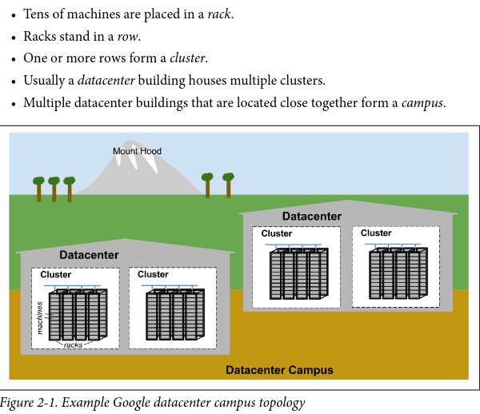
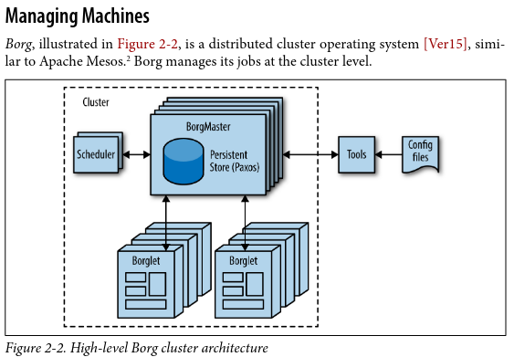

# Google's rules of thumb

- SRE team must spend 50% of its time actually doing development

# Google's Production environment
"Machines" can run any "servers"

**Jupiter** : _a Clos n/w fabric_  having hundreds of google built switches.  (speed up communication WITHIN datacenter)

Switches? : Machines within a given datacenter need to be able to talk with each other, so they created very fast virtual switch with tens of thousands of ports.

**B4**: Globe spanning _backbone network_ which connects datacenters. 
(Software defined network architecture)

## Managing machines

**Borg** : The cluster OS which handles resource allocation

> NOTE: Kubernetes is Borg's decendant.

Borg runs jobs. It finds machines for the tasks. Once assigned, Borg continually monitors these tasks. If a task malfunctions, it is killed and restarted, possibly on a different machine.
_tasks are fluidly allocated over machines_

## Storage
**Colossus** : _Cluster file system_
like HDFS and Lustre

Several database-like services are built on top of Colossus
- Bigtable, Spanner, 

## Networking
OpenFlow based SDN (Software Defined Network)
- instead of using "smart" routing h/w, they use less expensive "dumb" switching components in combination with central (duplicated) controller that precomputes best paths across the n/w

Some services have jobs running in multiple clusters, which are distributed across the world. To minimize latency for globally distributed services, they direct users to the closest datacenter with available capacity. **The Global Software Load Balancer**(GSLB) 

_compute-expensive routing decisions are moved away from the routers ...using simple switching h/w_

# Questions
1. Borg, Apache Mesos, Kubernetes, ECS ?

# Resources
- https://www.nextplatform.com/2017/07/17/google-wants-rewire-internet/
- https://conferences.sigcomm.org/sigcomm/2015/pdf/papers/p183.pdf
- Paxos protocol for asynchronous consensus https://lamport.azurewebsites.net/pubs/paxos-simple.pdf
