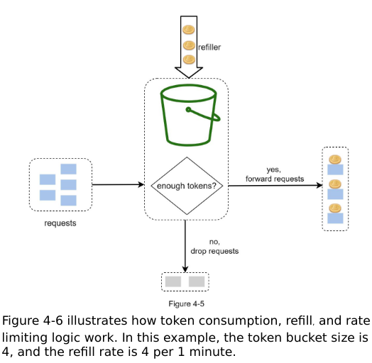
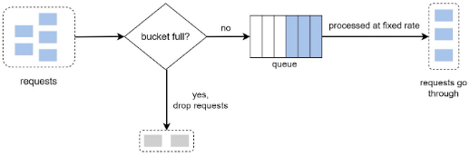
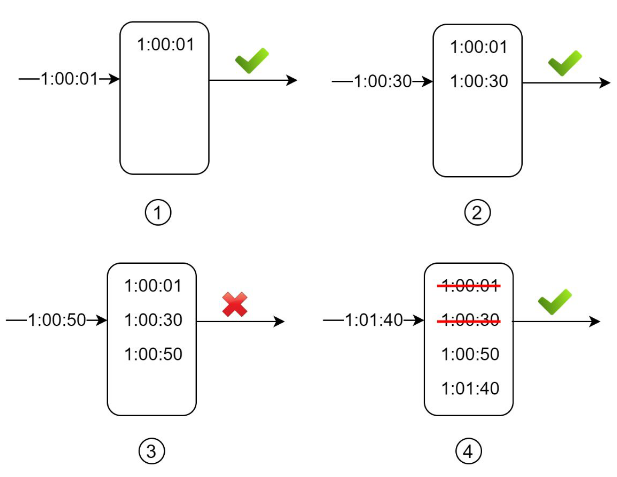
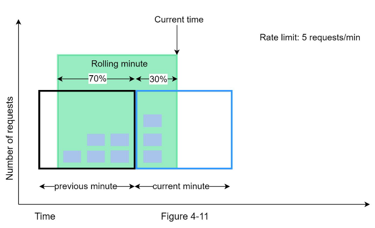
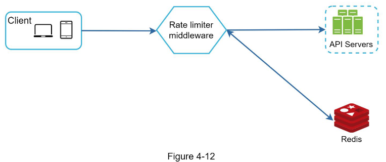
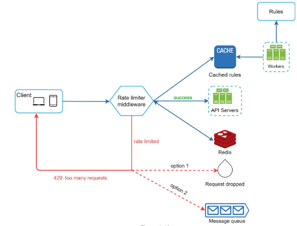
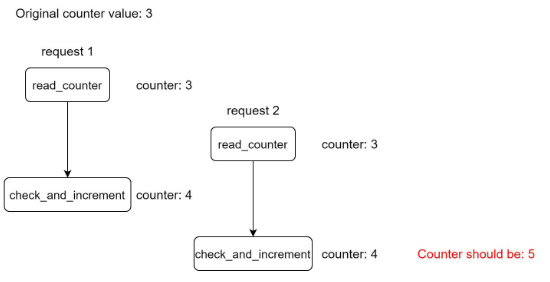

# Design a Rate Limiter

- limit the number of client requests over a specified period.
- if count exceeds the threshold, excess calls are dropped.

### Benefits

- prevent resource starvation from a DOS attack
- prevent servers from being overloaded.
- reduce cost
  - fewer servers
  - important while using 3rd party APIs

### Basis

Rate limiting can be done on

- IP
- region
- user ID
- other properties.

### Requirements

- accurately limit excessive requests
- Low latency: rate limiter should not slow down the HTTP response time
- Low memory usage
- Exception handling
  - Show clear exceptions to users when their requests are throttled. (HTTP 429, X-Retry-After)
- High Fault tolerance
  - the outage of part of the rate limiter(eg: cache server goes down) should not affect the entire system.
- Distributed
  - The rate limiter can be shared across multiple servers or processes.

### Examples

- 2 posts per second per user (write)
- 10 accounts per day from same IP address
- max 5 times you can claim rewards from same device

### Where to put the rate limiter?

**Client Side vs Server Side rate limiter**

Client side is bad because it can be forged by malicious actors. We dont have control over client implementation

- Put it in the server
- Put it in the middleware
- Let the cloud's API GW do it.
  - APIGW is a middleware that supports rate limiting.

## Rate limiter algorithms

- Token Bucket
- Leaky Bucket
- Fixed Window
- Sliding Window
- Sliding Window Counter

### Token Bucket



- A bucket of fixed capacity
- bucket refilled at fixed intervals
- once the bucket is full, extra tokens will overflow.
- **each request consumes one token**
  - request is dropped if there are no tokens

#### Params

- bucket size
- refill rate

#### How many buckets do we need?

- one bucket for IP address throttling
- one bucket for each API endpoint
- global bucket
  - if system allows things like "MAX 10,000 requests per second"

#### PROS

- easy to implement
- memory efficient
- allows burst of traffic for short periods
  - as long as tokens are there

#### CONS

- difficult to tune the parameters
  - bucket size
  - refill rate

### Leaking Bucket

**Requests are processed at a fixed rate**


- Queue of requests
- Requests are pulled from the queue and processed at regular intervals
- When request arrives
  - add to queue if not full
  - if Queue is full, drop the request

#### Params

- Queue Size
- Outflow rate
  - no. of requests being processed every N seconds

#### PROS

- memory efficient (queue size)
- Suitable where stable outflow rate is needed
  - bcos requests are processed at a fixed rate.

#### CONS

- tough to tune the params
- burst of traffic fills the Queue with old requests
  - new requests get dropped

### Fixed Window

- timeline is divided into windows (eg: every 5 min)
- each window has a counter
- if requests exceed the counter, they are dropped.
- **Counter resets after every window**

#### PROS

- memory efficient (storing only counts)
- easy to implement
- old requests dont starve new requests, as the counter resets after every window

#### CONS

- A single burst of traffic that occurs near the boundary of a window can result in TWICE the rate of requests being processed.
- Many clients waiting for a reset window can STAMPEDE the server at the same time.

### Sliding Window Log



- each time a request comes it, its time stamp is stored in the log
- if the **count of logs** within the window is less than threshold, the request is allowed
  - (check TS minus window-size)
- even though a request is dropped, its timestamp is logged
- when a request arrives, if its timestamp minus the window size has more than the threshold, the request is dropped
- in the diagram, window size is 1 minute

#### PROS

- no bursts in the edges
- very accurate rate limiting
- in any rolling window, requests will not exceed the rate limit

#### CONS

- consumes a lot of memory
  - TS is logged even if request is rejected.

### Sliding Window Counter

- Fixed Window + Sliding window Log


= (requests in current window) + (requests in prev window)*percentage of overlap of rolling window and prev window

= (3) + (5)*0.7
= 6.5
~= 6

The rate limiter allows a max of 7 requests per minute. so allowed :tick:

#### PROS

- smoothens out spikes in traffic.
  - because rate is based on average rate of previous window
- memory efficient

#### CONS

- not so strict look back window.
- assumes requests in prev window are evenly distributed.

## High level Architecture



#### Where to store counters?

- dont use DB - its slow
- use Redis - inmemory cache

#### Overview

1. Client sends a request to rate limiting middleware
2. Middleware fetches counter from bucket in Redis
    i. if limit is reached, request is rejected
    ii. . if not, request is sent to API
3. System increments the counter and saves back to Redis.

## Deep Dive

#### How are the rate limit rules created? Where are they stored?

Rules are written to config files(YAML) and stored on disk

```yaml
# 5 marketing messages per day
domain: messaging
descriptors:
  - key: message_type
    value: marketing
    rate_limit:
      unit: day
      requests_per_unit: 5
```

```yaml
# 5 login attempts in one minute
domain: auth
descriptors:
  - key: auth_type
    value: login
    rate_limit:
      unit: minute
      requests_per_unit: 5
```

#### On exceeding the rate limit

Client is informed with HTTP 429 (Too Many Requests)

`X-Ratelimit-Remaining`: remaining number of allowed requests in the window.

`X-Ratelimit-Limit`: how many requests the client can make in the window.

`X-Ratelimit-Retry-After`: number of seconds to wait.

## Detailed Architecture



## Distributed Environment

- Race Condition
- Synchronization Issue

#### Race Condition

If 2 requests concurrently read the counter and attempt to increment it



- Locks
  - will solve it
  - but will slow down the system
- Redis Sorted Sets

#### Synchronization Issue

To serve millions of users ,more than one rate limiters would be needed.

- use sticky sessions so that client will send traffic to same rate limiter
- use centralized data store(REDIS)

## Performance

- Multi datacenter setup is important (edge server locations given by cloud providers) -- this is to reduce latency
- Use an eventual consistency model

## Monitoring

**gather analytics** to check if our rate limiter is effective + rate limiting rules are effective

- is our rules too strict?
- are too many requests being dropped?
- is our rules too lenient?
- do we have sudden increase spikes in requests?
- do we need to replace the algorithm to support burst traffic?

# Questions

- What is sorted sets data structure in redis?
