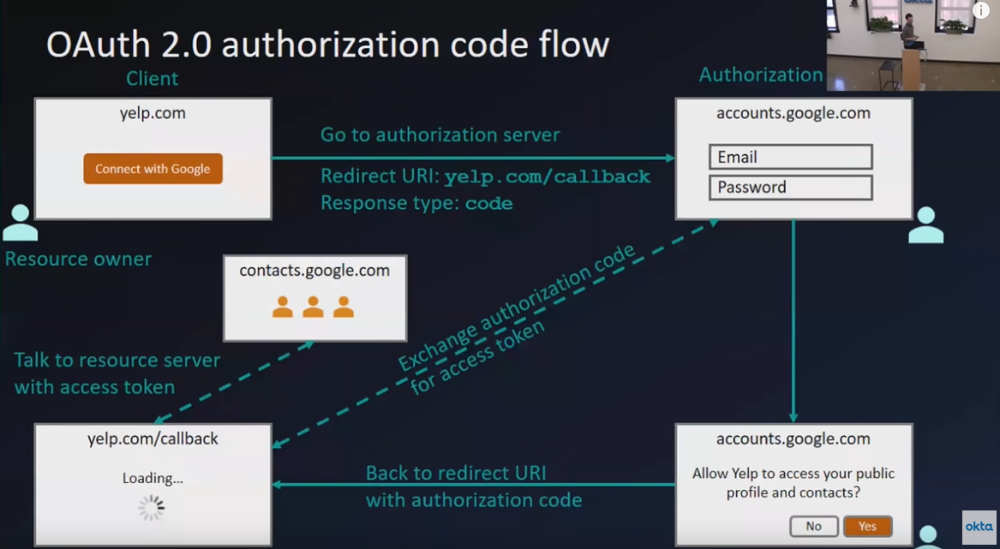
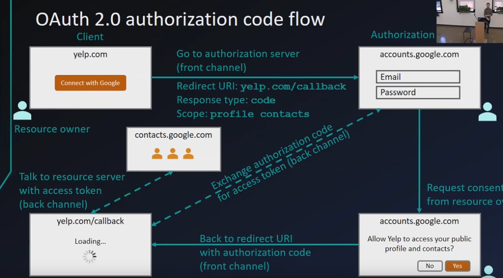

## History

- most basic auth: username+password
  - downsides: security and maintenance
- simple login (forms and cookies)
- single sign on across sites (SAML)
- Mobile app login
- delegated authorization

## Delegated authorization problem

- " Hey! so and so app is trying to access your so and so details, would you authorize it? "

## Terminology

- Resource Owner
- Client
- Authorization Server
- Resource Server
- Authorization Grant
- Redirect URI
- Access Token
- Scope
- Consent
- Back channel (highly secure, Backend)
- Front channel (less secure, Browser)

## Authorization Code Flow

#### Why bother with the code, why not just get the access token directly

solid lines happen in front channel, browsers. Dashed line happen through back channel.

Everything that happens here is intercept-able, the "code" is sent via redirect as the URL param, it can be captured my Malicious user and exchanged for access token!? - NO!

Because to get the access token, you need to provide "code" + "secretkey", and this secretkey is present ONLY in the backend, you wouldnt ever put it in the frontend lol.

## is Access token enough?

Just the access token is like all or nothing, either 401 or full permissions...this is bad

You need fine grained granular permissions

Authorization server has a list of scopes like

- contacts:read
- contacts:write
- profile:read
- profile:write
- reports:read
- reports:write

## To study

- Active directory and LDAP
- SAML
- PKCE
