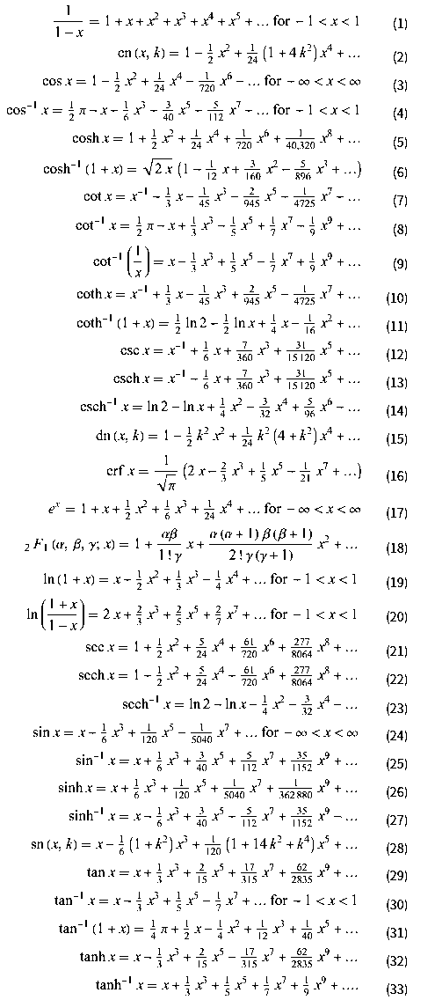

## Pre-req

### Series expansion 
= _Series representation of a function_
= representing a f(x) as **sum of powers** of one of its variables, OR
= representing a f(x) as **sum of powers** of another function g(x)

The main purpose of series is to write a given complicated quantity as an infinite sum of simple terms...
And since the terms get smaller and smaller, we can approximate it by taking only the first few terms of the series.

## Taylor Series
A Taylor series is a series expansion of a function **about a point**

Any function can be expressed as a Taylor series.

A tool to write any function as power series.

## Maclaurin Series
Maclaurin series is a Taylor series expansion of a function **about point=0**

