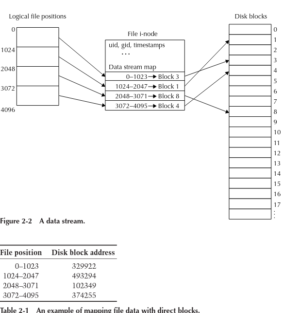
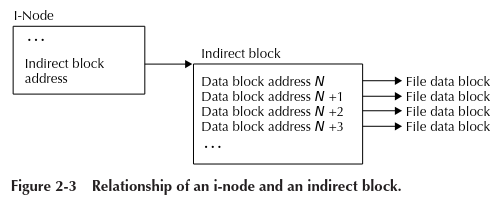

# Practical File System Design &mdash; book

 goal of what a file system must
achieve: to store, retrieve, locate, and manipulate information.

### Disk

A permanent storage medium of a certain size. A disk also has a
sector or block size, which is the minimum unit that the disk can read or
write. The block size of most modern hard disks is 512 bytes

### Block

 The smallest unit writable by a disk or file system. Everything a
file system does is composed of operations done on blocks. A file system
block is always the same size as or larger (in integer multiples) than the
disk block size.

### Partition

Subset of all the blocks on a disk. A disk can have several partitions

### Volume

Disk or partition that has been **initialized** with a filesystem.
A volume can span multiple disks.

### SuperBlock

Area of the volume where the filesystem stores its critical volumewide information. -> how large the volume is , name of the volume etc.

### Inode

The place where the filesystem stores all metadata about a file.
The "Connection" between the file and its actual contents.

## Files and Directories

- are the two fundamental abstractions given by any filesystem

### Files

The primary functionality that all file systems must provide is a way to store a named piece of data and to later retrieve that data using the name given to it. We often refer to a named piece of data as a file.

Filesystem stores the file's metadata in an **inode**.

What about the file contents?: Inode contains the list of blocks that make up the contents of the file.The fastest thing a disk drive can do is to read or write large contiguous regions of disk blocks, and so file systems always strive to arrange file data as contiguously as possible.

#### Indirect blocks

The i-node can only store a limited number of block addresses, which
therefore limits the amount of data the file can contain. Storing all the pointers to data blocks is not practical for even modest-sized files. To overcome the space constraints for storing block addresses in the i-node, an i-node can use indirect blocks. When using an indirect block, the i-node stores the block address of (i.e., a pointer to) the indirect block instead of the block addresses of the data blocks. The indirect block contains pointers to the blocks that make up the data of the file. Indirect blocks do not contain user data, only pointers to the blocks that do have user data in them. **Thus with one disk block address the i-node can access a much larger number of data blocks.**

### Directories

a dir stores both the names and the inode number of all files inside it.

The contents of a directory may be stored as a simple linear list, B-trees, or even other data structures such as hash tables.

## Basic filesystem operations

- Initialization
  - Once a filesystem is initialized, it can then be mounted.
- Mounting
  - Mounting a file system is the task of accessing a raw device, reading the superblock and other file system metadata, and then preparing the system for access to the volume.
  - Mounting is the act of associating a storage device to a particular location in the directory tree.

-
