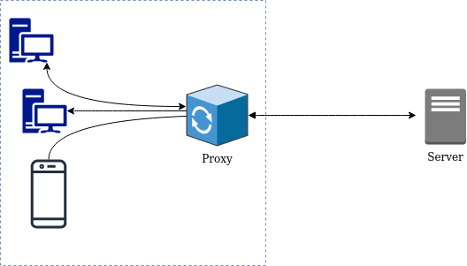
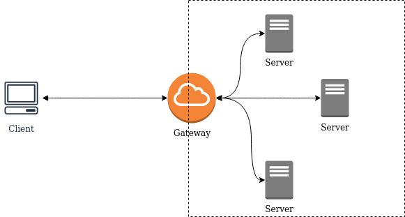

# HTTP
- Stateless protocol
- Application Layer protocol
- request/response protocol

### HTTP Client
A **program** that <u>establishes connections</u> for the purpose of sending requests. 


### HTTP Server
A **program** that <u>accepts connections</u> in order to service HTTP requests by sending back HTTP responses.

NOTE:
The terms "client" and "server" refer only to the roles that these programs perform for a particular connection.  The same program might act as a client on some connections and a server on others.

### User Agent
 The client which initiates a request. These are often browsers, editors, spiders (web-traversing robots), or other end user tools. 

### Origin Server
 The server on which a given resource resides or is to be created. 


### HTTP Message format

HTTP_MESSAGE = startline + headerfields + empty_line + (optional)body

for requests, startline = request line<br>
for responses, startline= status line

```
Example to demonstrate a GET request on http://www.example.com/hello.txt

 Client request:

     GET /hello.txt HTTP/1.1
     User-Agent: curl/7.16.3 libcurl/7.16.3 OpenSSL/0.9.7l zlib/1.2.3
     Host: www.example.com
     Accept-Language: en, mi


   Server response:

     HTTP/1.1 200 OK
     Date: Mon, 27 Jul 2009 12:28:53 GMT
     Server: Apache
     Last-Modified: Wed, 22 Jul 2009 19:15:56 GMT
     ETag: "34aa387-d-1568eb00"
     Accept-Ranges: bytes
     Content-Length: 51
     Vary: Accept-Encoding
     Content-Type: text/plain

     Hello World! My payload includes a trailing CRLF
```

# REST - REpresentational State Transfer
#### Resource 
Target of every HTTP request is a resource. A resource could be anything (preferably a noun).

#### Representation
A "representation" reperesents the current/past/future "state" of the resource under concern. A JSON output for a GET request is a "representation", for instance.

##### Representation Metadata
The following Header fields are the metadata of the "representation"
- ###### Content-Type
    - indicates the media-type of the associated representation
    - A sender(irrespective of client or server) that generates a message containing a payload body SHOULD
   generate a Content-Type header field in that message unless the
   intended media type of the enclosed representation is unknown to the
   sender.  If a Content-Type header field is not present, the recipient
   MAY either assume a media type of "application/octet-stream" or examine the data to determine its type.
- ###### Content-Encoding
    - indicate whether a "transformation" is/can be applied to the representation.
    - commonly used "transformation" is a compression
- ###### Content-Language
- ###### Content-Location

They tell you how to parse the "representation" data enclosed in payload body

###### Media type
The headers "Content-Type" and "Accept" will have Media-type as its value. 
eg of media types
- "text/html"
- "application/json"
- "multipart/form-data"

##### Content Negotiation
How to decide which representation to send 

2 ways
- "proactive content negotiation", where the
   server selects the representation based upon the user agent's stated
   preferences
-   "reactive" negotiation, where the server provides a
   list of representations for the user agent to choose from. 


# HTTP Request Methods
indicates the _purpose_ for which the client made the request.<br>

Its the primary source of request semantics. 

Secondary source may be 
- other custom headers 
- url parameters 
- query parameters 
- request body 

```python
   +---------+-------------------------------------------------+
   | Method  | Description                                     |
   +---------+-------------------------------------------------+
   | GET     | Transfer a current representation of the target |
   |         | resource.                                       |
   | HEAD    | Same as GET, but only transfer the status line  |
   |         | and header section.                             |
   | POST    | Perform resource-specific processing on the     |
   |         | request payload.                                |
   | PUT     | Replace all current representations of the      |
   |         | target resource with the request payload.       |
   | DELETE  | Remove all current representations of the       |
   |         | target resource.                                |
   | CONNECT | Establish a tunnel to the server identified by  |
   |         | the target resource.                            |
   | OPTIONS | Describe the communication options for the      |
   |         | target resource.                                |
   | TRACE   | Perform a message loop-back test along the path |
   |         | to the target resource.                         |
   +---------+-------------------------------------------------+
```


# HTTP Intermediaries
To make a request go through a _chain of connections_
- Proxy........................................_they process the HTTP request_
- Gateway (Reverse Proxy)........_they process the HTTP request_
- Tunnel
```
A request or response message that travels the whole chain will pass through four separate connections.

            >             >             >             >
UserAgent =========== A =========== B =========== C =========== OriginServer
                <             <             <             <
```

## Proxy

===============_Acts as the real client_====================



Program which <u>acts as both a server and a client</u> for the purpose of **making requests on behalf of other clients**. 

Requests are serviced internally or by passing them on, with possible translation, to other servers. A proxy MUST implement both the client and server requirements of this specification. 

A "transparent proxy" is a proxy that does not modify the request or response beyond what is required for proxy authentication and identification. 

A "non-transparent proxy" is a proxy that modifies the request or response in order to provide some added service to the user agent, such as group annotation services, media type transformation, protocol reduction, or anonymity filtering.

#### Is a VPN same as proxy server?

## Gateway (Reverse Proxy)
===============_Acts as the real server_=====================



a gateway receives requests as if it were the origin server for the requested resource; the requesting client may not be aware that it is communicating with a gateway.


A "gateway" (a.k.a. "reverse proxy") is an intermediary that **acts as
   an origin server** for the user agent but translates received
   requests and forwards them inbound to another server or servers.

   Often used for load balancing of HTTP services across multiple machines.

## Tunnel
A "tunnel" acts as a blind relay between two connections without
   changing the messages.  Once active, a tunnel is not considered a
   party to the HTTP communication, though the tunnel might have been
   initiated by an HTTP request.  A tunnel ceases to exist when both
   ends of the relayed connection are closed.  

# HTTP Cache


# AHA moments
-   A connection might be used for multiple request/response exchanges,
- HTTP is independant of the underlying transport protocol.

# Exercise: Try sending HTTP requests /responses using raw TCP...socket prgramming

# Questions
1. what is CONNECT verb?
2. What is a keep-alive?
2. wth happened to "end to end encryption" of HTTPS? what are these "intermediaries"
4. HTTP/2?
4. What is "multipart" and "multipart/form-data"
