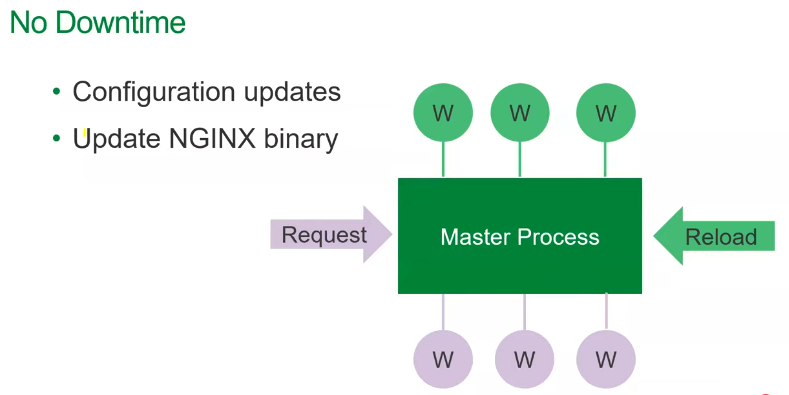
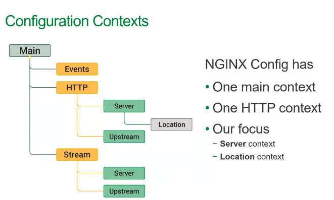
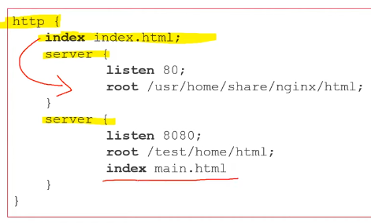
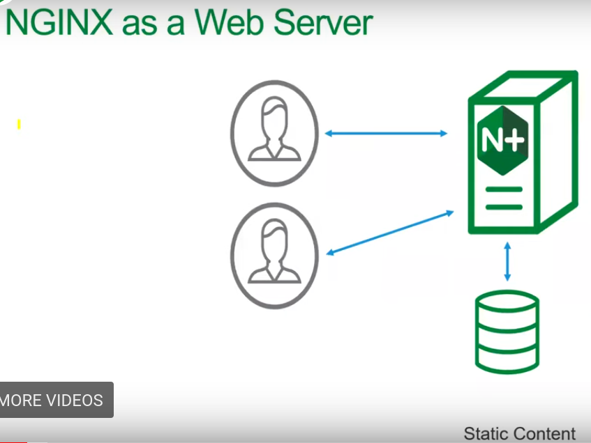
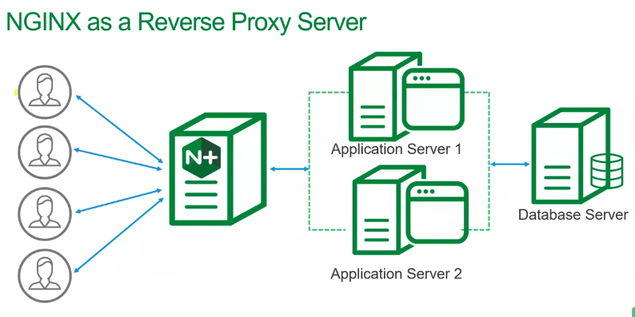
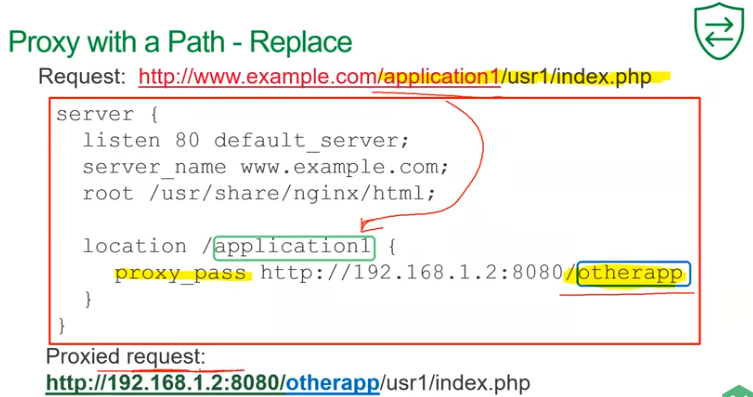
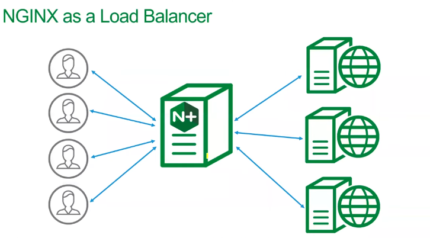
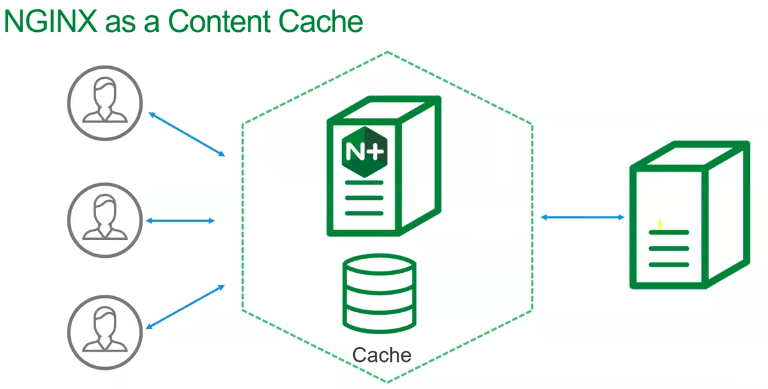

## What is webserver?

Server listens for requests and delivers the content.

## Nginx

Nginx Application Platform

- Nginx Plus (the webserver)
  - free open source version
  - nginx Plus version
- Nginx WAF
- Nginx Unit
- Nginx Controller
- Nginx Amplify

## Nginx Architecture

- Master Process
  - reads the configs and updates the workers
- Child Processes
  - Cache Manager
  - Cache Loader
  - Worker processes
    - each worker can handle thousands of simulataneous connections because Nginx has event driven architecture with non blocking I/O


no downtime during config updates. configs are fed into the master and master will gracefully shutdown all workers ( each worker will handle the request its currently serving and then shutdown ) and then reload with new configuration.

`nginx -s reload` to apply the config change

`nginx -s quit` to gracefully shutdown

`nginx -s stop` to hard stop

### Config files

`/etc/nginx/nginx.conf`

`/etc/nginx/conf.d/default.conf`

- Directives
  - single line statement that controls behavior
  - ends in a semicolon

- Blocks
  - encased in curly braces
  -```
  server{
    listen 80;
    root /usr/share/nginx/html;
  }
    ```

#### Directive Parameters

```
listen 443 ssl;

listen 443 ssl http2;

listen 53 udp;

```

#### Config contexts



Anything OUTSIDE the blocks belong to the main context;

Main context has highest priority;

Inheritance:<br/>


Include directive:<br/>
include other configuration inside the block.

## Nginx as a web server



```
server{
  listen 0.0.0.0:80;
  server_name "";
  root /usr/share/nginx/html;
  index index.html;
}
```

### server selection

server_name selection order

1. exact string match
2. matches with leading wildcard
3. matches with trailing wildcard
4. first regex match

default_server Parameter:
if none matches, default_server would be picked.

### Location

look at the request URI and get the paths

- Prefix Location
  - Nginx selects the longest matching prefix
  - Order doesnt matter
- Regex Location
  - order matters

## Reverse Proxy



Most used for this.

### proxy_pass Directive

```
location / {
   proxy_pass http://192.168.1.2:8080
}
```

```
server{
  listen 80;
  proxy_set_header Host $host;
  proxy_set_header X-Real-IP $remote_addr;
  proxy_set_header X-Forwarded-For $proxy_add_x_forwarded_for;

  location /{
    proxy_pass http://backend-server.com;
  }

}
```



## Nginx as a HTTP Load Balancer



```
upstream myServers{
  server 127.0.0.1:8080;
  server 127.0.0.1:8081;
  server 127.0.0.1:8082;
}
and in proxy_pass, use "myServers"

```

Load Balancing Methods

- round robin
- least_conn
- least_time
- hash
- ip_hash
- random

## Caching



types of cache

- Browser cache
- CDN
- reverse proxy cache

How Nginx caches

- Nginx generates MD5 hash
- Nginx checks memory for hash
- Origin server sends response
- Hash saved in memory
- File saved on disk

## Nginx API and Dashboard

# How Nginx is designed for Performance and Scale


High performance, High concurrency, low memory usage.

## Why is high concurrency important?

- if the client has slow connection, then the worker process in the server is blocked until the request is completed
- keep-alive connections (persistent connections)
- browser opens nearly 4 connections.

webserver should be able to scale non linearly with the growning number of concurrent connections and requests per second.

- Many webservers and application servers use a simple threaded or process based architecture.
- Nginx uses **event driven** architecture
  - enabling hundreds of thousands of concurrent connections


### Nginx Process Model


- a master Process
  - reads config
  - binding to ports
  - creates worker processes
- number of worker processes
  - one worker per CPU core
  - each worker process is single threaded.
  - each worker process gets a set of listen sockets from master.
  - they do all the work
  - handle n/w connections
  - read and write content to disk
  - communicate with upstream(load balanced) servers

Processes and Threads consume resources. They each use memory and other OS resources and they need to be swapped on and off the cores(context switch). _Performance degrades because of context switches_

Common way to design n/w applications is to assign a thread/process to each connection. _this does not work for handling thousands of concurrent connections_

In Nginx, **each worker process handles multiple connections in a non blocking fashion, reducing context switches**

because the number of full-weight processes is small(one per core), much less memory is consumed and CPU cycles arent wasted on context switching.


- each worker listens to multiple listen sockets.
- events are emitted by new incoming connections.
- these connections are assigned to a **state machine**

### Blocking state machine

- most web servers use a process-per-connection or thread-per-connection
- the process/thread spends most of its time blocked - waiting for the client to complete its next move.
- each active HTTP connection requires a dedicated process/thread. massively wasteful.

### Non blocking state machine


- each worker process can handle multiple connections.
- worker waits for events on listen and connection sockets
- events occur on the sockets and the worker handles them
  - event on the listen socket means new connection - worker creates a new connection socket. each new connection creates a file descriptor and consumes a small amount of additional memory.
  - event on connection socket means client has made a move, the worker responds appropriately.
- worker never blocks on n/w traffic. no "waiting" for client to respond.

since context switches are low, the worker processes can remain pinned to the CPUs.

in Blocking, each connection requires a large amount of additional resources and overhead, and context switches are more.

Even in non-blocking, what if some long and heavy operation has occurred? The whole cycle of event processing will get stuck waiting for this operation to finish.

### Solution - thread pools


# Questions

#### Reverse Proxy vs LoadBalancer
