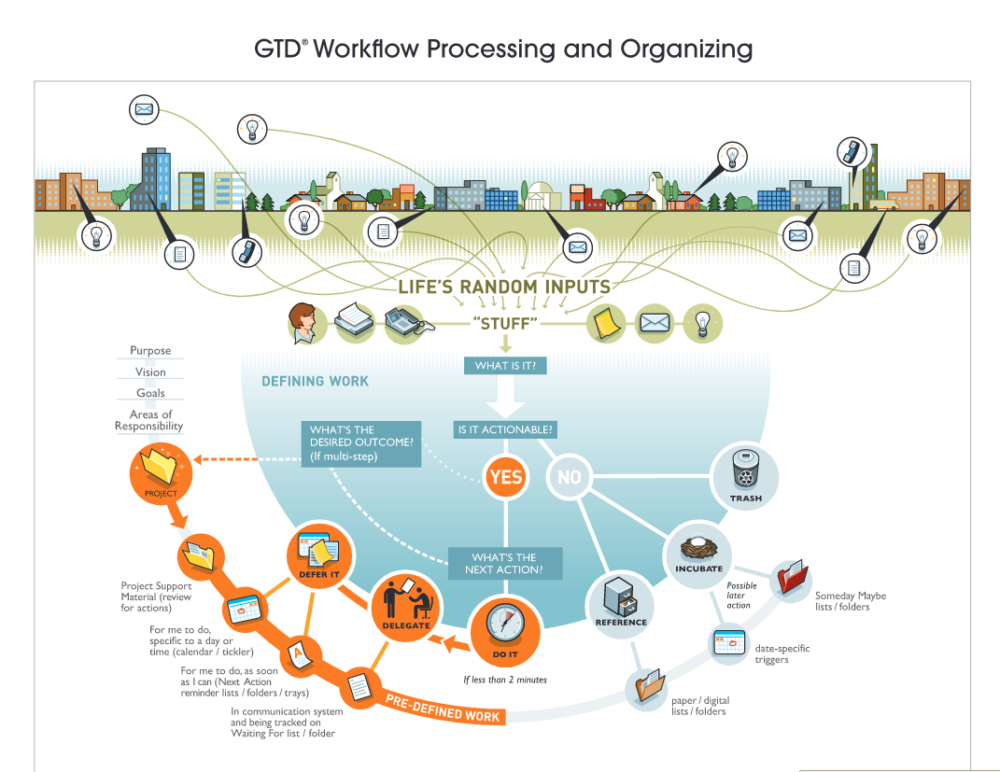
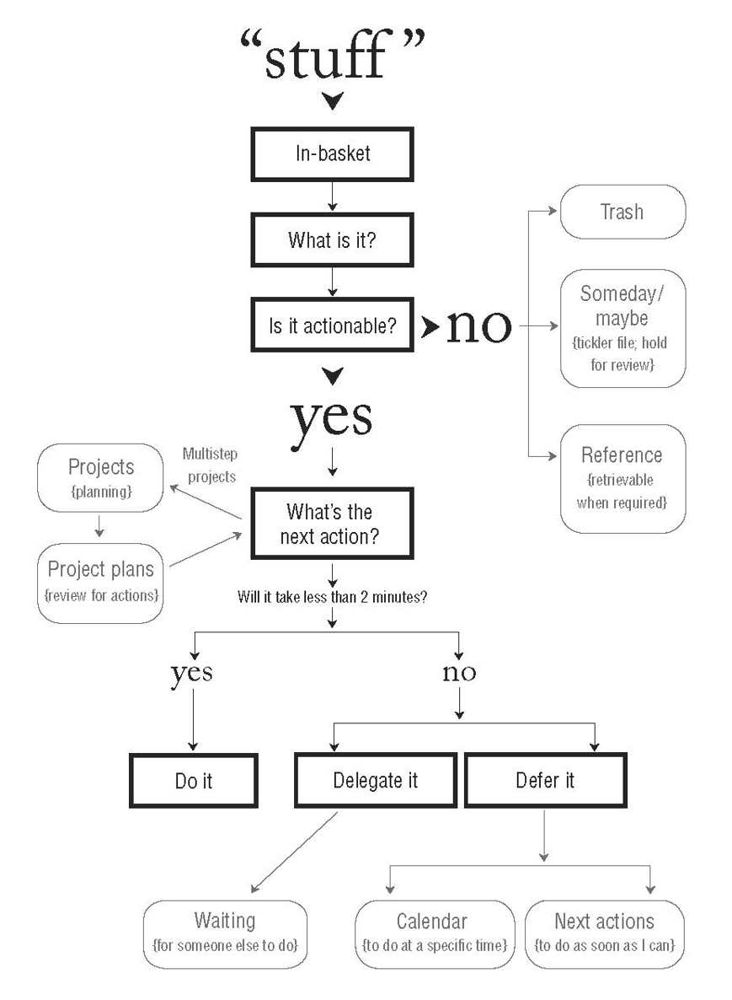

# The case against productivity tools
- todo lists, wunderlust, google tasks

We've all done that atleast once, and then given up..over and over and over again. 

**Why we start?**
we are desperate and bogged down by too many tasks and too less time and continuously bothered/overwhelmed and unable to focus on task at hand.

**Why we quit?**
We end up with a system we wont trust. Its not perfect. You will find that you gotta do double work.... keep things partially in your head....partially in your todo-system. Soon enough you'll find that a simple paper pen single sheet will help you move the ball for the day,...and from next day onwards, life happens and you will forget about being productive.

# The case for productivity tools

Imagine you enter your office, you see tons of emails, tons of tickets, tons of files hanging around 

result? youll go numb. Because the brain knows there's a lot to do , but it doesnt know what to do. Similar to a fight/flight response. You're faced with 3 snakes, you know you gotta save your life, but you dont know what to do.

# Task

### 2 types

1. The ones you like - you want good ROI on invested time & effort  
    1. Interesting..._to you_
    2. Useful..._to you_
    3. Important ..._to you_ (not always)
2. The ones you just wanna get it over with, to have time & effort to do (1)
    1. Important ... _for others_

The catch is that, we are made to believe (through experience and otherwise) that you have just enough time to finish (2).

This is what makes people hate thier job.

What we need is a system to correctly use the currency for everything we need.

### Currency
Time & effort

# No Clarity = Anxeity

Each time you invest the littlest of your consciousness into a topic/task/hobby/whatever... you create an open loop. And if not managed, this adds to your stress because your brain is now continuously reminding you to close that loop (finish that task / achieve that goal etc).
> Anxiety is caused by a lack of control, organization, preparation, and action.    
-David

> This constant, unproductive preoccupation with all the things we have to do is the single largest consumer of time and energy.      
-Kerry

Why are things always "on my mind"
- when **outcome** is not clarified
- when **next action** is not clarified
- no **reminders** for outcomes and next action.

Why are more and more things always on my mind?
- We crave to take on more and more tasks 
- More tasks , More commitments --> "Open Loops" --> "frustration"
- You feel loss of control. Things feel like theyre not where theyre supposed to be, -> "Open loops"

In the current world, work is "Knowledge work", where concrete tasks are not handed down, but they need to be determined by YOU. sounds absurd? It is!

Once the TODOs are correctly **clarified**, the outcomes **clarified**, you will get next level peace.

Lack of time is not the issue.

Lack of clarity is the real issue.

You cannot fool your mind. Your mind KNOWS that there are some unresolved issues, and it wont rest unless YOU resolve them all...

## Perfection
Perfection is a trade-off you do.. to achieve great things in one task, stressing over minute details, obsessing over every small fault.... at the cost of 100 other tasks that would have given higher ROI if all of these were done satisfactorily.

Is this good? Is this bad? I dont know. You may achieve great heights by being a perfectionist. Or you may regret obsessing over one thing for so long when it didnt do any good

# GTD - Getting Things Done

The main objective is to “empty our minds” and have a trusted system to store and manage our actions, projects, events, goals, objectives and even life purpose.

" The Habit of keeping NOTHING on your mind "

" Do not think about things more than once " - you need a system for this

> This  is  a  vaccination  against  day-to-day  fire-fighting  (the  so-called  urgent  and  crisis  demands  of  any  given  workday)  and  anantidote for the imbalance many people bring upon themselves.

> You spend more time thinking about tasks, than actually doing it

> You can think about only two or three things at once.But the incomplete items are still being stored in the short-term-memory space. And as with RAM, there's limited capacity; there'sonly so much "stuff" you can store in there and still have that part ofyour brain function at a high level. Most people walk around withtheir  RAM  bursting  at  the  seams.  They're  constantly distracted,their focus disturbed by their own internal mental overload.
You know you should be doing the "task at hand". But what is the "task at hand" lol?

### The Anxiety
The Overwhelm

The Stress

The Uncertainty 

I've personally struggled through getting anxious about a lot of tasks and end up wasting hours and sometimes days, achieving none of them.

Whenever you mentally decide to do a task, your mind puts it in your RAM and constantly reminds you that you should do it NOW (despite you having set a time for it). Now naturally you would add up tasks like this in your head. Now you have generated a personal failure. You have 2 tasks that demand immediate action from your brain, and you cannot do both at once. This causes the all pervasive stress whose source cannot be pinpointed.

I was mentally drained deciding _what to do at the given moment_ when there are so many tasks bouncing around in my head.

Negative feelings accumulated from broken self-trust ( which amounted from you not keeping your word and not doing the tasks you promised yourself would do) manifest as stress.

### The Solution
Your mind should not be the storehouse of todo items. Your mind should ONLY be used for DOING stuff, not for _remembering_ what needs to be done.

### The Basics
you need two things to change
1. TRUST a system to document everything, all tasks about your life. and dont let the mind be bothered about it
2. DISCIPLINE to allow/not allow something to enter this system, and if allowed, the discipline to decide the NEXT-ACTIONABLE-STEP for them.

## Actions
_Always Determine your **next action**_

**Next Action** : 
The very next physical action required to move the situation forward.

Without a nextaction, thereremains apotentially infinitegap between currentreality and what youneed to do.
Is  this  extra  work?  Is  figuring  out  the  nextaction   on   your   commitments   additional   effort   toexpend  that  you  don't  need  to?  No,  of  course  not.  Ifyou  need  to  get  your  car  tuned,  for  instance,  you'regoing   to   have   to   figure   out   that   next   action   at   somepoint anyway. The problem is that most people wait to do it untilthe next action is "Call the Auto Club for tow truck!!"
 Which do you think is themore  efficient  way  to  move  through  life—decidingnext  actions  on  your  projects  as  soon  as  they  appearon  your  radar  screen  and  then  efficiently  groupingthem  into  categories  of  actions  that  you  get  done  incertain  uniform  contexts,  or  avoiding  thinking  aboutwhat  exactly  needs  to  be  done  until  it has to  be  done,then  nickel-and-diming  your  activities  as  you  try  tocatch up and put out the fires?
 One  global  corporate  client  surveyed  its populationabout  sources  of  stress  in  its  culture,  and  the  number  one  com-plaint was the last-minute crisis work consistently promoted byteam  leaders  who  failed  to  make  appropriate  decisions  on  thefront end
 Every meeting should end with "Whats the next action here"

 too many meet-ings end with a vague feeling among the players that something
ought to happen, and the hope that it's not their personal job tomake it.

When someone complains a lot... its because they think somethings can be better than how it currently is. "Whats the next action" will clarify the issue

 HAVE A personal mission to make "What's the next action?" part ofthe global thought process. I envision a world in which no meet-ing  or  discussion  will  end,  and  no  interaction  cease,  without  aclear determination of whether or not some action is needed—and if it is, what it will be, or at least who has responsibility for it. Have a "Whats  the next action ?" attitude everwhere.

 And  that's  often  what  happens  with  so  manythings  for  so  many  people.  We  glance  at  the  project,and  some  part  of  us  thinks,  "I  don't  quite  have  all thepieces  between  here  and  there."  We  know  something  ismissing, but we're not sure what it is exactly, so we quit.

 What stops "smart" people from thinking about next actions and projects?
 They always overthink. and imagine the worst possible outcome.
No matter how bigand tough aproblem may be,get rid of confusionby taking one littlestep towardsolution. Dosomething.

 employing   next-action   decision-making  results  in  clarity,  productivity,  accountability,and  empowerment. 
### Horizontal & Vertical Action management
Horizontal: Scan all tasks, across all projects at a glance

Horizontal Foucs : You need
1. Clearly defined outcomes(projects) and next actions
2. reminder system
3. Reviewed regularly to maintain trust in the system

Vertical: Dive deep into one project/task

## Natural Planning

How much planning should you do? : Enough to get the entire project out of your mind

>your automatic creative mechanism is teleological. That is, it operates in terms of goals and end results. Once you give it a **definite** goal to achieve, you can depend upon its automatic guidance system to take you to that goal much better than "you" ever could by conscious thought. "You" supply the goal by thinking in terms of end results. Your automatic mechanism then supplies the means whereby.  
—Maxwell Maltz

1. Purpose: define it. Ask why.
2. Vision
3. Brainstorm
4. Organize
5. Next action

### Distributed Cognition &mdash; holding the context
tldr; write all your thoughts down to get more thoughts.
>Few  people  can  hold  their  focus  on  a  topic  for more  than  a  couple  of  minutes,  without  some  structure

When you have everything in one place, it suddenly seems to fit together.

Your brain says " I'll give you ideas only if you do something about it (just record it)."

This is why youre more productive 
1. When you are chalking stuff out on a document
2. when youre with pen and paper
3. When youre making a **mindmap**
4. Having a meeting just for a given topic 

## Worflow system

1. Collect
2. Process
3. Organize
4. Reflect
4. Do

People try to do all of these at once! you cant!

Set aside dedicated time for all phases

### 1. Collect
Collection boxes &mdash; "In-Baskets". 

Empty it regularly.

Collect everything, in one sweep.

### 2. Processing

Empty the inbox 

for every task in in-basket; do
- what is this task
- what it means
- what to do about it

This is to make sure what youre  going to do, and what youre not going to do

" When in doubt, throw it out "

Every task in in-basket will need a **next action** assigned to it. If you dont yet have all the info to decide what next action is, add "collection of info" as the next action

- 2 mins? do it
- can you delegate it to someone?
- else,,, mark it to enter into your organization system

<u>Dont put it back to 'in-basket'</u>

### 3. Organizing

- Projects list
- Next Actions list
- Calendared actions and information
- Waiting for list
- Project support material
    - think of it like one doc/folder per project
    - can dump ideas that you get on the fly here 
    - "back of the enveloper" project thinking
    - 
- Someday/Maybe list 
- Reference Material
  - Most of your "non actionable" items are actually reference materials
  - for ex: email regd company policy change etc
  - you cant do shit about these!

### 4. Review & Reflect
2 hours, Once a week - Friday Afternoon

10000 ft overview

Basically do 
1. Collection
2. Processing
3. Organizing
again from scratch for the next week

All  of  your  open  loops  (i.e.,  projects),  active  project  plans,and "Next Actions," "Agendas," "Waiting For," and even "Someday/Maybe" lists should be reviewed once a week

The Weekly Review is the time to
- Gather and process all your "stuff."
- Review your system.
- Update your lists.
- Get clean, clear, current, and complete

Yes,  at  some  point  you  must  clarify  the  larger  out-comes,  the  long-term  goals,  the  visions  and  princi-ples that ultimately drive and test your decisions.What  are  your  key  goals  and  objectives  in  yourwork?  What  should  you  have  in  place  a  year  or  threeyears  from  now?  How  is  your  career  going?  Is  this  thelife-style  that  is  most  fulfilling  to  you?  Are  you doingwhat  you  really  want  or  need  to  do,  from  a  deeperand longer-term perspective?

#### 5. Do
- Context
    - @car, @home, @phone, 
- Time available 
- energy available
- priority

Do **something** all the time!

This is one of the best reasons for having very clean  edges  to  your  personal  management  system:  it makes   it   easy   to   continue   doing   productive   activity when  you're  not  in  top  form.  If  you're  in  a  low-energy mode  and  your  reading  material  is  disorganized,  yourreceipts  are  all  over  the  place,  your  filing  system ischaotic, and your in-basket is dysfunctional, it just seems like too much work to do to find and organize the tasks at hand; so you simply avoid doing anything at all and then you feel even worse. One  of  the  best  ways  to  increase  your  energy  is  to close  some  of  your  loops.  So  always  be  sure  to  have some easy loops to close, right at hand.

**To feel good about your choices**

At   the   end   of   the   day,   in   order   to   feel   good   aboutwhat  you  didn't  get  done,  you  must  have  made  some  conscious decisions  about  your  responsibilities,  goals,  and  values.  That process  invariably  includes  an  often  complex  interplay  with  the goals, values, and directions of your organization and of the other significant people in your life, and with the importance of those relationships to you.

The "type" of work is one of
- Doing predefined work
- Doing ad-hoc work  (majority just do this and sleep)
- Defining your work

It is often easier toget wrapped up inthe urgent demandsof the moment thanto deal with your in-basket, e-mail, andthe rest of youropen loops.

You tend to focus only on critical(adhoc) stuff. 
I've noticed that people are actually more com-fortable dealing with surprises and crises than theyare taking control of processing, organizing, review-ing, and assessing that part of their work that is not asself-evident. It's easy to get sucked into "busy" and"urgent" mode, especially when you have a lot of unprocessed andrelatively out-of-control work on your desk, in your e-mail, and on your mind.

- 50,000+feet: Life
    - when youre not sure where youre going, you will never know when enough is enough.
- 40,000 feet: Three- to five-year visions
- •30,000 feet: One- to two-year goals
- •20,000 feet: Areas of responsibility
    - will help you uncover new projects
    - trigger for new projects
- •10,000 feet: Current projects
- •Runway: Current actions

Questions to ask yourself here are:•What are the longer-term goals and objectives in myorganization, and what projects do I need to have in placerelated to them to fulfill my responsibilities?•What longer-term goals and objectives have I set for myself,and what projects do I need to have in place to make themhappen?•What other significant things are happening that could affectmy options about what you I'm doing?
Why  does  your  company  exist? Why doyou exist?  What  is  the  core  DNA  of  your  existence,  personallyand/or organizationally, that drives your choices. This is the "bigpicture" stuff with which hundreds of books and gurus and mod-els are devoted to helping you grapple
"Why?": this is the great question with which we all struggle.You can have all the other levels of your life and work ship-shape, defined, and organized to a T. Still, if you're the slightestbit off course in terms of what at the deepest level you want or arecalled to be doing, you're going to be uncomfortable.

Vertical thinking for one project
For brainstorming always use mindmaps!
- always have pen and paper while thinking about projects
- Invest in quality writing tools to prompt you to use them --> causing you to come up with greater plans coz youre writing
- paper pen to brainstorm creative ideas ---- store the results/structures in docs.
give yourself a block oftime, ideally between one and three hours, to handleas much of the "vertical" thinking about each projectas you can.
Clear the deck,create a context,and do somecreative projectthinking. You'll thenbe way ahead ofmost people.

### Meetings
Whenever  two  or  more  people  are  gathered  for  a  meeting,someone should start writing somewhere where the other(s) cansee. Even if you erase your thoughts after a few minutes, just theact  of  writing  them  down  facilitates  a  constructive thinkingprocess like nothing else. (I've found it immensely helpful at timesto draw informal diagrams and notes on paper tablecloths, placemats, or even napkins in restaurants, if I didn't have my own padof paper at hand.)

### Project
A huge task that requires more than 1 action steps

You dont DO a project, you can only DO action-steps related to it.
