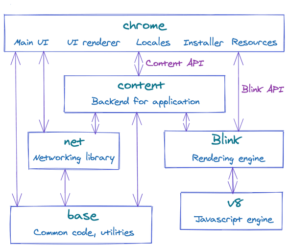
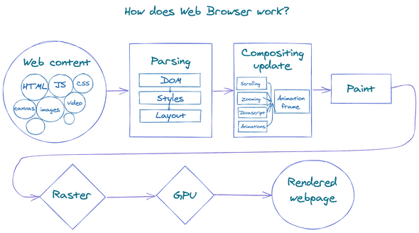
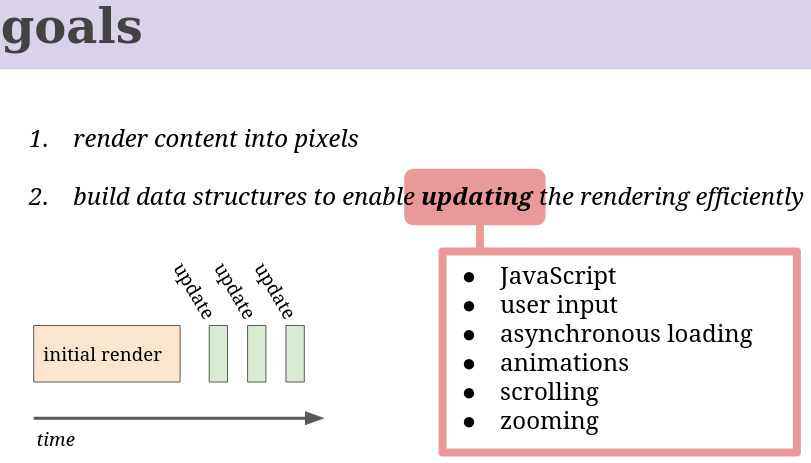
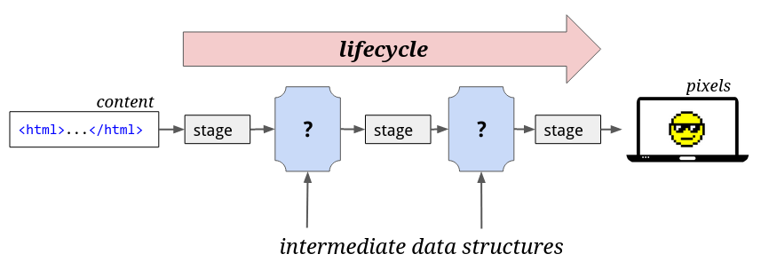
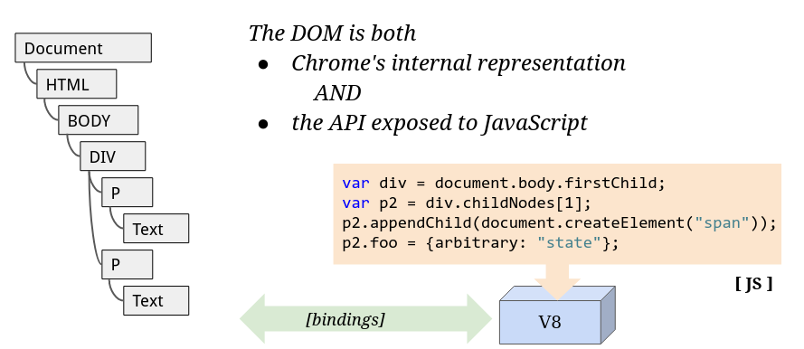
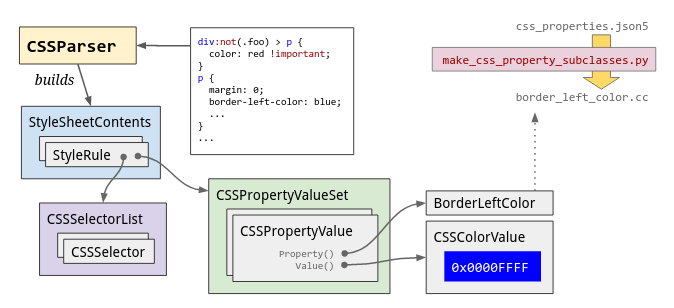
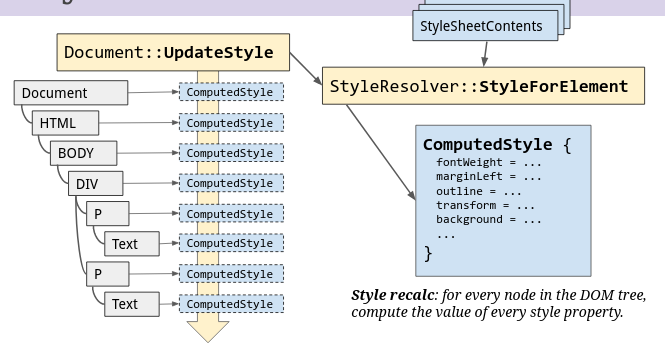
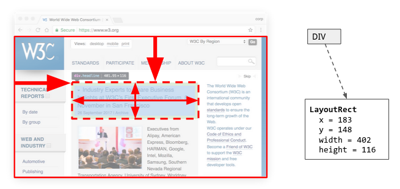

# Browser Architecture
### Processes and Threads
A Browser could be one process with many threads OR many different processes with few threads ...communicating over IPC. _there is NO standard, the choice is left to the browser implementer_




# 1. Rendering Pipeline
Rendering engines..
- **Gecko** - for firefox
- **Trident** - for IE
- **Webkit** - for Safari and Chrome on iOS
- **Blink** - for chrome. Blink is a fork of Webkit
## What happens when you load a webpage<br/> (Blink: the rendering engine) _high level_

1. enter address in browser
2. fetchs assets: HTML, CSS, JS, images, icons
3. HTML files parsed --> turned into DOM tree
4. Style Resolving(recalc)
    - processing the CSS styles
    - browser's CSS parser creates a "model" out of the supplied style rules
    - merges the model with the default styles provided by the browser
    - compute the _style_ property for every DOM element
5. Layout Engine
    - determine (x,y) for all elements
6. Painting Engine
    - use the style rules from (4)
    - use the coordinates from (5)
    - create a list of _painting instructions_
    - consider _z-index_ for correct stacking
7. Raster stage
    - execute the painting instructions from (6) to create the bitmap of color values
    - rastered bitmap will  be stored in GPU memory
    - GPU uses openGL to draw pixels on the screeen


**Optimizations..**..animations, scrolling etc<br/>
everytime an animation happens, or when you scroll the screen, it would be costly to do all the steps above to re-render everything.

Why re-render everything then?
Small dynamic changes in content(say a small element being animated, or a button color changing) can be optimized by "invalidating" a DOM element(s) and re-rendering ONLY them in the next frame.

But when you scroll the page, then what? all pixels have to be recalculated right? what to do when big regions change?
&mdash; to do this, the page is _decomposed_ into layers that raster independently. A layer can be as small as to contain just one DOM node!. All these layers will then be composed in a **compositor thread** . Divide and conquer approach at its best.


## [Life of a pixel](https://youtu.be/K2QHdgAKP-s)



- the renderer consumes "content"
    - html
    - css 
    - js
    - images

- the "renderer process" is sandboxed. (Blink + cc(chromium compositor))
- At one end of the rendering pipeline, we have the input in plain text ( one huge HTML file with links to JS, CSS and assets) ..at other end of the pipeline, the browser has to talk to the OS to get access to the graphics library(openGL) to pass on commands to the GPU to finally render the pixels. Coding at openGL level knows nothing about html, css. its just about "draw a polygon here, with this color" etc

#### 1. HTML parsing
HTMLDocumentParser --> HTMLTreeBuilder (DOM tree)

The DOM serves 2 purposes
1. as an internal representation of the nodes
2. as an API for JS to use and manipulate those nodes

The JavaScript engine (V8) exposes DOM web APIs as thin wrappers around the real DOM tree( in C++) through a system called "bindings".

**Note on Shadow DOM**:
You might think there's only ONE DOM. but there are many many other small DOM trees sneaked into the rendering pipeline by the browsers. These small DOM trees are shadow DOMs. Every "custom" element has its own shadow DOM tree.

_Shadow DOM is a "scoped" sub tree inside your DOM element_ 

_A custom Element whose internal DOM is encapsulated in a "shadow tree"_

_the contents will always be in the "shadows", hidden from everyone_

Observe a Slider HTML element
```html
<input type="range" id="foo">
```
Looks like it does a lot of things with JS for a simple HTML element. it looks complex but its still one dumb HTML element as per your "main DOM"
```js
var slider = document.getElementsById("foo");
console.log(slider.firstChild); // returns null
```


#### 2. Parse Style rules (CSS)
The CSS parser builds a "model" of style rules from every given style sheet. (combined with the default styles supplied by browser)

These style rules are indexed for efficient lookup (later)


#### 3. Apply the style rules (CSS)


_final "resolved" style for a given DOM element_

Style resolving (or recalc) takes all the parsed style rules from the active style sheets, and computes the final value of every style property for every DOM element.  These are stored in an object called ComputedStyle which is just a giant map of style properties to values.

(the style shown by devtools when you "inspect" is coming directly from Blink)

#### 4. Determine visual geometry (Layout engine)... compute coordinates



Things like {float:left} and all come here to determine positioning.
Layout engine uses [Harfbuzz lib](https://github.com/harfbuzz/harfbuzz) to determine total "occupied" sizes based on font, glyphs.

#### 5. Build Paint instructions
take into account the stacking order using z-index

#### 6. Rasterization
Execution of paint instructions(paintops)

Output of Rasterization is a bitmap of color values

raster uses Skia library to make GL calls 

#### 7. TBD again :( ...pending summarization


# 2. Javascript Engine
- chrome uses v8
- Firefox uses SpiderMonkey


The JavaScript engine executes and compiles JavaScript into native machine code. 


# Resources
- https://developers.google.com/web/updates/2018/09/inside-browser-part1
- https://docs.google.com/presentation/d/1boPxbgNrTU0ddsc144rcXayGA_WF53k96imRH8Mp34Y and https://youtu.be/K2QHdgAKP-s
- https://dom.spec.whatwg.org/

# Questions
- shadow dom and webcomponents
- events: capturing and bubbling


