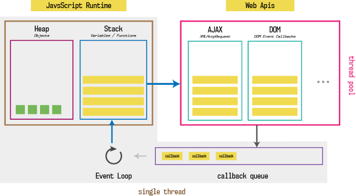

# JS is Synchronous
- Its single Threaded
- Host environments like browser engines augment JS with a number of WebAPI
		- for interacting with external systems
		- for dealing with I/o bound operations

# Asynchronicity
 - timeouts
 - events
 - Promise


## `this` in JS


## Rest parameter and Spread operator (...)

### Rest parameter "rest of the args"
Collects rest of the args in an array
```js
// function definition
const add = (...args) => args.reduce((x,y)=>x+y, 0)

//usage
add(1,2,3,4,5,6)  /**21*/
```
Note:
- rest parameters have to be the **last** arg `function sum(a,b,...rest){... ... }`
- before ES6, `arguments` keyword was used in place of ...rest parameter.

### `arguments` Keyword
Before ...rest parameters, people used arguments keyword to collect all the args in a "array like object".
Note that its NOT an array...its an object.
- arguments cannot be used in arrow functions. Because arrow funcs dont have `this`, hence they dont have `arguments`

### Spread operator  "expand my contents"
- can be used in function calls
- can be used to "copy" objects and arrays into another box.
```js
const arr1 = [1,2];
const arr2 = [5,6];

// using spread operator to create bigger arrays
const arr3 = [...arr1, 3, 4, ...arr2]

// using spread operator in function calls
sum(...arr3)
```


# Error Handling

### Error v/s Exception
An `Error` becomes an `Exception` only when its thrown.

You can throw anything, not just Error objects. But DONT do it. Just stick to throwing proper errors.

### The Error Object - Parent class
Error is an `object` having 3 attrs
- message <string>
- name <string> : this is the error type
- stack : the stack trace

### Custom Error

```js
Class CustomError extends Error{
	constructor(foo='bar', ...params){
		super(params);
   		if(Error.captureStackTrace)
			Error.captureStackTrace(this, CustomError)
		this.name = 'CustomError'
		this.message = 'Construct some descriptive message here'
		this.foo = foo
		this.date = new Date()
	} 
}
```

## What happens when you "throw"?
Once you throw, it bubbles up until its caught somewhere.

If not caught ANYWHERE, program crashes.

You miight want to do this, i.e not handle the exception so that 
the program crashes and doesnt show invalid data

## Sync error handling
```js
try{
...
}catch(err){
...
}
```

**Try/Catch is synchronous**

good to send stuff to logger inside catch

## Async error handling
This does not work
```js
	function failAfterOneSecond() {
		setTimeout(() => {
			throw Error("Something went wrong!");
			}, 1000);
	}

	try {
		failAfterOneSecond();
	} catch (error) {
		console.error(error.message);
	}

```

### Promise.reject
By the time the callback passed to setTimeout runs, our try/catch is long gone.

As a best practice when rejecting a Promise it's convenient to provide an error object:
By doing so you keep error handling consistent through the codebase. Other team members can always expect to access error.message, and more important you can inspect stack traces.
```js
Promise.reject(TypeError("Wrong type given, expected a string"));
```

### throwing esception

```js
	Promise.resolve("A string").then(value => {
		if (typeof value === "string") {
			throw TypeError("Expected a number!");
		}
	});

	// The chain HAS to have a catch somewhere
```

## Events

### Synthetic events

## DOM

### Shadow DOM
#### "Piercing" Shadow DOM?


 

# UnderTheHood &mdash; Javascript
...initial days...

JavaScript was not designed by considering the performance in mind. _It had to just work inside a browser and provide API to work with DOM_ . But since many browsers tried to adopt it in their own way, it had to be standardized. (ECMA does this job)

### What is Javascript Engine
How does your computer understand what to do with the plain text js file?
<u>A JavaScript engine is a program responsible for translating source code into machine code and executing the translation result on a computer’s central processing unit (CPU).</u>


- **Ecmascript specification** tells how javascript should be implemented by the browser. (spec of the language)
- Each browser has a **javascript engine** which runs JS code.
	- netscape used spidermonkey engine
	- chrome uses v8 engine
	- firefox uses spidermonkey engine


<div style="background:antiquewhite; padding:2em; border:2px solid">
The JS engine is totally independent of the runtime(which provides it with additional APIs). This is why v8 is used in both chromium and NodeJS
</div>

### What is Javascript Runtime Environment?
The JavaScript engine works inside an environment, which provides additional features to your scripts that you can use at runtime, to communicate with the world surrounding the engine.
- web APIs (which include DOM APIs)

<div style="background:antiquewhite; padding:2em; border:2px solid">
DOM APIs are provided by the browser and its NOT part of javascript
</div>


v The complete browser



#### Single threaded
Though JS is _executed_ in a single thread,

There does exist thread pool in Javascript Runtime Environment. and the environemnt manages the threads for you, not your worry.

If there’s only one thread responsible for the execution of your code, there has to be some mechanism which manages the order of execution.

Enter event loop

### What is event loop?
<div style="background:antiquewhite; padding:2em; border:2px solid">
Event loop is implemented in the runtime environment and is NOT part of javascript
</div>


# Resources
- https://stackoverflow.com/questions/29027845/what-is-the-difference-between-javascript-engine-and-javascript-runtime-environm

# Questions
- what are all the moving parts in the browser
- why isnt heap and stack part of the JS engine(v8)?

#TODO
event loop more explanation


	
