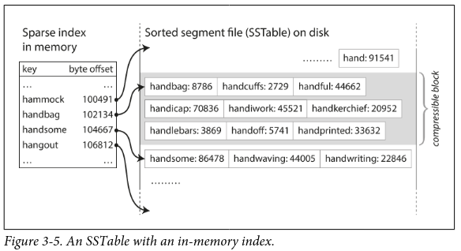
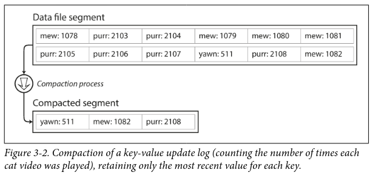
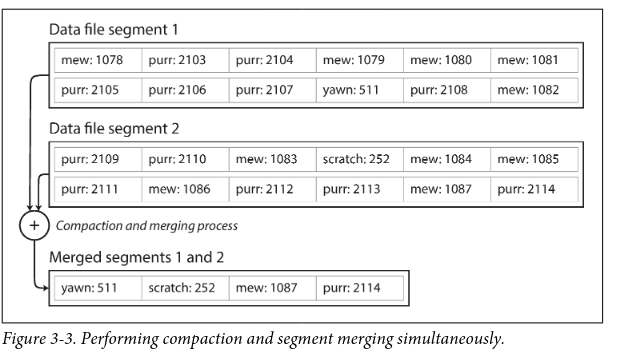

_sort by keys_
> **Note**
> _whole approach is called LSMTree, which uses memtable(redblack tree) in memory and SSTables on disk_

![[ddia-13.jpeg]]
Within each of the segment files, entries are sorted by key. ( But how do you sort them in the first place? This sounds like you need to perform sorting ON disk? like B-Trees?..But doing it in-memory is far faster. We use AVL Trees or RedBlack Trees to do this in memory . This is a "memtable". When the tree gets big enough, its flushed to a (new)segment on disk, which will be sorted , since you can read values one by one from RedBlack tree in sorted order )

Benefits of Sorting...
- merging segment files get far simpler/faster (compaction)
- no duplication of keys in segment files (smaller size segments)
- "hash index" kept in memory gets much much smaller, since you don't store offset for every single key now. You only store offset of the first key in the segment.
	- For reading a value, you jump to the nearest offset and run a sequential scan(or run binary search!)
- Allows for range queries (both on memtable and on SSTable)
	- On redblack tree(memtable) : Find the node containing starting value, do inorder traversal until you reach the node with end value. You have now traversed all values in sorted order from start value to end value.
	- On SStable: just find the right SStable.Then use the SST's lookup table to find the offset of first key(or the one nearest to it, before it). and then loop until the end value .(the SST already contains keys in a sorted order like a sorted vector)

![[ddia-04.png]]
Merging segments is just merge sort algo. The merged segment is automatically sorted by the key. if same key appears in multiple segments, consider the key value in the newest segment.

No need to maintain a index(hashtable) of ALL keys in memory. split the segment into blocks and store only offsets of the first key in the block. then for every key that you are searching, you can start at an offset and then do linear search until you find the key(Or binary search).
You DO need an index of few keys though, not totally ignore the index. But the number ofkeys in the index is considerably smaller now because of sorted nature of the segment. saves disk space.

**How Writes are handled**
1. When a write comes in, add it to in-memory balanced tree DS (redblack tree, avl tree). This tree is called "memtable". (whenever you write to memtable, also write to a log for crash recovery. Every memtable has its own set of logs. When the memtable is flushed later to SSTable on disk, the corresponding logs are discarded)
2. When memtable(tree) size exceeds a limit (few MB), flush it to disk as an SSTable. (This can be done very efficiently since the tree already maintains the k-v pairs in sorted order, by key). The new SSTable becomes the most recent "segment" of the DB. While memtable is being flushed to a SSTable on disk, the incoming writes can continue on a new memtable. 
3. From time to time, compaction and merging of segment files (SSTables) on disk. 
How reads are handled
1. first try to find the key in the memtable, then in most recent SSTable(segment on disk), then in the next older segment, so on
2. Performance will suck if you're looking up a key that doesn't exist in the DB. So you use a**BloomFilter to check if the key exists or not**;

>**Note**
>_This is used in LevelDB, RocksDB, Cassandra, Google BigTable, Cassandra, HBase, ScyllaDB.
>LevelDB is can be used in Riak as an alternative to Bitcask

>**Note**
>_Also used in Lucene. , inverted index
>memtable contains key=term, value=(list of ids of documents containing the term)
>flushed to SSTable-like sorted files, which are merged in the background._

##### Segmentation and Compaction
Break the logs into _segments_ of certan size. close the file when a segment reaches its max limit, =>  write to new segment. The old(closed) segment is frozen, immutable. 

Why immutable? Since its just way too easier/faster to keep on appending at the end than seeking the exact position to overwrite. Random writes on disk is slow. Also its good for concurrency and crash recovery. 

During reads, the latest segment is checked for the presence of a key, if not, second-most recent segment is checked (every segment has an associated hash-table in memory).

Then, later on, do _compaction_ on these segments ( throw away duplicate keys, keeping only the recent update for each key)

Since compaction makes segment sizes smaller, Compacted segments can then be merged into  new segment, throwing away the old segments.(Why?— merging process keeps the number of segments small, so lookups dont need to check many hashmaps(each segment has one hashmap)) . this can be done in a background thread.

Also, regular compaction and merging of segments significantly reduces fragmentation of disk.
