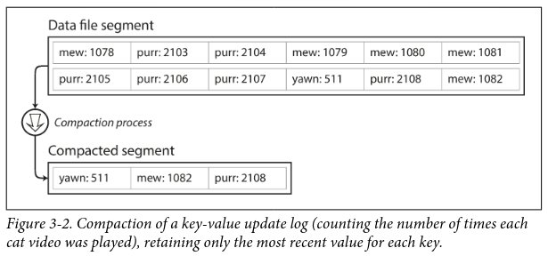
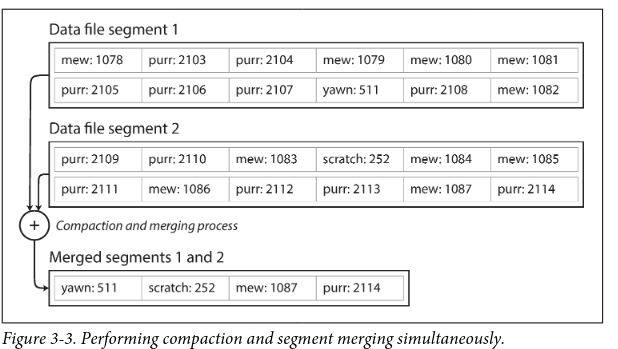

![[ddia-62.png]]
![[ddia-01.png]]
A hash Index is an in-memory hash-table which can give you the **location of a key on disk** in O(1)
>**Info**
>_This hashIndex is the basis of "memtable" discussed in LSMTree later_ _The file stored on disk(csv) is the basis of "SSTable" discussed in LSMTree later._

Imagine the "database" is just a 
- continuously growing file(on disk) with k-v pairs separated by commas
- additional in-memory hash-table to **speed up disk seek**
Now you've got 
- faster reads, thanks to hash-table.
- faster writes, since its just an append-only log.

>**Note**: 
>_Bitcask (storage engine of k-v store called Riak), does exactly this.(append-only writes + in-memory hash index)
>Gives "High Performance reads and writes"...

Downsides ?
- **Entire hash-table should be stored in memory, large RAM needed**
	- Make sure all your keys can fit in memory.
	- why not store the hash-table on disk? random IO on disk is very slow compared to RAM. 
- **Range queries are inefficient**
	- eg: cannot scan over all keys **between kitty000 and kitty999** , each key has to be looked up individually on the hashmap
- (solved) Crash Recovery — you lose all data in memory (hash-table)
	- You _could_ loop through the "database" file and re-populate the hash-table upon startup... though this is slow.
	- Bitcask speeds this "recovery" by storing snapshots of the hash-table on disk regularly. 
- (solved) you might run out of disk space since the same "database" file has lots of duplicates, (since you dont want to overwrite old values)
	- Segmentation, Compaction & Merging will help reduce the growing file size on disk. "Compaction" means throwing away duplicate keys in the log, keeping only the most recent update for each key. 
	- Done on a background thread. 

#### Segmentation and Compaction
Break the logs into _segments_ of certan size. close the file when a segment reaches its max limit, =>  write to new segment. The old(closed) segment is frozen, immutable. 

Why immutable? Since its just way too easier/faster to keep on appending at the end than seeking the exact position to overwrite. Random writes on disk is slow. Also its good for concurrency and crash recovery. 

During reads, the latest segment is checked for the presence of a key, if not, second-most recent segment is checked (every segment has an associated hash-table in memory).

Then, later on, do _compaction_ on these segments ( throw away duplicate keys, keeping only the recent update for each key)

Since compaction makes segment sizes smaller, Compacted segments can then be merged into  new segment, throwing away the old segments.(Why?— merging process keeps the number of segments small, so lookups dont need to check many hashmaps(each segment has one hashmap)) . this can be done in a background thread.

Also, regular compaction and merging of segments significantly reduces fragmentation of disk.