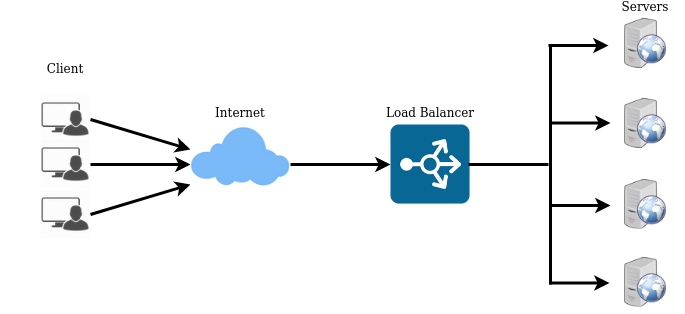
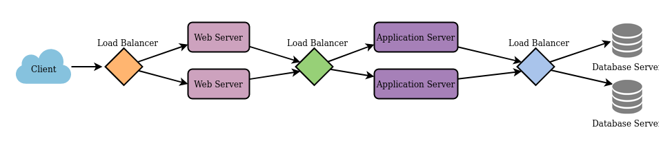
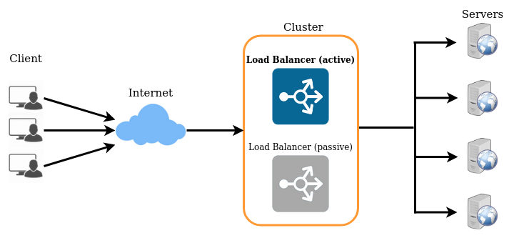

# Load Balancing

Distributing n/w traffic across multiple servers. Ensures no single server is **overloaded**.

- improves responsiveness
- conducts health checks of servers
- some LBs can remove unhealthy servers
- some LBs can even trigger creation of new application servers to cope with increasing demand or to replace an unhealthy server
- increases availability, less downtime
- reduces individual server load.
- no more single point of failure
- smart LBs can do predictive analytics
- SSL traffic is often decrypted at the load balancer (**SSL termination** happens at the load balancer). The LB saves the web servers from having to do decryption, SSL termination. Improves application performance.
  - The traffic b/w LB and web servers is no longer encrypted. Web server must be inside private subnet.

### What does a LoadBalancer do?

- Service Discovery
  - What backends are available in the "system"?
  - What are their addresses?
  - How should the LB talk to them?
- Health Checking
  - What backends are currently "healthy" and are they available to accept requests?
- Load Balancing
  - What algo should be used to balance the requests across healthy backends?

### Where can i keep my LBs?

infront of

- websites (between user and webserver)
- applications (between webservers and internal platform layer [application server, cache server])
- databases ( between platform layer and DB)
- ...

## Implementing Load Balancers

- #### Smart Clients

  - clients themselves will smartly choose the servers to hit.
  - detects hosts that are not responding and will avoid hitting them.

- #### H/W Load Balancers

  - Most expensive
  - Highest performance
  - eg :Citrix Netscaler

- #### S/w Load Balancers

  - HAProxy, Nginx, Traefik

For most systems, we should start with S/w Load balancers and them move to smart clients or H.w Load Balancers if need arises.

## Load Balancing Algorithms

how to choose the backend server? Should choose only **healthy** servers. So doing constant **Health Checks** is important!

- Least Connection
  - direct traffic to the server with least connections
- Least Response Time
  - direct traffic to the server with fewest connections and lowest response time (avg)
- Least Bandwidth
  - direct traffic to the server which is currently serving least amount of traffic measured in Mbps
- Round Robin
  - servers are equally powerful, equal specification.
- Weighted Round Robin
  - each server is assigned a weight
  - servers with more power get more weight.
  - server with higher weight get more connections
- IP hash
  - IP hash of the client

## Redundant Load balancers

- What if one LB goes down?
- LB becomes single point of failure lol
- keep another standby load balancer
- keeps checking the "health" of active load balancer

## L4 Load Balancer (Network Load Balancer)

- Does NOT inspect the content of the packet.
- Limited routing decisions

Uses the data available in Layer 4 such as

- IP address
- TCP/UDP port

## L7 Load Balancer (Application Load Balancer)

- inspects(and can manipulate) the content of the packet.
- more sophisticated.

Uses the data available in Layer 7 such as

- HTTP headers
- URI
- SSL session ID
- cookies
- HTML form data
- even data inside payload

# Links

- <https://blog.envoyproxy.io/introduction-to-modern-network-load-balancing-and-proxying-a57f6ff80236>
