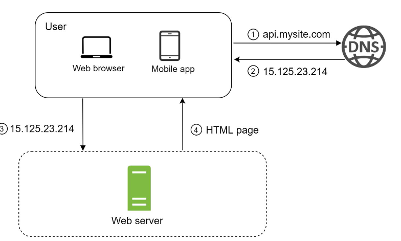
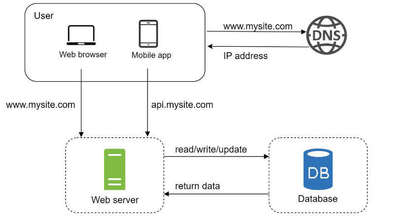
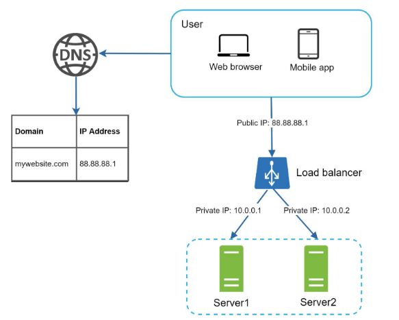
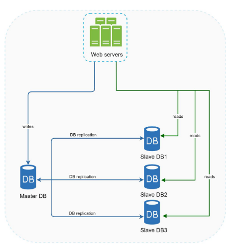
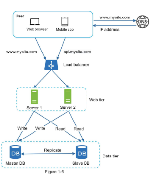
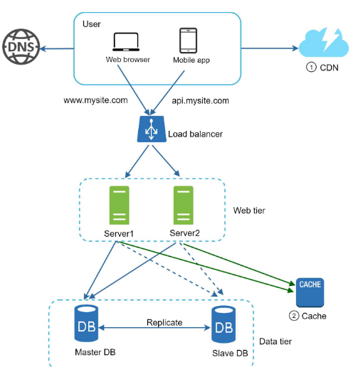

# Scale from zero to millions of users

We start with this... for use by a single user lol.

Separating web server and DB server allows both of them to be scaled independantly

## Selecting a DB

Relational

- mysql
- postgres

NoSQL

- mongoDB
- AWS DynamoDB
- CouchDB
- Cassandra
- HBase

NoSQL databases are grouped into 4 categories

1. Key-Value Stores
2. Graph Stores
3. Column Stores
4. Document Stores

Go for noSQL when

- you need super low latency
- massive amounts of data
- data is unstructured
- you only need to serialize and deserialize data (JSON, XML, YAML etc)

## Vertical Scaling vs Horizontal Scaling

Vertical Scaling &mdash; 
"scale up" Adding more CPU RAM to the servers

- GOOD when traffic is low
- SUCKS because there's a limit
- SUCKS because **no redundancy** and failover

Horizontal Scaling &mdash; 
"scale out", adding more servers to your pool of resources behind a LoadBalancer

## LoadBalancer (for web tier redundancy)

Evenly distributes incoming traffic among the web servers that are defined in a load-balanced set.

Improve availability , added redundancy and failover!!

- Webservers are unreachable directly by clients
- private IPs are used for the servers (better security)
- Load Balancer communicates with web servers through private IPs
  
## Database replication (for data tier redundancy)

Master-Slave relationship between original and copies

Master&mdash;

- supports only write operations

Slaves&mdash; get copies of master

- only support read

Most apps require much higher ratio of reads to writes; thus large number of slaves compared to master

- Better Performance
  - All reads to slaves
  - All writes to master
  - parallelism!!
- Reliability & HA
  - Say one instance goes down because of earthquake etc.

What if a slave goes down?&mdash; 
If there's only one slave, and it went down...then master will temporarily accept read queries, else if there are multiple slave DBs, queries will be directed to them,... soon a new slave DB will be provisioned.

What if the master goes down?&mdash;  
A slave will be PROMOTED to be the new master.
A new slave will take the place of the old slave immediately

After adding Load balancer and redundancy to DB we get...

Time to imporove load/response time vvvvvvvvvv

- cache layer
- shifting static content to CDN

## Cache

Stores the result of EXPENSIVE responses/frequently accessed data in memory
Eg: Memcached

Benefits of having a separate `cache tier`

- can scale the cache tier independently
- reduces DB workloads
- better performance

#### "Read Through Cache"

1. request recieved
2. server checks if cache has the required response
   1. if yes, sends back the cached response to the client
   2. if no, then queries the DB, stores the response on cache and then sends it back to the client

#### Cache consideration

- When to use Cache? &mdash; data is read frequently but modified rarely.
- if cache server restarts, all data in memory is lost
  - So , store important data in DB itself, dont rely on cache for important data
- Set **Expiration policy** to avoid stale data
- **Consistency** : keep cache in sync with DB
- **mitigating failures**: cache is a single point of failure(SPOF)
  - Multiple cache servers across different data centers
  - overprovision required memory
- **Eviction policy**: need to evict old data when cache is full to make space for new data
  - LRU
  - FIFO

## CDN

CDN is a n/w of geographically dispersed servers used to deliver **static content**

When a user visits a website, a CDN server closest to the user will deliver the static content.

If the CDN server does not have the content, it will pull it from the origin (web server or s3). This content will have TTL, which describes how long the image is cached. This content remains cached until the TTL expires.

- images
- videos
- CSS
- JS files etc

#### Considerations

- Cost : CDNs are provided by third party.
  - Store only frequently accessed data
- setting cache expiry
- CDN fallback
- invalidating files
  - object versioning

After adding cache tier and CDN....

# More readings

- Paper: "Scaling memcached at Facebook"
