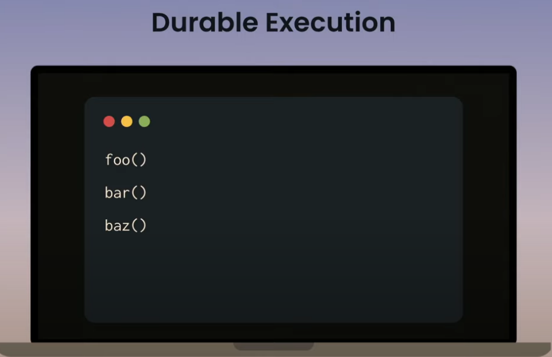

- 2004: AWS SQS, AWS SWF
- 2014: Azure Service Bus, Azure Durable Task
- 2015: Uber Cherami, Uber Cadence
- 2019: Temporal (fork of Cadence)

<p>
    
    
</p>

How do you get from the "blender" to the "cake"? Its via **Durable Execution** : 
<p>
    
    
    
</p>

In _smoothie_ architecture all you keep doing this..
- Load state from DB, update it , save it back
- Load state from DB, update it , save it back
- Load state from DB, update it , save it back

In _cake_ architecture all you
- just write sequential code, and it will be durable at every step

What does all this enable? : **Durable Timers, inbuilt retries to external unrealiable services, Queues**
<p>
    
    
    
    
</p>

#### Parallels to Operating systems
<p>
    
    
    
    
    
</p>

But, we dont really have distributed Operating Systems..


#### The new infra "boilerplate"

<p>
    
    
    
</p>

## Motivation
- Runtime for **managing** distributed **application state** at scale
- Telling s/w how to depend on external things it does not control is hard
    - activity X **needs to happen** if Y has just happened.
    - acitvity Z **needs to retry** if the banking service is down.
- When your app is a huge state machine, it gets hard to track all possible states and take action on each state. **Implementing transactions is very hard, and is like reinventing the wheel**
    - eg: pytransitions in FD
- Even after you manage to get all this right, managing all the infra gets tricky
    - Kafka, Queue, DB, Application

Consider a hospital management system., **new patient onboarding logic**
1. Assign Hospital
2. Assign Doctor
3. Notify Patient
4. Finalize onboarding

All these are **functional requirements**, and oftentimes, you are **forced** to mix up **non functional requirements** into the same codebase like
- Handling failure
- Failure recovery
- State(Persistence)
- Transactions & Rollback (Strongly consistent state)
- Eventing
- Timeout
- Rate limiting...


M E S S I

# Why Temporal?

_focus on business logic, and delegate all hard stuff to temporal_

<p>
    
    
</p>


- shields you from unreliability
    - Consistency: When temporal application fails, they recover to a consistent state
- scalability (10rps - 10krps), extreme transparency, observability 
    - Visibility : Into Workflow Execution Events loop. Failures, retries, statuses on **Temporal WebUI** or **Temporal CLI (tctl)**. Metrics are pushed both from temporal servers and Workers(sdk)
    - Being able to see step by step whats happening, what steps the workflow took.
    - You can also replay failed activities locally using the history...
    - When you want to scale, it might get difficult to scale individual pieces of infra (as they dont scale the same way). Temporal abstracts this away
- seamless upgrades
    - You want to upgrade your application, but what about the requests midflight during upgrade?
    - this is built into temporal.
- improves dev productivity
    - Write code as _workflows_
    - temporal abstracts "failure"
    - as teams get bigger, it gets hard to understand the entire state machine (homegrown) from ground up
    - thinking about problems in workflows and activities gives extreme clarity on the product (signal/noise ration is high on codebase)
- Automated Provisioning: Opens up scope for automating a lot of stuff
    - eg: Datadog used temporal to manage its self managed mysql


### Case study - Stripe
- Theyre building a platform on temporal, not for just one project
- usecases
    - batch jobs to deal with bank FTP file uploads
    - control planes
    - billing and subscription state mgmt
    - customer facing data migrations
- Teams are asked to run worker service for each project
- Teams get dashboard and metrics out of the box


- Fat Client. Theyve hidden temporal SDK and wrapped it for more dev friendliness. Built 3 SDK wrappers. Java Ruby Go
- Devs are not familiar with workflows
- Focus is on productivity & safety
- Theyve documented classic temporal blunders & caught them in inhouse test frameworks
    - Idempotency of activities
        - Activity retries..yes. But they dont guarantee exactly once semantics.
        - in all tests, their test framework automatically runs activities marked with `@ExecuteAtleastOnce` _twice_ to verify idempotency
    - Replay Safety
        - workflow must be pure. no side effects
    - Network fencing
        - catches all n/w calls in workflows
        - catches all DB accesses etc
    - Version safeguards
        - all workflows and activities have to be passed an additional parameter called `version`
        - this is to make sure stuff runs in the middle of a deployment/migration

### Case study - Chronosphere
- They provide hosted observability platform as a company
- usecase
    - automated deployment and automated infra provisioning
    - confirmation messages on slack with signals that can be sent to workflow to alter behavior


### Case study - Netflix
- Used in Spinnaker(CICD Product) and Realtime data infra(flink control plane)
- 500k/day production workflows, projecting 1M/day soon. Setu Notification service is 70M/day for reference !
- opentracing, observability


### [Case study - Temporal](https://github.com/dynajoe/temporal-terraform-demo)
- How temporal uses temporal for its internal infrastructure provisioning (temporal cloud offering specially)
- They use **terraform-sdk+temporal** for provisioning infra. They wantedto fully automate this process. They were relying on bash scripts and aws APIs at the beginning...
- every "cluster create" is a long-running Cadence operation. Once complete, it starts a lot of cadence workflows per cluster(event loop) that run forever until cluster is destroyed.
- **One central event loop per cluster**
- a "snapshot" triggers an event, the main event loop ensures that no other ops(upgrades etc) are running at the same time, kicks of the snapshot job and then continues...
- Long (days/weeks) sleeps in main event loop to wake up to renew TLS certs


- activities
    - create vpc is an activity
    - create subnet is an activity

- "activities" here should be
    - retryable
    - idempotent

### Case study - Checkr
- Company that does background checks..

### Case study - Box
- Business transactions. Consistency, reliability is king here..
- Typical transactions: Withdraw/Deposit cycles with banks 

### Case study - Datadog


Datadog sortof managed its own infra. And temporal was the glue to help them do this.


### Naive example
```
def transfer(from:Account, to:Account, ref_id:str, amt:Amount):
    accounts.withdraw(from, amount, ref_id)   # --------> talks to banking service
    accounts.deposit(to, amount, ref_id)      # --------> talks to banking service
```
- You need to deal with timeouts, retries..
- You need a write a **state machine** for all kinds of edge cases.
    - if this, update this to database, if that, update that to database.
- Many a times, DB becomes a bottleneck...
- Often, most of your calls involve queues. Involvement of Queues is a repetitive boilerplate
- There is no "transaction" primitive between DB and Queues.
    - recovery to consistent state (perfect rollback) is hard


### Sample requirements

_Limited time subscription service(3 year phone plan)_
- When user signs up, **send welcome email**, start a free trial for `TrialPeriod`.
- when `TrialPeriod` expires, start the billing process.
	- If the user cancels during the trial, **send a trial cancellation email**
- Billing
	- As long as you have not exceeded `MaxBillingPeriods`...
		- **Charge the customer** for `BillingPeriodChargeAmount`
		- Then wait for next `BillingPeriod`
		- If the customer cancels during a billing period, **send a subscription cancellation email**
	- If subscription has ended normally(3 years have passed)(exceeded `MaxBillingPeriods`), **send a subscription ended email**
- Visibility
	- At any point, we should be able to **look up** and **change** any customer's 
		- Amount Charged
		- Period. (Manual adjustments, refunds)


## Concepts


Workflow is the orchrestrator; Activity is an executor.

### Workflow
Workflows are **resilient programs** that HAVE to run even in the face of failures. **Workflows HAVE to be deterministic**. Workflows can also **react to external events** including **timer expiry** and **timeouts**

failures?
- infra going down..
- backend going down
- temporal cluster itself going down


There are too many ways to represent a workflow..DSL, xml, yml, json, flowcharts, forms...or just programming languages..


Workflows have a **`workflowId`** and every workflow instances have **`workflowRunId`**

You can give **signals** to Workfow Intances. Or you can **query** workflow for info.
```
eg: WorkflowInstance.getNextActivity().execute()
```

### Activity
Activity is meant for arbitrary I/O.

Activity Functions can be non-deterministic. These are used to interact with the outside world (unreliable, uncontrollable 3rd party APIs, like Banks...). <u>Activity functions are orchestrated by Workflow functions</u> so, they can be only called within a workflow

<hr/>

# [Workflow Engine Principles](https://temporal.io/blog/workflow-engine-principles)

### Types of Workflow Engines
1. State based 
    - persist context and execution point
    - persists PC(Program counter) and variables (+stack)
    - there's a limit in the control flow that you can express here
2. Log based
    - recreate the context and execution point
    - persists commands and results

_Temporal is log based workflow engine_

Any workflow engine needs to have following
 - Task Queues
 - Durability
    - state of the workflow needs is fully preserved at all times.
    - incl local variables, stack traces, threads etc
 - Timers
 - Consistency
 - Sharding & Routing
 - System Workflows
 - External Workflow & Activity Implementations


#### Prerequisites - Database Transactions
_Guaranteed to execute not at all, or once to completion_


### The State Machine...


_Workflow is just a **state machine** which calls a set of **tasks** in required order and also react to external events if necessary (incl timer expiry)_

<p>
    
    
    
</p>

Here **WorkflowDefinition** is the state machine that accepts current state from the engine, and returns what commands to run next. (image 3) Practical systems make use of queues to dispatch tasks to deal with slowness and availability. These tasks are dispatched to **workers**

### The Timer Queue...

...With an external timer queue that durably stores and dispatches timers.

### Transactions & Durability...


If you dont enforce "Transactions", you can see race conditions like...

- you update state, + put task in task queue
    - state update works, but task queue update fails 
        - !inconsistent state!
        - state machine jumped too far into the future.
        - Your state machine thinks the task queue has accepted the job, and is maybe processing the job (when in fact, it didnt even successfully get the task, let alone execution)
- you put task in task queue first + you update the state
    - the state update is too slow, and task has been processed already!
        - !inconsistent state!
        - state machine is stuck in the past.
        - Your state machine thinks the task has been processed due to a mistake cuz the "current state" doesnt even talk about tasks being dispatched

Hence it is important to _atomically add tasks to queue and update state_

People who don't use workflow engines, will resort to implementing transactions by hand with M E S S I architecture like...


Workflow engines are hard because they deal with multiple things like task queues, timers, state(durable), and <u>transactional updates across all of them</u>

### Scalability
> **Note** <br>
> _If timers, task queues, state, transactional updates across all these entities can be implemented using just ONE underlying database, then transactions become easy_

Just using one DB to achieve all workflow capabilities would not be scalable.

_How can we execute a million tasks?_
<u>Workflow DOES NOT behave like mapreduce where a single workflow's tasks are sent to a hundred machines for execution.</u>

**Worflow is the UNIT of scalability**. 
_Scaling out_ workflows is feasible in temporal, not _scaling up_ just for one workflow. Hence, <u>dont dump all your tasks into one workflow, but split your logic into multiple small worflows</u>, or you can have your main workflow create a hundred child workflows. Each workflow instance is guaranteed to fit inside a single machine.

**Scale out the DB**, because for very very large systems, DB will be the bottleneck (RIP RDS). <u>Note that vertical scaling of DB is required, not scaling out DB instances</u>. This is because we would no longer be able to guarantee transactions (unless 2PC commits are enforced). Next option (to avoid vertical scaling of DB) would be to have one DB instance per machine..this works (because transactional guarantees WITHIN a workflow is now provided since one workflow is contained within one machine), but gets harder to add/remove machines. The last (best) option is to **use DB sharding**. Assign a workflow to a DB shard by using consistent hashing. If DB sharding is done, you definitely need a routing layer. Next problem: **DB sharding causes problems for Task Queues**. Say you have a queue named `myQueue`. Which shard will you store this queue on? Multiple workflows may write to it.. Will you store this queue on every shard(say 10,000)? Then queries like "get all activity tasks in `myQueue` for workflow with ID=123" becomes a fanout on 10,000 shards. So maybe store a queue to a separate dedicated shard? Next Problem : **If queues lie outside workflow core shards, we cannot enforce transactions**. Temporal uses [Local Transfer Queues or `transactional outbox`](https://microservices.io/patterns/data/transactional-outbox.html) to solve this, without resorting to complex stuff like 2pc paxos to force protocols on entities like Queues.

<p>
    
    
    
</p>


Local Transfer Queues simply implies having a **local queue** within every shard (to force transactional updates to queue and workflow state). These internal queue contents are later transferred to the real queue subsystem async.

<p>
    
    
    
</p>

### Visibility | Admin actions ...Workflow Replay, Workflow Terminate
> _Give me all failed workflows started by USER-X in last 24 hours..._<br>
>_Terminate all workflows started by User-X which match this criteria..._

Querying 10,000 shards (even with indexing) is expesive. **So temporal has a separate indexing component - ElasticSearch**.
LocalTransferQueue approach is used here as well. _visibility records_ is _committed_ to each shard, and then transferred to ElasticSearch async. Slow, but eventual consistency.

<p>
    
    
</p>

To replay, terminate workflows...you _could've_  written your own script. Get Workflow IDs, dump to file, terminate one by one. **This is inherently a workflow on its own**. Temporal calls this **System Workflows**. <u>Temporal is dogfooding its own abilities to provide new feature</u>


# [How Temporal Works](https://temporal.io/how-temporal-works)


# Resources
- [Example temporal application](https://github.com/temporalio/background-checks)
    - design decisions(temporal related) for this particular app
    - what business processes are mapped to temporal primitives?
    - philosophical points... 

# To research
- [ read code ] How client --> temporal core --> worker messages are sent via protobuf
- [ read code ] is temporal "queue" a poll on db?
- Is all this applicable to typical 