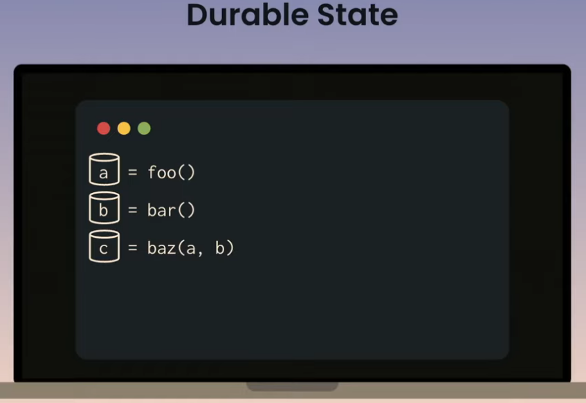
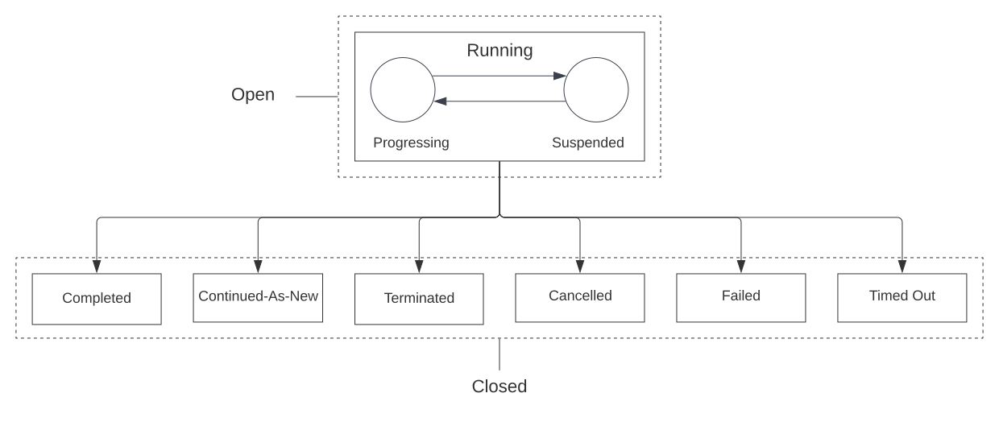

```js
function subscribe(customerId){
    onboardToFreeTrial(customerId);

    events.onCancellation(
        processSubscriptionCancellation(customerId);
        stopWorkflow();
    }

    wait(60 * time.days);
    upgradeFromTrialToPaid(customerId);
    forever {
        wait(30 * time.days);
        chargeMonthlyFee(customerId);
    }
}
```

- Domain specific logic (onboardToFreeTrial, ChargeMonthlyFee, UpgradeFromTrialToPaid)
- Time scheduling with `wait` and `forever`
- React to external events (user interaction) with `onCancellation` and `stopWorkflow`

<details>
<summary>Is this pseudocode really implementable?</summary>

We can't run a **function** on the same server for months/years. It would constantly consume resources or crash or reboot.

We get this done via **distributed, asynchronous, event driven approaches.**


- API GW, **REST APIs**
- store status in **DB**
- store renewal schedule of each subscription in **DB**
- cron job to run periodically -> query DB to check for scheduled items --> get due subscriptions, ---> add tasks to **queue** charge fees for each subscription
- separate **queue** to handle cancellation requests -> update DB
- **workers** to process queue **tasks** and execute associated code

#### As per AWS recommendation


</details>


# Temporal
- Temporal is a platform that **guarantees durable execution of your application code**.
- Allows you to _code as if failures dont even exist_. You focus your code on business logic, and forget about detecting and recovering from failures
    - n/w outages
    - server crashes

<details>
<summary>High level architecture</summary>


<p>
    
    
    
    
    
    
</p>


- **Workers**
    - Compute nodes that run your application code
    - <u>You compile your workflows and activities into a worker executable</u>
    - run in background 
    - listen for new tasks 
    - stateless | dont keep track of past,future
    - Workers dont talk to each other directly
    - Workers coordinate via a **central temporal service**
- **Central Temporal Service**
    - keeps track of **workflows**, **activities**
    - maintains **queue** of tasks for **workers** to pull and process
    - Internals made up of 
        - frontend
        - matching service
        - history service
- **DataStore**
    - Postgres | Cassandra | MySQL
    - stores
        - task queues
        - execution states
        - activity logs
    - Your code NEVER interacts with this data store. Its internal to temporal
- **Temporal Web Console** | **`tctl` Command line tool** (client)
    - view namespaces | workflows | activities | history
    - for manual inspection, troubleshooting
    - `tctl` can trigger a workflow execution
- **SDK** (client)
    - use this in your code to trigger a workflow execution
	- Major usecases
		- Start a workflow
		- Signal a workflow 
		- Query a workflow
		- Get result of a workflow execution
		- List all workflow executions..
	- uses gRPC to communicate with the cluster.

    


</details>


## Motivation

**What led to Temporal?**

We're used to mashing up business logic with failure handling.. business logic signal/noise Ratio is often poor in distributed systems

Consider a hospital management system., **new patient onboarding logic**
1. Assign Hospital
2. Assign Doctor
3. Notify Patient
4. Finalize onboarding

All these are **functional requirements**, and oftentimes, you are **forced** to mix up **non functional requirements** into the same codebase like
- Handling failure
- Failure recovery
- State(Persistence)
- Transactions & Rollback (Strongly consistent state)
- Eventing
- Timeout
- Rate limiting...

<p>
    
    
</p>

How do you get from the "blender" to the "cake"? Its via **Durable Execution** : 
<p>
    
    
    
</p>

In _smoothie_ architecture all you keep doing this..
- Load state from DB, update it , save it back
- Load state from DB, update it , save it back
- Load state from DB, update it , save it back

In _cake_ architecture all you
- just write sequential code, and it will be durable at every step

What does all this enable? : **Durable Timers, inbuilt retries to external unrealiable services, Queues**
<p>
    
    
    
    
</p>

Our "new" infra boilerplate can be made simple with temporal.
<p>
    
    
</p>

To summarize..
- We need a runtime for **managing** distributed **application state** at scale
- Telling s/w how to depend on external things it does not control is hard
    - activity X **needs to happen** if Y has just happened.
    - acitvity Z **needs to retry** if the banking service is down.
- When your app is a huge state machine, it gets hard to track all possible states and take action on each state. **Implementing transactions is very hard, and is like reinventing the wheel**
    - eg: pytransitions in FD
- Even after you manage to get all this right, managing all the infra gets tricky
    - Kafka, Queue, DB, Application

<details>
<summary><b>...More Motivation & Parallels</b></summary>


- 2004: AWS SQS, AWS SWF
- 2014: Azure Service Bus, Azure Durable Task
- 2015: Uber Cherami, Uber Cadence
- 2019: Temporal (fork of Cadence)
> **Note**
> Azure Durable Tasks heavily rely on Azure storage and related azure services
> Ideally, a durable workflow library **should not** tie into any specific hosting model, programming model, programming langauges or cloud


#### Parallels to Operating systems
<p>
    
    
    
    
    
</p>

<p>
    
    
</p>

Today's OSes are still h/w abstractions, theyre still single machines, they dont really know about cloud. We would need a layer on top like Kubernetes, but not inherently provided by OS. If it could, we would have a "semantic cloud OS". Temporal could behave as a semantic cloud OS.

But, we dont really have distributed Operating Systems..

</details>


## Why Temporal?

_focus on business logic, and delegate all hard stuff to temporal_

<p>
    
    
</p>


- shields you from unreliability
    - Consistency: When temporal application fails, they recover to a consistent state
- scalability (10rps - 10krps), extreme transparency, observability 
    - Visibility : Into Workflow Execution Events loop. Failures, retries, statuses on **Temporal WebUI** or **Temporal CLI (tctl)**. Metrics are pushed both from temporal servers and Workers(sdk)
    - Being able to see step by step whats happening, what steps the workflow took.
    - You can also replay failed activities locally using the history...
    - When you want to scale, it might get difficult to scale individual pieces of infra (as they dont scale the same way). Temporal abstracts this away
- seamless upgrades
    - You want to upgrade your application, but what about the requests midflight during upgrade?
    - this is built into temporal.
- improves dev productivity
    - Write code as _workflows_
    - temporal abstracts "failure"
    - as teams get bigger, it gets hard to understand the entire state machine (homegrown) from ground up
    - thinking about problems in workflows and activities gives extreme clarity on the product (signal/noise ration is high on codebase)
- Automated Provisioning: Opens up scope for automating a lot of stuff
    - eg: Datadog used temporal to manage its self managed mysql

### Eg: Bank Transfers

```
def transfer(from:Account, to:Account, ref_id:str, amt:Amount):
    accounts.withdraw(from, amount, ref_id)   # --------> talks to banking service
    accounts.deposit(to, amount, ref_id)      # --------> talks to banking service
```
- You need to deal with timeouts, retries..
- You need a write a **state machine** for all kinds of edge cases.
    - if this, update this to database, if that, update that to database.
- Many a times, DB becomes a bottleneck...
- Often, most of your calls involve queues. Involvement of Queues is a repetitive boilerplate
- There is no "transaction" primitive between DB and Queues.
    - recovery to consistent state (perfect rollback) is hard

### Eg: Limited time subscription service(3 year phone plan)
- When user signs up, **send welcome email**, start a free trial for `TrialPeriod`.
- when `TrialPeriod` expires, start the billing process.
	- If the user cancels during the trial, **send a trial cancellation email**
- Billing
	- As long as you have not exceeded `MaxBillingPeriods`...
		- **Charge the customer** for `BillingPeriodChargeAmount`
		- Then wait for next `BillingPeriod`
		- If the customer cancels during a billing period, **send a subscription cancellation email**
	- If subscription has ended normally(3 years have passed)(exceeded `MaxBillingPeriods`), **send a subscription ended email**
- Visibility
	- At any point, we should be able to **look up** and **change** any customer's 
		- Amount Charged
		- Period. (Manual adjustments, refunds)


<details>
<summary>Case Studies</summary>

### Case study - Stripe
- Theyre building a platform on temporal, not for just one project
- usecases
    - batch jobs to deal with bank FTP file uploads
    - control planes
    - billing and subscription state mgmt
    - customer facing data migrations
- Teams are asked to run worker service for each project
- Teams get dashboard and metrics out of the box


- Fat Client. Theyve hidden temporal SDK and wrapped it for more dev friendliness. Built 3 SDK wrappers. Java Ruby Go
- Devs are not familiar with workflows
- Focus is on productivity & safety
- Theyve documented classic temporal blunders & caught them in inhouse test frameworks
    - Idempotency of activities
        - Activity retries..yes. But they dont guarantee exactly once semantics.
        - in all tests, their test framework automatically runs activities marked with `@ExecuteAtleastOnce` _twice_ to verify idempotency
    - Replay Safety
        - workflow must be pure. no side effects
    - Network fencing
        - catches all n/w calls in workflows
        - catches all DB accesses etc
    - Version safeguards
        - all workflows and activities have to be passed an additional parameter called `version`
        - this is to make sure stuff runs in the middle of a deployment/migration

### Case study - Chronosphere
- They provide hosted observability platform as a company
- usecase
    - automated deployment and automated infra provisioning
    - confirmation messages on slack with signals that can be sent to workflow to alter behavior

### [Case study - Temporal](https://github.com/dynajoe/temporal-terraform-demo)
- How temporal uses temporal for its internal infrastructure provisioning (temporal cloud offering specially)
- They use **terraform-sdk+temporal** for provisioning infra. They wantedto fully automate this process. They were relying on bash scripts and aws APIs at the beginning...
- every "cluster create" is a long-running Cadence operation. Once complete, it starts a lot of cadence workflows per cluster(event loop) that run forever until cluster is destroyed.
- **One central event loop per cluster**
- a "snapshot" triggers an event, the main event loop ensures that no other ops(upgrades etc) are running at the same time, kicks of the snapshot job and then continues...
- Long (days/weeks) sleeps in main event loop to wake up to renew TLS certs


- activities
    - create vpc is an activity
    - create subnet is an activity

- "activities" here should be
    - retryable
    - idempotent

### Case study - Checkr
- Company that does background checks..

### Case study - Box
- Business transactions. Consistency, reliability is king here..
- Typical transactions: Withdraw/Deposit cycles with banks 

### Case study - Datadog
- stats
    - 1.5years in prod
    - 100 workers, 30 teams
    - 100mn workflows / month
    - 300 worklow types
    - 90% of workers depend on atleast one other worker...
- usecases
    - Deployments & Infra provisioning
    - Control plane for managed services
    - Datastore operations (kafka, postgres, cassandra)
    - code merge queue (developer tooling)
    - Incident response follow-up
- problems
    - Initially, diff teams started using diff temporal sdks...
    - they built a protobuf sdk
    - versioning and durability goes hand in hand

- recommendations
    - stick with a single SDK language to start out
    - make temporal your internal API
    - invest in a core temporal enablement team


Datadog sortof managed its own infra. And temporal was the glue to help them do this.

### Case study - Douglas
- beauty and health retailer in Europe
- challenges (scaled too fast)
    - compute : 25k orders/h
        - solved by horizontal scalability. Microservices+Temporal
    - storage : 4TB DB
        - solved by multiple noSQL dbs per microservices. Monolithic db was split
    - big deployments every two weeks
        - solved by cicd, and microservice ownership by teams
- Order management
    - order placed --> checkout --> processing --> fulfillment dept --> delivery

<p>
    
    
    
    
    
    


    
    
    
</p>

</details>

## Terminologies


Workflow is the orchrestrator; Activity is an executor.

### Workflow


- Workflows are **resilient programs** that HAVE to run even in the face of failures. 
- **[Workflows HAVE to be deterministic](https://docs.temporal.io/concepts/what-is-a-workflow-definition/#deterministic-constraints)** They must produce the same output given the same input, implies they cannot interact with the outside world, such as accessing files/nw resources. 
- Workflows can also **react to external events** including **timer expiry** and **timeouts**. 
- Workflows can keep running (for years), even if underlying infra fails. Temporal automatically creates its pre-failure state to continue right where it left off.
- Workflow is a sequence of steps. You define a **Workflow Definition** by writing code. 
- Every _run_ of that workflow is called **Workflow Execution**


failures?
- infra going down..
- backend going down
- temporal cluster itself going down

Workflow examples
- Subscribing to an entertainment service
- Buying concert tickets
- Booking a flight
- Ordering a pizza
- Filling an expense report
- Provisioning infra

<p>
    
    
</p>

Characteristics of a Workflow (not temporal Workflow) (take example of filing expense report)
- Potentially **long running process**
- Multi step | Has multiple points of **human interaction**
- Distributed | runs across multiple services/servers at each step
- If human intervention is required(number of approvals at each step), **it may take days/weeks** to finish
- There's **conditional logic**
- They can contain cycles. 
- Has multiple points of interaction with external systems (3rd party Systems/APIs)
- Workflows are composable
    - Reimuburse w/f = Withdraw w/f + Deposit w/f


**Workflow Executions are**
- Durable.
	- Executes effectively ONCE, and to completion.
- Reliable.
	- Reliability is **responsiveness** in presence of failure.
	- These are fully recoverable after a failure.
	- State of workflow persists in the face of failure/outages and resumes execution from the latest state.
- Scalability
	- Scalability is **responsiveness** in presence of load.
	- supports billions of concurrent workflow executions.
	- _continue-as-new_


#### WorkflowID
- customizable
- application-level identifier
- unique to a namespace.
- providing ID is not mandatory but recommended
- **map it to a business process, or business entity..like orderID or customerID etc**

**WorkflowID re-use policy** : default = Allow DuplicateS

> **Warning**
> You CANNOT spawn new workflow with same WorkflowID as another OPEN workflow execution


#### RunID
One workflowID can have many RunIDs. **Temporal guarantees that ONLY ONE is in the OPEN state at any given time**
> **Warning**
> Please dont rely on RunIDs. Let them just be internal details to manage retries.

#### Workflow Execution States

- OPEN
	- Progressing
	- Suspended
- CLOSED
	- Completed
	- Cancelled
	- Failed
	- Timed out
	- Terminated
	- Continued-as-New

#### Attach metadata to workflow executions for filtering..
"Memo".
- non indexed

#### Child workflows | ..or just use activities?
If your workflow is too long, and can potentially exhaust the event history limit, you should use Child workflows.

You could have just used `continue-as-new` instead.

Too many child workflows will have a net effect of too many Events..and this will shoot up compute costs. So just go with Simple small workflows with activities to begin with.

#### Signals (async)
To send data TO the workflow (running workflow)

#### Queries (sync)
To get data FROM the workflow


There are too many ways to represent a workflow..DSL, xml, yml, json, flowcharts, forms...or just programming languages..


Workflows have a **`workflowId`** and every workflow instances have **`workflowRunId`**

You can give **signals** to Workfow Intances. Or you can **query** workflow for info.
```
eg: WorkflowInstance.getNextActivity().execute()
```

> **Warning**
> _Every workflow and activity you create, must be registered with atleast one worker_

**To start a workflow execution (using tctl)** Assuming you have already created the Workflow definition and the Worker(s) is already running...
```fish
tctl workflow start \
    --workflow_type GreetSomeone \
    --taskqueue greeting-task-queue \
    --workflow_id my-first-workflow \
    --input '"Dhiraj"'

# worflow_type is name of the function for your workflow definition
# taskqueue must exactly match the one supplied when initializing the worker.
### else, two different taskqueues would be created (task queues are dynamically created)
### and workflow execution would never progress
# workflow_id is optional (defaults to UUID)
# input to workflow is always in JSON format
### input_file can be used as an alternative to input
```

**To start a workflow execution (via code)** Assuming you have already created the Workflow definition and the Worker(s) is already running...
```go
import (
    "context",
    "log",
    "app",
    "os",
    "go.temporal.io/sdk/client"
)

func main() {
    // Temporal client creation
    // You could've used the same client for Worker code too..
    e, err := client.Dial(client.Options{})
    if err != nil {
        log.Fatalln("Unable to create client", err);
    }
    defer  c.Close();

    options := client.StartWorkflowOptions{
        ID:     "my-first-workflow",
        TaskQueue: "greeting-tasks"
    }

    // NON BLOCKING CALL
    we, err := c.ExecuteWorkflow(context.Background(), options, app.GreenSomeone, os.Args[1])
    if err != nil {
        log.Fatalln("Unable to execute Workflow", err);
    }
    log.Println("Started Workflow", "WorkflowID:", we.GetID(), "RunID:", we.GetRunID())

    var result string
    // BLOCKING CALL
    err = we.Get(context.Background(), &result)
    if err != nil {
        log.Fatalln("Unable to get workflow result", err);
    }
    log.Println("Workflow result:", result);
}
```


**To get current status of a workflow execution**
```fish
tctl workflow observe --workflow_id my-first-workflow
```


The details show the Event History
1. first event(WorkflowExecutionStarted) identifies the WorkflowType(GreenSomeone), TaskQueue(greeting-tasks), input value (Dhiraj) and various timeout settings used for this worfklwo.
2. Next event (WorkflowTaskScheduled) indicates the temporal cluster scheduled a WorfklowTask ..which was then picked up and completed by a worker (WorkflowTaskStarted), (WorkflowTaskCompleted)
3. Final event(WorkflowExecutionCompleted) confirms end of workflow execution, returning the final value

#### Event Sourcing...


#### Non-determinism how-tos ...
_I WANT to use random package, time.now etc inside my workflow, but you have forbidden non-determinism_

Determinism is ENFORCED on workflows because temporal is a log based workflow engine. Every instruction's LHS and RHS is stored in event history..

```js
function my_workflow(){
	if local_clock().is_before("12pm"){
		await workflow.sleep(duration.until("12pm"));
	}else{
		await afternoon_activity();
	}
}
```
Stuff like this is **inline non deterministic branching**. You should use the SDK's version of random, time, etc. When those APIs are used, the results are stored as a part of Event History, which means that re-executed Workflow Function will issue the same sequence of Commands, even if there is branching like this involved. Say you want to use `random` package. You should instead use `workflow.random()` instead...this will generate the random number during first execution of the workflow and will use the same value in following runs.

These are termed [Side Effects](https://docs.temporal.io/workflows#side-effect)

**All Operations that do NOT purely mutate the Workflow Execution State should occur through the SDK API**

#### [Versioning...](https://github.com/tsurdilo/temporal-version-go)
[Read this first](https://legacy-documentation-sdks.temporal.io/go/versioning)

If you're too lazy to implement versioning, just use different task Queue for every new version..


```go
maxSupported := 1
v := workflow.GetVersion(ctx, "ChangeOne", workflow.DefaultVersion, maxSupported)
if v == workflow.DefaultVersion{
	err = workflow.ExecuteActivity(ctx, ActivityA, data).Get(ctx, &results)
}else{
	err = workflow.ExecuteActivity(ctx, ActivityC, data).Get(ctx, &results)
}
```
When the number of `else if` blocks get way too many (100s), you can query using tctl or webUI to confirm that older workflows have finished and then remove these else if blocks..

**Querying workflows by changes** [Requires ElasticSearch]
```sh
tctl workflow count --query='TemporalChangeVersion="<changeID>-<version>" AND ExecutionStatus=1'
```
```sh
tctl workflow list --query='TemporalChangeVersion="<changeID>-<version>" AND ExecutionStatus=1'
```
You can view on WebUI too.

### Activity
> **Note**
> _Any operation that introduces the possibility of failure should be done as a part of an Activity_

Activity is meant for arbitrary I/O, to encapsulate business logic prone to failure. Single well defined action (either short or long running), eg: calling another service, transcoding a media file, sending an email.

Activities are retried(from start) if they fail.  Temporal has good defaults, but if you want to customize the retry policy...


- Activity Functions can be non-deterministic. 
	- Since they are **retried from the beginning** if they fail, activities can contain any code without restriction.	
- These are used to interact with the outside world (unreliable, uncontrollable 3rd party APIs, like Banks...). 
- <u>Activity functions are orchestrated by Workflow functions</u> so, they can be only called within a workflow

> **Warning**
> _Every workflow and activity you create, must be registered with atleast one worker_

**Activity Definition Example**
```go

// Makes a call to a microservice


import (
    "context"
    "errors"
    "fmt"
    "io/ioutil"
    "net/http"
    "net/url"
)

func GreetInSpanish(ctx context.Context, name string) (string, error) {
    base := "http://localhost:9999/get-spanish-greeting?name=%s"
    url = fmt.Sprintf(base, url.QueryEscape(name))

    resp, err := http.Get(url)
    if err!=nil{
        return "", err
    }
    defer resp.Body.Close()

    body, err := ioutil.ReadAll(resp.Body)
    if err!=nil{
        return "", err
    }

    translation := string(body)
    status := resp.StatusCode
    if status >= 400 {
        message := fmt.Sprintf("HTTP Error %d: %s", status, translation)
        return "", errors.New(message)
    }
    return translation, nil
}
```

**Workflow Definition that requests an Activity Execution example...**
```go
func GreetSomeone(ctx workflow.Context, name string) (string , error){
    options := workflow.ActivityOptions{
        StartToCloseTimeout: time.Second * 5,
    }
    ctx = workflow.WithActivityOptions(ctx, options)

    var spanishGreeting string

    // Workflow does NOT execute the activity directly. It only **schedules** the activity..it is a NON BLOCKING CALL.
    // However you can wait for the results with `.Get` which is a BLOCKING call
    err := workflow.ExecuteActivity(ctx, GreenInSpanish, name).Get(ctx, &spanishGreeting)
    if err!=nil{
        return "", err
    }

    return spanishGreeting, nil
}
```

#### ActivityID
- system generated | or | provided by the workflow
- reusable. The ID is unique among the OPEN Activity execution of a workflow
- single workflow may reuse an activity ID if an earler activity with same ID has closed.
- but why bother?: keep it unique and simple.

#### Timeouts
```
Scheduled.....Started....Closed.
```
- **Schedule-to-start timeout**: time b/w "scheduled" to "started"
	- _How long a task can remain in a queue_
	- **NOT RECOMMENDED: but,This can be used to detect whether #workers is not able to keep up with rate of tasks being added to the Queue** 
	- **Monitor `temporal_activity_schedule_to_start_latency` instead of setting this timeout**
	- In most cases, this timeout must NOT be set.
	- default = Infinity
- **Start-to-close timeout**:
	- **this is recommended to be set always**
	- This is used to detect if a worker failed(crashed) midway during executing this activity.
- **Schedule-to-close timeout**:
	- 
#### Heartbeating
heartbeat is a notification(ping) from the Worker to the Temporal Cluster that the Activity Execution is progressing and Worker has not crashed.
Important for long running activities...To check their progress and status

If the activity is too long, it would not be able to report "finished" status or any other "progress status" until finish, back to the workflow to be persisted in its event history.  So heartbeating is a way for the activity **to report progress WHILE executing the activity task**


Dont heartbeat
- making a Quick API call
- reading a small file from disk
- making a quick DB CRUD operation

Heartbeat the following
- reading a large file from s3
- running some ML job

#### Asynchronous activity completion
What is "signals" to "workflow"... you can do the same to activity, but applies only while "completing" it.

Usecase
- Send an SMS via 3rd party API (activity started and executed, but not completed)
- Recv delivery receipt from 3rd part  via callback (asynchronously complete the activity)

#### 

- Runs in the same process as the parent workflow
	- no going back and forth with Temporal cluster
- Use when activities are very short lived (few seconds)
- Use when you dont require global rate limiting
- Use when you dont require routing to a specific Worker or Worker pool
- Local activities CANNOT heartbeat. (Remember heartbeats are mandatory for long running activities)
- Your workflow wont get notified until the activity is completed (So ensure it is very short, very very short)
- Commands created by the w/f will NOT be sent to the cluster until the activity is completed (So ensure it is very short, very very short)


> **Warning**
> If local activity takes more than 80% of workflow task timeout (10s default), the worker will ask the cluster to create a new Workflow Task to "extend the lease" for the given activity. This is called Workflow Task Heartbeating.

#### Retry Policies (defaults)
- InitialInterval = 1s
- BackoffCoefficient = 2
- MaximumInterval = 100 x InitialInterval
- MaximumAttempts = Inf
- NonRetryableErrors = []
```
RetryInterval = MIN( MaximumInterval, InitialInterval * POW( BackoffCoefficient, RETRY_COUNT ) )
```

By default, Workflows are not retried, and Activities are retried until success. **Workflows are assumed to never fail**, if they fail...its your application bug.


### Temporal Server

Temporal follows a client server model. You need a cluster of temporal servers. Your backend applications will use temporal SDKs(client) to communicate with temporal server (over gRPC)

<p>
    
    
</p>

- Temporal server/cluster tracks current state of every execution of your workflows.
- Maintains history of all Events that occur during workflow executions ( which it used to reconstruct the current state during failure )
- All this is (incl durable timers, queues) are stored in DB
- ElasticSearch is optional
    - gives advanced searching/filtering/sorting on current and recent workflow executions
- Prometheus + Grafana is optional

> **Warning**
> _Temporal Server/Cluster does not execute your code_


_4 independently scalable services_

> **Info**
> eg Production setup: 5 Frontend, 15 History, 17 Matching and 3 Worker Services per cluster.

- Frontend Service
	- rate limiting, routing , auth, validations..
	- incoming req has `workflowID` which gets hashed here for routing purposes. (Consistent Hashing)
	- Frontend Service talks to Matching service, History service, Worker service and DB and ES.
	- _stateless_
- Matching Service
	- Hosts task queues
	- _stateful_
- History Service
	- maintains data (mutable state, queues, timers)
	- persists w/f execution state
	- determines what to do next to progress the workflow execution
	- **recommended to have 1 History Service per 500 History shards**
	- _stateful_
- Worker Service
	- for internal  workflows
	- _stateful_
- Database
	- stores **tasks** to be dispatched
	- stores **state of workflow executions**
		- Execution Table: Capture of mutable state of workflow executions...
		- History Table: append only log of workflow execution History Events
	- stores **namespace metadata**
	- stores **visibility data** (can be offloaded to ElasticSearch)

#### The History Shard | #historyShards = Performance^^

```
Hash(worfklowID) ---> determines --> history shard that it belongs to
```
- Number of history shards control the scale of concurrent workflow execution throughput
- **one history shard maps to one DB partition**
- **One history shard assumes that ONLY ONE concurrent operation can be within a partition at a time**


### Workers

_Workers execute your code_. Workers are **part of your application** and they communicate with Temporal Server/Cluster(over GRPC) to manage the execution of workflows

> Workers listen on task queues using **long polling** via the service gRPC interface. Activity Workers call PollActivityTaskQueue and workflow workers call PollWorkflowTaskQueue.

> Why gRPC? . It provides multiplexing multiple long polling on a single HTTP2 TCP open connection.

- ONE worker listens on ONE task queue
- Worker is provided by the Temporal SDK.
- YOU manage the workers OUTSIDE of the temporal cluster.
- A worker can process multiple tasks IN PARALLEL.
- A worker process is any process that implements the **Task Queue Protocol** and the **Task Execution Protocol**
- Worker establishes a persistent connection to Temporal Cluster and polls a Task Queue on the cluster to seek work to perform [ grpc ] [ http2 ] 
- <u>Lifetime of a Worker and duration of Workflow Execution are unrelated.</u>
    - Lifetime of a Worker - forever. Lives until terminated
    - If a worker handles short workflows, it may execute millions of workflows in its lifetime.
    - If a worker handles really long workflow, it might get rebooted in the middle, some other worker will pick up where it left off

> **Warning**
> _YOU manage the workers OUTSIDE of the temporal cluster. The Temporal Cluster(incl Temporal Cloud) doesn't execute any of your code (Workflow and Activity Definitions) on Temporal Cluster machines. The Cluster is solely responsible for orchestrating state transitions and providing Tasks to the next available Worker Entity.

> **Warning**
> _You need to restart the worker after every application code change, else they will use the cached version of the workflow deployed earler_


**Worker Initialization Example**
```go
import (
    "app",
    "log",
    "go.temporal.io/sdk/client",
    "go.temporal.io/sdk/worker"
)

func main(){
    // Temporal Client : communicates with Temporal Cluster
    c, err := client.Dial(client.Options{})
    if err != nil{
        log.Fataln("Unable to create client", err);
    }
    defer c.Close();

    // Configure worker to "Listen" to a single TASK QUEUE by polling.
    w := worker.New(c, "greeting-task-queue", worker.Options{})

    // You can register multiple WORKFLOW DEFINITIONS with a single worker
    w.RegisterWorkflow(app.GreetSomeone)
    // You can register multiple ACTIVITY DEFINITIONS with a single worker
    w.RegisterActivity(app.GreetInSpanish)

    // Start the worker; begin long polling on the specified TASK QUEUE
    // Long lasting connection to the temporal cluster
    err = w.Run(worker.InterruptCh())
    if err != nil{
        log.Fatalln("Unable to start worker", err);
    }
    // The worker is running..doesnt imply workflow is running...
}
```

**[How Workers, Temporal Server, and the client interact](https://www.youtube.com/watch?v=JxXiF9skT_k)**
[...and this](https://youtu.be/gMP01CmD-rI)

<p>
    
    
    
</p>
<p>
    
    
    
</p>
<u>Note that all these source files can be arranged in any way, can be mashed up in a single file too. Regardless of this, in production, you shall compile everything into a single executable and deploy</u>

#### Multiple Priorities
You create (one task queue + one Worker pool) per priority

### Temporal SDKs

You write Temporal workflows in your application, ,..and this piece of code has to communicate with Temporal server/cluster. This is done via the temporal library (SDK)

### `tctl` - Command line tool

To interact with Temporal server/cluster. you can
- start workflows / terminate workflows
- view status/history of workflow executions


<hr/>

## Failure Handling
_Traditional way is to "rollback" to a consistent state. <u> But Temporal follows <b>Forward Recovery</b></u> : fix the underlying problem and move forwards._

# [Workflow Engine Principles](https://temporal.io/blog/workflow-engine-principles)

### Types of Workflow Engines
1. State based 
    - persist context and execution point
    - persists PC(Program counter) and variables (+stack)
    - there's a limit in the control flow that you can express here
2. Log based
    - recreate the context and execution point
    - persists commands and results

_Temporal is log based workflow engine_

Any workflow engine needs to have following
 - Task Queues
 - Durability
    - state of the workflow needs is fully preserved at all times.
    - incl local variables, stack traces, threads etc
	- executes ONCE, and to completion
 - Timers
 - Consistency
 - Sharding & Routing
 - System Workflows
 - External Workflow & Activity Implementations


#### Prerequisites - Database Transactions
_Guaranteed to execute not at all, or once to completion_


### The State Machine...


_Workflow is just a **state machine** which calls a set of **tasks** in required order and also react to external events if necessary (incl timer expiry)_

<p>
    
    
    
</p>

Here **WorkflowDefinition** is the state machine that accepts current state from the engine, and returns what commands to run next. (image 3) Practical systems make use of queues to dispatch tasks to deal with slowness and availability. These tasks are dispatched to **workers**

### The Timer Queue...

...With an external timer queue that durably stores and dispatches timers.

### Transactions & Durability...


If you dont enforce "Transactions", you can see race conditions like...

- you update state, + put task in task queue
    - state update works, but task queue update fails 
        - !inconsistent state!
        - state machine jumped too far into the future.
        - Your state machine thinks the task queue has accepted the job, and is maybe processing the job (when in fact, it didnt even successfully get the task, let alone execution)
- you put task in task queue first + you update the state
    - the state update is too slow, and task has been processed already!
        - !inconsistent state!
        - state machine is stuck in the past.
        - Your state machine thinks the task has been processed due to a mistake cuz the "current state" doesnt even talk about tasks being dispatched

Hence it is important to _atomically add tasks to queue and update state_

People who don't use workflow engines, will resort to implementing transactions by hand with M E S S I architecture like...


Workflow engines are hard because they deal with multiple things like task queues, timers, state(durable), and <u>transactional updates across all of them</u>

### Scalability
> **Note** <br>
> _If timers, task queues, state, transactional updates across all these entities can be implemented using just ONE underlying database, then transactions become easy_

Just using one DB to achieve all workflow capabilities would not be scalable.

_How can we execute a million tasks?_
<u>Workflow DOES NOT behave like mapreduce where a single workflow's tasks are sent to a hundred machines for execution.</u>

**Worflow is the UNIT of scalability**. 
_Scaling out_ workflows is feasible in temporal, not _scaling up_ just for one workflow. Hence, <u>dont dump all your tasks into one workflow, but split your logic into multiple small worflows</u>, or you can have your main workflow create a hundred child workflows. Each workflow instance is guaranteed to fit inside a single machine.

**Scale out the DB**, because for very very large systems, DB will be the bottleneck (RIP RDS). <u>Note that vertical scaling of DB is required, not scaling out DB instances</u>. This is because we would no longer be able to guarantee transactions (unless 2PC commits are enforced). Next option (to avoid vertical scaling of DB) would be to have one DB instance per machine..this works (because transactional guarantees WITHIN a workflow is now provided since one workflow is contained within one machine), but gets harder to add/remove machines. The last (best) option is to **use DB sharding**. Assign a workflow to a DB shard by using consistent hashing. If DB sharding is done, you definitely need a routing layer. Next problem: **DB sharding causes problems for Task Queues**. Say you have a queue named `myQueue`. Which shard will you store this queue on? Multiple workflows may write to it.. Will you store this queue on every shard(say 10,000)? Then queries like "get all activity tasks in `myQueue` for workflow with ID=123" becomes a fanout on 10,000 shards. So maybe store a queue to a separate dedicated shard? Next Problem : **If queues lie outside workflow core shards, we cannot enforce transactions**. Temporal uses [Local Transfer Queues or `transactional outbox`](https://microservices.io/patterns/data/transactional-outbox.html) to solve this, without resorting to complex stuff like 2pc paxos to force protocols on entities like Queues.

<p>
    
    
    
</p>


Local Transfer Queues simply implies having a **local queue** within every shard (to force transactional updates to queue and workflow state). These internal queue contents are later transferred to the real queue subsystem async.

<p>
    
    
    
</p>

### Visibility | Admin actions ...Workflow Replay, Workflow Terminate
> _Give me all failed workflows started by USER-X in last 24 hours..._<br>
>_Terminate all workflows started by User-X which match this criteria..._

Querying 10,000 shards (even with indexing) is expesive. **So temporal has a separate indexing component - ElasticSearch**.
LocalTransferQueue approach is used here as well. _visibility records_ is _committed_ to each shard, and then transferred to ElasticSearch async. Slow, but eventual consistency.

<p>
    
    
</p>

To replay, terminate workflows...you _could've_  written your own script. Get Workflow IDs, dump to file, terminate one by one. **This is inherently a workflow on its own**. Temporal calls this **System Workflows**. <u>Temporal is dogfooding its own abilities to provide new feature</u>


# [How Temporal Works](https://temporal.io/how-temporal-works)


# Event driven applications with Temporal

The whole idea of this section is that event driven architecture need not always be the traditional [sage pattern](https://microservices.io/patterns/data/saga.html), but can be imperative with try/catch and stuff

<p>
    
    
</p>

We've moved from monolith -> microservices --> coherent microservices. We've also broken down "processes" across time and across space. At the top level, the "process" has more of coordination role, and as it gets broken down, it gets more of "execution" role...This is exactly the relationship between Workflows and Activities.

<p>
    
    
    
</p>

How do we achieve _long lived coordination_? Its via either **Orchestration** or **Choreography**. Orchestration is sort of like procedural, choreography is like event based..


```js
// Orchestration
function Flow(){
    await CallA()
    await CallB()
    await CallC()
}

// Choreography
if (canHandle(event)){
    switch(typeof(event)){
        case Flow Requested:
            trigger A Requested:
        case A Returned:
            trigger B Requested:
        case B Returend:
            trigger C Requested:
        case C Returned:
            trigger Flow Returned
    }
}
```


You can see how choreography via events gets messy. But in imperative orchestration, this is fairly simple

What if you have to **send emails** after every process? You throw in a notification service


<p>
    
    
</p>


## Failures
- Application level failures
- Platform level failures

Throwing a **Temporal Exception/Error** from inside a workflow(or activity) fails the **workflow execution**

Throwing any other exception/error fails the **workflow task** and the task will be retried until success.


## Development Environment
"Temporalite" with sqlite

## KTLO

#### [Making (code) changes to workflows ](https://docs.temporal.io/go/versioning/)
This can be disastrous (understand how log based workflow engines work)
.Workflow Versioning is paramount!

- Avoid changing the number/types of input params and return values of your Workflow
- Instead use a struct for input output. Single struct input, single struct output

[What is deterministic and non-deterministic?](https://docs.temporal.io/concepts/what-is-a-workflow-definition/#deterministic-constraints)

But since workflows might run for months/years, its possible you want to make **major changes to a workflow definition** while there are still running executions based on current workflow definition. If such changes do not affect the "deterministic" nature of workflow, you can blindly deploy. <u>Else, you can use SDK's versioning feature to identify when a non-deterministic change is introduced, which allows older executions to use the original code and new executions to use the modified version.</u>

> **Note** <br>
> _Querying a DB is non-deterministic_

#### [Large payloads](https://docs.temporal.io/kb/temporal-platform-limits-sheet) | anti pattern
This can be disastrous (understand how log based workflow engines work)

> Keep payloads under 1MB. Keep them primitive. Includes arguments and results as well.

Avoid passing large amounts of data. Beacuse EventHistory contains input+output (log based workflow engine), which is also sent across the n/w from application to Temporal Cluster, you will have better performance if you limit the amount of data sent.
Can be mitigated by having a blob storage(s3) store the large payloads, and workflow history just stores pointers to it

#### Sending large number of signals to a single workflow execution | anti pattern
By design, one workflow is executing on a single worker at a given time. Sending 1000 signals/sec to a single workflow execution doesnt scale at all.

#### Values must be serializable
For temoral cluster to store the workflow's input and output, they must be serializable. Avoid accepting/returning channels, functions, unsafe pointers..

#### [Data Confidentiality](https://docs.temporal.io/concepts/what-is-a-data-converter/)
Temporal cluster stores the workflow's input and output (+activity input and output). You need to create **Custom Data Converters** to encrypt+decrypt data as it enters+leaves the temporal cluster.

#### Use mTLS
This can be disastrous if not used in the context of multiple temporal clusters, wherein they can tend to merge accidentally

#### Heartbeating on long running processes
For temporal server to detect failure timely


--- 

# Resources
- [Example temporal application](https://github.com/temporalio/background-checks)
    - design decisions(temporal related) for this particular app
    - what business processes are mapped to temporal primitives?
    - philosophical points... 
- [How Workers, Temporal Server, and the client interact](https://www.youtube.com/watch?v=JxXiF9skT_k)
    - [Step by step examination of workflow execution by following the event history](https://youtu.be/gMP01CmD-rI)
- [mikhail.io](https://mikhail.io/)
    - For production deployment tips

# TODO | Unanswered ...
- [python samples](https://github.com/temporalio/samples-python)
- Productionizing workers
    - https://temporal.io/blog/workers-in-production
    - https://www.youtube.com/watch?v=bKRIkbxrVjs
- [ read code ] How client --> temporal core --> worker messages are sent via protobuf
- [ read code ] is temporal "queue" a poll on db?
- Is all this applicable to typical request/response type applications?
    - Maxim's reply
    - > Not currently. Temporal is good for building specific service implementations that require state management. In the future it can take over service to service communication for long running operations across teams. See Nexus project.
    It is not planning to replace synchronous request/reply services.

- how tf did java worker run side by side with golang worker(?).. and golang worflow invoked the activity from Java!?
    - Note that a single golang worker was running at this time
    - Check if the java.jar was running a worker behind the scenes.
    - steps taken was...    
        - start the jar with `java -classpath localjar.jar io.temporal.training.PdfCertWorker` . (probably started a worker)
        - Trigger the workflow either with `tctl` or via code. 
- Why Lambdas would be bad workers even with intermediate long running low-resource intensive job dispatchers? 
    - > Simply put, this due to the fact that lambdas are restricted to a maximum of 15 min executions. Workers cache workflow executions. Thanks to that cache, the worker doesnt have to replay history of a workflow every time a new event comes in. When a worker dies, there is some penalty in redistributing tasks to surviving workers. In general, that penalty is not something to worry, but having workers never live more than 15 minutes is pushing it an extreme. 
    - > A typical setup would be that your workers are also running on ECS, and your clients are a combinaison of lambda functions and ECS containers. All running in the same VPC

- Understand Sagas from within temporal context
    - Understand compensation logic 
    - [Example](https://github.com/temporalio/samples-java/blob/main/src/main/java/io/temporal/samples/bookingsaga/TripBookingWorkflowImpl.java)
- Understand Signals in temporal
