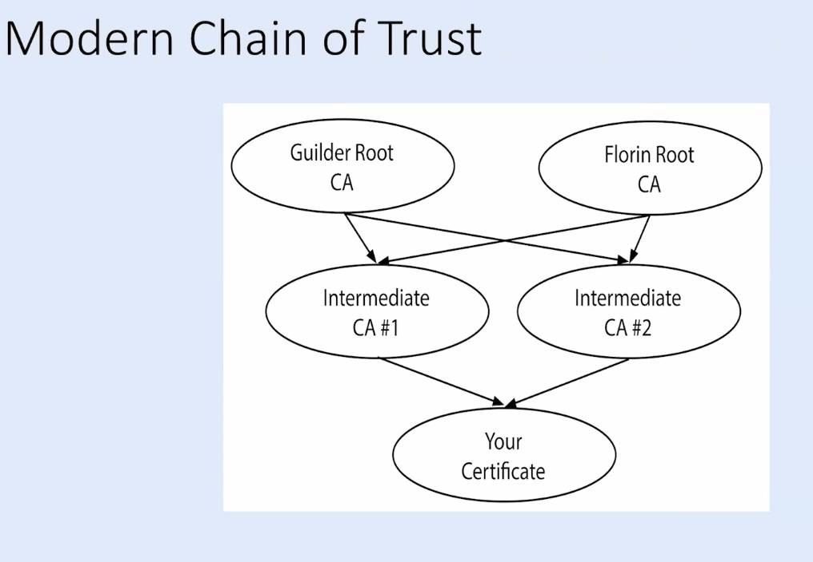

# SSL/TLS 
*Encryption and Authentication*
### Encryption
- to access a protected resource via PKI 
- Establishes a secured encrypted tunnel before communication begins
- 256 bit encryption

### Authentication 
- to authenticate owner of the SSL cert

## CA certificates and the  Chain of trust

# IP whitelisting
before understanding IP whitelisting, checkout what a firewall means
## Firewall
Firewalls work by defining rules that govern which traffic is allowed, and which is blocked. 

`iptables` in linux is used to define the firewall.  `iptables` identifies the packets received and then uses a set of rules to decide what to do with them.

**When a packet is received, iptables finds the appropriate table, then runs it through the chain of rules until it finds a match.**

- **Table**: A table consists of several **chains**.
- **Chain**: A chain is a string of **rules**. 
- **Rule**: A rule is a statement that tells what to do with the packet, i.e decision, a.k.a &mdash; **target**.
- **Target**: A target is a decision of what to do with a packet. Accept it , drop it, or reject it (which sends an error back to the sender).

#### todo....explain more on firewall

## How to check firewall on remote machine
you can use netcat, nmap, telnet or even curl. 

- if you get timeout, port is not open
- if you get "Connection refused", port is open but process is not listening
- if you get timeout, port is not open
- if you get timeout, port is not open

# Question
1. root ca, intermediate ca , your ca
