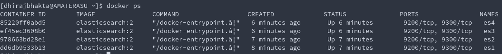
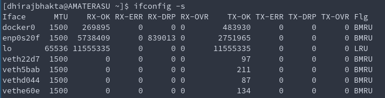
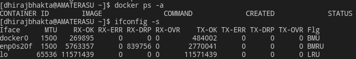
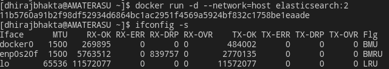
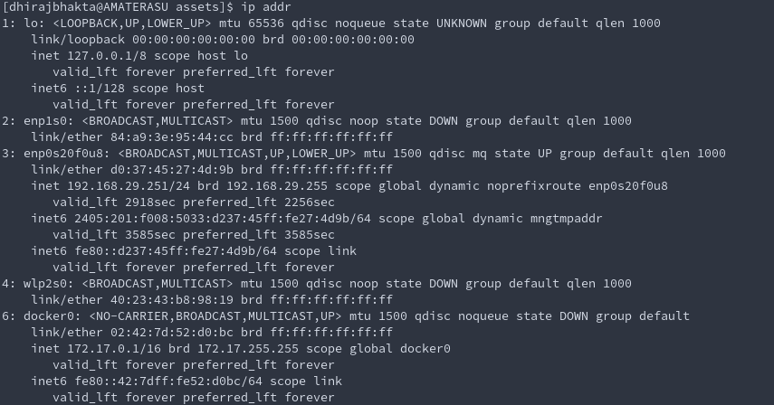
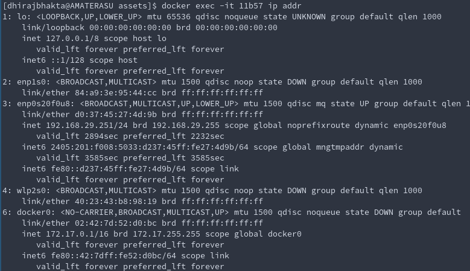

# Docker Networking & Service Discovery [ Book Summary ]
--> _Michael Hausenblas_ [link](https://www.immagic.com/eLibrary/ARCHIVES/EBOOKS/O160202H.pdf)
- Service Discovery and Orchestration are 2 sides of the same coin
- Without proper understanding of n/w aspect of docker , you will get f**ked

## Pets vs Cattle meme

Pets = Scale up;
Cattle = Scale out
- the cattle approach allows you to get a decent night’s sleep, as you’re no longer paged at 3 a.m. just to replace a broken HDD or to relaunch a hanging app on a different server, as you would have done with your
pets.

## Service Discovery Stack

### Low Level Networking Layer 
- networking gear
- iptables
- routing 
- IPVLAN
- Linux Namespaces
### Docker networking Layer
Encapsulates the low level networking layer and provides abstractions like 
- single-host bridge networking mode
- multi-host IP per container mode
### Service Discovery/Container Orchestration layer
About how the container scheduler decides where to place the container using the primitives provided by the lower layers

## Docker networking 101
### Simplified Docker architecture(Single Host)

- A Docker container needs a `Host` to run on 
    - host can be a <u>phyical machine</u> like your bare metal server in my on-premise datacenter
    - host can be a <u>VM</u> either in on-prem or Cloud

- The host has a Docker Daemon & a Docker Client running 
    - To interact with docker registry (pull/push images)
    - To start, stop, inspect containers

- The Relationshiip between host to containers is 1:N
    - Eg: Facebook-- 40 containers per host
    - Eg: Mesosphere-- 250 containers per host

- It doesn't matter if you are doing a single host / multi host container deployment. You just cant get away without understanding networking

## Single Host Networking
4 modes available 
- Bridge mode
- Host mode
- Container mode
- No networking 

### Bridge Mode
In this mode , the Docker daemon creates `docker0`, a
virtual Ethernet bridge that automatically forwards packets between
any other network interfaces that are attached to it. 

By default, the daemon then connects all containers on a host to this internal network through **creating a pair of peer interfaces**,<u> assigning one of the
peers to become the container’s eth0 interface and other peer in the
namespace of the host</u>, as well as assigning an IP address/subnet
from the private IP range to the bridge.

Verified after creating 4 elasticsearch containers,
 
And 4 new interfaces were added to the host.

This has a useful inference:  
-> without the '-p' option to publish the port to the host, the containers would never be visible to the outside world BUT would be visible to all other containers connected to the same bridge (except for the retarded `docker0` default bridge)

### Host Mode
Disables the Network Isolation of a docker container.
- Container now shares the networking namespace of the host, and is directly exposed to the public network!

Before Creating any containers:

After Creating one container in host networking mode:

Observe that no new interfaces were added to host

Infact, running `ip addr` inside the container gives the same output as running it on the host , Proving that they share the NIC

What more! Observe that both the container and the host have the same IP (192.168.29.251)

- In Host mode networking , the container inherits the NIC ( and effectively the IP) from its host
- Faster than bridge mode because there is no routing overhead 
    - In bridge, the container uses the host as a NAT
- But now the container is exposed directly to the public network (security implications)

### Container Mode
- You ask a container to re-use the network stack (namespace) of another running container. The 2 containers will now share the same IP.
- `docker run -d --network=container:glorious_christa elasticsearch:2`

### No Networking Mode
- Container doesnt even get an IP address.
- Container gets its own network stack, but it wont be configured for communication outside the container
- Turns off networking

