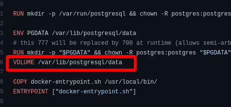
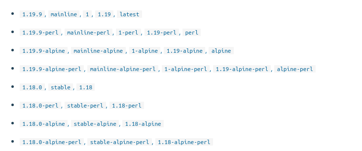

Containers &mdash; Once-in-a-decade huge shift!

- mainframe to PC;  90s
- baremetal to Virtual; 00s
- Datacenter to Cloud; 10's
- Host to Container (Serverless)
    - Serverless functions run on stateless containers in cloud.

# Why Docker?

Docker helps you build,test, deploy without caring about the platform

**Idea**: packaging an application together with all its dependencies, so you can run that app in the same way anywhere. That concept makes your applications portable between laptops, datacenters, and clouds, and it breaks down barriers between development and operations teams. 

- ## Handovers
    Handover to test, QA, next new developer etc boils down to just one readme file! ( with a Dockerfile/docker-compose.yml ofcourse). 
    - Normally Handovers take 2 weeks! New devs have to install specific versions of half a dozen tools. 
    Docker centralizes the toolchain and makes everything so much easier for everybody.
- ## Migrating Apps to the Cloud
    Normally you have 2 options, IaaS and PaaS.
    Use IaaS and run lots of inefficient VMs with high monthly costs, or use PaaS and get lower running costs but spend more time on the migration.
    
    Docker Provides the third option without the compromises... You migrate each part of your application to a container and then you can run the whole application in containers using Azure Kubernetes service or AWS ECS, or on your own Docker cluster in the datacenter. You now get the cost benefits of Paas and portability benefits of Iaas .
    
    Investment :=> to migrate to containers youll need to build your existing installation steps into scripts called Dockerfiles and your deployment documents  into descriptive application manifests using Docker-Compose/Docker-Swarm/Kubernetes/ECS format. 
    No application code change required.
- ## Modernizing Legacy Apps
    No Need to stop for a 18-month rewrite.(for containerization)

    Monoliths run just fine in containers. Start by moving the monolith to a single container. But you'll slowly need to start splitting up to take full advantage of microservices in containers.

    **Containers run in their own virtual network**. So they can communicate with each other without being exposed to the outside world


## Baby steps
`sudo usermod -aG docker $your_user"`
docker needs "root" permissions, because it uses cgroups and namespaces. So instead of using sudo, you can add yourself to the docker group.

`docker <command> <subcommand> args`

`docker version`
- verify that cli can talk to the server

`docker info`
- most config values of docker


* An Image is the binaries and libraries that make up your application
* A Container is the running instance of an Image
* You can have a lot of containers spun off the same image
* Docker's default image "registry" is Docker Hub

# Container Basics
`docker run --publish 80:80 nginx`
1. Docker downloaded image 'nginx' from Docker Hub
2. Started a new container from that image.
4. Routes the traffic from host port 80 to the container IP, port 80

- `docker ps` To Show Running containers
- `docker top` list running processes in given container

### Containers are NOT Mini-VMs
- Containers are just processes
    - A restricted process in host 
- Limited to what resources they can access
- Exit when the process stops

### What happens when we run `docker container run`
1. Look for that image locally in image cache.
2. Then looks in remote image repository(default to Docker Hub)
3. Downloads the latest version (:latest by default) and stores it in local image cache
4. Creates a new container based on that image and prepares to start
5. Gives it a virtual IP on a private n/w inside docker engine
6. Opens up port 80 on host and forwards to port 80 in container
7. Starts container by using the CMD in the image Dockerfile

### What is going on inside the container?
- `docker top`
    - List of all processes in one container
- `docker inspect`
    - Entire configuration of a container
- `docker stats`
    - Performance monitoring

### Getting a shell inside Container
_No need to SSH into it_

- `docker run -it`
    - start a container interactively
- `docker exec -it`
    - Run additional command in <u>existing contianer</u>


# Image Basics
## What Exactly is an image?
It is the Application binaries + dependencies + Metadata about the image + how to run the image
- It doesnt have the complete OS! There is no kernel, kernel modules/drivers nothing!
- The Host provides the kernel :) 
- It just has the binaries that the application needs
    - can be as small as one python file / executable
    - can be as huge as Ubuntu distro with apt, Apache, PHP, everything installed

## Image and its Layers
[Union File System](https://www.terriblecode.com/blog/how-docker-images-work-union-file-systems-for-dummies/)
- Images are made using the `Union File System` Concept
- `docker history <image name>`
    - Shows the layers of changes made in the image
    - History of image layers
    - Base layer + Dockerfile = Image

- `docker inspect <image name>`
    - Tells you all the metadata of the image
    - about what default env variables it takes
    - **about exposed ports**
    - about how it is run (CMD)

" A container is just a single read/write layer on top of image "

### Dockerfile
- Recipe for making image.
- its not a shell script.

```
Package managers like apt, yum are one of the reasons to build containers FROM Debian, Ubuntu, Fedora or CentOS
```

`FROM` : base layer
- All images must have a FROM
- usually from a minimal Linux distribution like debian or (even better)Linux
- If you truly want to start from scratch, use FROM scratch


`ENV` : Environemnt Variables
- main way to set key:value to build and run containers
- order matters (because layers, top down)

`RUN` : Shell command 
- Commands to run inside the container at build time
- Install something
- shell scripts
- the `&&` in a single RUN command is to keep them all in same layer. saves time. saves space
```
 RUN apk update 
    && apk add socat 
    && rm -r /var/cache/
```

`WORKDIR` : same as `RUN cd /some/path`
- Change current working directory

`COPY` : copy your source code from local machine into container

`EXPOSE` : 
Informs Docker that the container listens on the specified network ports at runtime.
- EXPOSE doesnt  `publish` the port. It functions as a type of documentations between the person who builds the image and the person who runs the container, about which ports are intended to be published. 
- Its just a damn hint! it doesnt do anything!, it just adds a metadata in `docker inspect` output regarding "ExposedPorts"
- You can just use -p to publish at runtime and be happy. 
- _All published ports are exposed, but not all exposed ports are published_

`VOLUME`: this is how you "outlive" the container
- creates a mount point with the specified name and marks it as "holding externally mounted
volumes from native host or other containers"
- eg: `VOLUME /myvol`
- In Dockerfile you can specify only the destination of a volume INSIDE the container , i.e /myvol is inside the container, not host.
    - Kinda makes sense!, the Image Author should not specify host mount points.
    - while running the container, you can specify the name of the mount point in host 
    `docker run --volume myvolume:/myvol`. This will resolve to `var/lib/docker/volumes/myvolume` in the host
    - If you do not specify the volume argument, the mount point in the host will be chosen automatically, usually under `var/lib/docker/volumes/<some SHA value >`
- All database container images have a VOLUME command
- eg:postgres official image Dockerfile 


`CMD`: command for the container to run
- will be run everytime you spawn a contianer from an image
- will be run everytime you `restart` a stopped container.
- If you dont specify the `CMD`, it will inherit the `CMD` of the base image used in `FROM`

Each command in Dockerfile creates a new layer. Each layer contains the filesystem changes of the image between the state before the execution of the command and the state after the execution of the command.
Since Docker CACHES every single layer during build, and uses them in subsequent builds,
_you should keep the instructions that change the most at the bottom of the dockerfile_


## Building images from Dockerfile
- `docker build -t <image name> .`


## Tags

_every line is essentially the same image (multiple alias tags for same image)_


# Docker Networking
- `docker port <CONTAINER>` List all the exposed port

- Each container is connected to a private virtual n/w "bridge". 
- Each virtual n/w routes through NAT firewall on host IP
- All containers on a virtual network can talk to each other without -p !!!
- Best Practice is to create a new virtual n/w for each app
    - network "my_web_app" for mysql and php/apache containers
    - network "my_api" for mongo and nodejs containers

- Docker does NOT use the same IP as the host
    - `docker inspect --format '{{ .NetworkSettings.IPAddress}} <CONTAINERNAME>`

- `docker network inspect`
- `docker network create --driver`

-`docker network ls`
    - All n/ws that were created
    - bridge, host, none - these 3 would be there
    - bridge is default virttual n/w
    - host helps you skip virtual n/w and attach to the host's n/w

- `docker network connect` Add a NIC to a running container
- `docker network disconnect` Remove a NIC from a running container

## DNS &mdash; Inter-container communication
-> DNS | Naming is crucial for service discovery<br>
-> Docker uses container names  to locate them
--> Container Name becomes the hostname of the container
-- -- -->CONTAINERS CAN TALK TO EACH OTHER VIA COMMON BRIDGE NETWORK WITHOUT '-p' OPTION!

```
NOTE!
The default bridge network(Docker0) does not have this DNS. Hence you need to use 
--link option to manually link all the containers that need to communicate.

docker-compose actually CREATES a new network, so it doesnt have this problem 
```

Try this out; give the same network alias to two elasticsearch containers and connect them to the same bridge network(manually created; because default bridge docker0 is a retard)
```
$ docker network create my-network
$ docker run -d --network my-network --network-alias search elasticsearch 
$ docker run -d --network my-network --network-alias search elasticsearch 
$ docker run -rm -it centos curl search:9200
$ docker run -rm -it centos curl search:9200
$ docker run -rm -it centos curl search:9200
$ docker run -rm -it centos curl search:9200
$ docker run -rm -it centos curl search:9200
$ docker run -rm -it centos curl search:9200
$ docker run -rm -it centos curl search:9200
```


### Bridge, None and Host networks


# Docker Volumes

## Container Lifetime & Persistent Data
- Containers are immutable and ephemeral
- "immutable infrastructure": re-deploy containers; containers never change;
- unchanging, temporary, disposable

Why ? :=> Separation of concerns 
 - The application in docker shouldnt be concerned about persistence

### What about persistence, DB , key value stores? 
How to "outlive" the container?
1. Volumes  
2. Bind Mounts

Volumes
- Special location outside of container UFS(Union File System)
- `docker volume inspect`
- volumes can be shared and re-used among containers
- volumes persist even after container is stopped.
- volumes persist even after container is deleted.
- volumes need manual deletion.
- You can name a volume using --volume or -v during `docker run`.
    - `docker run -v /var/lib/mysql` does the same job as `VOLUME /var/lib/mysql` in Dockerfile. I.e It creates a volume
    - `docker run -v mysql-db:/var/lib/mysql` creates a named volume

- Lets say you have to upgrade your postgres, but keep your data.
    ```
    $ docker run -d --name psql1 -v psql-volume:/var/lib/postgresql/data postgres:9.6.1

    //Now check the logs of psql1 container. pretty huge ?

    $ docker ps -q | xargs docker rm -f

    $ docker run -d --name psql2 -v psql-volume:/var/lib/postgresql/data postgres:9.6.2

    // now check the logs of psql2 container. Logs are smaller. This is because it is using the old data volume
    ```

Bind Mounts
 
 _**very useful for local development**_
- Maps a host file or dir to a container file or dif
- Basically just two locations pointing to the same file(s)
- Skips UFS, and host files overwrite any in container
- Cant use in Dockerfile, must be at runtime during `docker container run`
- ...` run -v /home/dhirajbhakta/mount:/var/lib ` a forward slash in the v argument makes it a bind mount 
- a Bind mount doesnt need volume to work

 _**Trust me! this will change the way you work**_
 ```
 docker run -d -p 80:80 -v $(pwd):/usr/share/nginx/html nginx
 ```


# Docker Compose
 1. Configures relationships b/w containers
 2. Saves our `docker container run..` settings in an easy-to-read file.
 3. Creates one liner developer environment startups!

 **docker-compose is not meant to be run in PROD**
 -> Ideal for local development and test

 **core**: All docker-compose does is talk to the docker daemon <u>via its APIs</u> instead of us using the docker client (CLI)

 `docker-compose.yml`
 - This YAML file describes our dev environment as a config
    - conatiners ..and their env
    - networks
    - volumes

 - `services` section:
    - ```
        servicename:
            image:
            command:
            environment:
            volumes:

        servicename2:
            ...
    ```
    servicename is a friendly name of the container, it will also become the DNS name which will be used in a docker network (similar to --name previously)

    Basically all you do in `docker run` command you can do here. (replacing a shell script which automates the docker run command)

    `environment` is the -e analogue of docker run

    Also docker-compose understands that '.' is pwd. No need to $(pwd) while mapping bind mounts!
 - `volumes` section:
 - `networks` section:

 ### docker-compose and the bridge network
 docker-compose automatically creates a new bridge network and attaches the given containers to that network so that theyre able to communicate with each other

 ### `docker-compose up`
 Set up volumes/networks and start all containers

 ### `docker-compose down`
 Stop all containers and cleanup

 ### docker-compose can build your (custom)images, and cache it
  Compose can build your images at runtime
  - Builds the image with `docker-compose up` if not found in cache
  - Great for complex builds that have lots and logs of vars or build-args

  ```
  When your `docker run ` command is toooo big with env vars and shit, use docker-compose
  ```

  instead of just providing the `image` attr, we specify the `build` attribute with the `dockerfile` and then provide an `image` attr to build the custom image
  - when both `build` and `image` attrs are present the semantics/purpose changes. It becomes " i want to build a custom image using this dockerfile "


 **If all your projects had a Dockerfile and docker-compose.yml then new dev onboarding would be**
  - `git clone XYZ`
  - `docker-compose up`


    

# Orchestration
New problems with growing number of containers (microservices).
- how to we deploy/maintain hundreds or thousands of containers across one or dozens of instances?
- How do we automate container lifecycle?
- how can we easily scale out/in/up/down?
- How can we ensure our containers are re-created if they fail?
- How can we replace containers without downtime (blue/green deployment)?
- How can we control/track where containers get started?
- How can we create cross-node virtual networks?
- How can we ensure only trusted servers run our containers?
- How can we store secrets, keys, passwords and get them to the right container (and only that container)?

_The goal of the orchestrator is to match desired=actual_
. More on this later...

## Understand RAFT protocol 
RAFT = how to ensure consistency in a distributed environment

"Distributed Consensus"
[The Paper](https://raft.github.io/raft.pdf)<br>
[Basics](https://raft.github.io/)<br>
[WOW](http://thesecretlivesofdata.com/raft/)

# Orchestraction -- Docker Swarm
## What is a swarm?
Swarm = Multiple docker HOSTS which run in *swarm mode* and act as `managers` and `workers`.

A given docker HOST can act as manager, worker or both

### node?
-- node is an instance of the Docker Engine participating  in the swarm.

One Host = One IP = One node... One Docker Engine

You can run multiple nodes distributed across multiple physical/cloud servers.

A Node can be a `manager node` or `worker node`
### manager?
-- manages membership and delegation
### worker?
-- runs swarm `services`

### service?
-- When you create a service, you define its "optimal state" (number of replicas etc). Docker works to maintain that desired state. If a worker node becomes unavailable, Docker schedules that node's `tasks` on other nodes. 

### task?
-- A task is a running container which is part of a swarm service and managed by a swarm manager
 
 docker swarm commands are not enabled by default in docker CLI
 - `docker swarm`
 - `docker node`
 - `docker service`
 - `docker stack`
 - `docker secret`

 Run `docker swarm init` to enable swarm mode ---> Creates a single node swarm!

 ```
 Note that docker swarm does not use the traditional docker APIs to orchestrate. Instead it has its own Swarm APIs for all this distributed mumbo jumbo
 ```

 ## Manager and Worker nodes
 
 - Manager nodes have an internal distributed state store `Raft store`
 - "_Manager is a Worker with permissions to control the swarm_"
 - Workers are constantly reporting to the Managers and asking for new work. lol
 - Managers also evaluate if what a worker is told to do and what its actually doing matches or not


 
 ## What is a service?
 - `Service` is an _image_ of a microservice.
 - When you create a  service, you specify which container image to use and which commands to execute inside the containers;
    - you also specify the number of `replicas`

 

 When you deploy the service to the swarm, the `swarm manager` accepts your service definition as the <u>Desired State</u> for the service. Then it schedules the service on nodes in the swarm as one or more replica `tasks`. The tasks run independently of each other on nodes in the swarm

 ###  What is a task?
 Task is the atomic unit of scheduling in the swarm. Each taks is a "slot" the scheduler fills by spawning a container.
 ```
 You declare a desired service state by
  - creating a service
  - updating a service

The orchestrator realizes the desired state by scheduling tasks.

If any container crashes/fails health check, the orchestator creates a new replica task that spawns a new container.
 ```
 - one task = one container
 - `task` is a "slot" where the scheduler places a container.
 - If the container fails health checks/terminates, then the task terminates

### Create a service <DEMO> (single node swarm)
- `docker service create alpine ping 8.8.8.8`
- `docker service ls`
- `docker service ps <service name>`
- `docker service update <service name> --replicas 3`
- `docker service ps <service name>`
- Now you can find the docker containers using `docker ps` and forcibly kill some containers
- `docker service ps <service name>`

### Create a multi node swarm 
Not possible to automate this 


 ## `docker swarm init`
 - Lots of PKI and security automation
    - Root Signing Cert created for our Swarm
    - Cert issued for first Manager node
    - Join tokens created

 -  RAFT database created to store root CA, configs and secrets
    - Encrypted by default on disk
    - No need for another key/value system/db to host orchestration/secrets
    - Replicates logs among Managers via mutual TLS in "control plane"

### `docker node ls`

 ## `docker node ls`
 ## `docker node ls`
 ## `docker node ls`


# Orchestraction -- Kubernetes 

# Swarm v/s K8s

# Dockerfile reviews 

# Cleaning up

### `docker system df` -- occupancy stats

### `docker system prune` 
    - docker image prune
    - docker container prune


# --MyQuestions--
1. What exactly is a container
2. What exactly is a image
3. How networking works in docker
4. How much memory/CPU/hdd does a container take by default? can this be tuned?
5. containerd & runc?
6. namespaces & cgroups?
7. ARG values vs ENV values ? confused about envs everywhere!
7. Deeper understanding of what is meant by a `port`?
    - Open port/Closed port
    - TCP Port/UDP Port
    - Firewall?
    - NAT?
    - DNS records?
    - DNS round robin (Poor man's load balancer)
    - subnets and masks
    - iptables
8. xargs command, master it

