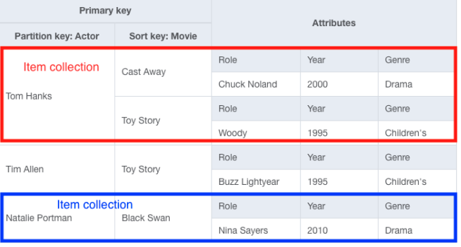
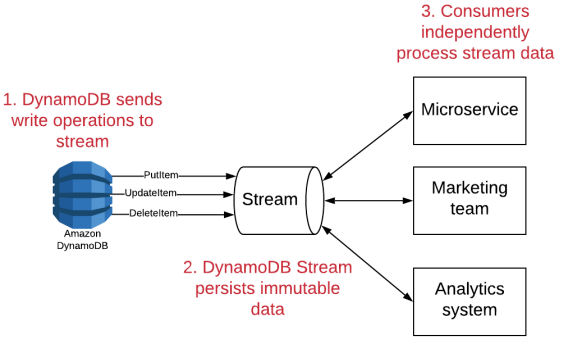
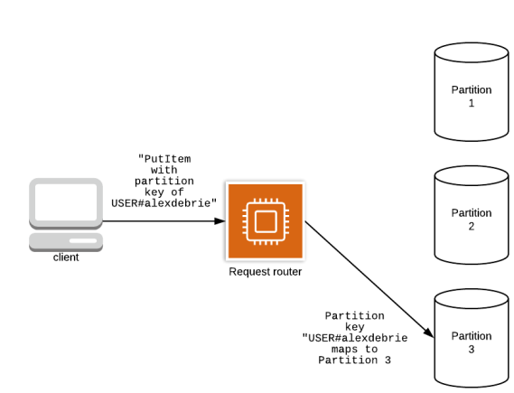
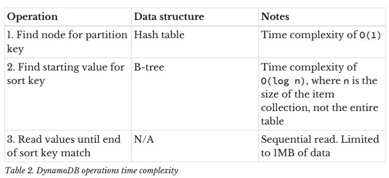
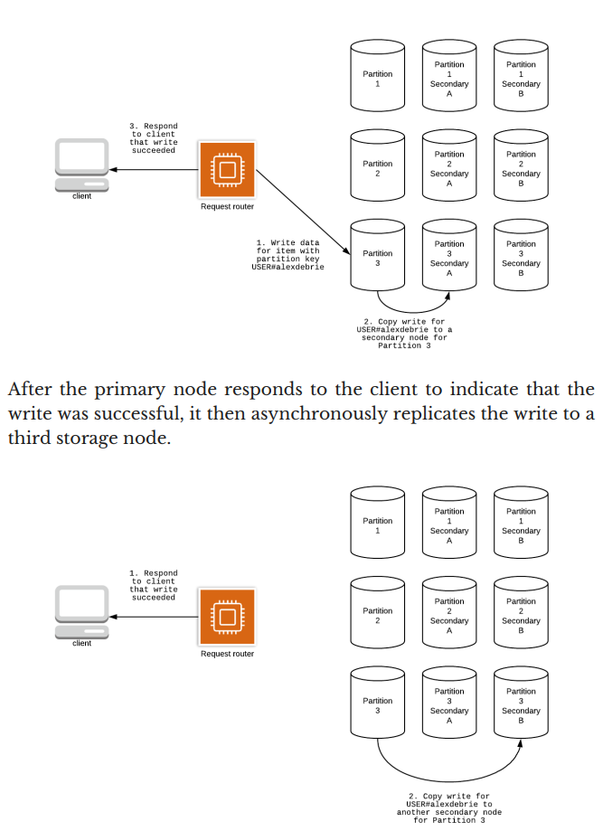

# Introduction

🏷  Modelling withNoSQL is very very different from RDBMS modeling.

- **Put all your data into a SINGLE TABLE**
- DynamoDB is a key-value storage OR, a wide-column storage
- Infinite scaling with no performance degradation (unlike RDBMS)
- No connection pool at all, since its HTTP based ( does not use persistent TCP connections )
- You can abuse DynamoDB Streams for event-based applications

**When to use [DynamoDB](https://www.allthingsdistributed.com/2012/01/amazon-dynamodb.html)**?
- Hyperscale applications
- Hyper Ephemeral applications
	- Server=Lambda,serverless
	- Lambda's are meant to spin up fast, => means no time to setup DB connection pools. RDBMS work poorly here; DynamoDB shines (No connection pools)
	- No need to network partition and "protect" your database; all handled via IAM
- Caching
	- DynamoDB can be used as a cache to store costly results from other DBs
	- Bit slower than Redis tho
- Apps with simple data model, no complex queries
	- mostly key-value lookups
tbh, DynamoDB is a not-so-bad default DB for all your applications

**Motivations for DynamoDB**
- As Amazon scaled, joins got too slow.
- 90% of queries did not use joins.
- Consistency is very costly, like joins. 90% apps dont need strong consistency
- "Joins" + "Stongly Consistent" => requires all data on single server instance.
	- Cant take advantage of horizontal scaling
	- 1 server(64CPU, 256GB RAM) >>> expensive >>> 16 Servers(4CPU, 16GB RAM)

### DynamoDB limits
- Single "Item"(row) is limited to 400KB of data
	- For reference; mongoDB=16MB, cassandra=2GB
	- this actually helps you move away from antipatterns
- Query and Scan size is limited to 1MB (pre-filter)
	- affects "fetch many" requests
	- stick to paginating if it exceeds 1 MB
- a Partition(node) can have max 3000 Read Capacity Units
	- you cannot do more than 3000 reads per second for a given partition key
- a Partition(node) can have max 1000 Write Capacity Units
	- you cannot do more than 1000 writes per second for a given partition key
- A local secondary index cannot have an item collection larger than 10GB
	- Your writes will suddenly get rejected if you run out of partition space
	- does not apply for global secondary index
		- if it exceeds 10GB, they will be automatically split across partitions.


### RDBMS mindset
**Storage is costly, CPU time is not - 1980s**

- A normalized relational data + ad hoc query engine reduced the storage cost.
- Dedupe data **at rest** 
- Enable applications to reconstruct formatted **views** of data **on demand**.
- Time Complexities of queries ⬆️ HIGH. storage costs ⬇️ LOW

### NoSQL mindset
**Storage costs dropped - 2010s**

- Denormalized, ONE table
- Eliminate the need for complex joins  ✖
- With RDBMS, you design your tables based on the objects...without thinking about how they will be queried
- With NoSQL, you HAVE to know the queries first before you model

### DynamoDB vs. MongoDB
- This is columnar(wide-column k-v) DB vs documentDB. Tho both are noSQL
- MongoDB, being a documentDB, gives you a lot of indexing options...which will hurt at scale.
- **Mongo document size: 16MB, dynamo record size: 400KB**
- Mongo is more strongly consistent(?), dynamo is eventually consistent
- DynamoDB allows for rapid scaling up(and down), not sure if Mongo allows that..maybe you have to do that manually?
- Mongo has schema validation and stuf, not present in dynamo
- MongoDB equivalent of AWS is "AWS DocumentDB"

### DynamoDB vs. Cassandra
- Both are Columnar databases.
- Cassandra: no vendor lock-in
- AWS provides managed cassandra too......hmm


# Terminologies
- Key-value storage
	- eg: Redis
- Wide-column storage
	- or simply, "Columnar database",
	- eg: Cassandra, HBase, BigTable, DynamoDB, Google Cloud BigTable
	- //TODO:Read Bigtable paper
	- in RDBMS, all rows have same #columns, and rows can be bunched together during horizontal sharding.
	- in Column db, every row can have differing #columns, and **each column is stored separately**...vertically sharded by definition
	- By definition, a sparse matrix, think sql tables with too many "null"s
	- Benefits?
		- _Get aggregated data from a single column over millions of rows_
		- automatic vertical sharding
	- Confusions?
		- Often confused with **Document DB** like MongoDB
		- Only similarity being, documents in documentDB are schemaless too.
- Document storage
	- eg:MongoDB, AWS DocumentDB, Google Firestore
	- key < -- > Complex Data(document)
	- Documents are schemaless 
- Connection Pool
- DynamoDB Streams
	- fits into event-based architecture
---
**DynamoDB Terminologies**
- Read Capacity Units
- Write Capacity Units
- DynamoDB "Tables"
	- grouping of records
	- same as SQL tables?:No
		- in SQL, Customers, Orders, Inventory etc would be separate tables
		- in DynamoDB, **theyre all in the same table**, to avoid joins
		- In SQL, you have a "schema" for the record, table enforces the shape of the data being inserted.
		- In DynamoDB, there is no schema, table wont ensure jack. App has the responsibility of maintaining the "schema" of records.
- DynamoDB "Items"
	- Single record in table
	- Same as SQL rows?: yes
	-🗒 Not: You can set TTL to each item, after which it will be deleted.
- DynamoDB "Attributes"
	- Same as SQL columns?: yes and no
		- not compulsory on every Item(row)
- DynamoDB "Primary Keys" (Partition Key | Sort Key)
	- Can be simple or composite.
		- Simple PK = "**partition Key**"
			- _for "fetch ONE" access pattern_
		- Composite PK = "**partition Key**" and a "**sort key*"" 
			- _for "fetch MANY" access pattern_
		- **Why is it called "PartitionKey"** though?**
			- A column DB shards data across nodes (one column in each node kinda)
			- But, all items(rows) with same PartitionKey will be kept on same node.
	- **New rows with existing PK will OVERWRITE the existing row**, unless explicitly stated not to
	- **Primary Key Overloading**
		- This is how you put multiple entities in a single table
		- PK would look like "ORG#1111", "USR#0101", etc...orgs, users all in same table
- DynamoDB "Secondary Indexes"
	- You need to specify Partition key and sort key for secondary indexes too.
	- 2 kinds of Secondary index
		- Local
			- partition key same as PK, sort key is different
			- option to have **strong consistency**
		- Global (used often)
			- any partition key, any sort key
			- only **eventual consistency**
- DynamoDB "Item Collections"
	- **Group of Items** that share the same PartitionKey
	- Typical "Collection" like Arrays, Map
	- 
- DynamoDB "Streams"
	- [event-driven architecture](https://aws.amazon.com/event-driven-architecture/)
	- Whenever an item(row) is written, udpated, deleted...an even will be written to DynamoDB Stream 
		- Event an be processed by Lambda or other compute
	- 

# Partitions in DynamoDB
How does sharding data across multiples nodes happen?

Partition(Node) Size = 10GB
```
request with PartitionKey -->  hashFunction(PartitionKey) ---> target node to store record into / read record from
```
Each "**Item Collection**" will be in a particular partition, this enables fast queries


Each item collection is stored as a **B-Tree**O(log n) , like a dictionary
- ✔️ begins-with() queries
- ✔️ between() queries
	- ✔️ "Find words between Apple and Orange"
- ✖ ends-with() queries
	- ✖ "find words ending with -ing"

```
Total time to GET an item = O(1) + O(log n)
						 = find the partition + search the btree
```
Very good performance considering n is small (capped at 10GB).

**_DynamoDB enforces efficiency_**



# Replication in DynamoDB
 3 replicas - 1 primary; 2 secondary

- Handles failure of one node; data loss
- Replicas are essentially read replicas; help reduce read pressure on primary
	- this is why its **eventually consistent**
	- reading from secondary nodes might actually return stale data. Bcos data is **asynchronously replicated** to secondary replicas


# DynamoDB API
- ### Item-based actions
	- _Single item_
	- [ GetItem, PutItem, UpdateItem, DeleteItem ]
	- ONLY way to update items.
		-✖ You cant "Update attr X for all items with PK Y" 
		-You must specify the exact PK for the items you want to update
	- **Batch API** vs **Transactional API**
		- batchAPI: reads or writes can fail/succeed independently. Failure of one write wont affect other writes in the batch
		- transactionalAPI: all reads/writes succeed or fail together. _"Rollback"_.
	- Rules
		- Full PK must be specified
	
- ### Queries
	- _item collections_
	- GET multiple items with same PK
		- 🛈 all items with same PartitionKey lie in the same (ItemCollection)Partition
	- useful for
		- one to many relationships
		- many to many relationships
- ### Scans
	- _whole table_
	- paginated
	- **use this sparingly**


# _References_
- Read [BigTable Paper](https://static.googleusercontent.com/media/research.google.com/en//archive/bigtable-osdi06.pdf)
- Read [Dynamo Paper](https://www.allthingsdistributed.com/2012/01/amazon-dynamodb.html)
	- Follow up [Blog Post](https://www.allthingsdistributed.com/2012/01/amazon-dynamodb.html)


