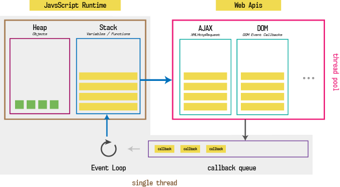

# JS is Synchronous
- Its single Threaded
- Host environments like browser engines augment JS with a number of WebAPI
		- for interacting with external systems
		- for dealing with I/o bound operations

# Asynchronicity
 - timeouts
 - events
 - Promise


# Error Handling

### Error v/s Exception
An `Error` becomes an `Exception` only when its thrown.

You can throw anything, not just Error objects. But DONT do it. Just stick to throwing proper errors.

### The Error Object - Parent class
Error is an `object` having 3 attrs
- message <string>
- name <string> : this is the error type
- stack : the stack trace

### Custom Error

```js
Class CustomError extends Error{
	constructor(foo='bar', ...params){
		super(params);
   		if(Error.captureStackTrace)
			Error.captureStackTrace(this, CustomError)
		this.name = 'CustomError'
		this.message = 'Construct some descriptive message here'
		this.foo = foo
		this.date = new Date()
	} 
}
```

## What happens when you "throw"?
Once you throw, it bubbles up until its caught somewhere.

If not caught ANYWHERE, program crashes.

You miight want to do this, i.e not handle the exception so that 
the program crashes and doesnt show invalid data

## Sync error handling
```js
try{
...
}catch(err){
...
}
```

**Try/Catch is synchronous**

good to send stuff to logger inside catch

## Async error handling
This does not work
```js
	function failAfterOneSecond() {
		setTimeout(() => {
			throw Error("Something went wrong!");
			}, 1000);
	}

	try {
		failAfterOneSecond();
	} catch (error) {
		console.error(error.message);
	}

```

### Promise.reject
By the time the callback passed to setTimeout runs, our try/catch is long gone.

As a best practice when rejecting a Promise it's convenient to provide an error object:
By doing so you keep error handling consistent through the codebase. Other team members can always expect to access error.message, and more important you can inspect stack traces.
```js
Promise.reject(TypeError("Wrong type given, expected a string"));
```

### throwing esception

```js
	Promise.resolve("A string").then(value => {
		if (typeof value === "string") {
			throw TypeError("Expected a number!");
		}
	});

	// The chain HAS to have a catch somewhere
```

## Events

### Synthetic events

## DOM

### Shadow DOM
#### "Piercing" Shadow DOM?


 

# UnderTheHood &mdash; Javascript
...initial days...

JavaScript was not designed by considering the performance in mind. _It had to just work inside a browser and provide API to work with DOM_ . But since many browsers tried to adopt it in their own way, it had to be standardized. (ECMA does this job)

- **Ecmascript specification** tells how javascript should be implemented by the browser
- Each browser creates a **javascript engine** which runs JS code.
	- netscape used spidermonkey engine
	- chrome uses v8 engine
	- firefox uses spidermonkey engine


v The complete browser



### Single threaded
AT RUNTIME, JS is single threaded.

# Questions
- what are all the moving parts in the browser
- JS APIs vs browser APIs. 
- why isnt heap and stack part of the JS engine(v8)?
- difference between node envt and browser envt
- what does it mean to be cross-browser
	- heck, why are browsers even different?


	
