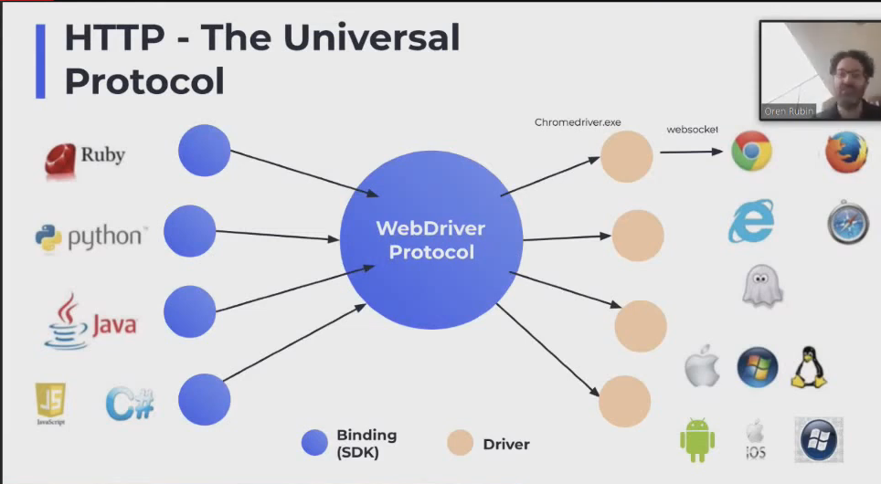

# Test tool types
Test tools can be categorized based on the _functionality_ they offer. Some go ahead and try to offer more than one functionality (eg: jest)


### Test Runners / Test Launchers
Run your tests on the required environments configured by you...( what browsers to run in, what babel version to use, how to format the output etc)

Eg: Karma

### Assertion Libraries
Libraries that exposes a clean API that help you assert (lol!) 

`expect(XYZ).to.be(ABC)`

### Libraries that give you good way to structure your tests
Like cucumber...which helps you arrange your tests in BDD style, just one way of _structuring_ your tests.

<hr/>

All in all, to start testing you need to choose a **testing structure** (BDD?), choose the **style of assertion functions** you like, and decide how do you want to **run the tests**.

Mocha+chai+sinon is a popular combo.

Some provide everything out of the box. Jest, Jasmine, TestCafe, Cypress, Playwright.

<hr/>

As you move closer to the other end of the testing spectrum (e2e), the "**test runners**" will have to create a browser-like environment for you to automate behaviors like scrolling, clicking, access to DOM(obviously), waiting for button to be visible,painted and clickable..etc

How is it done?
1. By simulating a browser-like environment in pure JS (see jsdom, testcafe)
2. By using the **webdriver API**
    ( a language agnostic, REST based API to remotely control browsers )

`Your code on Node.js <> WebDriver <> FF/Chrome/Safari Driver <> Browser`

3. By using the APIs exposed by the browser maintainers, that let you control the browsers directly. Eg: Puppeteer.

`Your code on Node.js <> Browser's API`

# Testing terms
## Snapshot Testing
Take a snapshot of current state ( may have its own internal representation of its 'snapshot' of the DOM ) and warn the user when any change causes the current snapshot to differ even slightly from the new snapshot.

## Webdriver
- This [standard]() is inspired from the Selenium Webdriver project.
- every browser has a "driver" which understands this protocol
    eg: Chromedriver, 
    ```http
    POST /session
    POST /session/<sessionId>/element/<elementId>/click
    ```
- the webdriver is sort of a HTTP server which will then dispatch browser events in response to these REST calls
- write in any language, and communicate with the browser (in the end its just REST API afterall)



# Why so many e2e testing frameworks?
https://youtu.be/emWHeODwcQY

https://www.youtube.com/watch?v=pK-l5P9l-3I

### Selenium

**Cross browser++** : 
Selenium is a **suite** of tools for cross browser frontend testing.

**Flexibility via REST APIs ++**:
Selenium also provides compatibility with different programming languages – C#, Java, JavaScript, Ruby, Python, PHP.

- Selenium IDE 
    - browser extension
    - Just a record/run tool
- Selenium RC 
    - "remote control"
- Selenium WebDriver
    - Selenium RC++
- Selenium Grid
    -Concurrent execution of tests on different OS, machines, browsers

CONS:
    - not yet bidirectional, as its a HTTP server. you can talk to the browser via the webdriver API, but browser cannot talk to you


### Cypress
Focus is on developer experience. Do very very less to get started.

Cypress is _less_ cross browser. It dispatches JS events, and not browser events. So they could only support Chrome until now(now FF recently).

- code looks less like JS and more like just chaining promises.


### Puppeteer
Started as an internal tool at Google.
Same philosophy as WebDriver

### Playwright
When Microsoft based their Edge off chromium, they probably forked puppeteer into Playwright

Biggest flex:
- crossbrowser ( moz, webkit, chrome)
- very well thought of API
- focussed on e2e testing ( waiting for elements to be ready, for example )
- Superfast compared to competitors, on par with Puppeteer.
- custom selector engines


# Cypress talk
- browser driver??


# Playwright
- Run each test scenario in a new **browser context** (for test isolation)

### Questions
- playwright execution context vs browser execution context?
> Playwright scripts run in your Playwright environment. Your page scripts run in the browser page environment. Those environments don't intersect, they are running in different virtual machines in different processes and even potentially on different computers.

What even??

## Closing notes on testing
- Create 2 streams of your tests, one for unit+integration(which is meant to run fast)...another for acceptance e2e testing(which runs much slower) 
- Focus more on getting the e2e testing skeleton up and running at the earliest.
- Unit test the utils, helpers, services ..and keep them "pure" and "functional". More they follow SRP and avoid side effects, easier they are to unit test.


# Resources
- https://medium.com/welldone-software/an-overview-of-javascript-testing-7ce7298b9870
