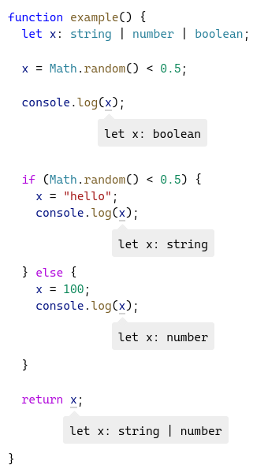
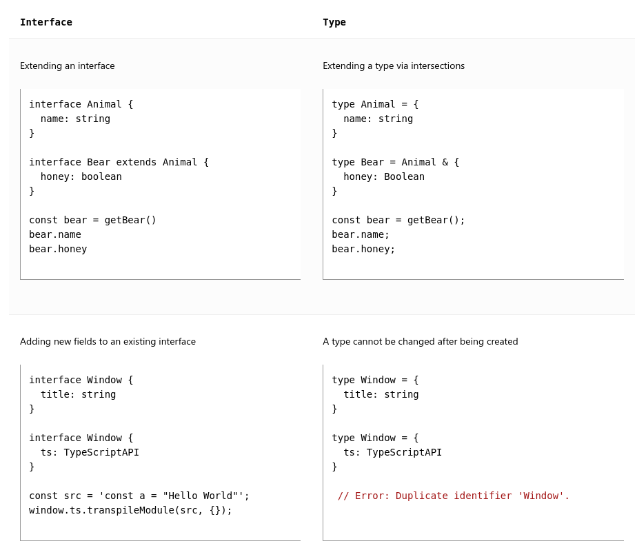

# Typescript

## Goal
To bring traditional OOP to Javascript.

JS at scale

Static type checker for JS

TS helps eliminate stress on memory &mdash; The answers to these questions such as `Does X have an attr called y ` or `is func actually callable` are usually things we keep in our heads when we write JavaScript, and we have to hope we got all the details right. Not to forget, naming things right was the maximum you could do in JS to aid you in this regard.

_Figure things at compile time, the ones that would be caught at run time_

Do you want to do this natively in JS?
How far will you go doing `if typeof(x) === function`?

## tsc, The Typescript Compiler
Run the type-checker
```ts
tsc hello.ts
```
This will also spit out a `hello.js` file. It **transpiled** it

## Datatypes
### Primitives
- string
- number
- boolean

Always use string, number, or boolean for types. Dont use the Boxed alternatives like String, Number

- Array (number[], string[])
- Function
- any

### Object Types
```ts
const obj:{a:string, b?:number} = {a:"lol"}
```

Something like this is not possible 
because JS  already has syntax like this.
```ts
function draw({ shape: Shape, xPos: number = 100 /*...*/ }) {
  render(shape);
/**
Typescript error:
""Cannot find name 'shape'. Did you mean 'Shape'?""
**/

  render(xPos);
Cannot find name 'xPos'.
}
```
Above example didnt work because it means something in JS = "grab the property `shape` and redefine it locally as a variable named `Shape`.

Similarly `xPos:number` creates a variable named `number` (rename `xPos` to `number`)

#### Index Signatures
_You dont know all the names of a type's properties, but you know the shape of the values_
```ts
interface StringArray {
  [index: number]: string;
}
const myArray: StringArray = getStringArray();
const secondItem = myArray[1];
```

const myArray: StringArray = getStringArray();
const secondItem = myArray[1];
### Union Types  ("_one of these types_")
Composing types to build new types.

Union = one of string | number | undefined.
```ts
function printId(id: number | string) {
  console.log("Your ID is: " + id);
}
```

Once you start using Unions, you'll have to deal with shit like this
```ts
function welcomePeople(x: string[] | string) {
  if (Array.isArray(x)) {
    // Here: 'x' is 'string[]'
    console.log("Hello, " + x.join(" and "));
  } else {
    // Here: 'x' is 'string'
    console.log("Welcome lone traveler " + x);
  }
}
```

### Function Type
How do declare a function type? 
two ways 
- type declarations which look just like arrow functions
- Call signatures

#### Declare functions inline
```ts
function greeter(fn: (a: string) => void) {
  fn("Hello, World");
}
```
#### use Type Aliases 
```ts
type GreetFunction = (a: string) => void;
function greeter(fn: GreetFunction) {
    fn("Hello, World")
}
```

### Call signatures
- to add properties to function type. Do more than you can using arrow function type function declarations
```ts
type DescribableFunction = {
  description: string;
  (someArg: number): boolean;
};
function doSomething(fn: DescribableFunction) {
  console.log(fn.description + " returned " + fn(6));
}
```


_Typescript can infer datatypes if you initialize variables._ No need to explicitly specify.

## Function Overloading
The signature of the implementation is not visible from the outside. When writing an overloaded function, you should always have two or more signatures above the implementation of the function.
```ts
// declar3 the function signatures before you overload them with implementations
function len(s: string): number;
function len(arr: any[]): number;
function len(s_arr: string | any[]): number;

/**
len implmentations here
**/

function makeDate(timestamp: number): Date;
function makeDate(m: number, d: number, y: number): Date;
function makeDate(mOrTimestamp: number, d?: number, y?: number): Date {
  if (d !== undefined && y !== undefined) {
    return new Date(y, mOrTimestamp, d);
  } else {
    return new Date(mOrTimestamp);
  }
}
/**
makeDate implementations here
**/

```

>  Always prefer parameters with union types instead of overloads when possible

## Generics
generics are all about relating two or more values with the same type

```ts
function firstElement<Type>(arr: Type[]): Type {
  return arr[0];
}

function map<Input, Output>(arr: Input[], func: (arg: Input) => Output): Output[] {
  return arr.map(func);
}

function combine<Type>(arr1: Type[], arr2: Type[]): Type[] {
  return arr1.concat(arr2);
}
```
### Place Constraints on Generics
```ts
function longest<Type extends { length: number }>(a: Type, b: Type) {
  if (a.length >= b.length) {
    return a;
  } else {
    return b;
  }
}
```
#### Guidelines for writing good generic functions
Generics can suck..especially for the consumers of the functions you write. Having too many type parameters or using constraints where they aren’t needed can make inference less successful, frustrating callers of your function.

##### Whenever possible, use the Type parameter itself without constraining it
```ts
function firstElement1<Type>(arr: Type[]) {
  return arr[0];
}

function firstElement2<Type extends any[]>(arr: Type) {
  return arr[0];
}

// a: number (good)
const a = firstElement1([1, 2, 3]);
// b: any (bad)
const b = firstElement2([1, 2, 3]);
```

##### Use few Type parameters
Use a generic param ONLY if it relates two values
```ts
function filter1<Type>(arr: Type[], func: (arg: Type) => boolean): Type[] {
  return arr.filter(func);
}
/**
Here func is a unnecessary type parameter, which doesnt relate two types

its adding no value!! 
its just making it hard to read and reason about.
Users have to manually give a extra type for no reason!
**/

function filter2<Type, Func extends (arg: Type) => boolean>(
  arr: Type[],
  func: Func
): Type[] {
  return arr.filter(func);
}
```

##### Type parameters should appear atleast twice
Think carefully if you even need generics
```ts
function greet<Str extends string>(s: Str) {
  console.log("Hello, " + s);
}

/**
wtf!??
**/

greet("world");
```


## Type Aliases
- a name for any type or Union or whatever
- they are **aliases** more than anything.

```ts
type NumberOrString = number | string
```

You can use intersection to combine two types

```ts
interface Colorful{
  color: string;
}
interface Circle{
  radius: number;
}
type ColorfulCircle = Colorful & Circle;
```
Intersection operator & is to type Aliases what `extend` operator is for Interfaces


## Interfaces
Same as types aliases.

But,
_Interfaces can be extended to add new properties, types cannot_

```ts
interface BasicAddress {
  name?: string;
  street: string;
  city: string;
  country: string;
  postalCode: string;
}

interface AddressWithUnit extends BasicAddress {
  unit: string;
}
```


## Type Assertions

Help the tsc compiler by providing types that YOU know about.
```ts
const myCanvas = document.getElementById("main_canvas") as HTMLCanvasElement;
//OR
const myCanvas = <HTMLCanvasElement>document.getElementById("main_canvas");
```

### Gotchas
1. **You cannot abuse type assertions to do impossible convertions like this**
```ts
const x = "hello" as number;

/**
Conversion of type 'string' to type 'number' may be a mistake 
because neither type sufficiently overlaps with the other. 
If this was intentional, convert the expression to 'unknown' first
**/
Workaround?
/** cast to any|unknown ..and then to desired type*/
const a = (expr as any) as T;
```


## Control Flow Analysis
TS does control flow analysis to even narrow down the type.

See how x narrows from 'string | number | boolean' to just 'string | number'



But sometimes you dont want that, and want to show that YOU are in power, not Typescript. Use **type predicates** to do this
```ts
function isFish(pet: Fish | Bird): pet is Fish {
  return (pet as Fish).swim !== undefined;
}
```

## Exhaustiveness Checking using `never`
`never` is a type assignable to any type. <u>BUT, no type is assignable to `never`.</u>

We will abuse this.

```ts
type Shape = Circle | Square;

function getArea(shape: Shape) {
  switch (shape.kind) {
    case "circle":
      return Math.PI * shape.radius ** 2;
    case "square":
      return shape.sideLength ** 2;
    default:
      const _exhaustiveCheck: never = shape;
      return _exhaustiveCheck;
  }
}
```
Now if you go and add `Triangle` to Shape,
the default case will throw Typescript Error saying `Triangle is not assignable to never`


## Other Topics of Interest
- Enums
- (!) Non-null Assertion Operator
- [Literal Inference](https://www.typescriptlang.org/docs/handbook/2/everyday-types.html#literal-inference)
- `readonly` modifier


# Confusions

## Interfaces vs Type Aliases
_Interfaces can be extended to add new properties, types can be extended using the intersection operator (&)_ 

_You can add new fields to existing Interfaces. Same cannot be done for types_

As a rule of thumb, always use interfaces.



## your "union" feels like "intersection" to me
> It might be confusing that a union of types appears to have the intersection of those types’ properties. This is not an accident - the name union comes from type theory. The union number | string is composed by taking the union of the values from each type. Notice that given two sets with corresponding facts about each set, only the intersection of those facts applies to the union of the sets themselves. For example, if we had a room of tall people wearing hats, and another room of Spanish speakers wearing hats, after combining those rooms, the only thing we know about every person is that they must be wearing a hat.


## Error: Operator '+' cannot be applied to types 'string | number' and 'number'.
Classic error. Basicaly forces you to write typeguards. Something you should have done in your JS days, but were just too lazy

```ts
function padLeft(padding: number | string, input: string) {
  if (typeof padding === "number") {
    return new Array(padding + 1).join(" ") + input;
  }
  return padding + input;
}
```
the process of refining types to more specific types than declared is called **narrowing**. Basically handling every single expected datatype for the given variable.

### How to narrow
- #### `typeof` typeguards 
- #### `instanceof` typeguards
- #### Truthiness narrowing
- #### Equality narrowing (== === !== !===)
- #### `in` operator narrowing

### Type Predicates 
**How to write user defined typeguards**

User defined type guards  =  a function whose return type is a type predicate
```ts
function isFish(pet: Fish | Bird): pet is Fish {
  return (pet as Fish).swim !== undefined;
}

/**
(pet is Fish) is a type predicate
Any time isFish is called with some variable, 
 Typescript will cast that variable to Fish if the return type is true
 conversely, will cast that variable to Bird is the return type is false

 **/
```


## Declaration War | type vs interface vs Class
No difference between `type` and `interface`
```ts
type One = { p: string };
interface Two {
  p: string;
}
class Three {
  p = "Hello";
}

let x: One = { p: "hi" };
let two: Two = x;
two = new Three();
```

## Type War | any vs unknown vs never vs void


# Snippets
```ts
function start(
  arg: string | string[] | (() => string) | { s: string }
): string {
  // this is super common in JavaScript
  if (typeof arg === "string") {
    return commonCase(arg);
  } else if (Array.isArray(arg)) {
    return arg.map(commonCase).join(",");
  } else if (typeof arg === "function") {
    return commonCase(arg());
  } else {
    return commonCase(arg.s);
  }

  function commonCase(s: string): string {
    return s;
  }
}
```


```ts

function isFish(pet: Fish | Bird): pet is Fish {
  return (pet as Fish).swim !== undefined;
}


const zoo: (Fish | Bird)[] = [getSmallPet(), getSmallPet(), getSmallPet()];
const underWater1: Fish[] = zoo.filter(isFish);
// or, equivalently
const underWater2: Fish[] = zoo.filter(isFish) as Fish[];

// The predicate may need repeating for more complex examples
const underWater3: Fish[] = zoo.filter((pet): pet is Fish => {
  if (pet.name === "sharkey") return false;
  return isFish(pet);
});
```