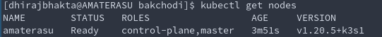

- Learn kubernetes in a month of lunches
- bret fisher course
- Github : Kubernetes the hard way

# Container Orchestrator
- You have many nodes
- You want to run your "service" on all those nodes
- Basically you want to run N replicas of one container on those nodes

#### Why would you need "Orchestration"?

Servers +  Change Rate = Benefits of Orchestration
- As Number of servers increase
- As Rate of code change increases

Benefit of orchestration becomes apparent.
Orchestration is meant to AUTOMATE pushing changes and monitoring that the app is running in a HEALTHY state

If you deploy it just once a month, orchestration might not be useful

#### ECS, Mesos, Cloudfoundry, Marathon, ...wtf??
These are cloud-specific  orchestrator offerings

####  Kubernetes and Swarm are _infrastructure agnostic_

#### Which Distribution of Kubernetes should I choose?
- You can choose a cloud distribution (AWS EKS, GKE)
- Self managed (Docker Enterprise, Rancher, Openshift, Canonical, VMWare PKS)
- ! Dont use the pure upstream Github Kubernetes!

#### whats all this minikube, microk8s, k3s
- This is for local development.
- Single node cluster
> The primary goal of minikube is to make it simple to run Kubernetes locally, for day-to-day development workflows and learning purposes.
- _Personally found k3s to be a better option for local development, playing around_
    - `curl -sfL https://get.k3s.io | sh -s - --docker --disable=traefik --write-kubeconfig-mode=644`

## Kubernetes vs Swarm
- Swarm :- EASY
- Kubernetes :- FEATURES & FLEXIBILITY

Cloud will deploy/manage Kubernetes for you. Also, Infrastructure vendors are making their own distributions of Kubernetes.

Independence and standardization are the main reasons Kubernetes is so popular. Once you have your apps running nicely in Kubernetes you can deploy them anywhere, which is very attractive for organizations moving to the cloud, because it keeps them free to move between data centers and other clouds without a rewrite. It's also very attractive for practitioners - once you've mastered Kubernetes you can move between projects and organizations and be very productive very quickly.

 Kubernetes brings infrastructure-level concerns like load-balancing, networking, storage and compute into app configuration, which might be new concepts depending on your IT background. 
# Kubernetes 
Checkout [this](https://www.cncf.io/the-childrens-illustrated-guide-to-kubernetes/) cool illustration! 
and [this](https://www.cncf.io/phippy/) too XD

[ Good Article Series ](https://medium.com/google-cloud/kubernetes-101-pods-nodes-containers-and-clusters-c1509e409e16)

### Components
`Pod` Run Containers.
`Deployment` Runs Pods.
`Kubernetes` Runs Deployments

##### Control Plane &mdash; The Masters/Managers
    - Includes ETCD, API server, scheduler, control manager
The container **orchestration layer** that exposes the Kubernetes API and interfaces to define, deploy, and manage the lifecycle of containers.
They detect and respond to cluster events (for example, starting up a new pod when a deployment's replicas field is unsatisfied). 
They are actually containers themselves.

###### Kubernetes API?
`kubectl` uses this API under the hood. 
To <u>Query and manipulate</u> the state of **objects** in Kubernetes  
Objects? := Pod || Deployment || Namespaces etc

##### Node 
A Worker machine. ( host/machine/Ec2/VM etc ) with defined CPU and RAM Every Node runs a "kubelet".

######  Kubelet?
 It makes sure that containers are running in a Pod (in that node). 

######  Pod?
Smallest deployable units of computing that you can create and manage in Kubernetes. 
Pod = group of one or more containers(taht are relatively tighly coupled). 

---
A cluster is a set of individual servers/nodes/hosts which have all been configured with a container runtime like Docker, and then joined together into a single logical unit with Kubernetes. The cluster, as one logical unit, runs your application. In normal usage you forget about the underlying nodes and you treat the cluster as a single entity. You can add Nodes to expand the capacity of your cluster.

A Kubernetes cluster consists of a set of worker machines, called nodes, that run containerized applications. Every cluster has at least one worker node.
The worker node(s) host the Pods that are the components of the application workload. The control plane manages the worker nodes and the Pods in the cluster. In production environments, the control plane usually runs across multiple computers and a cluster usually runs multiple nodes, providing fault-tolerance and high availability.

---

## Big Picture 
You care only about your application. You just want it deployed... in one logical unit that abstracts everything underneath....**The Cluster**

You just want to _define_ the application in a YAML file (manifest), and let Kubernetes handle the rest.

#### "The rest"?
- Say a `node` in the cluster just died, and killed off some containers with it
    - Kubernetes will see this and starts replacement containers on the host
- Say a container became "unhealthy"
    - Kubernetes will restart it.
- Say a `component` is under high load/stress.
    - Kubernetes will start extra copies of the component in new containers.

**Your Job** :-> Define the Dockerfile and the kubernetes YAML file properly. You specify WHAT you want to happen

**Kubernetes Job** -> Make sure `CURRENT STATE == DESIRED STATE` ( a self healing app ). It figures out HOW to make it happen.

## Principal Principles
#### [Controller Model](https://kubernetes.io/docs/concepts/architecture/controller/)

Observe the _"Controller controls resources"_ pattern at play

--> Label system for identification

Any Kubernetes resource can have labels applied
that are simple key-value pairs. You can add labels to record your own data. 
Kubernetes also uses labels to
loosely couple resources, mapping the relationship between objects like a Deployment and its Pods. The Deployment adds labels to the pods it manages.
 Deployments add labels when they create Pods, and you can use those
labels as filters.

Using labels to identify the relationship between resources is such a core pattern in
Kubernetes that it’s worth showing a diagram to make sure it’s clear. Resources can
have labels applied at creation and then added, removed, or edited during their lifetime. Controllers use a label selector to identify the resources they manage. That can
be a simple query matckjA
hing resources with a particular label,

This process is flexible because it means controllers don’t need to maintain a list of all
the resources they manage; the label selector is part of the controller specification,
and controllers can find matching resources at any time by querying the Kubernetes
API. It’s also something you need to be careful with, because you can edit the labels
for a resource and end up breaking the relationship between it and its controller.

The Deployment doesn’t have a direct relationship with the Pod
it created; it only knows there needs to be one Pod with labels that match its
label selector. If you edit the labels on the Pod, the Deployment no longer
recognizes it.

## Kubernetes does NOT run conatiners !
1. Kubernetes does not run containers -, it delegates it to node runtimes like docker, containerd, etc
2. It is the Node's responsibility to manage the pod and its containers. 

    It does that by working with the container runtime using a known API called the Container Runtime Interface (CRI). The CRI lets the node manage containers in the same way for all the different container runtimes - it uses a standard API to create and delete containers, and to query their state. While the pod is running, the node works with the container runtime to ensure the pod has all the containers it needs.

Those YAML files are called application manifests, because they're a **list of all the components that go into shipping the app**. And those components are "Kubernetes resources"
- `Pod` :
- `Deployment`: A Controller for managing Pods
- ReplicaSet
    - They manage Pods
- Service
- `*Controller*` : A Controller is a Kubernetes Resource which manages other Kubernetes Resources. It works with the Kubernetes API to watch the current state of the system, compares that to the desired state of its resources, and makes any changes it needs

### ⛳️ `Pod`

- Every container belongs to a pod.
- A Pod can container one or more containers.
- You should run ONE container in a pod. [Sometimes more]()
- A Pod runs on a single node in the cluster.
- A Pod is the  smallest unit of compute in Kubernetes.
- A Pod has its own Virtual IP address.
- Pods can communicate with each other , even on different nodes, via the virtual network.
- Containers inside the same pod share the same network interface (NIC) as that of the pod, and can communicate via `localhost`

##### Why bother with pods? Why doesnt Kubernetes handle the containers directly (bypassing the pods)?
Kubernetes doesn't really run containers - it passes the responsibility for that onto the container runtime installed on the node, which could be Docker or containerd or something more exotic. **That's why the pod is an abstraction**, it’s the resource which Kubernetes manages whereas the container is managed by something outside of Kubernetes. 

### ⛳️ `Deployment`
Its a "Controller" for managing `Pods`.A deployment’s primary purpose is to declare how many replicas of a pod should be running at a time. When a deployment is added to the cluster, it will automatically spin up the requested number of pods, and then monitor them. If a pod dies, the deployment will automatically re-create it.Using a deployment, you don’t have to deal with pods manually. You can just declare the desired state of the system, and it will be managed for you automatically.

> The pod is a primitive resource and in normal use you’d never run a pod directly, you'd always Create a controller object to manage the pod for you.

##### But whyy?? why not just use the Pods directly?
 Pods are isolated instances of an application, and each pod is allocated to one node. <u>If that node goes offline</u> then the pod is lost and Kubernetes does not replace it. You could try to get high availability by running several pods, but there's no guarantee Kubernetes won't run them all on the same node. Even if you do get pods spread across several nodes, you need to manage them yourself

 Enter `Deployment`, the Controller object for `Pods`

 

If a node goes offline and you lose the pod, the deployment will create a replacement pod on another node; if you want to scale your deployment you can specify how many pods you want and the deployment controller will run them across many nodes.

## Kubernetes YAML file &mdash; Defining Deployments in Application Manifests
Advantages over manually running commands
1. YAML files are declarative
2. You can write comments, to explain your decisions.

#### Examples
1. [YAML for defining a pod](cfg/kube-01.yaml)
2. [YAML for definign a deployment](cfg/kube-02.yaml)

# Playing with Kubernetes locally (Single Node Cluster) via K3s
##### Step 0 : Install k3s
`curl -sfL https://get.k3s.io | sh -s - --docker --disable=traefik --write-kubeconfig-mode=644`

Note that this also installs `kubectl` for you!

##### Step 0.1: Check that your cluster is up and running
`kubectl get nodes`

##### Step 1.1 : run a pod with a single container; 
`kubectl run test-db --image=postgres`

 `kubectl port-forward test-db 5432:5432`
 
##### Step 1.2 : list all the pods in the cluster:
`kubectl get pods`
 
##### Step 1.3 : show detailed information about the pod:
`kubectl describe pod test-db`

`kubectl  get pod hlo -o json` --> much more detailed

##### Step 1.4 : Lets try deleting a container

##### Step 2.1 : Lets create a deployment
`kubectl create deployment es --image=elasticsearch:2`

then list the pods `kubectl get pods`

You can observe that creating a deployment --> creates  pod(s). Its a _deployment-managed-pod_ :)

##### Step 3.1 Let's deploy using a YAML file
`kubectl apply -f pod.yaml`

### A Note about debugging . ( "How do I `docker exec....` ")`
[How do i get a shell into my application container?](https://kubernetes.io/docs/tasks/debug-application-cluster/get-shell-running-container/)

- Your container runtime may not give you access to work
with containers directly
- a managed Kubernetes cluster won’t give you control of
Docker or containerd

`kubectl` to the rescue!

You can run commands inside containers with kubectl and connect a terminal session, so you can connect into a Pod’s container as though
you were connecting to a remote machine.
##### Check the internal IP address of the first Pod we ran:
`kubectl get pod hello-kiamol -o customcolumns=NAME:metadata.name,POD_IP:status.podIP`
##### run an interactive shell command in the Pod:
`kubectl exec -it hello-kiamol -- sh`
##### inside the Pod, check the IP address:
`hostname -i`
##### and test the web app:
`wget -O - http://localhost | head -n 4`
#####  leave the shell:
`exit`

