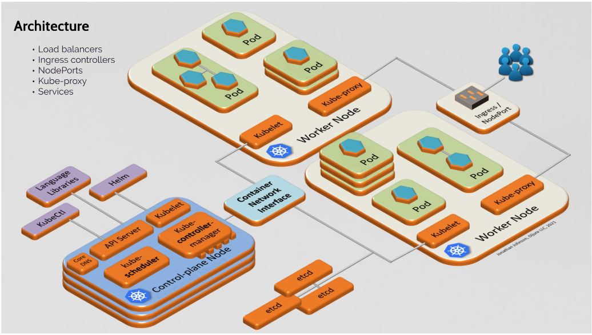
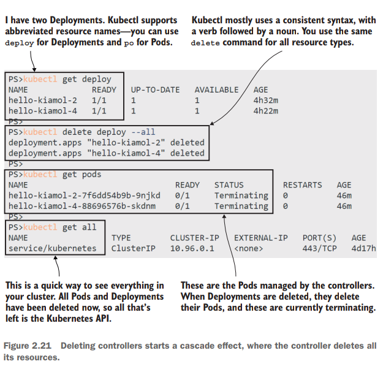
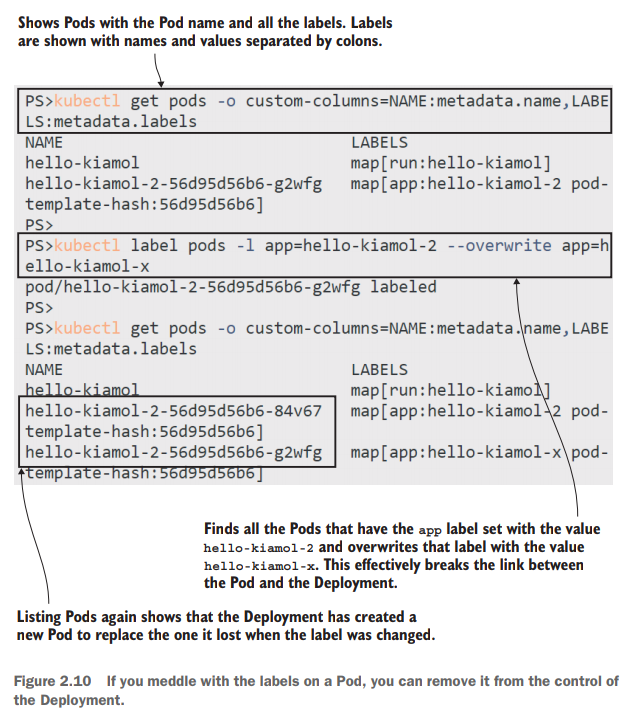
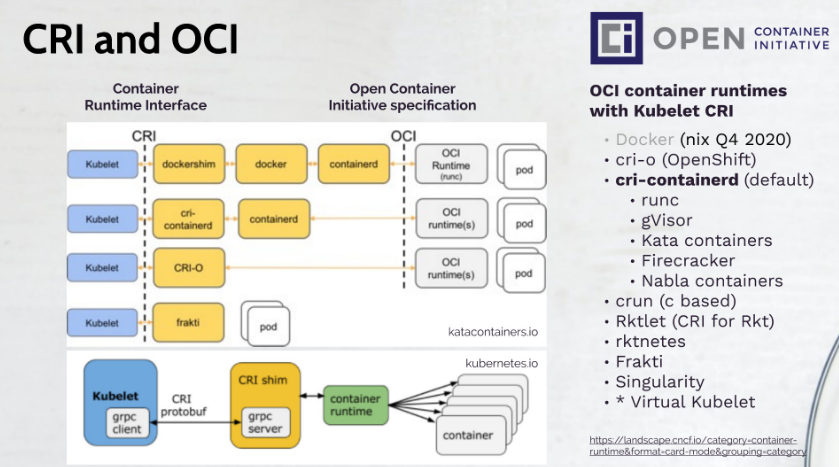
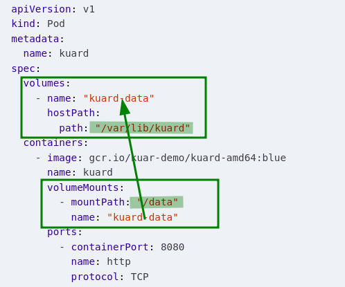

- Learn kubernetes in a month of lunches
- bret fisher course
- Github : Kubernetes the hard way

# Container Orchestrator

- You have many nodes
- You want to run your "service(s)" on all those nodes, with replicas of each service

#### What problems does Kubernetes solve?

- rise of microservices -> rise of container tech
- increased use of containers
- managing 1000s of such containers using scripts and self made tools made it complex and irritating

#### What are the tasks of an orchestration tool?

Kubernetes guarantees

- HA or no downtime
- scalability or high performance
- Disaster recovery - backup and restore

#### ECS, Mesos, Cloudfoundry, Marathon, ...wtf??

These are cloud-specific  orchestrator offerings

#### Kubernetes and Swarm are _infrastructure agnostic_

#### Which Distribution of Kubernetes should I choose?

- You can choose a cloud distribution (AWS EKS, GKE)
- Self managed (Docker Enterprise, Rancher, Openshift, Canonical, VMWare PKS)
- ! Dont use the pure upstream Github Kubernetes!

#### whats all this minikube, microk8s, k3s

- This is for local development.
- Single node cluster

> The primary goal of minikube is to make it simple to run Kubernetes locally, for day-to-day development workflows and learning purposes.

- k3s
  - `curl -sfL https://get.k3s.io | sh -s - --docker --disable=traefik --write-kubeconfig-mode=644`

## Kubernetes vs Swarm

- Swarm :- EASY
- Kubernetes :- FEATURES & FLEXIBILITY

Cloud will deploy/manage Kubernetes for you. Also, Infrastructure vendors are making their own distributions of Kubernetes.

Independence and standardization are the main reasons Kubernetes is so popular. Once you have your apps running nicely in Kubernetes you can deploy them anywhere, which is very attractive for organizations moving to the cloud, because it keeps them free to move between data centers and other clouds without a rewrite. It's also very attractive for practitioners - once you've mastered Kubernetes you can move between projects and organizations and be very productive very quickly.

### Immutable Infrastructure

### Declarative Configuration

- IaaC - Infrastructure as a Code

### Self Healing Systems

# Kubernetes

### Basic Architecture



- one Master Node
  - runs kubernetes processes to run and manage the workers properly
  - It has the following running
    - **the API server** (which is also a container)
    - **the Scheduler** (where to put the pod?)
      - checks for "tasks"-to create and assign pods from the Controller manager
    - **the Controller manager** (detect crashes of pods, and recover)
      - runs reconciliation loop.
      - keeps looking at current state - desired states configs and creates tasks(task to create pods) for the schedules to assign to nodes.
    - **the etcd** (key value store of cluster state)
      - stores the current state config and desired state config
- multiple worker Nodes
  - worker node is where actual applications are running
  - they have the following running
    - **Kubelet**
      - Kubelet talks to the containers through the CRI interface (Container Runtime Inteface)
    - **Kube Proxy**
      - responsible for routing n/w traffic to load balanced services in the cluster. Kubeproxy runs using DaemonSet.
      - Note that many of the kubernetes control plane components are run using kubernetes itself!
    - **Container runtime**
      - Kubernetes doesnt care what container runtime you use. containerd? docker? no issues.
  
- each node has one or more containers running on it

[Good Article Series](https://medium.com/google-cloud/kubernetes-101-pods-nodes-containers-and-clusters-c1509e409e16)


- API
  - define your applications
- Cluster
  - runs your applications
  - A cluster is a set of individual servers that have all been configured with a container runtime like Docker, and then joined into a single logical unit with Kubernetes

Basic flow

- You define your app in YAML files
- You send that YAML file to the Kubernetes API
- Kubernetes compares the YAML and what’s already running in the cluster.
  - and tries to get to a desired state

### Components

- `Pod` Run Containers.
- `Deployment` Runs Pods.
- `Kubernetes` Runs Deployments


##### Control Plane &mdash; The Masters/Managers

    - Includes ETCD, API server, scheduler, control manager
The container **orchestration layer** that exposes the Kubernetes API and interfaces to define, deploy, and manage the lifecycle of containers.
They detect and respond to cluster events (for example, starting up a new pod when a deployment's replicas field is unsatisfied).<br>
_They are actually containers themselves._

The etcd holds the current status of any K8s resource.

###### Kubernetes API?

Everything contained in Kubernetes is represented by a RESTful resource. Each Kubernetes object exists at a unique HTTP path, eg: `https://your-k8s.com/api/v1/namespaces/default/pods/mypod` leads to the representation of a Pod in the default namespace named `mypod`.

`kubectl` uses this API under the hood.<br>
To <u>Query and manipulate</u> the state of **objects** in Kubernetes <br>
Objects? := Pod || Deployment || Namespaces etc

Objects in the kubernetes API are represented as JSON or YAML files.These files are einter returned by the server in response to a QUERY or posted to the server as a part of an API  REQUEST.

`kubectl get <resourcename>`

`kubectl get <resourcename> <objectname>`

output as JSON or yaml? `-o json` or `-o yaml`

output a particular field? `-o jsonpath --template{.status.podIP}`

```
kubectl get pods my-pod -o jsonpath --template={.status.podIP}
```

##### Node

A Worker machine. ( host/machine/Ec2/VM etc ) with defined CPU and RAM<br>Every Node runs a "kubelet".

###### Kubelet?

 It makes sure that containers are running in a Pod (in that node).<br>

###### Pod?

Smallest deployable units of computing that you can create and manage in Kubernetes.<br>
Pod = group of one or more containers(taht are relatively tighly coupled).<br>
Usually 1POD contains 1CONTAINER<br/>
Pod is an abstraction over container

---
A cluster is a set of individual servers/nodes/hosts which have all been configured with a container runtime like Docker, and then joined together into a single logical unit with Kubernetes. The cluster, as one logical unit, runs your application. In normal usage you forget about the underlying nodes and you treat the cluster as a single entity. You can add Nodes to expand the capacity of your cluster.

A Kubernetes cluster consists of a set of worker machines, called nodes, that run containerized applications. Every cluster has at least one worker node.
The worker node(s) host the Pods that are the components of the application workload. The control plane manages the worker nodes and the Pods in the cluster. In production environments, the control plane usually runs across multiple computers and a cluster usually runs multiple nodes, providing fault-tolerance and high availability.

---

## Big Picture

You care only about your application. You just want it deployed... in one logical unit that abstracts everything underneath....**The Cluster**

You just want to _define_ the application in a YAML file (manifest), and let Kubernetes handle the rest.

#### "The rest"?

- Say a `node` in the cluster just died, and killed off some containers with it
  - Kubernetes will see this and starts replacement containers on the host
- Say a container became "unhealthy"
  - Kubernetes will restart it.
- Say a `component` is under high load/stress.
  - Kubernetes will start extra copies of the component in new containers.

**Your Job** :-> Define the Dockerfile and the kubernetes YAML file properly. You specify WHAT you want to happen

**Kubernetes Job** -> Make sure `CURRENT STATE == DESIRED STATE` ( a self healing app ). It figures out HOW to make it happen.

## Principal Principles

#### [Controller Model](https://kubernetes.io/docs/concepts/architecture/controller/)

Observe the _"Controller controls resources"_ pattern at play



### <u>Label system for identification</u>

Any Kubernetes resource can have labels applied that are simple key-value pairs.
You can add labels to record your own data.
Kubernetes also uses labels to loosely couple resources, mapping the relationship between objects like a Deployment and its Pods. The Deployment adds labels to the pods it manages.
 Deployments add labels when they create Pods, and you can use those
labels as filters.

Using labels to identify the relationship between resources is such a core pattern in
Kubernetes . Resources can have labels applied at creation and then added, removed, or edited during their lifetime. Controllers use a label selector to identify the resources they manage. That can be a simple query matching resources with a particular label,

This process is flexible because it means controllers don’t need to maintain a list of all
the resources they manage; the label selector is part of the controller specification,
and controllers can find matching resources at any time by querying the Kubernetes
API. It’s also something you need to be careful with, because you can edit the labels
for a resource and end up breaking the relationship between it and its controller.


The Deployment doesn’t have a direct relationship with the Pod
it created; it only knows there needs to be one Pod with labels that match its
label selector. If you edit the labels on the Pod, the Deployment no longer
recognizes it.

#### Kubernetes does NOT run conatiners



1. Kubernetes does not run containers -, it delegates it to node runtimes like docker, containerd, etc
2. It is the Node's responsibility (specifically, responsibility of the container runtime inside the node) to manage the pod and its containers.

    It does that by working with the container runtime using a known API called the Container Runtime Interface (CRI). The CRI lets the node manage containers in the same way for all the different container runtimes - it uses a standard API to create and delete containers, and to query their state. While the pod is running, the node works with the container runtime to ensure the pod has all the containers it needs.


Those YAML files are called application manifests, because they're a **list of all the components that go into shipping the app**. And those components are "Kubernetes resources"

- `Pod` :
- `Deployment`: A Controller for managing Pods
- ReplicaSet
  - They manage Pods
- Service
- `*Controller*` : A Controller is a Kubernetes Resource which manages other Kubernetes Resources. It works with the Kubernetes API to watch the current state of the system, compares that to the desired state of its resources, and makes any changes it needs

### ⛳️ `Pod`


- Every container belongs to a pod.
- A Pod can container one or more containers.
- You should run ONE container in a pod. [Sometimes more]()
- A Pod runs on a single node in the cluster. (all containers in a pod always run on the same machine!)
- A Pod is the  smallest unit of compute in Kubernetes.
- A Pod has its own Virtual IP address.
- Pods can communicate with each other , even on different nodes, via the virtual network.
- Containers inside the same pod share the same network interface (NIC) as that of the pod, and can communicate via `localhost`
- You use a Pod for each component. You may have a website Pod, and an API Pod.
- Scaling applications = running more Pods

##### Why bother with pods? Why doesnt Kubernetes handle the containers directly (bypassing the pods)?

Kubernetes doesn't really run containers - it passes the responsibility for that onto the container runtime installed on the node, which could be Docker or containerd or something more exotic. **That's why the pod is an abstraction**, it’s the resource which Kubernetes manages whereas the container is managed by something outside of Kubernetes.

#### What should I put in a Pod?

You shouldnt place a Wordpress container and a MySQL container in a singe Pod. Why? because you wouldnt want to scale them together as a unit lol!!

The right question to be asked is "Will these containers work correctly if they land on different machines?". If the answer is "No", then place both containers in the same Pod.

#### Pod Manifests

The yaml declarative configs - definition of the Pod

The Kubernetes API server accepts and processes Pod manifests before storing them in persistent Storage(etcd). The Scheduler also uses the Kubernetes API to find Pods that haven't been scheduled to a node. The scheduler then places the Pods onto nodes depending on the resources and other constraints mentioned in the Pod manifest.

### ⛳️ `Deployment`

Its a "Controller" for managing `Pods`.A deployment’s primary purpose is to declare how many replicas of a pod should be running at a time. When a deployment is added to the cluster, it will automatically spin up the requested number of pods, and then monitor them. If a pod dies, the deployment will automatically re-create it.Using a deployment, you don’t have to deal with pods manually. You can just declare the desired state of the system, and it will be managed for you automatically.

> The pod is a primitive resource and in normal use you’d never run a pod directly, you'd always Create a controller object to manage the pod for you.

##### But whyy?? why not just use the Pods directly?

 Pods are isolated instances of an application, and each pod is allocated to one node. <u>If that node goes offline</u> then the pod is lost and Kubernetes does not replace it. You could try to get high availability by running several pods, but there's no guarantee Kubernetes won't run them all on the same node. Even if you do get pods spread across several nodes, you need to manage them yourself

 Enter `Deployment`, the Controller object for `Pods`

 

If a node goes offline and you lose the pod, the deployment will create a replacement pod on another node; if you want to scale your deployment you can specify how many pods you want and the deployment controller will run them across many nodes.

**How does it keep track**?? &mdash; Via labels<br/>
<div style="color:white; background-color:black; padding:1em; border-radius:4px; box-shadow: 0 0 5px black; font-style:italic; margin:4px">
Controllers use Labels to identify the resources they manage. <br/>
Using labels to identify relationship between resources is a core pattern in kubernetes.
</div>

<div style="color:white; background-color:firebrick; padding:1em; border-radius:4px; box-shadow: 0 0 5px black; font-style:italic; margin:4px">
Watch out!: you might break the relationship between a resource and its controller by editing the labels
</div>


### ⛳️ `ReplicaSet`

Mostly same as Deployments (but actually its Deployment minus rollouts rollbacks)

### ⛳️ `StatefulSet`

Mostly same as Deployments (have concept of "replicas")

But each replica has a sticky identity., identity which doesnt go away when a pod is restarted.

### ⛳️ `DaemonSet`

A pod that runs on EVERY node in the cluster.

Say you want to grab all logs from every node and send it to ElasticSearch. &mdash; you use DaemonSets.

### ⛳️ `Job`

Does some work and ,,,exits.

### ⛳️ `Service`

Kubernetes gives a virtual network
Every Pod gets its own private IP address, but Pods are ephemeral, Pods die easily, new Pod will have new IP address.<br>
`Service` gives a permanent IP, `Service` can be attached to the Pod.
A service is also a `loadbalancer`


Service figures out which pod to route the traffic to

External Service and Internal service:

### ⛳️ `Ingress`

Gives doman name to service IPs

### ⛳️ `Ingress Controller`

Fulfills the routing rules defined by `Ingress`

### ⛳️ `ConfigMap and Secrets`

external configuration of your application.
attach ConfigMap to Pod
attach Secret to Pod

### ⛳️ `StatefulSet`

Just like Deployment

### ⛳️ `Volumes`

attaches a physical storage to Pod.
Can be from the node, or from a remote node.


`hostPath` type is suitable when you want to use the volume from the host, i.e the node. If the Pod is restarted on another node, you will lose this data. For this , use `nfs` or `iSCSI`

## Health Checks

Liveness health checks run application-specific logic(eg:loading a web page) to verify that the application is not just still running, but is functioning properly.


- Liveness Probe
  - Since "liveness" is application specific, you have to specify them in your pod manifest.
- Readiness Probe
  - Readiness describes when a container is ready to serve user requests. Containers that fail readiness checks are removed from service load balancers.

## Kubernetes YAML file &mdash; Defining Deployments in Application Manifests

Advantages over manually running commands

1. YAML files are declarative
2. You can write comments, to explain your decisions.

### Structure &mdash; 3 parts

1. metadata
2. specification
3. status ( added by kubernetes automatically )

A `template` section has its own metadata and specification

#### Examples

1. [YAML for defining a pod](cfg/kube-01.yaml)
2. [YAML for definign a deployment](cfg/kube-02.yaml)

## How Kubernetes routes traffic

- Pods have their own IPs and communicate with each other using those IPs
- But IPs change as Pods are killed/replaced
- Enter **Services** (DNS)
  - Services allow Pods to communicate using a fixed domain name.
  - Services have their own IP address
  - Concept: deploy a Service resource and use the name of the Service as the domain name for components to communicate

The service is an abstraction over (Pod+its n/w address), just like a Deployment
is an abstraction over (Pod+its container)

<div style="color:white; background-color:black; padding:1em; border-radius:4px; box-shadow: 0 0 5px black; font-style:italic; margin:4px">
A Kubernetes Cluster has a DNS server built in &mdash; which maps Service names to IP addresses
</div>


A Simple web app

- needs three Kubernetes resources
  - 2 Deployments
  - 1 service

### Routing external traffic to Pods

Type of service called "LoadBalancer"

### Routing traffic outside Kubernetes

Type of service called "ExternalName"

## Supplying Configurations &mdash; ConfigMaps & Secrets

**Approach 1: env variables**

- can provide the classic env variables via the YAML file
- BUT, you cant change env variables of the Pods on the fly
  - env vars are static for the lifetime of the pod
  - you can only do so with a replacement Pod

**Approach 2: ConfigMaps**

Some good rules

- default app settings are baked into the container image
- Environment specific settings can be stored in ConfigMap
- any others that you need to tweak a little can be applied as env variables in Pod specification for the Deployment

## Storing data

- volumes
- mounts
- claims

_What happens if a container died and killed all the data it contained along with it_??

=>>
"EmptyDir" volumes share the lifecycle of the Pod. These volumes are the Pod lvl, so death of container != death of the contents of EmptyDir... it lives on.

_What happens if a Pod died and killed all the data it contained along with it_??

==>
"HostPath" volumes share the lifecycle of the Node. Data is physically stored on the node, and data is maintained between Pod replacements

_What happens if a Node died and killed all the data it contained along with it_??

==>
Persistent Volume


## Scaling applications = more Pods

- a "Pod" is the unit of Compute in Kubernetes
- Deployments manage Pods ( they actually manage replicasets which inturn manage Pods)


 the Deployment is a controller that manages ReplicaSets, and the ReplicaSet is a controller that manages Pods.

core of scaling: you run as many Pods as you need, and they all sit behind one Service. When consumers access the Service, Kubernetes distributes the load between Pods.

## Namespaces

Why?

- to Structure your components, organize objects in the cluster
- avoid conflicts b/w teams
- share services b/w different environments
- Access and Resource limits on Namespace level
  
```
example namespaces
- default
- kube-system
- kube-public
- kube-node-lease
```

## Contexts

`~/.kube/config`
Contexts are used to manage different clusters

`kubectl config use-context my-context` or use `kubectx` instead

# Helm

Package Manager for Kubernetes

### Helm Chart

bundle of YAML files.
`Helm install chartname` makes it simple to install complex stuff

# Playing with Kubernetes locally (Single Node Cluster) via K3s

##### Step 0 : Install k3s

`curl -sfL https://get.k3s.io | sh -s - --docker --disable=traefik --write-kubeconfig-mode=644`

Note that this also installs `kubectl` for you!

##### Step 0.1: Check that your cluster is up and running

`kubectl get nodes`


##### Step 1.1 : run a pod with a single container

`kubectl run test-db --image=postgres`

 `kubectl port-forward test-db 5432:5432`

##### Step 1.2 : list all the pods in the cluster

`kubectl get pods`

##### Step 1.3 : show detailed information about the pod

`kubectl describe pod test-db`

`kubectl  get pod hlo -o json` --> much more detailed

##### Step 1.4 : Lets try deleting a container


##### Step 2.1 : Lets create a deployment

`kubectl create deployment es --image=elasticsearch:2`

then list the pods `kubectl get pods`

You can observe that creating a deployment --> creates  pod(s). Its a _deployment-managed-pod_ :)

##### Step 3.1 Let's deploy using a YAML file

`kubectl apply -f pod.yaml`

### A Note about debugging . ( "How do I `docker exec....` ")`

[How do i get a shell into my application container?](https://kubernetes.io/docs/tasks/debug-application-cluster/get-shell-running-container/)

- Your container runtime may not give you access to work
with containers directly
- a managed Kubernetes cluster won’t give you control of
Docker or containerd

`kubectl` to the rescue!

You can run commands inside containers with kubectl and connect a terminal session, so you can connect into a Pod’s container as though
you were connecting to a remote machine.

##### Check the internal IP address of the first Pod we ran

`kubectl get pod hello-kiamol -o customcolumns=NAME:metadata.name,POD_IP:status.podIP`

##### run an interactive shell command in the Pod

`kubectl exec -it hello-kiamol -- sh`

##### inside the Pod, check the IP address

`hostname -i`

##### and test the web app

`wget -O - http://localhost | head -n 4`

##### leave the shell

`exit`


# Misc Notes

## Bash autocompletion

```bash
echo "source <(kubectl completion bash)" >> ${HOME}/.bashrc
```

## Helm

### Verdaccio local docker image with k3s and helm

Basically the deployment.yaml takes images which it can pull only from docker.hub or some registered **registries**. local images is not possible with k3s

##### Why local images is not possible with k3s?

its the containerd runtime causing this limitation. If you use docker as the runtime, then you can use local images with `imagePullPolicy:Never`

##### Why not use docker as runtime with k3s then?

```
curl -sfL https://get.k3s.io | sh -s - --docker
```

is the command to run k3s in docker... However, in arch linux, I got an error saying `kubelet uses cgroupfs but docker is using systemd` .Couldnt debug further, and resolved to find out how to import local images into containerd somehow

##### `import` local images into k3s containerd

```
docker save --output verdaccio.tar verdaccio/verdaccio:local 
sudo k3s ctr images import verdaccio.tar
```

Post this, `helm install npm --set image.tag=local .` inside `charts` directory works like a charm!
