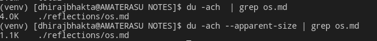

# Distros
See [Distrowatch](https://distrowatch.com/)

A little bit of history &mdash; The grand-daddy is UNIX. Created by Ken Thompson and Dennis Ritchie( C creator) in Bell Labs, 1969. UNIX was born out of a failed attempt at Multics, an ambitious time-sharing OS which can run on the then Mainframes.
>What we wanted to preserve was not just a good environment in which to do programming, but a system around which a fellowship could form. We knew from experience that the essence of communal computing, as supplied by remote-access, time-shared machines, is not just to type programs into a terminal instead of a keypunch, but to encourage close communication <br/>
             --<i>Dennis Ritchie</i>


All the distros that we talk about belong to an umbrella term called "*NIX" or "UNIX-like", which technically means they all are [POSIX compliant](https://opensource.com/article/19/7/what-posix-richard-stallman-explains). 

So at the very top level of all Distros, we have the following *NIX families
 - Linux
 - Solaris
 - BSD

 Out of which LINUX is not a derivative of UNIX.

 Solaris branched off from Commercial UNIX (v7) and developed/maintained by Sun Microsystems/Now Oracle, and BSD (Berkeley Unix) was based on the source code of the original UNIX of Bell Labs, developed (extended) at University of California. That's why BSD is said to be the closest possible UNIX variant.<br> Note that MacOS is a derivative of BSD

 ## Solaris Distros
 - OpenSolaris
 - SmartOS

 These are just not famous.

 ## BSD Distros
- NetBSD
- FreeBSD
- OpenBSD
- GhostBSD
- Darwin --> Mac OSX + iOS

Why would one use BSD? Its _sorta_ performant on certain hardware, especially embedded. Also they dont have the strict GNU policy/license issue of being forced to release your code if you tweak it. Big Companies dont like to release their internal code/tweaks, so they might use BSD


## Linux Distros
#### Why was LINUX born? 

BSD was already sued by AT&T for including UNIX code in their kernel. There was a major need to get a free alternative. Richard M Stallman created the GPL, and hell lot of GNU software to create a full blown OS. But HERD, the GNU kernel, was really bad.

Around same time, Tannenbaum released MINIX, to aid his OS texbook. This OS was mainly for academic use and served as a "best-practise exemplar" of an OS. Source code of MINIX was prohibited from modification and distribution. Also it was built for 16 bit architecture. Intel's 32 bit CPUs were already getting popular, in PCs at the time.

Linus Torvalds didn't have money for buying a UNIX at the time for his Masters thesis, and ended up creating a clone , from scratch -> LINUX kernel, taking MINIX as an inspiration. He admits that had GNU HERD or BSD kernels for 32 bit been available, he would not have made LINUX. The Linux Kernel was the missing piece for the GNU software to become a full blown OS.
[Linus' famous mail](https://www.linux.com/news/linuss-famous-email/)

#### on linux distros
Most distributions offer pre-compiled packages of most common tools, such as RPM packages on RedHat and Debian packages (also called deb or dpkg) on Debian, so you needn't be a programmer to install a package on your system. However, if you are and like doing things yourself, you will enjoy Linux all the better, since most distributions come with a complete set of development tools, allowing installation of new software purely from source code. This setup also allows you to install software even if it does not exist in a pre-packaged form suitable for your system.

#### Flavors
- Debian
    - Ubuntu
    - Linux Mint
- Fedora
    - RHEL
    - Centos
- Mandriva
- OpenSUSE
- Gentoo
- ArchLinux


## Package managers
[How package managers work](https://opensource.com/article/18/7/evolution-package-managers)


### .deb vs .rpm
**.deb** : for Debian, and its derivatives (Ubuntu, Linux Mint)<br>
**.rpm** : for Fedora, and its derivatives (RHEL, centOS), and openSUSE

**.deb and .rpm are just compressed tar files**, files with specific directory layout understood by the associated _package installer_ ( dpkg, RPM). Howewer, they will NOT install the required dependencies, thats why using dpkg,RPM is a nightmare! Recognising this weakness, Debian developed apt-get on top of dpkg - their own packaging tool. Apt-get does automatically install dependencies. Similarly, RedHat developed Yum install on top of RPM.  Could RedHat have just used .deb format? Yes! but rpm format was already so mature, they didnt try to fix what aint broken. Sure you can convert deb/rpm/tgz into one another.. checkout `alien` package

an "installation" involves
- creating user accounts on the system
- creating/modifying configuration files that aren't actually contained in the .deb or .rpm file
- set ownership/permissions on the files after installation
- run commands as root on the system that's installing the package
dependencies, both formats can include names or packages and/or service names that they require to be present on a system, prior to installation.

### `sudo apt-get update` and related
"update" the <u>metadata</u> of all the packages from the subscribed repositories

### `sudo apt-get upgrade` and related
actually installs

##  _Everything is a File_
 A wide range of input/output resources such as documents, directories, hard-drives, modems, keyboards, printers and even some inter-process and network communications are simple streams of bytes exposed through the filesystem name space.
 
 Why? Interoperability! The same set of tools, utilities and APIs can be used on a wide range of resources. Also, things are transparent this way
#### Types of files
Check the first char of `ls -al`
1. Regular files (-)
2. Directory (d) : references the files
3. Symbolic Links . Softlinks (l)
4. Block device files (b) : sda, sdb : Harddrives
5. Character device files (c) : Mouse, Keyboards
6. Sockets
7. Named pipes


**UNIX Philosophy** Small things combined in many ways to create useful large things. --Common underlying format -- file

Commands are files (check /bin)

Processes are files (check /proc)


## [Filesystem Hierarchy Standard (FHS)](https://refspecs.linuxfoundation.org/FHS_3.0/fhs/index.html)


### /bin 
Binaries essential for the entire OS
.Binaries from the base system

### /sbin
System Binaries that should only be executed by root. eg: mount.

Only Sysadmins mess with this dir.

### /lib
Many of the Binaries in /bin and /sbin may use shared libraries, which is present in /lib

### /usr
Has its own /bin /sbin ..which has NON-ESSENTIAL binaries. non-essential to the operating system. Usually the "installed" apps go here.

##### /usr/local .../usr/local/bin
This is for housing binaries that you manually compiled and placed.. so it doesnt clash with binaries installed with package manager.

### /etc
"Editable Text Configuration" &mdash; Houses the config files

To customize the behavior of the software via config files.


### /boot
Holds the Linux Kernel, bootloader

### /dev 
Holds Device Files

### /opt
Holds "Optional"/Add-On Software

### /var
Variables files that will change as the OS in in use. Eg: logs, caches

### /proc
Pseudo dir. Is created in-memory by the Linux Kernel to keep track of running processes and Ports.
### /tmp
No explanation needed.

### /run
Sort of similar to /tmp  as its ephemeral too
### /home
No explanation needed

## But What exactly is a "[Filesystem]()"?


#### Filesystem Examples
What are all these 
btrfs,cramfs,ext2,ext3,ext4,fat,gfs2,hfsplus,minix,msdos,ntfs,reiserfs,vfat,xfs

#### Virtual Filesytem Examples


> lsblk is great for getting an overview of the physical devices mounted on the system, but it will miss any virtual filesystem mounts — most commonly, in-memory filesystems mounted as type 'tmpfs', of which modern Linux systems typically contain several.

> /tmp and /dev/shm will be kept in memory for performance reasons on most systems (which is why /var/tmp should always be used instead of /tmp for large temporary files), and systemd installations will have /run and one or more /run/user/$UID mounted in memory as well.

>df or df -h will provide a nicely-formatted listing of all mounts including virtual filesystems, or on distributions which provide it, I've come to prefer the output of di.


## What exactly is "mounting"?
pass


#### How to find ANY file 
```bash
 find /path/to/dir -name "*partoffilename*"
```

Let's become a `find` poweruser.

Besides using the find command to locate files, you can also use it to execute other Linux commands (grep, mv, rm, etc.) on the files and directories that are found, which makes find even more powerful.
```
basic 'find file' commands
--------------------------
find / -name foo.txt -type f -print             # full command
find / -name foo.txt -type f                    # -print isn't necessary
find / -name foo.txt                            # don't have to specify "type==file"
find . -name foo.txt                            # search under the current dir
find . -name "foo.*"                            # wildcard
find . -name "*.txt"                            # wildcard
find /users/al -name Cookbook -type d           # search '/users/al' dir

search multiple dirs
--------------------
find /opt /usr /var -name foo.scala -type f     # search multiple dirs

case-insensitive searching
--------------------------
find . -iname foo                               # find foo, Foo, FOo, FOO, etc.
find . -iname foo -type d                       # same thing, but only dirs
find . -iname foo -type f                       # same thing, but only files

find files with different extensions
------------------------------------
find . -type f \( -name "*.c" -o -name "*.sh" \)                       # *.c and *.sh files
find . -type f \( -name "*cache" -o -name "*xml" -o -name "*html" \)   # three patterns

find files that don't match a pattern (-not)
--------------------------------------------
find . -type f -not -name "*.html"                                # find all files not ending in ".html"

find files by text in the file (find + grep)
--------------------------------------------
find . -type f -name "*.java" -exec grep -l StringBuffer {} \;    # find StringBuffer in all *.java files
find . -type f -name "*.java" -exec grep -il string {} \;         # ignore case with -i option
find . -type f -name "*.gz" -exec zgrep 'GET /foo' {} \;          # search for a string in gzip'd files

5 lines before, 10 lines after grep matches
-------------------------------------------
find . -type f -name "*.scala" -exec grep -B5 -A10 'null' {} \;
     (see https://alvinalexander.com/linux-unix/find-grep-print-lines-before-after-search-term)

find files and act on them (find + exec)
----------------------------------------
find /usr/local -name "*.html" -type f -exec chmod 644 {} \;      # change html files to mode 644
find htdocs cgi-bin -name "*.cgi" -type f -exec chmod 755 {} \;   # change cgi files to mode 755
find . -name "*.pl" -exec ls -ld {} \;                            # run ls command on files found

find and copy
-------------
find . -type f -name "*.mp3" -exec cp {} /tmp/MusicFiles \;       # cp *.mp3 files to /tmp/MusicFiles

copy one file to many dirs
--------------------------
find dir1 dir2 dir3 dir4 -type d -exec cp header.shtml {} \;      # copy the file header.shtml to those dirs

find and delete
---------------
find . -type f -name "Foo*" -exec rm {} \;                        # remove all "Foo*" files under current dir
find . -type d -name CVS -exec rm -r {} \;                        # remove all subdirectories named "CVS" under current dir

find files by modification time
-------------------------------
find . -mtime 1               # 24 hours
find . -mtime -7              # last 7 days
find . -mtime -7 -type f      # just files
find . -mtime -7 -type d      # just dirs

find files by modification time using a temp file
-------------------------------------------------
touch 09301330 poop           # 1) create a temp file with a specific timestamp
find . -mnewer poop           # 2) returns a list of new files
rm poop                       # 3) rm the temp file

find with time: this works on mac os x
--------------------------------------
find / -newerct '1 minute ago' -print

find and tar
------------
find . -type f -name "*.java" | xargs tar cvf myfile.tar
find . -type f -name "*.java" | xargs tar rvf myfile.tar
     (see https://alvinalexander.com/blog/post/linux-unix/using-find-xargs-tar-create-huge-archive-cygwin-linux-unix
     for more information)

find, tar, and xargs
--------------------
find . -name -type f '*.mp3' -mtime -180 -print0 | xargs -0 tar rvf music.tar
     (-print0 helps handle spaces in filenames)
     (see https://alvinalexander.com/mac-os-x/mac-backup-filename-directories-spaces-find-tar-xargs)

find and pax (instead of xargs and tar)
---------------------------------------
find . -type f -name "*html" | xargs tar cvf jw-htmlfiles.tar -
find . -type f -name "*html" | pax -w -f jw-htmlfiles.tar
     (see https://alvinalexander.com/blog/post/linux-unix/using-pax-instead-of-tar)
```

#### How to find total size occupied by a directory
`du -ach`

`du -ach --apparent-size`

Why 2 commands?  what is "apparent size"?


There is a catch here. "File Size" is different than "disk usage". **FileSize <= DiskUsage**. If you observe the output of simple `du` command, you will see all files are multiples of "4K". Why?
**4k is the size of a single disk block. Disk space is allocated in blocks, so even the smallest disk takes up one block (4k) on your disk**

#### How to read a `man` page
- `man man` ಠ益ಠ
- `help <cmd>` Helps you find info on shell builtins


####  What is a Shell BUILTIN ?
- `cd` is a shell builtin!

####  What is a ramdisk?

#### The /proc filesystem?
- Process information pseudo-file system
    - Theyre not "real" files ( `ls -lah` shows file size=0 for all)
- They contain runtime system information (e.g. system memory, devices mounted, hardware configuration, etc). For this reason it can be **regarded as a control and information centre for the kernel**
    - In fact, quite a lot of system utilities are simply calls to files in this directory. For example:
        - `lsmod`  = =  `cat /proc/modules`
        - `lspci`  = = `cat /proc/pci`. 
        - ps, htop too.. nearly every monitoring command you use

```haskell
       /etc/services -- The services translation file

       /proc -- Mount point for the proc filesystem, which gives access to kernel status information via the following files.

       /proc/net/dev -- device information

       /proc/net/raw -- raw socket information

       /proc/net/tcp -- TCP socket information

       /proc/net/udp -- UDP socket information

       /proc/net/udplite -- UDPLite socket information

       /proc/net/igmp -- IGMP multicast information

       /proc/net/unix -- Unix domain socket information

       /proc/net/ipx -- IPX socket information

       /proc/net/ax25 -- AX25 socket information

       /proc/net/appletalk -- DDP (appletalk) socket information

       /proc/net/nr -- NET/ROM socket information

       /proc/net/route -- IP routing information

       /proc/net/ax25_route -- AX25 routing information

       /proc/net/ipx_route -- IPX routing information

       /proc/net/nr_nodes -- NET/ROM nodelist

       /proc/net/nr_neigh -- NET/ROM neighbours

       /proc/net/ip_masquerade -- masqueraded connections

       /sys/kernel/debug/bluetooth/l2cap -- Bluetooth L2CAP information

       /sys/kernel/debug/bluetooth/rfcomm -- Bluetooth serial connections

       /proc/net/snmp -- statistics
```


## Honourable mentions
#### commandline
##### (Sudo bangBang) Re-run the previous command as root
`sudo !!`

Know that BangBang `!!` re-runs previous command

##### learn to use less

##### <CTRL+x+e>  for editing laarge commnds 
you need to `export EDITOR=vim` for this


# 60 Days of Linux

## The Shell
**Shell**  is a "program"  which processes commands and returns an output. eg: sh, bash, zsh<br>


### Pipes
```bash 
prog1 | prog2

$ ps aux | less
```

### STDOUT, STDERR, STDIN &mdash; Input-output redirection
Every process has 3 channels<br>
STDOUT - 0 : the shell<br>
STDIN  - 1 : the keyboard<br>
STDERR - 2 : the shell<br>

The echo command writes to the STDOUT, which is the console by default
```shell
$ echo "This will go into the console"
```
" Output Redirection "
```bash
$ echo "This will go into the file" 1> somefile.txt
OR
$ echo "This will go into the file" > somefile.txt

# the output redirection ' > ' by default, means " redirect the STDOUT
# So, 1> and > mean the same thing.
$ ls -lah "This will spit out errors into file" 2> somefile.txt

```


## Filtering, Searching, Sorting data &mdash; the usual grind 

#### The thing about logical AND (&&) and logical OR (||)
```bash
$ prog1 && prog2
# prog2 will run iff prog1 ran successfully

$ prog1 || prog2
# prog2 will run iff prog2 failed
```

#### Learn these
1. `cut`
2. `sort`
3. `grep`
4. `wc`
5. `uniq`

## File Permissions and Access Control
-rwxrwxrwx = u g o (rwx)(rwx)(rwx)

chmod 777 file = u=7, g=7, o=7. => everyone can do everything
```
r-- = 4
rw- = 6
rwx = 7
```

[Why can you `chown` only as root?](https://unix.stackexchange.com/a/27374)

#### User creation `useradd` `passwd`
Generally when you create a user, automatically a group will be created with same name. Once you add the user, you can check the new entries made in `/etc/passwd` , `/etc/shadow` and `/etc/group`

`whoami` and `id` gives you everything about yourself, your groups etc.

#### Understanding ` cat /etc/passwd`
#### Understanding ` cat /etc/shadow`
#### Understanding ` cat /etc/group`

#### How to login as someone

#### How to login as root
2 ways
- `sudo -i`
- `su - root`

#### How to run a command as another user?
- `sudo -u bob thecommand`


## Process Management
Every Process runs as a user. You can check this with `top` or `htop`.
You own the files you create and processes you spawn

#### PID 1 &mdash; init

#### Signals
Used by processes to communicate. Also can be sent by the Kernel. Child process can return info to Parent using Signals

`kill -l` Will show you the list of signals that you can send to processes. Yes, `kill` is not just used for "killing" a process.

SIGTERM: Kernel to Process: _Hi can you please shutdown gracefully?_<br>
SIGKILL: Kernel to Process: _Im gonna end your existence right here right now!_


Every CPU has one or more cores which can run just N hardware threads. Say N=1. Every process contends for the CPU time and **Kernel is responsible for scheduling**.

##### "Nice"ness of a process

Checkout `nice` and `renice` commands 
How nice a process is to other processes... in terms of respect for resource usage, contention.

A Nice value of -20 = ULTRA CRITICAL! **not nice**<br>
This will freeze up your CPU, all the CPU time thats available will be given to this process. Time sharing gone.


A Nice value of 19 = LOW PRIORITY! **very nice**<br>

Checkout [this article](https://scoutapm.com/blog/restricting-process-cpu-usage-using-nice-cpulimit-and-cgroups) on how nice, renice, cpulimit and cgroups can help


#### Process States


1. New: Just Created
2. Running
3. Waiting
4. Ready: The process is waiting to be assigned to a processor.
5. Terminate

### Using `ps` properly


## cron
#### list my crontab
`crontab -l`
## Monitoring

#### `top` &mdash; Monitor processes
- which process is taking up most CPU, memory.
- how much memory is being used/free.
- alternative is `htop` which is more fancy
    - Scroll through the process, and send signal using f9

#### `netstat` &mdash; Monitor network
- `sudo netstat -tupln`  : Open ports .
    - `sudo` for /proc access. else it wont be able to show process IDs

#### `who` and `w` &mdash; Monitor users
Show who is logged in and what they are doing.

## Admin level stuff

### `chroot` &mdash; fake root
Change the "apparent" root for the current running process and their children.

The programs cannot access files and commands outside that tree. 

This modified environment is called "chroot jail"

- Should be used for processes that dont run as root

Why all this? =>
You create a directory tree where you copy/link all the system files needed for a process to run. Then you `chroot` to change the root dir to this new dir tree. the processes run here will only look for binaries within this tree . They also cannot read/write outside this tree. They dont have a clue that world exists outside this jain. If you really want to use files/binaries from outside(and the libs used by those binaries), you can use bind mounts.

As a matter of fact, `arch-chroot` does exactly this. Its a wrapper on `chroot`. We use `arch-chroot` while installing archlinux. (its a part of `arch-install-scripts` package)...Before it runs `chroot` internally, it will mount API filesystems like /proc and all so that they're available in the chroot jail

[practical](https://www.unixmen.com/chroot-jail/)

[Fixing your system](https://superuser.com/questions/111152/whats-the-proper-way-to-prepare-chroot-to-recover-a-broken-linux-installation)

[Fixing your system - vid](https://www.youtube.com/watch?v=43dpS35Hzq8)


# Saved Movement Shortcuts

`ctrl + a ` : Beginning ,<br/>
`ctrl + e ` : End <br>
`alt + f ` : Forwards <br>
`alt + b`: Backwards <br>

`ctrl + u`: clear whatever youve typed<br>
`ctrl + l`: short for `clear` command


# Saved Commands
[Cheatsheets](https://devhints.io/)
```bash
# List all installed packages with their sizes
pacman -Qi | awk 'BEGIN{sort="sort -k2 -n"} /Name/ {name=$3} /Size/ {size=$4/1024;print name":",size,"Mb"|sort}'

# Common commands
----------------
pacman -Syu <pkg> 	....Install (and update package list)
pacman -S <pkg> 	....Install only
pacman -Rsc <pkg> 	....Uninstall
pacman -Ss <keywords> 	....Search
pacman -Syu 	....Upgrade everything

# Query
-----
pacman -Qii <pkg> 	...List information on package
pacman -Qe 	        ...List explictly-installed packages
pacman -Ql <pkg> 	...What files does this package have?
pacman -Qo <file> 	...Who owns this file?
pacman -Qs <query> 	...Search installed packages for keywords

# Orphans
-------
pacman -Qdt 	....List unneeded packages
pacman -Rs $(pacman -Qdtq) 	...Uninstall unneeded packages+deps

# pactree
-------
pactree <pkg> 	....What does pkg depend on?
pactree -r <pkg> 	....What depends on pkg?
```

```
To find out where disk space is being used:
1. Get to the root of your machine by running cd /
2. Run sudo du -h --max-depth=1.
3. Note which directories are using a lot of disk space.
4. cd into one of the big directories.
5. Run ls -l to see which files are using a lot of space. Delete any you don't need.
Repeat steps 2 to 5.
```
# Questions
- "wht" is a TTY and pts/0 and all?
- [Why cant pipes and filters be used interchangeably?](https://askubuntu.com/a/172989)
- What is the difference between SHell and Terminal Emulator?
- what is 0.0.0.0 and how is it different from localhost?
- what is ncurses? 
- what actually happens when i ctrl+c or ctrl+z? ctrl+d?
- What does modprobe do? what are kernel modules? waht are kernel drivers? dmesg ? lspci -k ? 
- what are systemcalls?

- `ldd` command -- list the libraries required by a binary ( understand bin vs lib) see [this](https://www.unixmen.com/chroot-jail/)