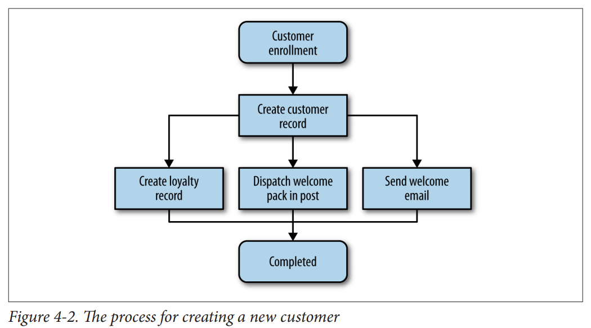
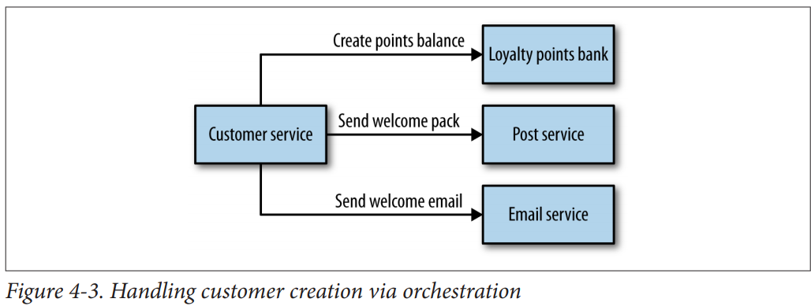
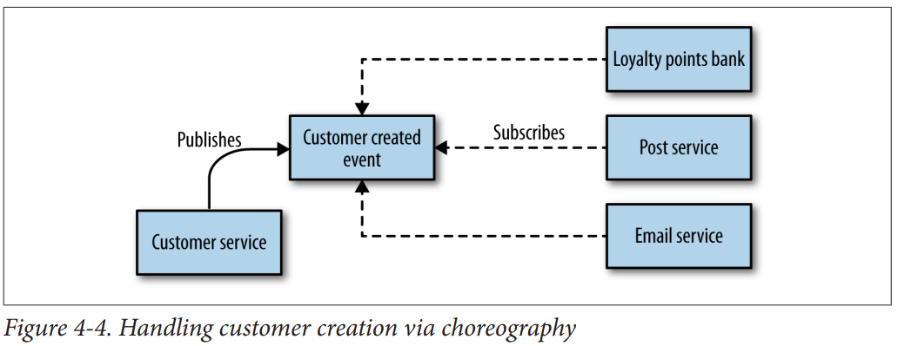

<style>
 mark{
   color: green;
   background-color:black;
   padding:4px;
   border-radius: 3px;
   font-weight: bolder;
 }
 </style>


## Monolith
Everything put together in one process

Monoliths give you &mdash; consistency;
Microservices give you &mdash; Availability

Microservices lose consistency in favor of Availability<mark>CAP Theorem</mark>; so they embrace Eventual Consistency

## Lets have lots of "smart endpoints" and "dumb pipes"
Inspiration for this is the internet itself, works really well innit?


## One Process vs A network of communicating processes
- Independantly replaceable
- Independatly upgradable

## Library vs Service (-> Componentization via services)
_Both Libraries and Services act as "Components" to the host system_

- Library will use the same process as the Host which uses the library
- Service is another process running in its own right, communicating with Host using IPC
  
  _Which is better_ ? :
  Upgradeablilty of Libraries is a Pain ( this shit works only on Java8 etc) whereas services can be independantly upgraded as you wish

## Its Fuzzy when you talk about how "big" a microservice should be
- People say one microservice per responsibility
- But define responsibility?
- How "big" a microservice should be?
- Isnt HTTP too slow at scale when you define too many microservices (?) Alternatives (?) gRPC (?)
  - Netflix has 1000 Microservices [check](https://medium.com/refraction-tech-everything/how-netflix-works-the-hugely-simplified-complex-stuff-that-happens-every-time-you-hit-play-3a40c9be254b)
  - Gilt has 250+ Microservices


## Questions
- SRP on steroids will give birth to too many microservices(?) will this cause harm? will it slow down stuff?
- How is Microservices different from SOA ?

# Service Oriented Architecture
- Multiple Services collaborate to provide some set of capabilities.
- `Service` means completely separate OS process.
- Communications between `Services` occur via network calls.
- Emerged to combat drawbacks of large monoliths
- Aims to `reuse` the same service by two or more applications.

# Decompositional Techniques
1. ### Microservices
2. ### Shared Libraries:
 - Lost heterogenity
    - The code in library has to be in the same language as the host (Java8 example) or at least run in the same platform.

3. Modules

# Building Microservices - Book Notes
  _Designing Fine Grained Systems_

<Mark> Primary Goal = decoupling</Mark>
Model the services right, and get the APIs right.<br>

<Mark>Golden Rule: Can you make a change to the service and deploy it without having to change anything else?</Mark> If no, just dont use microservices.

<Mark> 2 week rule:</Mark> You should be able to write a microservice in 2 weeks; it should be THAT small

  
  Definition: Small autonomous services that work together. Small, focussed on doing one thing well. 
All communication between the services themselves are via network calls, to enforce
separation between the services and avoid the perils of tight coupling.

#### What let do the birth of Microservices
 - Domain-driven design. 
 - Continuous delivery. 
 - On-demand virtualization. 
 - Infrastructure automation. 
 - Small autonomous teams. 
 - Systems at scale. 

## Benefits of Microservices
- Technological Heterogenity
  - Hard to add new/cutting-edge tech to monoliths. But you can do so for a single Microservice
  - Can use the best language/tool/framework/library for a given microservice without worrying about the whole (You wont break anything like in monoliths)
- Resilience
  - In monoliths, if one service fails, everything stops working. So we tend to run multiple instances of the entire monolith on multiple machines to handle failure.
  - But lol, new kinds of failure can happen! network failures &#128163;
- Scaling
  - With smaller services, we can scale only the services you need.
  - With giant monoliths, we have to scale everything as a single piece.
- Ease of Deployment 
  - 1 line change to a huge monolith requires a complete build+redeploy (High-impact High-risk deployment). --> Fear --> Less frequent deployments --> batched changes deployed at once (once in three months and shit) --> changes built up between releases --> Huge delta between releases --> More risk of fucking up 
  - with Microservices, you can shit new features fast. Because they affect smaller units, and can always be rolled back

- Organizational Alignment
  - Microservices allow us to better align our architecture to our organization.
  - Minimize the number of people working on any given codebase.
  - Smaller teams working on smaller codebases tend to be more productive.
- Composability & reusability
  - One microservice designed for one application could potentially be reused or composed to increase its functionality for use by other applications.
- Optimizing for Replaceability
  - freedom to Kill the service and upgrade/replace it when its stack is outdated.
  - When the Microservice codebase is small (2 weeks to develop) lesser the attachment and fear to upgrade/replace it

### Questions you need to answer while architecting Microservices
- How many different Technologies we should use?
- Should we let different teams use different programming idioms?
- Should we split or merge a service?


### What went wrong with Monoliths?
<mark>Though we try to maintain _modularity_ in Monolith codebases; its difficult</mark>
- arbitrary in-process boundaries break down
- Code related to similar functions starts to become spread all over.<br>
  Eventually making fixing bugs, adding features more and more difficult


### On "smallness" of microservices
As you get smaller
- Benefits around interdependence increase &#128077;
- Complexity around more and more moving parts increase &#128078;
  
 As you get better at handling this complexity, you can strive for smaller and smaller services.

 ### Ideal Microservices
 - Should Avoid Breaking Changes (Consumers should not be impacted)
    - Pick a integration technology which helps you avoid this. If a microservice adds a new field to a piece of data it sends out, existing consumers should not be impacted
 - APIs should be techonology agnostic
    - Being microservices, they should have the freedom to change the tech inside their bounded context as they wish, without affecting the boundaries. So dont choose a integration technology that dictates the tech used inside the bounded context


 ## Loose Coupling & High Cohesion ... ( in microservice context)
 1. A loosely coupled service knows very little about the service it communicates with
 2. A loosely coupled service can be independantly upgraded/replaced & redeployed without causing any change in other services
 3. A highly cohesive service has a lot of related concepts/sub-services together in one place.
 4. A highly cohesive service helps you avoid doing N number of releases just to push related changes ( because theyre spread across multiple microservice, though being closely related )

 ## The Bounded Context
  <mark>_specific responsibility enforced by explicit boundaries_</mark>

  If you want information from a `Bounded Context` or want to make requests of functionality within a `Bounded Context`, you communicate with its explicit `Interface` using `Models`
  ### &rarr; One Microservice per Bounded Context &larr;


 Any given domain consists of multiple bounded contexts, and residing within each are _models_ that do not need to be communicated outside as well as _models_ that
are shared externally with other bounded contexts. 

Each bounded context has an
explicit interface, where it decides what models to share with other contexts. 

How to avoid tight coupling?
- Define clearly what `model`s should be shared across boundaries
- Define what `model`s are best kept internal to the `Bounded Context`

When you start thinking about `Bounded Contexts`, Focus on what the context's role is.. this should shape how its endpoints (interfaces, boundaries) look like. Dont focus on the _data_. Doing the latter makes your microservice expose plain CRUD endpoints.
- What does this context do? [ answer this first ]
- What data does it need to achieve that? [ think about this later ]

###  Ubiquitous Language
Also remember to use the _standard_ terminologies used by the business in the code for microservices. ** Refreain from using Synonyms **  ( remember how much pain "withdrawal" and "redemption" caused in FD)

The same terms and ideas that are shared between parts of your organization should be reflected in your interfaces. It can be useful to think of forms being sent between these microservices, much as forms are sent around an organization.


## Premature Decomposition ( into microservices)
If you are new to the domain, keep it monolithic. Because you are not yet familiar with the `Bounded Context`s in the domain. In many ways, monolithic --> split into --> microservices is much easier than trying to go to microservices from the beginning.

## Integration ( the boundary layer of a bounded context )
<mark>SOAP? XML? RPC? Protocol buffers? REST/HTTP?</mark>
>Getting integration right is the single most important aspect of the technology associated with microservices in my opinion.

### - Changes in your microservice should not affect your consumers.( data formats, schema changes etc)
### - your APIs should be tech agnostic
### - your APIs should be easy to use
### - Hide internal implementation detail

### Database integrations 
- Make sure NONE of the internal schemas are exposed. Consumers of the service should have absolutely no clue over the DB side of things. DONT make the APIs look like plain CRUD analogues of the DB table names. If you decide to restructure the DB tables / heavily normalize / denormalize / or entirely change the DB to NoSQL or something, you'll get fucked so bad.
- Imagine for a second that 10 services directly query YOUR DB. 
    - If you change the implementation, theyre fucked ( bye bye loose coupling)
    - If a change in logic has to happen to one concept, and if all those 10 services share this logic, they all should make code change ( bye bye high cohesion)


### Synchronous v/s Asynchronous Integrations? (request/response  OR  event based)
-->Whats your APIs gonna be?<--
- Request/Response
  - Client initiates request and waits for response.(Synchronous)
  - Client initiates request and registers a callback, asking the server to let the client know. (Asychronous). 
    - Lol! looks like request/reponse model can do async stuff too! i n t e r e s t i n g 
  - Ex: RPC , REST/HTTP
- Event Based
  - Client wont "request for anything"
  - Client just "Says" that "this thing happened" and expects all other parties to understand what it means and do the job (trigger).
  - Asynchronous.
  - Highly decoupled. The client that emits an event doesn’t have any way of knowing who or
what will react to it, which also means that you can add new subscribers to these
events without the client ever needing to know.

### Orchestration v/s Choreography
- Orchestration
  - Central Brain, drives all the flows.
- Choreography
  - We let the subsystems know of thier role, and they do their stuff 

#### Example


With Orchestration
* Customer Service would act like the central brain
* It talks to all the services in a series of Request/Response
* "The Brain" can track where the customer is in the process.
* Using synchronous request/response, the brain could know if each phase has worked or not.

Downsides of Orchestration
- Customer service can become too much of a central governing authority. 
- Too much logic in one place. 
- "_I have seen this approach result in a small number of smart “god” services telling anemic CRUD-based services what to
do_".
- Extremely Brittle, higher cost of change.


With Choreography
- Customer Service `emits an event` in an asynchronous manner, saying Customer created.
- Other Services `subscribe` to these events and react accordingly.
- SIGNIFICANTLY decoupled.
- More amenable to change.

Downsides of Choreography
- More effort needed to monitor and track that right thing is happening.
- More effort needed to monitor and track the processess across service boundaries.


> ** Synchronous calls are simpler, and we get to know if things worked straightaway. If we like the semantics of request/response but are dealing with longer-lived processes, we could just initiate asynchronous requests and wait for callbacks. 
<br>
** On the other hand, asynchronous event collaboration helps us adopt a choreographed approach, which can yield significantly more decoupled services—something we want to strive for to ensure our services are independently releasable.

___ 
===========> Request Response Collaboration <===========================
### RPC
- Make the process of executing code on a remote machine as simple and straight-forward as calling a local function. "_Make a remote call look like a local call_"
- Core idea of RPC is to hide the complexity of remote calls ,and make it look just like local call


 - Developer writes the Interface definition for a service using IDL [Interface Definition Language](https://stackoverflow.com/a/670681). WSDL and .proto are examples for IDL
 - Stub generators generate client and server stubs for this service.
 - Ex: In SOAP, there is a [WSDL interface](https://docs.jboss.org/author/display/MODE50/Web%20Service%20Definition%20Language%20(WSDL)%20files.html)
 - Ex: In protobuf, there are [.proto files](https://en.wikipedia.org/wiki/Protocol_Buffers#Example)

 Advantages
 - can onboard very quickly. zero effort in generating a wsdl file for a service interface.
 
 Downsides
 - RPC comes with a restrictions on interoperability
 - Java RMI, unlike SOAP and protobuf, tightly couples the technology
    - Limits which tech can be used in client and server stubs
 - RPC is brittle

```
import java.rmi.Remote;
import java.rmi.RemoteException;

public interface CustomerRemote extends Remote {

 public Customer findCustomer(String id) throws RemoteException;

 public Customer createCustomer(String firstname, String surname, String emailAddress)
  throws RemoteException;
}
```
^ you made a RPC interface for this service like this.<br>
Now what if you want to add an extra method?<br>
You would have to regenerate client stubs

You also cannot remove some attributes from schema, cas unmarshalling would break at client side (even if the client was not using that attribute!!)


### REST 
- Alternative to RPC for service interfaces
- Concept of a `Resource`
  - The `Resource` shown externally is completely decoupled from how it is stored internally
- Client can 
  - Create a resource (POST)
  - Request a resource (GET)
  - Update a resource (PATCH)
- [Richardson Maturity Model](https://martinfowler.com/articles/richardsonMaturityModel.html) for developing rest services
- HTTP itself defines some useful capabilities that play very well with the REST style. (HTTP Veribs, error codes)

HATEOS
- Hypermedia As The Engine of Application State
- Every Response of a REST call will contains _links_ to other related resources. - Checkout [HAL](http://stateless.co/hal_specification.html) specification
- Helps you avoid coupling between client and server.
  - You can now change the URLs of resources as you wish, as it would be dynamically communicated to the clients via _related resources_ links. Client now doesnt have to hardcode the resource links in his system
  - > As a client, I don’t need to know which URI scheme to access to buy the album, I just
need to access the resource, find the buy control, and navigate to that. 
- By following the links, the client gets to progressively discover the API,
which can be a really handy capability when we are implementing new clients.
- Downside is that navigation of these controls can be quite chatty

Beware of REST "Convinience libraries"
- some frameworks actually make it very easy to
simply take database representations of objects, deserialize them into in-process
objects, and then directly expose these externally. I remember at a conference seeing
this demonstrated using Spring Boot and cited as a major advantage. The inherent
coupling that this setup promotes will in most cases cause far more pain than the
effort required to properly decouple these concepts.

Takeaways:
- Delay the implementation of proper persistence for the microservice, until the interface had stabilized enough.  
-  It is too easy for the way we store domain entities in a backing store to overtly influence the models we send over the wire to collaborators. 

Downsides of REST/HTTP
- A more minor point is that some web server frameworks don’t actually support all the
HTTP verbs well. That means that it might be easy for you to create a handler for
GET or POST requests, but you may have to jump through hoops to get PUT or
DELETE requests to work. Proper REST frameworks like Jersey don’t have this prob‐
lem, and you can normally work around this, but if you are locked into certain frame‐
work choices this might limit what style of REST you can use.
- Performance: SLOW!, gRPC is way fast. HTTP is not good for low latency requirements. TCP is boss!
- For server-to-server communications, if extremely low latency or small message size
is important, HTTP communications in general may not be a good idea. You may
need to pick different underlying protocols, like User Datagram Protocol (UDP), to
achieve the performance you want, and many RPC frameworks will quite happily run
on top of networking protocols other than TCP.
---
============>Asynchronous Event Based Collaboration<=====================<br>
-PUB/SUB-<br>
Traditionally, message brokers like RabbitMQ give you 
  - A way to _emit_ events
  - A way to _subscribe_ to events

Upsides
  - Resilient and scalable
  - Nice loosely coupled event driven architectures!

Downsides
  - Adds complexity to your development.
  - Additional infra is needed, Additional expertise is needed
  - Needs a lot of effort on good logging and monitoring
  - Good logging and tracing: consider the use of correlation IDs, which allow you to trace requests across process boundaries
  - Consider a long running async request/respons
    - what to do when the response comes back?
    - does it come back to the same node that initiated the request?
    - what if that node is down?
    - Do I need to store the response elsewhere so i can respond accordingly
  - Different way of thinking for devs who are accustomed to intra-process synchronous message calls


### Do not DRY microservices
- Don’t violate DRY within a microservice
- But be relaxed about violating DRY across all services. 
- Having a shared library, forces all consumers of that library to change when changes need to be pushed to that shared library

The evils of too much coupling between services are far worse than the problems caused by code duplication.

## Client Libraries
- Libraries that consume the APIs of your service.
- Better to create them to avoid code duplication and increase onboarding speed.
- But, people who wrote the service should stay away from writing client libraries.
    - Server logic starts leaking into client libraries!
    


