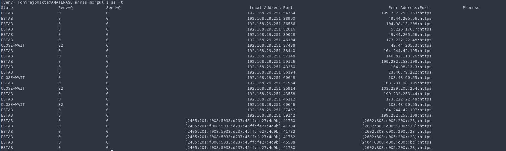
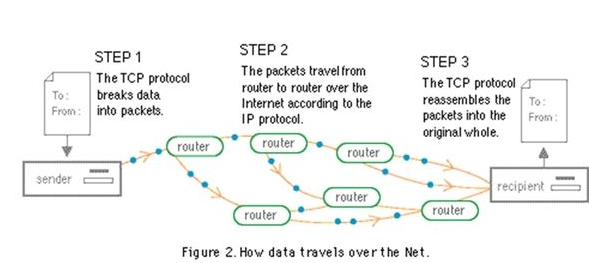

# Big Picture 

  - The internetwork environment consists of hosts connected to networks
  which are in turn interconnected via gateways.   
  - The active agents that produce and
  consume messages are processes.  
  - Various levels of protocols in the
  networks, the gateways, and the hosts support an interprocess
  communication system that provides two-way data flow on **logical
  connections between process ports**.

  - Hosts are computers attached to a network, and from the communication
  network's point of view, are the sources and destinations of packets.
  - Processes are viewed as the active elements in host computers .Even terminals and files or other I/O devices are
  viewed as communicating with each other through the use of processes.

  **Thus, all communication is viewed as inter-process communication.**

  Since a process may need to distinguish among several communication
  streams between itself and another process (or processes),
   each process may have a number of ports through which it
  communicates with the ports of other processes.


# Tools

## &#9874; nslookup
## &#9874; curl 

## &#9874; `ping <host>`
- ICMP 
- IP Layer (Network Layer) (Layer 3)
- tells if the host is up

## &#9874; `traceroute`

## &#9874; `ss` 
- _Socket Statistics_
- is a replacement for `netstat`

#### Usage :`ss` 
- List of only "NON listening" sockets that have "ESTABLISHED" connections

#### Usage : `ss -l`
- List of only "listening" sockets

#### Usage : `ss -a`
- = `ss -l` + `ss` ( listening + established(non-listening) )

#### Usage : `ss -t`  `ss -u` `ss -x`
- Show TCP only, UDP only, Unix sockets only
---
- When I had a lot of tabs open

- When I closed Chrome


# Protocol Basics

## ⛳️ ICMP &mdash; Internet Control Message Protocol
- Network Layer 3 Protocol


### Why does it exist?
- To handle **error handling** in Network Layer ( also a bit of "querying" handling, i,e "Are you alive _pings_")
- A lot of variations of errors can happen in Network Layer, ICMP provides diagnostics for the same with enumerised error msgs.
-
    - (SOURCE QUENCH)Handles congestion/source control 
        - Router asks the source to calm down and send packets at a slower rate
        - It says the packet has been "discarded" due to congestion, and asks for resend -- at a calmer pace
    - (TIME EXCEEDED)
        - if TTL expires midway for a packet, TIME EXCEEDED err is sent back to source
        - or if all the _fragments_ of a packet did not arrive in order, theyre discarded and err is sent back to source
    - ICMP redirects
        - If host A wants to send message to host B, it does through router, and if router realizes both these hosts are on same network, router sends ICMP REDIRECT to host A to update its routing table so that it can communicate with host B directly

        - If host A wants to send message to outside network, it does through default router(gateway), and if router realizes that its next hop is a router which is on the name network as host A, router sends ICMP REDIRECT to host A to update its routing table so that it can take a shorter path and send its messages through router 2

- Primarily used in Routers


## ⛳️ TCP &mdash; Transmission Control Protocol
> To enable **Process-to-Process communications** _reliably_ across hosts
- Transport Layer (Layer 4)
- **Connection Oriented**
- Note: Provides _reliable_ connection on top of a _less reliable_ Internet Layer

### Where TCP fits in
       +------+ +-----+ +-----+       +-----+
       |Telnet| | FTP | |Voice|  ...  |     |  Application Level
       +------+ +-----+ +-----+       +-----+
             |   |         |             |
            +-----+     +-----+       +-----+
            | TCP |     | RTP |  ...  |     |  Host Level
            +-----+     +-----+       +-----+
               |           |             |
            +-------------------------------+
            |    Internet Protocol & ICMP   |  Gateway Level
            +-------------------------------+
                           |
              +---------------------------+
              |   Local Network Protocol  |    Network Level
              +---------------------------+

### TCP Layer as an "interface"
                        +---------------------+
                        |     higher-level    |
                        +---------------------+
                        |        TCP          |
                        +---------------------+
                        |  internet protocol  |
                        +---------------------+
                        |communication network|
                        +---------------------+
##### Interface to the _Applications_
- Yes, TCP would be a module in the OS
- It provides for calls made by the user on the TCP 
    * To OPEN/CLOSE a connection.
    * to SEND/RECIEVE data.
    * to obtain STATUS of a connection.
    ~ These calls are like other calls from user programs on the OS, 
    for example, the calls to open, read from, and close a file.
- TCP module would call the IP module, which in turn calls the  [network device drivers](https://www.cse.iitb.ac.in/~bestin/btech-proj/slip/x129.html)

##### Interface to the lower layer (Internet Layer)
- pass

### TCP as a reliable layer
TCP recovers from data that is damaged, lost, duplicated, or
delivered out of order by the lower Internet Layer.  

##### How does TCP address _out-of-order_ delivery?
- via `sequence-number` attached to each octet sent
- checked at the reciever end. ( also checks for duplicates)

##### How does TCP address data loss?
- sender expects ACK for each octet sent.
- If the ACK is not received within a timeout
interval, the data is retransmitted.

##### How does TCP address data damage?
- Adds a checksum to each octet transmitted

### TCP Connection
A _connection_ is uniquely specified by a pair of sockets
identifying its two sides.

##### When 2 processes want to communicate
- Connection Establishment  (init status info on each side [ window size, sequence number, socket info etc])
- Close the Connection after use.

##### TCP Connection = Full Duplex Connection
- Carries data in both directions

#### Connection details
 - ` connection = TCPmodule.OPEN( local_port, (remote_IP, remote_port) )`
 - Here, "connection" is a pointer to the TCB(Transmission Control Block), a data structure which stores info about the connection.
 - The OPEN call also specifies whether the connection establishment is to be actively pursued, or to
  be passively waited for.
    - **A passive OPEN request** 
        - Used by a _service process_ that wishes to <u>provide services</U> for other unknown processes.
        - "Passive OPEN request" means that the process wants to accept incoming connection requests rather than attempting to initiate a connection.
        - But at the moment, it doesnt know the socket on the other side (foreign socket),  so a foreign socket of all zeros is used to denote an unspecified socket. 
        - Unspecified foreign sockets are allowed only on passive OPENs.
        ```
        ** Well-known sockets ** 
        A convenient mechanism for a priori associating a socket address with a standard service.  
        
        For instance, the "Telnet-Server" process is permanently assigned to a particular socket, 
        and other sockets are reserved for File Transfer, Remote Job Entry
        
        A socket address might be reserved for access to a "Look-Up" service which would return the specific socket
        at which a newly created service would be provided. �😱😱😱😱
        ```
    - **An Actively pursued OPEN request**
        - Used by _client processes_ to talk to service process which already OPENed a passive connection.
        - Also Used by _client processes_ to talk to other processes which already OPENed a active connection.
        - It should `OPEN` the connection with complete socket address of the foreign socket.
    -   Processes can issue passive OPENs and wait for matching active OPENs from other processes and be informed by the TCP when connections have been established.  
    - Two processes which issue active OPENs to each other at the same time will be correctly connected.  This flexibility is critical for the support of distributed computing in which components act asynchronously with respect to each other.

    - There are two principal cases for matching the sockets in the local passive OPENs and an foreign active OPENs.  
        - In the first case, the local passive OPENs has fully specified the foreign socket.  In this
  case, the match must be exact.  
        - In the second case, the local passive OPENs has left the foreign socket unspecified.  In this case, any foreign socket is acceptable as long as the local sockets match.

### TCP Connection &mdash; Establishment: The handshake

  
  A connection is initiated by the rendezvous of an arriving segment
  containing a SYN and a waiting TCB entry each created by a user OPEN
  command.  The matching of local and foreign sockets determines when a
  connection has been initiated.  The connection becomes "ESTABLISHED"
  when sequence numbers have been synchronized in both directions.

  The clearing of a connection also involves the exchange of segments,
  in this case carrying the FIN control flag.

Since connections must be established between unreliable hosts and
over the unreliable internet communication system, a handshake
mechanism with clock-based sequence numbers is used to avoid
erroneous initialization of connections.

### TCP Connection &mdash; Data Communication
 - The data that flows on a connection may be thought of as a **stream of
  octets**.  
 - a SEND call of TCPModule is used to push application data into TCP segments. _May or may not be **actually** sent, because the TCP module "sends" the segment only when its fully filled OR **PUSH** Flag is set in the SEND call, which signifies the urgency to immediately send the segment and not wait for it to be completely filled_
 - **NOTE** : The data in any particular segment may be the result of a
  single SEND call, in whole or part, or of multiple SEND calls.

### TCP Connection &mdash; States

A connection progresses through a series of states during its lifetime.
```python

                              +---------+ ---------\      active OPEN
                              |'CLOSED' |            \    -----------
                              +---------+<---------\   \   create TCB
                                |     ^              \   \  snd SYN
                   passive OPEN |     |   CLOSE        \   \
                   ------------ |     | ----------       \   \
                    create TCB  |     | delete TCB         \   \
                                V     |                      \   \
                              +---------+            CLOSE    |    \
                              |  LISTEN |          ---------- |     |
                              +---------+          delete TCB |     |
                   rcv SYN      |     |     SEND              |     |
                  -----------   |     |    -------            |     V
 +---------+      snd SYN,ACK  /       \   snd SYN          +---------+
 |         |<-----------------           ------------------>|         |
 |   SYN   |                    rcv SYN                     |   SYN   |
 |   RCVD  |<-----------------------------------------------|   SENT  |
 |         |                    snd ACK                     |         |
 |         |------------------           -------------------|         |
 +---------+   rcv ACK of SYN  \       /  rcv SYN,ACK       +---------+
   |           --------------   |     |   -----------
   |                  x         |     |     snd ACK
   |                            V     V
   |  CLOSE                +---------------+
   | -------               | 'ESTABLISHED' |
   | snd FIN               +---------------+
   |                   CLOSE    |     |    rcv FIN
   V                  -------   |     |    -------
 +---------+          snd FIN  /       \   snd ACK          +---------+
 |  FIN    |<-----------------           ------------------>|  CLOSE  |
 | WAIT-1  |------------------                              |   WAIT  |
 +---------+          rcv FIN  \                            +---------+
   | rcv ACK of FIN   -------   |                            CLOSE  |
   | --------------   snd ACK   |                           ------- |
   V        x                   V                           snd FIN V
 +---------+                  +---------+                   +---------+
 |FINWAIT-2|                  | CLOSING |                   | LAST-ACK|
 +---------+                  +---------+                   +---------+
   |                rcv ACK of FIN |                 rcv ACK of FIN |
   |  rcv FIN       -------------- |    Timeout=2MSL -------------- |
   |  -------              x       V    ------------        x       V
    \ snd ACK                 +---------+delete TCB         +---------+
     ------------------------>|TIME WAIT|------------------>|'CLOSED' |
                              +---------+                   +---------+

                      TCP Connection State Diagram
```
```haskell
LISTEN - represents waiting for a connection request from any remote TCP and port.

SYN-SENT - represents waiting for a matching connection request after having sent a connection request.

SYN-RECEIVED - represents waiting for a confirming connection request acknowledgment after having both received and sent a connection request.

-------------------------------------------------------------
ESTABLISHED - represents an "open connection"
              The normal state for the "data transfer phase of the connection".
-------------------------------------------------------------

FIN-WAIT-1 - represents waiting for a connection termination request from the ::remote TCP::, or an acknowledgment of the connection termination request previously sent.

FIN-WAIT-2 - represents waiting for a connection termination request from the ::remote TCP::

CLOSE-WAIT - represents waiting for a connection termination request from the ::local user::

CLOSING - represents waiting for a connection termination request acknowledgment from the ::remote TCP.::

LAST-ACK - represents waiting for an acknowledgment of the connection termination request previously sent to the remote TCP (which includes an acknowledgment of its connection termination request).

TIME-WAIT - represents waiting for enough time to pass to be sure the remote TCP received the acknowledgment of its connection termination request.

-----------------------------------------------------------
CLOSED - represents no connection state at all. or "Closed connection"
         CLOSED is fictional state because it represents the state when there is no TCB, and therefore, no connection.
-----------------------------------------------------------
```
  A TCP connection progresses from one state to another in response to
  events.  The events are the user calls, OPEN, SEND, RECEIVE, CLOSE,
  ABORT, and STATUS; the incoming segments, particularly those
  containing the SYN, ACK, RST and FIN flags; and timeouts.
### How TCP works
#### Summarized view

- Processes call the [TCP module](#interface-to-the-applications) and pass the _data-buffers-to-be-transmitted_ as arguments

- The TCP packages the data from these buffers into **segments** 
- TCP module calls the **IPModule** to transmit each segment to
  the destination TCP.  
 - The receiving TCP places the data from a segment
  into the receiving user's buffer and notifies the receiving user.  
  
  The TCPs include control information in the segments which they use to
  ensure reliable ordered data transmission.

  #### Detailed view

  `Process` -->(data buffer) --> `TCP module` --> (segments) --> `IP module` ---> (internet datagrams) --> `Network device drivers`

  The model of internet communication is that there is an **internet
  protocol module** associated with each TCP which provides an interface
  to the local network.  This internet module packages TCP segments
  inside internet datagrams and routes these datagrams to a destination
  internet module or intermediate gateway.  To transmit the datagram
  through the local network, it is embedded in a local network packet.

  The packet switches may perform further packaging, fragmentation, or other operations to achieve the delivery of the local packet to the
  destination internet module.

  At a gateway between networks, the internet datagram is "unwrapped"
  from its local packet and examined to determine through which network
  the internet datagram should travel next.  The internet datagram is
  then "wrapped" in a local packet suitable to the next network and
  routed to the next gateway, or to the final destination.

  A gateway is permitted to break up an internet datagram into smaller
  internet datagram fragments if this is necessary for transmission
  through the next network.  To do this, the gateway produces a set of
  internet datagrams; each carrying a fragment.  Fragments may be
  further broken into smaller fragments at subsequent gateways.  The
  internet datagram fragment format is designed so that the destination
  internet module can reassemble fragments into internet datagrams.

  A destination internet module unwraps the segment from the datagram
  (after reassembling the datagram, if necessary) and passes it to the
  destination TCP.


# Concepts

## ☂️ Port
- The Ports we talk about (TCP/UDP/Unix) are **virtual ports**

- Only ONE process can **bind** to a port on the same host, at a given time.

#### What is the difference between "Bind"ing to a port and "Listen"ing to a port?

## ☂️ Socket = `IP + Port`
_A pair of sockets uniquely identifies a connection._
  - A _local_ socket may participate in many connections to different _foreign
  sockets_

#### [What is a "Unix" Socket, how is it different from TCP, UDP sockets?](https://lists.freebsd.org/pipermail/freebsd-performance/2005-February/001143.html)
- Also called "IPC Socket"
- Exists for IPC on the same host
- The API for Unix domain sockets is similar to that of an Internet socket, but rather than using an underlying network protocol, **all communication occurs entirely within the operating system kernel**
- Processes reference Unix domain sockets as file system inodes, **so two processes can communicate by opening the same socket**. Since Unix sockets use file system as the address name space, you can use UNIX file permissions to control access to communicate with them
- Performance Benefits over TCP sockets.(Why cant I just use IP sockets instead of Unix sockets?)
    -  IP sockets over localhost are basically looped back network on-the-wire
  IP.  There is intentionally "no special knowledge" of the fact that the
  connection is to the same system, so no effort is made to bypass the
  normal IP stack mechanisms for performance reasons.  For example,
  transmission over TCP will always involve two context switches to get to
  the remote socket, as you have to switch through the netisr, which
  occurs following the "loopback" of the packet through the synthetic
  loopback interface.  Likewise, you get all the overhead of ACKs, TCP
  flow control, encapsulation/decapsulation, etc.  Routing will be
  performed in order to decide if the packets go to the localhost.
  Large sends will have to be broken down into MTU-size datagrams, which
  also adds overhead for large writes. 

#### What is a "Listening" socket
_See [this](#tcp-connection--states)_
#### What is an "Established" connection?
_See [this](#tcp-connection--states)_
## Flow Control (Congestion Control)
When the sender sends packets too fast, faster than what the network can handle , "Congestion" of packets happen

## TTL (time-to-live) 
- Number of hops (routers) between source to dest.
- each router decrements the TTL by one

## Fragmentation

## SSL Certificates
//TODO, more on this when I reach Application Layer 7

An SSL certificate is a data file hosted in a website's origin server. SSL certificates make SSL/TLS encryption possible, and they contain the website's public key and the website's identity, along with related information. Devices attempting to communicate with the origin server will reference this file to obtain the public key and verify the server's identity. The private key is kept secret and secure.

Once you decided to get SSL certificate for your website, you have two choices as below.

- Self-Signed Certificate (Ideal for testing environment only)
- Commercial CA-Signed Certificate (Most trusted and authenticated)

# Layer Basics

## Network Layer (Layer 3)

# Questions
- What does it mean to be a "network layer thing " or "layer 3 thing"?
- What do we mean by "TCP is reliable"?
- List down the "unit" of transfer for each layer (packet, datagram, segment etc)?
- HTTPS?
  - certificates? self-signed certs? chain cert root cert?