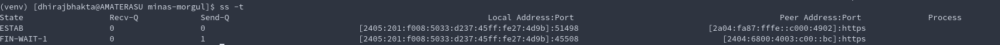

[Book: Networking for Systems Adminstrations by Michael W Lucas](https://www.amazon.in/Networking-Systems-Administrators-Mastery-Book-ebook/dp/B00STLTH74/ref=cm_cr_arp_d_product_top?ie=UTF8)

# Before we begin
### powers of 2
 2^0  = 1<br>
 2^1  = 2<br>
 2^2  = 4<br>
 2^3  = 8<br>
 2^4  = 16<br>
 **`2^5  = 32`**<br>
 2^6  = 64<br>
 2^7  = 128<br>
 **`2^8  = 256`**<br>
 2^9  = 512<br>
**`2^10  = 1024`**
# Big Picture 

  - The internetwork environment consists of hosts connected to networks
  which are in turn interconnected via gateways.   
  - The active agents that produce and
  consume messages are processes.  
  - Various levels of protocols in the
  networks, the gateways, and the hosts support an interprocess
  communication system that provides two-way data flow on **logical
  connections between process ports**.

  - Hosts are computers attached to a network, and from the communication
  network's point of view, are the sources and destinations of packets.
  - Processes are viewed as the active elements in host computers .Even terminals and files or other I/O devices are
  viewed as communicating with each other through the use of processes.

  **Thus, all communication is viewed as inter-process communication.**

  Since a process may need to distinguish among several communication
  streams between itself and another process (or processes),
   each process may have a number of ports through which it
  communicates with the ports of other processes.


# Tools


## &#9874; ifconfig 
Short for "Interface  Config"<br>
**replacement** : `ip` command
Show all network  interfaces
## &#9874; route 
Shows the kernel's routing table
**alternative** : `netsate -nr`
## &#9874; grep
## &#9874; netstat 
**replacement** : `ss` command
## &#9874; lsof 
What processes open which files.
## &#9874; tcpdump & wireshark 
## &#9874; netcat  or `nc`
create a dummy server to "listen" to a port, <br>
send packets to an arbitrary port
## &#9874; traceroute 
List the hops in the entire journey
## &#9874; host 
## &#9874; nslookup 
**replacement** :`host`
## &#9874; curl 

## &#9874; `ping <host>`
- ICMP 
- IP Layer (Network Layer) (Layer 3)
- tells if the host is up

## &#9874; `traceroute`

## &#9874; `ss` 
- _Socket Statistics_
- is a replacement for `netstat`

#### Usage :`ss` 
- List of only "NON listening" sockets that have "ESTABLISHED" connections

#### Usage : `ss -l`
- List of only "listening" sockets

#### Usage : `ss -a`
- = `ss -l` + `ss` ( listening + established(non-listening) )

#### Usage : `ss -t`  `ss -u` `ss -x`
- Show TCP only, UDP only, Unix sockets only
---
- When I had a lot of tabs open

- When I closed Chrome



# Protocol Basics

## ⛳️ ICMP &mdash; Internet Control Message Protocol
- Network Layer 3 Protocol


### Why does it exist?
- To handle **error handling** in Network Layer ( also a bit of "querying" handling, i,e "Are you alive _pings_")
- A lot of variations of errors can happen in Network Layer, ICMP provides diagnostics for the same with enumerised error msgs.
-
    - (SOURCE QUENCH)Handles congestion/source control 
        - Router asks the source to calm down and send packets at a slower rate
        - It says the packet has been "discarded" due to congestion, and asks for resend -- at a calmer pace
    - (TIME EXCEEDED)
        - if TTL expires midway for a packet, TIME EXCEEDED err is sent back to source
        - or if all the _fragments_ of a packet did not arrive in order, theyre discarded and err is sent back to source
    - ICMP redirects
        - If host A wants to send message to host B, it does through router, and if router realizes both these hosts are on same network, router sends ICMP REDIRECT to host A to update its routing table so that it can communicate with host B directly

        - If host A wants to send message to outside network, it does through default router(gateway), and if router realizes that its next hop is a router which is on the name network as host A, router sends ICMP REDIRECT to host A to update its routing table so that it can take a shorter path and send its messages through router 2

- Primarily used in Routers


## ⛳️ TCP &mdash; Transmission Control Protocol
> To enable **Process-to-Process communications** _reliably_ across hosts
- Transport Layer (Layer 4)
- **Connection Oriented**
- Note: Provides _reliable_ connection on top of a _less reliable_ Internet Layer

### Where TCP fits in
       +------+ +-----+ +-----+       +-----+
       |Telnet| | FTP | |Voice|  ...  |     |  Application Level
       +------+ +-----+ +-----+       +-----+
             |   |         |             |
            +-----+     +-----+       +-----+
            | TCP |     | RTP |  ...  |     |  Host Level
            +-----+     +-----+       +-----+
               |           |             |
            +-------------------------------+
            |    Internet Protocol & ICMP   |  Gateway Level
            +-------------------------------+
                           |
              +---------------------------+
              |   Local Network Protocol  |    Network Level
              +---------------------------+

### TCP Layer as an "interface"
                        +---------------------+
                        |     higher-level    |
                        +---------------------+
                        |        TCP          |
                        +---------------------+
                        |  internet protocol  |
                        +---------------------+
                        |communication network|
                        +---------------------+
##### Interface to the _Applications_
- Yes, TCP would be a module in the OS
- It provides for calls made by the user on the TCP 
    * To OPEN/CLOSE a connection.
    * to SEND/RECIEVE data.
    * to obtain STATUS of a connection.
    ~ These calls are like other calls from user programs on the OS, 
    for example, the calls to open, read from, and close a file.
- TCP module would call the IP module, which in turn calls the  [network device drivers](https://www.cse.iitb.ac.in/~bestin/btech-proj/slip/x129.html)

##### Interface to the lower layer (Internet Layer)
- pass

### TCP as a reliable layer
TCP recovers from data that is damaged, lost, duplicated, or
delivered out of order by the lower Internet Layer.  

##### How does TCP address _out-of-order_ delivery?
- via `sequence-number` attached to each octet sent
- checked at the reciever end. ( also checks for duplicates)

##### How does TCP address data loss?
- sender expects ACK for each octet sent.
- If the ACK is not received within a timeout
interval, the data is retransmitted.

##### How does TCP address data damage?
- Adds a checksum to each octet transmitted

### TCP Connection
A _connection_ is uniquely specified by a pair of sockets
identifying its two sides.

##### When 2 processes want to communicate
- Connection Establishment  (init status info on each side [ window size, sequence number, socket info etc])
- Close the Connection after use.

##### TCP Connection = Full Duplex Connection
- Carries data in both directions

#### Connection details
 - ` connection = TCPmodule.OPEN( local_port, (remote_IP, remote_port) )`
 - Here, "connection" is a pointer to the TCB(Transmission Control Block), a data structure which stores info about the connection.
 - The OPEN call also specifies whether the connection establishment is to be actively pursued, or to
  be passively waited for.
    - **A passive OPEN request** 
        - Used by a _service process_ that wishes to <u>provide services</U> for other unknown processes.
        - "Passive OPEN request" means that the process wants to accept incoming connection requests rather than attempting to initiate a connection.
        - But at the moment, it doesnt know the socket on the other side (foreign socket),  so a foreign socket of all zeros is used to denote an unspecified socket. 
        - Unspecified foreign sockets are allowed only on passive OPENs.
        ```
        ** Well-known sockets ** 
        A convenient mechanism for a priori associating a socket address with a standard service.  
        
        For instance, the "Telnet-Server" process is permanently assigned to a particular socket, 
        and other sockets are reserved for File Transfer, Remote Job Entry
        
        A socket address might be reserved for access to a "Look-Up" service which would return the specific socket
        at which a newly created service would be provided. �😱😱😱😱
        ```
    - **An Actively pursued OPEN request**
        - Used by _client processes_ to talk to service process which already OPENed a passive connection.
        - Also Used by _client processes_ to talk to other processes which already OPENed a active connection.
        - It should `OPEN` the connection with complete socket address of the foreign socket.
    -   Processes can issue passive OPENs and wait for matching active OPENs from other processes and be informed by the TCP when connections have been established.  
    - Two processes which issue active OPENs to each other at the same time will be correctly connected.  This flexibility is critical for the support of distributed computing in which components act asynchronously with respect to each other.

    - There are two principal cases for matching the sockets in the local passive OPENs and an foreign active OPENs.  
        - In the first case, the local passive OPENs has fully specified the foreign socket.  In this
  case, the match must be exact.  
        - In the second case, the local passive OPENs has left the foreign socket unspecified.  In this case, any foreign socket is acceptable as long as the local sockets match.

### TCP Connection &mdash; Establishment: The handshake

  
  A connection is initiated by the rendezvous of an arriving segment
  containing a SYN and a waiting TCB entry each created by a user OPEN
  command.  The matching of local and foreign sockets determines when a
  connection has been initiated.  The connection becomes "ESTABLISHED"
  when sequence numbers have been synchronized in both directions.

  The clearing of a connection also involves the exchange of segments,
  in this case carrying the FIN control flag.

Since connections must be established between unreliable hosts and
over the unreliable internet communication system, a handshake
mechanism with clock-based sequence numbers is used to avoid
erroneous initialization of connections.

### TCP Connection &mdash; Data Communication
 - The data that flows on a connection may be thought of as a **stream of
  octets**.  
 - a SEND call of TCPModule is used to push application data into TCP segments. _May or may not be **actually** sent, because the TCP module "sends" the segment only when its fully filled OR **PUSH** Flag is set in the SEND call, which signifies the urgency to immediately send the segment and not wait for it to be completely filled_
 - **NOTE** : The data in any particular segment may be the result of a
  single SEND call, in whole or part, or of multiple SEND calls.

### TCP Connection &mdash; States

A connection progresses through a series of states during its lifetime.
```python

                              +---------+ ---------\      active OPEN
                              |'CLOSED' |            \    -----------
                              +---------+<---------\   \   create TCB
                                |     ^              \   \  snd SYN
                   passive OPEN |     |   CLOSE        \   \
                   ------------ |     | ----------       \   \
                    create TCB  |     | delete TCB         \   \
                                V     |                      \   \
                              +---------+            CLOSE    |    \
                              |  LISTEN |          ---------- |     |
                              +---------+          delete TCB |     |
                   rcv SYN      |     |     SEND              |     |
                  -----------   |     |    -------            |     V
 +---------+      snd SYN,ACK  /       \   snd SYN          +---------+
 |         |<-----------------           ------------------>|         |
 |   SYN   |                    rcv SYN                     |   SYN   |
 |   RCVD  |<-----------------------------------------------|   SENT  |
 |         |                    snd ACK                     |         |
 |         |------------------           -------------------|         |
 +---------+   rcv ACK of SYN  \       /  rcv SYN,ACK       +---------+
   |           --------------   |     |   -----------
   |                  x         |     |     snd ACK
   |                            V     V
   |  CLOSE                +---------------+
   | -------               | 'ESTABLISHED' |
   | snd FIN               +---------------+
   |                   CLOSE    |     |    rcv FIN
   V                  -------   |     |    -------
 +---------+          snd FIN  /       \   snd ACK          +---------+
 |  FIN    |<-----------------           ------------------>|  CLOSE  |
 | WAIT-1  |------------------                              |   WAIT  |
 +---------+          rcv FIN  \                            +---------+
   | rcv ACK of FIN   -------   |                            CLOSE  |
   | --------------   snd ACK   |                           ------- |
   V        x                   V                           snd FIN V
 +---------+                  +---------+                   +---------+
 |FINWAIT-2|                  | CLOSING |                   | LAST-ACK|
 +---------+                  +---------+                   +---------+
   |                rcv ACK of FIN |                 rcv ACK of FIN |
   |  rcv FIN       -------------- |    Timeout=2MSL -------------- |
   |  -------              x       V    ------------        x       V
    \ snd ACK                 +---------+delete TCB         +---------+
     ------------------------>|TIME WAIT|------------------>|'CLOSED' |
                              +---------+                   +---------+

                      TCP Connection State Diagram
```
```haskell
LISTEN - represents waiting for a connection request from any remote TCP and port.

SYN-SENT - represents waiting for a matching connection request after having sent a connection request.

SYN-RECEIVED - represents waiting for a confirming connection request acknowledgment after having both received and sent a connection request.

-------------------------------------------------------------
ESTABLISHED - represents an "open connection"
              The normal state for the "data transfer phase of the connection".
-------------------------------------------------------------

FIN-WAIT-1 - represents waiting for a connection termination request from the ::remote TCP::, or an acknowledgment of the connection termination request previously sent.

FIN-WAIT-2 - represents waiting for a connection termination request from the ::remote TCP::

CLOSE-WAIT - represents waiting for a connection termination request from the ::local user::

CLOSING - represents waiting for a connection termination request acknowledgment from the ::remote TCP.::

LAST-ACK - represents waiting for an acknowledgment of the connection termination request previously sent to the remote TCP (which includes an acknowledgment of its connection termination request).

TIME-WAIT - represents waiting for enough time to pass to be sure the remote TCP received the acknowledgment of its connection termination request.

-----------------------------------------------------------
CLOSED - represents no connection state at all. or "Closed connection"
         CLOSED is fictional state because it represents the state when there is no TCB, and therefore, no connection.
-----------------------------------------------------------
```
  A TCP connection progresses from one state to another in response to
  events.  The events are the user calls, OPEN, SEND, RECEIVE, CLOSE,
  ABORT, and STATUS; the incoming segments, particularly those
  containing the SYN, ACK, RST and FIN flags; and timeouts.
### How TCP works
#### Summarized view

- Processes call the [TCP module](#interface-to-the-applications) and pass the _data-buffers-to-be-transmitted_ as arguments

- The TCP packages the data from these buffers into **segments** 
- TCP module calls the **IPModule** to transmit each segment to
  the destination TCP.  
 - The receiving TCP places the data from a segment
  into the receiving user's buffer and notifies the receiving user.  
  
  The TCPs include control information in the segments which they use to
  ensure reliable ordered data transmission.

  #### Detailed view

  `Process` -->(data buffer) --> `TCP module` --> (segments) --> `IP module` ---> (internet datagrams) --> `Network device drivers`

  The model of internet communication is that there is an **internet
  protocol module** associated with each TCP which provides an interface
  to the local network.  This internet module packages TCP segments
  inside internet datagrams and routes these datagrams to a destination
  internet module or intermediate gateway.  To transmit the datagram
  through the local network, it is embedded in a local network packet.

  The packet switches may perform further packaging, fragmentation, or other operations to achieve the delivery of the local packet to the
  destination internet module.

  At a gateway between networks, the internet datagram is "unwrapped"
  from its local packet and examined to determine through which network
  the internet datagram should travel next.  The internet datagram is
  then "wrapped" in a local packet suitable to the next network and
  routed to the next gateway, or to the final destination.

  A gateway is permitted to break up an internet datagram into smaller
  internet datagram fragments if this is necessary for transmission
  through the next network.  To do this, the gateway produces a set of
  internet datagrams; each carrying a fragment.  Fragments may be
  further broken into smaller fragments at subsequent gateways.  The
  internet datagram fragment format is designed so that the destination
  internet module can reassemble fragments into internet datagrams.

  A destination internet module unwraps the segment from the datagram
  (after reassembling the datagram, if necessary) and passes it to the
  destination TCP.


# Concepts

## ☂️ Port
- The Ports we talk about (TCP/UDP/Unix) are **virtual ports**

- Only ONE process can **bind** to a port on the same host, at a given time.

#### What is the difference between "Bind"ing to a port and "Listen"ing to a port?

## ☂️ Socket = `IP + Port`
_A pair of sockets uniquely identifies a connection._
  - A _local_ socket may participate in many connections to different _foreign
  sockets_

#### [What is a "Unix" Socket, how is it different from TCP, UDP sockets?](https://lists.freebsd.org/pipermail/freebsd-performance/2005-February/001143.html)
- Also called "IPC Socket"
- Exists for IPC on the same host
- The API for Unix domain sockets is similar to that of an Internet socket, but rather than using an underlying network protocol, **all communication occurs entirely within the operating system kernel**
- Processes reference Unix domain sockets as file system inodes, **so two processes can communicate by opening the same socket**. Since Unix sockets use file system as the address name space, you can use UNIX file permissions to control access to communicate with them
- Performance Benefits over TCP sockets.(Why cant I just use IP sockets instead of Unix sockets?)
    -  IP sockets over localhost are basically looped back network on-the-wire
  IP.  There is intentionally "no special knowledge" of the fact that the
  connection is to the same system, so no effort is made to bypass the
  normal IP stack mechanisms for performance reasons.  For example,
  transmission over TCP will always involve two context switches to get to
  the remote socket, as you have to switch through the netisr, which
  occurs following the "loopback" of the packet through the synthetic
  loopback interface.  Likewise, you get all the overhead of ACKs, TCP
  flow control, encapsulation/decapsulation, etc.  Routing will be
  performed in order to decide if the packets go to the localhost.
  Large sends will have to be broken down into MTU-size datagrams, which
  also adds overhead for large writes. 

#### What is a "Listening" socket
_See [this](#tcp-connection--states)_
#### What is an "Established" connection?
_See [this](#tcp-connection--states)_
## Flow Control (Congestion Control)
When the sender sends packets too fast, faster than what the network can handle , "Congestion" of packets happen

## TTL (time-to-live) 
- Number of hops (routers) between source to dest.
- each router decrements the TTL by one

## Fragmentation

## SSL Certificates
//TODO, more on this when I reach Application Layer 7

An SSL certificate is a data file hosted in a website's origin server. SSL certificates make SSL/TLS encryption possible, and they contain the website's public key and the website's identity, along with related information. Devices attempting to communicate with the origin server will reference this file to obtain the public key and verify the server's identity. The private key is kept secret and secure.

Once you decided to get SSL certificate for your website, you have two choices as below.

- Self-Signed Certificate (Ideal for testing environment only)
- Commercial CA-Signed Certificate (Most trusted and authenticated)

# TCP/IP layered architecture
- Physical Layer
- *DataLink layer
- Network layer
- Transport layer
- Application layer


##  &#9824; Physical Layer
wires, EM waves,...
The physical layer has no intelligence. The datalink layer determines how its used.

#### LAN &mdash; Ethernet, the standard LAN protocol!

What is LAN(aka broadcast domain)?: all hosts can communicate directly with each other, without involving a router.

cat5, cat5e, cat6 -- Ethernet cables (cat=category)

  Every device on an Ethernet needs a unique identifier = MAC address or Ethernet Address ex: 52:54:00:3b:2b:25 the first half identifies the ethernet card manufacturer. MAC address is usually assigned directly to the Ethernet card

  While Ethernet is a broadcast medium, and every host on an Ethernet can spray traffic across the whole LAN, swithces reduce the amount of traffic sent to each host by filtering each port by MAC address. If the switch knows the MAC address 52:54:00:3b:2b:25 is connected to switch port 87, it sends traffic for that MAC address exclusively to that port.

**Ethernet is a broadcast protocol**

Ethernet protocol was built with the assumption that all computers on a network use a shared communication channel. The problem? tough to create a sense of orderly traffic when an entire network of computers wants to constantly transmit data over the same shared channel. The core of this protocol is sensing other node's activity and waiting until the line is free and using **collision detection** to minimize the amount of traffic on the network

CSMA/CD -- Carrier Sense Multiple Access with Collision Detection

Carrier = shared channel

Ethernet uses the CSMA/CD protocol to govern who is allowed to send traffic and when.

With carrier sensing, when a note on the network wants to send data to another node, it senses any existing traffic on the channel . If it is free, meaning no one is sending anything, it sends the data packet on the channel, **and all other devices check the packet to see whether they are the recipient. lol!** The recipient then consumes the packet. If there is already a packet on the channel, the device that wants to send waits  for a small amount of time and tries again to send the data. With this algo, only one sender uses the channel at a time.

Carrier sensing is combined with collision detection to improve the performance of n/w traffic by halting any in-flight data transmission if a collision happens. If a node sending data detects a collision, the node stops transmitting the current frame, then waits for a random amount of time before trying to resent the packet.


#### Fragments and MTU
What if the packets from above is too large for datalink layer's frame? If a layer receives a chunk of data too large for it, it fragments that data into pieces that it can manage. When the data reaches the destination, the destination systm reassembles those fragments into a complete unit. Fragmentation increases the load on both the server and the client.

**MTU**: Maximum Transmission Unit: Most systems set the MTU, the largest size that can fit through the datalink layer. The upper layers have to respect this MTU

#### VLANs : One Cable, Multiple LANs

The hardest way to give a network visibility into multiple networks segments is to give it multiple NICs. 

Costly!, also overprovisioning the server hardware!
Most servers won't saturate the NICs

**VLAN** is an extra tag on Ethernet frames indicating that they belong on a different LAN than the default. Ethernet frames that arrive at your NIC without this tag belong to the default LAN.
These tags allow you to put multiple VLANs on a single physical wire.

Why would you want a VLAN? to create multiple broadcast domains(LANs) on the same LAN. else everyone would be snooping into every other

You cannot do VLAN stuff without the switch which supports it.


#### Hub, Switch, Router

Hub is not intelligent, cannot filter any data. it just connects everything. When a data packet arrives at one port, it just forwards it to all other ports.. security concerns...unnecesary traffics , wastes bandwidth.


A switch is hub++. It is intelligent, it can learn the physical address of the devices connected to it, (stores MAC addresses in its table). Delivers data to the intended port. Switches are far more preferred in the current times. hubs are gone


Hubs and Switches are used to exchange data withing a LAN. cannot exchange data OUTSIDE LAN. Because it should be intelligent enough to read IP addresses.


Router is intelligent enough to read IP addresses. It routes data from one n/w to another based on their IP addresses. **There are multiple NICs on a router**


**_Hubs and Switches are used to create networks. Routers are used to connect networks_**


## &#9824; Datalink layer
**unit** = "frame"<br>
**address**= MAC address

Converts the upper layer data into "signals" to be transmitted over the wire.

#### ARP 
Address Resolution Protocol : **The glue that links network layer to the datalink layer**

**ARP is a broadcast protocol**


Maps IP address to physical MAC address.
For a node to send a packet to some random node in the internet, it first has to send it through the router. But it needs to know the MAC address of the router. If it already has this in its ARP table, well and good. But otherwise?

The sending node creates an ARP request and broadcasts it in the subnet. "_Please tell me who owns this IP address. btw, here's my IP and MAC address, update your ARP table if not already updated_" The router will reply with its own MAC address

`arp -a` to view the ARP table<br>
`arp -na` to disable the name service and view the arp table. name services usually make things slow


If your ARP table is empty, ping the default gateway .. these connection attempts should populate the ARP table. However, if your ARP table is still empty even after trying to connect to a few local hosts, your system is not attached to the network. Verify the physical layer and your IP address configuration...=> talk to the network team.

### Neighbor Discovery (ND)
ND is for IPv6 , ARP is for IPv4


## &#9824; Network Layer
Host to Host connectivity

**unit**="packet"<br>
**address**=IP address


#### IP ( The internet protocol) -- IPv4


**Subnet/Network**: a block of IP addresses 
. Your Org's ISP allocates a subnet to your org. Your network administrator furthur divides that subnet among your organisation. He probably also uses subnets designed for private use (192.168.xxx.xxx, 10.xxx.xxx.xxx)

Strictly speaking, all IP addresses on the internet are just on ONE network. Every smaller allocation is a subnet, or a subnet of a subnet, or a subnet of a subnet of a subnet.

Hosts can only communicate directly with hosts on the same IP subnet. To communicate with hosts on a different subnet, they must go through a router, even if they're on the same Ethernet 

Every Subnet WILL have a total number of addresses equal to a power of 2 . 2,4,8...1024...

**subnetmask and network size**:  <u>a netmask indicates the size of the subnet.</u>

a netmask, looks exactly like an IP address, 32 bits

a "24 bit mask" will have its first 24 bits set = 255.255.255.0. Hosts on this network will have the first 14 bits fixed, and can use any number for the last 8bit block

a "/24 network" wil have 24 bits fixed 1111111 11111111 11111111 00000000<br>
a "/26 network" wil have 26 bits fixed 1111111 11111111 11111111 11000000<br>
a "/31 network" wil have 31 bits fixed 1111111 11111111 11111111 11111110

To know the size of your subnet, say /24 .. this mask has 24 set bits, which means first 24 bits of any IP address in this subnet is fixed. the rest (32-24)=8 bits are not set. 2^8 = 256 IP addresses


Not all of the available addresses in a given block are usable. **The top and the bottom IP addresses are not usable**

Given a block,<br>
The bottom address = network address<br>
The top address = broadcast address

Ex. if your network is 203.0.113.0/24, the addresses 203.0.113.0 and 203.0.113.255 are unusable. <br>
Ex. if your network is 192.0.2.128/26, the addresses 192.0.2.128 and 192.0.2.191 are unusable. 


**CIDR notation** = IP/mask ex 192.168.1.23/24

##### IP address mental model
IP addresses are just numbers between 00000000000000000000000000000000 to 11111111111111111111111111111111 ( yes i skipped the dot/space on purpose). Or more specifically, numbers between 0 to 4,294,967,295. IP address is just a damned number! all those dot notations are just sugar coating.

Now numbers are Unique, lol. so IP addresses are unique! how did these IP addresses get distributed to various orgs?

IANA plays a big role in this distribution. IANA has few registries, one for each continent. Each registry is assigned a lot of IP addresses. More specifically, each registry is assigned a lot of "/8 blocks"! ( each /8 block has 16,777,216 IP addresses lol). NONE ofthese blocks overlap!


The registry in each continent then splits up these 
The IANA registry in turn breaks up these blocks into smaller (maybe /16)blocks and gives them to ISPs. The ISPs then assigns a public IP to you. Again, none of these blocks overlap.

Do this experiment..
- check your public IP in whatsmyip.com . it was 49.37.188.103
- Now if youre in Asia, check the database of APNIC IANA registry for your ISP (mine was Jio), to find out its allocated block
- Indeed found that Jio was assigned 49.32.0.0 - 49.47.255.255 public IP addresses

But is your public IP really unique to you? check this out
> My friend and I both use the same Internet service provider. We have different user names and passwords, and independent connections to our Internet service provider, yet we have the same public IP address! How is this possible? When we use Google to determine our IP address, we both get the same exact result, 112.133.229.29

The answer: [Carrier Grade NAT or Large-Scale-NAT](https://en.wikipedia.org/wiki/Carrier-grade_NAT) This is done to mitigate IPv4 exhaustion lol
[ more on carrier grade NAT](https://www.a10networks.com/blog/what-is-carrier-grade-nat-cgn-cgnat/)

There was a time when every device had a public IP. 

this wasnt feasible and through NAT, every home got an IP. this helped for a while

Now this is also not feasible and is to be resolved using CGNAT. today you will be sharing your public IP with a lot of other homes/ mobiles

#### Private address & NAT (normal nat)
Not all hosts need to be accessible from the public Internet. Your average corporate desktop doesn't need to be reachable from the Internet. Your org doesnt need an IP allocation from your ISP for those addresses

You can't just grab random addresses for your private network. Your random addresses are probably in use elsewhere on the internet. There are addresses dedicated to be used as "private addresses". The networks <br>
**10.0.0.0/8**,<br>
**172.16.0.0/12**,<br>
**192.168.0.0/16**<br>
 are freely usable by organizations.

 These addresses are also globallyunique, within your organization. Your hosts should never see these addresses elsewhere,and other networks should never see these addresses on your network.

 If your Host only has a private address, how do you access the Internet?
 = Proxy server or NAT

 both of these are **multihomed** with one interface on the private network and the second one that connect to the public Internet

 - A proxy server accepts requests for Internet resources, and requests the resource on behalf of the client. Take a web browser set to use a proxy server. When you try to get a web page, the browser contacts the proxy. The proxy asks the web browser to hold on for a moment, then requests that page on your browser's behalf. The proxy returns the page to the browser

 - NAT rewrites packets in flight. When a host with a private IP address sends traffic through a NAT device, the NAT device reqrites the outbound traffic so that it appears to be coming from the NAT device's public IP address. When the remote site answers, the NAT device rewrites the response so that it goes to the orginal client. The NAT device maintains a table of connections, and tracks the state of each connection so that it can properly open and close connections as needed. Most home routers are NAT devices.


Some Gotchas
- With just the netmask, you can only tell the **size of the network**, nothing else
- With just the IP address, you cannot predict the netmask, hence you cannot know the size of the network
- with both IP + netmask, you can derive the size of the network, and the first and last addresses of the network block
- A host can have two or more network interfaces, each with its own IP address, each in a different broadcast domain with different IP networks. Interface 1 may be on a public n/w and have an IP of 192.0.2.2/28 while interface 2 may be on a private network with an IP of 172.16.99.9/24. These interfaces could be virtual interfaces. Such hosts are called "**multihomed**"
- A host can have multiple IP addresses on one network interface through **IP aliasing &#128561;**!


#### Routers and The default gateway
A Router has multiple NICs, and can route packets intelligently between one subnet to another

If a host needs to get to a system thats not on the local network, it sends the packets to the _default gateway_ which is usually the router on the LAN. traditionally the router has either the first or the last usable address in the subnet. not always tho


#### 0.0.0.0 vs 127.0.0.1
0.0.0.0 is a non-routeable meta-address used to designate an invalid, unknown or non-applicable target. Its a placeholder for "no particular address"
It depends on the context of use to determine what "no particular address" really does.

So 0.0.0.0 is a special IP address that means different things depending on context.

> Typically you use bind-address 0.0.0.0 to allow connections from outside networks and sources. Many servers like MySQL typically bind to 127.0.0.1 allowing only loopback connections, requiring the admin to change it to 0.0.0.0 to enable outside connectivity.


Hosts meant for end users (laptops, Desktops, mobiles..) normally get their config via **DHCP**

To connect a host to a network, it needs a valid IP address and a subnet mask.

If it needs to communicate with hosts beyond the LAN, it needs a default gateway. Knowing the addresses of your DNS Servers is also useful


## Transport Layer
The data you care about flows at the transport layer.

**unit**: "segment"<br/>
**address**: port

#### ICMP
low level connectivity messages. ex: ping. Troubleshooting ... If a datalink layer message (frame) is too large, the complaint passes over ICMP.
#### TCP 
Carry application data between hosts
#### UDP 
Carry application data between hosts.

Simplicity! Light weight!

No reliability. Its meant for applications where reliability is handled in the application rather than the network


## Application Layer
TCP/IP model calls everything about the transport layer as "the application layer"

HTTP, HTTPS, FTP,SSH,DHCP, DNS, SMTP, LDAP, SSL/TLS, BGP
## How it all fits together &mdash; stupidified walkthrough

What happens when you open a webpage in your browser?

The browser takes your request, gets the IP address for the site and asks the OS to open a connection to that IP address on TCP port 80.

The transport layer in the OS kernel takes the request and slices it into chunks small enough to fit into TCP segments (~500bytes). It hands these segments down to the network layer.

The netwrok layer only cares about where the segment needs to go. It wraps each segment with the IP info to create a packet and hands the packet down to datalink layer.

The datalink layer doesnt know about IP addresses. It only knows how to send packets to a particular MAC address at the other end of the wire (gateway). The datalink layer adds info for the physical protocol to the packet, create a frame and sends it across the wire.

The wire carries the frame to the destination, where the target computer strips off the layers, reassembles the request and hands it up to the web server. The response follows the same journey back.


===
Between the 2 computers, there will be switches, routers.. The packet might traverse several datalink layers. One ofthe jobs of the router is to strip a frame's datalink info for one physical layer and add the datalink layer for a new phycial layer before sending on the packet

# Troubleshooting layers
- logs and debuggers to test application layer. this is specific to your application you're developing
- `netcat`, `netstat`, `tcpdump` tests the transport layer
- `ping`, `traceroute` tests the network layer
- `arp`, `tcpdump` tests the datalink layer
- check interface link blinking light to see if the cable is plugged in for testing the physical layer. cable replacement, or `ifconfig`

### case studies
1. **Ping says "Host Unreachable"**

    You try `ping google.com` and you get "Destination Unreachable".....It may not mean that the host is NOT on the network....need furthur investigation -> ARP
      
    If the remote host doesnt answer pings, you cannot assume the host is unreachable. All you know from the ping test is that this host is not responding to a layer 3(Network layer) request... it tells you nothing about the datalink or physical layers. You cannot check a remote server's physical layer from your machine, **but you can check the datalink layer <u>for hosts on your local network</u>** .Even if a host doesn't answer pings, it will answer the ARP request for that IP address. 

    `arp 203.0.113.205`

    Case 1 : You get a result!!

    It wont ping , but it has ARP? what is going on?
    Maybe the system owner configured that machine to ignore ping requests. Maybe its running in single user or recovery mode and doesnt have enough of a TCP/IP stack to respond. ...Just talk to the owner of the system, or the network admin

    Case 2: No ARP result

    => datalink layer is broken. If you have connectivity to the rest of your local network, the host you're tryng to reach is off-line. ...talk to the owner of the system, or the network admin

2. **Empty ARP table**

    If your ARP table is empty, ping the default gateway .. these connection attempts should populate the ARP table. 
    
    However, if your ARP table is still empty even after trying to connect to a few local hosts, your system is not attached to the network. Verify the physical layer and your IP address configuration...=> talk to the network team.

3. **generic network is down**

    When you cannot get on the network, check the host's IP configuration . `ip link` or `route` and verify the IP addresses. See if you can ping the default gateway or get ARP from it. If you can hit the gateway, ping your DNS servers and do DNS lookups


# Personal issues

1. `new USB wifi adapter` Was not working on Archlinux

    Was not working? = no lights blinking lol.
    - first ran `lsusb` with and without the USB adapter to make sure its getting detected. It was!
    - Ran `sudo dmesg | grep usbcore`.. no output lol.
      It means that there was no kernel module/device driver loaded for this device.
    - Got the name of the device from `lsusb`.. "Realtek Semiconductor Corp. RTL8188EUS 802.11n Wireless Network Adapter" , searched the internet for a compatible kernel module for "RTL8188EU"... = `8188eu-dkms`
    - installed the kernel module using `yay 8188eu-dkms` .. yay because it was available in AUR
    - - at this point , the lights on the usb adapter started blinking
    - Now that it was apparently loaded, checked `ip link` just to make sure a new interface is up. it was!
    - ran `sudo wifi-menu < new interface name >`
    - internet workingggguhhhh
# Questions
- What does it mean to be a "network layer thing " or "layer 3 thing"?
- What do we mean by "TCP is reliable"?
- List down the "unit" of transfer for each layer (packet, datagram, segment etc)?
- HTTPS?
  - certificates? self-signed certs? chain cert root cert?
  > 
- what is a firewall?
> A firewall is most often some combination of packet filter, proxy server and NAT.Today, the word “firewall” means nothing in and of itself, although everyone uses theterm. Every desktop comes with firewall software, which is a different critter entirely fromthe million-dollar devices protecting assorted Fortune 50 companies. Some firewalls areglorified NATs, others are proxies, and some offer both feature sets, with varying degreesof reliability and security.
- understand DNS?
- dmesg? lspci -k? lsusb? dmesg | grep usbcore ?
- Why bother set up the DNS servers IP address in my local PC?