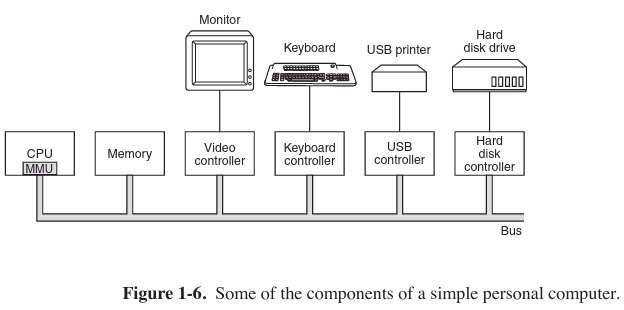
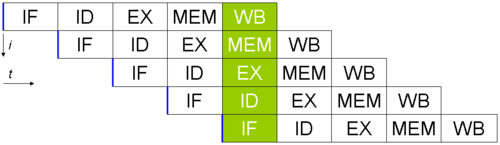
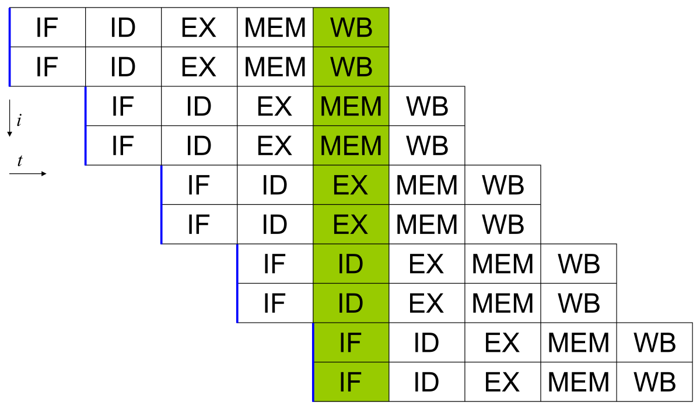

# Operating systems &mdash; What?
Hard to define...all we can say is **s/w that run in kernel mode form the OS**

Does 2 jobs
- Provide clean abstractions to **application programs**
    - OS turn ugly h/w and turn them into beautiful abstractions.
    - why is h/w ugly? Poor h/w devs have their own problems and expose wierd interfaces for reasons like backward compatibility, innovation happening too fast, politics, money ..whatever.
    - Device drivers... one layer of abstraction
    - OS goes ahead and makes it even more beautiful -> everything is a file! even devices
- manage the hardware resources.
    - stuff like time sharing (time multiplexing)
    - allocating resources to processes (space multiplexing)

Both jobs are actually the same thing lol, depends on how you look at it. Top down view => provides abstractions to applications ...Bottom up view => Manages the hardware resources

# History & timeline
### 0. Charles Babbage &mdash; The analytical engine
- The first Digital Computer
- Did not have any s/w, let alone OS.
- Hired Ada Lovelace to write s/w, after "realizing" he needs one &mdash; worlds first programmer

### 1. First Gen &mdash; Vacuum Tubes
- ~ World War II
- Alan turing...
- Collossus, ENIAC, Mark I, Z3
- Programming languages were unheard of
- Assembly langs were unheard of
- No OS

### 2. Second Gen &mdash; Transistors
- 1950s - transisters changed the game, computers were now more reliable, maintainable - Only large corps/govt/Colleges could afford them
- punched cards (FORTRAN or Assembly) - one card - one **job**
- **mainframes**
- batch system - **tray full of jobs** --> converted to a single tape --> tape fed to mainframe --> mainframe outputs another tape --> tape content printed on paper

### 3. Third Gen &mdash; Integrated Circuits
- 1960s....80s
- Some wanted BIIG mainframes for handling scientific stuff like weather forecasting (numerical heavy)<br>
Some wanted BIIG mainframes for stuff like banking, airline reservations (character heavy)<br>
Some wanted smaller computers initially, and later moved to bigger ones
- IBM solved this by "family of compatible computers"<br>
**IBM System/360** ( the lead of this team wrote Mythical Man Month...understand the depth of his pain)
    - Idea is that all s/w (incl the OS) should be able to run on all models of family [ the models differing only in CPU power, RAM etc]
    - There was no way you could write a s/w that runs on all models of the family ( from low power models to high power god models)...... the result was writing a huge Operating System
- **multiprogramming** - absent in 2nd gen
    - Some programs have very low IO (heavy scientific computations), many others have too many IOs...CPU just stays idle
    - in 3rd gen , **memory was partitioned**, one job in each partition...<u>CPU could be kept busy nearly 100% of the time</u>

- they were **batch** systems, nevertheless
    - People found it hard to debug their programs ( that they submitted in the morning, only to get results at night..._shit i forgot a semicolon_)
    - They wanted quick response time
    - **timesharing** - each user now has an "online terminal"
    - MIT's **CTSS**, Compatible Time Sharing System
    - **MULTICS** - too ambitious, they thought they can power the entire Boston population to use one single Mainframe running MULTICS as a timesharing system.
    Though abandoned, this actually came back now as **cloud computing**. not exactly, but ok
- [MULTICS](https://multicians.org/), though abandoned, made very huge advancements which inspired UNIX --> LINUX BSD Solaris MacOS
- ...
- ...
- Rise of **minicomputers**
    - DEC PDP1 ...PDP11
    - Ken Thompson found a PDP7 that was lying around, and tried to write a stripped down , single-user version of MULTICS
    - Since it was _sorta_ open source, people wrote thier own versions of UNIX -- AT&T SystemV and BSD. ....chaos. Interoperability??
    - IEEE developed a standard called **POSIX** to make it possible to write programs that could run on any UNIX system.
    POSIX defined a minimal system call interface


### 4. Fouth Gen &mdash; Personal Computers 
- Moore's law thrived...way too many transistors on cm^2 
- **microcomputers** --> **personal computers**
- not much different from minicomputers....just that PCs were toooo cheap. One office could affort one minicomputer. Now each individual can afford one PC
- 1974 Intel -> 8080 , first general purpose 8bit CPU,...wanted an OS
- Gary Kildall wrote it [ first microcomputer with a disk ]
    - he first wrote a controller to a "floppy disk"
    - then wired it up to the 8080
    - then wrote a disk based OS called CP/M
- 1980s IBM created IBM PC,...wanted an OS
    - they contacted Bill Gates, he redirected to Kildall
    - he refused, so they went back to Gates
    - He found that _some local company_ was already making "Disk Operating System"...he bought it and sold it to IBM...also hired Tim Paterson(DOS creator) from that local company to maintain it
- DOS rebranded as **MS-DOS** ...becomes de facto
- MSDOS was still CLI CLI CLI
- ...
- ...
- Douglas Engelbart's research concluded that GUI is more appealing,..mouse is more appealing.., went on to invent windows,mouse, menus,... 
    - These ideas were picked up by Xerox PARC in their machines
    - Steve Jobs visited PARC, saw GUI... was a m a z e d
    - went on to build **Apple Macintosh**
        - loved by general public who dont know how computers work.
    - CMU was building Mach microkernel to replace BSD UNIX kernel. 
    - Apple decided to use Mach to power macintoshes --> **Mac OS X** 
        - OSX is a UNIX based OS
- Microsoft influenced by macintosh's success, built **Windows**..which ran on top of MS-DOS....for 10 years 
    - **Windows 95**...used DOS only for booting [ 16 bit ]
    - **Windows 98** [16 bit]
    - **Windows NT**  [32 bit] --> renamed **Windows 2000** --> renamed **Windows XP**
    - **Windows Vista**...too hungry for resources, failed.
    - **Windows 7**
    - **Windows 8**...completely changed lookNfeel, geared towards touchscreens
    - **Windows 10**
- Unix, Linux gains traction
    - **X Window System** created for *Nix to give a basic framework for developing GUI
    - DEs like Gnome, KDE created to run on top of Xorg to give Mac/Windows-like experience
- **x86** stands for all the processors from the 8086 era (1970s), 32bit-> x86_32 ...64bit -> x86_64


# Operating System & Hardware


## Processors
_Fetches instructions from memory & executes them_

**CPU cycle**?  How does a program run?
- _fetch_  the  first  instruction from  memory
- _decode_  it  to  determine  its  type  and  operands,  
- _execute_  it
- ...
- ...
- fetch, decode, and execute subsequent instructions...repeat until program ends.

#### Instruction Sets
x86 processor cannot execute ARM programs ...ARM processor cannot execute x86 programs

Each CPU has a [specific set of instructions](https://www.felixcloutier.com/x86/) it can execute.<br>
This instruction "set" includes instructions to LOAD(into registers from memory), STORE(into memory from registers)..and other instructions like ADD

**registers?**<br>
CPU has "general registers" to store variables during execution of an instruction.

**special registers?**
- Program counter (PC)
    - holds the memory address of the next instruction to be fetched.
- Stack Pointer
    - points to the top of the current stack in memory
- PSW- Program Status Word
    - holds condition bits..usermode? kernelmode?

Do registers matter to the OS?<br>
yes, heavily... When time multiplexing the CPU between different programs, OS needs to stop the current running program and restart another program. OS must be able to save all the registers marking the current state of the program...and also be able to load it

#### [Pipelining](https://cs.stanford.edu/people/eroberts/courses/soco/projects/risc/pipelining/index.html)

fetch, decode, execute of instructions <u>one at a time</u> is so inefficient.

Solution? Pipelining <br>

fetch a (N+2)th instruction while its also decoding (N+1)th instruction while the CPU is executing current (Nth) instruction..
Just dont keep any of the 3 units (fetch unit, decode unit, execute unit) idle at any point in time, thats all....Still note that the CPU is able to execute just one instr at a time :(


#### Superscalar Pipelines

Normal pipelines execute the instructions IN ORDER. They load just ONE instr at a time


Superscalar ones take it to next level and have multiple pipelines, and may not execute "independant" instructions in order. They tend to load more than one instr at a time. (2 instr in the pic above)

Multiple execution units also make sure instructions can be executed in parallel


## Memory 
## Disks
## I/O Devices
## Bus


    


 


# Operating systems &mdash; Why?
Just too many things to worry about...device drivers, network interfaces, memory management and a ton of things that the application developer shouldnt be worried about if he wants to deliver on time! - OS needs to take care of it. 

OS needs to provide a nice comfy environment to the **user programs**

**Shell is NOT a part of the OS**

## Kernel Mode & User Mode

OS runs in Kernel mode (aka Supervisor mode)
- has complete access to all h/w
- can execute any instruction on the CPU

Rest of the s/w runs in User Mode
- restricted set of instructions that can be executed

ex: the Shell runs in User mode and can spawn stuff like browsers, vim ..

_Everything that runs in Kernel mode is a part of the Operating System_


# Main Concepts

## IPC &mdash; Inter Process Communication
- Shared Memory < Best >
- Pipes 
- Sockets < worst >

#### Questions to address before selecting an IPC approach
1. Is the communication restricted to related processes?
2. Is the communication
    - read-only?
    - write-only?
    - read-write? 
3. Is the communication just between 2 processes or more?
4. Is the communication Synchronous? ( read blocks read )

### Pipes
- Unidirectional
- Typically used for parent-child communication
- Pipe is created using `pipe()` System call which creates **file descriptors** for reading from `fd[0]` and writing to`fd[1]` that pipe. Data written to the write end of  the  pipe  is  buffered  by  the kernel until it is read from the read end of the pipe
```c 
/** How to create a pipe **/
     int fd[2];
     pipe(fd);
```


 
 


##### What is a named Pipe?


# Questions
- relationship b/w OS and underlying architecture..instruction set...8 bit 16bit 32 bit 64 bit thing
- what is a file desciptor?

