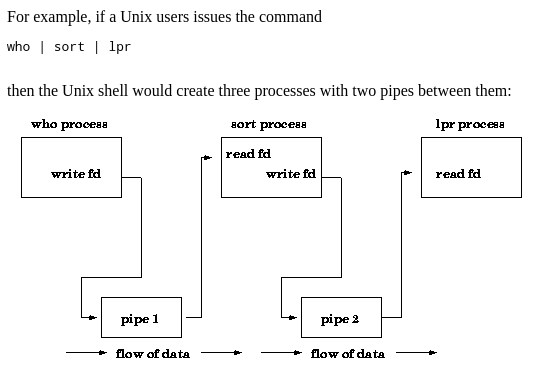
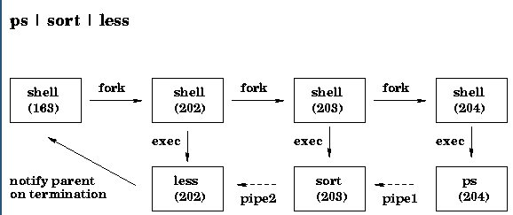

# Main Concepts

## IPC &mdash; Inter Process Communication
- Shared Memory < Best >
- Pipes 
- Sockets < worst >

#### Questions to address before selecting an IPC approach
1. Is the communication restricted to related processes?
2. Is the communication
    - read-only?
    - write-only?
    - read-write? 
3. Is the communication just between 2 processes or more?
4. Is the communication Synchronous? ( read blocks read )

### Pipes
- Unidirectional
- Typically used for parent-child communication
- Pipe is created using `pipe()` System call which creates **file descriptors** for reading from `fd[0]` and writing to`fd[1]` that pipe. Data written to the write end of  the  pipe  is  buffered  by  the kernel until it is read from the read end of the pipe
```c 
/** How to create a pipe **/
     int fd[2];
     pipe(fd);
```


 
 


##### What is a named Pipe?


# Questions
- what is a file desciptor?
