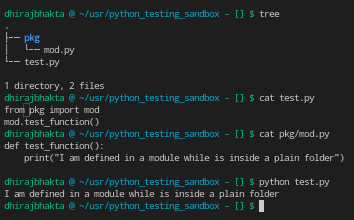
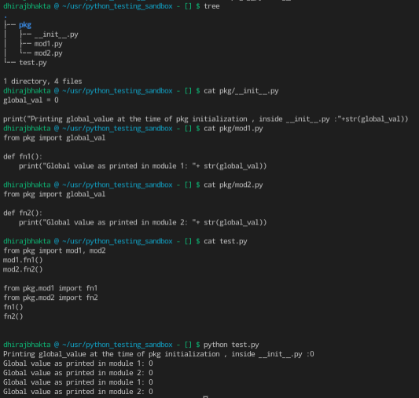
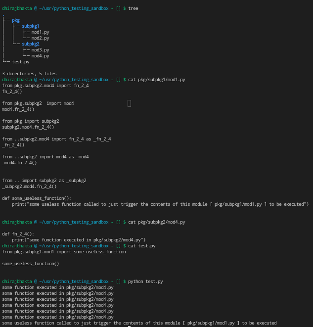

**A script** is a Python file that’s intended to be run directly. When you run it, it should do something. This means that scripts will often contain code written outside the scope of any classes or functions.

**A module** is a Python file that’s intended to be imported into scripts or other modules. It often defines members like classes, functions, and variables intended to be used in other files that import it.

**A package** is a collection of related modules that work together to provide certain functionality. These modules are contained within a folder and can be imported just like any other modules. This folder will often contain a special __init__ file that tells Python it’s a package, potentially containing more modules nested within subfolders

**A library** is an umbrella term that loosely means “a bundle of code.” These can have tens or even hundreds of individual modules that can provide a wide range of functionality. Matplotlib is a plotting library. The Python Standard Library contains hundreds of modules for performing common tasks, like sending emails or reading JSON data. What’s special about the Standard Library is that it comes bundled with your installation of Python, so you can use its modules without having to download them from anywhere.


modules : avoid collisions between global variable names

packages : avoid collisions between module names.
# &#10155; Modules

> "Functions, Modules and Packages promote code modularization in Python"

### What is a module?
**Any** python file is a module

### How to write Modules
- Written in Python itself. (Most common)
- Written in C and **loaded dynamically at run-time**, like the re (regular expression) module. See [Significance of shared libraries](assets/dll.pdf)
or [here](https://cseweb.ucsd.edu/~gbournou/CSE131/the_inside_story_on_shared_libraries_and_dynamic_loading.pdf)

Apart from these, there are "builtin modules" available in the python interpreter directly, eg `itertools`

### How to use modules
The `import` statement

_You can import multiple modules in one line_ `import re, itertools, requests` is valid

#### The module search path 

Where does python look for modules
- `cwd` where the script is invoked....yes, all sibling files are importable modules
- `PYTHONPATH`, if set
- some default dirs. (configured at the time of python installation)

```py
import sys
print(sys.path)  # to see complete list
```

```py
import re
import some_module
print(re.__file__)             # > /usr/lib/python3.9/re.py
print(some_module.__file__)    # > will print the abs path of the module....module is just a file
```
### Module's symbol table
Every module has a **separate namespace** (or symbol table)

Implication?
The statement `import module` only places `module`  in the caller’s symbol table. The objects that are defined in the module remain in the module’s private symbol table. From the caller, objects in the `module` are only accessible when prefixed with "module" via dot notation

&#128161; tip
```py
dir()   # print the module's symbol table

```


### `import X` | `import X as Y` | `from X import y` | `from X import *` | `from X import y as yy` | 
Except for the first two, all other forms
pick out objects from `module` and place them in the caller's symbol table.  (existing objs with same name will be ovewritten)

Note that objects beginning with _ underscore are omiited from import

**`from module import *` is a very bad practice in production**

_There's an alternate import approach , importing inside functions.. dont even think about using this , let it die_


## Executing a module as a script !
What is a "script" tho? Any python file that is **intended** to be <u>executed directly</u> is a script

Why would you want to?

Consider unit testing. you would want to run a test file standalone at times right? at other times, its imported as module into the test package

Every module is a python file, every python file is a script. => a module  can be executed as a script

Consider this python file. Is it a script? module? -- its both. all files are scripts and modules
```py
s = "some random string"
n = 100

def foo(arg):
    print(f'arg = {arg}')

class Foo:
    pass

print(s)
print(n)
foo('quux')
x = Foo()
print(x)
```

Executing it as a script=> will print all those values... but unfortunately, **importing this as a module ALSO prints all this!**

### `if (__name__ == '__main__'):`
Behaves differently when invoked as a script, and when imported as a module

If a file is run as a standalone script, the global variable `__name__` is set to the string "__ main__"

So the things you want to be executed when run as a script, put it inside this block. rest all other stuff are meant to be used while importing this file as a module


### Every module is loaded just once!
No matter how many times you import a module throughout your project, its loaded just once

But a module can contain executable statements as well, usually for initialization. Be aware that these statements will only be executed the first time a module is imported.

```py
import importlib

importlib.reload(some_module)  # to reload a module. 
```
Try to refrain doing ^this


# &#10155;Packages

Why? : to organize and group the modules

Modules help avoid collisions between global variable names, packages help avoid collisions between module names.

### Case1 : plain folder, and modules inside it
No __ init__.py = No Package initialization



Note that there is no "__ init__.py" file.
&#128161; => **Its not compulsory to have an __ init__.py in all packages**

This is also possible
```py
import pkg.mod
pkg.mod.test_function()
```
```py
import pkg.mod as mod
mod.test_function()
```
```py
from pkg.mod import test_function
test_function()
```
```py
from pkg.mod import test_function as imported_function
imported_function()
```

The only thing you cannot do is
```py
import pkg
```

### Case 2.1: Folder with __ init__.py, and other modules 
Uses Package initialization

`__ init__.py`? => this file is executed whenever 
1. the package is imported 
2. one of the modules of the package is imported

This can be the place where you write "package initialization code".

**A module inside the package can also import the attrs defined in __ init__.py** (Global values at the package level)
HIGHLY NOT RECOMMENDED!



But still, you havent reached the ideal `from pkg import X, Y ,Z` where X, Y ,Z are objs in modules, which is what we will solution next

### Case 2.2: Folder with __ init__.py which manually imports all modules' contents inside it
Uses Package Initialization

Infact ABUSES package initialization to quickly import all the modules' contents into itself

```py
# __init__.py of pkg

from .mod1 import *
from .mod2 import *
from .mod3 import *
```
now you reached the ideal `from pkg import X, Y ,Z` where X, Y ,Z are objs in modules

## Subpackages
Same rules of packages, nothing special. You just get creative


Notice the absence of __ init__.py here. its not compulsory :)


This just demonstrated how you can import from another sub package, being in another sub package.
Also showed how to use `..`

This last pic is probably the most important one among all for understanding modules/packages


# Pyinstaller &mdash; a bundler
(Python code + deps ) => single executable

- You dont even need python interpreter to run that executable!

# Questions
- what happens during package install? what is a wheel (whl)? what is a egg?