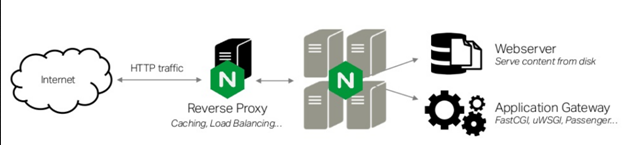

# Application Servers v Web Servers

## history
HTTP was meant to just serve static files. Then it was time to run scripts for every HTTP request and return the output of that script. CGI (Common Gateway Interface) is exactly that. Run a script for a given HTTP request, and die. ...

CGI is just...parsing the HTTP request, converting them into a set of environment variables, loading up a relevant script, running it ...it outputs stuff on STDOUT, return STDOUT as HTTP response. script is ded. done.

Cons..too much overhead for starting up ..running the script, only to kill it..bcos, well...a script ends. 

There was no concept of a continuously "listening" application server. Then who was "listening" to port 80?? Assume some other program , httpd was doing this listening job,..httpd was responsible for picking up the relevant script 

Time to NOT let the script/interpreter die. Time not not spawn a separate process for every request, but instead let the python instance live as a "application server". Time to replace scripts with functions and classes that can be called. Time for WSGI. Need a server which "pre-forks" the a set of processes (workers)(basically just multiple instances of python interpreters) and does intelligent routing of routes to relevant views

https://docs.python.org/2/howto/webservers.html


[Source](https://www.nginx.com/resources/glossary/application-server-vs-web-server/)

**A web server**‘s fundamental job is to accept and fulfill requests(HTTP) from clients for **static content** from a website (HTML pages, files, images, video, and so on)

**An application server**’s fundamental job is to serve business logic...dynamic content;

####  They can work together, behind a reverse proxy 
> In a typical deployment, a website that provides both static and dynamically generated content runs web servers for the static content and application servers to generate content dynamically. A reverse proxy and load balancer sit in front of one or more web servers and one or more web application servers to route traffic to the appropriate server, first based on the type of content requested and then based on the configured load-balancing algorithm. **Most load balancer programs are also reverse proxy servers, which simplifies web application server architecture.**



# WSGI
Web Server Gateway Interface

[Sources](https://wsgi.readthedocs.io/en/latest/learn.html)

https://www.youtube.com/watch?v=WqrCnVAkLIo

https://www.youtube.com/watch?v=UklcIDgHtwQ


### What
Standard interface between web servers and Python web applications or frameworks. WSGI is just an interface, a spec

### Why 
To promote web application portability across a variety of web servers. To facilitate easy interconnection of existing servers and applications or frameworks. To separate the "server" from the "application" so that app devs dont have to worry how their apps are served &mdash; to separate and then connect with a common interface.

_"If I use XYZ framework out of hundred other Python frameworks, will I be limited in my choice for the server? Can I still use Nginx?"_.

### Inspiration &mdash; Java's Servlet API
Java's "servlet" API makes it possible for applications written with any Java web application framework to run in any web server that supports the servlet API.


> But the mere existence of a WSGI spec does nothing to address the existing state of servers and frameworks for Python web applications. Server and framework authors and maintainers must actually implement WSGI for there to be any effect.

WSGI should be _easily implementable_ from both server side and framework side for it to pay off and gain acceptance.

## Gist
```python
  def application(environ, start_response):
        start_response('200 OK',[('Content-type','text/html')])
        return ['<html><body>Hello World!</body></html>']
  
  from wsgiref.simple_server import make_server
  httpd = make_server('localhost', 3000, application)
  httpd.serve_forever()

  from wsgiref.handlers import CGIHandler
  CGIHandler().run(application)

  from flup.server.fcgi import WSGIServer
  WSGIServer(application).run()

  # Notice that just by adhering to a standard, I could use any of these servers

```
The application "registers" a function Fn with server and says, 

"_whenever you get some HTTP request from the client, call this Fn that I gave you with 2 args._
- (environ) a dict containing the request params
    - things like GET
    - things like query params
- (start_response) a callback
    - I, as the application, will call this callback to populate the response headers

be assured that Fn returns response body. Once you have everything, send the response as you like

#### Why start_response just to pass response headers to the server?
The server might want to add a lot of extra headers on top of the ones the application provided

a WSGI application is any callable (in our case, a simple function) taking an environment dictionary and start_response callable as positional parameters. The application should call start_response() with a status code and a list of tuple pairs of headers before it returns an iterable response (in our case, a list with just one string).
## Two sides of WSGI
- "server" or the "gateway" side
- "application" or the "framework" side


### WSGI Servers
[Full List](https://wsgi.readthedocs.io/en/latest/servers.html)

A WSGI server (meaning WSGI compliant) only receives the request from the client, pass it to the application and then send the response returned by the application to the client. It does nothing else. All the gory details must be supplied by the application or middleware.

note that the full list includes 
- gunicorn
- [wsgiref](http://wsgi.tutorial.codepoint.net/intro) ( reference implementation, inbuilt since Python 2.5)
- mod_wsgi ( adapter for use in httpd)
- werkzeug.serving ( the one used in flask's dev server )


### WSGI Applications  
WSGI application is a callable.
`def application(environ, start_response)`

WSGI applications (meaning WSGI compliant) can be stacked. Those in the middle of the stack are called **middleware** and must implement both sides of the WSGI interface, application and server. _For the application in top of it it will behave as a server and for the application (or server) below as an application._ :mindblown:


A middleware acts as the server to an application on one side and acts as the application to another server on other side. WSGI middleware is software that behaves like a server to an application, passing an environ dictionary and start_response callable to the application in the same way a server would. Middleware components also expect the application to return an iterable, such as a list of strings, or to be iterable themselves. Importantly, middleware also behaves like an application to the server, expecting to receive an environ dictionary and start_response callable itself, and returning an iterable back to the server.

```py
    application = SessionMiddleware(application, key='mysession', secret='randomsecret',)
    application = MyStatusMiddleware(application)
    application = MyEnvironMiddleware(application, 'Some Configuration Option')
    #..chain them till youre tired

    from wsgiref.simple_server import make_server
    httpd = make_server('localhost', 3000, application)
    httpd.serve_forever()

    # In a similar way, it's possible to create an entire web-framework stack 
    #   just out of individual WSGI middleware components; 
    #   indeed, the popular Pylons web framework, used to build production sites
    #   worldwide, already takes this approach.
```

Having a stack made entirely from WSGI middleware has a huge advantage: #  developers are free to pick and choose the components they need, or even to replace the parts of the stack they don't like by simply changing which middleware they use. If you've ever tried changing parts of the application stack in other framework architectures, you understand how hard it can sometimes be.


# Questions
- connect the dots between tomcat httpd nginx gunicorn glassfish
  - theres nothing to connect. There are two jobs. one is listening to requests like a retard and not doing much processing on it. Second is taking those "recieved" requests and doing intelligent routing to relevant views. Some do both. some prefer to delegate the first half to heavy weights like Nginx, httpd. But the fact that gunicorn delegates the first half to Nginx, doesnt mean gunicorn cannot do it standalone... Same goes with Tomcat.
  ( a third dimension is the job of spawning workers(python interpreters, separate process) ...its called "pre-forking". "Application servers" like gunicorn do this job)

  Still not convinced? https://www.youtube.com/watch?v=UklcIDgHtwQ
